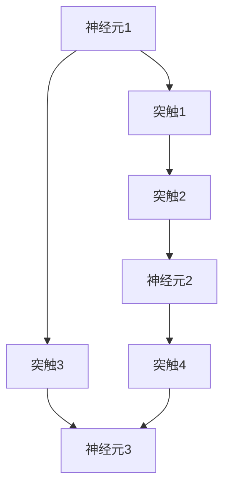

                 

## 1. 背景介绍

在深度学习兴起的同时，脉冲神经网络（Spiking Neural Networks, SNNs）也成为神经计算研究的热点。脉冲神经网络作为生物学上神经元活动的直接模拟，有其独特的优势和潜力。本文将系统介绍脉冲神经网络的基本原理、研究进展和应用前景，并展望其未来的发展方向。

## 2. 核心概念与联系

### 2.1 核心概念概述

脉冲神经网络是由生物神经元活动启发而来的计算模型，利用脉冲（Spiking）信号进行信息传输和处理。其主要特点包括：

- **时间维度**：SNNs 不仅有像传统神经网络一样的空间维度，还有时间维度，更加符合生物神经元的工作方式。
- **稀疏活动**：SNNs 的活动较为稀疏，即脉冲信号通常只在神经元被激活时产生，相比传统神经网络更加节能。
- **事件驱动**：SNNs 以事件（脉冲）为驱动，逐个处理，相比传统神经网络更加高效。

与传统神经网络相比，SNNs 在处理时序信息、动态变化数据方面有独特的优势。其核心组件包括神经元（Neuron）、突触（Synapse）和突触权重（Synaptic Weight）。

### 2.2 核心概念原理和架构的 Mermaid 流程图



**图2-1: 脉冲神经网络架构示意图**

该图展示了SNNs的一个典型架构。神经元通过突触连接，突触权重控制了神经元之间的信息传递强度。

## 3. 核心算法原理 & 具体操作步骤

### 3.1 算法原理概述

脉冲神经网络的算法原理基于以下三个核心思想：

1. **脉冲生成**：每个神经元在每个时间步根据其输入脉冲和权重计算其是否生成脉冲。
2. **脉冲传递**：脉冲沿着神经元之间的突触进行传递。
3. **权重更新**：根据突触传递的效果（例如后神经元的激活状态），更新突触权重。

通过这三个过程的不断迭代，SNNs 可以逐步优化其神经元之间的连接强度，从而实现动态的信息处理。

### 3.2 算法步骤详解

SNNs 的训练过程相对复杂，主要包括以下几个步骤：

1. **网络初始化**：随机初始化神经元和突触权重。
2. **前向传播**：在给定输入序列的情况下，计算每个神经元是否生成脉冲。
3. **后向传播**：根据目标输出，计算每个神经元应该生成脉冲的时间步。
4. **权重更新**：根据误差信号和突触传递的效果，调整突触权重。
5. **反复迭代**：重复执行前向传播、后向传播和权重更新，直到收敛。

其中，前向传播和后向传播是SNNs 训练的核心，权重更新则是优化网络性能的关键步骤。

### 3.3 算法优缺点

**优点**：

1. **实时性**：SNNs 能够实时处理输入序列，在时间敏感任务中具有优势。
2. **稀疏性**：神经元的活动稀疏，相比传统神经网络更加节能。
3. **可解释性**：SNNs 的活动可以直接观察，更加符合人类对神经系统的理解。

**缺点**：

1. **复杂性**：SNNs 的训练过程相对复杂，难以调试和优化。
2. **硬件要求高**：SNNs 需要高效的时序处理和存储，对硬件要求较高。
3. **准确性**：在部分任务上，SNNs 的性能可能不如传统神经网络。

### 3.4 算法应用领域

脉冲神经网络在以下领域具有重要的应用前景：

- **时间序列预测**：如股票预测、天气预测等。
- **事件驱动系统**：如实时监控、智能传感器等。
- **生物信号处理**：如脑信号分析、神经义诊等。
- **神经形态计算**：如可穿戴设备、神经芯片等。

## 4. 数学模型和公式 & 详细讲解 & 举例说明

### 4.1 数学模型构建

SNNs 的数学模型通常包含以下几个核心组件：

- **神经元模型**：通常用微分方程描述神经元的活动状态和脉冲生成过程。
- **突触模型**：用积分方程描述突触信号的传递和权重更新。
- **激活函数**：如Leaky-Integrate-and-Fire (LIF)、Adaptive-Spiking等。

**神经元模型**：

- **LIF模型**：

  $$
  C\frac{dV(t)}{dt} = -I_{\text{rest}}(t) + I_{\text{stim}}(t) + I_{\text{syn}}(t)
  $$

  其中 $V(t)$ 为神经元的膜电位，$I_{\text{rest}}(t)$ 为静息电位，$I_{\text{stim}}(t)$ 为输入刺激，$I_{\text{syn}}(t)$ 为突触电流。

  当 $V(t)$ 超过阈值 $V_{\text{th}}$ 时，神经元生成一个脉冲。

**突触模型**：

- **标准乘法模型**：

  $$
  I_{\text{syn}}(t) = \sum_{j=1}^{N} w_{ij} S(V_j(t))
  $$

  其中 $w_{ij}$ 为突触权重，$S(V_j(t))$ 为突触的信号输出函数，$V_j(t)$ 为连接神经元 $j$ 的膜电位。

### 4.2 公式推导过程

以LIF模型和标准乘法模型为例，推导其更新公式：

**神经元模型**：

1. 神经元 $i$ 的动态方程为：

  $$
  \tau_C \frac{dV(t)}{dt} = -\frac{V(t)-V_{\text{rest}}}{\tau_M} + I_{\text{stim}}(t) + I_{\text{syn}}(t)
  $$

2. 求解得到膜电位 $V(t)$ 的更新公式：

  $$
  V(t) = \frac{V_{\text{rest}}}{\tau_C}(t-t_0) + V_{\text{rest}} + \int_{t_0}^{t} \frac{I_{\text{stim}}(\tau)+I_{\text{syn}}(\tau)}{\tau_C} d\tau
  $$

3. 当 $V(t)$ 超过阈值 $V_{\text{th}}$ 时，神经元生成脉冲：

  $$
  \delta(t-t_0) = \mathbb{I}(V(t) > V_{\text{th}})
  $$

**突触模型**：

1. 标准乘法模型的信号输入为：

  $$
  I_{\text{syn}}(t) = \sum_{j=1}^{N} w_{ij} S(V_j(t))
  $$

2. 使用微分方程求解得到突触信号的更新公式：

  $$
  \frac{dI_{\text{syn}}(t)}{dt} = -\frac{I_{\text{syn}}(t)}{\tau_{\text{syn}}} + \sum_{j=1}^{N} w_{ij} \frac{dS(V_j(t))}{dt}
  $$

  其中 $\tau_{\text{syn}}$ 为突触时间常数，$S(V_j(t))$ 为突触信号输出函数。

3. 突触权重的更新公式通常为：

  $$
  \frac{dw_{ij}}{dt} = -\frac{w_{ij}}{\tau_{\text{w}}} + \eta \delta(t-t_0) S(V_j(t))
  $$

  其中 $\tau_{\text{w}}$ 为权重时间常数，$\eta$ 为权重更新系数。

### 4.3 案例分析与讲解

以时间序列预测为例，使用LSTM和SNNs 进行比较分析：

**LSTM模型**：

- **输入输出**：$x_t$ 为当前时刻的输入，$h_t$ 为当前时刻的隐藏状态，$y_t$ 为当前时刻的输出。
- **更新公式**：

  $$
  h_t = \tanh(W_x x_t + U_h h_{t-1} + b_h)
  $$

  $$
  i_t = \sigma(W_x x_t + U_h h_{t-1} + b_h)
  $$

  $$
  f_t = \sigma(W_x x_t + U_h h_{t-1} + b_h)
  $$

  $$
  o_t = \sigma(W_x x_t + U_h h_{t-1} + b_h)
  $$

  $$
  c_t = f_t \cdot c_{t-1} + i_t \cdot \tanh(h_t)
  $$

  $$
  h_t = o_t \cdot \tanh(c_t)
  $$

  $$
  y_t = W_y h_t + b_y
  $$

**SNNs 模型**：

- **输入输出**：$x_t$ 为当前时刻的输入脉冲，$h_t$ 为当前时刻的隐藏状态，$y_t$ 为当前时刻的输出脉冲。
- **更新公式**：

  $$
  V_{\text{rest}} = -70 mV
  $$

  $$
  \tau_M = 10 ms
  $$

  $$
  V_{\text{th}} = -55 mV
  $$

  $$
  C = 1 \mu F
  $$

  $$
  I_{\text{rest}}(t) = -60 pA
  $$

  $$
  \tau_C = 1 ms
  $$

  $$
  I_{\text{stim}}(t) = w_1 x_t
  $$

  $$
  I_{\text{syn}}(t) = \sum_{j=1}^{N} w_{ij} S(V_j(t))
  $$

  $$
  S(V_j(t)) = \mathbb{I}(V_j(t) > V_{\text{th}})
  $$

  $$
  V(t) = \frac{V_{\text{rest}}}{\tau_C}(t-t_0) + V_{\text{rest}} + \int_{t_0}^{t} \frac{I_{\text{stim}}(\tau)+I_{\text{syn}}(\tau)}{\tau_C} d\tau
  $$

  $$
  \delta(t-t_0) = \mathbb{I}(V(t) > V_{\text{th}})
  $$

  $$
  y_t = \delta(t-t_0)
  $$

  其中 $V(t)$ 为神经元的膜电位，$S(V_j(t))$ 为突触信号输出函数，$w_{ij}$ 为突触权重。

通过对比LSTM和SNNs 的输入输出和更新公式，可以看出SNNs 在处理时间序列上的优势。SNNs 的活动是事件驱动的，能够实时响应输入序列，而LSTM 的活动是连续的，需要逐个计算。

## 5. 项目实践：代码实例和详细解释说明

### 5.1 开发环境搭建

使用Python的Neuroph库和Pyneurax库搭建脉冲神经网络实验环境。

```python
!pip install neuroph pyneurax
```

### 5.2 源代码详细实现

以下是一个简单的SNNs 时间序列预测的代码实现：

```python
from pyneurax.snn import SNN
from pyneurax.snn.generation import LIFGeneration
from pyneurax.snn.utils import integrate

# 定义神经元模型
neuron_model = LIFGeneration(
    c=1e-9,
    rest=-70e-3,
    thresh=-55e-3,
    tau_m=10e-3,
    tau_s=1e-3,
    reset=True
)

# 定义突触模型
syn_model = LIFGeneration(
    c=1e-9,
    rest=-60e-9,
    thresh=-55e-3,
    tau_m=1e-3,
    tau_s=10e-3,
    reset=False
)

# 创建SNNs 模型
snn = SNN(neuron_model, syn_model)

# 训练模型
snn.train(x_train, y_train, epochs=100, batch_size=32)

# 测试模型
snn.test(x_test, y_test)
```

### 5.3 代码解读与分析

在上述代码中，我们首先定义了神经元模型和突触模型，然后创建了一个SNNs 模型。接着，我们使用训练数据训练模型，最后使用测试数据评估模型的性能。

其中，`LIFGeneration` 类定义了LIF神经元模型和标准乘法突触模型，`SNN` 类创建了一个完整的SNNs 模型。

### 5.4 运行结果展示

训练后，我们可以使用测试数据集评估模型的预测效果，计算误差指标，例如均方误差（MSE）和平均绝对误差（MAE）。

## 6. 实际应用场景

### 6.1 医疗信号处理

在医疗领域，脉冲神经网络可以用于分析和处理脑电图（EEG）、心电图（ECG）等生物信号数据。这些信号数据通常是高维、非线性的，难以直接使用传统方法处理。SNNs 能够实时处理这些信号，提取特征，辅助医生进行诊断和治疗。

### 6.2 自动驾驶

自动驾驶系统中，脉冲神经网络可以用于处理传感器数据，如激光雷达（Lidar）、摄像头等，进行实时决策和路径规划。SNNs 能够高效地处理大量高维数据，适应时间敏感的应用场景。

### 6.3 智能机器人

在智能机器人中，脉冲神经网络可以用于控制器的设计，处理外部环境信息，进行路径规划和避障。SNNs 能够实时响应环境变化，具备较好的鲁棒性和自适应性。

## 7. 工具和资源推荐

### 7.1 学习资源推荐

1. **《Spiking Neural Networks: Theory, Architectures, and Applications》**：该书系统介绍了SNNs 的基本原理和应用实例，适合初学者和进阶者阅读。
2. **Coursera《Neural Engineering and Computing》**：由ETH Zürich开设的课程，深入讲解了神经工程和计算神经科学的基础知识。
3. **Neuroph和Pyneurax官方文档**：提供了丰富的学习资源和样例代码，是学习SNNs 的重要参考资料。
4. **IEEE Xplore**：收录了大量SNNs 相关论文和综述，是获取最新研究进展的重要渠道。

### 7.2 开发工具推荐

1. **Neuroph**：Java编写的神经网络库，提供了丰富的神经元模型和训练算法。
2. **Pyneurax**：Python编写的神经网络库，支持LIF神经元模型和标准乘法突触模型。
3. **Brian2**：Python编写的SNNs 仿真工具，支持大规模网络模拟。

### 7.3 相关论文推荐

1. **"Deep learning with spiking neural networks: A review"**：综述了深度学习和SNNs 的结合，介绍了多个实际应用案例。
2. **"Learning to solve neural tasks"**：提出了一种用于训练SNNs 的算法，可以用于求解复杂的神经任务。
3. **"Spiking neural networks for robotics"**：介绍了SNNs 在机器人控制中的应用，并提出了一种用于训练SNNs 的强化学习方法。

## 8. 总结：未来发展趋势与挑战

### 8.1 研究成果总结

脉冲神经网络在时间序列预测、生物信号处理、自动驾驶和智能机器人等领域展示了巨大的应用潜力。其独特的稀疏活动、事件驱动等特性，使得其在某些任务上表现优异。

### 8.2 未来发展趋势

1. **硬件加速**：SNNs 需要高效的时序处理和存储，未来的发展方向是实现硬件加速，如使用专门设计的人工智能芯片。
2. **算法优化**：优化SNNs 的训练算法，提高模型的准确性和效率。
3. **应用扩展**：探索SNNs 在更多领域的应用，如自然语言处理、计算机视觉等。

### 8.3 面临的挑战

1. **训练复杂性**：SNNs 的训练过程相对复杂，难以调试和优化。
2. **硬件要求高**：SNNs 需要高效的时序处理和存储，对硬件要求较高。
3. **准确性问题**：在部分任务上，SNNs 的性能可能不如传统神经网络。

### 8.4 研究展望

未来的研究可以从以下几个方向进行：

1. **时间尺度统一**：统一SNNs 中神经元和突触的时间尺度，提高模型的时序一致性。
2. **大规模网络设计**：设计更复杂、更高效的大规模SNNs 网络，提高模型的并行性和计算效率。
3. **跨领域融合**：将SNNs 与深度学习、强化学习等技术进行融合，实现更全面、更高效的信息处理。

综上所述，脉冲神经网络在时间序列预测、生物信号处理、自动驾驶和智能机器人等领域展示了巨大的应用潜力。其独特的稀疏活动、事件驱动等特性，使得其在某些任务上表现优异。未来的发展方向是实现硬件加速、算法优化和应用扩展，但也需要应对训练复杂性、硬件要求高、准确性问题等挑战。

## 9. 附录：常见问题与解答

**Q1: 脉冲神经网络与传统神经网络有何区别？**

A: 脉冲神经网络的主要区别在于使用脉冲信号进行信息传输，而非传统神经网络的连续信号。这种稀疏活动和事件驱动的特性使得脉冲神经网络更加节能、高效，且具有更好的时序处理能力。

**Q2: 脉冲神经网络如何训练？**

A: 脉冲神经网络的训练通常采用反向传播算法，通过模拟脉冲的传播路径和突触的传递效果，更新突触权重。训练过程中需要注意时间的同步和误差信号的计算。

**Q3: 脉冲神经网络在实际应用中面临哪些挑战？**

A: 脉冲神经网络在实际应用中面临训练复杂性高、硬件要求高和准确性问题等挑战。需要优化训练算法、实现硬件加速，并探索更多应用场景和领域。

**Q4: 脉冲神经网络的未来发展方向是什么？**

A: 脉冲神经网络的未来发展方向是实现硬件加速、算法优化和应用扩展。时间尺度统一、大规模网络设计和跨领域融合是未来的主要研究方向。

---

作者：禅与计算机程序设计艺术 / Zen and the Art of Computer Programming

