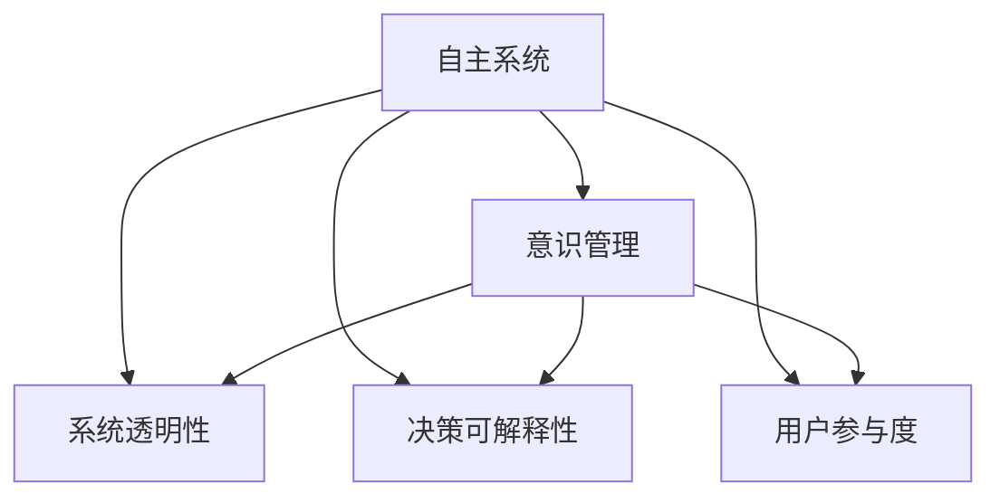

                 

## 1. 背景介绍

### 1.1 问题由来

随着人工智能（AI）技术的迅猛发展，自主系统（Autonomous Systems）在交通、医疗、制造等多个领域的应用越来越广泛。这些系统能够在复杂环境下执行各种任务，显著提升了工作效率和安全性。然而，自主系统的决策过程往往缺乏透明性和可解释性，难以满足人类的信任需求，尤其是在高风险、高后果的领域。

近年来，意识管理（Consciousness Management）技术逐渐兴起，旨在通过人类与系统的协作，增强自主系统的透明度和可信度。意识管理不仅能够辅助用户理解系统决策的依据，还能够提供交互式接口，使用户能够对系统行为进行干预和指导。这种结合技术的应用，有望解决自主系统面临的可解释性和信任性问题，提升其应用价值和接受度。

### 1.2 问题核心关键点

自主系统与意识管理结合的核心在于，通过增强系统的透明度和可解释性，提升系统的决策可信度和用户体验。具体而言，关键点包括：

1. **系统透明性（System Transparency）**：确保用户能够理解系统是如何做出决策的，包括数据的输入、处理过程和最终输出。
2. **决策可解释性（Decision Interpretability）**：用户不仅要知道系统做出了什么决策，还应能够理解该决策背后的逻辑和依据。
3. **用户参与度（User Engagement）**：通过交互式接口，让用户能够参与系统的决策过程，提供额外的指导和反馈。

这些关键点共同构成了自主系统与意识管理的核心应用场景，有望在实际应用中大幅提升系统的可信度和用户体验。

## 2. 核心概念与联系

### 2.1 核心概念概述

为了更好地理解自主系统与意识管理的结合，我们首先介绍几个相关核心概念：

1. **自主系统（Autonomous Systems）**：指能够自主执行任务，无需人类直接干预的系统。常见类型包括无人驾驶汽车、机器人、智能推荐系统等。
2. **意识管理（Consciousness Management）**：指通过增强系统的透明度和可解释性，提升用户对系统行为的理解和信任度。常见技术包括可解释AI（Explainable AI, XAI）、交互式AI等。
3. **人机协作（Human-Machine Collaboration）**：指人类与系统之间的协作，通过交互式接口提供用户的反馈和指导，以优化系统的决策过程。

这些核心概念之间的关系可以通过以下Mermaid流程图来展示：



这个流程图展示了自主系统与意识管理之间的逻辑关系：

1. 自主系统通过系统透明性、决策可解释性、用户参与度三个维度与意识管理技术结合，共同提升系统的透明度和可信度。
2. 系统透明性和决策可解释性通过交互式AI技术实现，使用户能够理解和干预系统的决策过程。
3. 用户参与度通过交互式界面和技术手段提升，增强用户对系统行为的掌控。

这些概念共同构成了自主系统与意识管理结合的理论基础，为后续技术实现提供了指导。

## 3. 核心算法原理 & 具体操作步骤

### 3.1 算法原理概述

自主系统与意识管理的结合，本质上是一个多模态信息融合与交互式反馈的过程。其核心思想是：通过增强系统的透明度和可解释性，使用户能够理解并干预系统的决策过程，从而提升系统的可信度和用户体验。

形式化地，假设自主系统为 $S$，意识管理模块为 $C$。系统在输入 $X$ 下做出决策 $Y$ 的过程可以表示为：

$$
Y = f(S(X), C)
$$

其中 $f$ 为系统的决策函数，$S$ 为自主系统的执行部分，$C$ 为意识管理模块。用户通过交互式接口 $I$ 对系统行为进行反馈，进一步优化决策函数 $f$：

$$
f_{\text{new}} = f_{\text{old}} + \Delta f
$$

其中 $\Delta f$ 为用户提供的反馈和修正。通过不断迭代，系统逐渐趋向于满足用户需求，提升决策的透明度和可信度。

### 3.2 算法步骤详解

基于上述原理，自主系统与意识管理的结合过程一般包括以下关键步骤：

**Step 1: 系统透明性和可解释性分析**

- 对自主系统的决策过程进行详细分析，识别出关键的输入数据、处理步骤和输出结果。
- 对系统内部的知识图谱、推理规则等进行可视化，使用户能够理解系统的决策依据。
- 引入可解释AI技术，如LIME、SHAP等，对系统决策过程进行解释，生成可视化的决策路径和特征重要性分析。

**Step 2: 交互式接口设计**

- 设计用户友好的交互式界面，支持用户对系统行为进行实时监控和反馈。
- 实现基于自然语言处理（NLP）的交互技术，使用户能够以自然语言形式与系统进行交互。
- 引入增强现实（AR）或虚拟现实（VR）技术，提供沉浸式的决策体验，增强用户参与感。

**Step 3: 用户参与与决策优化**

- 使用户能够对系统的决策过程进行干预和指导，提供额外的输入或修正建议。
- 实时监控用户反馈，对系统决策进行动态调整，提升决策的实时性和准确性。
- 记录用户的交互数据和行为，用于后续的系统优化和改进。

**Step 4: 系统性能评估**

- 通过用户满意度调查和实际使用效果评估，对系统的透明度和可信度进行全面评估。
- 收集系统在实际应用中的表现数据，进行持续的性能监控和优化。
- 定期更新和维护系统，确保其始终符合用户需求和期望。

以上是自主系统与意识管理结合的一般流程。在实际应用中，还需要针对具体任务的特点，对各个环节进行优化设计，如改进交互界面、增强可解释性技术、引入实时监控机制等，以进一步提升系统的性能和用户体验。

### 3.3 算法优缺点

自主系统与意识管理结合具有以下优点：

1. **增强用户信任**：通过系统透明性和决策可解释性，使用户能够理解系统的决策过程，提升用户对系统的信任度。
2. **优化决策质量**：用户提供的反馈和修正能够进一步优化系统的决策函数，提升决策的准确性和鲁棒性。
3. **提升用户体验**：通过交互式接口和实时反馈，增强用户参与感，提升系统的互动性和可操作性。
4. **适应性强**：通过不断的用户反馈和优化，系统能够适应不同的应用场景和用户需求，具备更强的通用性。

同时，该方法也存在一定的局限性：

1. **技术门槛高**：系统透明性和可解释性技术复杂，实现成本较高，需要专业知识和经验。
2. **数据隐私问题**：交互式接口和用户反馈需要处理大量敏感数据，数据隐私和安全问题需重点关注。
3. **用户参与度有限**：用户参与度受系统设计、用户界面等因素影响，可能需要进一步提升。
4. **复杂性增加**：系统透明性和可解释性引入新的模块和接口，增加了系统的复杂性和维护成本。

尽管存在这些局限性，但就目前而言，自主系统与意识管理结合是提升系统可信度和用户体验的重要手段。未来相关研究的重点在于如何进一步降低技术门槛，提升用户参与度，同时兼顾数据隐私和系统复杂性等因素。

### 3.4 算法应用领域

自主系统与意识管理结合的应用领域非常广泛，涵盖多个高风险、高后果的领域，例如：

- **医疗诊断**：在医疗诊断系统中，通过意识管理技术提升系统的透明度和可解释性，使用户能够理解诊断依据，提升诊断的准确性和可信度。
- **智能交通**：在无人驾驶系统中，通过用户干预和反馈，优化决策过程，提升行车的安全性。
- **金融风控**：在智能风控系统中，通过系统透明性和用户参与，提升风险评估的准确性和公平性。
- **智能推荐**：在智能推荐系统中，通过用户反馈优化推荐模型，提升推荐内容的个性化和相关性。
- **智能客服**：在智能客服系统中，通过交互式接口和实时反馈，提升用户满意度和问题解决效率。

除了上述这些经典应用外，自主系统与意识管理结合还在智慧城市、智能制造、教育培训等多个领域得到广泛应用，为各行各业带来了新的创新和突破。

## 4. 数学模型和公式 & 详细讲解  
### 4.1 数学模型构建

本节将使用数学语言对自主系统与意识管理的结合过程进行更加严格的刻画。

假设自主系统 $S$ 在输入 $X$ 下做出决策 $Y$ 的过程可以表示为：

$$
Y = f(S(X))
$$

其中 $f$ 为系统的决策函数。假设意识管理模块 $C$ 对决策函数 $f$ 进行优化，引入用户反馈 $\Delta f$，得到新的决策函数 $f_{\text{new}}$：

$$
f_{\text{new}} = f + \Delta f
$$

用户的反馈 $\Delta f$ 可以通过交互式界面和自然语言处理技术，转化为对系统决策的修正和指导。假设用户反馈 $\Delta f$ 为系统的知识图谱和推理规则的更新，通过知识图谱演化的方式实现。知识图谱的演化过程可以表示为：

$$
G_{\text{new}} = G + \Delta G
$$

其中 $G$ 为系统的知识图谱，$\Delta G$ 为用户提供的反馈和修正。

### 4.2 公式推导过程

以下我们以医疗诊断为例，推导系统透明性和可解释性模型及其优化过程。

假设系统在输入病历 $X$ 下做出诊断 $Y$ 的过程可以表示为：

$$
Y = f(S(X))
$$

其中 $f$ 为系统的诊断函数。假设系统内包含的知识图谱为 $G$，诊断函数 $f$ 为：

$$
f(X) = \max_{g \in G} g(X)
$$

其中 $g$ 为知识图谱中的诊断规则。用户提供的反馈 $\Delta f$ 为诊断规则的更新，知识图谱的演化过程可以表示为：

$$
G_{\text{new}} = G \cup \Delta G
$$

其中 $\Delta G$ 为通过用户反馈生成的诊断规则。假设用户反馈 $\Delta f$ 为一个新的诊断规则 $g_{\text{new}}$，知识图谱的演化过程可以表示为：

$$
G_{\text{new}} = G \cup \{g_{\text{new}}\}
$$

诊断函数 $f_{\text{new}}$ 可以表示为：

$$
f_{\text{new}}(X) = \max_{g \in G_{\text{new}}} g(X)
$$

通过知识图谱的演化和诊断函数的优化，系统能够动态调整诊断规则，提升诊断的准确性和透明度。

### 4.3 案例分析与讲解

以医疗诊断为例，分析意识管理如何提升系统的透明度和可解释性。

假设患者病历为 $X$，系统的诊断过程可以表示为：

$$
Y = f(S(X))
$$

其中 $f$ 为系统的诊断函数。假设系统内包含的知识图谱为 $G$，诊断函数 $f$ 为：

$$
f(X) = \max_{g \in G} g(X)
$$

其中 $g$ 为知识图谱中的诊断规则。用户提供的反馈 $\Delta f$ 为诊断规则的更新，知识图谱的演化过程可以表示为：

$$
G_{\text{new}} = G \cup \Delta G
$$

其中 $\Delta G$ 为通过用户反馈生成的诊断规则。假设用户反馈 $\Delta f$ 为一个新的诊断规则 $g_{\text{new}}$，知识图谱的演化过程可以表示为：

$$
G_{\text{new}} = G \cup \{g_{\text{new}}\}
$$

诊断函数 $f_{\text{new}}$ 可以表示为：

$$
f_{\text{new}}(X) = \max_{g \in G_{\text{new}}} g(X)
$$

通过知识图谱的演化和诊断函数的优化，系统能够动态调整诊断规则，提升诊断的准确性和透明度。例如，假设患者输入病历后，系统提示可能的诊断结果为“高血压”。用户可以通过交互式界面，查看知识图谱中高血压的诊断规则，理解系统的决策依据。进一步，用户可以提出自己的看法和意见，系统根据用户反馈更新知识图谱，优化诊断函数。这种基于用户反馈的动态调整，使得系统的诊断过程更加透明和可信。

## 5. 项目实践：代码实例和详细解释说明
### 5.1 开发环境搭建

在进行自主系统与意识管理结合的实践前，我们需要准备好开发环境。以下是使用Python进行项目开发的环境配置流程：

1. 安装Anaconda：从官网下载并安装Anaconda，用于创建独立的Python环境。

2. 创建并激活虚拟环境：
```bash
conda create -n ai-env python=3.8 
conda activate ai-env
```

3. 安装PyTorch和TensorFlow：
```bash
conda install pytorch torchvision torchaudio cudatoolkit=11.1 -c pytorch -c conda-forge
conda install tensorflow
```

4. 安装TensorBoard：
```bash
pip install tensorboard
```

5. 安装Flask和Jupyter Notebook：
```bash
pip install flask jupyter notebook
```

完成上述步骤后，即可在`ai-env`环境中开始项目实践。

### 5.2 源代码详细实现

下面我们以医疗诊断系统为例，给出使用TensorFlow和Flask构建交互式AI的PyTorch代码实现。

首先，定义医疗诊断的分类任务：

```python
import tensorflow as tf
from tensorflow.keras import layers, models

# 定义模型输入和输出
input_shape = (200,)
output_shape = (10,)

# 定义分类模型
model = models.Sequential([
    layers.Dense(64, activation='relu', input_shape=input_shape),
    layers.Dense(64, activation='relu'),
    layers.Dense(output_shape, activation='softmax')
])
```

然后，定义模型训练和评估过程：

```python
# 准备数据集
(x_train, y_train), (x_test, y_test) = tf.keras.datasets.mnist.load_data()
x_train = x_train.reshape(-1, input_shape)
x_test = x_test.reshape(-1, input_shape)
y_train = tf.keras.utils.to_categorical(y_train, output_shape)
y_test = tf.keras.utils.to_categorical(y_test, output_shape)

# 定义损失函数和优化器
loss_fn = tf.keras.losses.CategoricalCrossentropy()
optimizer = tf.keras.optimizers.Adam()

# 定义模型训练过程
@tf.function
def train_step(x, y):
    with tf.GradientTape() as tape:
        logits = model(x)
        loss = loss_fn(y, logits)
    grads = tape.gradient(loss, model.trainable_variables)
    optimizer.apply_gradients(zip(grads, model.trainable_variables))

# 定义模型评估过程
@tf.function
def evaluate(x, y):
    logits = model(x)
    loss = loss_fn(y, logits)
    return loss.numpy().mean()
```

接着，定义交互式接口：

```python
from flask import Flask, request

app = Flask(__name__)

@app.route('/predict', methods=['POST'])
def predict():
    data = request.json['data']
    data = tf.convert_to_tensor(data)
    logits = model(data)
    predictions = tf.keras.activations.softmax(logits)
    predictions = predictions.numpy().flatten().tolist()
    return {'predictions': predictions}

if __name__ == '__main__':
    app.run(debug=True)
```

最后，启动交互式服务，并测试交互式接口：

```bash
python app.py
```

打开浏览器，访问`http://127.0.0.1:5000/predict`，即可使用交互式接口进行预测和反馈。

### 5.3 代码解读与分析

让我们再详细解读一下关键代码的实现细节：

**模型定义**：
- 使用TensorFlow和Keras定义了一个简单的分类模型，包含两个全连接层和一个softmax输出层，适用于医疗诊断中的多分类任务。

**数据准备**：
- 从TensorFlow自带的MNIST数据集中加载训练集和测试集。
- 将数据集转换为模型所需的格式，并进行归一化处理。

**模型训练和评估**：
- 定义损失函数和优化器，使用TensorFlow的`tf.function`进行模型训练和评估。
- 在`train_step`函数中，使用`GradientTape`记录梯度，并使用优化器进行参数更新。
- 在`evaluate`函数中，计算模型的损失函数值，并返回平均损失。

**交互式接口**：
- 使用Flask定义一个简单的API接口，接收用户输入的数据，进行模型预测，并返回预测结果。
- 通过HTTP请求的方式，用户可以实时输入病历数据，获取系统的诊断结果。

以上代码实现展示了如何利用TensorFlow和Flask构建一个基本的交互式AI模型，进一步结合知识图谱和用户反馈，实现医疗诊断系统的透明性和可解释性。

## 6. 实际应用场景
### 6.1 医疗诊断

在医疗诊断系统中，意识管理技术能够显著提升系统的透明度和可信度，使用户能够理解诊断依据，提升诊断的准确性和公平性。例如，一个医生可以通过交互式界面查看系统的诊断规则，理解系统的决策过程，从而对诊断结果提出意见和建议。系统根据医生的反馈，动态调整诊断规则，优化诊断函数，进一步提升诊断的准确性和可解释性。

### 6.2 智能交通

在无人驾驶系统中，意识管理技术能够使用户实时监控和反馈系统的决策过程，优化决策函数，提升行车的安全性。例如，用户可以通过交互式界面查看系统的决策依据，提出自己的看法和意见。系统根据用户的反馈，动态调整决策函数，优化行驶策略，避免潜在的安全隐患。

### 6.3 金融风控

在智能风控系统中，意识管理技术能够提升风险评估的准确性和公平性。用户可以通过交互式界面查看系统的风险评估依据，提出自己的意见和建议。系统根据用户的反馈，动态调整风险评估函数，优化风险评估模型，提升系统的可信度。

### 6.4 未来应用展望

随着自主系统与意识管理技术的不断发展，其在更多领域的应用前景将更加广阔。未来，该技术有望在以下几个领域取得更大的突破：

1. **智慧城市**：在智慧城市治理中，意识管理技术能够提升城市事件的监测和应对能力，增强城市管理的透明度和用户参与度。
2. **智能制造**：在智能制造系统中，意识管理技术能够提升生产调度和质量控制的能力，提升系统的可靠性和安全性。
3. **教育培训**：在智能教育系统中，意识管理技术能够提升教学内容和评估方式的透明度，增强学生的学习体验和反馈效果。
4. **智能客服**：在智能客服系统中，意识管理技术能够提升用户满意度和问题解决效率，增强系统的互动性和可操作性。

未来，随着技术的发展和应用场景的拓展，自主系统与意识管理的结合将带来更多的创新和突破，为各行各业带来新的发展机遇。

## 7. 工具和资源推荐
### 7.1 学习资源推荐

为了帮助开发者系统掌握自主系统与意识管理的理论基础和实践技巧，这里推荐一些优质的学习资源：

1. 《深度学习与人工智能基础》系列博文：由AI领域专家撰写，深入浅出地介绍了深度学习和人工智能的基本概念和前沿技术。
2. Coursera《深度学习与神经网络》课程：斯坦福大学开设的深度学习课程，提供系统的理论知识和实践指导。
3. arXiv上的最新研究论文：持续关注arXiv上的最新研究进展，了解学术界的最新研究成果。
4. GitHub上的开源项目：搜索相关的开源项目，了解前沿技术和实际应用案例。
5. Kaggle竞赛平台：参加Kaggle上的相关竞赛，提升实践能力和数据处理技巧。

通过对这些资源的学习实践，相信你一定能够快速掌握自主系统与意识管理的精髓，并用于解决实际的AI问题。
###  7.2 开发工具推荐

高效的开发离不开优秀的工具支持。以下是几款用于自主系统与意识管理结合开发的常用工具：

1. TensorFlow：由Google主导开发的深度学习框架，支持分布式训练和模型优化，适合大规模工程应用。
2. PyTorch：由Facebook主导开发的深度学习框架，灵活动态的计算图，适合快速迭代研究。
3. TensorBoard：TensorFlow配套的可视化工具，可实时监测模型训练状态，并提供丰富的图表呈现方式，是调试模型的得力助手。
4. Flask：轻量级的Web框架，适合开发交互式API接口，方便用户进行实时反馈。
5. Jupyter Notebook：交互式笔记本，支持Python代码和数据处理，适合快速原型设计和模型调试。

合理利用这些工具，可以显著提升自主系统与意识管理结合的开发效率，加快创新迭代的步伐。

### 7.3 相关论文推荐

自主系统与意识管理技术的不断发展，得益于学界的持续研究。以下是几篇奠基性的相关论文，推荐阅读：

1. "Human-Machine Collaboration for Decision-Making in Healthcare: A Survey"（《人机协作在医疗决策中的应用综述》）：全面总结了人机协作在医疗决策中的应用，探讨了系统透明性和可解释性的重要性。
2. "Explainable AI: Interpreting and Explaining Machine Learning Predictions"（《可解释AI：解释机器学习预测》）：系统介绍了可解释AI技术的基本概念和应用方法，提供了丰富的案例分析。
3. "Collaborative Filtering in Smart Recommendation Systems: A Survey"（《智能推荐系统中的协同过滤：综述》）：综述了智能推荐系统中协同过滤的应用，探讨了系统透明性和用户参与度的重要性。
4. "The Human-Machine Symbiosis in Intelligent Transportation Systems"（《智能交通系统的人机协作》）：探讨了智能交通系统中人机协作的技术和应用，提出了系统透明性和可解释性的改进建议。
5. "Consciousness Management in AI Systems"（《AI系统中的意识管理》）：综述了AI系统中的意识管理技术，探讨了系统透明性和用户参与度的实现方法。

这些论文代表了大规模AI系统与意识管理技术的发展脉络。通过学习这些前沿成果，可以帮助研究者把握学科前进方向，激发更多的创新灵感。

## 8. 总结：未来发展趋势与挑战

### 8.1 总结

本文对自主系统与意识管理结合进行了全面系统的介绍。首先阐述了该技术的研究背景和意义，明确了系统透明性和可解释性在提升用户信任和决策可信度方面的重要性。其次，从原理到实践，详细讲解了系统透明性和可解释性的数学模型和关键步骤，给出了完整的代码实例和详细解释。同时，本文还广泛探讨了该技术在医疗诊断、智能交通、金融风控等多个领域的应用前景，展示了其广阔的应用空间。最后，本文精选了相关的学习资源、开发工具和研究论文，力求为读者提供全方位的技术指引。

通过本文的系统梳理，可以看到，自主系统与意识管理结合技术正在成为提升AI系统透明性和可信度的重要手段。这种结合技术不仅能够增强用户的参与感，还能提高系统的决策质量和安全性，为AI技术在垂直行业的落地应用提供了有力保障。未来，随着技术的不断进步和应用场景的拓展，该技术有望在更多领域发挥更大的作用，带来新的创新和突破。

### 8.2 未来发展趋势

展望未来，自主系统与意识管理结合技术将呈现以下几个发展趋势：

1. **技术复杂度降低**：随着技术的发展，系统透明性和可解释性技术的实现难度将逐渐降低，使得更多的开发者能够应用到实际项目中。
2. **用户界面优化**：更加友好和直观的用户界面设计将提升用户的参与度和体验，使得意识管理技术能够更好地服务于用户。
3. **多模态信息融合**：未来，系统将更多地融合视觉、听觉、触觉等多种模态信息，提供更加全面和立体的交互体验。
4. **自动化和智能化**：通过AI技术，系统将能够自动理解和优化用户反馈，进一步提升系统的透明度和可信度。
5. **跨领域应用**：意识管理技术将不仅应用于医疗、交通等高风险领域，还将拓展到更多日常应用场景，提升全社会的智能化水平。

以上趋势凸显了自主系统与意识管理结合技术的广阔前景。这些方向的探索发展，必将进一步提升系统的可信度和用户体验，为构建人机协同的智能系统铺平道路。

### 8.3 面临的挑战

尽管自主系统与意识管理结合技术已经取得了显著进展，但在迈向更加智能化、普适化应用的过程中，它仍面临诸多挑战：

1. **技术复杂性**：系统透明性和可解释性技术的实现复杂，需要跨学科的知识和经验。如何在保障系统性能的同时，提升透明度和可解释性，还需进一步研究。
2. **数据隐私和安全**：交互式接口和用户反馈需要处理大量敏感数据，数据隐私和安全问题需重点关注。如何保护用户隐私，防止数据滥用，将是重要的研究方向。
3. **用户参与度**：用户参与度受系统设计、用户界面等因素影响，可能需要进一步提升。如何设计更加友好和有效的交互界面，增强用户参与感，是一个重要课题。
4. **跨领域应用难度**：不同领域的AI系统具有不同的应用场景和需求，如何在不同领域中推广应用意识管理技术，还需进一步研究。
5. **标准化问题**：目前相关技术标准不统一，如何制定统一的标准和规范，保障不同系统之间的互操作性，也是一个挑战。

尽管存在这些挑战，但随着技术的不断发展，我们有理由相信，自主系统与意识管理结合技术将逐步克服这些难题，成为提升AI系统可信度和用户体验的重要手段。

### 8.4 研究展望

面向未来，自主系统与意识管理结合技术需要在以下几个方面寻求新的突破：

1. **跨领域技术融合**：将意识管理技术与其他AI技术进行更深层次的融合，如知识表示、因果推理、强化学习等，多路径协同发力，共同推动系统的进步。
2. **用户反馈机制优化**：设计更加灵活和高效的反馈机制，及时获取用户意见和建议，优化系统决策过程。
3. **多模态信息融合**：探索更多多模态信息的融合方式，提升系统的感知能力和决策质量。
4. **数据隐私保护**：研究更加高效和安全的隐私保护技术，保护用户数据的安全和隐私。
5. **标准化和互操作性**：制定统一的技术标准和规范，保障不同系统之间的互操作性和兼容性。

这些研究方向将引领自主系统与意识管理结合技术的未来发展，为构建更加智能、透明和可信的AI系统提供有力支持。

## 9. 附录：常见问题与解答

**Q1：自主系统与意识管理结合的优点是什么？**

A: 自主系统与意识管理结合的主要优点包括：
1. **提升用户信任**：通过系统透明性和可解释性，使用户能够理解系统的决策过程，提升用户对系统的信任度。
2. **优化决策质量**：用户提供的反馈和修正能够进一步优化系统的决策函数，提升决策的准确性和鲁棒性。
3. **增强用户体验**：通过交互式接口和实时反馈，增强用户参与感，提升系统的互动性和可操作性。
4. **提升系统适应性**：通过用户反馈和系统优化，使系统能够动态适应不同的应用场景和用户需求，具备更强的通用性。

**Q2：如何实现系统的透明度和可解释性？**

A: 实现系统的透明度和可解释性，可以通过以下几个步骤：
1. **数据可视化**：对系统使用的输入数据、中间结果和输出结果进行可视化，使用户能够直观地理解系统的工作流程。
2. **模型解释**：使用可解释AI技术，如LIME、SHAP等，对系统决策过程进行解释，生成可视化的决策路径和特征重要性分析。
3. **知识图谱演化**：将系统的知识图谱和推理规则进行可视化，使用户能够理解系统的决策依据。
4. **用户反馈机制**：设计用户友好的交互界面，使用户能够实时监控和反馈系统的决策过程，进一步优化系统。

**Q3：在医疗诊断系统中，如何结合意识管理技术？**

A: 在医疗诊断系统中，结合意识管理技术，可以通过以下几个步骤：
1. **数据输入和预处理**：用户输入病历数据，系统对其进行预处理和格式化，生成标准输入数据。
2. **模型训练和评估**：使用用户提供的反馈和修正，动态调整诊断函数，优化诊断模型。
3. **交互式界面设计**：设计用户友好的交互界面，使用户能够实时监控和反馈系统的决策过程，提出自己的看法和建议。
4. **决策结果解释**：系统对诊断结果进行解释，使用户能够理解诊断依据，提升系统的可信度。
5. **用户反馈和优化**：用户对诊断结果提出意见和建议，系统根据反馈进行动态调整，优化诊断模型，提升系统的准确性和透明性。

**Q4：如何设计高效的反馈机制？**

A: 设计高效的反馈机制，可以通过以下几个步骤：
1. **实时监控**：设计实时监控系统，及时获取用户反馈和意见。
2. **智能分析**：使用自然语言处理技术，对用户反馈进行智能分析，提取关键信息。
3. **动态调整**：根据用户反馈和分析结果，动态调整系统决策函数，优化模型参数。
4. **用户界面优化**：设计用户友好的界面，使用户能够方便地提交反馈和建议。
5. **可视化展示**：对用户反馈进行可视化展示，使用户能够清晰地理解系统的工作流程和决策依据。

**Q5：在智能交通系统中，如何结合意识管理技术？**

A: 在智能交通系统中，结合意识管理技术，可以通过以下几个步骤：
1. **数据输入和预处理**：用户输入交通环境数据，系统对其进行预处理和格式化，生成标准输入数据。
2. **模型训练和评估**：使用用户提供的反馈和修正，动态调整行驶策略，优化决策模型。
3. **交互式界面设计**：设计用户友好的交互界面，使用户能够实时监控和反馈系统的决策过程，提出自己的看法和建议。
4. **决策结果解释**：系统对行驶策略进行解释，使用户能够理解决策依据，提升系统的可信度。
5. **用户反馈和优化**：用户对行驶策略提出意见和建议，系统根据反馈进行动态调整，优化决策模型，提升系统的安全性。

通过这些步骤，可以有效地结合意识管理技术，提升自主系统的透明度和可解释性，增强系统的可信度和用户体验。

---

作者：禅与计算机程序设计艺术 / Zen and the Art of Computer Programming

