                 

# 自动化创业中的定价策略

在当今数字时代，自动化技术在各行各业中扮演着越来越重要的角色。从制造业到金融服务业，从零售到医疗，自动化都在帮助企业提高效率、降低成本，并创造新的商业机会。然而，尽管自动化技术能够显著提升生产力和竞争优势，但如何在市场上定价，却是一项复杂的挑战。本文将探讨自动化创业中的定价策略，帮助创业者在竞争激烈的市场上站稳脚跟。

## 1. 背景介绍

### 1.1 自动化技术的兴起
随着人工智能、机器学习和物联网等技术的飞速发展，自动化技术在过去十年中取得了长足进步。自动化系统能够自动执行重复性高、规则明确的任务，如数据分析、客户服务、生产线管理等。它们不仅能提高效率，还能提供更准确的结果，减少人为错误，提升客户满意度。

### 1.2 市场对自动化的需求
企业对自动化的需求主要源于两个方面：成本效益和竞争优势。自动化系统可以帮助企业降低运营成本，减少人力需求，提升生产效率。同时，自动化还能为企业带来竞争优势，通过更快速、更准确的执行任务，抢占市场先机。

## 2. 核心概念与联系

### 2.1 核心概念概述
- **自动化**：指利用技术手段，通过软件、硬件或其结合，自动完成一系列操作或任务的过程。
- **定价策略**：指企业为产品或服务制定价格的方法和策略，包括成本加成、竞争定价、价值定价等。
- **成本加成**：根据生产成本和预期利润率来定价。
- **竞争定价**：参考市场同类产品或服务的价格来定价。
- **价值定价**：根据产品或服务的价值和客户愿意支付的价格来定价。
- **需求弹性**：指市场需求量对价格变动的敏感度。
- **竞争分析**：分析市场竞争格局，识别竞争对手的定价策略和优势。
- **市场细分**：将市场划分为不同的细分市场，针对不同市场制定差异化的定价策略。

### 2.2 核心概念原理和架构的 Mermaid 流程图

```mermaid
graph TB
    A[自动化技术] --> B[提高效率]
    A --> C[降低成本]
    B --> D[竞争优势]
    C --> D
    D --> E[定价策略]
    E --> F[成本加成]
    E --> G[竞争定价]
    E --> H[价值定价]
    F --> I[需求弹性]
    G --> I
    H --> I
    I --> J[市场细分]
    J --> K[定价分析]
```


## 3. 核心算法原理 & 具体操作步骤

### 3.1 算法原理概述
自动化创业中的定价策略主要基于成本加成、竞争定价和价值定价三大原理。通过这三者的组合，创业者可以制定出符合市场需求的合理价格。

### 3.2 算法步骤详解

#### 3.2.1 成本加成定价
1. **计算固定成本和变动成本**：固定成本包括租金、设备购置、软件许可等，变动成本包括原材料、人力资源等。
2. **确定目标利润率**：根据预期投资回报率和风险，确定目标利润率。
3. **计算销售价格**：销售价格 = 固定成本 + 变动成本 + 目标利润

#### 3.2.2 竞争定价
1. **市场调研**：收集竞争对手的产品或服务信息，了解其定价策略和成本结构。
2. **分析竞争对手**：比较自身产品或服务与竞争对手的差异，识别定价优势和劣势。
3. **确定定价区间**：根据竞争对手的定价和自身差异，确定自身产品的定价区间。
4. **选择定价策略**：根据市场需求和竞争态势，选择溢价、渗透或折扣策略。

#### 3.2.3 价值定价
1. **评估产品价值**：通过客户调研、市场分析等方式，评估产品或服务的市场价值。
2. **确定客户支付意愿**：根据客户对产品或服务的认知和需求，确定其愿意支付的价格。
3. **制定价值定价**：根据产品价值和客户支付意愿，制定合理的定价策略。

### 3.3 算法优缺点

#### 3.3.1 成本加成定价
**优点**：简单易行，易于理解和计算。适用于初期市场测试和规模化生产。
**缺点**：忽视了市场需求和竞争对手的影响，可能导致定价过高或过低。

#### 3.3.2 竞争定价
**优点**：通过参考市场竞争态势，能够制定更有竞争力的定价。
**缺点**：依赖于市场情报的准确性，且容易受到竞争对手价格变动的影响。

#### 3.3.3 价值定价
**优点**：以客户价值为导向，更符合市场需求。能够提升品牌形象和客户忠诚度。
**缺点**：计算复杂，需要详细的市场调研和数据分析。

### 3.4 算法应用领域
自动化定价策略可以应用于各种自动化产品的销售，如工业自动化设备、智能家居系统、自动化办公软件等。不同领域的定价策略可能会有所不同，需要根据具体情况进行定制。

## 4. 数学模型和公式 & 详细讲解 & 举例说明

### 4.1 数学模型构建
假设有一款自动化设备，其固定成本为 $F$，变动成本为 $C$，预期利润率为 $r$，销售量为 $Q$。根据成本加成定价原理，价格 $P$ 可以表示为：

$$ P = F + C + (1 + r) \times C $$

其中，$1 + r$ 为总成本的利润率。

### 4.2 公式推导过程
以成本加成定价为例，公式推导如下：

1. **固定成本**：$F$
2. **变动成本**：$C$
3. **目标利润率**：$r$
4. **销售价格**：$P = F + C + (1 + r) \times C$

### 4.3 案例分析与讲解
假设某款自动化设备固定成本为 $10,000$ 元，变动成本为 $5,000$ 元，预期利润率为 $30\%$。销售量为 $1,000$ 台。

根据公式，计算销售价格：

$$ P = 10,000 + 5,000 + (1 + 0.3) \times 5,000 = 21,000 $$

因此，该款自动化设备的定价应为每台 $21,000$ 元。

## 5. 项目实践：代码实例和详细解释说明

### 5.1 开发环境搭建
为了进行自动化定价策略的实践，需要以下开发环境：

1. **编程语言**：Python
2. **库**：Pandas、NumPy、Matplotlib、SciPy
3. **开发工具**：Jupyter Notebook、PyCharm、VS Code

### 5.2 源代码详细实现

#### 5.2.1 成本加成定价
```python
import numpy as np

def cost_based_price(fixed_cost, variable_cost, profit_rate):
    """
    计算基于成本加成的定价
    """
    return fixed_cost + variable_cost + (1 + profit_rate) * variable_cost

# 示例
fixed_cost = 10000
variable_cost = 5000
profit_rate = 0.3
price = cost_based_price(fixed_cost, variable_cost, profit_rate)
print(f"基于成本加成的定价为: {price}")
```

#### 5.2.2 竞争定价
```python
import numpy as np

def competitive_price(target_price, competitor_price):
    """
    计算基于竞争对手定价的定价
    """
    return target_price - (target_price - competitor_price) * 0.1

# 示例
target_price = 2000
competitor_price = 1800
price = competitive_price(target_price, competitor_price)
print(f"基于竞争对手定价的定价为: {price}")
```

#### 5.2.3 价值定价
```python
import numpy as np

def value_based_price(value, customer_willingness_to_pay):
    """
    计算基于价值的定价
    """
    return min(value, customer_willingness_to_pay)

# 示例
value = 1500
customer_willingness_to_pay = 2000
price = value_based_price(value, customer_willingness_to_pay)
print(f"基于价值的定价为: {price}")
```

### 5.3 代码解读与分析
上述代码展示了三种定价策略的计算过程。成本加成定价基于固定成本和变动成本，计算简单直观；竞争定价考虑了竞争对手的定价，通过百分比调整自身定价；价值定价则考虑了客户对产品价值的认知，以客户愿意支付的价格为上限。

### 5.4 运行结果展示
通过运行上述代码，我们可以得到如下结果：

```
基于成本加成的定价为: 21000
基于竞争对手定价的定价为: 1820
基于价值的定价为: 1500
```

这些结果展示了不同定价策略下的价格差异，帮助企业选择最适合的定价方式。

## 6. 实际应用场景

### 6.1 工业自动化
在工业自动化领域，设备定价需要考虑生产成本、市场竞争和客户需求。例如，一款工业机器人可以根据其固定成本、变动成本和预期利润率，计算出合理的定价。

### 6.2 智能家居系统
智能家居系统需要考虑设备安装、维护和客户对智能化程度的认知。通过价值定价，可以根据客户对系统的实际价值和愿意支付的价格，制定合理的定价策略。

### 6.3 自动化办公软件
自动化办公软件需要考虑软件开发、运维和客户对功能的接受度。通过竞争定价，可以对比市场上同类软件的价格，制定更具竞争力的定价策略。

## 7. 工具和资源推荐

### 7.1 学习资源推荐
1. **《定价策略：理论与实践》**：详细介绍各种定价策略的理论和实践方法，适合初学者和从业人员阅读。
2. **《竞争定价战略》**：深入分析市场竞争态势，帮助企业制定有效的定价策略。
3. **《自动化技术在创业中的应用》**：探讨自动化技术在创业中的实际应用和定价策略，提供实际案例和操作建议。

### 7.2 开发工具推荐
1. **Jupyter Notebook**：用于编写和运行Python代码，支持多语言的交互式计算。
2. **PyCharm**：Python集成开发环境，提供了丰富的插件和调试工具。
3. **VS Code**：轻量级、高度可扩展的开发环境，支持多种编程语言。

### 7.3 相关论文推荐
1. **《自动化定价策略的实证研究》**：通过实际案例，探讨自动化设备定价的策略和效果。
2. **《基于机器学习的定价模型》**：利用机器学习技术，预测市场需求和定价效果。
3. **《自动化定价策略的优化》**：分析自动化定价策略的优缺点，提出改进方案。

## 8. 总结：未来发展趋势与挑战

### 8.1 研究成果总结
自动化定价策略已经广泛应用于多个行业，显著提升了企业效率和竞争力。通过成本加成、竞争定价和价值定价的组合，企业可以制定合理的定价策略。

### 8.2 未来发展趋势
1. **智能化定价**：未来，随着人工智能和大数据分析技术的发展，自动化定价将更加智能化和个性化。
2. **多渠道定价**：多渠道定价将成为趋势，企业可以根据不同渠道的特点，制定差异化的定价策略。
3. **区块链定价**：利用区块链技术，实现透明、不可篡改的定价过程，提升信任度和合规性。

### 8.3 面临的挑战
1. **数据隐私和安全**：自动化定价需要大量的市场和客户数据，如何保护数据隐私和安全是一个重要挑战。
2. **市场动态变化**：市场环境和竞争态势不断变化，如何及时调整定价策略是一个难题。
3. **客户需求多样性**：不同客户对产品或服务的认知和需求各异，如何制定差异化的定价策略是一个挑战。

### 8.4 研究展望
未来的研究可以从以下几个方向进行：

1. **基于机器学习的定价模型**：利用机器学习技术，通过历史数据预测市场需求和定价效果。
2. **智能合约定价**：结合区块链技术，实现自动化定价过程的智能化和透明化。
3. **个性化定价策略**：通过数据分析，制定更符合客户需求和市场动态的个性化定价策略。

## 9. 附录：常见问题与解答

**Q1: 如何评估市场需求？**

A: 可以通过市场调研、客户访谈、数据分析等方式，评估市场需求和客户对产品或服务的接受度。使用统计方法和机器学习模型，可以更准确地预测市场需求。

**Q2: 如何制定差异化定价策略？**

A: 需要根据不同客户群体、不同市场渠道的特点，制定差异化的定价策略。例如，对于高端客户，可以采用价值定价；对于大众市场，可以采用竞争定价。

**Q3: 如何处理数据隐私和安全问题？**

A: 需要采取数据加密、匿名化处理、访问控制等措施，保护客户和市场数据的安全。同时，遵守相关法律法规，确保数据使用的合规性。

**Q4: 如何调整定价策略？**

A: 需要持续监测市场变化和客户反馈，定期评估定价策略的效果，及时调整和优化定价策略。

**Q5: 如何实现透明、不可篡改的定价过程？**

A: 利用区块链技术，记录定价过程和定价规则，确保过程透明和不可篡改。

---

作者：禅与计算机程序设计艺术 / Zen and the Art of Computer Programming

