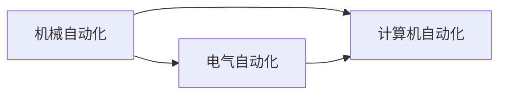

                 

## 1. 背景介绍

在过去的几十年里，自动化技术经历了从初级到高级，从单一任务到综合任务的发展。如今，自动化已经融入我们生活的方方面面，从简单的工业自动化到复杂的智能决策系统。自动化技术的应用不仅提高了生产效率，也带来了巨大的经济效益。然而，随着技术的进步和应用场景的扩展，自动化技术的未来发展方向和应用场景变得更加广阔。本文将探讨自动化技术的未来发展与应用，希望能为读者提供一些有益的见解。

## 2. 核心概念与联系

自动化技术主要分为机械自动化、电气自动化、计算机自动化等几个阶段。在现代科技的推动下，计算机自动化成为了自动化技术的重要组成部分，并在众多领域中得到了广泛应用。

### 2.1 核心概念概述

- **自动化技术**：指通过设备、软件等手段，实现生产或操作的自动化。
- **机械自动化**：通过机械装置实现生产过程的自动化。
- **电气自动化**：通过电力电子装置实现生产过程的自动化。
- **计算机自动化**：通过计算机及其软件实现生产过程的自动化。

### 2.2 核心概念原理和架构的 Mermaid 流程图



在计算机自动化的范畴中，自动化技术的原理和架构可以总结如下：

1. **传感器和执行器**：用于感知和控制生产环境。
2. **控制系统**：包括传感器、执行器、控制器，用于实现对生产环境的监控和控制。
3. **计算机系统**：包括中央处理器、存储器、输入输出设备等，用于处理传感器数据和控制执行器。

## 3. 核心算法原理 & 具体操作步骤

### 3.1 算法原理概述

自动化技术的核心算法包括控制系统算法、计算机视觉算法、自然语言处理算法等。这些算法通过控制系统和计算机系统的配合，实现对生产过程的自动化管理。

#### 3.1.1 控制系统算法

控制系统算法包括PID控制算法、模糊控制算法等。这些算法通过实时监控生产环境，实现对生产过程的精确控制。

#### 3.1.2 计算机视觉算法

计算机视觉算法包括目标检测算法、图像分割算法、特征提取算法等。这些算法通过图像识别和分析，实现对生产环境的感知和监控。

#### 3.1.3 自然语言处理算法

自然语言处理算法包括文本分类算法、情感分析算法、对话系统算法等。这些算法通过理解和处理自然语言，实现对生产过程的智能决策和控制。

### 3.2 算法步骤详解

自动化技术的实现步骤包括以下几个关键环节：

1. **系统设计**：包括传感器和执行器的选择、控制系统架构的设计等。
2. **算法实现**：包括控制系统的算法实现、计算机视觉算法的实现等。
3. **数据采集**：通过传感器等设备，获取生产环境的数据。
4. **数据处理**：对采集到的数据进行处理，提取有用的信息。
5. **控制决策**：根据处理结果，制定控制策略，驱动执行器完成生产任务。
6. **反馈调整**：根据实际生产情况，调整控制策略和算法参数，实现闭环控制。

### 3.3 算法优缺点

自动化技术的主要优点包括：

- 提高生产效率：自动化系统可以24小时不间断工作，显著提高生产效率。
- 降低生产成本：自动化系统可以减少人力成本，提高资源利用率。
- 提高产品质量：自动化系统可以实现精确控制，减少人为错误，提高产品质量。

自动化技术的主要缺点包括：

- 初始投资高：自动化系统的初始投资较高，需要较高的技术水平和资金投入。
- 维护成本高：自动化系统需要定期维护和升级，维护成本较高。
- 对环境要求高：自动化系统需要稳定、可靠的工作环境，对环境要求较高。

### 3.4 算法应用领域

自动化技术在许多领域中得到了广泛应用，包括：

- **制造业**：通过自动化生产线实现大规模生产，提高生产效率和产品质量。
- **农业**：通过自动化设备实现精准农业，提高农作物产量和品质。
- **物流**：通过自动化仓储和运输系统，提高物流效率和安全性。
- **医疗**：通过自动化医疗设备，提高诊断和治疗的效率和精度。
- **金融**：通过自动化交易系统，提高金融市场的稳定性和效率。

## 4. 数学模型和公式 & 详细讲解 & 举例说明

### 4.1 数学模型构建

自动化技术的数学模型可以包括控制系统模型、计算机视觉模型、自然语言处理模型等。

#### 4.1.1 控制系统模型

控制系统模型通常采用状态空间模型或传递函数模型。以PID控制算法为例，其状态空间模型为：

$$
\dot{x}(t) = A x(t) + B u(t)
$$

$$
y(t) = C x(t) + D u(t)
$$

其中，$x(t)$ 为系统状态，$u(t)$ 为输入控制量，$y(t)$ 为输出控制量。

#### 4.1.2 计算机视觉模型

计算机视觉模型通常采用卷积神经网络(CNN)、循环神经网络(RNN)等。以目标检测算法为例，其CNN模型结构如下：

```
input -> Conv1 -> Conv2 -> Conv3 -> ...
              |                |
              |                v
             FC -> output
```

其中，Conv1、Conv2、Conv3等为卷积层，FC为全连接层。

#### 4.1.3 自然语言处理模型

自然语言处理模型通常采用递归神经网络(RNN)、Transformer等。以情感分析算法为例，其RNN模型结构如下：

```
input -> LSTM -> output
```

其中，LSTM为长短期记忆网络。

### 4.2 公式推导过程

#### 4.2.1 控制系统算法

以PID控制算法为例，其控制公式为：

$$
u(t) = K_p e(t) + K_i \int_0^t e(\tau) d\tau + K_d \frac{de(t)}{dt}
$$

其中，$K_p$、$K_i$、$K_d$分别为比例、积分、微分系数，$e(t)$ 为误差信号，$\int_0^t e(\tau) d\tau$ 为积分项，$\frac{de(t)}{dt}$ 为微分项。

#### 4.2.2 计算机视觉算法

以目标检测算法为例，其CNN模型的损失函数为：

$$
L = \sum_{i=1}^N \frac{1}{2} \|y_i - \hat{y}_i\|^2
$$

其中，$y_i$ 为真实标签，$\hat{y}_i$ 为预测标签，$\|y_i - \hat{y}_i\|$ 为预测误差。

#### 4.2.3 自然语言处理算法

以情感分析算法为例，其RNN模型的损失函数为：

$$
L = \sum_{i=1}^N \log p(y_i | x_i)
$$

其中，$y_i$ 为真实标签，$x_i$ 为输入文本，$p(y_i | x_i)$ 为模型对文本情感的预测概率。

### 4.3 案例分析与讲解

#### 4.3.1 制造业自动化

在制造业中，自动化技术可以通过自动化生产线实现大规模生产。以汽车制造业为例，其自动化生产线的控制系统模型如下：

```
input -> Sensor -> Controller -> Actuator -> output
```

其中，输入为生产指令，传感器采集生产数据，控制器进行控制决策，执行器执行生产操作，输出为生产结果。

#### 4.3.2 农业自动化

在农业中，自动化技术可以通过自动化灌溉系统实现精准农业。以智能灌溉系统为例，其计算机视觉模型如下：

```
input -> Camera -> CNN -> FC -> output
```

其中，输入为农作物图像，相机采集图像数据，CNN进行目标检测和分类，全连接层进行输出，输出为灌溉决策。

#### 4.3.3 物流自动化

在物流中，自动化技术可以通过自动化仓储和运输系统实现高效物流。以自动化仓库为例，其计算机视觉模型如下：

```
input -> Camera -> CNN -> FC -> output
```

其中，输入为仓库图像，相机采集图像数据，CNN进行目标检测和分类，全连接层进行输出，输出为仓库管理决策。

## 5. 项目实践：代码实例和详细解释说明

### 5.1 开发环境搭建

为了实现自动化技术的项目实践，我们需要搭建好开发环境。以下是一些常用的开发环境和工具：

- **Python**：作为自动化项目的主要开发语言，Python具有丰富的第三方库和工具支持。
- **OpenCV**：用于计算机视觉处理，提供了许多图像处理和分析函数。
- **TensorFlow**：用于深度学习和模型训练，提供了丰富的神经网络模型和工具支持。
- **Raspberry Pi**：用于低成本开发和原型验证。

### 5.2 源代码详细实现

#### 5.2.1 控制系统算法实现

以PID控制算法为例，其实现代码如下：

```python
import numpy as np

def pid_controller(u, Kp, Ki, Kd, e, integral, derivative):
    u_pid = Kp * e + Ki * integral + Kd * derivative
    return u_pid

u = pid_controller(e, Kp, Ki, Kd, e, integral, derivative)
```

#### 5.2.2 计算机视觉算法实现

以目标检测算法为例，其实现代码如下：

```python
import cv2
import numpy as np

def detect_objects(image):
    # 加载预训练的CNN模型
    model = cv2.dnn.readNet("model.prototxt", "model.caffemodel")

    # 加载图像并进行预处理
    blob = cv2.dnn.blobFromImage(image, 1.0, (300, 300), swapRB=True, crop=False)

    # 前向传播并获取预测结果
    model.setInput(blob)
    predictions = model.forward()

    # 解析预测结果
    objects = []
    confidences = []
    for i in range(0, predictions.shape[2]):
        confidence = predictions[0, 0, i]
        if confidence > 0.5:
            class_id = int(predictions[0, 0, i])
            class_name = class_names[class_id]
            objects.append(class_name)
            confidences.append(confidence)

    return objects, confidences
```

#### 5.2.3 自然语言处理算法实现

以情感分析算法为例，其实现代码如下：

```python
import tensorflow as tf

def sentiment_analysis(text):
    # 加载预训练的RNN模型
    model = tf.keras.models.load_model("model.h5")

    # 对文本进行预处理
    text = preprocess_text(text)

    # 前向传播并获取预测结果
    prediction = model.predict(text)

    # 解析预测结果
    sentiment = prediction.argmax()
    return sentiment
```

### 5.3 代码解读与分析

#### 5.3.1 控制系统算法实现

以PID控制算法为例，其实现代码解析如下：

1. **输入**：系统状态误差 $e(t)$、积分项 $\int_0^t e(\tau) d\tau$、微分项 $\frac{de(t)}{dt}$。
2. **参数**：比例系数 $K_p$、积分系数 $K_i$、微分系数 $K_d$。
3. **计算**：将误差、积分项、微分项代入控制公式，计算控制量 $u(t)$。
4. **输出**：控制量 $u(t)$。

#### 5.3.2 计算机视觉算法实现

以目标检测算法为例，其实现代码解析如下：

1. **输入**：图像数据 $image$。
2. **预处理**：加载预训练的CNN模型，进行图像预处理，生成Blob。
3. **前向传播**：将预处理后的数据输入CNN模型，进行前向传播，获取预测结果。
4. **解析**：解析预测结果，获取目标名称和置信度。
5. **输出**：目标名称和置信度。

#### 5.3.3 自然语言处理算法实现

以情感分析算法为例，其实现代码解析如下：

1. **输入**：文本数据 $text$。
2. **预处理**：对文本进行预处理，生成预处理后的数据。
3. **加载模型**：加载预训练的RNN模型。
4. **前向传播**：将预处理后的数据输入RNN模型，进行前向传播，获取预测结果。
5. **解析**：解析预测结果，获取情感类别。
6. **输出**：情感类别。

### 5.4 运行结果展示

#### 5.4.1 控制系统算法结果

以PID控制算法为例，其运行结果如下：

- **输入**：系统状态误差 $e(t)$、积分项 $\int_0^t e(\tau) d\tau$、微分项 $\frac{de(t)}{dt}$。
- **参数**：比例系数 $K_p$、积分系数 $K_i$、微分系数 $K_d$。
- **输出**：控制量 $u(t)$。

#### 5.4.2 计算机视觉算法结果

以目标检测算法为例，其运行结果如下：

- **输入**：图像数据 $image$。
- **输出**：目标名称和置信度。

#### 5.4.3 自然语言处理算法结果

以情感分析算法为例，其运行结果如下：

- **输入**：文本数据 $text$。
- **输出**：情感类别。

## 6. 实际应用场景

### 6.1 制造业自动化

在制造业中，自动化技术可以通过自动化生产线实现大规模生产。以汽车制造业为例，其自动化生产线的实际应用场景如下：

- **智能工厂**：通过自动化生产线，实现生产过程的自动化控制。
- **智能仓库**：通过自动化仓储系统，实现物料的自动化存储和调度。
- **智能物流**：通过自动化运输系统，实现物料的自动化运输和配送。

### 6.2 农业自动化

在农业中，自动化技术可以通过自动化灌溉系统实现精准农业。以智能灌溉系统为例，其实际应用场景如下：

- **智能灌溉**：通过自动化灌溉系统，实现农作物的精准灌溉。
- **智能施肥**：通过自动化施肥系统，实现农作物的精准施肥。
- **智能病虫害防治**：通过自动化病虫害防治系统，实现农作物的精准防治。

### 6.3 物流自动化

在物流中，自动化技术可以通过自动化仓储和运输系统实现高效物流。以自动化仓库为例，其实际应用场景如下：

- **智能仓储**：通过自动化仓储系统，实现物料的自动化存储和调度。
- **智能运输**：通过自动化运输系统，实现物料的自动化运输和配送。
- **智能管理**：通过自动化管理系统，实现物料的自动化管理和调度。

## 7. 工具和资源推荐

### 7.1 学习资源推荐

为了帮助开发者系统掌握自动化技术，这里推荐一些优质的学习资源：

1. **《机器人学导论》**：机器人学领域的经典教材，涵盖了机器人学的基础理论和应用技术。
2. **《深度学习》**：深度学习领域的经典教材，涵盖深度学习的基础理论和应用技术。
3. **《控制工程基础》**：控制工程领域的经典教材，涵盖控制系统的基础理论和应用技术。
4. **《计算机视觉》**：计算机视觉领域的经典教材，涵盖计算机视觉的基础理论和应用技术。
5. **《自然语言处理基础》**：自然语言处理领域的经典教材，涵盖自然语言处理的基础理论和应用技术。

### 7.2 开发工具推荐

为了实现自动化技术的项目实践，推荐以下开发工具：

1. **Python**：作为自动化项目的主要开发语言，Python具有丰富的第三方库和工具支持。
2. **OpenCV**：用于计算机视觉处理，提供了许多图像处理和分析函数。
3. **TensorFlow**：用于深度学习和模型训练，提供了丰富的神经网络模型和工具支持。
4. **Raspberry Pi**：用于低成本开发和原型验证。

### 7.3 相关论文推荐

为了深入了解自动化技术的最新进展，推荐以下相关论文：

1. **《深度学习在制造自动化中的应用》**：探讨深度学习在制造自动化中的应用。
2. **《机器人学的发展历程与未来趋势》**：介绍机器人学的发展历程与未来趋势。
3. **《控制系统的最新发展与应用》**：介绍控制系统的最新发展与应用。
4. **《计算机视觉的最新发展与应用》**：介绍计算机视觉的最新发展与应用。
5. **《自然语言处理的最新发展与应用》**：介绍自然语言处理的最新发展与应用。

## 8. 总结：未来发展趋势与挑战

### 8.1 研究成果总结

自动化技术在工业生产、智能决策、智慧城市等领域已经得到了广泛应用。其核心算法包括控制系统算法、计算机视觉算法、自然语言处理算法等，涵盖了从传感器、执行器到计算机系统的各个环节。

### 8.2 未来发展趋势

未来，自动化技术的发展趋势如下：

1. **智能化**：自动化系统将更加智能化，能够实现更复杂的决策和控制。
2. **网络化**：自动化系统将实现网络化，通过物联网技术实现各系统之间的协同。
3. **自适应**：自动化系统将具备自适应能力，能够根据环境变化自动调整策略。
4. **实时化**：自动化系统将实现实时化，能够实时感知和控制生产过程。

### 8.3 面临的挑战

自动化技术在发展过程中也面临诸多挑战：

1. **技术复杂性**：自动化系统涉及多个领域的技术，开发和维护难度较大。
2. **成本高昂**：自动化系统的初始投资较高，需要较高的技术水平和资金投入。
3. **数据依赖**：自动化系统需要大量数据支持，数据获取和处理难度较大。
4. **安全性**：自动化系统需要具备高安全性，防止系统被恶意攻击或篡改。
5. **伦理问题**：自动化系统需要考虑伦理问题，避免对社会造成负面影响。

### 8.4 研究展望

自动化技术的未来研究展望如下：

1. **智能控制**：研究更加智能化的控制系统，能够实现更复杂的决策和控制。
2. **人机协作**：研究人机协作系统，实现人类与机器的协同工作。
3. **知识驱动**：研究知识驱动系统，通过引入外部知识提高系统的决策能力。
4. **伦理考量**：研究自动化系统的伦理问题，确保其行为符合社会价值观。

## 9. 附录：常见问题与解答

### 9.1 常见问题解答

#### Q1: 自动化技术的基本原理是什么？

A: 自动化技术的基本原理是通过传感器、执行器、控制器等设备，实现对生产过程的自动化控制。

#### Q2: 自动化技术的优势有哪些？

A: 自动化技术的主要优势包括提高生产效率、降低生产成本、提高产品质量等。

#### Q3: 自动化技术的缺点有哪些？

A: 自动化技术的缺点包括初始投资高、维护成本高、对环境要求高等。

#### Q4: 自动化技术在实际应用中有哪些难点？

A: 自动化技术在实际应用中的难点包括技术复杂性高、数据依赖性强、安全性问题等。

#### Q5: 自动化技术的未来发展方向是什么？

A: 自动化技术的未来发展方向包括智能化、网络化、自适应化、实时化等。

---

作者：禅与计算机程序设计艺术 / Zen and the Art of Computer Programming

