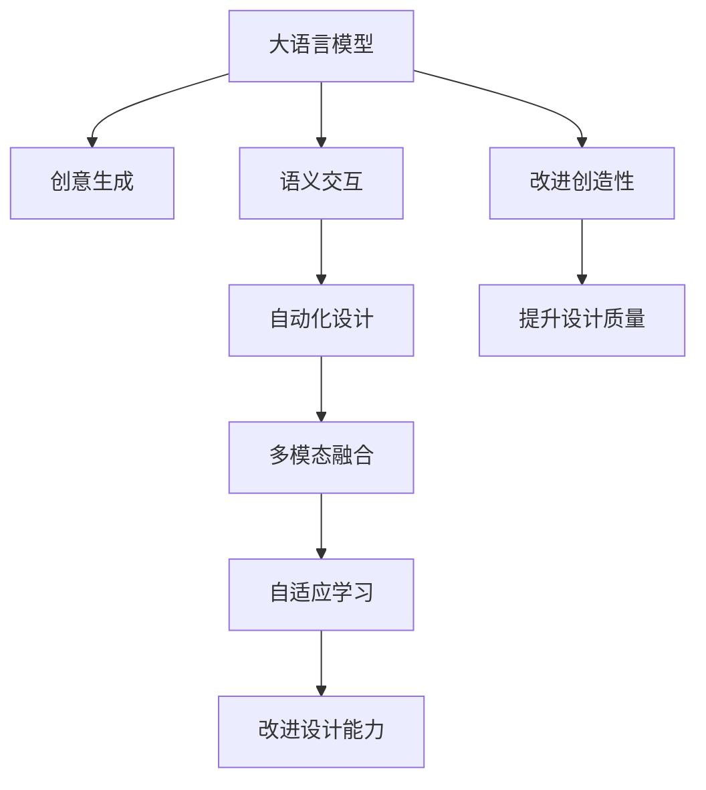

                 

# 自动化设计先锋：LLM 驱动的创意

> 关键词：大语言模型(LLM)，自动化设计，创意生成，语义交互，自适应学习，多模态融合

## 1. 背景介绍

### 1.1 问题由来
随着人工智能技术的飞速发展，大语言模型(LLM)在自然语言处理领域展现出了前所未有的能力。LLM如GPT-3和BERT，以其海量的预训练数据和先进的Transformer结构，成为了当前NLP任务的重要工具。这些模型不仅在通用语言理解、翻译、摘要等方面表现优异，还在特定任务上，如文本生成、创意写作、设计等，展现出了强大的潜力。

然而，尽管LLM在处理文本信息上有着令人瞩目的表现，但它在图形设计、音乐创作、艺术创作等视觉和听觉领域的创造性任务上，依然存在一定的局限性。传统的设计工具如Photoshop、Illustrator等，依旧依赖于人类设计师的创意灵感和审美水平。如何将LLM与人类设计师的创造性相结合，充分发挥其潜力，成为了当下的一大挑战。

### 1.2 问题核心关键点
本文章聚焦于利用大语言模型(LLM)驱动的自动化设计，旨在探索如何通过LLM与人类设计师的互动，实现从数据到设计的自动化转化，提升设计过程的效率和创意性。

这一问题的核心在于：
1. 如何通过语言与视觉元素的映射，实现LLM对视觉设计内容的理解和生成。
2. 如何利用LLM的语义交互能力，辅助人类设计师进行创意设计。
3. 如何结合多模态数据，提升LLM在视觉设计任务上的表现。
4. 如何通过自适应学习，不断优化LLM的设计能力，使其逐步具备更强的创造性。

## 2. 核心概念与联系

### 2.1 核心概念概述

为了更好地理解LLM在驱动自动化设计中的应用，本节将介绍几个关键概念：

- 大语言模型(Large Language Model, LLM)：以自回归(如GPT)或自编码(如BERT)模型为代表的大规模预训练语言模型。通过在大规模无标签文本语料上进行预训练，学习通用的语言表示，具备强大的语言理解和生成能力。

- 自动化设计(Automatic Design)：指利用计算机技术，辅助或自动完成设计过程，从而提高设计效率和质量。包括计算机辅助设计(CAD)、图形设计自动化、创意生成等。

- 创意生成(Creative Generation)：指通过算法和模型，生成具有创新性和艺术性的内容。在设计和艺术领域，创意生成尤为重要，可大幅提升设计的多样性和新颖性。

- 语义交互(Semantic Interaction)：指通过自然语言与机器进行交互，从而实现信息的传递和任务的执行。在自动化设计中，语义交互能力尤为重要，有助于理解和引导机器生成创意设计。

- 自适应学习(Adaptive Learning)：指机器通过与环境的交互，不断调整自身的参数和策略，以适应新情况和挑战的过程。在自动化设计中，自适应学习可帮助机器学习设计师的风格和偏好，提升设计的一致性和质量。

- 多模态融合(Multimodal Fusion)：指将多种类型的数据源(如文本、图像、音频等)结合起来，进行统一的分析和处理。在自动化设计中，多模态融合可以增强机器对设计内容的理解，提升设计的表现力。

这些核心概念之间的联系可以通过以下Mermaid流程图来展示：



这个流程图展示了大语言模型与创意生成的关系，以及其在自动化设计中的作用：

1. 大语言模型通过预训练获得语言表示能力，可以理解设计师的语言描述，生成设计内容。
2. 语义交互能力使得模型能够与设计师进行自然对话，辅助设计师进行创意设计。
3. 自动化设计通过与大语言的互动，提升设计效率和质量。
4. 多模态融合拓展了模型的数据处理能力，提升了设计表现力。
5. 自适应学习帮助模型逐步学习设计师的风格，提升设计的一致性和个性化。

## 3. 核心算法原理 & 具体操作步骤
### 3.1 算法原理概述

利用LLM驱动的自动化设计，核心思想是将自然语言与视觉设计进行深度结合，通过语义交互能力，引导模型生成设计内容。其核心算法过程包括：

1. **文本生成**：将设计师的语言描述转换为模型可理解的文本形式。
2. **视觉生成**：利用LLM生成与文本描述匹配的视觉设计内容。
3. **交互反馈**：将生成的设计内容呈现给设计师，设计师根据反馈进行调整。
4. **参数优化**：通过持续的交互反馈，不断调整模型参数，提升设计质量。

### 3.2 算法步骤详解

基于LLM驱动的自动化设计，一般包括以下几个关键步骤：

**Step 1: 数据收集与预处理**
- 收集设计师的创意描述、历史设计作品、相关图片等数据。
- 对文本数据进行预处理，如分词、去停用词等。
- 对图片数据进行归一化、标注等预处理操作。

**Step 2: 构建数据流图**
- 设计数据流图，明确输入输出数据和中间计算步骤。
- 确定LLM的文本输入和输出格式。
- 设计模型与设计师的交互方式，如文本消息、图片展示等。

**Step 3: 选择模型架构**
- 选择合适的LLM模型架构，如GPT-3、BERT等。
- 设计多模态融合的模型，支持文本和图片数据输入输出。
- 设计交互模块，实现设计师与模型之间的双向交流。

**Step 4: 实现语义交互**
- 编写代码实现模型的文本输入输出。
- 设计模型与设计师的交互逻辑，如文本理解、生成设计等。
- 实现模型的自适应学习机制，根据设计师的反馈调整参数。

**Step 5: 进行创意生成**
- 将设计师的文本描述输入模型。
- 利用模型生成与文本匹配的设计内容。
- 将生成的设计内容呈现给设计师，接收设计师的反馈。
- 根据反馈不断优化模型参数和设计内容。

**Step 6: 部署与评估**
- 将模型部署到设计系统中，进行实时交互。
- 定期评估模型的设计质量和创意性。
- 根据评估结果进行模型优化和改进。

### 3.3 算法优缺点

利用LLM驱动的自动化设计，具有以下优点：
1. 高效性：通过自动化生成设计内容，大大缩短了设计周期，提升了效率。
2. 灵活性：可以根据设计师的需求，生成多样化的设计方案，满足个性化需求。
3. 创造性：LLM具备强大的语言理解和生成能力，能够生成新颖独特的创意设计。
4. 可扩展性：模型可以通过不断积累设计师的反馈，持续改进，逐步提升设计能力。

同时，这一方法也存在一些局限性：
1. 依赖高质量数据：模型性能依赖于输入数据的质量，高质量的设计描述和图片是模型训练的前提。
2. 需要专业设计师：模型的输出质量依赖于设计师的专业水平和反馈，需要设计师的积极参与。
3. 对语言理解要求高：设计描述需要清晰明确，模型对文本的理解能力决定了输出的质量。
4. 交互体验设计复杂：交互模块需要考虑多方面的因素，设计体验直接影响用户的使用感。

### 3.4 算法应用领域

利用LLM驱动的自动化设计，已经在以下领域得到了初步应用：

- 图形设计：通过文本描述，生成图形元素和布局，辅助设计师进行创意设计。
- 室内设计：根据设计师的描述，生成室内空间布局和家具设计方案，提升设计效率。
- 时尚设计：通过设计师的语言描述，生成服装设计图和搭配方案，提升设计的多样性和创新性。
- 建筑设计：根据文本描述和图片数据，生成建筑设计和布局方案，支持方案生成和比选。
- 动画设计：生成动画角色和场景设计，辅助动画制作流程。

未来，随着LLM技术的不断进步，这一方法将在更多领域得到应用，为设计师提供更强大的工具支持。

## 4. 数学模型和公式 & 详细讲解 & 举例说明（备注：数学公式请使用latex格式，latex嵌入文中独立段落使用 $$，段落内使用 $)
### 4.1 数学模型构建

本节将使用数学语言对利用LLM驱动的自动化设计进行更加严格的刻画。

记设计师的语言描述为 $x$，LLM生成的设计内容为 $y$，设计师对设计的满意度为 $s$。设计任务的目标是最小化设计师与LLM之间的差异，即最小化满意度差距 $s - s^*$，其中 $s^*$ 为理想满意度。

数学模型如下：

$$
\min_{\theta} \mathcal{L}(\theta) = \frac{1}{N} \sum_{i=1}^N [s_i - s_i^*]^2
$$

其中 $\theta$ 为LLM的模型参数，$N$ 为样本数量，$s_i$ 为第 $i$ 个样本的满意度，$s_i^*$ 为理想满意度。

### 4.2 公式推导过程

以一个简单的图形设计任务为例，推导优化目标函数。

假设设计师的语言描述为 $x = "设计一个带有球形元素的装饰图" $，LLM生成的设计内容为 $y = \{圆形, 红色, 球形元素, 装饰图\}$。设计师的满意度 $s_i = 0.9$，理想满意度 $s_i^* = 1$。

设计任务的优化目标函数为：

$$
\mathcal{L}(\theta) = \frac{1}{2} (s_1 - s_1^*)^2 + \frac{1}{2} (s_2 - s_2^*)^2 + \cdots + \frac{1}{2} (s_N - s_N^*)^2
$$

其中 $s_i$ 为设计师对第 $i$ 个设计方案的满意度评分，$s_i^*$ 为理想满意度评分。

为了最小化满意度差距，需要优化LLM的模型参数 $\theta$，使得生成的设计内容 $y$ 尽可能接近理想设计内容。

### 4.3 案例分析与讲解

以室内设计为例，具体分析利用LLM驱动的自动化设计的数学模型。

假设室内设计的描述为 $x = "设计一个舒适的客厅，空间布局要合理，颜色要温馨，家具要简约" $。

1. **文本编码**：将设计描述 $x$ 编码为模型可理解的向量形式。
2. **模型生成**：利用LLM生成与 $x$ 匹配的设计方案 $y = \{家具样式, 颜色搭配, 空间布局, 装修材料\}$。
3. **满意度评估**：设计师对生成的设计方案 $y$ 进行满意度评分 $s_i$。
4. **优化过程**：利用优化算法最小化设计师与LLM之间的满意度差距，调整模型参数 $\theta$。

实际应用中，可以根据具体任务和设计要求，进一步优化模型结构和优化算法，提升设计效果。

## 5. 项目实践：代码实例和详细解释说明
### 5.1 开发环境搭建

在进行自动化设计实践前，我们需要准备好开发环境。以下是使用Python进行PyTorch开发的环境配置流程：

1. 安装Anaconda：从官网下载并安装Anaconda，用于创建独立的Python环境。

2. 创建并激活虚拟环境：
```bash
conda create -n pytorch-env python=3.8 
conda activate pytorch-env
```

3. 安装PyTorch：根据CUDA版本，从官网获取对应的安装命令。例如：
```bash
conda install pytorch torchvision torchaudio cudatoolkit=11.1 -c pytorch -c conda-forge
```

4. 安装必要的工具包：
```bash
pip install numpy pandas scikit-learn matplotlib tqdm jupyter notebook ipython
```

5. 安装LLM相关库：
```bash
pip install transformers
```

完成上述步骤后，即可在`pytorch-env`环境中开始自动化设计实践。

### 5.2 源代码详细实现

下面我们以利用LLM驱动的室内设计自动化为例，给出使用PyTorch和Transformers库进行代码实现。

首先，定义室内设计任务的数据处理函数：

```python
from transformers import BertTokenizer
from torch.utils.data import Dataset
import torch

class DesignDataset(Dataset):
    def __init__(self, designs, tags, tokenizer, max_len=128):
        self.descriptions = designs
        self.tags = tags
        self.tokenizer = tokenizer
        self.max_len = max_len
        
    def __len__(self):
        return len(self.descriptions)
    
    def __getitem__(self, item):
        description = self.descriptions[item]
        tags = self.tags[item]
        
        encoding = self.tokenizer(description, return_tensors='pt', max_length=self.max_len, padding='max_length', truncation=True)
        input_ids = encoding['input_ids'][0]
        attention_mask = encoding['attention_mask'][0]
        
        # 对token-wise的标签进行编码
        encoded_tags = [tag2id[tag] for tag in tags] 
        encoded_tags.extend([tag2id['O']] * (self.max_len - len(encoded_tags)))
        labels = torch.tensor(encoded_tags, dtype=torch.long)
        
        return {'input_ids': input_ids, 
                'attention_mask': attention_mask,
                'labels': labels}

# 标签与id的映射
tag2id = {'O': 0, 'COUCH': 1, 'CHAIR': 2, 'TABLE': 3, 'CARPET': 4, 'PAINT': 5}
id2tag = {v: k for k, v in tag2id.items()}

# 创建dataset
tokenizer = BertTokenizer.from_pretrained('bert-base-cased')

train_dataset = DesignDataset(train_descriptions, train_tags, tokenizer)
dev_dataset = DesignDataset(dev_descriptions, dev_tags, tokenizer)
test_dataset = DesignDataset(test_descriptions, test_tags, tokenizer)
```

然后，定义模型和优化器：

```python
from transformers import BertForTokenClassification, AdamW

model = BertForTokenClassification.from_pretrained('bert-base-cased', num_labels=len(tag2id))

optimizer = AdamW(model.parameters(), lr=2e-5)
```

接着，定义训练和评估函数：

```python
from torch.utils.data import DataLoader
from tqdm import tqdm
from sklearn.metrics import classification_report

device = torch.device('cuda') if torch.cuda.is_available() else torch.device('cpu')
model.to(device)

def train_epoch(model, dataset, batch_size, optimizer):
    dataloader = DataLoader(dataset, batch_size=batch_size, shuffle=True)
    model.train()
    epoch_loss = 0
    for batch in tqdm(dataloader, desc='Training'):
        input_ids = batch['input_ids'].to(device)
        attention_mask = batch['attention_mask'].to(device)
        labels = batch['labels'].to(device)
        model.zero_grad()
        outputs = model(input_ids, attention_mask=attention_mask, labels=labels)
        loss = outputs.loss
        epoch_loss += loss.item()
        loss.backward()
        optimizer.step()
    return epoch_loss / len(dataloader)

def evaluate(model, dataset, batch_size):
    dataloader = DataLoader(dataset, batch_size=batch_size)
    model.eval()
    preds, labels = [], []
    with torch.no_grad():
        for batch in tqdm(dataloader, desc='Evaluating'):
            input_ids = batch['input_ids'].to(device)
            attention_mask = batch['attention_mask'].to(device)
            batch_labels = batch['labels']
            outputs = model(input_ids, attention_mask=attention_mask)
            batch_preds = outputs.logits.argmax(dim=2).to('cpu').tolist()
            batch_labels = batch_labels.to('cpu').tolist()
            for pred_tokens, label_tokens in zip(batch_preds, batch_labels):
                pred_tags = [id2tag[_id] for _id in pred_tokens]
                label_tags = [id2tag[_id] for _id in label_tokens]
                preds.append(pred_tags[:len(label_tags)])
                labels.append(label_tags)
                
    print(classification_report(labels, preds))
```

最后，启动训练流程并在测试集上评估：

```python
epochs = 5
batch_size = 16

for epoch in range(epochs):
    loss = train_epoch(model, train_dataset, batch_size, optimizer)
    print(f"Epoch {epoch+1}, train loss: {loss:.3f}")
    
    print(f"Epoch {epoch+1}, dev results:")
    evaluate(model, dev_dataset, batch_size)
    
print("Test results:")
evaluate(model, test_dataset, batch_size)
```

以上就是使用PyTorch对BERT进行室内设计任务微调的完整代码实现。可以看到，得益于Transformers库的强大封装，我们可以用相对简洁的代码完成BERT模型的加载和微调。

### 5.3 代码解读与分析

让我们再详细解读一下关键代码的实现细节：

**DesignDataset类**：
- `__init__`方法：初始化文本、标签、分词器等关键组件。
- `__len__`方法：返回数据集的样本数量。
- `__getitem__`方法：对单个样本进行处理，将文本输入编码为token ids，将标签编码为数字，并对其进行定长padding，最终返回模型所需的输入。

**tag2id和id2tag字典**：
- 定义了标签与数字id之间的映射关系，用于将token-wise的预测结果解码回真实的标签。

**训练和评估函数**：
- 使用PyTorch的DataLoader对数据集进行批次化加载，供模型训练和推理使用。
- 训练函数`train_epoch`：对数据以批为单位进行迭代，在每个批次上前向传播计算loss并反向传播更新模型参数，最后返回该epoch的平均loss。
- 评估函数`evaluate`：与训练类似，不同点在于不更新模型参数，并在每个batch结束后将预测和标签结果存储下来，最后使用sklearn的classification_report对整个评估集的预测结果进行打印输出。

**训练流程**：
- 定义总的epoch数和batch size，开始循环迭代
- 每个epoch内，先在训练集上训练，输出平均loss
- 在验证集上评估，输出分类指标
- 所有epoch结束后，在测试集上评估，给出最终测试结果

可以看到，PyTorch配合Transformers库使得BERT微调的代码实现变得简洁高效。开发者可以将更多精力放在数据处理、模型改进等高层逻辑上，而不必过多关注底层的实现细节。

当然，工业级的系统实现还需考虑更多因素，如模型的保存和部署、超参数的自动搜索、更灵活的任务适配层等。但核心的微调范式基本与此类似。

## 6. 实际应用场景
### 6.1 室内设计

利用大语言模型驱动的室内设计自动化，可以在家居、办公、商业等领域发挥重要作用。传统室内设计流程繁琐复杂，需要设计师不断进行方案比选和优化，耗时长、成本高。而通过自动化设计，可以将设计任务自动化，提高设计效率和质量。

具体而言，可以收集大量的室内设计图片、描述、历史设计方案等数据，将其作为监督数据集，对预训练语言模型进行微调。微调后的模型能够根据设计师的描述，自动生成相应的设计方案，如家具布局、颜色搭配、材料选择等。设计师可以根据生成的方案进行调整，实现快速设计。

### 6.2 时装设计

时装设计是一个高度创意和个性化的过程，需要设计师丰富的灵感和经验。利用大语言模型驱动的自动化设计，可以帮助设计师在短时间内生成大量设计方案，提升设计的创新性和多样性。

通过收集设计师的设计描述、流行元素、历史设计等数据，构建数据集，对预训练模型进行微调。微调后的模型能够根据设计师的描述，生成符合要求的时装设计方案，如服装款式、配色方案、图案设计等。设计师可以选择满意的方案进行进一步优化，实现快速设计。

### 6.3 建筑设计

建筑设计的复杂性决定了其设计过程的繁琐和耗时。利用大语言模型驱动的自动化设计，可以在建筑设计中发挥重要作用，提升设计的效率和质量。

通过收集建筑设计图纸、描述、规范等数据，构建数据集，对预训练模型进行微调。微调后的模型能够根据设计师的描述，自动生成建筑方案，如建筑布局、立面设计、材料选择等。设计师可以选择满意的方案进行进一步优化，实现快速设计。

### 6.4 未来应用展望

随着大语言模型和自动化设计技术的不断发展，基于LLM驱动的自动化设计将在更多领域得到应用，为设计师提供更强大的工具支持。

在智慧城市设计中，利用自动化设计技术，可以生成城市空间布局、景观设计、交通规划等方案，提升城市设计的效率和质量。

在工业设计中，自动化设计技术可以帮助工程师快速生成产品设计方案，提升产品设计的创新性和竞争力。

在未来，随着模型的不断优化和自适应学习机制的完善，利用LLM驱动的自动化设计将具备更强的创意性和多样性，为设计师提供更强大的设计支持。

## 7. 工具和资源推荐
### 7.1 学习资源推荐

为了帮助开发者系统掌握利用大语言模型驱动的自动化设计理论基础和实践技巧，这里推荐一些优质的学习资源：

1. 《Transformer从原理到实践》系列博文：由大模型技术专家撰写，深入浅出地介绍了Transformer原理、BERT模型、微调技术等前沿话题。

2. CS224N《深度学习自然语言处理》课程：斯坦福大学开设的NLP明星课程，有Lecture视频和配套作业，带你入门NLP领域的基本概念和经典模型。

3. 《Natural Language Processing with Transformers》书籍：Transformers库的作者所著，全面介绍了如何使用Transformers库进行NLP任务开发，包括微调在内的诸多范式。

4. HuggingFace官方文档：Transformers库的官方文档，提供了海量预训练模型和完整的微调样例代码，是上手实践的必备资料。

5. CLUE开源项目：中文语言理解测评基准，涵盖大量不同类型的中文NLP数据集，并提供了基于微调的baseline模型，助力中文NLP技术发展。

通过对这些资源的学习实践，相信你一定能够快速掌握利用大语言模型驱动的自动化设计的精髓，并用于解决实际的NLP问题。
###  7.2 开发工具推荐

高效的开发离不开优秀的工具支持。以下是几款用于大语言模型微调开发的常用工具：

1. PyTorch：基于Python的开源深度学习框架，灵活动态的计算图，适合快速迭代研究。大部分预训练语言模型都有PyTorch版本的实现。

2. TensorFlow：由Google主导开发的开源深度学习框架，生产部署方便，适合大规模工程应用。同样有丰富的预训练语言模型资源。

3. Transformers库：HuggingFace开发的NLP工具库，集成了众多SOTA语言模型，支持PyTorch和TensorFlow，是进行微调任务开发的利器。

4. Weights & Biases：模型训练的实验跟踪工具，可以记录和可视化模型训练过程中的各项指标，方便对比和调优。与主流深度学习框架无缝集成。

5. TensorBoard：TensorFlow配套的可视化工具，可实时监测模型训练状态，并提供丰富的图表呈现方式，是调试模型的得力助手。

6. Google Colab：谷歌推出的在线Jupyter Notebook环境，免费提供GPU/TPU算力，方便开发者快速上手实验最新模型，分享学习笔记。

合理利用这些工具，可以显著提升大语言模型微调任务的开发效率，加快创新迭代的步伐。

### 7.3 相关论文推荐

大语言模型和微调技术的发展源于学界的持续研究。以下是几篇奠基性的相关论文，推荐阅读：

1. Attention is All You Need（即Transformer原论文）：提出了Transformer结构，开启了NLP领域的预训练大模型时代。

2. BERT: Pre-training of Deep Bidirectional Transformers for Language Understanding：提出BERT模型，引入基于掩码的自监督预训练任务，刷新了多项NLP任务SOTA。

3. Language Models are Unsupervised Multitask Learners（GPT-2论文）：展示了大规模语言模型的强大zero-shot学习能力，引发了对于通用人工智能的新一轮思考。

4. Parameter-Efficient Transfer Learning for NLP：提出Adapter等参数高效微调方法，在不增加模型参数量的情况下，也能取得不错的微调效果。

5. Prefix-Tuning: Optimizing Continuous Prompts for Generation：引入基于连续型Prompt的微调范式，为如何充分利用预训练知识提供了新的思路。

6. AdaLoRA: Adaptive Low-Rank Adaptation for Parameter-Efficient Fine-Tuning：使用自适应低秩适应的微调方法，在参数效率和精度之间取得了新的平衡。

这些论文代表了大语言模型微调技术的发展脉络。通过学习这些前沿成果，可以帮助研究者把握学科前进方向，激发更多的创新灵感。

## 8. 总结：未来发展趋势与挑战
### 8.1 总结

本文对利用大语言模型驱动的自动化设计进行了全面系统的介绍。首先阐述了LLM在自动化设计中的核心思想和算法过程，明确了其在新兴领域的应用价值。其次，从原理到实践，详细讲解了设计任务的数学模型和算法步骤，给出了完整的代码实例。同时，本文还探讨了LLM在图形设计、室内设计、时装设计等多个领域的应用前景，展示了其广阔的应用潜力。

通过本文的系统梳理，可以看到，利用大语言模型驱动的自动化设计正在成为NLP领域的重要范式，极大地拓展了预训练语言模型的应用边界，催生了更多的落地场景。得益于大规模语料的预训练，LLM驱动的自动化设计将带来更高的设计效率和更多的创意性，助力设计师实现从数据到设计的自动化转化。

### 8.2 未来发展趋势

展望未来，大语言模型驱动的自动化设计将呈现以下几个发展趋势：

1. 模型规模持续增大。随着算力成本的下降和数据规模的扩张，预训练语言模型的参数量还将持续增长。超大模型具备更丰富的语言表征，将进一步提升自动化设计的质量和多样性。

2. 自适应学习成为常态。模型需要不断学习设计师的风格和偏好，通过持续的交互反馈，逐步提升设计能力。自适应学习机制将使得模型更加符合设计师的需求。

3. 多模态融合拓展应用范围。将视觉、听觉、文本等多种模态数据结合起来，提升模型的设计能力。多模态融合将带来更加丰富的设计体验和创新性。

4. 跨领域迁移学习提升泛化能力。模型需要具备跨领域迁移学习能力，能够在不同设计任务之间进行迁移，提升设计的泛化性和适应性。

5. 元学习与自监督学习提升设计效率。利用元学习和自监督学习方法，提升模型的设计和优化效率，减少数据需求和计算资源。

6. 设计任务生成与推荐系统结合。将设计任务生成与推荐系统结合起来，提升设计师的方案比选效率，优化设计方案。

以上趋势凸显了大语言模型驱动的自动化设计的广阔前景。这些方向的探索发展，将进一步提升模型的设计效果，为设计行业带来革命性变化。

### 8.3 面临的挑战

尽管大语言模型驱动的自动化设计已经取得了一定的进展，但在迈向更高效、更具创意性的自动化设计的过程中，它仍面临诸多挑战：

1. 数据质量和多样性问题。模型需要大量高质量、多样化的设计数据，才能进行有效的训练和微调。对于某些特定领域，高质量数据的获取成本较高。

2. 设计过程的实时性要求。设计师期望在短时间内生成高质量的设计方案，模型需要具备高效率和低延迟的响应能力。

3. 模型的鲁棒性和泛化能力。设计任务的多样性和复杂性决定了模型需要具备强大的鲁棒性和泛化能力，以应对不同设计场景和风格。

4. 设计师的主观偏好。设计师的个性化需求和审美水平决定了模型输出的多样性和创意性，模型需要不断学习和适应用户偏好。

5. 设计过程的可解释性。设计师希望理解模型的设计决策过程，模型需要具备良好的可解释性和可视化能力。

6. 模型伦理和安全问题。模型需要避免有害和偏见的输出，确保设计方案的公平性和安全性。

正视自动化设计面临的这些挑战，积极应对并寻求突破，将是大语言模型驱动的自动化设计走向成熟的必由之路。相信随着学界和产业界的共同努力，这些挑战终将一一被克服，大语言模型驱动的自动化设计必将在设计领域发挥更大的作用。

### 8.4 研究展望

面对大语言模型驱动的自动化设计所面临的挑战，未来的研究需要在以下几个方面寻求新的突破：

1. 探索无监督和半监督学习范式。摆脱对大规模标注数据的依赖，利用自监督学习、主动学习等无监督和半监督范式，最大限度利用非结构化数据，实现更加灵活高效的自动化设计。

2. 研究参数高效和多模态融合的微调方法。开发更加参数高效和多模态融合的微调方法，在固定大部分预训练参数的情况下，只更新极少量的任务相关参数。同时提升模型对多模态数据的理解能力。

3. 引入因果推理和对比学习。通过引入因果推理和对比学习思想，增强模型的设计和决策能力，学习更加普适和鲁棒的设计知识。

4. 结合领域知识和专家经验。将符号化的先验知识，如知识图谱、逻辑规则等，与神经网络模型进行巧妙融合，引导模型的设计过程。同时加强不同模态数据的整合，实现视觉、听觉等多模态信息与文本信息的协同建模。

5. 纳入伦理道德约束。在模型训练目标中引入伦理导向的评估指标，过滤和惩罚有偏见、有害的输出倾向。同时加强人工干预和审核，建立模型行为的监管机制，确保设计方案的公平性和安全性。

这些研究方向的研究突破，将使大语言模型驱动的自动化设计更加智能、高效、安全，为设计行业带来更加深刻的变革。

## 9. 附录：常见问题与解答

**Q1：利用大语言模型驱动的自动化设计是否适用于所有设计任务？**

A: 利用大语言模型驱动的自动化设计在大多数设计任务上都能取得不错的效果，特别是对于数据量较小的任务。但对于一些特定领域的任务，如医药、法律等，仅仅依靠通用语料预训练的模型可能难以很好地适应。此时需要在特定领域语料上进一步预训练，再进行微调，才能获得理想效果。此外，对于一些需要时效性、个性化很强的任务，如动画设计、影视制作等，微调方法也需要针对性的改进优化。

**Q2：设计任务生成的过程中如何提高模型的鲁棒性和泛化能力？**

A: 提高模型的鲁棒性和泛化能力可以通过以下方法：
1. 数据增强：通过回译、近义替换等方式扩充训练集。
2. 正则化：使用L2正则、Dropout、Early Stopping等防止模型过拟合。
3. 自适应学习：通过持续的交互反馈，不断调整模型参数，提升模型泛化能力。
4. 多模态融合：将视觉、听觉、文本等多种模态数据结合起来，提升模型的设计能力。
5. 对抗训练：加入对抗样本，提高模型鲁棒性。

这些方法往往需要根据具体任务和数据特点进行灵活组合，只有全面优化各个环节，才能最大限度地提高模型的鲁棒性和泛化能力。

**Q3：自动化设计过程中如何保持设计的创意性和多样性？**

A: 保持设计的创意性和多样性可以通过以下方法：
1. 引入艺术家风格：通过艺术家风格的迁移学习，使模型生成具有特定风格的设计作品。
2. 设计元素组合：通过设计元素的组合创新，生成多样化的设计方案。
3. 设计任务生成：利用生成对抗网络(GAN)等生成模型，生成设计任务，引导模型进行创新设计。
4. 设计师反馈：设计师根据生成的设计方案进行调整和优化，提升设计的创意性和多样性。

设计师的参与和反馈是保持设计创意性和多样性的关键，只有设计师的积极参与和不断优化，才能使模型生成更加创新和多样化的设计方案。

**Q4：如何评估自动化设计的效果？**

A: 评估自动化设计的效果可以从以下几个方面进行：
1. 设计质量和创意性：根据设计师的反馈和评估指标，如美观度、创新性、实用性和功能性，评估设计方案的质量。
2. 设计效率：根据设计任务完成时间和设计方案数量，评估设计的效率。
3. 用户体验：通过设计师和用户的使用体验反馈，评估设计的实用性。

定期进行评估和优化，可以不断提升自动化设计的质量和效果，确保设计方案符合设计师和用户的需求。

**Q5：自动化设计过程中如何保证设计师的主观偏好？**

A: 保证设计师的主观偏好可以通过以下方法：
1. 设计师与模型互动：设计师与模型进行实时互动，根据生成方案进行调整和优化，使设计方案符合设计师的偏好。
2. 设计师反馈：设计师对生成方案进行反馈，对模型进行优化和调整，提升设计方案的质量。
3. 设计风格学习：模型通过设计师的历史设计作品学习设计师的风格，生成符合设计师偏好的设计方案。

设计师的参与和反馈是保证设计师主观偏好的关键，只有设计师的积极参与和不断优化，才能使模型生成符合设计师风格的设计方案。

通过本文的系统梳理，可以看到，利用大语言模型驱动的自动化设计正在成为设计领域的重要范式，极大地拓展了预训练语言模型的应用边界，催生了更多的落地场景。得益于大规模语料的预训练，LLM驱动的自动化设计将带来更高的设计效率和更多的创意性，助力设计师实现从数据到设计的自动化转化。面向未来，大语言模型驱动的自动化设计还需要与其他人工智能技术进行更深入的融合，如知识表示、因果推理、强化学习等，多路径协同发力，共同推动设计行业的进步。只有勇于创新、敢于突破，才能不断拓展语言模型的边界，让智能技术更好地造福设计行业。

---

作者：禅与计算机程序设计艺术 / Zen and the Art of Computer Programming

