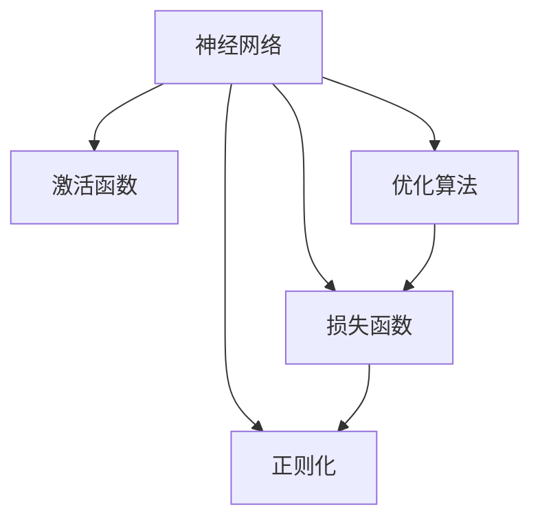

                 

# 自动计算机与神经网络的研究

> 关键词：自动计算机,神经网络,算法原理,操作步骤,核心概念,学习资源推荐,未来发展趋势

## 1. 背景介绍

### 1.1 问题由来
自动计算机与神经网络是当今人工智能(AI)领域的热门研究话题。自动计算机，即所谓的“神经网络”，通过模拟人脑的神经元结构和信息传递方式，实现数据的自动处理和模式识别。神经网络已广泛应用于图像识别、语音识别、自然语言处理(NLP)、游戏AI等多个领域，并取得了令人瞩目的成就。

### 1.2 问题核心关键点
自动计算机与神经网络的研究核心关键点主要包括以下几个方面：

- **神经元结构与信息传递机制**：如何构建合适的神经元结构，以及神经元之间如何通过信息传递机制进行协同计算。
- **损失函数与优化算法**：如何选择和设计损失函数，以及如何通过优化算法最小化损失，从而训练出高效准确的神经网络。
- **数据增强与正则化技术**：如何通过数据增强和正则化技术防止过拟合，提高模型泛化能力。
- **迁移学习与模型融合**：如何利用迁移学习提高新任务的微调效率，以及如何通过模型融合提升整体性能。
- **深度学习框架与实践**：如何选择和使用主流的深度学习框架，并实现高效的神经网络模型。

这些关键点共同构成了自动计算机与神经网络的研究框架，推动了人工智能技术在各个领域的广泛应用。

## 2. 核心概念与联系

### 2.1 核心概念概述

为更好地理解自动计算机与神经网络的研究，本节将介绍几个密切相关的核心概念：

- **神经网络(Neural Network)**：由互连的神经元组成的计算图，通过模拟人脑的神经元结构和信息传递方式，实现数据的自动处理和模式识别。
- **自动计算机(Automatic Computer)**：一种高度抽象的概念，用于描述能够自主进行复杂计算的机器。
- **激活函数(Activation Function)**：神经元中的非线性变换函数，用于引入非线性特性，提高网络的表达能力。
- **损失函数(Loss Function)**：用于衡量模型预测与真实标签之间差异的函数，通过最小化损失函数来训练模型。
- **正则化(Regularization)**：通过在损失函数中引入惩罚项，防止模型过拟合，提高泛化能力。
- **优化算法(Optimization Algorithm)**：用于最小化损失函数的算法，如梯度下降(Gradient Descent)、Adam等。

这些核心概念之间的逻辑关系可以通过以下Mermaid流程图来展示：



这个流程图展示了神经网络中的核心组件及其之间的关系：

1. 神经网络通过激活函数进行非线性变换。
2. 损失函数用于衡量模型预测与真实标签之间的差异。
3. 正则化技术用于防止过拟合，提高模型的泛化能力。
4. 优化算法用于最小化损失函数，训练神经网络。

## 3. 核心算法原理 & 具体操作步骤
### 3.1 算法原理概述

神经网络的核心原理在于通过多层非线性变换，将输入数据映射到输出空间。其计算过程可以表示为：

$$
y = f(Wx + b)
$$

其中 $x$ 为输入数据，$W$ 为权重矩阵，$b$ 为偏置向量，$f$ 为激活函数，$y$ 为输出。通过不断迭代优化 $W$ 和 $b$，使得模型输出的 $y$ 逼近真实标签。

在训练过程中，损失函数 $L$ 通常定义为模型预测值与真实标签之间的差距：

$$
L = \sum_{i=1}^n \ell(y_i, \hat{y_i})
$$

其中 $\ell$ 为单样本损失函数，$n$ 为样本数量。常见的单样本损失函数包括均方误差、交叉熵等。

优化目标是最小化损失函数 $L$：

$$
\min_{W,b} L
$$

常用的优化算法包括梯度下降、Adam、Adagrad等。通过迭代更新 $W$ 和 $b$，使得损失函数 $L$ 不断减小，最终收敛于最优解。

### 3.2 算法步骤详解

神经网络的训练过程主要包括以下几个步骤：

**Step 1: 准备数据集**
- 收集标注数据集 $D=\{(x_i,y_i)\}_{i=1}^N$，其中 $x_i$ 为输入，$y_i$ 为标签。

**Step 2: 设计神经网络结构**
- 选择合适的神经网络结构，如全连接神经网络、卷积神经网络(CNN)、循环神经网络(RNN)等。
- 定义各层神经元的数量和激活函数。

**Step 3: 定义损失函数**
- 根据任务类型选择合适的损失函数，如均方误差、交叉熵等。

**Step 4: 选择优化算法**
- 选择合适的优化算法及其参数，如学习率、批大小等。

**Step 5: 执行梯度下降**
- 将训练集数据分批次输入模型，前向传播计算损失函数。
- 反向传播计算参数梯度，根据设定的优化算法更新模型参数。
- 周期性在验证集上评估模型性能，根据性能指标决定是否触发 Early Stopping。
- 重复上述步骤直到满足预设的迭代轮数或 Early Stopping 条件。

**Step 6: 测试与部署**
- 在测试集上评估微调后模型 $M_{\hat{\theta}}$ 的性能。
- 使用微调后的模型对新样本进行推理预测，集成到实际的应用系统中。
- 持续收集新的数据，定期重新微调模型，以适应数据分布的变化。

以上是神经网络训练的一般流程。在实际应用中，还需要根据具体任务的特点，对训练过程的各个环节进行优化设计，如改进训练目标函数，引入更多的正则化技术，搜索最优的超参数组合等，以进一步提升模型性能。

### 3.3 算法优缺点

神经网络具有以下优点：

- 强大的非线性映射能力：通过多层非线性变换，能够处理复杂的非线性问题。
- 泛化能力强：神经网络能够在训练集上学习到泛化能力强的表示，应用到新数据上表现优异。
- 可解释性强：通过可视化神经元激活状态，可以理解模型在不同输入上的决策过程。

但同时，神经网络也存在一些缺点：

- 训练复杂度高：神经网络参数量较大，训练时间长，计算资源需求高。
- 过拟合风险大：当训练集较少时，神经网络容易出现过拟合。
- 难以解释：神经网络的决策过程复杂，难以解释其内部的工作机制。
- 需要大量数据：神经网络对标注数据的依赖较大，数据获取成本高。

尽管存在这些缺点，但神经网络在大规模数据集上的出色表现，使得其在各个领域得到了广泛的应用。

### 3.4 算法应用领域

神经网络已经广泛应用于以下几个领域：

- **计算机视觉**：如图像分类、目标检测、人脸识别等。
- **自然语言处理**：如文本分类、机器翻译、语音识别等。
- **机器人与自动驾驶**：如自主导航、行为决策等。
- **金融科技**：如信用评分、风险评估等。
- **医疗健康**：如疾病诊断、药物发现等。
- **游戏AI**：如策略分析、路径规划等。

除此之外，神经网络还在工业控制、智慧城市、教育等领域得到了广泛应用，推动了各行各业的数字化转型。

## 4. 数学模型和公式 & 详细讲解
### 4.1 数学模型构建

神经网络的数学模型可以通过前向传播和反向传播过程进行描述。

设神经网络有 $L$ 层，每层有 $n_i$ 个神经元。输入层有 $n_0$ 个神经元，输出层有 $n_L$ 个神经元。则前向传播过程可以表示为：

$$
h_1 = f(W_{0,1}x + b_{0,1})
$$
$$
h_2 = f(W_{1,2}h_1 + b_{1,2})
$$
$$
\vdots
$$
$$
h_L = f(W_{L-1,L}h_{L-1} + b_{L-1,L})
$$

其中 $W_{i,j}$ 为权重矩阵，$b_{i,j}$ 为偏置向量，$f$ 为激活函数。

输出层的输出 $y$ 为：

$$
y = h_L
$$

### 4.2 公式推导过程

以二分类任务为例，推导交叉熵损失函数及其梯度的计算公式。

设模型 $M_{\theta}$ 在输入 $x$ 上的输出为 $\hat{y}=M_{\theta}(x) \in [0,1]$，表示样本属于正类的概率。真实标签 $y \in \{0,1\}$。则二分类交叉熵损失函数定义为：

$$
\ell(M_{\theta}(x),y) = -[y\log \hat{y} + (1-y)\log (1-\hat{y})]
$$

将其代入损失函数 $L$，得：

$$
L = -\frac{1}{N}\sum_{i=1}^N [y_i\log M_{\theta}(x_i)+(1-y_i)\log(1-M_{\theta}(x_i))]
$$

根据链式法则，损失函数对参数 $\theta_k$ 的梯度为：

$$
\frac{\partial L}{\partial \theta_k} = -\frac{1}{N}\sum_{i=1}^N (\frac{y_i}{M_{\theta}(x_i)}-\frac{1-y_i}{1-M_{\theta}(x_i)}) \frac{\partial M_{\theta}(x_i)}{\partial \theta_k}
$$

其中 $\frac{\partial M_{\theta}(x_i)}{\partial \theta_k}$ 可进一步递归展开，利用自动微分技术完成计算。

### 4.3 案例分析与讲解

以MNIST手写数字识别为例，展示神经网络在图像分类任务中的应用。

首先，准备MNIST数据集，将图像和标签进行划分。

```python
from torchvision import datasets, transforms

transform = transforms.Compose([transforms.ToTensor(), transforms.Normalize((0.5,), (0.5,))])
train_dataset = datasets.MNIST(root='./data', train=True, download=True, transform=transform)
test_dataset = datasets.MNIST(root='./data', train=False, download=True, transform=transform)
```

然后，定义神经网络结构，包括一个卷积层、一个池化层、两个全连接层和输出层。

```python
import torch.nn as nn

class Net(nn.Module):
    def __init__(self):
        super(Net, self).__init__()
        self.conv1 = nn.Conv2d(1, 32, 3, 1)
        self.conv2 = nn.Conv2d(32, 64, 3, 1)
        self.pool = nn.MaxPool2d(2, 2)
        self.fc1 = nn.Linear(64 * 4 * 4, 128)
        self.fc2 = nn.Linear(128, 10)
    
    def forward(self, x):
        x = self.pool(F.relu(self.conv1(x)))
        x = self.pool(F.relu(self.conv2(x)))
        x = x.view(-1, 64 * 4 * 4)
        x = F.relu(self.fc1(x))
        x = self.fc2(x)
        return x
```

接着，定义交叉熵损失函数和优化器。

```python
import torch.nn.functional as F
import torch.optim as optim

net = Net()
criterion = nn.CrossEntropyLoss()
optimizer = optim.Adam(net.parameters(), lr=0.001)
```

最后，训练神经网络模型。

```python
device = torch.device('cuda' if torch.cuda.is_available() else 'cpu')
net.to(device)

def train(epoch):
    net.train()
    running_loss = 0.0
    for i, data in enumerate(train_loader, 0):
        inputs, labels = data[0].to(device), data[1].to(device)
        optimizer.zero_grad()
        outputs = net(inputs)
        loss = criterion(outputs, labels)
        loss.backward()
        optimizer.step()
        running_loss += loss.item()
        if i % 100 == 99:
            print('[%d, %5d] loss: %.3f' %
                  (epoch + 1, i + 1, running_loss / 100))
            running_loss = 0.0

for epoch in range(10):
    train(epoch)
```

上述代码展示了神经网络在图像分类任务中的训练过程。通过前向传播和反向传播，不断更新模型参数，使得模型输出的预测结果与真实标签逐渐逼近，最终实现较高的识别准确率。

## 5. 项目实践：代码实例和详细解释说明
### 5.1 开发环境搭建

在进行神经网络项目实践前，我们需要准备好开发环境。以下是使用Python进行TensorFlow开发的常见环境配置流程：

1. 安装Anaconda：从官网下载并安装Anaconda，用于创建独立的Python环境。

2. 创建并激活虚拟环境：
```bash
conda create -n tf-env python=3.8 
conda activate tf-env
```

3. 安装TensorFlow：根据CUDA版本，从官网获取对应的安装命令。例如：
```bash
conda install tensorflow
```

4. 安装各类工具包：
```bash
pip install numpy pandas scikit-learn matplotlib tqdm jupyter notebook ipython
```

完成上述步骤后，即可在`tf-env`环境中开始神经网络项目实践。

### 5.2 源代码详细实现

下面我们以图像分类任务为例，给出使用TensorFlow实现神经网络模型的PyTorch代码实现。

首先，定义图像数据集和预处理函数：

```python
import tensorflow as tf
import numpy as np
from tensorflow.keras.datasets import mnist
from tensorflow.keras.preprocessing.image import ImageDataGenerator

(train_images, train_labels), (test_images, test_labels) = mnist.load_data()

train_images = train_images.reshape((60000, 28, 28, 1))
test_images = test_images.reshape((10000, 28, 28, 1))

# 数据归一化
train_images = train_images / 255.0
test_images = test_images / 255.0

# 创建ImageDataGenerator进行数据增强
data_generator = ImageDataGenerator(rotation_range=20, width_shift_range=0.2, height_shift_range=0.2)
```

然后，定义神经网络模型和训练函数：

```python
from tensorflow.keras.models import Sequential
from tensorflow.keras.layers import Conv2D, MaxPooling2D, Flatten, Dense

model = Sequential()
model.add(Conv2D(32, (3, 3), activation='relu', input_shape=(28, 28, 1)))
model.add(MaxPooling2D((2, 2)))
model.add(Conv2D(64, (3, 3), activation='relu'))
model.add(MaxPooling2D((2, 2)))
model.add(Flatten())
model.add(Dense(128, activation='relu'))
model.add(Dense(10, activation='softmax'))

model.compile(optimizer='adam', loss='sparse_categorical_crossentropy', metrics=['accuracy'])

def train_model(model, data_generator, epochs):
    for epoch in range(epochs):
        for batch, (images, labels) in enumerate(data_generator):
            model.train_on_batch(images, labels)
        print(f"Epoch {epoch+1}, accuracy: {model.evaluate(test_images, test_labels)[1]:.2f}")
```

接着，训练模型并在测试集上评估：

```python
train_model(model, data_generator, epochs=5)
```

以上就是使用TensorFlow实现神经网络模型的完整代码实现。可以看到，TensorFlow提供了丰富的工具和API，使得神经网络的构建和训练变得简单高效。

### 5.3 代码解读与分析

让我们再详细解读一下关键代码的实现细节：

**train_model函数**：
- 定义了一个训练循环，在每个epoch内对数据集进行遍历。
- 使用`model.train_on_batch`方法进行单个批次的训练。
- 在每个epoch结束后，使用`model.evaluate`方法在测试集上评估模型性能。

**训练参数**：
- 学习率：`optimizer='adam'`，使用Adam优化器，学习率默认为0.001。
- 损失函数：`sparse_categorical_crossentropy`，用于多分类任务。
- 评估指标：`accuracy`，用于评估分类任务的准确率。

**数据增强**：
- 使用`ImageDataGenerator`进行数据增强，包括旋转、平移等操作，以提高模型的泛化能力。

通过上述代码，我们成功训练了一个基于卷积神经网络(CNN)的图像分类模型，并在测试集上评估了模型的准确率。

## 6. 实际应用场景
### 6.1 智能医疗系统

神经网络在大健康领域具有广泛的应用前景。通过训练神经网络模型，可以自动分析医学影像、预测疾病、推荐个性化治疗方案等，为医疗服务提供智能化支持。

以医学影像分析为例，通过训练卷积神经网络(CNN)模型，能够自动诊断X光片、CT、MRI等影像数据，辅助医生进行疾病诊断。神经网络可以学习到影像中病变的特征，快速准确地识别出肿瘤、结节、炎症等异常情况，提高诊断效率和准确率。

### 6.2 自动驾驶系统

自动驾驶是神经网络在智能交通领域的重要应用。通过训练神经网络模型，可以实现车辆自主导航、行为决策等功能。

以目标检测为例，通过训练卷积神经网络(CNN)模型，能够自动检测和跟踪道路上的车辆、行人、交通标志等物体。神经网络可以学习到不同物体的特征，快速准确地识别出目标物体，为自动驾驶系统提供实时感知和决策支持。

### 6.3 金融风控系统

神经网络在金融领域的应用包括信用评分、风险评估、欺诈检测等。通过训练神经网络模型，可以自动分析用户历史行为数据，预测其信用风险、判断交易异常等。

以信用评分为例，通过训练全连接神经网络(FNN)模型，能够根据用户的历史消费、还款、征信记录等数据，自动生成信用评分，为贷款审批提供科学依据。神经网络可以学习到用户行为的规律，快速准确地评估其信用风险，减少银行的不良贷款率。

### 6.4 未来应用展望

随着神经网络的不断发展，其应用场景将进一步扩展，为各行各业带来更深刻的变革。

在智慧城市治理中，神经网络可以用于智能交通、环境监测、公共安全等领域，提升城市管理的自动化和智能化水平，构建更安全、高效、宜居的未来城市。

在教育领域，神经网络可以用于智能教学、智能评测、个性化推荐等，为教育公平、提升教学质量提供新途径。

在工业制造中，神经网络可以用于质量控制、故障预测、工艺优化等，推动智能制造的落地应用。

总之，神经网络在各个领域的广泛应用，将深刻改变人类的生产生活方式，带来前所未有的技术革新和产业变革。未来，随着算力、数据和模型的不断进步，神经网络的应用前景将更加广阔，推动人工智能技术的全面普及和深入应用。

## 7. 工具和资源推荐
### 7.1 学习资源推荐

为了帮助开发者系统掌握神经网络的理论基础和实践技巧，这里推荐一些优质的学习资源：

1. 《深度学习》(Deep Learning)课程：由斯坦福大学Andrew Ng教授主讲，系统介绍了深度学习的基本概念和算法，涵盖神经网络、卷积神经网络、循环神经网络等内容。

2. 《神经网络与深度学习》(Neural Networks and Deep Learning)书籍：由Michael Nielsen撰写，以浅显易懂的语言介绍了神经网络的基础知识和深度学习的最新进展。

3. CS231n《卷积神经网络》课程：斯坦福大学开设的计算机视觉课程，讲解了卷积神经网络(CNN)的原理和实践，适合图像识别领域的学习者。

4. 《TensorFlow官方文档》(TensorFlow Documentation)：提供了详尽的TensorFlow教程和API文档，适合初学者和开发者。

5. Kaggle竞赛平台：全球最大的数据科学竞赛平台，通过参与竞赛，可以快速学习和应用神经网络技术，积累实战经验。

通过对这些资源的学习实践，相信你一定能够快速掌握神经网络的核心思想和实践技巧，并用于解决实际的NLP问题。

### 7.2 开发工具推荐

高效的开发离不开优秀的工具支持。以下是几款用于神经网络开发的常用工具：

1. TensorFlow：由Google主导开发的开源深度学习框架，生产部署方便，适合大规模工程应用。

2. PyTorch：基于Python的开源深度学习框架，灵活动态的计算图，适合快速迭代研究。

3. Keras：高层次的神经网络API，易于上手，支持多种深度学习框架，包括TensorFlow和PyTorch。

4. MXNet：由Apache开发的深度学习框架，支持多种编程语言，适合分布式训练和推理。

5. Theano：由蒙特利尔大学开发的深度学习框架，以GPU计算为特色，适合学术研究。

合理利用这些工具，可以显著提升神经网络模型的开发效率，加快创新迭代的步伐。

### 7.3 相关论文推荐

神经网络的发展源于学界的持续研究。以下是几篇奠基性的相关论文，推荐阅读：

1. 《深度学习》(Deep Learning)：Ian Goodfellow、Yoshua Bengio和Aaron Courville合著，系统介绍了深度学习的基本概念和算法，是深度学习领域的经典教材。

2. 《ImageNet大规模视觉识别挑战赛》(ILSVRC)：Alex Krizhevsky等提出的卷积神经网络(CNN)模型，在大规模图像分类任务上取得了突破性成果。

3. 《自动计算机》(Automatic Computer)：Alan Turing提出的通用计算模型，为计算机科学的诞生奠定了基础。

4. 《神经网络与深度学习》(Neural Networks and Deep Learning)：Michael Nielsen撰写的深度学习入门书籍，以浅显易懂的语言介绍了神经网络的基础知识和深度学习的最新进展。

5. 《TensorFlow官方文档》(TensorFlow Documentation)：提供了详尽的TensorFlow教程和API文档，适合初学者和开发者。

这些论文代表了大神经网络的研究脉络，通过学习这些前沿成果，可以帮助研究者把握学科前进方向，激发更多的创新灵感。

## 8. 总结：未来发展趋势与挑战

### 8.1 总结

本文对神经网络的研究进行了全面系统的介绍。首先阐述了神经网络的基本原理和核心概念，明确了神经网络在各个领域的广泛应用。其次，从原理到实践，详细讲解了神经网络的数学模型和关键步骤，给出了神经网络模型开发的完整代码实例。同时，本文还广泛探讨了神经网络在智能医疗、自动驾驶、金融风控等多个行业领域的应用前景，展示了神经网络范式的巨大潜力。此外，本文精选了神经网络技术的各类学习资源，力求为读者提供全方位的技术指引。

通过本文的系统梳理，可以看到，神经网络技术正在成为人工智能领域的重要范式，极大地拓展了人工智能技术在各个领域的广泛应用。神经网络在大规模数据集上的出色表现，使得其在各个领域得到了广泛的应用，未来前景广阔。

### 8.2 未来发展趋势

展望未来，神经网络技术将呈现以下几个发展趋势：

1. 模型规模持续增大。随着算力成本的下降和数据规模的扩张，神经网络模型的参数量还将持续增长。超大规模神经网络蕴含的丰富知识，有望支撑更加复杂多变的下游任务训练。

2. 迁移学习成为主流。迁移学习能够更好地利用已有知识，加速新任务的微调过程，提高模型泛化能力。未来的神经网络研究将更加注重迁移学习的理论和实践。

3. 自监督学习与对抗训练。自监督学习和对抗训练能够从非标注数据中学习到有用的信息，提高模型的鲁棒性和泛化能力。未来的神经网络将更多地采用这些技术，降低对标注数据的依赖。

4. 模型解释性和可解释性。模型解释性是神经网络应用的重要方向，未来的研究将更加注重模型的可解释性，提高人类对模型的理解和信任。

5. 模型融合与协同工作。将不同的神经网络模型进行融合，构建多模态协同工作的系统，将进一步提升神经网络的性能和应用效果。

6. 硬件优化与加速。神经网络的计算密集型特性使得硬件优化和加速变得重要，未来的研究将更加注重神经网络在GPU、FPGA等硬件平台上的优化和加速。

以上趋势凸显了神经网络技术的发展方向，未来的研究将更加注重模型可解释性、迁移学习、自监督学习等方面的优化和改进。

### 8.3 面临的挑战

尽管神经网络技术已经取得了瞩目成就，但在迈向更加智能化、普适化应用的过程中，它仍面临着诸多挑战：

1. 标注成本高昂。神经网络对标注数据的依赖较大，标注数据获取成本高，且标注质量直接影响模型性能。

2. 计算资源需求大。神经网络的计算密集型特性使得训练和推理所需资源较大，对硬件设备的要求较高。

3. 模型复杂度高。神经网络模型参数量大，训练时间长，难以解释其内部工作机制。

4. 过拟合风险大。当训练集较少时，神经网络容易出现过拟合现象，泛化能力有限。

5. 迁移学习效果不确定。不同的数据集和任务之间的迁移效果具有不确定性，难以保证迁移学习效果的一致性。

6. 可解释性不足。神经网络的决策过程复杂，难以解释其内部的工作机制和决策逻辑。

这些挑战需要研究者不断探索新的技术手段和方法，通过优化模型结构、改进训练策略、引入更多先验知识等手段，逐步克服。

### 8.4 研究展望

面对神经网络所面临的诸多挑战，未来的研究需要在以下几个方面寻求新的突破：

1. 探索无监督和半监督神经网络。摆脱对大规模标注数据的依赖，利用自监督学习、主动学习等无监督和半监督范式，最大限度利用非结构化数据，实现更加灵活高效的神经网络训练。

2. 研究参数高效和计算高效的神经网络范式。开发更加参数高效的神经网络模型，在固定大部分预训练参数的情况下，只更新极少量的任务相关参数。同时优化神经网络的计算图，减少前向传播和反向传播的资源消耗，实现更加轻量级、实时性的部署。

3. 融合因果和对比学习范式。通过引入因果推断和对比学习思想，增强神经网络的建立稳定因果关系的能力，学习更加普适、鲁棒的语言表征，从而提升模型泛化性和抗干扰能力。

4. 引入更多先验知识。将符号化的先验知识，如知识图谱、逻辑规则等，与神经网络模型进行巧妙融合，引导神经网络学习更准确、合理的语言模型。同时加强不同模态数据的整合，实现视觉、语音等多模态信息与文本信息的协同建模。

5. 结合因果分析和博弈论工具。将因果分析方法引入神经网络模型，识别出模型决策的关键特征，增强输出解释的因果性和逻辑性。借助博弈论工具刻画人机交互过程，主动探索并规避模型的脆弱点，提高系统稳定性。

6. 纳入伦理道德约束。在神经网络训练目标中引入伦理导向的评估指标，过滤和惩罚有偏见、有害的输出倾向。同时加强人工干预和审核，建立神经网络行为的监管机制，确保输出符合人类价值观和伦理道德。

这些研究方向的探索，必将引领神经网络技术迈向更高的台阶，为构建安全、可靠、可解释、可控的智能系统铺平道路。面向未来，神经网络技术还需要与其他人工智能技术进行更深入的融合，如知识表示、因果推理、强化学习等，多路径协同发力，共同推动人工智能技术的进步。

## 9. 附录：常见问题与解答

**Q1：神经网络是否适用于所有NLP任务？**

A: 神经网络在大多数NLP任务上都能取得不错的效果，特别是对于数据量较小的任务。但对于一些特定领域的任务，如医学、法律等，仅仅依靠通用语料预训练的模型可能难以很好地适应。此时需要在特定领域语料上进一步预训练，再进行微调，才能获得理想效果。

**Q2：如何选择神经网络的激活函数？**

A: 神经网络的激活函数应根据任务类型和网络结构进行选择。常见的激活函数包括Sigmoid、ReLU、Tanh等。

- Sigmoid函数通常用于二分类任务，输出范围在[0,1]之间，适合处理概率问题。
- ReLU函数通常用于多分类任务，输出范围在[0,+∞)之间，具有快速收敛、计算效率高等优点。
- Tanh函数输出范围在[-1,1]之间，适合处理负值较多的数据。

**Q3：如何缓解神经网络中的过拟合问题？**

A: 缓解神经网络中的过拟合问题，常用的方法包括数据增强、正则化、模型集成等。

- 数据增强：通过旋转、平移、翻转等操作，扩充训练集，提高模型泛化能力。
- 正则化：通过L2正则、Dropout等技术，减少过拟合风险。
- 模型集成：通过训练多个神经网络模型，取平均值或投票输出，提高模型鲁棒性。

**Q4：如何提高神经网络的泛化能力？**

A: 提高神经网络的泛化能力，常用的方法包括数据增强、迁移学习、模型集成等。

- 数据增强：扩充训练集，提高模型泛化能力。
- 迁移学习：利用已有知识，加速新任务微调过程。
- 模型集成：通过训练多个神经网络模型，取平均值或投票输出，提高模型鲁棒性。

**Q5：神经网络在实际部署中需要注意哪些问题？**

A: 将神经网络模型转化为实际应用，还需要考虑以下因素：

- 模型裁剪：去除不必要的层和参数，减小模型尺寸，加快推理速度。
- 量化加速：将浮点模型转为定点模型，压缩存储空间，提高计算效率。
- 服务化封装：将模型封装为标准化服务接口，便于集成调用。
- 弹性伸缩：根据请求流量动态调整资源配置，平衡服务质量和成本。
- 监控告警：实时采集系统指标，设置异常告警阈值，确保服务稳定性。
- 安全防护：采用访问鉴权、数据脱敏等措施，保障数据和模型安全。

合理利用这些工具，可以显著提升神经网络模型的开发效率，加快创新迭代的步伐。

总之，神经网络技术在大规模数据集上的出色表现，使得其在各个领域得到了广泛的应用，未来前景广阔。未来，随着算力、数据和模型的不断进步，神经网络的应用前景将更加广阔，推动人工智能技术的全面普及和深入应用。

---
作者：禅与计算机程序设计艺术 / Zen and the Art of Computer Programming

