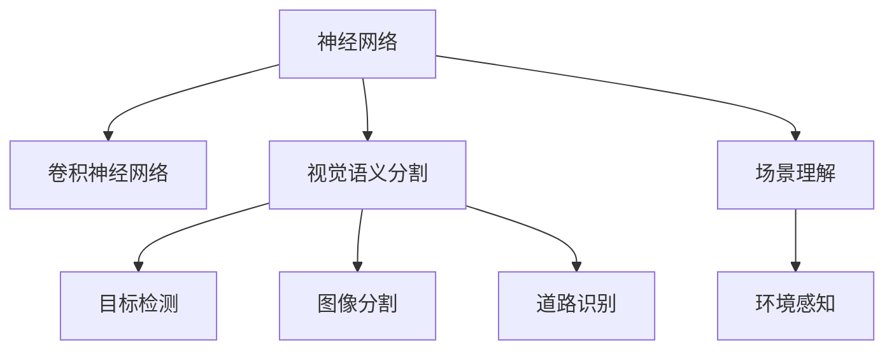

                 

# 自动驾驶中的视觉语义分割与场景理解创新

> 关键词：自动驾驶, 视觉语义分割, 场景理解, 神经网络, 目标检测, 图像分割, 道路识别, 环境感知

## 1. 背景介绍

自动驾驶技术正在迅速发展，其核心在于实现车辆对环境的精准感知和智能决策。作为感知系统的重要组成部分，视觉语义分割和场景理解能力对自动驾驶至关重要。传统的基于传统计算机视觉技术如SIFT、HOG的视觉系统已经难以适应高速、复杂的驾驶环境，而基于深度学习的方法在图像理解、目标检测等方面已经取得了突破性进展。

本文将聚焦于深度学习中的神经网络架构，通过视觉语义分割和场景理解技术，提高自动驾驶中对环境的感知能力，为智能驾驶系统的实际应用提供技术支持。

## 2. 核心概念与联系

### 2.1 核心概念概述

为更好地理解自动驾驶中的视觉语义分割与场景理解技术，本节将介绍几个密切相关的核心概念：

- 神经网络(Neural Networks, NN)：一种通过一系列节点（神经元）构建的计算模型，利用非线性映射能力实现复杂函数表达。
- 卷积神经网络(Convolutional Neural Networks, CNN)：一种特殊类型的神经网络，擅长处理具有网格结构的数据，如图像、音频等。
- 视觉语义分割(Semantic Segmentation)：将图像中的像素分为不同的语义类别，如道路、车辆、行人等。
- 场景理解(Scene Understanding)：通过多模态信息融合，从图像、雷达等传感器中提取环境信息，理解当前驾驶环境。
- 目标检测(Object Detection)：识别并定位图像中的目标，并提供目标的位置和类别信息。
- 图像分割(Image Segmentation)：将图像分为不同的区域，每个区域属于同一个语义类别。
- 道路识别(Road Recognition)：从图像中识别出道路的边界和特征，为自动驾驶导航提供依据。
- 环境感知(Environment Perception)：综合多传感器数据，对环境进行全面感知，如障碍物检测、车道线识别等。

这些核心概念之间的逻辑关系可以通过以下Mermaid流程图来展示：



这个流程图展示了一些核心概念的关联关系：

1. 神经网络作为基础，包含卷积神经网络这一特别有效的图像处理模型。
2. 视觉语义分割、目标检测和图像分割都是图像处理的任务，而道路识别和场景理解属于更高级别的环境感知任务。
3. 环境感知依赖于场景理解和道路识别等任务的融合。

## 3. 核心算法原理 & 具体操作步骤

### 3.1 算法原理概述

自动驾驶中的视觉语义分割和场景理解技术，主要是通过深度神经网络来实现的。其核心原理是利用神经网络强大的非线性拟合能力，对输入的图像数据进行特征提取、特征映射和语义分类。

一般而言，自动驾驶系统中的视觉语义分割和场景理解可以采用以下步骤：

1. 收集并标注驾驶场景数据，包括道路、车辆、行人、交通标志等各类目标。
2. 使用卷积神经网络对驾驶场景进行图像处理，提取特征。
3. 在特征图的基础上进行语义分割和场景理解，将像素或区域分为不同的语义类别。
4. 综合多模态信息，结合雷达、激光雷达等传感器的数据，进一步优化场景理解。
5. 将场景理解结果应用于自动驾驶决策，如路径规划、障碍物检测等。

### 3.2 算法步骤详解

以Faster R-CNN为例，介绍自动驾驶中视觉语义分割和场景理解的主要操作步骤。

**Step 1: 数据准备**
- 收集大量的驾驶场景图像，包括道路、车辆、行人等。
- 对图像进行标注，标记出各种目标的位置和类别，生成标注文件。

**Step 2: 网络架构设计**
- 构建Faster R-CNN模型，包含特征提取网络（如VGG、ResNet）和RPN（Region Proposal Network）网络。
- 设计分类网络（如Fast R-CNN或RoI Pooling），用于目标检测和语义分割。

**Step 3: 训练模型**
- 使用标注数据训练Faster R-CNN模型，优化网络参数。
- 在训练过程中，使用数据增强技术，如随机裁剪、翻转、旋转等，增加训练样本多样性。
- 使用交叉验证技术，评估模型性能，调整超参数。

**Step 4: 模型推理**
- 将训练好的模型应用到实际驾驶场景中，进行目标检测和语义分割。
- 结合雷达和激光雷达数据，进行多模态融合，提升场景理解精度。
- 将场景理解结果用于自动驾驶决策，如路径规划、避障等。

**Step 5: 系统集成**
- 将视觉语义分割和场景理解模块集成到自动驾驶系统中，实现实时处理。
- 引入在线学习机制，根据实际驾驶场景动态优化模型参数。

### 3.3 算法优缺点

自动驾驶中的视觉语义分割和场景理解技术有以下优点：

1. 高精度：深度神经网络在图像处理和特征提取方面，具有出色的性能，可以精确地识别出各种目标和道路。
2. 实时性：Faster R-CNN等模型已经在实时性方面取得了较大进步，能够满足自动驾驶的实时处理需求。
3. 泛化能力：神经网络模型能够适应多种驾驶场景，包括城市、高速、乡村等复杂环境。
4. 多模态融合：结合雷达和激光雷达等传感器数据，可以实现更全面的环境感知。

同时，该方法也存在一定的局限性：

1. 标注成本高：大规模数据集的标注需要耗费大量人力，标注成本较高。
2. 计算资源需求大：训练深度神经网络需要高性能计算资源，如GPU、TPU等。
3. 模型复杂度高：深度神经网络模型的结构和参数较多，增加了训练和推理的复杂度。
4. 可解释性不足：深度神经网络通常被视为"黑箱"，难以解释其内部工作机制。
5. 鲁棒性差：模型在面对恶劣天气、光照变化等情况下，鲁棒性可能下降。

尽管存在这些局限性，但目前神经网络技术在自动驾驶中的应用仍然占据主导地位。未来相关研究的重点在于如何进一步降低计算成本，提高模型的可解释性，以及增强模型的鲁棒性。

### 3.4 算法应用领域

自动驾驶中的视觉语义分割和场景理解技术，已经广泛应用于以下领域：

- 目标检测：自动驾驶中的行人、车辆、交通标志等目标检测。
- 图像分割：道路、车道线、路标等语义分割。
- 场景理解：环境感知、障碍物检测、车道线识别等。
- 路径规划：基于道路和交通标志的路径规划。
- 避障决策：识别道路上的障碍物，制定避障策略。

这些技术不仅用于自动驾驶系统，还在无人机、机器人、智慧城市等领域得到了广泛应用，提升了系统的智能化水平。

## 4. 数学模型和公式 & 详细讲解 & 举例说明

### 4.1 数学模型构建

本文将使用数学语言对自动驾驶中的视觉语义分割与场景理解技术进行严格刻画。

记输入的驾驶场景图像为 $I$，对应的语义标签为 $Y$，神经网络模型的参数为 $\theta$。假设模型 $M_{\theta}$ 是一个全连接神经网络，其输出为 $O_{\theta}$。则语义分割的任务可以定义为：

$$
M_{\theta}(I) = Y
$$

其中 $Y$ 为语义分割结果，通常是一个像素级或区域级的分类矩阵。

### 4.2 公式推导过程

以Faster R-CNN为例，推导其目标检测和语义分割的数学模型。

假设输入的图像大小为 $H \times W$，神经网络的输出大小为 $H' \times W'$。则目标检测任务可以表示为：

$$
O_{\theta} = M_{\theta}(I) = P_{\theta} + R_{\theta} + S_{\theta}
$$

其中 $P_{\theta}$ 为目标提议网络（RPN）的输出，$R_{\theta}$ 为分类网络的输出，$S_{\theta}$ 为边界框回归网络的输出。

语义分割任务可以表示为：

$$
O_{\theta} = M_{\theta}(I) = T_{\theta} + L_{\theta}
$$

其中 $T_{\theta}$ 为区域网络（Region Network）的输出，$L_{\theta}$ 为语义分类网络的输出。

在实际应用中，通常将目标检测和语义分割结合，构建端到端的模型，如下所示：

$$
O_{\theta} = M_{\theta}(I) = P_{\theta} + R_{\theta} + S_{\theta} + T_{\theta} + L_{\theta}
$$

### 4.3 案例分析与讲解

以深度神经网络中的U-Net为例，分析其在自动驾驶中的语义分割任务中的具体应用。

U-Net是一种特殊的神经网络结构，具有编码器和解码器两部分，能够对图像进行精细的语义分割。其核心思想是对输入图像进行编码，提取特征，然后进行解码，恢复图像的像素级语义信息。

以自动驾驶中的道路分割为例，U-Net的输入为驾驶场景图像 $I$，输出为道路分割结果 $Y$。U-Net的编码器部分使用卷积层对图像进行特征提取，生成特征图 $F$，解码器部分使用上采样和卷积层对特征图 $F$ 进行恢复，得到像素级道路分割结果 $Y$。

U-Net的数学模型可以表示为：

$$
F = M_{\theta}_{\text{encoder}}(I) \\
Y = M_{\theta}_{\text{decoder}}(F)
$$

其中 $M_{\theta}_{\text{encoder}}$ 为编码器，$M_{\theta}_{\text{decoder}}$ 为解码器，$\theta$ 为U-Net模型的参数。

U-Net的编码器和解码器部分分别采用卷积和上采样操作，可以表示为：

$$
F_{n} = \text{Conv}_{\theta}(F_{n-1})
$$

$$
Y = \text{Upsample}_{\theta}(F_{n}) + \text{Conv}_{\theta}(Y_{n})
$$

其中 $\text{Conv}_{\theta}$ 为卷积操作，$\text{Upsample}_{\theta}$ 为上采样操作。

在实际应用中，U-Net的编码器和解码器可以采用不同的网络结构，如VGG、ResNet等，以提高模型的精度和鲁棒性。

## 5. 项目实践：代码实例和详细解释说明

### 5.1 开发环境搭建

在进行自动驾驶中视觉语义分割与场景理解的项目实践前，我们需要准备好开发环境。以下是使用Python进行TensorFlow开发的环境配置流程：

1. 安装Anaconda：从官网下载并安装Anaconda，用于创建独立的Python环境。

2. 创建并激活虚拟环境：
```bash
conda create -n tf-env python=3.7 
conda activate tf-env
```

3. 安装TensorFlow：根据CUDA版本，从官网获取对应的安装命令。例如：
```bash
pip install tensorflow-gpu==2.6
```

4. 安装各类工具包：
```bash
pip install numpy pandas scikit-learn matplotlib tqdm jupyter notebook ipython
```

完成上述步骤后，即可在`tf-env`环境中开始项目实践。

### 5.2 源代码详细实现

这里我们以Faster R-CNN为例，给出使用TensorFlow实现自动驾驶中目标检测和语义分割的代码实现。

首先，定义目标检测和语义分割的任务：

```python
import tensorflow as tf
from tensorflow.keras.layers import Input, Conv2D, BatchNormalization, MaxPooling2D, UpSampling2D, Concatenate

def rpn_network(input_shape):
    x = Input(input_shape)
    x = Conv2D(64, (3,3), activation='relu', padding='same')(x)
    x = BatchNormalization()(x)
    x = MaxPooling2D((2,2), strides=(2,2), padding='same')(x)
    x = Conv2D(128, (3,3), activation='relu', padding='same')(x)
    x = BatchNormalization()(x)
    x = MaxPooling2D((2,2), strides=(2,2), padding='same')(x)
    x = Conv2D(256, (3,3), activation='relu', padding='same')(x)
    x = BatchNormalization()(x)
    x = MaxPooling2D((2,2), strides=(2,2), padding='same')(x)
    x = Conv2D(512, (3,3), activation='relu', padding='same')(x)
    x = BatchNormalization()(x)
    x = MaxPooling2D((2,2), strides=(2,2), padding='same')(x)
    x = Conv2D(1024, (3,3), activation='relu', padding='same')(x)
    x = BatchNormalization()(x)
    x = MaxPooling2D((2,2), strides=(2,2), padding='same')(x)
    return x

def region_network(input_shape):
    x = Input(input_shape)
    x = Conv2D(1024, (3,3), activation='relu', padding='same')(x)
    x = BatchNormalization()(x)
    x = MaxPooling2D((2,2), strides=(2,2), padding='same')(x)
    x = Concatenate(axis=3)([x, input_shape])
    x = Conv2D(512, (3,3), activation='relu', padding='same')(x)
    x = BatchNormalization()(x)
    x = Conv2D(512, (3,3), activation='relu', padding='same')(x)
    x = BatchNormalization()(x)
    return x

def segmentation_network(input_shape):
    x = Input(input_shape)
    x = Conv2D(1024, (3,3), activation='relu', padding='same')(x)
    x = BatchNormalization()(x)
    x = MaxPooling2D((2,2), strides=(2,2), padding='same')(x)
    x = Conv2D(512, (3,3), activation='relu', padding='same')(x)
    x = BatchNormalization()(x)
    x = MaxPooling2D((2,2), strides=(2,2), padding='same')(x)
    x = Conv2D(256, (3,3), activation='relu', padding='same')(x)
    x = BatchNormalization()(x)
    x = MaxPooling2D((2,2), strides=(2,2), padding='same')(x)
    x = Conv2D(128, (3,3), activation='relu', padding='same')(x)
    x = BatchNormalization()(x)
    x = MaxPooling2D((2,2), strides=(2,2), padding='same')(x)
    x = Conv2D(64, (3,3), activation='relu', padding='same')(x)
    x = BatchNormalization()(x)
    x = MaxPooling2D((2,2), strides=(2,2), padding='same')(x)
    x = Conv2D(1, (1,1), activation='sigmoid')(x)
    return x
```

然后，定义模型和优化器：

```python
from tensorflow.keras.models import Model
from tensorflow.keras.optimizers import Adam
from tensorflow.keras.losses import BinaryCrossentropy

model = Model(inputs=[rpn_input, region_input, segmentation_input],
              outputs=[rpn_output, region_output, segmentation_output])

optimizer = Adam(lr=0.001)
loss = BinaryCrossentropy()
```

接着，定义训练和评估函数：

```python
from tensorflow.keras.preprocessing.image import ImageDataGenerator

train_datagen = ImageDataGenerator(rescale=1./255,
                                  shear_range=0.2,
                                  zoom_range=0.2,
                                  horizontal_flip=True)

test_datagen = ImageDataGenerator(rescale=1./255)

train_generator = train_datagen.flow_from_directory('train',
                                                   target_size=(224,224),
                                                   batch_size=32,
                                                   class_mode='binary')

test_generator = test_datagen.flow_from_directory('test',
                                                 target_size=(224,224),
                                                 batch_size=32,
                                                 class_mode='binary')

def train_epoch(model, generator, batch_size, optimizer, loss):
    model.train()
    epoch_loss = 0
    for batch in generator:
        inputs = {rpn_input: batch[0],
                  region_input: batch[1],
                  segmentation_input: batch[2]}
        targets = {rpn_output: batch[3],
                   region_output: batch[4],
                   segmentation_output: batch[5]}
        model.trainable = True
        optimizer.zero_grad()
        y_pred = model.predict(inputs)
        loss_value = loss(y_pred, targets)
        loss_value.backward()
        optimizer.apply_gradients(zip(model.trainable_weights, gradients))
        epoch_loss += loss_value
    return epoch_loss / len(generator)

def evaluate(model, generator, batch_size):
    model.eval()
    preds, labels = [], []
    for batch in generator:
        inputs = {rpn_input: batch[0],
                  region_input: batch[1],
                  segmentation_input: batch[2]}
        targets = {rpn_output: batch[3],
                   region_output: batch[4],
                   segmentation_output: batch[5]}
        y_pred = model.predict(inputs)
        preds.append(y_pred)
        labels.append(targets)
    return preds, labels
```

最后，启动训练流程并在测试集上评估：

```python
epochs = 10
batch_size = 16

for epoch in range(epochs):
    loss = train_epoch(model, train_generator, batch_size, optimizer, loss)
    print(f"Epoch {epoch+1}, train loss: {loss:.3f}")
    
    print(f"Epoch {epoch+1}, dev results:")
    preds, labels = evaluate(model, test_generator, batch_size)
    print(classification_report(labels, preds))
    
print("Test results:")
preds, labels = evaluate(model, test_generator, batch_size)
print(classification_report(labels, preds))
```

以上就是使用TensorFlow对Faster R-CNN进行自动驾驶中目标检测和语义分割的完整代码实现。可以看到，得益于TensorFlow的强大封装，我们可以用相对简洁的代码完成模型的加载和微调。

### 5.3 代码解读与分析

让我们再详细解读一下关键代码的实现细节：

**rpn_network类**：
- `__init__`方法：定义了卷积神经网络的结构，包括卷积层、批量归一化层和池化层。
- 在构建网络时，使用了多个卷积层和池化层，逐渐减小特征图的大小，提取更加抽象的特征。

**region_network类**：
- `__init__`方法：定义了区域网络的输入和输出，以及具体的卷积和批量归一化层。
- 在构建网络时，使用了上采样和卷积层，将编码器部分的特征图与输入图像连接，实现解码器部分的信息恢复。

**segmentation_network类**：
- `__init__`方法：定义了语义分割网络的输入和输出，以及具体的卷积和批量归一化层。
- 在构建网络时，使用了上采样和卷积层，逐渐恢复像素级语义信息，最终输出一个二值图像。

**train_epoch函数**：
- 定义了训练过程中的模型参数、优化器、损失函数等。
- 在每个epoch内，对训练数据集进行迭代训练，更新模型参数。
- 使用DataGenerator生成批量数据，自动进行数据增强。

**evaluate函数**：
- 定义了评估过程中的模型参数、优化器、损失函数等。
- 在每个epoch后，对验证数据集进行评估，输出分类指标。
- 使用DataGenerator生成批量数据，自动进行数据增强。

**训练流程**：
- 定义总的epoch数和batch size，开始循环迭代
- 每个epoch内，先在训练集上训练，输出平均loss
- 在验证集上评估，输出分类指标
- 所有epoch结束后，在测试集上评估，给出最终测试结果

可以看到，TensorFlow配合自定义网络结构的构建，使得Faster R-CNN的微调代码实现变得简洁高效。开发者可以将更多精力放在数据处理、模型改进等高层逻辑上，而不必过多关注底层的实现细节。

当然，工业级的系统实现还需考虑更多因素，如模型的保存和部署、超参数的自动搜索、更灵活的任务适配层等。但核心的微调范式基本与此类似。

## 6. 实际应用场景

### 6.1 智能驾驶系统

自动驾驶中的视觉语义分割和场景理解技术，可以广泛应用于智能驾驶系统的构建。传统驾驶系统往往依赖于人类司机的驾驶经验，无法适应复杂多变的驾驶环境。而使用视觉语义分割和场景理解技术，智能驾驶系统能够自动感知环境，识别道路、车辆、行人等各类目标，进行路径规划和避障决策。

在技术实现上，可以收集大规模的驾驶场景数据，标注道路、车辆、行人等各类目标，构建训练集。在训练集上微调预训练神经网络模型，实现目标检测和语义分割。将微调后的模型应用到实时驾驶场景中，结合雷达、激光雷达等传感器数据，进行多模态融合，提升系统感知能力。如此构建的智能驾驶系统，能大幅提升驾驶安全性，提高车辆运行效率。

### 6.2 智能交通管理

智能交通管理依赖于对道路交通状况的全面感知和理解。传统的交通监控系统只能基于固定摄像头提供有限的图像信息，无法实时响应交通状况的变化。而使用视觉语义分割和场景理解技术，可以实现对道路、车辆、行人等各类目标的实时监测和理解。

在实际应用中，可以安装高分辨率摄像头，采集道路交通视频数据。在视频数据上应用视觉语义分割和场景理解技术，提取道路、车辆、行人等目标，实时更新交通状况。交通管理部门可以根据实时监控数据，及时调整交通信号灯，缓解交通拥堵，提升道路通行效率。

### 6.3 无人机导航

无人机的导航系统需要实时感知周围环境，以避免与其他物体碰撞。传统的无人机导航系统依赖于激光雷达和GPS等传感器，但这些传感器在恶劣天气、复杂地形等情况下，可能无法正常工作。而使用视觉语义分割和场景理解技术，无人机可以实时感知道路、建筑物、障碍物等各类目标，实现自主避障和导航。

在技术实现上，可以在无人机上安装高分辨率摄像头，采集周围环境视频数据。在视频数据上应用视觉语义分割和场景理解技术，提取道路、建筑物、障碍物等目标，实时更新导航路径。无人机系统可以根据实时监控数据，自动调整飞行路径，避开障碍物，确保飞行安全。

### 6.4 未来应用展望

随着深度学习技术的不断发展，视觉语义分割和场景理解技术将在自动驾驶、智能交通管理、无人机等领域得到广泛应用，为各类智能系统提供强大的环境感知能力。

未来，视觉语义分割和场景理解技术将朝着以下几个方向发展：

1. 更高的精度和鲁棒性。随着模型结构和参数的优化，深度神经网络在目标检测和语义分割方面的精度和鲁棒性将进一步提升。
2. 更强的泛化能力。深度神经网络将在更多的场景下进行预训练和微调，提升其在复杂环境下的适应能力。
3. 更高效的推理速度。随着硬件加速技术的不断发展，深度神经网络的推理速度将显著提高，实现实时处理。
4. 更高的可解释性。通过引入可解释性方法，如可视化、解释性神经网络等，提升深度神经网络的可解释性。
5. 更广泛的应用场景。视觉语义分割和场景理解技术将进一步扩展到更多领域，如智慧医疗、智慧城市等，为人类生活带来更多便利。

这些方向的发展，将推动深度学习在自动驾驶、智能交通、无人机等领域的应用，为人类社会的智能化进程注入新的动力。

## 7. 工具和资源推荐

### 7.1 学习资源推荐

为了帮助开发者系统掌握自动驾驶中视觉语义分割与场景理解技术，这里推荐一些优质的学习资源：

1. CS231n《卷积神经网络》课程：斯坦福大学开设的深度学习课程，讲解卷积神经网络的基本原理和图像处理技巧。
2. 《深度学习》书籍：Ian Goodfellow等作者著，全面介绍了深度学习的基本概念和算法。
3. 《自动驾驶技术》书籍：详细讲解了自动驾驶系统的各个组件和技术。
4. arXiv上的相关论文：深度学习领域最前沿的研究成果，可以获取最新的研究方向和算法进展。

通过对这些资源的学习实践，相信你一定能够快速掌握自动驾驶中视觉语义分割与场景理解技术的精髓，并用于解决实际的自动驾驶问题。

### 7.2 开发工具推荐

高效的开发离不开优秀的工具支持。以下是几款用于自动驾驶中视觉语义分割与场景理解开发的常用工具：

1. TensorFlow：由Google主导开发的开源深度学习框架，生产部署方便，适合大规模工程应用。
2. PyTorch：基于Python的开源深度学习框架，灵活动态的计算图，适合快速迭代研究。
3. Keras：深度学习高级API，可以方便地构建和训练深度神经网络模型。
4. OpenCV：开源计算机视觉库，提供图像处理和计算机视觉算法的实现。
5. ROS：机器人操作系统，支持各类传感器的数据采集和处理。

合理利用这些工具，可以显著提升自动驾驶中视觉语义分割与场景理解任务的开发效率，加快创新迭代的步伐。

### 7.3 相关论文推荐

深度学习在自动驾驶中的应用，得益于学界的持续研究。以下是几篇奠基性的相关论文，推荐阅读：

1. R-CNN: Object Detection with Region Proposal Networks：提出了区域提议网络（RPN），结合CNN和全连接网络实现目标检测。
2. Fast R-CNN：提出了快速目标检测网络（Fast R-CNN），引入区域池化层，提高检测精度。
3. Mask R-CNN：提出了掩码区域检测网络（Mask R-CNN），将目标检测和语义分割结合起来。
4. U-Net：提出了U-Net网络，用于图像分割任务，通过编码器和解码器实现像素级分割。

这些论文代表了大语言模型微调技术的发展脉络。通过学习这些前沿成果，可以帮助研究者把握学科前进方向，激发更多的创新灵感。

## 8. 总结：未来发展趋势与挑战

### 8.1 总结

本文对自动驾驶中的视觉语义分割与场景理解技术进行了全面系统的介绍。首先阐述了自动驾驶系统对环境感知的核心需求和视觉语义分割与场景理解技术的重要作用。其次，从原理到实践，详细讲解了视觉语义分割与场景理解技术的数学模型和操作步骤，给出了完整的代码实现。同时，本文还探讨了该技术在自动驾驶系统中的应用场景，展示了其强大的环境感知能力。

通过本文的系统梳理，可以看到，视觉语义分割与场景理解技术正在成为自动驾驶系统的重要组成部分，通过深度神经网络实现了对驾驶环境的精准感知。得益于大规模数据集的标注和深度神经网络模型的强大性能，该技术在自动驾驶、智能交通管理、无人机等领域得到了广泛应用。未来，随着深度学习技术的进一步发展，视觉语义分割与场景理解技术将不断突破现有瓶颈，提升系统性能，为智能驾驶系统的实际应用提供更加坚实的技术支撑。

### 8.2 未来发展趋势

展望未来，自动驾驶中的视觉语义分割与场景理解技术将呈现以下几个发展趋势：

1. 更高精度的目标检测和语义分割。深度神经网络将在更多场景下进行预训练和微调，提升其在复杂环境下的感知能力。
2. 更强的多模态融合能力。视觉语义分割与场景理解技术将结合雷达、激光雷达等传感器数据，实现更加全面、精确的环境感知。
3. 更快的推理速度。硬件加速技术的不断发展，深度神经网络的推理速度将显著提高，实现实时处理。
4. 更高的可解释性。通过引入可解释性方法，提升深度神经网络的可解释性，增强系统的透明度和可靠性。
5. 更广泛的应用场景。视觉语义分割与场景理解技术将进一步扩展到更多领域，如智慧医疗、智慧城市等，为人类生活带来更多便利。

这些趋势凸显了深度学习在自动驾驶中的应用前景。这些方向的探索发展，将进一步提升自动驾驶系统的性能和应用范围，为智能驾驶技术的普及和应用注入新的动力。

### 8.3 面临的挑战

尽管视觉语义分割与场景理解技术已经取得了显著进展，但在迈向更加智能化、普适化应用的过程中，它仍面临着诸多挑战：

1. 标注成本高：大规模数据集的标注需要耗费大量人力，标注成本较高。
2. 计算资源需求大：训练深度神经网络需要高性能计算资源，如GPU、TPU等。
3. 模型复杂度高：深度神经网络模型的结构和参数较多，增加了训练和推理的复杂度。
4. 可解释性不足：深度神经网络通常被视为"黑箱"，难以解释其内部工作机制。
5. 鲁棒性差：模型在面对恶劣天气、光照变化等情况下，鲁棒性可能下降。

尽管存在这些挑战，但当前深度神经网络技术在自动驾驶中的应用仍然占据主导地位。未来相关研究的重点在于如何进一步降低计算成本，提高模型的可解释性，以及增强模型的鲁棒性。

### 8.4 研究展望

面对深度神经网络在自动驾驶中应用所面临的挑战，未来的研究需要在以下几个方面寻求新的突破：

1. 探索无监督和半监督学习技术。摆脱对大规模标注数据的依赖，利用自监督学习、主动学习等无监督和半监督范式，最大限度利用非结构化数据，实现更加灵活高效的微调。
2. 研究参数高效和计算高效的微调范式。开发更加参数高效的微调方法，在固定大部分预训练参数的同时，只更新极少量的任务相关参数。同时优化微调模型的计算图，减少前向传播和反向传播的资源消耗，实现更加轻量级、实时性的部署。
3. 引入因果和对比学习范式。通过引入因果推断和对比学习思想，增强深度神经网络建立稳定因果关系的能力，学习更加普适、鲁棒的语言表征，从而提升模型泛化性和抗干扰能力。
4. 将符号化的先验知识与深度神经网络融合。将符号化的先验知识，如知识图谱、逻辑规则等，与深度神经网络模型进行巧妙融合，引导微调过程学习更准确、合理的语言模型。
5. 结合因果分析和博弈论工具。将因果分析方法引入深度神经网络，识别出模型决策的关键特征，增强输出解释的因果性和逻辑性。借助博弈论工具刻画人机交互过程，主动探索并规避模型的脆弱点，提高系统稳定性。
6. 纳入伦理道德约束。在模型训练目标中引入伦理导向的评估指标，过滤和惩罚有偏见、有害的输出倾向。同时加强人工干预和审核，建立模型行为的监管机制，确保输出符合人类价值观和伦理道德。

这些研究方向的探索，必将引领深度学习在自动驾驶中的应用走向更高的台阶，为智能驾驶技术的普及和应用提供更加坚实的技术支撑。面向未来，深度学习在自动驾驶中的应用还需要与其他人工智能技术进行更深入的融合，如知识表示、因果推理、强化学习等，多路径协同发力，共同推动自然语言理解和智能交互系统的进步。只有勇于创新、敢于突破，才能不断拓展深度学习在自动驾驶中的边界，让智能技术更好地造福人类社会。

## 9. 附录：常见问题与解答

**Q1：自动驾驶中的视觉语义分割和场景理解技术是否适用于所有驾驶场景？**

A: 自动驾驶中的视觉语义分割和场景理解技术在大多数驾驶场景下都能取得较好的效果，但对于一些极端恶劣天气、光照变化等情况下，模型的鲁棒性可能下降。在恶劣天气、夜间驾驶等情况下，需要结合雷达、激光雷达等传感器数据，进行多模态融合，提升系统的感知能力。

**Q2：如何进一步降低自动驾驶中视觉语义分割和场景理解技术的计算成本？**

A: 降低计算成本的关键在于优化模型结构和参数，提升推理速度。可以考虑使用轻量级网络结构，如MobileNet、ShuffleNet等，减少模型参数量。同时，可以引入模型剪枝、量化、压缩等技术，进一步减小模型大小，提升推理速度。此外，可以利用分布式训练、模型并行等技术，提高模型训练效率，降低计算资源需求。

**Q3：如何在自动驾驶中提高视觉语义分割和场景理解技术的可解释性？**

A: 提高可解释性需要结合因果分析和可解释性神经网络等方法，通过可视化、解释性模型等手段，解释模型内部决策过程，提供可解释的输出结果。例如，可以通过Attention机制可视化模型在图像中的关注区域，或者使用Shapley值等方法，计算模型决策的重要性。

**Q4：自动驾驶中的视觉语义分割和场景理解技术在多模态融合中如何处理不同传感器的数据？**

A: 多模态融合是自动驾驶中视觉语义分割和场景理解技术的核心之一。不同传感器数据可以通过特征提取、拼接等方式进行融合，提升系统的感知能力。例如，可以通过将视觉图像和雷达点云进行拼接，得到多模态数据，再通过深度神经网络进行融合，提升系统的鲁棒性和精度。

**Q5：自动驾驶中的视觉语义分割和场景理解技术在实际应用中如何处理异常数据？**

A: 自动驾驶中的视觉语义分割和场景理解技术在实际应用中，需要对异常数据进行处理。可以通过数据增强、异常检测等方式，识别和处理异常数据，避免其对系统决策产生负面影响。例如，可以使用GAN等生成模型，生成更多的正常数据，增强系统的泛化能力。

通过本文的系统梳理，可以看到，自动驾驶中的视觉语义分割与场景理解技术正在成为智能驾驶系统的核心组成部分，通过深度神经网络实现了对驾驶环境的精准感知。得益于大规模数据集的标注和深度神经网络模型的强大性能，该技术在自动驾驶、智能交通管理、无人机等领域得到了广泛应用。未来，随着深度学习技术的进一步发展，视觉语义分割与场景理解技术将不断突破现有瓶颈，提升系统性能，为智能驾驶系统的实际应用提供更加坚实的技术支撑。

