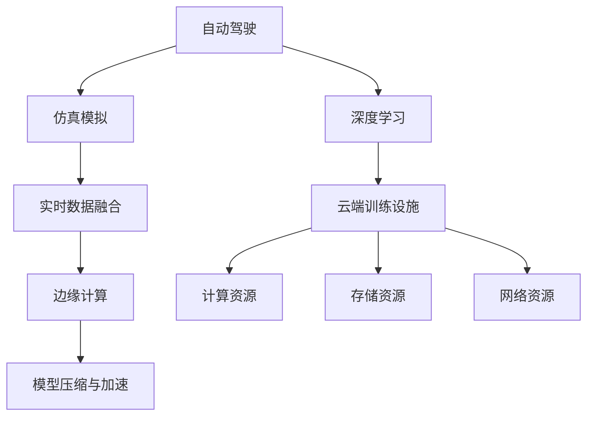

                 

# 自动驾驶公司的云端训练设施建设

> 关键词：自动驾驶, 云计算, 训练设施, 深度学习, 仿真模拟, 数据处理, 边缘计算, 模型压缩

## 1. 背景介绍

### 1.1 问题由来
随着自动驾驶技术逐渐从实验室走向产业化，各大公司开始积极布局相关基础设施建设，以支持大规模自动驾驶模型的训练和优化。其中，云端训练设施的建设尤为关键，它不仅决定了训练速度和效率，还直接关系到自动驾驶技术的落地成本和可维护性。本文旨在探讨自动驾驶公司的云端训练设施建设，包括技术架构、数据处理、计算资源优化等方面的关键问题。

### 1.2 问题核心关键点
自动驾驶训练设施的核心关键点在于如何高效、稳定地支撑大规模深度学习模型的训练，同时确保训练数据的质量和多样性。关键要素包括：
- 选择合适的计算平台和架构。
- 设计高效的数据传输和处理机制。
- 优化模型和算法，提升训练效率。
- 采用仿真模拟和实时数据融合，扩大训练数据规模。
- 应用边缘计算技术，降低中心化依赖。
- 实施模型压缩与加速技术，降低计算资源消耗。

### 1.3 问题研究意义
构建高效的云端训练设施对于自动驾驶技术的发展至关重要，它直接影响到模型的训练速度、成本以及最终性能。高质量的训练数据和高效的计算资源能够加速模型迭代，缩短开发周期，提高系统可靠性，从而在激烈的市场竞争中占据优势。

## 2. 核心概念与联系

### 2.1 核心概念概述

为更好地理解自动驾驶云端训练设施的建设，本节将介绍几个关键概念：

- **自动驾驶**：结合计算机视觉、深度学习、传感器技术等，使汽车能够在无人驾驶条件下自主行驶的技术。
- **云端训练设施**：指基于云计算平台，集成了计算资源、存储资源、网络资源等，用于自动驾驶模型训练的设施。
- **深度学习**：一种能够学习数据中复杂模式和关联的机器学习方法，广泛应用于图像识别、语音识别、自然语言处理等领域。
- **仿真模拟**：使用模拟软件创建虚拟驾驶环境，用于测试和训练自动驾驶算法。
- **实时数据融合**：将传感器采集的实时数据与虚拟模拟数据相结合，提升训练数据的质量。
- **边缘计算**：一种分布式计算技术，通过将计算任务分散到数据产生边缘，提高数据处理效率和实时性。
- **模型压缩与加速**：通过减少模型参数、使用量化技术等手段，降低计算资源消耗，加速模型推理。

这些概念之间的逻辑关系可以通过以下Mermaid流程图来展示：



这个流程图展示了自动驾驶训练设施的核心组成及其之间的关系：

1. 自动驾驶技术依赖于深度学习进行算法训练。
2. 仿真模拟和实时数据融合，扩大训练数据规模和多样性。
3. 边缘计算提高数据处理效率和实时性。
4. 模型压缩与加速降低计算资源消耗。
5. 云端训练设施集成计算、存储和网络资源，支撑模型训练。

## 3. 核心算法原理 & 具体操作步骤
### 3.1 算法原理概述

自动驾驶模型的训练是一个复杂且数据密集的过程，需要大量的计算资源和高质量的训练数据。基于云计算平台的云端训练设施提供了弹性的计算资源和存储能力，能够高效地支持大规模深度学习模型的训练。

核心算法原理包括：
- 数据分布式存储与处理。
- 模型并行训练与优化。
- 实时数据同步与处理。
- 动态资源调度与优化。

### 3.2 算法步骤详解

构建自动驾驶公司的云端训练设施，一般包括以下几个关键步骤：

**Step 1: 设计计算资源架构**
- 选择合适的云计算平台，如AWS、Google Cloud、阿里云等。
- 根据训练任务需求，配置计算资源，包括CPU、GPU、TPU等硬件设施。
- 设计高效的存储方案，支持高吞吐量和低延迟。

**Step 2: 搭建数据处理和传输管道**
- 在云平台部署数据存储系统，如S3、Hadoop、Ceph等。
- 使用数据传输协议（如AWS S3 Transfer Acceleration）提高数据传输效率。
- 设计数据预处理和增量更新机制，确保数据实时性和一致性。

**Step 3: 实施模型并行训练**
- 使用分布式训练框架（如Horovod、Parameter Server），将模型和数据分散到多台计算节点上。
- 设计有效的负载均衡策略，平衡各节点间的计算负载。
- 使用优化算法（如SGD、AdamW）加速模型训练，提高收敛速度。

**Step 4: 应用仿真模拟与实时数据融合**
- 搭建高保真度的虚拟驾驶仿真环境，支持传感器模拟和交通场景重建。
- 设计仿真数据与现实数据的融合机制，提升模型在复杂场景下的鲁棒性。
- 引入强化学习等技术，训练模型在真实环境中的决策能力。

**Step 5: 实施边缘计算与模型压缩**
- 部署边缘计算节点，靠近数据产生源进行计算和数据处理。
- 使用模型压缩技术（如剪枝、量化、蒸馏）减少模型参数量，降低计算资源消耗。
- 实施混合精度训练，提升训练效率和模型性能。

**Step 6: 监控与优化训练过程**
- 使用监控工具（如Kubernetes、TensorBoard）实时监控训练过程，收集性能指标和错误信息。
- 设计自动调参机制，根据数据和硬件变化动态调整超参数。
- 实施弹性调度策略，根据负载动态调整计算资源。

### 3.3 算法优缺点

云端训练设施的优势：
- 弹性的计算资源，满足大规模训练需求。
- 高效的存储和数据传输能力，保障数据实时性。
- 分布式计算和并行训练，提升训练速度和模型性能。

云端训练设施的局限性：
- 数据隐私和安全问题。云端存储和处理可能面临数据泄露和隐私侵犯的风险。
- 网络延迟和带宽限制。远程计算可能导致数据传输延迟，影响训练效率。
- 高昂的云服务费用。大规模计算和存储资源可能带来高昂的运营成本。

### 3.4 算法应用领域

自动驾驶训练设施在多个领域得到了广泛应用，包括：

- **L4/L5自动驾驶**：构建高精度地图、实时路况感知、路径规划、行为决策等关键模块。
- **智能驾驶辅助系统**：增强自动驾驶辅助功能的感知和决策能力。
- **车联网(V2X)**：实现车辆之间的信息共享和协同控制。
- **自动驾驶模拟器测试**：在虚拟环境中测试和验证自动驾驶算法。
- **高精度定位和建图**：使用激光雷达、摄像头等传感器，构建高精度地图和定位系统。
- **智能交通管理**：通过实时数据分析和模拟，优化交通流和信号控制。

## 4. 数学模型和公式 & 详细讲解 & 举例说明
### 4.1 数学模型构建

自动驾驶模型的训练涉及多个子模块的联合优化，包括感知、决策、控制等。我们可以使用强化学习、深度学习、传统控制理论等方法进行模型构建。

以强化学习为例，设自动驾驶车在环境 $E$ 中采取行动 $A$，得到奖励 $R$，状态转移 $S'$。则其目标是在环境 $E$ 中学习最优策略 $\pi$，使得期望总奖励 $J(\pi)$ 最大化。数学模型如下：

$$
\max_{\pi} \mathbb{E}_{\pi}[ \sum_{t=0}^{\infty} \gamma^t R_t ]
$$

其中，$\gamma$ 为折扣因子，控制奖励的未来价值。

### 4.2 公式推导过程

使用强化学习框架，如Q-learning、SARSA等，对自动驾驶模型进行训练。以Q-learning为例，目标是在每个状态下选择最优行动，最大化累计奖励。具体推导如下：

- 设状态 $s_t$，行动 $a_t$，奖励 $r_t$，下一个状态 $s_{t+1}$，Q函数为 $Q(s_t, a_t)$。
- 根据状态 $s_t$ 和行动 $a_t$，得到奖励 $r_t$ 和下一个状态 $s_{t+1}$。
- 更新Q函数：
  $$
  Q(s_t, a_t) \leftarrow Q(s_t, a_t) + \alpha [r_t + \gamma \max_{a_{t+1}} Q(s_{t+1}, a_{t+1}) - Q(s_t, a_t)]
  $$
  其中 $\alpha$ 为学习率。

### 4.3 案例分析与讲解

以自动驾驶模型在智能交通管理中的应用为例：

- **数据收集**：使用摄像头、雷达等传感器，实时采集交通流量、车辆位置、速度等信息。
- **数据预处理**：对采集数据进行滤波、校正、融合等处理，确保数据质量。
- **模型训练**：使用Q-learning等强化学习算法，训练模型在不同交通场景下的决策策略。
- **仿真验证**：在虚拟交通环境中，测试和验证训练模型的性能。
- **实时部署**：将训练好的模型部署到智能交通管理系统中，实时调控交通信号和流量。

## 5. 项目实践：代码实例和详细解释说明
### 5.1 开发环境搭建

在进行自动驾驶模型训练设施的实践前，我们需要准备好开发环境。以下是使用Python进行TensorFlow开发的 environment 配置流程：

1. 安装Anaconda：从官网下载并安装Anaconda，用于创建独立的Python环境。

2. 创建并激活虚拟环境：
```bash
conda create -n tf-env python=3.8 
conda activate tf-env
```

3. 安装TensorFlow：根据CUDA版本，从官网获取对应的安装命令。例如：
```bash
conda install tensorflow -c tf
```

4. 安装TensorBoard：
```bash
pip install tensorboard
```

5. 安装数据处理和传输工具：
```bash
pip install pandas numpy scikit-learn kaggle
```

完成上述步骤后，即可在`tf-env`环境中开始训练设施的实践。

### 5.2 源代码详细实现

下面以自动驾驶模型在智能交通管理中的应用为例，给出使用TensorFlow进行模型训练的PyTorch代码实现。

首先，定义训练数据预处理函数：

```python
import pandas as pd
import numpy as np

def preprocess_data(data_path):
    data = pd.read_csv(data_path)
    # 数据清洗和预处理
    data = data.dropna() # 删除缺失值
    data = data.drop_duplicates() # 删除重复值
    # 特征工程
    data['feature'] = data['speed'] + data['acceleration'] * 0.01
    # 归一化
    data = (data - data.mean()) / data.std()
    return data
```

然后，定义模型训练函数：

```python
import tensorflow as tf
from tensorflow.keras.layers import Dense, Flatten
from tensorflow.keras.models import Sequential

def train_model(data):
    model = Sequential()
    model.add(Dense(32, activation='relu', input_shape=(4,)))
    model.add(Dense(1, activation='sigmoid'))
    model.compile(optimizer='adam', loss='binary_crossentropy', metrics=['accuracy'])
    model.fit(data.drop('label', axis=1), data['label'], epochs=10, batch_size=32)
    return model
```

接着，定义训练监控函数：

```python
import tensorflow as tf
from tensorflow.keras.callbacks import EarlyStopping, TensorBoard

def monitor_train(model, data, save_dir):
    early_stopping = EarlyStopping(monitor='val_loss', patience=5)
    tensorboard = TensorBoard(log_dir=save_dir)
    model.fit(data.drop('label', axis=1), data['label'], epochs=100, batch_size=32,
              validation_split=0.2, callbacks=[early_stopping, tensorboard])
    model.save_weights(save_dir + '/model.h5')
```

最后，启动训练流程并在测试集上评估：

```python
import os
import tensorflow as tf

save_dir = '/home/tensorflow/checkpoint'
data_path = '/home/tensorflow/data.csv'

data = preprocess_data(data_path)
model = train_model(data)

monitor_train(model, data, save_dir)

test_data = preprocess_data('/home/tensorflow/test_data.csv')
test_loss, test_acc = model.evaluate(test_data.drop('label', axis=1), test_data['label'])
print(f'Test loss: {test_loss:.4f}')
print(f'Test accuracy: {test_acc:.4f}')
```

以上就是使用TensorFlow对自动驾驶模型进行训练的完整代码实现。可以看到，得益于TensorFlow的强大封装，我们可以用相对简洁的代码完成自动驾驶模型的训练。

### 5.3 代码解读与分析

让我们再详细解读一下关键代码的实现细节：

**preprocess_data函数**：
- 从CSV文件中读取数据。
- 进行数据清洗和预处理，包括删除缺失值和重复值。
- 进行特征工程，构造新的特征。
- 进行归一化处理，确保数据的一致性。

**train_model函数**：
- 定义神经网络模型，包括输入层、隐藏层和输出层。
- 使用adam优化器和二元交叉熵损失函数进行模型编译。
- 使用fit方法进行模型训练，设定迭代轮数和批次大小。

**monitor_train函数**：
- 定义EarlyStopping回调，监控验证集的损失，当损失连续5轮没有提升时停止训练。
- 定义TensorBoard回调，记录训练过程中的各种指标，方便后续分析。
- 使用fit方法进行模型训练，设定超参数和回调函数。
- 保存训练好的模型权重。

**训练流程**：
- 设置保存模型的目录和测试数据路径。
- 调用预处理函数，对测试数据进行预处理。
- 训练模型，并记录训练过程中的损失和精度。
- 评估训练好的模型在测试集上的性能，输出评估结果。

可以看到，TensorFlow提供了强大的工具和框架，使得自动驾驶模型的训练过程变得简单高效。开发者可以根据实际需求，进一步优化模型和训练流程，提高自动驾驶系统的性能和可靠性。

## 6. 实际应用场景
### 6.1 智能交通管理

自动驾驶训练设施在智能交通管理中具有广泛的应用前景。传统交通管理主要依赖人工监控和调度，容易受到人为因素的影响，且效率低下。而通过自动驾驶模型，可以实现实时交通流监测、异常事件检测、智能信号控制等功能，大幅提升交通管理的智能化水平。

在技术实现上，可以收集城市交通流量、车辆位置、天气条件等数据，构建虚拟仿真环境，对自动驾驶模型进行训练。微调后的模型可以实时预测交通流量变化，自动调整信号灯和交通控制策略，确保交通流畅和高效。同时，还可以引入强化学习等技术，使模型能够学习复杂的交通场景，提升决策的鲁棒性和智能性。

### 6.2 自动驾驶车辆运营

自动驾驶车辆在运营过程中，需要不断进行模型更新和优化，以适应多变的道路条件和复杂的交通环境。云端训练设施能够提供弹性的计算资源，支持大规模深度学习模型的实时训练和优化，确保自动驾驶车辆在各种复杂环境下具备较高的安全性和可靠性。

在实际操作中，自动驾驶车辆可以实时上传传感器数据，如激光雷达、摄像头、GPS等，到云端训练设施中进行分析和优化。训练后的模型将自动更新到车辆端，确保车辆在实时交通环境中能够安全、准确地行驶。此外，还可以通过边缘计算技术，降低中心化依赖，提高数据处理效率和实时性。

### 6.3 车联网(V2X)

车联网（Vehicle-to-Everything）是自动驾驶技术的重要组成部分，通过车辆与道路、车辆与车辆之间的通信，实现信息共享和协同控制。自动驾驶训练设施可以支持车联网中各个模块的模型训练和优化，提升整个系统的智能化水平。

具体而言，可以构建车联网虚拟仿真环境，对模型进行训练。训练后的模型可以部署到车辆和路侧设备中，实时处理传感器数据，实现车辆的协同控制和信息共享。同时，还可以通过模型压缩和加速技术，减少计算资源消耗，提升系统的实时性和可靠性。

## 7. 工具和资源推荐
### 7.1 学习资源推荐

为了帮助开发者系统掌握自动驾驶训练设施的理论基础和实践技巧，这里推荐一些优质的学习资源：

1. **《深度学习与自动驾驶》系列博文**：由自动驾驶领域专家撰写，深入浅出地介绍了深度学习在自动驾驶中的应用，涵盖感知、决策、控制等多个方面。

2. **CS224D《深度学习与自动驾驶》课程**：斯坦福大学开设的自动驾驶明星课程，有Lecture视频和配套作业，带你入门自动驾驶领域的基本概念和经典模型。

3. **《自动驾驶系统设计》书籍**：详细介绍了自动驾驶系统的架构、传感器、控制算法等内容，是自动驾驶技术开发的重要参考。

4. **自动驾驶开源项目**：如CARLA、SimSim等，提供了丰富的自动驾驶仿真环境，方便开发者进行模型训练和测试。

5. **TensorFlow官方文档**：TensorFlow的官方文档，提供了详尽的使用指南和示例代码，是学习TensorFlow的重要资料。

通过对这些资源的学习实践，相信你一定能够快速掌握自动驾驶训练设施的核心技术，并用于解决实际的自动驾驶问题。

### 7.2 开发工具推荐

高效的开发离不开优秀的工具支持。以下是几款用于自动驾驶训练设施开发的常用工具：

1. **TensorFlow**：基于Python的开源深度学习框架，灵活动态的计算图，适合快速迭代研究。支持GPU加速，适合大规模计算任务。

2. **PyTorch**：基于Python的开源深度学习框架，动态计算图，易于开发和调试。支持GPU加速，适合快速原型开发。

3. **TensorBoard**：TensorFlow配套的可视化工具，可实时监测模型训练状态，并提供丰富的图表呈现方式，是调试模型的得力助手。

4. **Kubernetes**：开源容器编排工具，支持分布式训练和资源调度，能够实现弹性计算资源的动态分配和优化。

5. **Horovod**：分布式深度学习框架，支持多机多卡训练，能够实现模型并行和数据并行，提升训练速度。

6. **AWS SageMaker**：亚马逊提供的云端机器学习服务，支持大规模深度学习模型的训练和优化，方便快速部署和测试。

合理利用这些工具，可以显著提升自动驾驶训练设施的开发效率，加快创新迭代的步伐。

### 7.3 相关论文推荐

自动驾驶训练设施的研究源于学界的持续研究。以下是几篇奠基性的相关论文，推荐阅读：

1. **《强化学习与自动驾驶》**：介绍了强化学习在自动驾驶中的各种应用，包括路径规划、行为决策等。

2. **《分布式深度学习与自动驾驶》**：讨论了自动驾驶中分布式训练的挑战和解决方案，如分布式模型并行、数据同步等。

3. **《自动驾驶模拟器》**：介绍了各种自动驾驶模拟器及其在模型训练中的应用，如CARLA、SimSim等。

4. **《边缘计算与自动驾驶》**：探讨了边缘计算在自动驾驶中的应用，包括边缘计算架构、数据处理技术等。

这些论文代表了大语言模型微调技术的发展脉络。通过学习这些前沿成果，可以帮助研究者把握学科前进方向，激发更多的创新灵感。

## 8. 总结：未来发展趋势与挑战
### 8.1 总结

本文对自动驾驶公司的云端训练设施建设进行了全面系统的介绍。首先阐述了自动驾驶技术的发展背景和云端训练设施的关键作用，明确了云端训练设施在自动驾驶模型训练和优化中的核心地位。其次，从原理到实践，详细讲解了云端训练设施的数学模型和核心算法，给出了具体的代码实现和优化策略。同时，本文还广泛探讨了云端训练设施在智能交通管理、自动驾驶车辆运营、车联网等领域的应用前景，展示了云端训练设施的广阔应用空间。

通过本文的系统梳理，可以看到，自动驾驶技术的产业化离不开高效的云端训练设施建设。高质量的计算资源、实时数据处理和仿真模拟能力，是自动驾驶模型训练和优化的重要保障。未来，随着云计算、边缘计算、模型压缩等技术的不断发展，自动驾驶训练设施将进一步提升模型的训练速度和性能，推动自动驾驶技术向更加智能化、普适化的方向发展。

### 8.2 未来发展趋势

展望未来，自动驾驶训练设施将呈现以下几个发展趋势：

1. **云计算与边缘计算结合**：未来的自动驾驶训练设施将更加注重云计算与边缘计算的结合，提升数据处理效率和实时性。

2. **模型压缩与加速技术**：通过剪枝、量化、蒸馏等技术，减少模型参数量，降低计算资源消耗，提升训练速度和模型性能。

3. **自动化调参与模型优化**：开发自动调参和模型优化算法，根据数据和硬件变化动态调整超参数，提升训练效率和模型精度。

4. **多模态数据融合与仿真环境**：融合传感器数据和虚拟仿真环境，提升模型在真实环境中的鲁棒性和泛化能力。

5. **数据隐私与安全保护**：采用加密技术和隐私保护机制，确保数据安全性和隐私性，降低数据泄露风险。

6. **实时决策与智能控制**：引入强化学习等技术，提升自动驾驶模型在实时交通环境中的决策能力，实现智能控制。

以上趋势凸显了自动驾驶训练设施的持续演进方向，将为自动驾驶技术的产业化提供坚实的基础。

### 8.3 面临的挑战

尽管自动驾驶训练设施建设已经取得了一定的进展，但在迈向更加智能化、普适化应用的过程中，它仍面临诸多挑战：

1. **数据隐私和安全问题**：自动驾驶模型训练需要大量传感器数据，可能涉及隐私问题。如何在数据收集和处理过程中保护隐私，是一大难题。

2. **高昂的计算资源成本**：大规模深度学习模型的训练需要高性能计算资源，如GPU、TPU等。如何降低计算资源成本，提高资源利用效率，仍然是一个重要的课题。

3. **模型泛化能力和鲁棒性**：自动驾驶模型在复杂多变的交通环境中，泛化能力和鲁棒性需要进一步提升。如何在数据多样性和复杂性增加的情况下，保持模型的高性能，是未来的研究重点。

4. **实时数据传输和处理**：自动驾驶模型训练需要实时数据传输和处理，网络延迟和带宽限制可能影响训练效率。如何优化数据传输和处理机制，提高实时性，是一大挑战。

5. **系统安全和可靠性**：自动驾驶系统的安全性和可靠性至关重要，如何在模型训练和部署过程中避免灾难性错误，确保系统的稳定运行，是未来需要深入研究的方向。

6. **法律法规和伦理问题**：自动驾驶技术的普及将带来一系列法律法规和伦理问题，如何在技术发展的同时，兼顾社会伦理和法律法规的要求，是一大难题。

以上挑战凸显了自动驾驶训练设施建设面临的复杂性，需要技术、法律、伦理等多方面协同推进。

### 8.4 研究展望

面对自动驾驶训练设施建设所面临的挑战，未来的研究需要在以下几个方面寻求新的突破：

1. **开发高效的计算资源管理策略**：研究自动化的资源调度和管理策略，提高资源利用效率和训练速度。

2. **引入先进的模型压缩与加速技术**：进一步探索和应用剪枝、量化、蒸馏等技术，降低计算资源消耗，提升训练效率。

3. **开发多模态数据融合和仿真技术**：融合传感器数据和虚拟仿真环境，提升模型在复杂多变环境中的泛化能力和鲁棒性。

4. **引入智能调参与自动化优化算法**：开发智能调参和模型优化算法，根据数据和硬件变化动态调整超参数，提高训练效率和模型性能。

5. **保障数据隐私与安全**：采用加密技术和隐私保护机制，确保数据安全和隐私保护，降低数据泄露风险。

6. **推动法律法规与伦理研究**：在技术发展的同时，深入研究自动驾驶技术的法律法规和伦理问题，确保技术应用的合法性和伦理性。

这些研究方向的探索，将为自动驾驶训练设施建设提供新的突破，推动自动驾驶技术向更加智能化、普适化的方向发展。面向未来，自动驾驶训练设施建设需要持续创新和优化，才能在激烈的竞争中占据优势，推动自动驾驶技术的产业化进程。

## 9. 附录：常见问题与解答

**Q1：自动驾驶训练设施需要考虑哪些关键问题？**

A: 自动驾驶训练设施建设需要考虑以下关键问题：
- 选择合适的计算平台和架构。
- 设计高效的数据传输和处理机制。
- 实施模型并行训练与优化。
- 应用仿真模拟与实时数据融合。
- 实施边缘计算与模型压缩。

**Q2：自动驾驶训练设施的核心组成部分有哪些？**

A: 自动驾驶训练设施的核心组成部分包括：
- 计算资源架构：包括CPU、GPU、TPU等硬件设施。
- 数据处理和传输管道：支持高吞吐量和低延迟的数据传输。
- 模型并行训练：使用分布式训练框架进行并行计算。
- 仿真模拟与实时数据融合：构建虚拟仿真环境，融合传感器数据。
- 边缘计算与模型压缩：部署边缘计算节点，应用模型压缩技术。

**Q3：自动驾驶训练设施的开发工具有哪些？**

A: 自动驾驶训练设施的开发工具包括：
- TensorFlow：基于Python的开源深度学习框架，支持GPU加速。
- PyTorch：基于Python的开源深度学习框架，动态计算图。
- TensorBoard：TensorFlow配套的可视化工具，实时监测模型训练状态。
- Kubernetes：开源容器编排工具，支持分布式训练和资源调度。
- Horovod：分布式深度学习框架，支持多机多卡训练。

**Q4：自动驾驶训练设施在智能交通管理中的应用前景是什么？**

A: 自动驾驶训练设施在智能交通管理中的应用前景广阔，主要体现在：
- 实时交通流监测和异常事件检测。
- 智能信号控制和流量优化。
- 引入强化学习等技术，提升决策的鲁棒性和智能性。

这些应用将显著提升城市交通管理的智能化水平，减少交通拥堵和事故率，提升城市运营效率。

**Q5：自动驾驶训练设施的训练过程中如何提高模型性能？**

A: 提高自动驾驶模型的性能，可以采用以下策略：
- 引入先进的模型压缩与加速技术，如剪枝、量化、蒸馏等。
- 实施多模态数据融合和仿真环境，提升模型的泛化能力和鲁棒性。
- 引入智能调参和自动化优化算法，动态调整超参数，提高训练效率和模型性能。

这些策略能够有效提升自动驾驶模型的性能，确保其在复杂多变的交通环境中的安全性和可靠性。

---

作者：禅与计算机程序设计艺术 / Zen and the Art of Computer Programming

