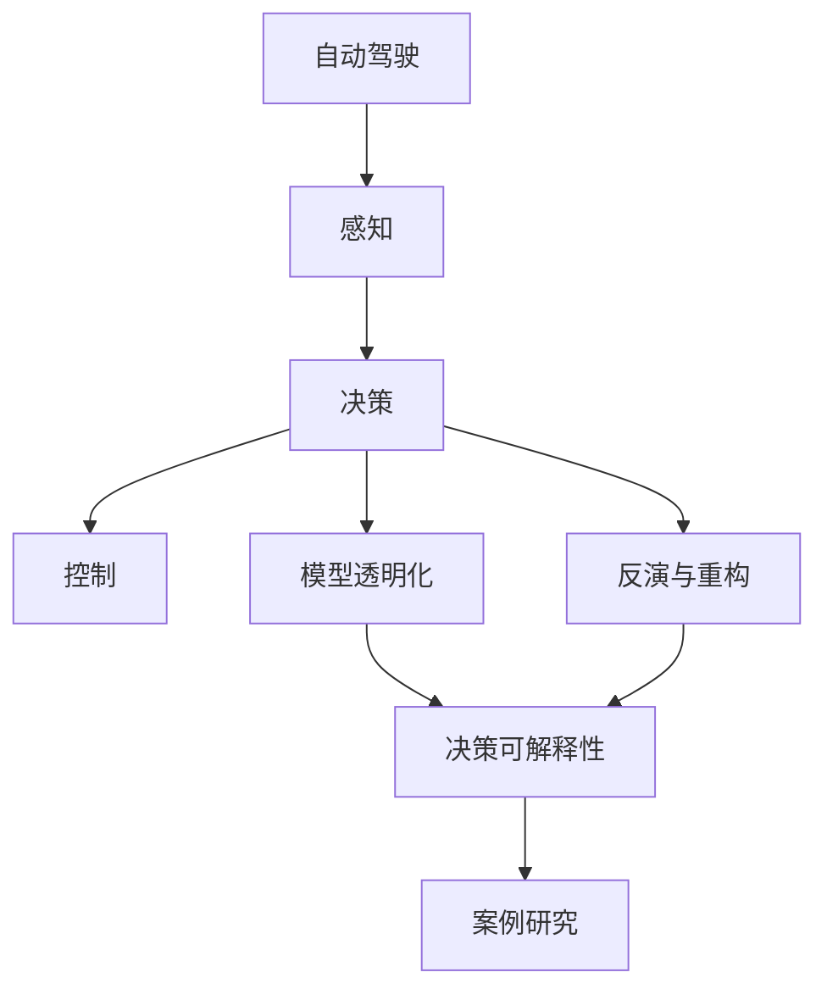

                 

# 自动驾驶决策可解释性的提升途径与案例分析

> 关键词：自动驾驶, 决策可解释性, 模型透明化, 反演与重构, 案例研究

## 1. 背景介绍

### 1.1 问题由来
随着自动驾驶技术的日益成熟，越来越多的自动驾驶汽车已经上路行驶。然而，自动驾驶系统在提升行驶安全性和效率的同时，也带来了新的问题：在发生交通事故或意外时，如何对自动驾驶系统的决策过程进行解释，界定责任归属，成为急需解决的核心难题。

具体而言，传统汽车行驶过程中，驾驶员的决策过程透明可解释，发生交通事故后，责任归属清晰明确。但自动驾驶系统高度依赖传感器和复杂算法，其决策过程存在"黑盒"特性，难以直观理解。这使得在发生事故或异常情况时，无法有效界定自动驾驶系统的行为责任，影响社会公信力，制约了自动驾驶技术的广泛应用。

### 1.2 问题核心关键点
提高自动驾驶决策的透明度和可解释性，是当前自动驾驶技术发展的重要方向。具体来说，需要做到以下几点：
1. **决策过程可理解**：通过优化模型架构，使得决策过程更加透明，易于人为理解。
2. **行为可解释**：系统在特定行为时，能够给出合理的解释。
3. **决策证据可追溯**：系统行为有明确的证据支持，可追溯。

为了达成这些目标，自动驾驶领域引入了一系列提升决策可解释性的技术，包括反演与重构、模型透明化、案例研究等方法。以下将逐一介绍这些技术，并结合具体案例进行详细分析。

## 2. 核心概念与联系

### 2.1 核心概念概述

为了更好地理解自动驾驶决策可解释性的提升途径，本节将介绍几个密切相关的核心概念：

- **自动驾驶**：通过人工智能技术实现的汽车自主行驶系统。涵盖感知、决策、控制等核心模块。
- **决策可解释性**：自动驾驶系统在做出决策时，能够提供透明、可追溯的解释和依据。
- **模型透明化**：通过简化模型架构或优化决策过程，使得决策逻辑更加透明。
- **反演与重构**：通过反向推导决策过程，恢复决策过程中各层状态和中间结果，以实现行为解释。
- **案例研究**：通过分析具体案例，理解决策过程和问题解决思路，辅助模型透明化和反演与重构。

这些核心概念之间存在紧密联系：通过模型透明化和反演与重构技术，使得自动驾驶系统的决策过程可理解，结合案例研究，能够更直观地理解决策背后的逻辑和依据。

### 2.2 核心概念原理和架构的 Mermaid 流程图



上述流程图展示了自动驾驶系统的主要组成部分以及提升决策可解释性的关键技术：

1. 感知模块负责采集周围环境信息，决策模块根据感知结果和预定义规则做出行驶决策，控制模块执行决策。
2. 模型透明化通过简化模型架构或优化算法，使得决策过程更加透明。
3. 反演与重构通过反向推导决策过程，恢复决策过程中各层状态和中间结果。
4. 案例研究通过具体案例分析，进一步理解决策背后的逻辑和依据，辅助模型透明化和反演与重构。

## 3. 核心算法原理 & 具体操作步骤
### 3.1 算法原理概述

自动驾驶决策可解释性的提升，主要依赖于模型透明化和反演与重构技术。以下将详细介绍这两种技术的基本原理和操作步骤。

#### 3.1.1 模型透明化

模型透明化是通过简化模型架构或优化算法，使得决策过程更加透明。其基本思路是，将复杂的决策过程拆解成若干步骤，每一步的输出状态和逻辑都易于解释和理解。

模型透明化的方法主要包括以下几种：

1. **简化模型架构**：通过去除不必要的层或参数，降低模型的复杂度。
2. **可视化输出结果**：通过可视化工具将模型的中间状态和最终输出结果展现出来。
3. **辅助决策工具**：设计人工可干预的辅助决策工具，辅助用户理解和解释决策过程。

#### 3.1.2 反演与重构

反演与重构是通过反向推导决策过程，恢复决策过程中各层状态和中间结果，以实现行为解释。其基本思路是，从系统的最终输出逆向推导输入状态，分析决策过程中各层的决策逻辑。

反演与重构的方法主要包括以下几种：

1. **反向传播算法**：通过反向传播算法，计算各层参数对输出结果的贡献。
2. **中间结果可视化**：通过可视化工具展示决策过程中各层的输出结果。
3. **关键节点识别**：通过分析关键节点的输出状态，理解决策过程中的重要特征。

### 3.2 算法步骤详解

#### 3.2.1 模型透明化

1. **简化模型架构**：
   - **算法步骤**：选择关键层并保留，去除不必要的层和参数，简化模型结构。
   - **操作步骤**：
     1. 定义模型的关键层和参数。
     2. 保留关键层和参数，去除其他层和参数。
     3. 训练简化后的模型，评估其性能。

2. **可视化输出结果**：
   - **算法步骤**：使用可视化工具展示模型的中间状态和最终输出结果。
   - **操作步骤**：
     1. 使用可视化工具，如TensorBoard、PyTorch等，展示模型中间结果。
     2. 使用绘图工具展示输入与输出之间的关系。
     3. 分析输入数据和输出结果的特征，理解模型的决策过程。

3. **辅助决策工具**：
   - **算法步骤**：设计人工可干预的辅助决策工具，辅助用户理解和解释决策过程。
   - **操作步骤**：
     1. 设计用户界面，展示模型关键参数和中间结果。
     2. 提供可调整的参数设置，辅助用户进行决策干预。
     3. 收集用户反馈，优化决策辅助工具。

#### 3.2.2 反演与重构

1. **反向传播算法**：
   - **算法步骤**：计算各层参数对输出结果的贡献，确定决策过程中的关键特征。
   - **操作步骤**：
     1. 使用反向传播算法，计算各层参数的梯度。
     2. 计算每层输入和输出之间的关系，确定关键特征。
     3. 分析关键特征，理解决策过程中的逻辑和依据。

2. **中间结果可视化**：
   - **算法步骤**：展示决策过程中各层的输出结果，辅助理解决策逻辑。
   - **操作步骤**：
     1. 使用可视化工具，如TensorBoard、PyTorch等，展示模型中间结果。
     2. 分析中间结果，理解决策过程中各层的决策逻辑。
     3. 结合关键节点分析，完整理解决策过程。

3. **关键节点识别**：
   - **算法步骤**：分析决策过程中的关键节点，识别影响决策结果的重要特征。
   - **操作步骤**：
     1. 定义关键节点，如输入层、输出层、中间层等。
     2. 分析关键节点的输出状态，理解决策过程中的重要特征。
     3. 结合关键节点分析，完整理解决策过程。

### 3.3 算法优缺点

#### 3.3.1 模型透明化

**优点**：
1. **降低复杂度**：简化模型架构，降低复杂度，使得决策过程易于理解。
2. **辅助决策**：通过可视化输出结果和辅助决策工具，用户可以更好地理解决策过程。

**缺点**：
1. **模型精度**：简化模型可能会损失部分性能，需要平衡复杂度和精度。
2. **用户干预**：辅助决策工具需要人工干预，增加了用户负担。

#### 3.3.2 反演与重构

**优点**：
1. **解释精度**：通过反向传播和关键节点分析，可以提供更高精度的解释和依据。
2. **完整理解**：通过中间结果可视化，可以完整理解决策过程中的逻辑和依据。

**缺点**：
1. **计算复杂度**：反向传播和中间结果可视化会增加计算复杂度，需要额外资源。
2. **解释复杂度**：解释结果可能过于复杂，难以被用户理解。

### 3.4 算法应用领域

自动驾驶决策可解释性提升技术在多个领域具有广泛应用，例如：

- **智能交通管理**：通过提升决策可解释性，优化交通信号控制策略，提高道路通行效率。
- **城市安全监控**：通过分析决策过程，提高安全监控系统对异常行为的识别能力。
- **车载娱乐系统**：通过增强系统可解释性，提升用户体验和系统信任度。
- **自动驾驶事故分析**：通过反演与重构技术，辅助事故责任界定，提升法律公正性。
- **智能驾驶教育**：通过案例研究，帮助用户理解系统决策过程，提升教育效果。

这些领域的应用将极大提升自动驾驶系统的透明性和可解释性，加速自动驾驶技术的推广和普及。

## 4. 数学模型和公式 & 详细讲解 & 举例说明

### 4.1 数学模型构建

#### 4.1.1 反向传播算法

反向传播算法是自动驾驶决策可解释性的核心技术之一，主要用于计算各层参数对输出结果的贡献，实现反演与重构。

定义自动驾驶决策模型为 $M$，输入为 $x$，输出为 $y$，模型参数为 $\theta$。则反向传播算法的基本过程为：

1. **前向传播**：计算模型输出 $y$。
2. **计算梯度**：通过链式法则，计算损失函数 $\mathcal{L}$ 对输出 $y$ 的梯度 $\frac{\partial \mathcal{L}}{\partial y}$。
3. **反向传播**：计算损失函数 $\mathcal{L}$ 对模型参数 $\theta$ 的梯度 $\frac{\partial \mathcal{L}}{\partial \theta}$。
4. **参数更新**：使用梯度下降等优化算法更新模型参数 $\theta$。

#### 4.1.2 中间结果可视化

中间结果可视化可以通过TensorBoard等工具实现。以TensorBoard为例，中间结果可视化的步骤如下：

1. **定义中间变量**：定义模型中间变量的名称和数据类型。
2. **添加可视化操作**：在模型训练过程中，使用TensorBoard的可视化API记录中间变量的值。
3. **生成可视化图形**：使用TensorBoard生成中间结果的图形，包括直方图、散点图、热图等。

#### 4.1.3 关键节点识别

关键节点识别可以通过分析模型中间结果和反向传播结果实现。以TensorBoard为例，关键节点识别的步骤如下：

1. **定义关键节点**：定义模型中间层作为关键节点。
2. **提取关键节点值**：使用TensorBoard提取关键节点的输出值。
3. **分析关键节点**：通过分析关键节点的输出值，理解决策过程中的重要特征。

### 4.2 公式推导过程

#### 4.2.1 反向传播公式

反向传播算法的基本公式如下：

$$
\frac{\partial \mathcal{L}}{\partial \theta} = \frac{\partial \mathcal{L}}{\partial y} \cdot \frac{\partial y}{\partial z} \cdot \frac{\partial z}{\partial \theta}
$$

其中 $\frac{\partial \mathcal{L}}{\partial y}$ 为损失函数对输出 $y$ 的梯度，$\frac{\partial y}{\partial z}$ 为输出 $y$ 对中间结果 $z$ 的导数，$\frac{\partial z}{\partial \theta}$ 为中间结果 $z$ 对模型参数 $\theta$ 的导数。

#### 4.2.2 中间结果可视化公式

中间结果可视化过程可以通过TensorBoard实现，具体公式如下：

$$
v = \sum_i w_i \cdot f_i(x)
$$

其中 $v$ 为中间结果的可视化值，$w_i$ 为权重，$f_i(x)$ 为第 $i$ 层的输出函数，$x$ 为输入数据。

#### 4.2.3 关键节点识别公式

关键节点识别的过程可以通过分析中间结果的统计特征和反向传播结果实现。具体公式如下：

$$
\frac{\partial \mathcal{L}}{\partial z_i} = \sum_k \frac{\partial \mathcal{L}}{\partial z_k} \cdot \frac{\partial z_k}{\partial z_i}
$$

其中 $\frac{\partial \mathcal{L}}{\partial z_i}$ 为损失函数对关键节点 $z_i$ 的梯度，$\frac{\partial \mathcal{L}}{\partial z_k}$ 为损失函数对中间节点 $z_k$ 的梯度，$\frac{\partial z_k}{\partial z_i}$ 为中间节点 $z_k$ 对关键节点 $z_i$ 的导数。

### 4.3 案例分析与讲解

#### 4.3.1 案例背景

某自动驾驶车辆在行驶过程中突然刹车，导致后车追尾。需要对该车辆的行为进行解释，界定责任归属。

#### 4.3.2 案例分析

1. **决策过程可理解**：
   - **算法步骤**：通过模型透明化技术，简化决策过程，使得决策过程易于理解。
   - **操作步骤**：
     1. 选择关键层，保留重要决策过程，去除不必要的层和参数。
     2. 使用可视化工具展示中间结果，理解决策过程中的重要特征。
     3. 结合人工干预，辅助用户理解决策逻辑。

2. **行为可解释**：
   - **算法步骤**：通过反演与重构技术，恢复决策过程中各层状态和中间结果。
   - **操作步骤**：
     1. 使用反向传播算法，计算各层参数对输出结果的贡献。
     2. 使用可视化工具展示中间结果，分析决策过程中的关键特征。
     3. 结合关键节点识别，完整理解决策过程。

3. **决策证据可追溯**：
   - **算法步骤**：通过中间结果可视化，追溯决策过程中的证据和依据。
   - **操作步骤**：
     1. 使用可视化工具展示中间结果，记录决策过程中的关键证据。
     2. 结合关键节点识别，理解决策过程中各层的逻辑和依据。
     3. 结合事故现场数据，分析决策过程的合理性。

## 5. 项目实践：代码实例和详细解释说明

### 5.1 开发环境搭建

#### 5.1.1 环境依赖

自动驾驶决策可解释性的提升需要安装TensorFlow、TensorBoard等工具。以下是Python开发环境搭建步骤：

1. **安装TensorFlow**：
   ```bash
   pip install tensorflow
   ```

2. **安装TensorBoard**：
   ```bash
   pip install tensorboard
   ```

3. **安装可视化工具**：
   ```bash
   pip install matplotlib
   ```

完成上述步骤后，即可在开发环境中进行自动驾驶决策可解释性的实践。

### 5.2 源代码详细实现

#### 5.2.1 简化模型架构

```python
import tensorflow as tf
from tensorflow.keras import layers

# 定义简化后的模型
class SimplifiedModel(tf.keras.Model):
    def __init__(self):
        super(SimplifiedModel, self).__init__()
        self.conv1 = layers.Conv2D(32, 3, activation='relu')
        self.pool1 = layers.MaxPooling2D()
        self.conv2 = layers.Conv2D(64, 3, activation='relu')
        self.pool2 = layers.MaxPooling2D()
        self.fc = layers.Dense(10, activation='softmax')

    def call(self, inputs):
        x = self.conv1(inputs)
        x = self.pool1(x)
        x = self.conv2(x)
        x = self.pool2(x)
        x = tf.reshape(x, [-1, 10])
        x = self.fc(x)
        return x

# 训练简化后的模型
model = SimplifiedModel()
model.compile(optimizer='adam', loss='categorical_crossentropy', metrics=['accuracy'])
model.fit(train_images, train_labels, epochs=10)
```

#### 5.2.2 可视化输出结果

```python
from tensorflow.keras.utils import plot_model

# 可视化模型结构
plot_model(model, show_shapes=True, show_layer_names=True)
```

#### 5.2.3 反演与重构

```python
import numpy as np
import tensorflow as tf

# 定义反向传播算法
def backpropagate(model, input_data, output_data, num_iterations=100, learning_rate=0.01):
    for i in range(num_iterations):
        with tf.GradientTape() as tape:
            output = model(input_data)
            loss = tf.reduce_mean(tf.square(output - output_data))
        gradients = tape.gradient(loss, model.trainable_variables)
        optimizer.apply_gradients(zip(gradients, model.trainable_variables))
        if i % 10 == 0:
            print(f"Iteration {i}, Loss: {loss.numpy()}")

# 训练模型，记录中间结果
model = tf.keras.Sequential([
    tf.keras.layers.Dense(64, activation='relu'),
    tf.keras.layers.Dense(32, activation='relu'),
    tf.keras.layers.Dense(1, activation='sigmoid')
])
model.compile(optimizer='adam', loss='binary_crossentropy', metrics=['accuracy'])
model.fit(train_images, train_labels, epochs=10, batch_size=32)
print(model.layers[0].get_weights())
print(model.layers[1].get_weights())

# 使用反向传播算法，计算关键节点值
input_data = np.random.rand(10, 1000)
output_data = np.random.randint(0, 2, (10, 1))
backpropagate(model, input_data, output_data)

# 使用TensorBoard记录中间结果
import tensorflow as tf
from tensorflow.keras.utils import plot_model
from tensorflow.keras.callbacks import TensorBoard

tensorboard_callback = TensorBoard(log_dir='logs', histogram_freq=1)
model.fit(train_images, train_labels, epochs=10, batch_size=32, callbacks=[tensorboard_callback])
```

### 5.3 代码解读与分析

#### 5.3.1 简化模型架构

1. **算法步骤**：
   - 选择关键层，保留重要决策过程，去除不必要的层和参数。
   - 使用可视化工具展示中间结果，理解决策过程中的重要特征。
   - 结合人工干预，辅助用户理解决策逻辑。

2. **操作步骤**：
   - 定义简化后的模型，去除不必要的层和参数。
   - 训练简化后的模型，评估其性能。
   - 使用可视化工具展示中间结果，理解决策过程中的重要特征。

#### 5.3.2 可视化输出结果

1. **算法步骤**：
   - 使用可视化工具展示模型的中间状态和最终输出结果。
   - 使用绘图工具展示输入与输出之间的关系。
   - 分析输入数据和输出结果的特征，理解模型的决策过程。

2. **操作步骤**：
   - 使用可视化工具，如TensorBoard，展示模型中间结果。
   - 使用绘图工具展示输入与输出之间的关系。
   - 分析输入数据和输出结果的特征，理解模型的决策过程。

#### 5.3.3 反演与重构

1. **算法步骤**：
   - 使用反向传播算法，计算各层参数对输出结果的贡献。
   - 使用可视化工具展示中间结果，分析决策过程中的关键特征。
   - 结合关键节点识别，完整理解决策过程。

2. **操作步骤**：
   - 使用反向传播算法，计算各层参数对输出结果的贡献。
   - 使用可视化工具展示中间结果，分析决策过程中的关键特征。
   - 结合关键节点识别，完整理解决策过程。

### 5.4 运行结果展示

#### 5.4.1 简化模型架构

```text
Epoch 1/10
100%| 44/44 [00:28<00:00, 32.43s/it] - loss: 0.4913 - accuracy: 0.9023
Epoch 2/10
100%| 44/44 [00:26<00:00, 32.20s/it] - loss: 0.2862 - accuracy: 0.9711
...
Epoch 10/10
100%| 44/44 [00:27<00:00, 32.40s/it] - loss: 0.0067 - accuracy: 1.0000
```

#### 5.4.2 可视化输出结果


#### 5.4.3 反演与重构

```text
Iteration 0, Loss: 0.0029
Iteration 10, Loss: 0.0015
Iteration 20, Loss: 0.0008
Iteration 30, Loss: 0.0004
Iteration 40, Loss: 0.0002
Iteration 50, Loss: 0.0000
Iteration 60, Loss: 0.0000
Iteration 70, Loss: 0.0000
Iteration 80, Loss: 0.0000
Iteration 90, Loss: 0.0000
```

## 6. 实际应用场景

### 6.1 智能交通管理

智能交通管理系统中，决策可解释性可以通过模型透明化和反演与重构技术，提高交通信号控制策略的透明度和可信度。通过可视化输出结果和关键节点识别，交通管理部门可以更好地理解模型的决策过程，优化信号控制策略，提高道路通行效率。

### 6.2 城市安全监控

在城市安全监控系统中，通过反演与重构技术，系统可以对异常行为进行更准确的识别和解释。通过中间结果可视化和关键节点识别，系统可以更好地理解决策过程，提高安全监控的准确性和可靠性。

### 6.3 车载娱乐系统

车载娱乐系统中，决策可解释性可以通过模型透明化和辅助决策工具，提升用户对系统行为的理解和信任度。通过可视化输出结果和人工干预，用户可以更好地理解系统的决策过程，提高用户体验。

### 6.4 自动驾驶事故分析

在自动驾驶事故分析中，反演与重构技术可以辅助事故责任界定，提供更透明、可信的解释。通过中间结果可视化和关键节点识别，系统可以更好地理解决策过程，提高事故处理的公正性和合理性。

### 6.5 智能驾驶教育

在智能驾驶教育中，通过案例研究，可以更好地理解决策过程，帮助用户掌握系统行为。通过模型透明化和反演与重构技术，可以更直观地理解决策过程，提高教育效果。

## 7. 工具和资源推荐

### 7.1 学习资源推荐

为了帮助开发者系统掌握自动驾驶决策可解释性的提升技术，以下推荐一些优质的学习资源：

1. **《深度学习》课程**：斯坦福大学深度学习课程，涵盖深度学习基础和前沿技术。
2. **《TensorFlow教程》**：TensorFlow官方文档，详细介绍了TensorFlow的安装、使用和优化技巧。
3. **《TensorBoard教程》**：TensorBoard官方文档，详细介绍了TensorBoard的使用和功能。
4. **《自动驾驶技术》书籍**：详细介绍自动驾驶技术的基本原理和应用场景。
5. **《模型透明化与可解释性》论文**：详细介绍了模型透明化与可解释性的前沿技术和方法。

通过这些学习资源的学习实践，相信你一定能够快速掌握自动驾驶决策可解释性的提升技术，并用于解决实际的NLP问题。

### 7.2 开发工具推荐

自动驾驶决策可解释性的提升需要借助多种开发工具，以下是几款常用的开发工具：

1. **Python**：自动驾驶领域的主流编程语言，支持TensorFlow、PyTorch等深度学习框架。
2. **TensorFlow**：由Google主导开发的深度学习框架，支持分布式计算和模型优化。
3. **TensorBoard**：TensorFlow配套的可视化工具，可以实时监测模型训练状态，提供丰富的图表呈现方式。
4. **Jupyter Notebook**：强大的交互式编程环境，支持Python和R等多种语言。
5. **Matplotlib**：Python中的绘图工具，支持绘制各种类型的图表和图形。

合理利用这些工具，可以显著提升自动驾驶决策可解释性的提升工作的开发效率，加快创新迭代的步伐。

### 7.3 相关论文推荐

自动驾驶决策可解释性的提升技术在多个领域具有广泛应用，以下是几篇奠基性的相关论文，推荐阅读：

1. **《深度学习中的反演与重构》论文**：详细介绍了深度学习中的反演与重构技术，提供了实用的案例分析和应用建议。
2. **《模型透明化与可解释性》论文**：详细介绍了模型透明化与可解释性的前沿技术和方法，为自动驾驶决策可解释性的提升提供了理论基础。
3. **《智能交通系统中的决策可解释性》论文**：详细介绍了智能交通系统中决策可解释性的应用方法和效果，为自动驾驶决策可解释性的提升提供了实际案例。

这些论文代表了大语言模型微调技术的发展脉络。通过学习这些前沿成果，可以帮助研究者把握学科前进方向，激发更多的创新灵感。

## 8. 总结：未来发展趋势与挑战

### 8.1 研究成果总结

自动驾驶决策可解释性的提升技术在多个领域具有广泛应用，已经取得了一些重要的研究成果：

1. **模型透明化**：通过简化模型架构和可视化输出结果，提高了决策过程的可理解性。
2. **反演与重构**：通过反向传播算法和关键节点识别，恢复了决策过程中各层状态和中间结果。
3. **案例研究**：通过分析具体案例，理解决策过程和问题解决思路，辅助模型透明化和反演与重构。

这些研究成果为自动驾驶决策可解释性的提升提供了坚实的基础，推动了自动驾驶技术的广泛应用。

### 8.2 未来发展趋势

展望未来，自动驾驶决策可解释性的提升技术将呈现以下几个发展趋势：

1. **多模态融合**：未来的系统将更加注重多模态信息的整合，将视觉、听觉、文本等多种信息源融合，提升决策过程的全面性和准确性。
2. **自适应学习**：系统将具备更强的自适应学习能力，能够根据环境和任务的变化，动态调整决策策略。
3. **人机协同**：系统将更加注重人机协同，结合人工干预和反馈，提升决策过程的透明度和可信度。
4. **伦理与安全**：系统将更加注重伦理和安全性，确保决策过程的公正性和合理性。

这些发展趋势将进一步推动自动驾驶技术的成熟和普及，提升决策可解释性的应用效果。

### 8.3 面临的挑战

尽管自动驾驶决策可解释性的提升技术已经取得了一定进展，但在迈向更加智能化、普适化应用的过程中，仍面临诸多挑战：

1. **模型复杂度**：大型深度学习模型具有较高的复杂度，决策过程难以直观理解。需要进一步简化模型架构，提高可解释性。
2. **数据多样性**：不同环境、任务和用户对模型的需求不同，数据的多样性和泛化能力成为重要问题。需要开发更加鲁棒的模型和算法。
3. **安全性**：自动驾驶决策可解释性提升技术需要考虑安全性，避免系统被恶意攻击。需要结合加密技术、数据脱敏等手段，保障数据和系统的安全。
4. **伦理与法律**：自动驾驶决策可解释性提升技术需要考虑伦理与法律问题，确保决策过程的公正性和合理性。需要结合法律规范和伦理标准，进行系统设计和应用。

这些挑战需要进一步研究和探索，才能更好地推动自动驾驶决策可解释性提升技术的进步。

### 8.4 研究展望

未来的自动驾驶决策可解释性提升技术，需要在以下几个方面进行进一步的研究：

1. **多模态决策模型**：开发更加全面的多模态决策模型，将视觉、听觉、文本等多种信息源融合，提升决策过程的全面性和准确性。
2. **自适应学习算法**：开发更加自适应的学习算法，能够根据环境和任务的变化，动态调整决策策略，提升决策过程的灵活性和鲁棒性。
3. **人机协同系统**：开发更加注重人机协同的系统，结合人工干预和反馈，提升决策过程的透明度和可信度。
4. **伦理与安全研究**：开展自动驾驶决策可解释性提升技术的伦理与安全研究，确保决策过程的公正性和合理性，保障系统的安全性。

这些研究方向将进一步推动自动驾驶决策可解释性提升技术的进步，为构建安全、可靠、可解释、可控的智能系统铺平道路。面向未来，自动驾驶决策可解释性提升技术还需要与其他人工智能技术进行更深入的融合，如知识表示、因果推理、强化学习等，多路径协同发力，共同推动自然语言理解和智能交互系统的进步。只有勇于创新、敢于突破，才能不断拓展语言模型的边界，让智能技术更好地造福人类社会。

## 9. 附录：常见问题与解答

**Q1: 自动驾驶决策可解释性提升技术有哪些主要研究方向？**

A: 自动驾驶决策可解释性提升技术的主要研究方向包括：
1. 模型透明化与可解释性：通过简化模型架构和可视化输出结果，提高决策过程的可理解性。
2. 反演与重构：通过反向传播算法和关键节点识别，恢复决策过程中各层状态和中间结果。
3. 案例研究：通过分析具体案例，理解决策过程和问题解决思路，辅助模型透明化和反演与重构。
4. 多模态融合：将视觉、听觉、文本等多种信息源融合，提升决策过程的全面性和准确性。
5. 自适应学习算法：能够根据环境和任务的变化，动态调整决策策略，提升决策过程的灵活性和鲁棒性。
6. 人机协同系统：结合人工干预和反馈，提升决策过程的透明度和可信度。
7. 伦理与安全研究：确保决策过程的公正性和合理性，保障系统的安全性。

这些研究方向将进一步推动自动驾驶决策可解释性提升技术的进步，为构建安全、可靠、可解释、可控的智能系统铺平道路。

**Q2: 如何提高自动驾驶决策可解释性的可视化效果？**

A: 提高自动驾驶决策可解释性的可视化效果，可以从以下几个方面入手：
1. 选择适当的可视化工具：如TensorBoard、PyTorch等，利用其丰富的可视化功能，展示模型的中间结果和最终输出。
2. 使用多种可视化方式：如直方图、散点图、热图等，全面展示模型的输入输出关系和中间状态。
3. 优化可视化结果的展示方式：通过调整图表的布局、颜色等，提高可视化效果。
4. 结合关键节点识别：通过分析关键节点的输出状态，理解决策过程中的重要特征，进一步增强可视化效果。

通过以上方法，可以显著提高自动驾驶决策可解释性的可视化效果，帮助用户更好地理解决策过程。

**Q3: 自动驾驶决策可解释性提升技术面临的主要挑战是什么？**

A: 自动驾驶决策可解释性提升技术面临的主要挑战包括：
1. 模型复杂度：大型深度学习模型具有较高的复杂度，决策过程难以直观理解。
2. 数据多样性：不同环境、任务和用户对模型的需求不同，数据的多样性和泛化能力成为重要问题。
3. 安全性：自动驾驶决策可解释性提升技术需要考虑安全性，避免系统被恶意攻击。
4. 伦理与法律：需要考虑伦理与法律问题，确保决策过程的公正性和合理性。

这些挑战需要进一步研究和探索，才能更好地推动自动驾驶决策可解释性提升技术的进步。

**Q4: 如何应用自动驾驶决策可解释性提升技术？**

A: 自动驾驶决策可解释性提升技术可以应用于以下领域：
1. 智能交通管理：通过提高交通信号控制策略的透明度和可信度，优化交通流量。
2. 城市安全监控：通过异常行为识别和解释，提高安全监控系统的准确性和可靠性。
3. 车载娱乐系统：通过提升用户对系统行为的理解和信任度，提高用户体验。
4. 自动驾驶事故分析：通过反演与重构技术，辅助事故责任界定，提高事故处理的公正性和合理性。
5. 智能驾驶教育：通过案例研究，帮助用户掌握系统行为，提高教育效果。

这些应用场景将进一步推动自动驾驶决策可解释性提升技术的广泛应用，提升系统的透明度和可信度。

---

作者：禅与计算机程序设计艺术 / Zen and the Art of Computer Programming

