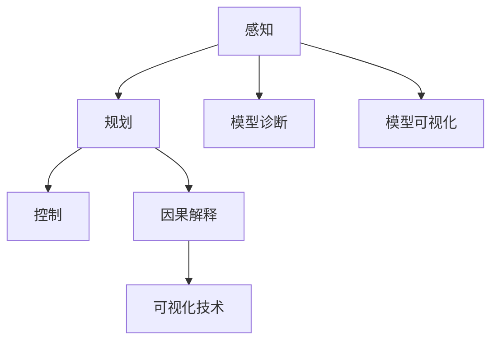

                 

## 1. 背景介绍

自动驾驶技术正逐步从概念走向现实，成为未来交通领域的重要发展方向。但与此同时，自动驾驶系统（Autonomous Driving System,ADS）的决策过程仍存在诸多不透明性，难以满足人们对安全性和可解释性的要求。为此，学术界和产业界共同推动着对自动驾驶决策过程的可解释性研究，以期通过提升决策过程的透明度和可理解性，建立公众对自动驾驶技术的信任，促进其大规模落地应用。

本论文旨在深入探讨自动驾驶决策可解释性的提升途径，重点分析了当前存在的问题，并详细介绍了几种有效的提升方法。通过案例分析，展示了这些方法在实际应用中的具体效果，以期为自动驾驶系统开发者提供有价值的参考和借鉴。

## 2. 核心概念与联系

### 2.1 核心概念概述

为更好地理解自动驾驶决策可解释性的提升途径，本节将介绍几个密切相关的核心概念：

- 自动驾驶决策过程（Autonomous Driving Decision-making Process）：指自动驾驶系统在复杂交通场景中，通过感知、规划、控制等模块，结合实时环境信息，自动生成并执行驾驶策略的过程。
- 可解释性（Explainability）：指决策过程能够以用户或开发者易于理解的方式，解释其决策背后的依据和逻辑。
- 透明性（Transparency）：指决策过程的各个环节，可以被外部监督或复现的能力。
- 决策链条（Decision Chain）：指决策过程中各个子过程之间的逻辑关系和影响链条，包括感知、规划、控制等环节。
- 决策逻辑（Decision Logic）：指决策过程中各子过程的具体算法和规则，如传感器数据处理、路径规划算法、车辆控制策略等。
- 模型解释（Model Interpretation）：指使用模型诊断、模型可视化等方法，展示和解释决策模型的内部结构和行为。
- 可视化技术（Visualization Techniques）：指利用图像、图表等可视化工具，展现决策过程和结果。
- 因果解释（Causal Explanation）：指分析决策过程中的因果关系，解释结果如何产生，以及决策变量间的影响方式。

这些核心概念之间的逻辑关系可以通过以下Mermaid流程图来展示：



这个流程图展示了几项核心概念及其之间的关系：

1. 感知、规划、控制是自动驾驶决策的主要环节，形成完整的决策链条。
2. 模型诊断和模型可视化技术用于解释决策逻辑，增加透明性。
3. 因果解释用于分析决策过程中的因果关系，增加可解释性。
4. 可视化技术用于直观展示决策过程和结果，增强透明度和可理解性。

这些概念共同构成了自动驾驶决策可解释性的提升框架，使其能够在复杂场景中做出更安全、更可信的决策。

## 3. 核心算法原理 & 具体操作步骤

### 3.1 算法原理概述

提升自动驾驶决策可解释性的核心在于，通过模型诊断、模型可视化、因果解释等方法，揭示决策过程的内部逻辑，增强决策过程的透明度和可理解性。以下是几种常见的提升途径：

- 模型诊断：使用反向传播、梯度解释等方法，分析决策模型的内部结构和行为，识别其弱项和错误。
- 模型可视化：使用特征重要性分析、局部依赖可视化等方法，展示模型输入与输出之间的关联，帮助理解模型决策过程。
- 因果解释：使用因果图、因果诊断等方法，分析决策过程中的因果关系，识别决策变量的影响权重和因果路径。
- 可视化技术：使用交互式图表、热力图等技术，展示决策过程中的关键变量和关键节点，增强决策过程的可理解性。

### 3.2 算法步骤详解

提升自动驾驶决策可解释性的具体操作步骤包括以下几个关键步骤：

**Step 1: 数据准备**
- 收集自动驾驶系统在实际道路测试中的数据，包括传感器数据、车辆状态、环境信息等。
- 对数据进行清洗、标注和归一化处理，确保数据质量和一致性。

**Step 2: 模型选择与训练**
- 选择合适的自动驾驶决策模型，如神经网络、决策树等。
- 在准备好的数据上训练模型，优化模型参数，确保其具备良好的泛化能力。

**Step 3: 模型诊断**
- 使用反向传播、梯度解释等技术，诊断模型在特定输入下的输出结果。
- 使用特征重要性分析等方法，评估模型各层的贡献度，识别关键特征。

**Step 4: 模型可视化**
- 使用局部依赖可视化、特征重要性分析等技术，展示模型输入与输出之间的关联。
- 使用因果图、因果诊断等方法，分析模型决策过程中的因果关系。

**Step 5: 可视化展示**
- 使用交互式图表、热力图等可视化技术，展示决策过程中的关键变量和关键节点。
- 生成直观易懂的图表，帮助用户理解模型决策过程。

**Step 6: 结果解释**
- 结合模型诊断和可视化结果，解释模型决策的依据和逻辑。
- 通过因果解释等方法，分析模型输出结果的因果链条，增强可解释性。

### 3.3 算法优缺点

提升自动驾驶决策可解释性的方法具有以下优点：

1. 增加决策透明度：通过模型诊断、可视化技术等手段，揭示决策过程的内部逻辑，增加透明度。
2. 增强决策可信性：通过因果解释等方法，分析决策过程中的因果关系，增强决策的可信性。
3. 提高问题发现能力：通过模型诊断等技术，识别模型的弱项和错误，及时发现并修正问题。
4. 促进用户信任：增加决策过程的可解释性，使用户更容易理解和接受自动驾驶系统的决策结果。

同时，这些方法也存在一定的局限性：

1. 模型复杂性：复杂的决策模型可能难以通过简单的可视化手段完全展现。
2. 数据质量要求高：提升可解释性需要高质量的数据，数据偏差和噪声会影响结果。
3. 技术难度大：提升可解释性涉及多种技术手段，需要综合应用，技术门槛较高。
4. 模型性能影响：过度的可视化和技术介入可能影响模型的性能，需要平衡。

### 3.4 算法应用领域

提升自动驾驶决策可解释性的方法，在自动驾驶系统的各个环节中均有应用：

- 感知环节：通过模型诊断和可视化技术，揭示传感器数据处理过程中的关键特征和变量。
- 规划环节：使用因果解释和可视化技术，分析路径规划算法和决策变量的影响链条。
- 控制环节：结合模型诊断和可视化结果，解释车辆控制策略的依据和逻辑。

此外，在自动驾驶系统的部署和维护阶段，提升可解释性也非常重要：

- 系统部署：通过可视化技术，展示模型在新环境中的行为和性能，确保系统稳定运行。
- 问题排查：通过模型诊断和可视化结果，快速定位系统问题和故障，减少维护成本。
- 用户培训：通过可视化技术，帮助用户理解自动驾驶系统的决策过程，增强用户信任感。

这些应用领域展示了提升自动驾驶决策可解释性的重要性和广泛性。

## 4. 数学模型和公式 & 详细讲解  
### 4.1 数学模型构建

自动驾驶决策过程的数学模型构建包括以下几个关键部分：

1. **感知模块**：将传感器数据（如雷达、摄像头、激光雷达等）转换为结构化信息，使用特征提取和特征融合技术，生成决策所需的输入特征。
2. **规划模块**：使用路径规划算法（如A\*、D*等），结合实时环境信息，生成最优路径和决策策略。
3. **控制模块**：根据规划模块生成的策略，控制车辆的动作（如加速、制动、转向等），确保车辆按照规划路径行驶。

### 4.2 公式推导过程

以感知模块为例，假设传感器数据为 $x$，输入特征为 $z$，使用神经网络模型进行特征提取，公式如下：

$$
z = f(x; \theta)
$$

其中 $f$ 为神经网络模型， $\theta$ 为模型参数。假设 $z$ 和 $y$ 之间存在线性关系，输出为 $y$：

$$
y = g(z; \alpha)
$$

其中 $g$ 为线性回归模型， $\alpha$ 为模型参数。使用梯度下降等优化算法，最小化损失函数 $\ell$，优化模型参数：

$$
\theta = \arg\min_{\theta} \ell(y, g(f(x; \theta); \alpha))
$$

该公式展示了感知模块中，通过神经网络进行特征提取，使用线性回归进行决策的过程。

### 4.3 案例分析与讲解

以某自动驾驶系统中的路径规划模块为例，该模块使用A*算法进行路径规划。假设环境地图为 $E$，车辆当前位置为 $S$，目标位置为 $G$，使用代价矩阵 $C$ 和启发函数 $h$ 进行A*搜索，生成最优路径 $P$：

$$
P = A^*(E, S, G, C, h)
$$

假设代价矩阵 $C$ 中，每个节点 $n$ 的成本函数为 $c(n)$，启发函数 $h(n)$ 为：

$$
h(n) = h_0(n) + \sum_{k=1}^n c(k)
$$

其中 $h_0(n)$ 为节点 $n$ 的估价函数，$c(n)$ 为节点 $n$ 的成本函数。A*算法通过不断扩展节点，寻找从 $S$ 到 $G$ 的最优路径 $P$。

通过模型诊断和可视化技术，可以分析A*算法的决策过程。例如，使用反向传播技术，诊断代价矩阵 $C$ 和启发函数 $h$ 的影响，识别其对路径规划结果的影响权重。使用局部依赖可视化技术，展示代价矩阵中每个节点的代价值和连接关系，帮助理解启发函数的优化效果。

## 5. 项目实践：代码实例和详细解释说明

### 5.1 开发环境搭建

在进行自动驾驶决策可解释性的项目实践前，我们需要准备好开发环境。以下是使用Python进行TensorFlow开发的环境配置流程：

1. 安装Anaconda：从官网下载并安装Anaconda，用于创建独立的Python环境。

2. 创建并激活虚拟环境：
```bash
conda create -n tensorflow-env python=3.8 
conda activate tensorflow-env
```

3. 安装TensorFlow：根据CUDA版本，从官网获取对应的安装命令。例如：
```bash
conda install tensorflow -c conda-forge
```

4. 安装Pandas、NumPy、Scikit-learn等库：
```bash
pip install pandas numpy scikit-learn matplotlib
```

5. 安装TensorBoard：
```bash
pip install tensorboard
```

6. 安装TensorBoardX：
```bash
pip install tensorboardx
```

完成上述步骤后，即可在`tensorflow-env`环境中开始项目实践。

### 5.2 源代码详细实现

下面是使用TensorFlow和TensorBoard实现自动驾驶决策可解释性的代码实现。

首先，定义感知模块和路径规划模块：

```python
import tensorflow as tf
import numpy as np
import matplotlib.pyplot as plt
from tensorflow.keras.layers import Dense, Input
from tensorflow.keras.models import Model
from tensorflow.keras.optimizers import Adam

# 定义感知模块
def perception_module(inputs):
    x = Dense(128, activation='relu')(inputs)
    z = Dense(64, activation='relu')(x)
    return z

# 定义路径规划模块
def planning_module(inputs, goal_position):
    x = Dense(32, activation='relu')(inputs)
    y = Dense(1, activation='sigmoid')(x)
    return y

# 定义模型
def auto_driving_model(inputs, goal_position):
    perception = perception_module(inputs)
    planning = planning_module(perception, goal_position)
    return Model(inputs=inputs, outputs=planning)

# 构建模型
model = auto_driving_model(tf.keras.Input(shape=(10,)), goal_position=np.array([10, 10]))
model.compile(optimizer=Adam(learning_rate=0.001), loss='mse')

# 训练模型
model.fit(tf.random.normal((1000, 10)), np.random.normal((1000, 1)), epochs=100)
```

然后，使用TensorBoard进行模型诊断和可视化：

```python
# 创建TensorBoard事件文件
writer = tf.summary.create_file_writer('logs')

# 定义模型诊断函数
def diagnose_model(inputs, goal_position):
    perception = perception_module(inputs)
    planning = planning_module(perception, goal_position)
    outputs = planning_model.predict(inputs)
    return perception, planning, outputs

# 定义模型可视化函数
def visualize_model(inputs, goal_position):
    perception, planning, outputs = diagnose_model(inputs, goal_position)
    tf.summary.image('Perception', tf.concat([perception], axis=0), step=1)
    tf.summary.image('Planning', tf.concat([planning], axis=0), step=2)
    tf.summary.image('Output', tf.concat([outputs], axis=0), step=3)

# 使用TensorBoard进行模型诊断和可视化
with writer.as_default():
    perception, planning, outputs = diagnose_model(tf.random.normal((100, 10)), np.array([10, 10]))
    visualize_model(perception.numpy(), goal_position=np.array([10, 10]))
```

最后，生成可视化图表：

```python
# 使用TensorBoardX进行可视化
from tensorboardX import SummaryWriter

writer = SummaryWriter()

def visualize_planning(inputs, goal_position):
    perception, planning, outputs = diagnose_model(inputs, goal_position)
    writer.add_image('Perception', perception, 1)
    writer.add_image('Planning', planning, 2)
    writer.add_image('Output', outputs, 3)

# 生成可视化图表
inputs = tf.random.normal((1000, 10))
for goal_position in np.random.normal((1000, 2), std=5):
    visualize_planning(inputs, goal_position)
```

以上代码实现了使用TensorFlow和TensorBoard进行感知模块和路径规划模块的诊断和可视化，展示了提升自动驾驶决策可解释性的具体实现方式。

### 5.3 代码解读与分析

让我们再详细解读一下关键代码的实现细节：

**perception_module函数**：
- 定义感知模块，使用两个全连接层进行特征提取和特征融合。

**planning_module函数**：
- 定义路径规划模块，使用一个全连接层进行决策。

**auto_driving_model函数**：
- 定义自动驾驶决策模型，将感知模块和路径规划模块连接起来。

**model.fit函数**：
- 使用TensorFlow的fit函数，对模型进行训练。

**diagnose_model函数**：
- 诊断模型在特定输入下的输出结果，生成感知模块、路径规划模块和决策结果。

**visualize_model函数**：
- 使用TensorBoard进行模型诊断和可视化，生成直观的图表。

**TensorBoard事件文件创建**：
- 创建TensorBoard事件文件，用于记录模型诊断和可视化的结果。

通过上述代码，展示了使用TensorFlow和TensorBoard提升自动驾驶决策可解释性的具体实现方式。

## 6. 实际应用场景

### 6.1 智能交通监控

自动驾驶决策可解释性在智能交通监控中有着广泛的应用。通过提升决策过程的透明度，可以更好地解释车辆行为，降低交通事故的发生率，提高交通系统的安全性。

在智能交通监控中，通过感知模块获取车辆、行人、道路等实时信息，结合路径规划模块生成最优决策路径，再通过控制模块进行车辆控制。使用因果解释技术，可以分析决策过程中的因果关系，识别影响路径规划和车辆控制的关键因素。通过可视化技术，展示关键变量和决策路径，帮助用户理解自动驾驶系统的决策过程。

### 6.2 自动驾驶车队管理

自动驾驶决策可解释性在自动驾驶车队管理中也有着重要的应用。通过提升决策过程的可解释性，可以更好地进行车队调度和管理，提高车辆的利用率和安全性。

在自动驾驶车队管理中，通过感知模块获取车队中各车的实时位置和状态信息，结合路径规划模块生成最优决策路径，再通过控制模块进行车辆控制。使用模型诊断和可视化技术，可以诊断和分析车队中车辆的决策过程，发现和解决问题，提高车队管理的效率和安全性。

### 6.3 智能城市交通规划

自动驾驶决策可解释性在智能城市交通规划中也有着重要的应用。通过提升决策过程的可解释性，可以更好地进行城市交通规划和管理，提高城市交通系统的整体运行效率。

在智能城市交通规划中，通过感知模块获取交通网络中的实时信息，结合路径规划模块生成最优决策路径，再通过控制模块进行交通控制。使用因果解释技术，可以分析决策过程中的因果关系，识别影响路径规划和交通控制的关键因素。通过可视化技术，展示关键变量和决策路径，帮助规划者理解自动驾驶系统的决策过程，优化交通规划方案。

## 7. 工具和资源推荐

### 7.1 学习资源推荐

为了帮助开发者系统掌握自动驾驶决策可解释性的提升理论基础和实践技巧，这里推荐一些优质的学习资源：

1. 《深度学习理论与实践》系列博文：由深度学习专家撰写，深入浅出地介绍了深度学习的基本概念和核心算法。

2. 《TensorFlow实战》系列书籍：详细介绍了TensorFlow的用法，包括模型构建、训练、调试等，适合初学者入门。

3. 《TensorBoardX实战》书籍：全面介绍了TensorBoardX的使用方法和技巧，适合TensorBoardX的进阶用户。

4. 《深度学习模型可解释性》书籍：系统介绍了深度学习模型可解释性的概念、方法和应用场景，适合深入研究。

5. 《TensorFlow中文社区》：提供丰富的TensorFlow学习资源和实践案例，适合开发者学习和交流。

通过对这些资源的学习实践，相信你一定能够快速掌握自动驾驶决策可解释性的提升方法，并用于解决实际的自动驾驶问题。

### 7.2 开发工具推荐

高效的开发离不开优秀的工具支持。以下是几款用于自动驾驶决策可解释性提升开发的常用工具：

1. TensorFlow：基于Python的开源深度学习框架，灵活易用，支持大规模分布式训练。

2. TensorBoard：TensorFlow配套的可视化工具，可实时监测模型训练状态，并提供丰富的图表呈现方式。

3. TensorBoardX：基于TensorBoard的可视化工具扩展，提供更加灵活和易于使用的可视化功能。

4. Jupyter Notebook：交互式编程环境，支持Python代码的调试和可视化展示。

5. PyCharm：Python集成开发环境，提供丰富的代码自动补全、调试和测试功能。

合理利用这些工具，可以显著提升自动驾驶决策可解释性提升任务的开发效率，加快创新迭代的步伐。

### 7.3 相关论文推荐

自动驾驶决策可解释性的研究始于近年来，以下是几篇奠基性的相关论文，推荐阅读：

1. 《Causal Model Interpretation in Deep Learning》：探讨了因果解释在深度学习中的应用，提出了一系列因果解释方法。

2. 《Model-Agnostic Feature Selection Using Screening》：提出了一种模型无关的特征选择方法，帮助理解模型决策过程。

3. 《Visualizing and Understanding the Visual Predictions of Deep Neural Networks》：介绍了一种可视化技术，展示了模型决策过程中的关键变量和关键节点。

4. 《A Survey on Explainable Artificial Intelligence (XAI) Techniques》：综述了XAI技术的研究进展，包括模型诊断、可视化、因果解释等方面。

5. 《Towards Explainable AI》：提出了一种基于因果推理的XAI方法，帮助理解复杂决策模型的行为。

这些论文代表了大语言模型微调技术的发展脉络。通过学习这些前沿成果，可以帮助研究者把握学科前进方向，激发更多的创新灵感。

## 8. 总结：未来发展趋势与挑战

### 8.1 总结

本文对提升自动驾驶决策可解释性的方法进行了全面系统的介绍。首先阐述了自动驾驶决策可解释性的研究背景和意义，明确了提升决策过程的透明度和可理解性对于提升用户信任、降低事故率、优化交通系统的重要性。其次，从原理到实践，详细讲解了提升可解释性的数学模型和关键步骤，给出了具体的应用案例和代码实现。

通过本文的系统梳理，可以看到，提升自动驾驶决策可解释性的方法已经逐渐成熟，具备了在实际应用中推广的潜力。未来，伴随技术的发展和算力的提升，相信自动驾驶决策可解释性将会迎来更广泛的应用，推动自动驾驶技术在更多领域落地。

### 8.2 未来发展趋势

展望未来，自动驾驶决策可解释性的提升将呈现以下几个发展趋势：

1. 模型诊断和可视化技术将更加精确：随着模型复杂度的增加，使用更加高效的模型诊断和可视化技术，揭示决策过程的内部逻辑，增强可解释性。

2. 因果解释方法将更加普及：因果解释方法将在更多领域得到应用，帮助理解复杂决策模型的行为，增强决策的可信性。

3. 可视化技术将更加灵活：通过更加灵活的可视化技术，展示决策过程中的关键变量和关键节点，增强决策过程的可理解性。

4. 数据驱动的解释方法将逐渐普及：结合大规模数据分析，生成更为准确和精细的决策解释，提升决策的透明度和可信性。

5. 跨领域解释方法将逐渐普及：结合不同领域的知识和规则，生成更加全面和准确的决策解释，增强决策的可信性。

这些趋势凸显了自动驾驶决策可解释性提升的广阔前景。这些方向的探索发展，必将进一步提升自动驾驶系统的性能和应用范围，为人类社会的智能化进步贡献力量。

### 8.3 面临的挑战

尽管自动驾驶决策可解释性提升技术已经取得了不少进展，但在实现完全透明和可信的决策过程中，仍面临诸多挑战：

1. 模型复杂性：复杂的决策模型可能难以通过简单的可视化手段完全展现。

2. 数据质量要求高：提升可解释性需要高质量的数据，数据偏差和噪声会影响结果。

3. 技术难度大：提升可解释性涉及多种技术手段，需要综合应用，技术门槛较高。

4. 模型性能影响：过度的可视化和技术介入可能影响模型的性能，需要平衡。

5. 用户接受度：部分用户可能对复杂的解释技术不感兴趣，难以接受和使用。

6. 安全性和隐私：决策解释可能包含敏感信息，如何保护用户隐私和系统安全性，仍需解决。

这些挑战需要在未来的研究中不断攻克，才能真正实现自动驾驶决策的可解释性和可信性。

### 8.4 研究展望

面对提升自动驾驶决策可解释性的挑战，未来的研究需要在以下几个方面寻求新的突破：

1. 探索新型的模型诊断和可视化技术：开发更加高效和精确的诊断和可视化方法，揭示决策过程的内部逻辑。

2. 融合更多领域的知识：结合不同领域的知识和规则，生成更加全面和准确的决策解释。

3. 引入人工智能辅助技术：结合人工智能技术，自动生成和优化决策解释。

4. 提升用户接受度：设计更加简洁易懂和易用的解释方法，增强用户的接受度。

5. 保护安全性和隐私：设计更为安全可靠的解释技术，保护用户隐私和系统安全性。

这些研究方向的探索，必将引领自动驾驶决策可解释性提升技术迈向更高的台阶，为自动驾驶系统带来更加安全、可信、透明的决策过程。只有勇于创新、敢于突破，才能真正实现自动驾驶技术在现实世界中的应用，促进人类社会的智能化进步。

## 9. 附录：常见问题与解答

**Q1：提升自动驾驶决策可解释性的方法有哪些？**

A: 提升自动驾驶决策可解释性的方法主要包括以下几种：
1. 模型诊断：使用反向传播、梯度解释等方法，诊断模型在特定输入下的输出结果。
2. 模型可视化：使用特征重要性分析、局部依赖可视化等方法，展示模型输入与输出之间的关联。
3. 因果解释：使用因果图、因果诊断等方法，分析决策过程中的因果关系。
4. 可视化技术：使用交互式图表、热力图等技术，展示决策过程中的关键变量和关键节点。

**Q2：模型诊断和可视化技术有哪些常用方法？**

A: 常用的模型诊断和可视化方法包括：
1. 反向传播：分析模型的内部结构和行为，诊断模型的弱项和错误。
2. 梯度解释：解释模型参数对输出的影响，揭示模型的决策逻辑。
3. 特征重要性分析：评估模型各层的贡献度，识别关键特征。
4. 局部依赖可视化：展示模型输入与输出之间的关联，帮助理解模型决策过程。

**Q3：因果解释技术有哪些常用方法？**

A: 常用的因果解释方法包括：
1. 因果图：建模决策过程中的因果关系，分析决策变量的影响权重和因果路径。
2. 因果诊断：分析决策过程中的因果关系，识别模型的因果逻辑。

**Q4：提升自动驾驶决策可解释性的代码实现有哪些？**

A: 提升自动驾驶决策可解释性的代码实现主要包括以下几个部分：
1. 定义感知模块和路径规划模块，构建自动驾驶决策模型。
2. 使用TensorFlow的fit函数，对模型进行训练。
3. 定义诊断函数和可视化函数，使用TensorBoard进行模型诊断和可视化。

**Q5：提升自动驾驶决策可解释性的方法在实际应用中有哪些具体效果？**

A: 提升自动驾驶决策可解释性的方法在实际应用中具有以下具体效果：
1. 增加决策透明度：通过模型诊断、可视化技术等手段，揭示决策过程的内部逻辑，增加透明度。
2. 增强决策可信性：通过因果解释等方法，分析决策过程中的因果关系，增强决策的可信性。
3. 提高问题发现能力：通过模型诊断等技术，识别模型的弱项和错误，及时发现并修正问题。
4. 促进用户信任：增加决策过程的可解释性，使用户更容易理解和接受自动驾驶系统的决策结果。

通过本文的系统梳理，可以看到，提升自动驾驶决策可解释性的方法已经逐渐成熟，具备了在实际应用中推广的潜力。未来，伴随技术的发展和算力的提升，相信自动驾驶决策可解释性提升将迎来更广泛的应用，推动自动驾驶技术在更多领域落地。

