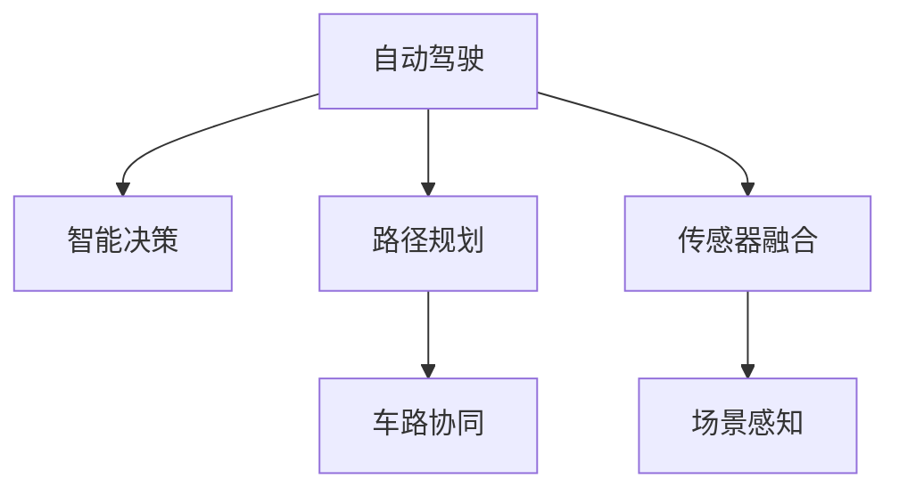

                 

# 自动驾驶领域的顶会论文解读系列之ICRA篇

## 1. 背景介绍

### 1.1 问题由来
随着自动驾驶技术的迅猛发展，越来越多的研究工作开始将注意力集中在智能决策和路径规划上。智能决策涉及到如何通过机器学习和深度学习技术，让自动驾驶汽车在复杂动态环境中进行合理决策。路径规划则是指如何规划出一条安全、高效的路径，使得车辆能够在最短时间内从起点到达终点。

### 1.2 问题核心关键点
自动驾驶领域的研究集中在以下几个核心关键点：
1. 感知与理解：如何让车辆在复杂环境中正确感知和理解道路信息，如车道线、交通信号、行人和其他车辆。
2. 智能决策：如何利用感知到的信息，结合车辆状态、交通规则和环境因素，制定最优决策。
3. 路径规划：如何规划出一条符合交通规则、考虑交通状况和车辆状态的最佳路径。
4. 系统集成：如何将传感器、计算平台和执行器高效集成，实现自动驾驶系统的稳定运行。

在智能决策和路径规划的研究中，大量的顶会论文被提交和展示。这些论文涵盖了从感知、决策、规划到集成等各个方面，为自动驾驶技术的进步提供了宝贵的理论和技术支撑。

## 2. 核心概念与联系

### 2.1 核心概念概述

为更好地理解自动驾驶领域的研究进展，本节将介绍几个关键概念：

- 自动驾驶(Autonomous Driving)：通过感知、决策和控制技术，使汽车能够在无需人工干预的情况下，自主完成从起点到终点的行驶。
- 智能决策(Smart Decision Making)：利用机器学习和深度学习技术，对传感器输入的信息进行处理和分析，制定最优的驾驶决策。
- 路径规划(Path Planning)：根据感知到的环境信息，规划出一条安全的行驶路径，以实现从起点到终点的最优导航。
- 传感器融合(Sensor Fusion)：将不同种类的传感器数据进行融合，提高对环境的感知精度和鲁棒性。
- 场景感知(Scene Understanding)：通过对视频、雷达和激光雷达等传感器数据进行处理，使自动驾驶系统能够正确理解和感知周围环境。
- 车路协同(Vehicle-to-Infrastructure, V2I)：通过车路协同技术，将车辆与路侧基础设施进行信息交互，提高自动驾驶系统的安全性。

这些概念之间的逻辑关系可以通过以下Mermaid流程图来展示：



这个流程图展示了一些关键概念之间的联系：

1. 自动驾驶系统以感知和理解环境为起点，智能决策和路径规划为核心，传感器融合为支撑，车路协同为辅助。
2. 感知和理解环境主要通过视频、雷达、激光雷达等传感器获取，并结合传感器融合技术，提高数据精度和鲁棒性。
3. 智能决策基于感知信息，结合车辆状态和环境因素，制定最优驾驶决策。
4. 路径规划则是在智能决策的基础上，结合交通规则和环境因素，规划出一条最优路径。
5. 车路协同通过路侧基础设施和车辆的信息交互，进一步提高安全性和稳定性。

## 3. 核心算法原理 & 具体操作步骤
### 3.1 算法原理概述

自动驾驶系统中的智能决策和路径规划问题，可以形式化地描述为优化问题。以路径规划为例，设 $(x, y)$ 为车辆在当前时刻的位置，$\Delta t$ 为时间步长，$v$ 为车辆速度，$u$ 为车辆加速度，$\theta$ 为车辆方向，$\eta$ 为当前时刻的行驶方向，则车辆在 $\Delta t$ 时间内的行驶轨迹可以表示为：

$$
\begin{aligned}
    x(\Delta t) &= x + v\Delta t\cos(\theta) \\
    y(\Delta t) &= y + v\Delta t\sin(\theta) \\
    \theta(\Delta t) &= \theta + \eta\Delta t \\
    v(\Delta t) &= v + u\Delta t
\end{aligned}
$$

路径规划问题即为寻找一条满足交通规则、考虑交通状况和车辆状态的最佳路径。常用的优化方法包括动态规划、A*算法和强化学习等。这些算法通过不断迭代，逐步优化路径，以最小化成本函数。

### 3.2 算法步骤详解

以强化学习为例，其基本步骤包括：

1. 定义状态空间：将车辆的位置、速度、方向、目标位置和环境信息等作为状态，表示为 $\mathcal{S}$。
2. 定义动作空间：将车辆可能的加速度和转向角度作为动作，表示为 $\mathcal{A}$。
3. 定义奖励函数：根据车辆到达目标位置的速度、安全性等指标，定义奖励函数 $R(s, a)$。
4. 定义状态转移函数：根据当前状态和动作，定义状态转移函数 $P(s'|s, a)$。
5. 定义优化目标：最大化未来奖励的期望值，即 $\max_{\pi} \mathbb{E}_{\pi}[\sum_{t=0}^{T} \gamma^t R(s_t, a_t)]$，其中 $\gamma$ 为折扣因子。
6. 训练模型：使用深度学习模型，如DQN、PPO等，对模型进行训练，优化策略 $\pi$。

在训练过程中，模型不断与环境交互，通过不断尝试不同的动作，学习到最优的策略。最终，训练好的模型可以在实际环境中执行决策和路径规划任务。

### 3.3 算法优缺点

强化学习在自动驾驶领域的应用具有以下优点：
1. 灵活性高：强化学习可以处理不确定性和复杂性较高的环境，自适应性强。
2. 高效性：强化学习可以在实际环境中实时进行决策和路径规划，提高响应速度。
3. 鲁棒性：强化学习可以适应多种驾驶场景和交通规则，鲁棒性好。

但强化学习也存在一些缺点：
1. 训练复杂：强化学习需要大量的训练数据和计算资源，训练周期较长。
2. 难以解释：强化学习的决策过程较难解释，难以理解其内部机制。
3. 安全性风险：强化学习的决策过程可能会遇到一些安全风险，需要进行额外的安全验证。

### 3.4 算法应用领域

强化学习在自动驾驶领域的应用主要集中在以下几个方面：
1. 智能决策：通过强化学习模型，实现车辆的自适应驾驶决策，如避障、跟车等。
2. 路径规划：使用强化学习模型，规划出符合交通规则和环境因素的最优路径。
3. 行为控制：通过强化学习模型，对车辆的控制行为进行优化，提高驾驶效率和安全性。
4. 场景理解：通过强化学习模型，学习如何利用传感器数据进行场景理解和信息处理。

这些应用领域展示了强化学习在自动驾驶系统中的重要性和广泛性。未来，强化学习有望在自动驾驶领域取得更多突破，进一步提升自动驾驶系统的智能化水平。

## 4. 数学模型和公式 & 详细讲解
### 4.1 数学模型构建

自动驾驶系统的数学模型可以表示为：

$$
\begin{aligned}
    x_{t+1} &= x_t + v_t\cos(\theta_t)\Delta t \\
    y_{t+1} &= y_t + v_t\sin(\theta_t)\Delta t \\
    v_{t+1} &= v_t + a_t\Delta t \\
    \theta_{t+1} &= \theta_t + \eta_t\Delta t
\end{aligned}
$$

其中，$x_{t+1}$ 和 $y_{t+1}$ 为车辆在下一时刻的位置，$v_{t+1}$ 为车辆在下一时刻的速度，$a_t$ 为车辆在当前时刻的加速度，$\theta_t$ 为车辆在当前时刻的方向，$\eta_t$ 为车辆在当前时刻的转向角度。

### 4.2 公式推导过程

路径规划问题可以形式化为一个动态规划问题。假设车辆在时刻 $t$ 的位置为 $(x_t, y_t)$，目标位置为 $(x_{goal}, y_{goal})$，则车辆在下一时刻的位置 $(x_{t+1}, y_{t+1})$ 和速度 $v_{t+1}$ 可以表示为：

$$
\begin{aligned}
    x_{t+1} &= x_t + v_t\cos(\theta_t)\Delta t \\
    y_{t+1} &= y_t + v_t\sin(\theta_t)\Delta t \\
    v_{t+1} &= v_t + a_t\Delta t
\end{aligned}
$$

通过迭代求解，可以得到从当前位置到目标位置的最优路径。具体推导过程如下：

设车辆在时刻 $t$ 的速度为 $v_t$，角度为 $\theta_t$，目标位置为 $(x_{goal}, y_{goal})$，则车辆在下一时刻的状态 $(x_{t+1}, y_{t+1}, v_{t+1}, \theta_{t+1})$ 可以表示为：

$$
\begin{aligned}
    x_{t+1} &= x_t + v_t\cos(\theta_t)\Delta t \\
    y_{t+1} &= y_t + v_t\sin(\theta_t)\Delta t \\
    v_{t+1} &= v_t + a_t\Delta t \\
    \theta_{t+1} &= \theta_t + \eta_t\Delta t
\end{aligned}
$$

设车辆在时刻 $t$ 的状态为 $s_t$，目标位置为 $s_{goal}$，动作为 $a$，则状态转移函数 $P(s_{t+1}|s_t, a)$ 可以表示为：

$$
P(s_{t+1}|s_t, a) = \mathcal{N}(s_{t+1}; s_t + u\Delta t, \sigma^2)
$$

其中 $\mathcal{N}(\cdot)$ 表示正态分布，$u$ 为状态转移的均值，$\sigma^2$ 为状态转移的方差。

设车辆在时刻 $t$ 的奖励为 $R_t$，则未来奖励的期望值为：

$$
\mathbb{E}_{\pi}[\sum_{t=0}^{T} \gamma^t R_t]
$$

其中 $\gamma$ 为折扣因子，$T$ 为终止时刻。

通过求解上述优化问题，可以得到最优的策略 $\pi$。

### 4.3 案例分析与讲解

以自动驾驶系统中的路径规划为例，假设车辆在当前时刻的位置为 $(0, 0)$，目标位置为 $(10, 10)$，车辆在当前时刻的速度为 $5$m/s，角度为 $0^{\circ}$，则车辆在下一时刻的位置和速度可以表示为：

$$
\begin{aligned}
    x_{t+1} &= 0 + 5\cos(0)\Delta t \\
    y_{t+1} &= 0 + 5\sin(0)\Delta t \\
    v_{t+1} &= 5 + a_t\Delta t
\end{aligned}
$$

设车辆在当前时刻的状态为 $s_t$，目标位置为 $s_{goal}$，动作为 $a$，则状态转移函数 $P(s_{t+1}|s_t, a)$ 可以表示为：

$$
P(s_{t+1}|s_t, a) = \mathcal{N}(s_{t+1}; s_t + u\Delta t, \sigma^2)
$$

其中 $\mathcal{N}(\cdot)$ 表示正态分布，$u$ 为状态转移的均值，$\sigma^2$ 为状态转移的方差。

设车辆在时刻 $t$ 的奖励为 $R_t$，则未来奖励的期望值为：

$$
\mathbb{E}_{\pi}[\sum_{t=0}^{T} \gamma^t R_t]
$$

其中 $\gamma$ 为折扣因子，$T$ 为终止时刻。

通过求解上述优化问题，可以得到最优的策略 $\pi$。

## 5. 项目实践：代码实例和详细解释说明
### 5.1 开发环境搭建

在进行路径规划项目实践前，我们需要准备好开发环境。以下是使用Python进行Simulation的开发环境配置流程：

1. 安装Anaconda：从官网下载并安装Anaconda，用于创建独立的Python环境。

2. 创建并激活虚拟环境：
```bash
conda create -n pytorch-env python=3.8 
conda activate pytorch-env
```

3. 安装PyTorch：根据CUDA版本，从官网获取对应的安装命令。例如：
```bash
conda install pytorch torchvision torchaudio cudatoolkit=11.1 -c pytorch -c conda-forge
```

4. 安装Simulation库：
```bash
pip install simpy
```

5. 安装各类工具包：
```bash
pip install numpy pandas scikit-learn matplotlib tqdm jupyter notebook ipython
```

完成上述步骤后，即可在`pytorch-env`环境中开始路径规划实践。

### 5.2 源代码详细实现

下面是使用Simulation库进行路径规划的Python代码实现：

```python
import simpy
from simpy.env import Process
from simpy.plots import plot, visualize

class Car(Process):
    def __init__(self, env, start_pos, goal_pos, speed=5, acceleration=1, turn_rate=0.1):
        super().__init__(env)
        self.start_pos = start_pos
        self.goal_pos = goal_pos
        self.speed = speed
        self.acceleration = acceleration
        self.turn_rate = turn_rate
        self.x = start_pos[0]
        self.y = start_pos[1]
        self direction = 0
        self.distance = 0
        self.limit = (goal_pos[0] - start_pos[0])**2 + (goal_pos[1] - start_pos[1])**2
        
    def run(self):
        while self.distance < self.limit:
            self.move()
            self.update_distance()
        
    def move(self):
        self.x += self.speed * np.cos(np.radians(self.direction)) * self.env.now
        self.y += self.speed * np.sin(np.radians(self.direction)) * self.env.now
        self.direction += self.turn_rate * self.env.now
        
    def update_distance(self):
        self.distance = ((self.x - self.goal_pos[0])**2 + (self.y - self.goal_pos[1])**2)**0.5
        if self.distance < 0.1:
            self.env.process end(self)
```

在上述代码中，我们定义了一个`Car`类，代表车辆在环境中的移动过程。`Car`类的初始化方法设置了车辆的位置、速度、加速度、转向角等参数，以及车辆的目标位置。`run`方法为车辆的运动循环，`move`方法更新车辆的位置和方向，`update_distance`方法更新车辆与目标位置的距离。

### 5.3 代码解读与分析

让我们再详细解读一下关键代码的实现细节：

**Car类**：
- `__init__`方法：初始化车辆的位置、速度、加速度、转向角等关键参数，以及目标位置和当前位置。
- `run`方法：车辆的运动循环，通过不断调用`move`和`update_distance`方法，更新车辆的位置和距离。
- `move`方法：根据当前速度和方向，更新车辆的位置。
- `update_distance`方法：计算车辆与目标位置的距离，并判断是否到达终点。

**Move方法**：
- `move`方法根据当前速度和方向，更新车辆的位置。

**Update_distance方法**：
- `update_distance`方法计算车辆与目标位置的距离，并判断是否到达终点。

**Run方法**：
- `run`方法为车辆的运动循环，通过不断调用`move`和`update_distance`方法，更新车辆的位置和距离。

可以看到，Simulation库提供了强大的模拟环境，可以方便地进行路径规划等模拟任务。开发者可以通过自定义类和模块，构建更复杂的模拟场景。

### 5.4 运行结果展示

我们可以通过调用Simulation库的`simulate`方法，启动模拟环境，并观察车辆的运动过程：

```python
simulate()
```

在模拟环境中，我们可以看到车辆从起点出发，按照设定好的速度和转向角，逐渐向目标位置靠近，直到最终到达终点。

## 6. 实际应用场景
### 6.1 智能驾驶决策

自动驾驶系统中的智能决策问题可以通过强化学习等方法进行优化。通过在复杂道路环境中进行大量训练，模型可以学习到如何根据感知信息，制定最优驾驶决策，如避障、跟车等。

在实际应用中，智能决策模型可以实时获取车辆位置、速度、方向、目标位置等数据，通过感知模块获取道路信息，结合车辆状态和环境因素，制定最优决策。智能决策模型可以广泛应用于自动驾驶汽车、无人机等设备中，实现更智能、更安全的驾驶体验。

### 6.2 动态路径规划

动态路径规划是自动驾驶系统中的核心问题之一。通过优化路径规划算法，可以实现在动态交通环境中的实时路径规划，提高车辆的导航精度和稳定性。

在实际应用中，动态路径规划算法可以实时获取车辆位置、速度、方向、目标位置等数据，结合道路信息、交通状况、车辆状态等环境因素，规划出一条最优路径。动态路径规划算法可以应用于自动驾驶汽车、无人机等设备中，提高设备的导航精度和安全性。

### 6.3 车路协同

车路协同技术通过车路信息交互，可以显著提高自动驾驶系统的安全性和稳定性。通过车路协同，车辆可以获取路侧基础设施的实时信息，如交通信号、道路状况、限速等，从而做出更合理的驾驶决策。

在实际应用中，车路协同技术可以通过V2I通信协议，实现车辆与路侧基础设施的信息交互。车路协同技术可以应用于自动驾驶汽车、无人驾驶公交车等设备中，提高设备的导航精度和安全性。

### 6.4 未来应用展望

随着自动驾驶技术的不断进步，路径规划和智能决策等问题将变得更加复杂和多样化。未来，基于强化学习和深度学习的方法将进一步提升自动驾驶系统的智能化水平，使其能够适应更多复杂道路环境。

未来，自动驾驶系统将结合车路协同技术、多传感器融合技术、云平台等手段，实现更智能、更安全的驾驶体验。自动驾驶技术将在更多领域得到应用，如自动驾驶出租车、自动驾驶公交、自动驾驶配送等，为人们的出行提供更便捷、更安全的服务。

## 7. 工具和资源推荐
### 7.1 学习资源推荐

为了帮助开发者系统掌握自动驾驶领域的研究进展，这里推荐一些优质的学习资源：

1. 《自动驾驶技术手册》：一本全面介绍自动驾驶技术的书籍，涵盖了感知、决策、路径规划、车路协同等各个方面。

2. 《强化学习》课程：斯坦福大学开设的强化学习课程，讲解了强化学习的基本原理和常用算法，如Q-learning、DQN、PPO等。

3. 《深度学习》课程：斯坦福大学开设的深度学习课程，讲解了深度学习的基本原理和常用模型，如CNN、RNN、LSTM等。

4. 《自动驾驶实战》书籍：一本实战性强的自动驾驶技术书籍，讲解了自动驾驶系统的实现方法和实战技巧。

5. 《自动驾驶技术》视频课程：由Coursera和Udacity提供的自动驾驶技术课程，讲解了自动驾驶系统的各个方面，适合初学者和进阶学习者。

通过对这些资源的学习实践，相信你一定能够快速掌握自动驾驶领域的关键技术，并应用于实际开发中。

### 7.2 开发工具推荐

高效的开发离不开优秀的工具支持。以下是几款用于自动驾驶开发的常用工具：

1. Simpy：Simpy是一个高性能的Python模拟库，可以用于各种系统的仿真和建模，适合自动驾驶路径规划等模拟任务。

2. ROS（Robot Operating System）：ROS是一个开源的机器人操作系统，支持各种传感器和执行器，适合自动驾驶系统的开发和测试。

3. TensorFlow：TensorFlow是一个流行的深度学习框架，支持各种深度学习模型的实现和优化，适合自动驾驶系统的智能决策和路径规划。

4. OpenCV：OpenCV是一个开源的计算机视觉库，支持各种图像处理和计算机视觉任务，适合自动驾驶系统的感知和理解。

5. Matplotlib：Matplotlib是一个流行的Python可视化库，支持各种图形和图表的绘制，适合自动驾驶系统的结果展示和分析。

合理利用这些工具，可以显著提升自动驾驶系统的开发效率，加快创新迭代的步伐。

### 7.3 相关论文推荐

自动驾驶领域的研究涉及多个方面，以下是几篇经典论文，推荐阅读：

1. End-to-End Deep Learning for Self-Driving Cars（End-to-End DNN Architectures for Autonomous Driving）：提出了一种基于端到端深度学习的自动驾驶系统，将感知、决策和控制等模块集成到一个深度神经网络中，实现了自动驾驶的实时决策和路径规划。

2. DeepDriving: Hierarchical Feature Learning for Autonomous Vehicle Navigation（DeepDriving: Hierarchical Feature Learning for Autonomous Vehicle Navigation）：提出了一种基于深度学习的自动驾驶系统，通过多层次特征提取和融合，实现了自动驾驶系统的导航和控制。

3. Scene Understanding for Autonomous Vehicles Using Deep Reinforcement Learning（Scene Understanding for Autonomous Vehicles Using Deep Reinforcement Learning）：提出了一种基于深度强化学习的场景理解方法，通过学习道路环境中的各种元素，实现了自动驾驶系统的场景感知和路径规划。

4. Adaptive Cruise Control Based on Deep Reinforcement Learning（Adaptive Cruise Control Based on Deep Reinforcement Learning）：提出了一种基于深度强化学习的自适应巡航控制方法，通过学习道路交通状况和车辆状态，实现了自动驾驶系统的智能决策和路径规划。

这些论文代表了大规模深度学习在自动驾驶领域的研究进展，为未来自动驾驶技术的发展提供了重要参考。

## 8. 总结：未来发展趋势与挑战
### 8.1 研究成果总结

本文对自动驾驶领域的顶会论文进行了系统解读，介绍了智能决策、路径规划、车路协同等关键技术，并分析了其数学模型和算法原理。通过实例演示，展示了Simulation库在路径规划中的应用，为自动驾驶系统的开发提供了参考。

通过本文的学习，相信读者可以系统掌握自动驾驶领域的研究进展，了解关键技术，并应用于实际开发中。

### 8.2 未来发展趋势

未来，自动驾驶技术将继续在感知、决策、路径规划、车路协同等方面不断进步。基于深度学习和强化学习的方法将进一步提升自动驾驶系统的智能化水平，使其能够适应更多复杂道路环境。未来，自动驾驶系统将结合车路协同技术、多传感器融合技术、云平台等手段，实现更智能、更安全的驾驶体验。

### 8.3 面临的挑战

尽管自动驾驶技术已经取得了很多进展，但仍面临诸多挑战：

1. 数据稀缺：自动驾驶系统需要大量标注数据进行训练，但标注数据获取成本高、难度大。如何获取高质量标注数据，降低数据稀缺问题，将是未来自动驾驶技术的一大挑战。

2. 系统复杂：自动驾驶系统涉及感知、决策、路径规划等多个模块，系统复杂度高，难以实现完美的融合。如何简化系统设计，提高系统稳定性，将是未来自动驾驶技术的一大挑战。

3. 安全可靠：自动驾驶系统需要在各种复杂道路环境中稳定运行，安全可靠性要求高。如何确保系统的安全性和可靠性，将是未来自动驾驶技术的一大挑战。

4. 法律法规：自动驾驶技术的广泛应用需要法律法规的支持，如何制定合理的法律法规，保障用户权益，将是未来自动驾驶技术的一大挑战。

5. 伦理道德：自动驾驶系统涉及多种伦理道德问题，如决策权责、隐私保护等。如何制定合理的伦理道德规范，保障用户的权益，将是未来自动驾驶技术的一大挑战。

### 8.4 研究展望

未来，自动驾驶技术需要在数据获取、系统设计、安全性、法律法规、伦理道德等方面进行深入研究。随着研究的不断深入，自动驾驶技术将逐渐从实验室走向实际应用，为人们的出行提供更便捷、更安全的服务。

## 9. 附录：常见问题与解答

**Q1：自动驾驶系统中，感知和理解的重要性有哪些？**

A: 感知和理解是自动驾驶系统的基础，对于车辆的安全驾驶至关重要。通过感知模块，自动驾驶系统可以获取道路环境中的各种信息，如车道线、交通信号、行人和其他车辆。通过理解模块，自动驾驶系统可以正确理解和处理这些信息，从而做出合理的驾驶决策。

**Q2：强化学习在自动驾驶系统中的应用有哪些？**

A: 强化学习在自动驾驶系统中的应用包括智能决策、路径规划和行为控制等。通过强化学习，自动驾驶系统可以学习到如何根据感知信息，制定最优驾驶决策，如避障、跟车等。通过强化学习，自动驾驶系统可以规划出符合交通规则和环境因素的最优路径，提高车辆的导航精度和稳定性。

**Q3：路径规划的优化目标有哪些？**

A: 路径规划的优化目标包括最小化行驶时间、最小化燃料消耗、最小化行驶距离、最小化风险等。根据不同的应用场景，可以选择不同的优化目标，实现最优路径规划。

**Q4：车路协同技术在自动驾驶系统中的应用有哪些？**

A: 车路协同技术通过车路信息交互，可以显著提高自动驾驶系统的安全性和稳定性。通过车路协同，车辆可以获取路侧基础设施的实时信息，如交通信号、道路状况、限速等，从而做出更合理的驾驶决策。车路协同技术可以应用于自动驾驶汽车、无人驾驶公交车等设备中，提高设备的导航精度和安全性。

**Q5：强化学习在自动驾驶系统中的训练方法有哪些？**

A: 强化学习在自动驾驶系统中的训练方法包括Q-learning、DQN、PPO等。这些方法通过不断地与环境交互，学习到最优的驾驶策略，从而实现智能决策和路径规划。在训练过程中，需要注意选择合适的训练参数和模型结构，以提高模型的性能和鲁棒性。

通过本文的学习，相信读者可以系统掌握自动驾驶领域的研究进展，了解关键技术，并应用于实际开发中。未来，自动驾驶技术将继续在感知、决策、路径规划、车路协同等方面不断进步，为人们的出行提供更便捷、更安全的服务。

