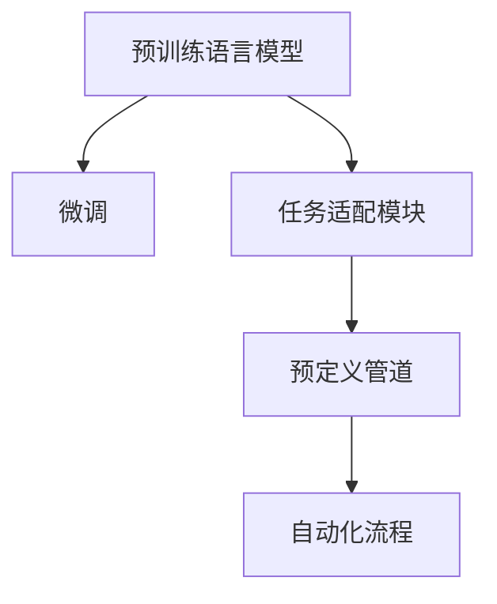

                 

# 自然语言创建工作流的前景

## 1. 背景介绍

### 1.1 问题由来
自然语言处理(Natural Language Processing, NLP)是人工智能(AI)领域的重要分支，致力于使计算机能够理解、处理和生成自然语言。随着深度学习技术的迅猛发展，预训练语言模型(Pre-trained Language Models, PLMs)如BERT、GPT等取得了显著成果，推动了NLP技术的突破性进展。

然而，预训练语言模型通常仅适用于大规模无标签文本数据的自监督预训练。为了应用于特定任务，需要在预训练模型的基础上进行微调(Fine-Tuning)或迁移学习(Transfer Learning)，使得模型能够学习到任务的特定知识。这种基于预训练-微调的范式被广泛应用于文本分类、情感分析、问答系统、机器翻译等多个领域。

近年来，随着预训练模型和微调技术的发展，自然语言创建工作流(Create As Pipeline)的思路逐渐兴起。这种思路强调通过构建连续的、模块化的任务处理流程，使得自然语言处理任务能够高效、可扩展地进行，进而推动NLP技术在更多实际场景中的应用。

### 1.2 问题核心关键点
自然语言创建工作流旨在通过预训练-微调的大模型，结合任务适配模块和预定义管道，实现从数据预处理、模型微调、后处理等全流程的自动化和高效化。其核心关键点包括：

- **预训练-微调范式**：利用大规模语料进行预训练，基于特定任务数据进行微调，使得模型能够学习到任务的特定知识。
- **任务适配模块**：针对不同任务，设计特定功能的任务适配模块，如分词、命名实体识别、句法分析等。
- **预定义管道**：将不同任务适配模块组合成预定义的管道，形成从输入到输出的连续处理流程。
- **自动化流程**：通过程序化、脚本化或API接口，实现工作流自动化，减少人工干预，提升处理效率。

这种思路相较于传统的自然语言处理范式，具有更强的模块化、自动化和可扩展性，能够更高效地处理自然语言任务。

## 2. 核心概念与联系

### 2.1 核心概念概述

为了更好地理解自然语言创建工作流，本节将介绍几个关键概念：

- **自然语言处理(NLP)**：使计算机能够理解、处理和生成自然语言的技术。
- **预训练语言模型(PLMs)**：如BERT、GPT等，通过大规模无标签文本数据进行自监督预训练，学习通用的语言表示。
- **微调(Fine-Tuning)**：基于特定任务数据，对预训练模型进行微调，使得模型能够学习到任务的特定知识。
- **迁移学习(Transfer Learning)**：将一个领域学习到的知识，迁移应用到另一个不同但相关的领域。
- **任务适配模块**：针对不同任务，设计特定功能的处理模块，如分词、命名实体识别、句法分析等。
- **预定义管道(Pipeline)**：将不同任务适配模块组合成连续的处理流程，形成预定义的管道。
- **自动化流程(Auto-Flow)**：通过程序化、脚本化或API接口，实现工作流自动化，减少人工干预。

这些概念之间的逻辑关系可以通过以下Mermaid流程图来展示：



这个流程图展示了大语言模型的核心概念及其之间的关系：

1. 大语言模型通过预训练获得基础能力。
2. 微调是对预训练模型进行任务特定的优化，可以通过任务适配模块和预定义管道，将模型应用到特定任务上。
3. 自动化流程使得整个工作流可以自动化进行，提升处理效率。

这些概念共同构成了自然语言创建工作流的框架，使其能够在各种场景下高效地处理自然语言任务。

## 3. 核心算法原理 & 具体操作步骤
### 3.1 算法原理概述

自然语言创建工作流通常基于预训练语言模型，结合任务适配模块和预定义管道，实现从输入到输出的连续处理流程。其核心算法原理如下：

1. **预训练步骤**：利用大规模无标签文本数据进行预训练，学习通用的语言表示。
2. **任务适配步骤**：根据具体任务，设计任务适配模块，将预训练模型转化为任务特定模型。
3. **微调步骤**：使用特定任务数据对任务适配后的模型进行微调，学习任务的特定知识。
4. **管道组合步骤**：将多个任务适配模块组合成预定义的管道，形成从输入到输出的连续处理流程。
5. **自动化处理步骤**：通过程序化、脚本化或API接口，实现工作流的自动化处理，提升处理效率。

### 3.2 算法步骤详解

自然语言创建工作流的具体操作步骤如下：

**Step 1: 数据准备**
- 收集预训练模型所需的大规模无标签文本数据。
- 准备特定任务所需的有标签训练数据，划分为训练集、验证集和测试集。

**Step 2: 预训练模型加载**
- 选择合适的预训练语言模型，如BERT、GPT等。
- 使用预训练模型提供的API或代码库，将其加载到计算环境中。

**Step 3: 任务适配模块设计**
- 根据具体任务，设计任务适配模块，如分词模块、命名实体识别模块、句法分析模块等。
- 将任务适配模块嵌入到预训练模型中，形成任务特定模型。

**Step 4: 模型微调**
- 使用特定任务数据对任务适配后的模型进行微调，学习任务的特定知识。
- 根据任务特点选择合适的优化算法、超参数和正则化技术。
- 监控模型在验证集上的性能，防止过拟合。

**Step 5: 管道组合**
- 将多个任务适配模块组合成预定义的管道，形成从输入到输出的连续处理流程。
- 确定每个模块的输入输出接口，确保数据流顺畅。

**Step 6: 自动化处理**
- 将工作流封装为程序、脚本或API接口，实现自动化处理。
- 通过API接口，接受输入数据，返回处理结果。

以上是自然语言创建工作流的一般步骤。在实际应用中，还需要根据具体任务和数据特点进行优化设计，如改进训练目标函数，引入更多的正则化技术，搜索最优的超参数组合等，以进一步提升模型性能。

### 3.3 算法优缺点

自然语言创建工作流具有以下优点：
1. 模块化设计：通过任务适配模块的组合，可以灵活适应不同自然语言任务。
2. 可扩展性强：新增任务适配模块，即可扩展到新的任务处理。
3. 自动化高效：通过自动化处理，减少人工干预，提升处理效率。
4. 便于维护：模块化设计使得系统易于维护和升级。

同时，该方法也存在一定的局限性：
1. 预训练模型依赖于大规模语料，获取成本较高。
2. 任务适配模块设计复杂，需要根据具体任务进行调整。
3. 微调过程可能面临过拟合问题，需要精细调参。
4. 系统复杂度高，调试和优化难度大。

尽管存在这些局限性，但自然语言创建工作流因其高效、可扩展和自动化的特点，已在大规模NLP应用中得到了广泛应用。未来相关研究的重点在于如何进一步降低预训练模型的依赖，提高系统的稳定性和可解释性，同时兼顾可扩展性和自动化效率。

### 3.4 算法应用领域

自然语言创建工作流在NLP领域已经得到了广泛的应用，覆盖了几乎所有常见任务，例如：

- 文本分类：如情感分析、主题分类、意图识别等。通过微调使得模型学习文本-标签映射。
- 命名实体识别：识别文本中的人名、地名、机构名等特定实体。通过微调使得模型掌握实体边界和类型。
- 关系抽取：从文本中抽取实体之间的语义关系。通过微调使得模型学习实体-关系三元组。
- 问答系统：对自然语言问题给出答案。将问题-答案对作为微调数据，训练模型学习匹配答案。
- 机器翻译：将源语言文本翻译成目标语言。通过微调使得模型学习语言-语言映射。
- 文本摘要：将长文本压缩成简短摘要。将文章-摘要对作为微调数据，使模型学习抓取要点。
- 对话系统：使机器能够与人自然对话。将多轮对话历史作为上下文，微调模型进行回复生成。

除了上述这些经典任务外，自然语言创建工作流还被创新性地应用到更多场景中，如可控文本生成、常识推理、代码生成、数据增强等，为NLP技术带来了全新的突破。随着预训练模型和自然语言创建工作流方法的不断进步，相信NLP技术将在更广阔的应用领域大放异彩。

## 4. 数学模型和公式 & 详细讲解
### 4.1 数学模型构建

自然语言创建工作流通常基于预训练语言模型，结合任务适配模块和预定义管道，实现从输入到输出的连续处理流程。其数学模型构建如下：

设预训练语言模型为 $M_{\theta}$，其中 $\theta$ 为预训练得到的模型参数。假设微调任务的训练集为 $D=\{(x_i,y_i)\}_{i=1}^N, x_i \in \mathcal{X}, y_i \in \mathcal{Y}$。

定义模型 $M_{\theta}$ 在输入 $x$ 上的输出为 $M_{\theta}(x)$，其中 $\mathcal{X}$ 为输入空间，$\mathcal{Y}$ 为输出空间。

定义模型 $M_{\theta}$ 在数据样本 $(x,y)$ 上的损失函数为 $\ell(M_{\theta}(x),y)$，则在数据集 $D$ 上的经验风险为：

$$
\mathcal{L}(\theta) = \frac{1}{N} \sum_{i=1}^N \ell(M_{\theta}(x_i),y_i)
$$

微调的优化目标是最小化经验风险，即找到最优参数：

$$
\theta^* = \mathop{\arg\min}_{\theta} \mathcal{L}(\theta)
$$

在实践中，我们通常使用基于梯度的优化算法（如SGD、Adam等）来近似求解上述最优化问题。设 $\eta$ 为学习率，$\lambda$ 为正则化系数，则参数的更新公式为：

$$
\theta \leftarrow \theta - \eta \nabla_{\theta}\mathcal{L}(\theta) - \eta\lambda\theta
$$

其中 $\nabla_{\theta}\mathcal{L}(\theta)$ 为损失函数对参数 $\theta$ 的梯度，可通过反向传播算法高效计算。

### 4.2 公式推导过程

以下我们以文本分类任务为例，推导交叉熵损失函数及其梯度的计算公式。

假设模型 $M_{\theta}$ 在输入 $x$ 上的输出为 $\hat{y}=M_{\theta}(x) \in [0,1]$，表示样本属于正类的概率。真实标签 $y \in \{0,1\}$。则二分类交叉熵损失函数定义为：

$$
\ell(M_{\theta}(x),y) = -[y\log \hat{y} + (1-y)\log (1-\hat{y})]
$$

将其代入经验风险公式，得：

$$
\mathcal{L}(\theta) = -\frac{1}{N}\sum_{i=1}^N [y_i\log M_{\theta}(x_i)+(1-y_i)\log(1-M_{\theta}(x_i))]
$$

根据链式法则，损失函数对参数 $\theta_k$ 的梯度为：

$$
\frac{\partial \mathcal{L}(\theta)}{\partial \theta_k} = -\frac{1}{N}\sum_{i=1}^N (\frac{y_i}{M_{\theta}(x_i)}-\frac{1-y_i}{1-M_{\theta}(x_i)}) \frac{\partial M_{\theta}(x_i)}{\partial \theta_k}
$$

其中 $\frac{\partial M_{\theta}(x_i)}{\partial \theta_k}$ 可进一步递归展开，利用自动微分技术完成计算。

在得到损失函数的梯度后，即可带入参数更新公式，完成模型的迭代优化。重复上述过程直至收敛，最终得到适应下游任务的最优模型参数 $\theta^*$。

## 5. 项目实践：代码实例和详细解释说明
### 5.1 开发环境搭建

在进行自然语言创建工作流实践前，我们需要准备好开发环境。以下是使用Python进行PyTorch开发的环境配置流程：

1. 安装Anaconda：从官网下载并安装Anaconda，用于创建独立的Python环境。

2. 创建并激活虚拟环境：
```bash
conda create -n pytorch-env python=3.8 
conda activate pytorch-env
```

3. 安装PyTorch：根据CUDA版本，从官网获取对应的安装命令。例如：
```bash
conda install pytorch torchvision torchaudio cudatoolkit=11.1 -c pytorch -c conda-forge
```

4. 安装Transformers库：
```bash
pip install transformers
```

5. 安装各类工具包：
```bash
pip install numpy pandas scikit-learn matplotlib tqdm jupyter notebook ipython
```

完成上述步骤后，即可在`pytorch-env`环境中开始自然语言创建工作流的实践。

### 5.2 源代码详细实现

这里我们以文本分类任务为例，给出使用Transformers库对BERT模型进行自然语言创建工作流的PyTorch代码实现。

首先，定义文本分类任务的数据处理函数：

```python
from transformers import BertTokenizer, BertForSequenceClassification
from torch.utils.data import Dataset
import torch

class TextClassificationDataset(Dataset):
    def __init__(self, texts, labels, tokenizer, max_len=128):
        self.texts = texts
        self.labels = labels
        self.tokenizer = tokenizer
        self.max_len = max_len
        
    def __len__(self):
        return len(self.texts)
    
    def __getitem__(self, item):
        text = self.texts[item]
        label = self.labels[item]
        
        encoding = self.tokenizer(text, return_tensors='pt', max_length=self.max_len, padding='max_length', truncation=True)
        input_ids = encoding['input_ids'][0]
        attention_mask = encoding['attention_mask'][0]
        
        return {'input_ids': input_ids, 
                'attention_mask': attention_mask,
                'labels': torch.tensor(label, dtype=torch.long)}
```

然后，定义模型和优化器：

```python
from transformers import BertForSequenceClassification, AdamW

model = BertForSequenceClassification.from_pretrained('bert-base-cased', num_labels=2)

optimizer = AdamW(model.parameters(), lr=2e-5)
```

接着，定义训练和评估函数：

```python
from torch.utils.data import DataLoader
from tqdm import tqdm
from sklearn.metrics import classification_report

device = torch.device('cuda') if torch.cuda.is_available() else torch.device('cpu')
model.to(device)

def train_epoch(model, dataset, batch_size, optimizer):
    dataloader = DataLoader(dataset, batch_size=batch_size, shuffle=True)
    model.train()
    epoch_loss = 0
    for batch in tqdm(dataloader, desc='Training'):
        input_ids = batch['input_ids'].to(device)
        attention_mask = batch['attention_mask'].to(device)
        labels = batch['labels'].to(device)
        model.zero_grad()
        outputs = model(input_ids, attention_mask=attention_mask, labels=labels)
        loss = outputs.loss
        epoch_loss += loss.item()
        loss.backward()
        optimizer.step()
    return epoch_loss / len(dataloader)

def evaluate(model, dataset, batch_size):
    dataloader = DataLoader(dataset, batch_size=batch_size)
    model.eval()
    preds, labels = [], []
    with torch.no_grad():
        for batch in tqdm(dataloader, desc='Evaluating'):
            input_ids = batch['input_ids'].to(device)
            attention_mask = batch['attention_mask'].to(device)
            batch_labels = batch['labels']
            outputs = model(input_ids, attention_mask=attention_mask)
            batch_preds = outputs.logits.argmax(dim=2).to('cpu').tolist()
            batch_labels = batch_labels.to('cpu').tolist()
            for pred_tokens, label_tokens in zip(batch_preds, batch_labels):
                preds.append(pred_tokens)
                labels.append(label_tokens)
                
    print(classification_report(labels, preds))
```

最后，启动训练流程并在测试集上评估：

```python
epochs = 5
batch_size = 16

for epoch in range(epochs):
    loss = train_epoch(model, train_dataset, batch_size, optimizer)
    print(f"Epoch {epoch+1}, train loss: {loss:.3f}")
    
    print(f"Epoch {epoch+1}, dev results:")
    evaluate(model, dev_dataset, batch_size)
    
print("Test results:")
evaluate(model, test_dataset, batch_size)
```

以上就是使用PyTorch对BERT进行文本分类任务的自然语言创建工作流的完整代码实现。可以看到，得益于Transformers库的强大封装，我们可以用相对简洁的代码完成BERT模型的加载和微调。

### 5.3 代码解读与分析

让我们再详细解读一下关键代码的实现细节：

**TextClassificationDataset类**：
- `__init__`方法：初始化文本、标签、分词器等关键组件。
- `__len__`方法：返回数据集的样本数量。
- `__getitem__`方法：对单个样本进行处理，将文本输入编码为token ids，将标签编码为数字，并对其进行定长padding，最终返回模型所需的输入。

**模型和优化器**：
- 使用预训练BERT模型，设置2个类别作为分类标签。
- 选择AdamW优化器，设置学习率为2e-5。

**训练和评估函数**：
- 使用PyTorch的DataLoader对数据集进行批次化加载，供模型训练和推理使用。
- 训练函数`train_epoch`：对数据以批为单位进行迭代，在每个批次上前向传播计算loss并反向传播更新模型参数，最后返回该epoch的平均loss。
- 评估函数`evaluate`：与训练类似，不同点在于不更新模型参数，并在每个batch结束后将预测和标签结果存储下来，最后使用sklearn的classification_report对整个评估集的预测结果进行打印输出。

**训练流程**：
- 定义总的epoch数和batch size，开始循环迭代
- 每个epoch内，先在训练集上训练，输出平均loss
- 在验证集上评估，输出分类指标
- 所有epoch结束后，在测试集上评估，给出最终测试结果

可以看到，PyTorch配合Transformers库使得BERT模型的加载和微调变得简洁高效。开发者可以将更多精力放在数据处理、模型改进等高层逻辑上，而不必过多关注底层的实现细节。

当然，工业级的系统实现还需考虑更多因素，如模型的保存和部署、超参数的自动搜索、更灵活的任务适配层等。但核心的自然语言创建工作流范式基本与此类似。

## 6. 实际应用场景
### 6.1 智能客服系统

自然语言创建工作流在智能客服系统中的应用具有重要意义。传统客服往往需要配备大量人力，高峰期响应缓慢，且一致性和专业性难以保证。使用自然语言创建工作流构建的智能客服系统，可以7x24小时不间断服务，快速响应客户咨询，用自然流畅的语言解答各类常见问题。

在技术实现上，可以收集企业内部的历史客服对话记录，将问题和最佳答复构建成监督数据，在此基础上对预训练对话模型进行微调。微调后的对话模型能够自动理解用户意图，匹配最合适的答案模板进行回复。对于客户提出的新问题，还可以接入检索系统实时搜索相关内容，动态组织生成回答。如此构建的智能客服系统，能大幅提升客户咨询体验和问题解决效率。

### 6.2 金融舆情监测

金融机构需要实时监测市场舆论动向，以便及时应对负面信息传播，规避金融风险。自然语言创建工作流在此方面的应用同样重要。

具体而言，可以收集金融领域相关的新闻、报道、评论等文本数据，并对其进行主题标注和情感标注。在此基础上对预训练语言模型进行微调，使其能够自动判断文本属于何种主题，情感倾向是正面、中性还是负面。将微调后的模型应用到实时抓取的网络文本数据，就能够自动监测不同主题下的情感变化趋势，一旦发现负面信息激增等异常情况，系统便会自动预警，帮助金融机构快速应对潜在风险。

### 6.3 个性化推荐系统

当前的推荐系统往往只依赖用户的历史行为数据进行物品推荐，无法深入理解用户的真实兴趣偏好。自然语言创建工作流可应用于个性化推荐系统，挖掘用户行为背后的语义信息。

在实践中，可以收集用户浏览、点击、评论、分享等行为数据，提取和用户交互的物品标题、描述、标签等文本内容。将文本内容作为模型输入，用户的后续行为（如是否点击、购买等）作为监督信号，在此基础上微调预训练语言模型。微调后的模型能够从文本内容中准确把握用户的兴趣点。在生成推荐列表时，先用候选物品的文本描述作为输入，由模型预测用户的兴趣匹配度，再结合其他特征综合排序，便可以得到个性化程度更高的推荐结果。

### 6.4 未来应用展望

随着自然语言创建工作流技术的发展，其在更多领域的应用前景广阔。

在智慧医疗领域，基于自然语言创建工作流的医疗问答、病历分析、药物研发等应用将提升医疗服务的智能化水平，辅助医生诊疗，加速新药开发进程。

在智能教育领域，自然语言创建工作流可应用于作业批改、学情分析、知识推荐等方面，因材施教，促进教育公平，提高教学质量。

在智慧城市治理中，自然语言创建工作流可用于城市事件监测、舆情分析、应急指挥等环节，提高城市管理的自动化和智能化水平，构建更安全、高效的未来城市。

此外，在企业生产、社会治理、文娱传媒等众多领域，自然语言创建工作流也将不断涌现，为传统行业数字化转型升级提供新的技术路径。相信随着技术的日益成熟，自然语言创建工作流必将成为人工智能落地应用的重要范式，推动人工智能技术在更多实际场景中的应用。

## 7. 工具和资源推荐
### 7.1 学习资源推荐

为了帮助开发者系统掌握自然语言创建工作流的基础理论和实践技巧，这里推荐一些优质的学习资源：

1. 《深度学习与自然语言处理》书籍：介绍深度学习在NLP领域的广泛应用，涵盖预训练模型、微调、管道设计等核心概念。

2. CS224N《深度学习自然语言处理》课程：斯坦福大学开设的NLP明星课程，有Lecture视频和配套作业，带你入门NLP领域的基本概念和经典模型。

3. 《Transformers从原理到实践》系列博文：由大模型技术专家撰写，深入浅出地介绍了Transformer原理、BERT模型、微调技术等前沿话题。

4. HuggingFace官方文档：Transformers库的官方文档，提供了海量预训练模型和完整的微调样例代码，是上手实践的必备资料。

5. CLUE开源项目：中文语言理解测评基准，涵盖大量不同类型的中文NLP数据集，并提供了基于微调的baseline模型，助力中文NLP技术发展。

通过对这些资源的学习实践，相信你一定能够快速掌握自然语言创建工作流的精髓，并用于解决实际的NLP问题。
### 7.2 开发工具推荐

高效的开发离不开优秀的工具支持。以下是几款用于自然语言创建工作流开发的常用工具：

1. PyTorch：基于Python的开源深度学习框架，灵活动态的计算图，适合快速迭代研究。大部分预训练语言模型都有PyTorch版本的实现。

2. TensorFlow：由Google主导开发的开源深度学习框架，生产部署方便，适合大规模工程应用。同样有丰富的预训练语言模型资源。

3. Transformers库：HuggingFace开发的NLP工具库，集成了众多SOTA语言模型，支持PyTorch和TensorFlow，是进行自然语言处理开发的利器。

4. Weights & Biases：模型训练的实验跟踪工具，可以记录和可视化模型训练过程中的各项指标，方便对比和调优。与主流深度学习框架无缝集成。

5. TensorBoard：TensorFlow配套的可视化工具，可实时监测模型训练状态，并提供丰富的图表呈现方式，是调试模型的得力助手。

6. Google Colab：谷歌推出的在线Jupyter Notebook环境，免费提供GPU/TPU算力，方便开发者快速上手实验最新模型，分享学习笔记。

合理利用这些工具，可以显著提升自然语言创建工作流的开发效率，加快创新迭代的步伐。

### 7.3 相关论文推荐

自然语言创建工作流的发展源于学界的持续研究。以下是几篇奠基性的相关论文，推荐阅读：

1. Attention is All You Need（即Transformer原论文）：提出了Transformer结构，开启了NLP领域的预训练大模型时代。

2. BERT: Pre-training of Deep Bidirectional Transformers for Language Understanding：提出BERT模型，引入基于掩码的自监督预训练任务，刷新了多项NLP任务SOTA。

3. Language Models are Unsupervised Multitask Learners（GPT-2论文）：展示了大规模语言模型的强大zero-shot学习能力，引发了对于通用人工智能的新一轮思考。

4. Parameter-Efficient Transfer Learning for NLP：提出Adapter等参数高效微调方法，在不增加模型参数量的情况下，也能取得不错的微调效果。

5. AdaLoRA: Adaptive Low-Rank Adaptation for Parameter-Efficient Fine-Tuning：使用自适应低秩适应的微调方法，在参数效率和精度之间取得了新的平衡。

这些论文代表了大语言模型自然语言创建工作流的发展脉络。通过学习这些前沿成果，可以帮助研究者把握学科前进方向，激发更多的创新灵感。

## 8. 总结：未来发展趋势与挑战
### 8.1 总结

本文对自然语言创建工作流方法进行了全面系统的介绍。首先阐述了自然语言创建工作流的背景和意义，明确了微调在拓展预训练模型应用、提升下游任务性能方面的独特价值。其次，从原理到实践，详细讲解了自然语言创建工作流的数学原理和关键步骤，给出了自然语言创建工作流任务开发的完整代码实例。同时，本文还广泛探讨了自然语言创建工作流在智能客服、金融舆情、个性化推荐等多个行业领域的应用前景，展示了自然语言创建工作流的巨大潜力。此外，本文精选了自然语言创建工作流的各类学习资源，力求为读者提供全方位的技术指引。

通过本文的系统梳理，可以看到，自然语言创建工作流因其高效、可扩展和自动化的特点，已在大规模NLP应用中得到了广泛应用。未来相关研究的重点在于如何进一步降低预训练模型的依赖，提高系统的稳定性和可解释性，同时兼顾可扩展性和自动化效率。

### 8.2 未来发展趋势

展望未来，自然语言创建工作流技术将呈现以下几个发展趋势：

1. 模型规模持续增大。随着算力成本的下降和数据规模的扩张，预训练语言模型的参数量还将持续增长。超大规模语言模型蕴含的丰富语言知识，有望支撑更加复杂多变的下游任务微调。

2. 自然语言处理任务多样化。除了传统的文本分类、情感分析等任务，自然语言创建工作流还将扩展到视觉、语音等多模态数据的处理。

3. 可解释性和鲁棒性提升。自然语言创建工作流将引入更多的可解释性技术和鲁棒性提升方法，使得模型输出更具解释性和可靠性。

4. 自动生成和优化。自然语言创建工作流将探索更多自动生成技术，如基于变分自编码器(VAE)的文本生成，以及优化方法，如模型压缩、稀疏化等，以提升处理效率和模型性能。

5. 跨模态融合。自然语言创建工作流将加强不同模态数据的整合，如视觉、语音、文本的协同建模，提升系统的综合信息处理能力。

以上趋势凸显了自然语言创建工作流技术的广阔前景。这些方向的探索发展，必将进一步提升自然语言处理系统的性能和应用范围，为人类认知智能的进化带来深远影响。

### 8.3 面临的挑战

尽管自然语言创建工作流技术已经取得了瞩目成就，但在迈向更加智能化、普适化应用的过程中，它仍面临着诸多挑战：

1. 预训练模型依赖于大规模语料，获取成本较高。
2. 任务适配模块设计复杂，需要根据具体任务进行调整。
3. 微调过程可能面临过拟合问题，需要精细调参。
4. 系统复杂度高，调试和优化难度大。

尽管存在这些局限性，但自然语言创建工作流因其高效、可扩展和自动化的特点，已在大规模NLP应用中得到了广泛应用。未来相关研究的重点在于如何进一步降低预训练模型的依赖，提高系统的稳定性和可解释性，同时兼顾可扩展性和自动化效率。

### 8.4 研究展望

面对自然语言创建工作流所面临的挑战，未来的研究需要在以下几个方面寻求新的突破：

1. 探索无监督和半监督自然语言创建工作流方法。摆脱对大规模标注数据的依赖，利用自监督学习、主动学习等无监督和半监督范式，最大限度利用非结构化数据，实现更加灵活高效的自然语言创建工作流。

2. 研究参数高效和计算高效的自然语言创建工作流范式。开发更加参数高效的自然语言创建工作流方法，在固定大部分预训练参数的情况下，只更新极少量的任务相关参数。同时优化自然语言创建工作流的计算图，减少前向传播和反向传播的资源消耗，实现更加轻量级、实时性的部署。

3. 融合因果和对比学习范式。通过引入因果推断和对比学习思想，增强自然语言创建工作流模型建立稳定因果关系的能力，学习更加普适、鲁棒的语言表征，从而提升模型泛化性和抗干扰能力。

4. 引入更多先验知识。将符号化的先验知识，如知识图谱、逻辑规则等，与神经网络模型进行巧妙融合，引导自然语言创建工作流过程学习更准确、合理的语言模型。同时加强不同模态数据的整合，实现视觉、语音等多模态信息与文本信息的协同建模。

5. 结合因果分析和博弈论工具。将因果分析方法引入自然语言创建工作流模型，识别出模型决策的关键特征，增强输出解释的因果性和逻辑性。借助博弈论工具刻画人机交互过程，主动探索并规避模型的脆弱点，提高系统稳定性。

6. 纳入伦理道德约束。在自然语言创建工作流模型训练目标中引入伦理导向的评估指标，过滤和惩罚有偏见、有害的输出倾向。同时加强人工干预和审核，建立模型行为的监管机制，确保输出符合人类价值观和伦理道德。

这些研究方向的探索，必将引领自然语言创建工作流技术迈向更高的台阶，为构建安全、可靠、可解释、可控的智能系统铺平道路。面向未来，自然语言创建工作流技术还需要与其他人工智能技术进行更深入的融合，如知识表示、因果推理、强化学习等，多路径协同发力，共同推动自然语言理解和智能交互系统的进步。只有勇于创新、敢于突破，才能不断拓展自然语言创建工作流的边界，让智能技术更好地造福人类社会。

## 9. 附录：常见问题与解答

**Q1：自然语言创建工作流是否适用于所有NLP任务？**

A: 自然语言创建工作流在大多数NLP任务上都能取得不错的效果，特别是对于数据量较小的任务。但对于一些特定领域的任务，如医学、法律等，仅仅依靠通用语料预训练的模型可能难以很好地适应。此时需要在特定领域语料上进一步预训练，再进行微调，才能获得理想效果。此外，对于一些需要时效性、个性化很强的任务，如对话、推荐等，自然语言创建工作流也需要针对性的改进优化。

**Q2：自然语言创建工作流在实际应用中需要注意哪些问题？**

A: 自然语言创建工作流在实际应用中需要注意以下问题：
1. 预训练模型依赖于大规模语料，获取成本较高。
2. 任务适配模块设计复杂，需要根据具体任务进行调整。
3. 微调过程可能面临过拟合问题，需要精细调参。
4. 系统复杂度高，调试和优化难度大。
5. 模型输出需要经过后处理，保证输出一致性和准确性。
6. 需要考虑模型的可扩展性和稳定性。

这些问题需要在实际应用中综合考虑，进行合理的方案设计和优化。

**Q3：自然语言创建工作流的优化方向有哪些？**

A: 自然语言创建工作流的优化方向包括：
1. 降低预训练模型依赖，提高系统可扩展性和稳定性。
2. 提升模型输出可解释性和鲁棒性。
3. 提高模型生成和优化效率，减少计算资源消耗。
4. 加强不同模态数据的整合，提升系统综合信息处理能力。
5. 引入因果分析工具，增强模型决策的因果性和逻辑性。
6. 加入伦理道德约束，确保输出符合人类价值观和伦理道德。

这些方向的探索发展，将使得自然语言创建工作流在更多实际场景中发挥更大的作用。

**Q4：自然语言创建工作流在各个行业的应用前景如何？**

A: 自然语言创建工作流在各个行业的应用前景如下：
1. 智能客服系统：快速响应客户咨询，提升客服体验。
2. 金融舆情监测：实时监测市场舆论动向，规避金融风险。
3. 个性化推荐系统：挖掘用户兴趣偏好，提升推荐准确性。
4. 智慧医疗：辅助医生诊疗，加速新药开发。
5. 智能教育：因材施教，提高教学质量。
6. 智慧城市治理：提高城市管理的自动化和智能化水平。

这些应用将推动各个行业数字化转型升级，提升业务效率和服务水平。

**Q5：自然语言创建工作流有哪些学习资源推荐？**

A: 自然语言创建工作流的学习资源推荐如下：
1. 《深度学习与自然语言处理》书籍。
2. CS224N《深度学习自然语言处理》课程。
3. 《Transformers从原理到实践》系列博文。
4. HuggingFace官方文档。
5. CLUE开源项目。

这些资源将帮助开发者系统掌握自然语言创建工作流的理论基础和实践技巧。

**Q6：自然语言创建工作流有哪些开发工具推荐？**

A: 自然语言创建工作流的开发工具推荐如下：
1. PyTorch。
2. TensorFlow。
3. Transformers库。
4. Weights & Biases。
5. TensorBoard。
6. Google Colab。

这些工具将显著提升自然语言创建工作流的开发效率和处理性能。

**Q7：自然语言创建工作流有哪些相关论文推荐？**

A: 自然语言创建工作流的相关论文推荐如下：
1. Attention is All You Need。
2. BERT: Pre-training of Deep Bidirectional Transformers for Language Understanding。
3. Language Models are Unsupervised Multitask Learners（GPT-2论文）。
4. Parameter-Efficient Transfer Learning for NLP。
5. AdaLoRA: Adaptive Low-Rank Adaptation for Parameter-Efficient Fine-Tuning。

这些论文代表了大语言模型自然语言创建工作流的发展脉络。

**Q8：自然语言创建工作流有哪些未来突破？**

A: 自然语言创建工作流的未来突破如下：
1. 探索无监督和半监督自然语言创建工作流方法。
2. 研究参数高效和计算高效的自然语言创建工作流范式。
3. 融合因果和对比学习范式。
4. 引入更多先验知识。
5. 结合因果分析和博弈论工具。
6. 纳入伦理道德约束。

这些研究方向的探索，将引领自然语言创建工作流技术迈向更高的台阶，为构建安全、可靠、可解释、可控的智能系统铺平道路。

---

作者：禅与计算机程序设计艺术 / Zen and the Art of Computer Programming

