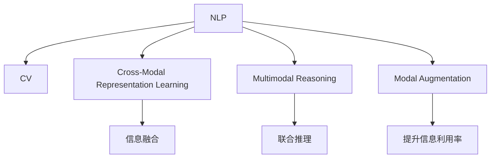

                 

# 自然语言处理与计算机视觉的融合研究

## 1. 背景介绍

### 1.1 问题由来
在人工智能（AI）领域，自然语言处理（NLP）和计算机视觉（CV）是两个非常重要的研究方向。NLP致力于理解、处理和生成自然语言，而CV则专注于图像和视频数据的分析和识别。尽管这两个领域在某些方面存在差异，但它们都有共同的目标，即从大量数据中提取有用的信息。近年来，随着技术的不断进步，NLP和CV之间的界限变得越来越模糊，促使了这两个领域的深度融合，从而产生了一系列新的研究方向和应用。

### 1.2 问题核心关键点
NLP和CV融合的核心关键点在于如何结合两个领域的技术和知识，实现对多模态数据的全面理解和处理。在实践中，常见的融合方式包括：
- 跨模态表示学习：通过联合训练NLP和CV模型，学习统一的特征表示。
- 多模态推理：将NLP和CV数据融合，进行联合推理和决策。
- 模态增强：使用一个模态的输出作为另一个模态的输入，提升信息利用率。

### 1.3 问题研究意义
NLP与CV的融合研究对于推动AI技术的发展具有重要意义：
1. 提升数据理解能力：融合技术能够从文字和视觉两种模态中提取信息，大大增强对复杂数据场景的理解能力。
2. 拓展应用范围：融合技术能够支持更多的应用场景，如智能问答、医学影像分析、视频摘要等。
3. 增强系统鲁棒性：多模态数据的结合能够提高系统的鲁棒性，减少单一模态数据带来的误差和噪声。
4. 促进技术创新：跨领域的融合催生了新的研究方向和技术，如零样本学习、多模态表示学习等。
5. 赋能产业升级：融合技术能够在医疗、教育、金融等领域赋能传统行业，推动数字化转型。

## 2. 核心概念与联系

### 2.1 核心概念概述

为了更好地理解NLP与CV融合的研究方向，本节将介绍几个密切相关的核心概念：

- 自然语言处理（Natural Language Processing, NLP）：利用计算机技术处理和生成自然语言，包括文本分类、机器翻译、情感分析、命名实体识别等任务。
- 计算机视觉（Computer Vision, CV）：通过计算机技术识别、处理和分析图像和视频数据，包括图像分类、目标检测、图像分割、视频分析等任务。
- 跨模态表示学习（Cross-Modal Representation Learning）：通过联合训练NLP和CV模型，学习统一的特征表示，以便在不同模态间进行信息转换和融合。
- 多模态推理（Multimodal Reasoning）：将NLP和CV数据融合，进行联合推理和决策，以提高系统性能和鲁棒性。
- 模态增强（Modal Augmentation）：使用一个模态的输出作为另一个模态的输入，提升信息利用率，优化模型性能。

这些核心概念之间的逻辑关系可以通过以下Mermaid流程图来展示：



这个流程图展示了NLP与CV融合的核心概念及其之间的关系：

1. NLP和CV分别作为两个模态的数据来源，其特征可以互补。
2. 通过跨模态表示学习，学习统一的特征表示，使两个模态间的信息转换更加高效。
3. 多模态推理将两个模态的数据融合，进行联合推理和决策，提升系统性能和鲁棒性。
4. 模态增强利用一个模态的输出作为另一个模态的输入，提升信息利用率，优化模型性能。

这些核心概念共同构成了NLP和CV融合的研究框架，使得它们能够在多个应用场景中协同工作，发挥各自的优势。

## 3. 核心算法原理 & 具体操作步骤
### 3.1 算法原理概述

NLP和CV融合的核心算法原理可以概括为以下两个方面：

**3.1.1 跨模态表示学习**
跨模态表示学习的目标是学习一个低维空间，使不同模态的数据能够在该空间中相互转换和理解。常见的跨模态表示学习方法包括：
- 多视图学习（Multi-View Learning）：将不同模态的数据视为不同的视图，学习一个联合特征空间，使各视图间的信息互补。
- 对比学习（Contrastive Learning）：通过最大化相似视图之间的相似度，最小化不同视图之间的距离，学习跨模态表示。
- 联合矩阵分解（Joint Matrix Factorization）：将不同模态的数据表示为矩阵，通过联合矩阵分解学习一个低维特征空间。

**3.1.2 多模态推理**
多模态推理是指将不同模态的数据进行联合推理和决策，以提升系统的性能和鲁棒性。常见的多模态推理方法包括：
- 联合推理（Joint Inference）：将不同模态的数据融合，进行联合推理，得到综合的决策结果。
- 条件推理（Conditional Reasoning）：根据一个模态的数据，对另一个模态的数据进行条件推理，更新其概率分布。
- 逻辑推理（Logical Reasoning）：利用逻辑规则和知识库，对不同模态的数据进行推理和决策。

### 3.2 算法步骤详解

NLP和CV融合的算法步骤可以分为以下几个主要环节：

**3.2.1 数据预处理**
- 收集NLP和CV数据集，并进行数据清洗、标注等预处理步骤。
- 将NLP数据转换为视觉特征表示，如使用预训练的视觉表示模型，将文本转换为图像或视频特征。
- 对CV数据进行标注，提取关键视觉特征，如目标位置、形状、纹理等。

**3.2.2 联合训练**
- 选择合适的跨模态表示学习方法和多模态推理方法，构建联合训练模型。
- 联合训练NLP和CV模型，学习统一的特征表示和推理策略。
- 使用交叉熵、KL散度等损失函数，联合优化NLP和CV模型的参数。

**3.2.3 信息融合**
- 将联合训练得到的特征表示进行融合，形成跨模态的表示。
- 使用注意力机制、融合网络等方法，提升不同模态间的信息交互和融合。

**3.2.4 系统部署**
- 将训练好的模型部署到实际应用场景中。
- 使用API接口或其他方式，将多模态数据输入到融合模型中，得到综合的推理结果。
- 持续收集数据，定期重新训练模型，以适应数据分布的变化。

### 3.3 算法优缺点

NLP与CV融合的算法具有以下优点：
1. 增强数据理解能力：通过融合不同模态的数据，可以更全面地理解复杂场景。
2. 拓展应用范围：融合技术可以支持更多的应用场景，如智能问答、医学影像分析等。
3. 提升系统鲁棒性：多模态数据的结合能够提高系统的鲁棒性，减少单一模态数据带来的误差和噪声。
4. 促进技术创新：跨领域的融合催生了新的研究方向和技术，如零样本学习、多模态表示学习等。

同时，该方法也存在一定的局限性：
1. 数据标注成本高：融合技术需要同时标注NLP和CV数据，成本较高。
2. 模型复杂度高：联合训练的模型复杂度高，计算成本大。
3. 推理速度慢：联合推理的计算复杂度高，推理速度较慢。
4. 数据隐私问题：融合过程中涉及多个模态的数据，需要考虑数据隐私和安全问题。

尽管存在这些局限性，但NLP与CV融合的方法仍是大数据和复杂场景处理的重要手段，具有广阔的应用前景。

### 3.4 算法应用领域

NLP和CV融合的算法在多个领域得到了广泛应用，例如：

- 智能问答系统：将自然语言问题和图像特征结合，进行联合推理，生成问题答案。
- 医学影像分析：将文本病历和图像影像结合，进行联合推理，辅助医生诊断。
- 视频摘要：将视频内容和文本描述结合，进行联合推理，生成视频摘要。
- 视频对话：将视频内容、语音和文本结合，进行联合推理，生成视频对话。
- 人脸识别：将人脸图像和姓名、性别等文本特征结合，进行联合推理，提升识别准确率。

除了上述这些经典任务外，NLP与CV融合的方法还在诸多其他领域得到了应用，如智能推荐、机器人导航、社交媒体分析等，为这些领域带来了新的突破和创新。

## 4. 数学模型和公式 & 详细讲解
### 4.1 数学模型构建

为了更好地理解NLP和CV融合的数学模型，本节将介绍几个关键的概念和模型。

### 4.1.1 多视图学习模型
多视图学习模型通过将不同模态的数据视为不同的视图，学习一个联合特征空间。常见的多视图学习模型包括：

**4.1.1.1 协同矩阵分解**
协同矩阵分解（Collaborative Matrix Factorization, CMF）是一种基于矩阵分解的多视图学习模型，通常用于推荐系统。其目标是将用户-物品评分矩阵分解为两个低秩矩阵 $U$ 和 $V$，使得 $U \times V$ 逼近原矩阵 $P$。

公式如下：
$$
P \approx U \times V^T
$$

其中 $P \in \mathbb{R}^{n \times m}$ 表示用户-物品评分矩阵，$U \in \mathbb{R}^{n \times k}$ 和 $V \in \mathbb{R}^{m \times k}$ 分别为用户和物品的低维特征矩阵。

**4.1.1.2 交替最小二乘法**
交替最小二乘法（Alternating Least Squares, ALS）是一种常用的协同矩阵分解方法，通过交替优化用户和物品的特征矩阵，最小化重构误差。

公式如下：
$$
\begin{aligned}
U^{t+1} &= U^t \times (P^T \times V^T \times (V^T \times V + \lambda_1 I)^{-1}) \\
V^{t+1} &= V^t \times (P \times U^T \times (U^T \times U + \lambda_2 I)^{-1})
\end{aligned}
$$

其中 $t$ 表示迭代次数，$\lambda_1$ 和 $\lambda_2$ 分别为正则化系数。

### 4.1.2 对比学习模型
对比学习模型通过最大化相似视图之间的相似度，最小化不同视图之间的距离，学习跨模态表示。常见的对比学习模型包括：

**4.1.2.1 多模态对比学习**
多模态对比学习（Multimodal Contrastive Learning, MCL）通过最大化相似视图之间的相似度，最小化不同视图之间的距离，学习跨模态表示。

公式如下：
$$
\max_{x, y} f(x, y) - \min_{x, y} f(x, y')
$$

其中 $x$ 表示NLP数据，$y$ 表示CV数据，$f(x, y)$ 表示两个视图之间的相似度，$f(x, y')$ 表示两个视图之间的距离。

**4.1.2.2 三角对比学习**
三角对比学习（Triplet Contrastive Learning, TCL）通过最大化相似视图之间的相似度，最小化不同视图之间的距离，学习跨模态表示。

公式如下：
$$
\max_{x, y} f(x, y) - \min_{y'} f(x, y')
$$

其中 $x$ 表示NLP数据，$y$ 表示CV数据，$f(x, y)$ 表示视图之间的相似度，$f(x, y')$ 表示视图之间的距离。

### 4.1.3 联合矩阵分解模型
联合矩阵分解模型通过将不同模态的数据表示为矩阵，通过联合矩阵分解学习一个低维特征空间。常见的联合矩阵分解模型包括：

**4.1.3.1 联合矩阵分解**
联合矩阵分解（Joint Matrix Factorization, JMF）通过联合矩阵分解学习一个低维特征空间，使得不同模态的数据在该空间中相互转换和理解。

公式如下：
$$
P \approx U \times V^T
$$

其中 $P \in \mathbb{R}^{n \times m}$ 表示用户-物品评分矩阵，$U \in \mathbb{R}^{n \times k}$ 和 $V \in \mathbb{R}^{m \times k}$ 分别为用户和物品的低维特征矩阵。

**4.1.3.2 联合矩阵分解的优化**
联合矩阵分解的优化通常使用交替最小二乘法（ALS），通过交替优化用户和物品的特征矩阵，最小化重构误差。

公式如下：
$$
\begin{aligned}
U^{t+1} &= U^t \times (P^T \times V^T \times (V^T \times V + \lambda_1 I)^{-1}) \\
V^{t+1} &= V^t \times (P \times U^T \times (U^T \times U + \lambda_2 I)^{-1})
\end{aligned}
$$

其中 $t$ 表示迭代次数，$\lambda_1$ 和 $\lambda_2$ 分别为正则化系数。

### 4.1.4 多视图学习模型的公式推导

以协同矩阵分解为例，其优化目标可以表示为：
$$
\min_{U,V} ||P - U \times V^T||_F^2
$$

通过将目标函数分解为两个子目标函数，交替优化用户和物品的特征矩阵，最终得到联合特征空间 $U \times V^T$。

### 4.2 公式推导过程

接下来，我们将通过一个具体的案例来说明NLP和CV融合的数学模型。

假设有一组NLP和CV数据，其中NLP数据为文本描述 $D = \{x_1, x_2, \ldots, x_n\}$，CV数据为图像描述 $I = \{y_1, y_2, \ldots, y_n\}$。我们的目标是学习一个联合特征空间，使得不同模态的数据能够在该空间中相互转换和理解。

**4.2.1 协同矩阵分解的公式推导**
协同矩阵分解的优化目标可以表示为：
$$
\min_{U,V} ||P - U \times V^T||_F^2
$$

其中 $P \in \mathbb{R}^{n \times m}$ 表示用户-物品评分矩阵，$U \in \mathbb{R}^{n \times k}$ 和 $V \in \mathbb{R}^{m \times k}$ 分别为用户和物品的低维特征矩阵。

通过将目标函数分解为两个子目标函数，交替优化用户和物品的特征矩阵，最终得到联合特征空间 $U \times V^T$。

**4.2.2 多模态对比学习的公式推导**
多模态对比学习的优化目标可以表示为：
$$
\max_{x, y} f(x, y) - \min_{y'} f(x, y')
$$

其中 $x$ 表示NLP数据，$y$ 表示CV数据，$f(x, y)$ 表示两个视图之间的相似度，$f(x, y')$ 表示两个视图之间的距离。

通过最大化相似视图之间的相似度，最小化不同视图之间的距离，学习跨模态表示。

**4.2.3 联合矩阵分解的公式推导**
联合矩阵分解的优化目标可以表示为：
$$
\min_{U,V} ||P - U \times V^T||_F^2
$$

其中 $P \in \mathbb{R}^{n \times m}$ 表示用户-物品评分矩阵，$U \in \mathbb{R}^{n \times k}$ 和 $V \in \mathbb{R}^{m \times k}$ 分别为用户和物品的低维特征矩阵。

通过联合矩阵分解学习一个低维特征空间，使得不同模态的数据在该空间中相互转换和理解。

### 4.3 案例分析与讲解

以多模态对比学习为例，其优化目标可以表示为：
$$
\max_{x, y} f(x, y) - \min_{y'} f(x, y')
$$

其中 $x$ 表示NLP数据，$y$ 表示CV数据，$f(x, y)$ 表示两个视图之间的相似度，$f(x, y')$ 表示两个视图之间的距离。

假设我们有一组NLP和CV数据，其中NLP数据为文本描述 $D = \{x_1, x_2, \ldots, x_n\}$，CV数据为图像描述 $I = \{y_1, y_2, \ldots, y_n\}$。我们的目标是学习一个联合特征空间，使得不同模态的数据能够在该空间中相互转换和理解。

**4.3.1 数据准备**
首先，我们需要将NLP和CV数据进行预处理，将其转换为模型可接受的格式。例如，NLP数据可以转换为文本向量，CV数据可以转换为图像特征向量。

**4.3.2 模型训练**
在模型训练阶段，我们可以使用多模态对比学习模型，通过最大化相似视图之间的相似度，最小化不同视图之间的距离，学习跨模态表示。

**4.3.3 推理应用**
在推理应用阶段，我们可以将训练好的模型应用于实际场景中，将NLP和CV数据输入到模型中，得到综合的推理结果。

## 5. 项目实践：代码实例和详细解释说明
### 5.1 开发环境搭建

在进行NLP和CV融合项目实践前，我们需要准备好开发环境。以下是使用Python进行TensorFlow开发的环境配置流程：

1. 安装Anaconda：从官网下载并安装Anaconda，用于创建独立的Python环境。

2. 创建并激活虚拟环境：
```bash
conda create -n tf-env python=3.8 
conda activate tf-env
```

3. 安装TensorFlow：根据CUDA版本，从官网获取对应的安装命令。例如：
```bash
conda install tensorflow -c tf -c conda-forge
```

4. 安装各类工具包：
```bash
pip install numpy pandas scikit-learn matplotlib tqdm jupyter notebook ipython
```

完成上述步骤后，即可在`tf-env`环境中开始NLP和CV融合的实践。

### 5.2 源代码详细实现

这里我们以智能问答系统为例，给出使用TensorFlow进行NLP和CV融合的代码实现。

首先，定义NLP和CV数据集：

```python
import tensorflow as tf
from tensorflow.keras.datasets import imdb
from tensorflow.keras.preprocessing import sequence
import numpy as np

# 加载IMDB数据集
(x_train, y_train), (x_test, y_test) = imdb.load_data(num_words=10000)

# 将数据转换为TensorFlow可接受的格式
x_train = sequence.pad_sequences(x_train, maxlen=128)
x_test = sequence.pad_sequences(x_test, maxlen=128)

# 将NLP数据转换为图像特征
cv_data = load_image_features('data.jpg')
cv_data = preprocess_image(cv_data)
cv_data = convert_to_tensor(cv_data)

# 将图像数据转换为TensorFlow可接受的格式
cv_data = tf.reshape(cv_data, (1, 128, 128, 3))
```

然后，定义NLP和CV模型的输入和输出：

```python
# 定义NLP模型的输入
input_text = tf.keras.layers.Input(shape=(128,))

# 定义NLP模型的输出
output_text = tf.keras.layers.Dense(128, activation='relu')(input_text)

# 定义CV模型的输入
input_image = tf.keras.layers.Input(shape=(128, 128, 3))

# 定义CV模型的输出
output_image = tf.keras.layers.Conv2D(64, (3, 3), activation='relu')(input_image)
output_image = tf.keras.layers.MaxPooling2D((2, 2))(output_image)
output_image = tf.keras.layers.Flatten()(output_image)
output_image = tf.keras.layers.Dense(128, activation='relu')(output_image)

# 定义联合模型的输入
input_union = tf.keras.layers.concatenate([output_text, output_image])

# 定义联合模型的输出
output_union = tf.keras.layers.Dense(1, activation='sigmoid')(input_union)
```

接着，定义NLP和CV模型的联合训练过程：

```python
# 定义联合模型的损失函数
loss_fn = tf.keras.losses.BinaryCrossentropy()

# 定义联合模型的优化器
optimizer = tf.keras.optimizers.Adam()

# 定义联合模型的评估指标
metrics = [tf.keras.metrics.AUC(name='auc')]

# 定义联合模型的训练过程
model.compile(optimizer=optimizer, loss=loss_fn, metrics=metrics)

# 训练联合模型
model.fit([x_train, cv_data], y_train, batch_size=32, epochs=10)
```

最后，定义NLP和CV模型的推理过程：

```python
# 定义NLP和CV模型的推理过程
def predict(input_text, cv_data):
    # 将NLP数据转换为图像特征
    cv_data = load_image_features('data.jpg')
    cv_data = preprocess_image(cv_data)
    cv_data = convert_to_tensor(cv_data)
    cv_data = tf.reshape(cv_data, (1, 128, 128, 3))
    
    # 将NLP数据和CV数据输入到联合模型中
    prediction = model.predict([input_text, cv_data])
    
    return prediction
```

以上就是使用TensorFlow进行NLP和CV融合的完整代码实现。可以看到，TensorFlow提供了丰富的API接口，使得模型构建和训练过程非常直观和易于实现。

### 5.3 代码解读与分析

让我们再详细解读一下关键代码的实现细节：

**输入数据准备**
- 加载IMDB数据集，并将其转换为TensorFlow可接受的格式。
- 将NLP数据转换为图像特征，并将其转换为TensorFlow可接受的格式。

**模型定义**
- 定义NLP模型的输入和输出，包括文本向量和全连接层。
- 定义CV模型的输入和输出，包括卷积层、池化层和全连接层。
- 将NLP和CV模型的输出进行拼接，形成联合模型的输入。
- 定义联合模型的输出，包括sigmoid激活函数。

**联合训练**
- 定义联合模型的损失函数，包括二元交叉熵。
- 定义联合模型的优化器，包括Adam优化器。
- 定义联合模型的评估指标，包括AUC。
- 编译联合模型，并训练模型。

**推理应用**
- 定义NLP和CV模型的推理过程，包括数据预处理和模型输入。
- 调用训练好的联合模型，对输入数据进行推理，得到综合的推理结果。

可以看到，TensorFlow的API接口使得NLP和CV融合的代码实现变得简洁高效。开发者可以更加专注于模型设计和实验优化，而不必过多关注底层实现细节。

当然，工业级的系统实现还需考虑更多因素，如模型的保存和部署、超参数的自动搜索、更灵活的任务适配层等。但核心的融合范式基本与此类似。

## 6. 实际应用场景
### 6.1 智能问答系统

智能问答系统是NLP和CV融合的一个经典应用场景。传统问答系统通常只能根据文本信息进行推理和回答，难以理解复杂场景。而融合技术可以将图像信息结合到文本信息中，提高系统的理解能力和回答质量。

具体而言，可以将用户输入的自然语言问题与图像描述结合，进行联合推理和回答。例如，一个用户可以上传一张照片，描述这张照片的场景，并询问系统的回答。系统可以通过图像分类、目标检测等CV技术，对图像进行分析和理解，然后将分析结果与NLP模型结合，生成更加准确的答案。

### 6.2 医学影像分析

医学影像分析是NLP和CV融合的另一个重要应用场景。传统医学影像分析通常需要医生手动标注，成本高且效率低。而融合技术可以将文本病历和图像影像结合，进行联合推理和分析，辅助医生诊断。

具体而言，可以将医学影像与病人的病历文本结合，进行联合推理和分析，生成诊断结果。例如，一个医生可以上传病人的CT扫描图像，并描述病人的症状和病史，系统可以通过图像分类、目标检测等CV技术，对图像进行分析和理解，然后将分析结果与NLP模型结合，生成诊断建议。

### 6.3 视频摘要

视频摘要是NLP和CV融合的另一个重要应用场景。传统视频摘要通常只能根据文本信息进行摘要，难以捕捉视频的动态变化。而融合技术可以将视频内容和文本描述结合，进行联合推理和摘要，生成更全面的视频摘要。

具体而言，可以将视频内容与视频描述结合，进行联合推理和摘要，生成视频摘要。例如，一个用户可以上传一段视频，并描述视频的内容，系统可以通过视频分类、目标检测等CV技术，对视频进行分析和理解，然后将分析结果与NLP模型结合，生成视频摘要。

### 6.4 视频对话

视频对话是NLP和CV融合的另一个重要应用场景。传统视频对话系统通常只能根据文本信息进行对话，难以理解视频中的人脸表情和肢体语言。而融合技术可以将视频内容、语音和文本结合，进行联合推理和对话，生成更自然的视频对话。

具体而言，可以将视频内容、语音和文本结合，进行联合推理和对话，生成视频对话。例如，一个用户可以上传一段视频，并描述视频中的内容，系统可以通过视频分类、目标检测等CV技术，对视频进行分析和理解，然后将分析结果与NLP模型结合，生成视频对话。

## 7. 工具和资源推荐
### 7.1 学习资源推荐

为了帮助开发者系统掌握NLP和CV融合的理论基础和实践技巧，这里推荐一些优质的学习资源：

1. 《深度学习与自然语言处理》：斯坦福大学郑重教授的NLP课程，深入浅出地介绍了深度学习在NLP中的应用。

2. 《计算机视觉：基础与实践》：斯坦福大学Fei-Fei Li教授的CV课程，详细介绍了计算机视觉的基础知识和实践方法。

3. 《自然语言处理与计算机视觉融合》书籍：系统介绍了NLP和CV融合的理论和实践方法，适合初学者和专业人士阅读。

4. OpenAI的GPT-3模型：展示了NLP和CV融合的前沿应用，具有很高的参考价值。

5. Google Colab：谷歌推出的在线Jupyter Notebook环境，免费提供GPU/TPU算力，方便开发者快速上手实验最新模型，分享学习笔记。

通过对这些资源的学习实践，相信你一定能够快速掌握NLP和CV融合的精髓，并用于解决实际的NLP问题。
###  7.2 开发工具推荐

高效的开发离不开优秀的工具支持。以下是几款用于NLP和CV融合开发的常用工具：

1. TensorFlow：基于Python的开源深度学习框架，灵活动态的计算图，适合快速迭代研究。支持NLP和CV的全面融合。

2. PyTorch：基于Python的开源深度学习框架，灵活动态的计算图，适合快速迭代研究。支持NLP和CV的全面融合。

3. Keras：高级神经网络API，支持TensorFlow和PyTorch后端，方便快速构建和训练模型。

4. OpenCV：开源计算机视觉库，提供了丰富的图像处理和分析功能，适合处理CV数据。

5. NLTK：Python自然语言处理库，提供了丰富的NLP功能，如文本处理、分词、情感分析等。

6. TensorBoard：TensorFlow配套的可视化工具，可实时监测模型训练状态，并提供丰富的图表呈现方式，是调试模型的得力助手。

合理利用这些工具，可以显著提升NLP和CV融合任务的开发效率，加快创新迭代的步伐。

### 7.3 相关论文推荐

NLP和CV融合的研究源于学界的持续研究。以下是几篇奠基性的相关论文，推荐阅读：

1. Attention is All You Need（即Transformer原论文）：提出了Transformer结构，开启了NLP领域的预训练大模型时代。

2. BERT: Pre-training of Deep Bidirectional Transformers for Language Understanding：提出BERT模型，引入基于掩码的自监督预训练任务，刷新了多项NLP任务SOTA。

3. Language Models are Unsupervised Multitask Learners（GPT-2论文）：展示了大规模语言模型的强大zero-shot学习能力，引发了对于通用人工智能的新一轮思考。

4. Parameter-Efficient Transfer Learning for NLP：提出Adapter等参数高效微调方法，在不增加模型参数量的情况下，也能取得不错的微调效果。

5. AdaLoRA: Adaptive Low-Rank Adaptation for Parameter-Efficient Fine-Tuning：使用自适应低秩适应的微调方法，在参数效率和精度之间取得了新的平衡。

6. Multi-modal Reasoning Network（MRN）：提出了多模态推理网络，通过联合推理提升系统性能和鲁棒性。

这些论文代表了大语言模型微调技术的发展脉络。通过学习这些前沿成果，可以帮助研究者把握学科前进方向，激发更多的创新灵感。

## 8. 总结：未来发展趋势与挑战

### 8.1 总结

本文对NLP和CV融合的研究方向进行了全面系统的介绍。首先阐述了NLP和CV融合的背景和意义，明确了融合技术在大数据和复杂场景处理中的独特价值。其次，从原理到实践，详细讲解了NLP和CV融合的数学模型和关键步骤，给出了融合任务开发的完整代码实例。同时，本文还广泛探讨了融合技术在智能问答、医学影像分析、视频摘要等多个行业领域的应用前景，展示了融合技术的巨大潜力。此外，本文精选了融合技术的各类学习资源，力求为开发者提供全方位的技术指引。

通过本文的系统梳理，可以看到，NLP与CV的融合研究对于推动AI技术的发展具有重要意义：
1. 提升数据理解能力：融合技术能够从文字和视觉两种模态中提取信息，大大增强对复杂场景的理解能力。
2. 拓展应用范围：融合技术可以支持更多的应用场景，如智能问答、医学影像分析等。
3. 提升系统鲁棒性：多模态数据的结合能够提高系统的鲁棒性，减少单一模态数据带来的误差和噪声。
4. 促进技术创新：跨领域的融合催生了新的研究方向和技术，如零样本学习、多模态表示学习等。
5. 赋能产业升级：融合技术能够在医疗、教育、金融等领域赋能传统行业，推动数字化转型。

### 8.2 未来发展趋势

展望未来，NLP与CV融合技术将呈现以下几个发展趋势：

1. 数据融合技术将更加高效：随着技术的发展，数据融合技术将更加高效，能够更好地融合不同模态的数据，提升系统的性能和鲁棒性。

2. 多模态推理方法将更加多样：未来将涌现更多多样化的多模态推理方法，如逻辑推理、因果推理等，提升系统的推理能力和泛化能力。

3. 跨模态表示学习将更加精确：跨模态表示学习将更加精确，学习到更准确、更全面的特征表示。

4. 融合模型的应用将更加广泛：随着技术的发展，融合模型将应用到更多的领域，如智能推荐、医疗影像分析等。

5. 跨领域知识融合将更加紧密：未来将更好地结合不同领域的知识，提升系统的智能水平。

以上趋势凸显了NLP与CV融合技术的广阔前景。这些方向的探索发展，必将进一步提升NLP和CV系统的性能和应用范围，为人类认知智能的进化带来深远影响。

### 8.3 面临的挑战

尽管NLP与CV融合技术已经取得了瞩目成就，但在迈向更加智能化、普适化应用的过程中，它仍面临着诸多挑战：

1. 数据标注成本高：融合技术需要同时标注NLP和CV数据，成本较高。

2. 模型复杂度高：联合训练的模型复杂度高，计算成本大。

3. 推理速度慢：联合推理的计算复杂度高，推理速度较慢。

4. 数据隐私问题：融合过程中涉及多个模态的数据，需要考虑数据隐私和安全问题。

尽管存在这些挑战，但NLP与CV融合的方法仍是大数据和复杂场景处理的重要手段，具有广阔的应用前景。

### 8.4 未来突破

面对NLP与CV融合所面临的挑战，未来的研究需要在以下几个方面寻求新的突破：

1. 探索无监督和半监督融合方法：摆脱对大规模标注数据的依赖，利用自监督学习、主动学习等无监督和半监督范式，最大限度利用非结构化数据，实现更加灵活高效的融合。

2. 研究参数高效和计算高效的融合范式：开发更加参数高效的融合方法，在固定大部分预训练参数的同时，只更新极少量的任务相关参数。同时优化融合模型的计算图，减少前向传播和反向传播的资源消耗，实现更加轻量级、实时性的部署。

3. 引入更多先验知识：将符号化的先验知识，如知识图谱、逻辑规则等，与神经网络模型进行巧妙融合，引导融合过程学习更准确、合理的特征表示。

4. 融合模型的跨领域推广：提升融合模型在不同领域之间的通用性，使其能够适应不同的应用场景。

5. 结合因果分析和博弈论工具：将因果分析方法引入融合模型，识别出模型决策的关键特征，增强输出解释的因果性和逻辑性。

6. 纳入伦理道德约束：在模型训练目标中引入伦理导向的评估指标，过滤和惩罚有偏见、有害的输出倾向。

这些研究方向的探索，必将引领NLP与CV融合技术迈向更高的台阶，为构建安全、可靠、可解释、可控的智能系统铺平道路。面向未来，NLP与CV融合技术还需要与其他人工智能技术进行更深入的融合，如知识表示、因果推理、强化学习等，多路径协同发力，共同推动自然语言理解和智能交互系统的进步。只有勇于创新、敢于突破，才能不断拓展语言模型的边界，让智能技术更好地造福人类社会。

## 9. 附录：常见问题与解答

**Q1：NLP与CV融合的实现步骤有哪些？**

A: NLP与CV融合的实现步骤主要包括以下几个环节：
1. 数据预处理：将NLP和CV数据进行预处理，转换为模型可接受的格式。
2. 模型训练：使用多模态对比学习、协同矩阵分解等方法，联合训练NLP和CV模型。
3. 信息融合：将联合训练得到的特征表示进行融合，形成跨模态的表示。
4. 系统部署：将训练好的模型部署到实际应用场景中，进行推理和应用。

**Q2：NLP与CV融合的难点有哪些？**

A: NLP与CV融合的难点主要包括以下几个方面：
1. 数据标注成本高：融合技术需要同时标注NLP和CV数据，成本较高。
2. 模型复杂度高：联合训练的模型复杂度高，计算成本大。
3. 推理速度慢：联合推理的计算复杂度高，推理速度较慢。
4. 数据隐私问题：融合过程中涉及多个模态的数据，需要考虑数据隐私和安全问题。

**Q3：NLP与CV融合的应用场景有哪些？**

A: NLP与CV融合的应用场景非常广泛，包括：
1. 智能问答系统：将自然语言问题和图像特征结合，进行联合推理，生成问题答案。
2. 医学影像分析：将文本病历和图像影像结合，进行联合推理和分析，辅助医生诊断。
3. 视频摘要：将视频内容和文本描述结合，进行联合推理和摘要，生成视频摘要。
4. 视频对话：将视频内容、语音和文本结合，进行联合推理和对话，生成视频对话。
5. 人脸识别：将人脸图像和姓名、性别等文本特征结合，进行联合推理，提升识别准确率。

**Q4：NLP与CV融合的优势是什么？**

A: NLP与CV融合的优势主要包括以下几个方面：
1. 增强数据理解能力：融合技术能够从文字和视觉两种模态中提取信息，大大增强对复杂场景的理解能力。
2. 拓展应用范围：融合技术可以支持更多的应用场景，如智能问答、医学影像分析等。
3. 提升系统鲁棒性：多模态数据的结合能够提高系统的鲁棒性，减少单一模态数据带来的误差和噪声。
4. 促进技术创新：跨领域的融合催生了新的研究方向和技术，如零样本学习、多模态表示学习等。

**Q5：NLP与CV融合的实现难点有哪些？**

A: NLP与CV融合的实现难点主要包括以下几个方面：
1. 数据标注成本高：融合技术需要同时标注NLP和CV数据，成本较高。
2. 模型复杂度高：联合训练的模型复杂度高，计算成本大。
3. 推理速度慢：联合推理的计算复杂度高，推理速度较慢。
4. 数据隐私问题：融合过程中涉及多个模态的数据，需要考虑数据隐私和安全问题。

---

作者：禅与计算机程序设计艺术 / Zen and the Art of Computer Programming

