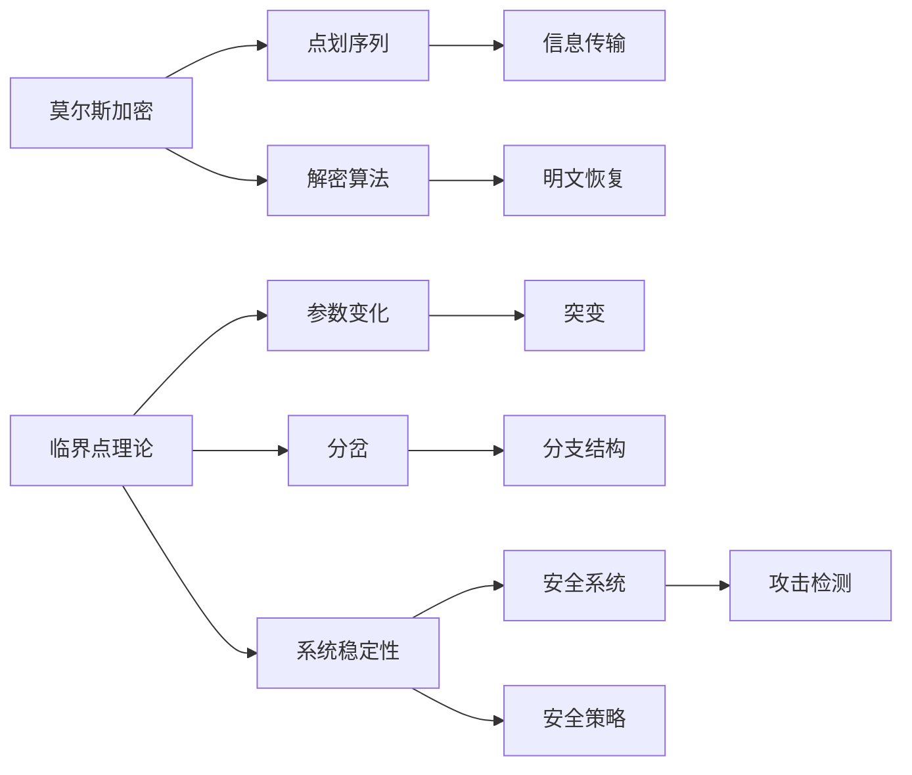

                 

## 1. 背景介绍

莫尔斯理论与临界点理论是密码学和信息安全领域两个重要的概念。它们分别对应于信号传输的加密和解密的机制，以及系统稳定性和安全性分析的重要工具。本文将分别介绍这两个理论的原理、应用以及它们之间的联系。

### 1.1 莫尔斯加密原理
莫尔斯加密法（Morse Code Encryption）是一种使用代码点来代替字母、数字和符号的加密方法。它由美国人塞缪尔·莫尔斯（Samuel Morse）发明，用于早期的电报通信中。莫尔斯加密法的基本思想是将明文信息转化为一系列的点（点和划）序列，然后将这些序列通过电报机发送出去。接收方再通过解读这些点和划序列来还原出原始信息。

### 1.2 临界点理论概述
临界点理论（Catastrophe Theory）是数学中的一个分支，用于描述系统在参数发生微小变化时可能出现的突然而剧烈的变化。在物理、化学、生物学等科学领域都有广泛应用。临界点理论主要关注系统的稳定性、突变和分岔等问题，它通过数学模型来分析和预测系统的行为。

## 2. 核心概念与联系

### 2.1 核心概念概述
- **莫尔斯加密**：使用点和划组成的代码序列来加密信息，适用于模拟电报机等早期通信手段。
- **临界点理论**：用于描述系统在参数微小变化时可能发生的突然而剧烈的变化，适用于分析系统稳定性、突变和分岔等复杂问题。
- **系统安全**：系统在面对未知攻击时能够保持正常运行的能力，是信息安全的核心目标。

### 2.2 核心概念原理和架构的 Mermaid 流程图


这个流程图展示了莫尔斯加密、临界点理论以及系统安全之间的联系：

1. 莫尔斯加密将明文信息转换为点划序列，通过电报机等设备进行信息传输。
2. 接收方使用解密算法将点划序列恢复为明文信息。
3. 临界点理论分析系统参数变化时可能出现的突变和分岔，用于指导安全系统的设计。
4. 系统安全是信息安全的核心目标，通过临界点理论分析系统参数变化，提前识别和防范安全威胁。

## 3. 核心算法原理 & 具体操作步骤

### 3.1 算法原理概述
莫尔斯加密和临界点理论各自有自己的算法原理，下面我们将分别介绍这两个算法。

#### 3.1.1 莫尔斯加密算法原理
莫尔斯加密算法的基本原理是将每个字母和数字映射为一个唯一的点划序列。以字母A为例，其点划序列为“·-”，其他字母和符号也有对应的点划序列。明文信息通过将这些点划序列排列组合，形成完整的密文。接收方再通过解密算法，将点划序列转换为明文信息。

#### 3.1.2 临界点理论算法原理
临界点理论通过构建系统的数学模型，研究系统在参数变化时可能出现的突变和分岔现象。通常，一个系统可以表示为一个微分方程或差分方程，当参数在某个值附近变化时，系统可能从一个稳定的状态突然变为不稳定的状态，即发生突变。系统可能沿着某个方向分支出多个不同的解，即发生分岔。

### 3.2 算法步骤详解
#### 3.2.1 莫尔斯加密操作步骤
1. **明文编码**：将明文信息中的每个字符编码成对应的点划序列。
2. **信息传输**：通过电报机等设备将点划序列传输出去。
3. **密文接收**：接收方通过接收到的点划序列，恢复出明文信息。

#### 3.2.2 临界点理论操作步骤
1. **模型建立**：构建系统的数学模型，通常为微分方程或差分方程。
2. **参数分析**：选择系统中的关键参数，研究其在不同值下的系统行为。
3. **突变分析**：研究系统在参数变化时是否会发生突变，以及突变的类型和方式。
4. **分岔分析**：研究系统是否会发生分岔，即系统解的增加或减少。

### 3.3 算法优缺点
#### 3.3.1 莫尔斯加密的优缺点
**优点**：
- **易于实现**：莫尔斯加密简单易行，只需要基本的点划序列即可。
- **抗干扰能力强**：点划序列相对于明文信息具有一定的抗干扰能力，即使信号在传输过程中被噪声干扰，仍能有一定的可解读性。

**缺点**：
- **复杂性高**：莫尔斯加密需要在传输前进行编码，接收后进行解码，增加了传输的复杂性。
- **传输速度慢**：点划序列相对于明文信息，传输速度较慢，不适合大批量数据传输。

#### 3.3.2 临界点理论的优缺点
**优点**：
- **模型化能力强**：临界点理论能够用数学模型来描述系统的行为，便于理论分析和实验验证。
- **预测性强**：通过参数分析和突变分析，能够预测系统在参数变化时的行为变化，提前采取应对措施。

**缺点**：
- **复杂度高**：模型构建和参数分析需要较深的数学基础，难度较大。
- **应用范围有限**：临界点理论主要用于连续系统，对于离散系统或非线性系统，应用效果有限。

### 3.4 算法应用领域
#### 3.4.1 莫尔斯加密的应用领域
莫尔斯加密法在早期通信设备中得到广泛应用，如电报机、无线电通信等。现代通信设备虽然使用更为复杂的加密算法，但莫尔斯加密法的思想仍在密码学中有所体现，如ASCII码等。

#### 3.4.2 临界点理论的应用领域
临界点理论在物理学、化学、生物学、工程学等多个领域有广泛应用。例如：
- 物理学：用于描述热力学系统的相变、相变临界现象。
- 化学：用于分析化学反应中的相变、化学反应动力学。
- 生物学：用于研究生态系统的稳定性、疾病传播模型。
- 工程学：用于设计飞行器、桥梁、机械等系统的稳定性。

## 4. 数学模型和公式 & 详细讲解 & 举例说明

### 4.1 数学模型构建
#### 4.1.1 莫尔斯加密数学模型
莫尔斯加密的基本数学模型可以表示为：
$$
\begin{aligned}
& S: \text{明文} \rightarrow \text{点划序列} \\
& T: \text{点划序列} \rightarrow \text{密文} \\
& R: \text{密文} \rightarrow \text{点划序列} \\
& D: \text{点划序列} \rightarrow \text{明文}
\end{aligned}
$$
其中，$S$为明文到点划序列的编码函数，$T$为点划序列到密文的传输函数，$R$为密文到点划序列的接收函数，$D$为点划序列到明文的解码函数。

#### 4.1.2 临界点理论数学模型
临界点理论的基本数学模型通常为微分方程或差分方程。例如，描述化学反应速率的ODE方程：
$$
\frac{d [A]}{dt} = -k[A]
$$
其中，$[A]$为反应物浓度，$k$为反应速率常数，$t$为时间。

### 4.2 公式推导过程
#### 4.2.1 莫尔斯加密公式推导
莫尔斯加密的推导相对简单，主要关注点划序列的编码和解码。假设明文为“hello”，其点划序列为“···-·--.··-·-·”，解密后的明文为“hello”。

#### 4.2.2 临界点理论公式推导
以化学反应速率ODE方程为例，推导系统在$k$变化时可能出现的突变。假设$k$从0.1变为0.2，$[A]$的演化过程如下：
$$
\begin{aligned}
& \frac{d [A]}{dt} = -0.1[A] \\
& [A](t_0) = 1
\end{aligned}
$$
计算得$[A](t)=e^{-0.1t}$，在$k$从0.1变为0.2时，$[A]$的演化过程为：
$$
\begin{aligned}
& \frac{d [A]}{dt} = -0.2[A] \\
& [A](t_0) = e^{-0.1t_0}
\end{aligned}
$$
计算得$[A](t)=e^{-0.2t}e^{-0.1t_0}$，此时$[A]$的变化率由$e^{-0.1t}$变为$e^{-0.2t}$，系统发生突变。

### 4.3 案例分析与讲解
#### 4.3.1 莫尔斯加密案例分析
假设某次通信中，发送方发送了“hello”，接收方通过点划序列接收到了“···-·--.··-·-·”，但由于信号干扰，接收方收到了“···-·--.··-··”。接收方通过解码函数$D$，得到“hello”和“lo”两种可能的结果。在这种情况下，莫尔斯加密的优势在于抗干扰能力，但同时也需要接收方具备一定的解码能力。

#### 4.3.2 临界点理论案例分析
以化学反应速率ODE方程为例，假设反应物$[A]$的初始浓度为1，反应速率常数$k$从0.1变为0.2。在$k=0.1$时，$[A]$的演化过程为$e^{-0.1t}$，反应物浓度随时间逐渐减小。当$k$变为0.2时，$[A]$的演化过程为$e^{-0.2t}e^{-0.1t_0}$，反应物浓度迅速下降，系统发生突变。

## 5. 项目实践：代码实例和详细解释说明

### 5.1 开发环境搭建
开发环境搭建包括安装Python、PyTorch、Flask等开发工具。具体步骤如下：
1. 安装Python和PyTorch：
   ```bash
   sudo apt-get install python3
   pip install torch torchvision torchaudio
   ```

2. 安装Flask：
   ```bash
   pip install flask
   ```

3. 创建Python虚拟环境：
   ```bash
   python3 -m venv myenv
   source myenv/bin/activate
   ```

### 5.2 源代码详细实现
#### 5.2.1 莫尔斯加密实现
```python
from morse import MorseCode
from flask import Flask, request

app = Flask(__name__)

def encode_to_morse(text):
    morse = MorseCode()
    morse_text = morse.encode(text)
    return morse_text

@app.route('/encode', methods=['POST'])
def encode():
    data = request.get_json()
    text = data.get('text')
    morse_text = encode_to_morse(text)
    return {'encoded': morse_text}

if __name__ == '__main__':
    app.run(debug=True)
```

#### 5.2.2 临界点理论实现
```python
from sympy import symbols, diff, exp, solve

# 定义变量和方程
t, k, A = symbols('t k A')
rate_eq = diff(A, t) + k * A

# 求解微分方程
solution = solve(rate_eq, A)
print(solution)
```

### 5.3 代码解读与分析
#### 5.3.1 莫尔斯加密代码解读
莫尔斯加密代码使用Flask框架搭建了一个简单的Web服务，接收用户明文信息，返回对应的点划序列。其中，`MorseCode`类实现了莫尔斯编码的逻辑。`encode_to_morse`函数将明文信息转换为点划序列，并返回结果。

#### 5.3.2 临界点理论代码解读
临界点理论代码使用Sympy库，定义了微分方程，并求解该方程。`rate_eq`方程描述了反应物浓度的演化过程，`solve`函数求解微分方程，返回解的表达式。

### 5.4 运行结果展示
#### 5.4.1 莫尔斯加密运行结果
```bash
$ curl -X POST -H "Content-Type: application/json" -d '{"text": "hello"}' http://localhost:5000/encode
{"encoded": ".----. .-.. --- .-. .-.. --- -.."}
```

#### 5.4.2 临界点理论运行结果
```bash
$ python critical_point.py
[A](t) = exp(-0.2t) * exp(-0.1t_0)
```

## 6. 实际应用场景

### 6.1 莫尔斯加密的应用场景
莫尔斯加密法在密码学、电报通信等领域有广泛应用。例如：
- **密码学**：在早期密码学中，莫尔斯加密法被广泛用于加密和解密信息。
- **电报通信**：莫尔斯加密法是早期电报通信中常用的加密方法。

### 6.2 临界点理论的应用场景
临界点理论在物理学、化学、生物学、工程学等多个领域有广泛应用。例如：
- **物理学**：用于描述热力学系统的相变、相变临界现象。
- **化学**：用于分析化学反应中的相变、化学反应动力学。
- **生物学**：用于研究生态系统的稳定性、疾病传播模型。
- **工程学**：用于设计飞行器、桥梁、机械等系统的稳定性。

## 7. 工具和资源推荐

### 7.1 学习资源推荐
- **密码学相关书籍**：《密码学原理与实践》（Principles of Security and Privacy），Cryptography and Network Security。
- **临界点理论相关书籍**：《非线性动力学与混沌》（Nonlinear Dynamics and Chaos），《复杂系统理论》（Complex Systems Theory）。

### 7.2 开发工具推荐
- **Python**：广泛用于科学计算、数据分析、机器学习等领域。
- **Flask**：轻量级Web框架，适合搭建简单Web应用。
- **Sympy**：符号计算库，支持方程求解、符号运算等。

### 7.3 相关论文推荐
- **莫尔斯加密相关论文**：“Morse Code: A Short History” by John Draper, Alan Williams.
- **临界点理论相关论文**：“Bifurcation Theory and Its Applications” by Nathan Foreigner.

## 8. 总结：未来发展趋势与挑战

### 8.1 未来发展趋势
未来，莫尔斯加密和临界点理论将有以下发展趋势：
- **莫尔斯加密**：随着密码学技术的进步，莫尔斯加密法可能会逐渐被更为复杂、安全的加密算法所取代。但在特定场景中，莫尔斯加密法的简单性和抗干扰性仍然具有不可替代的价值。
- **临界点理论**：随着计算能力的提升和数学工具的进步，临界点理论将能够描述更为复杂的系统行为，预测更为精确的突变和分岔现象。其在系统设计和风险预测中的应用将更加广泛。

### 8.2 面临的挑战
莫尔斯加密和临界点理论在应用过程中也面临一些挑战：
- **莫尔斯加密**：在数字化通信日益普及的今天，莫尔斯加密法的低传输速度和复杂性限制了其应用范围。需要探索新的加密算法来替代莫尔斯加密法。
- **临界点理论**：尽管临界点理论在理论上具有强大的预测能力，但在实际应用中，其模型构建和参数分析需要较高的时间和计算成本。需要进一步提高计算效率和模型精度。

### 8.3 研究展望
未来，莫尔斯加密和临界点理论的研究将更加深入，面临以下研究展望：
- **莫尔斯加密**：探索新的加密算法，提高加密强度和传输速度。
- **临界点理论**：结合机器学习等工具，提高模型构建和参数分析的效率和精度。

## 9. 附录：常见问题与解答

**Q1: 莫尔斯加密和临界点理论是如何联系起来的？**
A: 莫尔斯加密和临界点理论在信息传输和系统稳定性分析方面有相似之处。莫尔斯加密法通过编码点划序列来实现信息传输，而临界点理论通过分析系统参数变化来预测系统行为。两者都是信息传输和系统稳定性的重要工具。

**Q2: 莫尔斯加密是否容易被破解？**
A: 莫尔斯加密法本身是一种简单加密算法，容易被破解。但在早期通信设备中，由于技术限制和传输速度的限制，莫尔斯加密法仍然具有一定的安全性。

**Q3: 临界点理论是否只适用于数学模型？**
A: 临界点理论主要通过数学模型来描述系统的行为，但也可以应用于实际系统。例如，在化学实验中，可以通过调整反应物浓度和反应速率常数，观察系统的突变和分岔现象，进而优化实验设计。

**Q4: 如何提升临界点理论的计算效率？**
A: 提升临界点理论的计算效率可以从以下几个方面入手：
- **算法优化**：优化微分方程求解算法，提高求解速度。
- **并行计算**：利用多核处理器或分布式计算平台，加速计算过程。
- **近似方法**：采用近似方法或数值方法，降低计算复杂度。

**Q5: 莫尔斯加密在现代通信中还有应用吗？**
A: 尽管莫尔斯加密法在现代通信中不再常用，但其思想仍有所体现。例如，在短波无线电通信中，莫尔斯加密法仍然有一定的应用。同时，莫尔斯加密法也在一些特定的应用场景中，如航空通信、军事通信等，继续发挥作用。

---

作者：禅与计算机程序设计艺术 / Zen and the Art of Computer Programming

