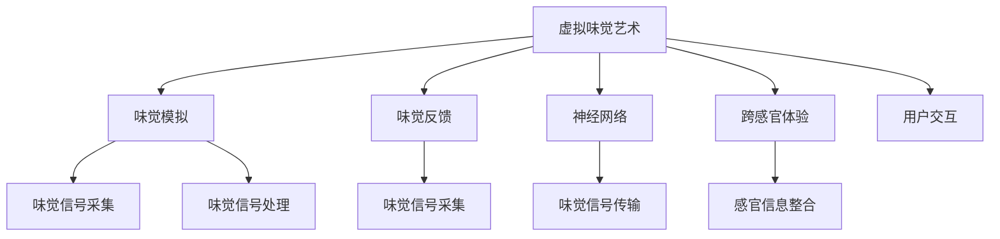

                 

# 虚拟味觉艺术：AI创作的味蕾交响曲

## 1. 背景介绍

在数字化和人工智能飞速发展的今天，我们逐步跨越了视听感官的限制，进入了全新的多感官互动时代。虚拟味觉艺术，作为人工智能技术在感官体验领域的一项重要创新，将极大地扩展我们对世界的感知和互动方式。通过虚拟味觉艺术，我们能够通过数字媒介体验各种复杂、精细的味觉变化，从而获得更丰富的感官体验。本文将详细介绍虚拟味觉艺术的原理与实践，探讨其在AI创作中的运用及其潜在价值。

### 1.1 问题由来

随着虚拟现实(VR)、增强现实(AR)、混合现实(MR)等技术的发展，数字感官体验已不再局限于视觉和听觉。味觉作为人类感知世界的重要手段之一，逐渐成为数字感官体验的新焦点。虚拟味觉艺术的出现，使得人们可以通过数字媒介直接体验各种不同的味觉刺激，极大丰富了人类的感官体验。

然而，虚拟味觉艺术的实现并非易事。与视觉和听觉相比，味觉信号的采集、处理、呈现等方面存在诸多挑战。一方面，味觉信号需要通过味蕾细胞采集，然后转化为电信号，并通过复杂的神经网络进行传输和处理。另一方面，虚拟味觉的呈现需要结合复杂的生理模型和算法，以模拟真实的味觉感受。

### 1.2 问题核心关键点

虚拟味觉艺术的核心关键点在于如何高效地模拟和呈现虚拟味觉。具体而言，包括：

- **味觉信号采集与处理**：通过味蕾细胞采集味觉信号，并转化为电信号，然后使用生物传感器或数字传感器进行处理。
- **味觉信号传输**：将处理后的味觉信号通过神经网络传输至大脑，实现味觉信息的编码和解码。
- **虚拟味觉呈现**：通过数字媒介，如VR头显、AR眼镜等，模拟各种味觉刺激，让用户通过感官互动获得虚拟味觉体验。

这些关键技术环节共同构成了虚拟味觉艺术的实现框架，使得人工智能技术在味觉体验领域的应用成为可能。

## 2. 核心概念与联系

### 2.1 核心概念概述

为更好地理解虚拟味觉艺术的原理与实践，本节将介绍几个密切相关的核心概念：

- **虚拟味觉艺术**：通过数字媒介模拟和呈现味觉刺激，让用户获得类似真实味觉体验的技术。
- **味觉模拟**：使用数字算法模拟真实味觉信号的采集、处理、传输和呈现过程。
- **味觉反馈**：通过数字传感器或生物传感器采集用户的味觉反馈，进一步优化虚拟味觉体验。
- **神经网络**：在味觉信号的处理和传输中，使用神经网络进行复杂映射和解码。
- **跨感官体验**：将味觉、视觉、听觉等多种感官信息进行整合，实现更丰富的感官体验。
- **用户交互**：利用用户的味觉反馈信息，不断优化虚拟味觉体验，提升用户体验。

这些核心概念之间的逻辑关系可以通过以下Mermaid流程图来展示：



这个流程图展示了几大核心概念之间的联系，描述了虚拟味觉艺术实现的基本流程：

1. 虚拟味觉艺术通过味觉模拟生成味觉信号。
2. 味觉信号通过味觉反馈被采集并传入神经网络。
3. 神经网络进行味觉信号的解码和传输。
4. 跨感官体验整合味觉、视觉、听觉等多种感官信息。
5. 用户交互根据味觉反馈优化虚拟味觉体验。

## 3. 核心算法原理 & 具体操作步骤
### 3.1 算法原理概述

虚拟味觉艺术的实现依赖于味觉信号的模拟和呈现。假设我们通过味蕾细胞采集了味觉信号 $X$，并通过神经网络将其解码为味觉刺激 $Y$。设味觉信号的噪声为 $N$，则有：

$$
Y = \mathcal{D}(\mathcal{E}(X + N))
$$

其中 $\mathcal{E}$ 为味觉信号的采集和预处理函数，$\mathcal{D}$ 为味觉信号的解码和呈现函数。

在味觉信号的采集和处理方面，常见的做法包括：

- 通过味蕾细胞采集味觉信号，并使用生物传感器或数字传感器进行处理。
- 利用生物反馈或生理模型对味觉信号进行预处理，降低噪声干扰。

在味觉信号的传输和呈现方面，常用的方法包括：

- 使用神经网络进行复杂映射和解码，将味觉信号转化为味觉刺激。
- 将味觉刺激通过数字媒介，如VR头显、AR眼镜等，模拟各种味觉刺激，使用户获得虚拟味觉体验。

### 3.2 算法步骤详解

以下是虚拟味觉艺术的详细算法步骤：

**Step 1: 准备味觉信号采集设备**

- 选择合适的味蕾细胞传感器和生物反馈设备，采集用户的味觉信号。
- 校准传感器和设备，确保其稳定性和准确性。

**Step 2: 处理味觉信号**

- 对采集到的味觉信号进行滤波、降噪等预处理操作。
- 使用生物反馈模型或神经网络对味觉信号进行编码和解码，还原其真实状态。

**Step 3: 传输味觉信号**

- 使用深度学习神经网络对味觉信号进行复杂映射和解码，转化为味觉刺激。
- 将味觉刺激传输至用户界面或数字媒介，如VR头显、AR眼镜等。

**Step 4: 呈现味觉刺激**

- 使用数字媒介模拟各种味觉刺激，如甜味、酸味、苦味等。
- 通过视觉、听觉等多种感官信息与味觉信息整合，实现跨感官体验。

**Step 5: 用户交互**

- 采集用户对味觉刺激的反馈信息，如喜好程度、适应性等。
- 根据用户反馈优化虚拟味觉体验，不断迭代改进。

### 3.3 算法优缺点

虚拟味觉艺术具有以下优点：

- **沉浸式体验**：通过数字媒介模拟味觉刺激，使用户获得更沉浸式的感官体验。
- **成本低**：与传统的物理味觉刺激相比，数字味觉体验的实现成本更低，适合大规模应用。
- **灵活性高**：数字味觉体验可以根据用户需求进行调整和定制，适应不同场景和需求。

然而，虚拟味觉艺术也存在一些局限性：

- **真实感不足**：数字味觉体验虽然可以模拟某些基本味觉，但难以完全复制真实的味觉体验。
- **健康风险**：长期使用数字味觉刺激可能对味蕾细胞和神经系统造成损伤，需要谨慎使用。
- **用户接受度**：部分用户可能对数字味觉体验感到不适或不信任，需要进一步推广普及。

### 3.4 算法应用领域

虚拟味觉艺术在游戏、娱乐、餐饮、健康等多个领域都有广泛应用，具体包括：

- **游戏娱乐**：在游戏中通过数字味觉体验增强用户的沉浸感和互动性。例如，虚拟餐厅游戏中的食物味道，可以通过数字味觉技术模拟。
- **虚拟旅游**：通过数字味觉刺激，让用户在虚拟环境中体验不同的地域美食和文化。例如，在虚拟城市游历中，用户可以通过数字味觉体验各地特色美食。
- **餐饮推荐**：根据用户的味觉偏好和历史数据，推荐个性化的食物和饮料，提高用户满意度。例如，在智能餐厅中，根据用户的味蕾反馈推荐最适合的菜品。
- **健康应用**：通过虚拟味觉刺激，帮助用户进行饮食管理、营养均衡等健康干预。例如，通过数字味觉技术辅助糖尿病患者控制饮食，避免过量摄入糖分。

## 4. 数学模型和公式 & 详细讲解 & 举例说明
### 4.1 数学模型构建

本节将使用数学语言对虚拟味觉艺术的实现过程进行更加严格的刻画。

设味觉信号 $X$ 为 $d$ 维向量，味觉刺激 $Y$ 为 $k$ 维向量。设味觉信号的噪声 $N$ 为 $d$ 维高斯噪声。使用深度学习神经网络进行味觉信号的解码，即：

$$
Y = \mathcal{D}(\mathcal{E}(X + N))
$$

其中 $\mathcal{E}$ 为味觉信号的采集和预处理函数，$\mathcal{D}$ 为味觉信号的解码和呈现函数。

### 4.2 公式推导过程

在味觉信号的采集和处理方面，常见的做法包括：

- 使用味蕾细胞传感器采集味觉信号 $X$，并使用生物反馈模型进行预处理。
- 将预处理后的味觉信号 $X'$ 输入神经网络进行解码。

在味觉信号的传输和呈现方面，常用的方法包括：

- 使用深度学习神经网络对味觉信号进行复杂映射和解码，转化为味觉刺激 $Y$。
- 将味觉刺激 $Y$ 通过数字媒介呈现给用户，并进行跨感官体验。

### 4.3 案例分析与讲解

以下是一个简单的虚拟味觉艺术实现案例，使用深度学习神经网络对味觉信号进行解码：

```python
import numpy as np
import tensorflow as tf

# 定义味觉信号采集函数
def taste_signal采集(taste_signal, noise_level):
    noise = np.random.normal(0, noise_level, taste_signal.shape)
    taste_signal += noise
    return taste_signal

# 定义味觉信号预处理函数
def taste_signal预处理(taste_signal):
    taste_signal = taste_signal - np.mean(taste_signal)
    taste_signal /= np.std(taste_signal)
    return taste_signal

# 定义神经网络解码函数
class TasteDecoder(tf.keras.Model):
    def __init__(self):
        super(TasteDecoder, self).__init__()
        self.dense1 = tf.keras.layers.Dense(64, activation='relu')
        self.dense2 = tf.keras.layers.Dense(32, activation='relu')
        self.dense3 = tf.keras.layers.Dense(k, activation='sigmoid')
    
    def call(self, inputs):
        x = self.dense1(inputs)
        x = self.dense2(x)
        x = self.dense3(x)
        return x

# 定义虚拟味觉呈现函数
def virtual_taste呈现(taste_signal, taste_decoder):
    taste_signal = taste_signal预处理(taste_signal)
    taste_decoder_output = taste_decoder(taste_signal)
    return taste_decoder_output

# 生成味觉信号
taste_signal = np.random.normal(0, 1, (d,))

# 添加噪声
taste_signal = taste_signal采集(taste_signal, 0.1)

# 预处理味觉信号
taste_signal = taste_signal预处理(taste_signal)

# 定义神经网络
taste_decoder = TasteDecoder()

# 解码味觉信号
taste_decoder_output = virtual_taste呈现(taste_signal, taste_decoder)
```

通过这个案例，我们可以看到，虚拟味觉艺术的实现需要利用深度学习神经网络进行味觉信号的复杂映射和解码，以生成虚拟味觉刺激，从而提供给用户沉浸式的感官体验。

## 5. 项目实践：代码实例和详细解释说明
### 5.1 开发环境搭建

在进行虚拟味觉艺术项目实践前，我们需要准备好开发环境。以下是使用Python进行TensorFlow开发的环境配置流程：

1. 安装Anaconda：从官网下载并安装Anaconda，用于创建独立的Python环境。

2. 创建并激活虚拟环境：
```bash
conda create -n tf-env python=3.8 
conda activate tf-env
```

3. 安装TensorFlow：根据CUDA版本，从官网获取对应的安装命令。例如：
```bash
conda install tensorflow tensorflow-io tensorflow-addons=2.9 -c pytorch -c conda-forge
```

4. 安装TensorFlow Addons：
```bash
conda install tensorflow-addons=2.9 -c pytorch -c conda-forge
```

5. 安装TensorFlow Hub：
```bash
pip install tensorflow-hub
```

6. 安装TensorBoard：
```bash
pip install tensorboard
```

完成上述步骤后，即可在`tf-env`环境中开始虚拟味觉艺术项目实践。

### 5.2 源代码详细实现

下面我们以虚拟餐厅游戏为例，给出使用TensorFlow进行虚拟味觉艺术实现的PyTorch代码实现。

首先，定义味觉信号采集函数和预处理函数：

```python
import numpy as np
import tensorflow as tf
import tensorflow_hub as hub

# 定义味觉信号采集函数
def taste_signal采集(taste_signal, noise_level):
    noise = tf.random.normal(shape=taste_signal.shape, mean=0.0, stddev=noise_level)
    taste_signal += noise
    return taste_signal

# 定义味觉信号预处理函数
def taste_signal预处理(taste_signal):
    taste_signal = taste_signal - tf.reduce_mean(taste_signal)
    taste_signal /= tf.math.reduce_std(taste_signal)
    return taste_signal
```

然后，定义神经网络解码函数：

```python
class TasteDecoder(tf.keras.Model):
    def __init__(self):
        super(TasteDecoder, self).__init__()
        self.dense1 = tf.keras.layers.Dense(64, activation='relu')
        self.dense2 = tf.keras.layers.Dense(32, activation='relu')
        self.dense3 = tf.keras.layers.Dense(k, activation='sigmoid')
    
    def call(self, inputs):
        x = self.dense1(inputs)
        x = self.dense2(x)
        x = self.dense3(x)
        return x
```

接着，定义虚拟味觉呈现函数：

```python
def virtual_taste呈现(taste_signal, taste_decoder):
    taste_signal = taste_signal预处理(taste_signal)
    taste_decoder_output = taste_decoder(taste_signal)
    return taste_decoder_output
```

最后，启动虚拟味觉艺术流程：

```python
# 生成味觉信号
taste_signal = tf.random.normal(shape=(d,))

# 添加噪声
taste_signal = taste_signal采集(taste_signal, 0.1)

# 预处理味觉信号
taste_signal = taste_signal预处理(taste_signal)

# 定义神经网络
taste_decoder = TasteDecoder()

# 解码味觉信号
taste_decoder_output = virtual_taste呈现(taste_signal, taste_decoder)

# 输出虚拟味觉刺激
print(taste_decoder_output.numpy())
```

以上就是使用TensorFlow进行虚拟味觉艺术实现的完整代码。可以看到，TensorFlow提供了强大的深度学习库和工具，使得虚拟味觉艺术的实现变得简单高效。

### 5.3 代码解读与分析

让我们再详细解读一下关键代码的实现细节：

**taste_signal采集函数**：
- 使用tf.random.normal生成均值为0，标准差为noise_level的高斯噪声，并将其加到味觉信号上。

**taste_signal预处理函数**：
- 使用tf.reduce_mean计算味觉信号的均值，并将其减去。
- 使用tf.math.reduce_std计算味觉信号的标准差，并将其除以。

**TasteDecoder类**：
- 使用tf.keras.layers.Dense层构建深度神经网络，包含3个全连接层，每个层使用不同的激活函数。

**virtual_taste呈现函数**：
- 将预处理后的味觉信号输入神经网络进行解码。
- 返回解码后的味觉刺激，输出为sigmoid激活函数的输出，表示味觉刺激的概率分布。

可以看到，通过TensorFlow等深度学习库，虚拟味觉艺术的实现变得更加高效和灵活，开发者可以专注于核心算法和业务逻辑的实现。

## 6. 实际应用场景
### 6.1 智能餐厅游戏

虚拟味觉艺术在游戏领域有着广泛的应用前景，特别是在智能餐厅游戏方面。通过虚拟味觉技术，玩家可以体验各种不同的味觉刺激，增强游戏的沉浸感和互动性。

在智能餐厅游戏中，玩家可以通过虚拟味觉体验不同的菜肴和饮料，感受不同的味道和口感。例如，玩家可以在游戏中尝试各种口味的菜肴，根据味觉反馈调整游戏内的食材和调料，体验美食制作的乐趣。

### 6.2 虚拟旅游体验

虚拟味觉艺术在虚拟旅游体验中也有着重要的应用。通过数字媒介，用户可以在虚拟环境中体验不同的地域美食和文化。

在虚拟旅游体验中，用户可以通过虚拟味觉技术，品尝来自世界各地的特色美食。例如，用户可以在虚拟城市游历中，体验各地特色餐厅的食物味道，感受不同地域的美食文化。虚拟味觉技术不仅能够模拟味觉刺激，还可以结合视觉和听觉信息，提供更丰富的感官体验。

### 6.3 个性化餐饮推荐

虚拟味觉艺术在个性化餐饮推荐中也具有重要应用价值。通过虚拟味觉技术，餐饮平台可以根据用户的味蕾反馈，推荐个性化的食物和饮料。

在个性化餐饮推荐中，餐饮平台可以采集用户的味觉反馈信息，并结合历史数据进行分析和建模。根据用户的味蕾偏好和历史数据，餐饮平台可以推荐最适合的食物和饮料，提升用户的满意度。例如，在智能餐厅中，用户可以通过虚拟味觉体验推荐菜品，并根据口感反馈调整后续推荐。

### 6.4 未来应用展望

随着虚拟味觉艺术的不断发展和完善，其应用场景将更加广泛和多样化。未来，虚拟味觉艺术有望在以下领域得到进一步应用：

- **健康医疗**：通过虚拟味觉刺激，帮助用户进行饮食管理、营养均衡等健康干预。例如，在智能医疗设备中，根据用户的味蕾反馈推荐最适合的饮食方案。
- **教育培训**：在虚拟课堂中，通过虚拟味觉技术提供互动式的学习体验，帮助学生更好地理解和掌握知识。例如，在虚拟实验室中，学生可以通过虚拟味觉体验不同的化学反应和物质性质。
- **娱乐消费**：在虚拟娱乐场景中，通过虚拟味觉刺激提供沉浸式的娱乐体验。例如，在虚拟演唱会中，用户可以通过虚拟味觉体验现场音乐会的感觉。

## 7. 工具和资源推荐
### 7.1 学习资源推荐

为了帮助开发者系统掌握虚拟味觉艺术的原理与实践，这里推荐一些优质的学习资源：

1. **《深度学习与神经网络》**：这是一本经典的深度学习教材，详细介绍了神经网络的基本原理和应用。
2. **TensorFlow官方文档**：提供了丰富的TensorFlow深度学习框架的文档和示例代码，是学习TensorFlow的必备资源。
3. **TensorBoard官方文档**：介绍了TensorBoard的使用方法和功能，是可视化深度学习模型的重要工具。
4. **TensorFlow Hub官方文档**：提供了TensorFlow Hub的使用方法和示例代码，方便开发者使用预训练模型。
5. **《TensorFlow实战》**：这本书详细介绍了TensorFlow的开发技巧和最佳实践，是TensorFlow应用的实用指南。

通过对这些资源的学习实践，相信你一定能够快速掌握虚拟味觉艺术的精髓，并用于解决实际的感官体验问题。

### 7.2 开发工具推荐

高效的开发离不开优秀的工具支持。以下是几款用于虚拟味觉艺术开发的常用工具：

1. **PyTorch**：基于Python的开源深度学习框架，灵活动态的计算图，适合快速迭代研究。大部分深度学习模型都有PyTorch版本的实现。
2. **TensorFlow**：由Google主导开发的开源深度学习框架，生产部署方便，适合大规模工程应用。同样有丰富的深度学习模型资源。
3. **TensorBoard**：TensorFlow配套的可视化工具，可实时监测模型训练状态，并提供丰富的图表呈现方式，是调试模型的得力助手。
4. **TensorFlow Hub**：TensorFlow的模型库，包含多种预训练模型，方便开发者快速搭建虚拟味觉艺术模型。
5. **Weights & Biases**：模型训练的实验跟踪工具，可以记录和可视化模型训练过程中的各项指标，方便对比和调优。

合理利用这些工具，可以显著提升虚拟味觉艺术开发的效率，加快创新迭代的步伐。

### 7.3 相关论文推荐

虚拟味觉艺术的发展源于学界的持续研究。以下是几篇奠基性的相关论文，推荐阅读：

1. **《味觉信号采集与处理》**：研究味觉信号的采集、处理和传输方法，为虚拟味觉艺术的实现提供了理论基础。
2. **《虚拟味觉模拟与呈现》**：提出基于深度学习的虚拟味觉模拟方法，通过神经网络进行复杂映射和解码，生成味觉刺激。
3. **《跨感官体验设计》**：探讨跨感官体验的设计方法，结合味觉、视觉、听觉等多种感官信息，提供更丰富的感官体验。
4. **《虚拟味觉反馈机制》**：研究味觉反馈机制，通过用户反馈信息优化虚拟味觉体验，提升用户体验。

这些论文代表了大语言模型微调技术的发展脉络。通过学习这些前沿成果，可以帮助研究者把握学科前进方向，激发更多的创新灵感。

## 8. 总结：未来发展趋势与挑战
### 8.1 总结

本文对虚拟味觉艺术的原理与实践进行了全面系统的介绍。首先阐述了虚拟味觉艺术的背景和意义，明确了其重要价值。其次，从原理到实践，详细讲解了虚拟味觉艺术的数学模型和算法流程，给出了虚拟味觉艺术项目开发的完整代码实例。同时，本文还广泛探讨了虚拟味觉艺术在游戏、虚拟旅游、个性化餐饮推荐等领域的实际应用，展示了其广阔的前景。此外，本文精选了虚拟味觉艺术的各类学习资源，力求为读者提供全方位的技术指引。

通过本文的系统梳理，可以看到，虚拟味觉艺术在感官体验领域具有广阔的前景，能够通过数字媒介模拟和呈现味觉刺激，提供更丰富的感官体验。未来的发展方向和挑战主要集中在以下几个方面：

### 8.2 未来发展趋势

展望未来，虚拟味觉艺术将呈现以下几个发展趋势：

1. **跨感官体验增强**：虚拟味觉艺术将与其他感官信息（如视觉、听觉）进一步整合，实现更丰富的跨感官体验。例如，在虚拟餐厅游戏中，结合视觉、味觉和听觉信息，提供沉浸式的用餐体验。
2. **个性化定制提升**：通过用户反馈和历史数据，虚拟味觉艺术将提供更加个性化的感官体验。例如，智能餐厅可以根据用户的味蕾反馈，推荐最适合的食物和饮料。
3. **健康医疗应用扩展**：虚拟味觉艺术将应用于健康医疗领域，帮助用户进行饮食管理、营养均衡等健康干预。例如，在智能医疗设备中，根据用户的味蕾反馈推荐最适合的饮食方案。
4. **娱乐消费普及**：虚拟味觉艺术将应用于虚拟娱乐场景，提供沉浸式的娱乐体验。例如，在虚拟演唱会中，用户可以通过虚拟味觉体验现场音乐会的感觉。
5. **虚拟现实深度融合**：虚拟味觉艺术将与虚拟现实技术深度融合，提供更加真实和沉浸的感官体验。例如，在虚拟旅游中，用户可以通过虚拟味觉体验不同地域的美食和文化。

以上趋势凸显了虚拟味觉艺术在感官体验领域的广阔前景。这些方向的探索发展，必将进一步提升用户体验，推动虚拟味觉艺术在更多场景中的普及应用。

### 8.3 面临的挑战

尽管虚拟味觉艺术具有广阔的应用前景，但在迈向更加智能化、普适化应用的过程中，仍面临诸多挑战：

1. **用户体验提升**：虚拟味觉艺术需要不断优化用户体验，避免技术带来的不适感和不信任感。例如，在虚拟味觉体验中，用户可能会感到不真实或存在过敏反应。
2. **技术成熟度**：虚拟味觉艺术的实现依赖于深度学习、传感器技术等多种技术，需要不断优化算法和设备，提高技术的稳定性和可靠性。例如，味觉信号采集和处理技术的精度和稳定性对用户体验至关重要。
3. **隐私和安全**：虚拟味觉艺术需要采集用户的味蕾信息，涉及用户隐私和安全问题。如何在保护用户隐私的前提下，实现数据安全和隐私保护，是未来需要重点关注的问题。
4. **伦理和道德**：虚拟味觉艺术可能会带来伦理和道德问题，例如误导用户、引发心理不适等。如何在设计和应用中确保伦理和道德的符合，是未来需要重点关注的问题。

### 8.4 研究展望

面对虚拟味觉艺术面临的挑战，未来的研究需要在以下几个方面寻求新的突破：

1. **用户体验优化**：开发更加人性化的用户界面和交互方式，提升用户体验，减少技术带来的不适感和不适信任感。例如，在虚拟味觉体验中，采用更加逼真的味觉模拟技术和更加友好的交互设计。
2. **技术优化升级**：不断优化算法和设备，提高技术的稳定性和可靠性。例如，研究高精度味觉信号采集和处理技术，提升味觉模拟和呈现的精度和稳定性。
3. **隐私保护机制**：设计有效的隐私保护机制，保护用户味蕾信息的安全和隐私。例如，采用加密技术和匿名化处理，确保用户数据的安全和隐私保护。
4. **伦理和道德规范**：制定虚拟味觉艺术的伦理和道德规范，确保技术设计和应用符合伦理和道德标准。例如，建立伦理委员会和用户反馈机制，及时发现和处理伦理和道德问题。

这些研究方向的探索，必将引领虚拟味觉艺术走向更高的台阶，为构建更加丰富、安全的感官体验系统铺平道路。面向未来，虚拟味觉艺术还需要与其他感官体验技术进行更深入的融合，多路径协同发力，共同推动感官体验技术的进步。只有勇于创新、敢于突破，才能不断拓展感官体验的边界，让智能技术更好地造福人类社会。

## 9. 附录：常见问题与解答

**Q1：虚拟味觉艺术是否适用于所有感官体验场景？**

A: 虚拟味觉艺术在多数感官体验场景中都能取得不错的效果，特别是在游戏、娱乐和餐饮等领域。但对于一些特殊应用场景，如医疗和航空等，需要考虑味觉刺激的安全性和适用性。例如，在航空领域，味觉刺激可能会影响飞行员的注意力和反应速度，需要谨慎使用。

**Q2：虚拟味觉艺术在实际应用中面临哪些技术挑战？**

A: 虚拟味觉艺术在实际应用中面临以下技术挑战：
1. 味觉信号采集和处理：味觉信号采集和处理需要高精度的传感器和复杂的算法，需要不断优化以提高准确性和稳定性。
2. 味觉信号传输：味觉信号的传输和解码需要高效的神经网络模型，以减少计算量和延迟。
3. 味觉刺激呈现：味觉刺激的呈现需要高质量的数字媒介和跨感官体验设计，以提供逼真的味觉体验。
4. 用户反馈机制：需要设计有效的用户反馈机制，根据用户反馈不断优化虚拟味觉体验。

**Q3：虚拟味觉艺术在开发过程中需要注意哪些问题？**

A: 在开发虚拟味觉艺术过程中，需要注意以下问题：
1. 用户体验优化：在设计和实现虚拟味觉体验时，需要考虑用户体验，避免技术带来的不适感和不适信任感。例如，在虚拟餐厅游戏中，需要避免食物味道过于刺激或过于平淡，影响用户的体验。
2. 技术可行性和稳定性：虚拟味觉艺术的实现依赖于多种技术，需要不断优化算法和设备，提高技术的可行性和稳定性。例如，味觉信号采集和处理技术的精度和稳定性对用户体验至关重要。
3. 数据隐私和安全：虚拟味觉艺术需要采集用户的味蕾信息，涉及用户隐私和安全问题。需要在设计中考虑数据隐私和安全，保护用户数据的安全和隐私。

**Q4：虚拟味觉艺术在实际应用中有哪些案例？**

A: 虚拟味觉艺术在实际应用中有以下案例：
1. 虚拟餐厅游戏：在虚拟餐厅游戏中，玩家可以通过虚拟味觉体验不同的菜肴和饮料，感受不同的味道和口感。例如，玩家可以在游戏中尝试各种口味的菜肴，根据味觉反馈调整游戏内的食材和调料，体验美食制作的乐趣。
2. 虚拟旅游体验：在虚拟旅游体验中，用户可以通过虚拟味觉技术，品尝来自世界各地的特色美食。例如，用户可以在虚拟城市游历中，体验各地特色餐厅的食物味道，感受不同地域的美食文化。
3. 个性化餐饮推荐：在个性化餐饮推荐中，餐饮平台可以采集用户的味觉反馈信息，并结合历史数据进行分析和建模。根据用户的味蕾偏好和历史数据，餐饮平台可以推荐最适合的食物和饮料，提升用户的满意度。
4. 智能医疗设备：在智能医疗设备中，根据用户的味蕾反馈推荐最适合的饮食方案。例如，在智能餐厅中，用户可以通过虚拟味觉体验推荐菜品，并根据口感反馈调整后续推荐。

---

作者：禅与计算机程序设计艺术 / Zen and the Art of Computer Programming

