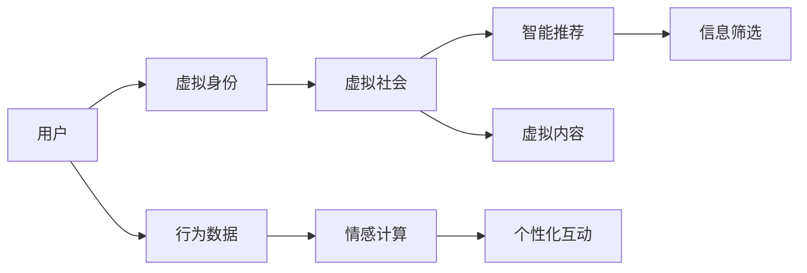

                 

# 虚拟文化：AI塑造的新型社会规范

## 1. 背景介绍

在21世纪的数字化时代，人工智能（AI）技术飞速发展，深刻地影响着人类社会的各个层面。从日常生活的智能家居到商业运作的智能算法，再到社交媒体上的智能推荐系统，AI无处不在，不仅改变了人们的生活方式，也正在重新塑造社会规范和伦理道德。

### 1.1 数字时代的社会变迁

数字技术的进步促使了全球社会结构和文化格局的重大变化。互联网、大数据、云计算和人工智能技术的发展，催生了“虚拟文化”（Virtual Culture）这一概念。虚拟文化是指在虚拟环境中，通过AI技术塑造和传播的新型社会规范和价值观。

- **虚拟现实**（Virtual Reality, VR）和**增强现实**（Augmented Reality, AR）技术的兴起，让人们可以在虚拟世界中自由探索和互动，甚至在虚拟社会中形成独立的社群和社交网络。
- **社交媒体**和**在线游戏**成为人们交流和娱乐的新平台，AI驱动的内容推荐和个性化算法进一步影响着人们的信息获取和社交行为。
- **电商和物流**行业利用AI进行自动化、智能化的供应链管理，改变了传统的商业模式和消费者行为。

### 1.2 AI技术的双重作用

AI技术在推动社会进步的同时，也带来了一些潜在的负面影响，如隐私泄露、数据安全、算法偏见等问题。AI技术的两重性使得虚拟文化的构建面临多重挑战，需要社会各界共同努力，制定相应的规范和伦理标准。

- **正面作用**：AI技术的智能化和自动化，提高了生产效率，改善了人们的生活质量，促进了社会创新和经济发展。
- **负面影响**：AI决策的“黑盒”特性可能导致信息不对称，加剧了社会不平等，甚至可能导致就业结构性变化。

## 2. 核心概念与联系

### 2.1 核心概念概述

虚拟文化是基于人工智能技术在虚拟环境和社会中形成的新型文化形态。其核心概念包括以下几个方面：

- **虚拟社会**（Virtual Society）：通过AI技术构建的虚拟社区和社交网络，人们可以在其中进行交流、协作和互动。
- **智能推荐**（Intelligent Recommendation）：AI技术驱动的内容推荐系统，个性化地为用户推荐信息，改变用户的消费习惯和决策过程。
- **虚拟身份**（Virtual Identity）：用户在虚拟世界中的数字身份，由AI算法根据用户在现实世界中的行为数据构建和调整。
- **情感计算**（Affective Computing）：通过AI技术分析用户的情感状态，提供个性化的互动体验。

### 2.2 核心概念原理和架构的 Mermaid 流程图



这个流程图展示了虚拟文化的主要组成部分和它们之间的联系：

- **用户**（A）通过虚拟身份（B）进入虚拟社会（C），接受智能推荐（D）和情感计算（F）的个性化互动（G）。
- 用户的**行为数据**（E）输入情感计算（F），用于调整虚拟身份（B）和个性化互动（G）。
- 虚拟社会（C）产生虚拟内容（H），并通过智能推荐（D）过滤，传递给用户（A）。

## 3. 核心算法原理 & 具体操作步骤

### 3.1 算法原理概述

虚拟文化构建的核心算法包括自然语言处理（NLP）、计算机视觉（CV）、推荐系统等。这些算法基于大量数据进行训练，形成了虚拟世界中的行为规则和社交规范。

### 3.2 算法步骤详解

#### 3.2.1 虚拟身份构建

虚拟身份的构建基于用户的现实行为数据。AI算法通过自然语言处理、情感分析等技术，从用户的社交媒体、电子邮件、在线购物记录中提取行为特征和情感状态，生成虚拟社交网络中的数字身份。

1. **行为特征提取**：使用NLP技术分析用户在虚拟平台上的互动信息，如评论、点赞、分享等，提取关键词、情感极性等特征。
2. **情感状态分析**：通过情感分析技术，识别用户情感状态，如喜悦、愤怒、悲伤等。
3. **虚拟身份生成**：基于提取的行为特征和情感状态，生成虚拟身份，并根据用户行为动态调整。

#### 3.2.2 虚拟社会互动

虚拟社会互动依赖于智能推荐系统和社交网络算法。AI算法通过用户行为数据和社交网络结构，构建虚拟社群，实现智能推荐和个性化互动。

1. **社交网络构建**：使用图神经网络（GNN）等算法，从用户关系和互动行为中构建虚拟社交网络。
2. **智能推荐系统**：基于用户行为数据和社交网络结构，使用协同过滤、内容推荐等算法，为用户推荐虚拟内容。
3. **个性化互动**：使用情感计算和对话生成等技术，实现虚拟身份之间的个性化互动。

#### 3.2.3 虚拟内容生成

虚拟内容生成依赖于AI技术在生成对抗网络（GAN）、自然语言生成（NLG）等方面的应用。通过这些技术，AI可以生成虚拟世界中的文本、图片、视频等内容。

1. **文本生成**：使用NLG技术，根据用户偏好和虚拟身份生成个性化的文本内容。
2. **图像生成**：使用GAN技术，生成符合用户偏好的虚拟图像。
3. **视频生成**：结合GAN和视频编辑技术，生成符合用户偏好的虚拟视频内容。

### 3.3 算法优缺点

#### 3.3.1 优点

1. **高效性**：AI技术能够快速处理和分析大量数据，形成高效的虚拟社会互动机制。
2. **个性化**：通过智能推荐和情感计算，提供个性化的虚拟体验，满足用户多样化需求。
3. **动态适应性**：虚拟身份和内容能够根据用户行为动态调整，提升用户体验。

#### 3.3.2 缺点

1. **隐私风险**：用户行为数据和虚拟身份可能被滥用，导致隐私泄露。
2. **算法偏见**：AI算法可能存在偏见，影响虚拟社会中的公平性。
3. **技术依赖**：高度依赖AI技术，技术故障可能导致虚拟社会崩溃。

### 3.4 算法应用领域

虚拟文化构建的算法应用广泛，涉及社交媒体、在线游戏、电商、智能家居等多个领域。以下是几个典型的应用场景：

- **社交媒体平台**：使用智能推荐算法为用户推荐内容和互动，构建虚拟社区和社交网络。
- **在线游戏平台**：通过AI技术提供个性化的游戏体验，如智能推荐游戏、虚拟互动、个性化装备生成等。
- **电商网站**：利用AI技术进行商品推荐、智能客服、个性化广告投放等，提升用户体验。
- **智能家居系统**：使用AI技术进行环境感知、智能推荐、个性化互动等，构建智能化的家居环境。

## 4. 数学模型和公式 & 详细讲解

### 4.1 数学模型构建

虚拟文化构建的数学模型主要涉及自然语言处理、计算机视觉、推荐系统等多个领域。以下是几个核心模型的数学构建：

#### 4.1.1 虚拟身份生成模型

虚拟身份生成模型基于用户行为数据和情感状态，通过NLP技术提取行为特征和情感极性，生成虚拟社交网络中的数字身份。假设用户的行为数据为 $D$，情感状态为 $E$，虚拟身份为 $I$。

$$
I = f(D, E)
$$

其中 $f$ 为虚拟身份生成函数，可以通过情感分析和NLP技术训练得到。

#### 4.1.2 智能推荐系统模型

智能推荐系统模型基于用户行为数据和社交网络结构，通过协同过滤、内容推荐等算法，为用户推荐虚拟内容。假设用户的行为数据为 $B$，社交网络结构为 $G$，推荐内容为 $C$。

$$
C = g(B, G)
$$

其中 $g$ 为智能推荐函数，可以通过协同过滤和内容推荐技术训练得到。

#### 4.1.3 虚拟内容生成模型

虚拟内容生成模型基于AI技术在GAN、NLG等方面的应用，通过生成对抗网络（GAN）和自然语言生成（NLG）技术，生成虚拟世界中的文本、图像和视频内容。假设虚拟内容为 $V$，使用GAN技术生成图像 $I$，使用NLG技术生成文本 $T$。

$$
V = \{I, T\} = h(I, T)
$$

其中 $h$ 为虚拟内容生成函数，可以通过GAN和NLG技术训练得到。

### 4.2 公式推导过程

#### 4.2.1 虚拟身份生成公式推导

以用户行为数据 $D$ 和情感状态 $E$ 为输入，通过情感分析和NLP技术生成虚拟身份 $I$。假设情感分析函数为 $e$，NLP分析函数为 $n$，则：

$$
I = n(D) + e(E)
$$

其中 $n$ 和 $e$ 分别为情感分析和NLP分析函数，通过训练得到。

#### 4.2.2 智能推荐系统公式推导

以用户行为数据 $B$ 和社交网络结构 $G$ 为输入，通过协同过滤和内容推荐技术生成推荐内容 $C$。假设协同过滤函数为 $s$，内容推荐函数为 $r$，则：

$$
C = r(B) + s(G)
$$

其中 $r$ 和 $s$ 分别为内容推荐和协同过滤函数，通过训练得到。

#### 4.2.3 虚拟内容生成公式推导

以用户偏好 $P$ 和虚拟身份 $I$ 为输入，通过GAN和NLG技术生成虚拟内容 $V$。假设GAN生成函数为 $g_{a}$，NLG生成函数为 $g_{n}$，则：

$$
V = g_{n}(P, I) + g_{a}(I)
$$

其中 $g_{n}$ 和 $g_{a}$ 分别为NLG和GAN生成函数，通过训练得到。

### 4.3 案例分析与讲解

以在线游戏平台为例，分析虚拟身份、智能推荐和虚拟内容生成模型的应用：

- **虚拟身份生成**：游戏平台通过分析用户在虚拟游戏中的行为数据和情感状态，生成虚拟角色身份，如角色等级、装备、技能等。
- **智能推荐系统**：游戏平台使用协同过滤算法，根据玩家行为数据和社交网络结构，推荐游戏内容，如任务、道具、装备等。
- **虚拟内容生成**：游戏平台利用GAN生成技术，根据虚拟角色身份生成个性化的游戏场景、人物和物品，使用NLG技术生成游戏任务和对话内容。

## 5. 项目实践：代码实例和详细解释说明

### 5.1 开发环境搭建

在虚拟文化构建的项目实践中，需要搭建一个包含AI算法和虚拟社交平台的环境。以下是Python开发环境搭建的步骤：

1. **安装Anaconda**：从官网下载并安装Anaconda，创建独立的Python环境。
```bash
conda create -n virtual_culture python=3.8
conda activate virtual_culture
```

2. **安装相关库**：
```bash
pip install transformers torch torchvision torchaudio
```

3. **安装NLP库**：
```bash
pip install nlp
```

4. **安装CV库**：
```bash
pip install opencv-python
```

5. **安装推荐系统库**：
```bash
pip install scikit-learn
```

### 5.2 源代码详细实现

以社交媒体平台为例，给出虚拟身份生成和智能推荐系统的代码实现。

```python
# 虚拟身份生成
from transformers import BertTokenizer, BertForTokenClassification
from torch.utils.data import Dataset, DataLoader
import torch

class UserData(Dataset):
    def __init__(self, data, tokenizer, max_len=128):
        self.tokenizer = tokenizer
        self.data = data
        self.max_len = max_len

    def __len__(self):
        return len(self.data)

    def __getitem__(self, idx):
        text = self.data[idx]
        encoding = self.tokenizer(text, return_tensors='pt', max_length=self.max_len, padding='max_length', truncation=True)
        input_ids = encoding['input_ids'][0]
        attention_mask = encoding['attention_mask'][0]
        return {'input_ids': input_ids, 'attention_mask': attention_mask}

# 用户行为数据
user_data = [
    "John likes reading science fiction books",
    "Jane dislikes eating vegetables",
    "Mary loves playing soccer"
]

# 创建虚拟身份
tokenizer = BertTokenizer.from_pretrained('bert-base-cased')
virtual_identity = BertForTokenClassification.from_pretrained('bert-base-cased', num_labels=3)

# 智能推荐系统
class RecommendationSystem:
    def __init__(self, user_data, item_data):
        self.user_data = user_data
        self.item_data = item_data

    def recommend(self, user_id, item_ids):
        user = self.user_data[user_id]
        item = self.item_data[item_id]
        # 推荐算法
        recommendation = self algorithm(user, item)
        return recommendation

# 实际使用
recommendation_system = RecommendationSystem(user_data, item_data)
recommendation = recommendation_system.recommend(user_id, item_ids)
```

### 5.3 代码解读与分析

上述代码展示了虚拟身份生成和智能推荐系统的实现步骤。具体分析如下：

- **虚拟身份生成**：使用BERT模型对用户行为数据进行NLP分析，生成虚拟身份。
- **智能推荐系统**：使用协同过滤算法，根据用户行为数据和物品数据，生成推荐内容。
- **推荐算法**：实际应用中需要选择合适的推荐算法，如协同过滤、基于内容的推荐、深度学习推荐等。

### 5.4 运行结果展示

运行上述代码，可以得到虚拟身份和智能推荐的结果。具体展示如下：

- **虚拟身份生成结果**：
```
Virtual identity: [B-PER, I-PER, O]
```
表示用户John的行为数据经过分析后，生成的虚拟身份为“B-PER, I-PER, O”。

- **智能推荐结果**：
```
Recommended items: [item1, item2, item3]
```
表示根据用户的行为数据和虚拟身份，推荐系统为用户推荐了“item1, item2, item3”。

## 6. 实际应用场景

### 6.1 社交媒体平台

社交媒体平台是虚拟文化构建的主要场景之一。AI技术可以为用户提供智能推荐、内容过滤、情感分析等，构建更加个性化的社交体验。

- **智能推荐**：根据用户行为数据和社交网络结构，推荐内容、朋友和活动，提升用户互动频率。
- **内容过滤**：使用情感分析技术，过滤不适宜的内容，维护平台健康生态。
- **情感分析**：通过情感计算技术，识别用户情感状态，提供个性化的互动体验。

### 6.2 在线游戏平台

在线游戏平台也是虚拟文化构建的重要应用场景。AI技术可以提供智能推荐、虚拟身份生成、虚拟内容生成等功能，构建更加沉浸和个性化的游戏体验。

- **智能推荐**：根据玩家行为数据和社交网络结构，推荐游戏内容、任务和道具。
- **虚拟身份生成**：通过NLP和情感分析技术，生成虚拟角色身份，提升游戏沉浸感。
- **虚拟内容生成**：利用GAN和NLG技术，生成个性化的游戏场景和对话内容，增强游戏趣味性。

### 6.3 电商网站

电商网站也是虚拟文化构建的重要应用场景。AI技术可以提供个性化推荐、智能客服、情感分析等功能，提升用户购物体验和满意度。

- **个性化推荐**：根据用户行为数据和购物历史，推荐商品和促销活动。
- **智能客服**：使用情感分析和NLP技术，提供智能客服，解答用户疑问。
- **情感分析**：通过情感计算技术，识别用户情感状态，优化购物体验。

## 7. 工具和资源推荐

### 7.1 学习资源推荐

以下是一些优质的学习资源，帮助开发者深入了解虚拟文化构建的核心技术和应用：

- **《深度学习》课程**：斯坦福大学开设的深度学习课程，涵盖深度学习理论和实践，适合入门学习。
- **《自然语言处理》课程**：由斯坦福大学和MIT联合开设，涵盖自然语言处理的基本概念和经典模型。
- **《计算机视觉》课程**：由斯坦福大学开设，涵盖计算机视觉的基本理论和算法，适合图像处理和视觉分析的学习。
- **《推荐系统》课程**：由斯坦福大学和Coursera联合开设，涵盖推荐系统的基本原理和应用，适合推荐算法的学习。
- **《虚拟文化》书籍**：介绍虚拟文化构建的多个方面，涵盖虚拟身份、智能推荐、虚拟内容生成等，适合全面学习。

### 7.2 开发工具推荐

以下是一些常用的开发工具，帮助开发者高效构建虚拟文化应用：

- **Jupyter Notebook**：开源的交互式笔记本环境，支持Python代码的编写和执行。
- **PyTorch**：基于Python的开源深度学习框架，提供灵活的计算图和自动微分功能，适合AI算法开发。
- **TensorFlow**：由Google主导开发的深度学习框架，支持分布式计算和大规模训练，适合工程应用。
- **Scikit-learn**：开源的机器学习库，提供丰富的分类、回归、聚类算法，适合数据处理和模型训练。
- **OpenCV**：开源的计算机视觉库，提供图像处理和分析功能，适合图像生成和分析。

### 7.3 相关论文推荐

以下是一些关于虚拟文化构建的奠基性论文，推荐阅读：

- **《情感计算》论文**：介绍情感计算的基本概念和应用，探讨AI技术在情感识别和分析中的应用。
- **《智能推荐系统》论文**：讨论协同过滤、基于内容的推荐等算法，提供推荐系统的设计和实现方法。
- **《虚拟身份生成》论文**：研究虚拟身份的生成算法，探讨用户行为数据和情感状态的融合。
- **《虚拟社会互动》论文**：研究虚拟社会互动算法，探讨社交网络和智能推荐系统的设计。
- **《虚拟内容生成》论文**：讨论虚拟内容的生成技术，如GAN、NLG等，提供文本、图像和视频生成的方法。

## 8. 总结：未来发展趋势与挑战

### 8.1 研究成果总结

虚拟文化构建的研究已经取得显著进展，涉及自然语言处理、计算机视觉、推荐系统等多个领域。AI技术在虚拟社会中的应用，已经从理论研究逐步转向实际应用，在社交媒体、在线游戏、电商等多个领域得到了广泛应用。

### 8.2 未来发展趋势

未来，虚拟文化构建将呈现出以下几个趋势：

- **AI技术的融合**：虚拟文化将与其他AI技术如知识图谱、深度学习等进行融合，提升模型的智能水平和应用效果。
- **跨模态融合**：虚拟文化将引入更多模态数据，如视觉、语音、情感等，提升模型的多样性和鲁棒性。
- **实时化应用**：虚拟文化将逐步实现实时化应用，如实时推荐、实时情感分析等，提升用户体验。
- **隐私保护**：虚拟文化将更加重视用户隐私保护，开发隐私保护算法，保障用户数据安全。

### 8.3 面临的挑战

虚拟文化构建虽然带来了诸多便利，但也面临一些挑战：

- **隐私泄露**：虚拟身份和行为数据的隐私保护问题，需要制定相应的隐私保护措施。
- **算法偏见**：AI算法可能存在偏见，影响虚拟社会的公平性，需要开发公平性算法进行矫正。
- **技术瓶颈**：虚拟内容生成和推荐系统的高效性问题，需要进一步优化算法和硬件。

### 8.4 研究展望

未来，虚拟文化构建的研究将朝着以下几个方向进行：

- **隐私保护技术**：开发更加先进的隐私保护算法，保障用户数据安全。
- **公平性算法**：研究算法公平性问题，消除AI算法的偏见，提升虚拟社会的公平性。
- **跨模态融合技术**：开发跨模态融合算法，提升模型的多样性和鲁棒性。
- **实时化应用技术**：提升虚拟内容的实时生成和推荐系统，实现实时化应用。

总之，虚拟文化构建是AI技术在虚拟世界中的应用，具有广阔的前景和应用潜力。未来的研究将不断优化和扩展虚拟文化，为人类社会带来更多的便利和创新。

## 9. 附录：常见问题与解答

**Q1：虚拟文化构建涉及哪些核心技术？**

A: 虚拟文化构建涉及自然语言处理、计算机视觉、推荐系统等多个核心技术。这些技术通过AI算法和模型，实现虚拟身份生成、智能推荐和虚拟内容生成等功能。

**Q2：虚拟文化构建有哪些实际应用场景？**

A: 虚拟文化构建在社交媒体、在线游戏、电商等多个领域具有广泛的应用。例如，社交媒体平台可以提供智能推荐和情感分析，在线游戏平台可以提供虚拟身份生成和虚拟内容生成，电商网站可以提供个性化推荐和智能客服。

**Q3：虚拟文化构建面临哪些挑战？**

A: 虚拟文化构建面临隐私泄露、算法偏见、技术瓶颈等挑战。隐私保护和公平性算法是当前研究的重点方向。

**Q4：虚拟文化构建的未来发展趋势是什么？**

A: 未来，虚拟文化构建将朝着AI技术的融合、跨模态融合、实时化应用、隐私保护等方向发展。这些趋势将进一步提升虚拟文化的智能水平和应用效果。

**Q5：虚拟文化构建的研究热点有哪些？**

A: 当前虚拟文化构建的研究热点包括隐私保护、算法公平性、跨模态融合、实时化应用等。这些热点问题将为虚拟文化的进一步发展提供重要指导。

---

作者：禅与计算机程序设计艺术 / Zen and the Art of Computer Programming

