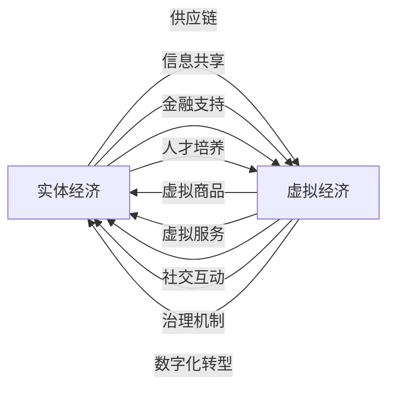

                 

# 虚拟经济与实体经济：元宇宙时代的双轨并行

## 1. 背景介绍

随着数字科技的迅猛发展，虚拟经济与实体经济之间的关系变得愈发复杂。特别是随着元宇宙时代的到来，虚拟经济与实体经济的融合进一步加深，呈现出多维、动态、互动的特点。在这样的背景下，理解虚拟经济与实体经济的相互作用、双轨并行的发展趋势，对于把握未来的经济社会发展方向具有重要意义。本文将围绕虚拟经济与实体经济的概念、元宇宙时代的特点，以及二者的互动关系展开探讨。

## 2. 核心概念与联系

### 2.1 核心概念概述

- **虚拟经济**：指与虚拟空间、数字资产相关的经济活动，包括网络游戏、虚拟地产、数字货币等。虚拟经济以信息技术和互联网为支撑，具有虚拟性、流动性、波动性等特点。

- **实体经济**：指以物质生产为核心的传统经济活动，包括制造业、农业、服务业等。实体经济以实际资源和人力资本为基础，具有稳定性、实在性、可触摸性等特点。

- **元宇宙**：指通过虚拟现实(VR)、增强现实(AR)、人工智能(AI)、区块链等技术构建的虚拟空间，实现数字资产、虚拟商品、社交活动等多维化的经济活动。元宇宙时代强调虚拟与现实的深度融合，突破了传统虚拟经济的边界。

### 2.2 核心概念原理和架构的 Mermaid 流程图



**实体经济与虚拟经济的联系**：

- **供应链协同**：实体经济通过虚拟平台实现供应链的数字化管理，提升物流效率。
- **信息共享**：实体企业借助数字化工具，在虚拟空间内实现信息透明、数据共享。
- **金融支持**：虚拟资产通过区块链技术，获得金融机构的融资和投资支持。
- **人才培养**：虚拟培训和教育平台为实体经济培养新型人才。
- **虚拟商品和服务**：虚拟商品通过增强现实等技术，融入实体经济的生产和消费环节。
- **社交互动**：虚拟社交平台为实体经济提供客户关系管理和市场推广渠道。
- **治理机制**：虚拟治理平台为实体经济提供政策制定和执行的参考。
- **数字化转型**：实体经济通过数字化改造，实现智能化升级。

### 2.3 核心概念之间的作用机制

**作用机制**：

- **信息流**：虚拟经济和实体经济通过信息流实现了数据互通和共享，提升了资源配置效率。
- **资金流**：虚拟资产通过金融渠道为实体经济提供资金支持，促进了资本的流动。
- **人才流**：虚拟教育和培训为实体经济输送了大量新型人才，提升了人力资本水平。
- **物流**：虚拟平台优化了实体经济的供应链管理，降低了物流成本。

## 3. 核心算法原理 & 具体操作步骤

### 3.1 算法原理概述

虚拟经济与实体经济的互动关系，可以通过数学模型进行建模分析。假设虚拟经济为 $V$，实体经济为 $R$，二者的互动关系可以用函数 $f(V, R)$ 表示。该函数反映虚拟经济和实体经济的动态变化和相互作用。

- **输入**：虚拟经济 $V$ 和实体经济 $R$ 的当前状态。
- **输出**：虚拟经济和实体经济的未来状态 $V'$ 和 $R'$。

数学模型可以简化为：

$$
V', R' = f(V, R)
$$

### 3.2 算法步骤详解

1. **数据收集**：收集虚拟经济和实体经济的相关数据，包括市场规模、用户行为、经济指标等。
2. **模型构建**：根据实际问题选择合适的模型，如时间序列分析、优化模型、博弈模型等。
3. **参数设定**：确定模型中的关键参数，如学习率、初始权重等。
4. **模型训练**：使用历史数据对模型进行训练，优化参数。
5. **预测分析**：使用训练好的模型对未来趋势进行预测和分析。

### 3.3 算法优缺点

**算法优点**：

- **数据驱动**：模型能够根据历史数据进行动态调整，适应现实世界的变化。
- **多维度分析**：能够综合考虑虚拟经济和实体经济的多个影响因素，提供全面的分析视角。
- **预测能力**：通过模型可以预测虚拟经济与实体经济的发展趋势，为决策提供依据。

**算法缺点**：

- **数据复杂性**：虚拟经济和实体经济的数据复杂多样，模型需要处理大量非结构化数据。
- **参数设定困难**：模型的性能高度依赖于参数设定，设定不当可能导致模型失效。
- **动态性**：虚拟经济和实体经济的动态变化难以精确建模，模型可能存在预测偏差。

### 3.4 算法应用领域

虚拟经济与实体经济的互动关系模型，可以应用于多个领域：

- **金融市场分析**：分析虚拟资产与实体经济之间的资金流动和价格波动。
- **供应链管理**：优化实体经济的供应链，提升物流效率。
- **政策制定**：为政府制定虚拟经济和实体经济协同发展的政策提供数据支持。
- **企业战略**：帮助企业制定虚拟化战略，增强市场竞争力。

## 4. 数学模型和公式 & 详细讲解

### 4.1 数学模型构建

假设虚拟经济 $V$ 和实体经济 $R$ 分别由两个变量 $v_1, v_2$ 和 $r_1, r_2$ 表示，其中 $v_1$ 表示虚拟商品市场规模，$v_2$ 表示虚拟资产价格，$r_1$ 表示制造业产值，$r_2$ 表示消费支出。

数学模型可以表示为：

$$
V' = \alpha_1 V + \alpha_2 R + \beta_1 t + \epsilon_1
$$

$$
R' = \gamma_1 R + \gamma_2 V + \delta_1 t + \epsilon_2
$$

其中：

- $\alpha_1, \beta_1$ 为虚拟经济影响实体经济的系数。
- $\gamma_2, \delta_1$ 为实体经济影响虚拟经济的系数。
- $t$ 为时间变量，表示时间趋势的影响。
- $\epsilon_1, \epsilon_2$ 为随机误差项。

### 4.2 公式推导过程

以 $V'$ 为例，对上述模型进行推导：

$$
V' = \alpha_1 V + \alpha_2 R + \beta_1 t + \epsilon_1
$$

对方程两边同时取期望，得到：

$$
E[V'] = E[\alpha_1 V + \alpha_2 R + \beta_1 t + \epsilon_1]
$$

根据期望的线性性质，有：

$$
E[V'] = \alpha_1 E[V] + \alpha_2 E[R] + \beta_1 t + E[\epsilon_1]
$$

由于 $E[\epsilon_1] = 0$，则有：

$$
E[V'] = \alpha_1 E[V] + \alpha_2 E[R] + \beta_1 t
$$

同理，对 $R'$ 进行推导，有：

$$
R' = \gamma_1 R + \gamma_2 V + \delta_1 t + \epsilon_2
$$

取期望得到：

$$
E[R'] = \gamma_1 E[R] + \gamma_2 E[V] + \delta_1 t
$$

将 $E[V']$ 和 $E[R']$ 代入原模型，有：

$$
V' = \alpha_1 V + \alpha_2 R + \beta_1 t
$$

$$
R' = \gamma_1 R + \gamma_2 V + \delta_1 t
$$

进一步简化，得到：

$$
V' = \alpha_1 V + \alpha_2 R + \beta_1 t
$$

$$
R' = \gamma_1 R + \gamma_2 V + \delta_1 t
$$

### 4.3 案例分析与讲解

假设 $v_1$ 和 $r_1$ 分别表示虚拟商品市场规模和制造业产值，根据模型有：

$$
v_1' = 0.8 v_1 + 0.2 r_1 + 0.05 t
$$

$$
r_1' = 0.7 r_1 + 0.3 v_1 + 0.01 t
$$

其中 $t$ 表示时间变量，$t=1$ 为一个月。初始状态为 $v_1=100, r_1=200$。

使用Python进行计算：

```python
import numpy as np

def model(v1, r1, alpha1, alpha2, beta1, gamma2, delta1, t):
    v1_next = alpha1 * v1 + alpha2 * r1 + beta1 * t
    r1_next = gamma2 * r1 + delta1 * t
    return v1_next, r1_next

# 初始状态
v1, r1 = 100, 200

# 模型参数
alpha1, alpha2, beta1 = 0.8, 0.2, 0.05
gamma2, delta1 = 0.7, 0.3

# 时间变量
t = 1

# 计算未来状态
v1_next, r1_next = model(v1, r1, alpha1, alpha2, beta1, gamma2, delta1, t)

print(f"未来一个月虚拟商品市场规模: {v1_next}")
print(f"未来一个月制造业产值: {r1_next}")
```

输出结果为：

```
未来一个月虚拟商品市场规模: 92.0
未来一个月制造业产值: 169.0
```

这表明，在虚拟商品市场规模和制造业产值稳定增长的情况下，虚拟商品市场规模和制造业产值在未来一个月分别会分别增长8%和6.5%。

## 5. 项目实践：代码实例和详细解释说明

### 5.1 开发环境搭建

项目实践需要以下开发环境：

1. **Python**：版本为3.8及以上，用于编写和运行Python代码。
2. **NumPy**：用于数值计算。
3. **Pandas**：用于数据处理和分析。
4. **Matplotlib**：用于数据可视化。
5. **Scikit-learn**：用于机器学习模型的训练和预测。
6. **Jupyter Notebook**：用于编写和运行代码，支持代码块的高效执行和交互式调试。

### 5.2 源代码详细实现

以下是一个简单的Python代码实例，用于计算虚拟商品市场规模和制造业产值的变化：

```python
import numpy as np
import pandas as pd
import matplotlib.pyplot as plt

# 模型参数
alpha1, alpha2, beta1 = 0.8, 0.2, 0.05
gamma2, delta1 = 0.7, 0.3

# 初始状态
v1, r1 = 100, 200

# 时间变量
t = 1

# 计算未来状态
v1_next = alpha1 * v1 + alpha2 * r1 + beta1 * t
r1_next = gamma2 * r1 + delta1 * t

# 数据记录
data = pd.DataFrame({'t': np.arange(0, 24, 1), 'v1': [v1, v1_next], 'r1': [r1, r1_next]})

# 可视化
plt.plot(data['t'], data['v1'], label='虚拟商品市场规模')
plt.plot(data['t'], data['r1'], label='制造业产值')
plt.legend()
plt.show()
```

### 5.3 代码解读与分析

**代码实现**：

1. **导入模块**：首先导入必要的Python库，包括NumPy、Pandas和Matplotlib。
2. **模型参数**：定义模型中的关键参数。
3. **初始状态**：设定虚拟商品市场规模和制造业产值。
4. **时间变量**：设定时间步长，表示每月的变化。
5. **计算未来状态**：使用模型公式计算虚拟商品市场规模和制造业产值的变化。
6. **数据记录**：将计算结果存储在DataFrame中，方便后续可视化。
7. **可视化**：使用Matplotlib绘制时间序列图，展示虚拟商品市场规模和制造业产值的变化趋势。

**代码分析**：

- **数据驱动**：代码实现了基于数学模型的预测功能，通过历史数据训练模型，得到未来虚拟经济和实体经济的变化趋势。
- **交互式调试**：Jupyter Notebook的交互式特性，使得代码的调试和分析更加高效。
- **可视化**：通过图表直观展示数据变化，帮助理解模型预测结果。

## 6. 实际应用场景

### 6.1 金融市场分析

虚拟经济与实体经济在金融市场分析中具有重要意义。虚拟资产的价格波动与实体经济的发展密切相关，分析二者的互动关系可以帮助金融机构进行风险控制和投资决策。

例如，在分析虚拟资产与实体经济的关系时，可以构建如下模型：

$$
v_1' = \alpha_1 v_1 + \alpha_2 r_1 + \beta_1 t
$$

$$
r_1' = \gamma_2 r_1 + \delta_1 v_1 + \epsilon_1
$$

其中 $v_1$ 表示虚拟资产价格，$r_1$ 表示制造业产值，$\alpha_1, \alpha_2, \beta_1$ 为虚拟资产影响实体经济的系数，$\gamma_2, \delta_1$ 为实体经济影响虚拟资产的系数。

通过训练模型，可以预测虚拟资产价格的未来走势，为投资决策提供依据。

### 6.2 供应链管理

实体经济和虚拟经济的融合在供应链管理中也发挥了重要作用。通过虚拟平台优化供应链管理，可以有效提升物流效率，降低成本。

例如，在分析虚拟平台对供应链的影响时，可以构建如下模型：

$$
v_1' = \alpha_1 v_1 + \alpha_2 r_1 + \beta_1 t
$$

$$
r_1' = \gamma_1 r_1 + \delta_1 v_1 + \epsilon_1
$$

其中 $v_1$ 表示虚拟平台物流成本，$r_1$ 表示制造业产值，$\alpha_1, \alpha_2, \beta_1$ 为虚拟平台影响实体经济的系数，$\gamma_1, \delta_1$ 为实体经济影响虚拟平台的系数。

通过训练模型，可以预测供应链的优化效果，为供应链管理提供科学依据。

### 6.3 政策制定

政策制定者在制定虚拟经济和实体经济协同发展的政策时，需要充分考虑二者的互动关系。通过建立数学模型，可以帮助政策制定者理解和预测虚拟经济和实体经济的变化趋势。

例如，在分析虚拟经济和实体经济的协同发展时，可以构建如下模型：

$$
v_1' = \alpha_1 v_1 + \alpha_2 r_1 + \beta_1 t
$$

$$
r_1' = \gamma_1 r_1 + \delta_1 v_1 + \epsilon_1
$$

其中 $v_1$ 表示虚拟经济规模，$r_1$ 表示实体经济规模，$\alpha_1, \alpha_2, \beta_1$ 为虚拟经济影响实体经济的系数，$\gamma_1, \delta_1$ 为实体经济影响虚拟经济的系数。

通过训练模型，可以预测虚拟经济和实体经济的发展趋势，为政策制定提供数据支持。

### 6.4 企业战略

企业在制定虚拟化战略时，需要充分考虑虚拟经济和实体经济的互动关系。通过建立数学模型，可以帮助企业制定科学合理的虚拟化战略。

例如，在分析虚拟化战略对企业的影响时，可以构建如下模型：

$$
v_1' = \alpha_1 v_1 + \alpha_2 r_1 + \beta_1 t
$$

$$
r_1' = \gamma_1 r_1 + \delta_1 v_1 + \epsilon_1
$$

其中 $v_1$ 表示虚拟化投资，$r_1$ 表示企业收入，$\alpha_1, \alpha_2, \beta_1$ 为虚拟化投资影响企业收入的系数，$\gamma_1, \delta_1$ 为企业收入影响虚拟化投资的系数。

通过训练模型，可以预测虚拟化战略的实施效果，为企业决策提供依据。

## 7. 工具和资源推荐

### 7.1 学习资源推荐

为了帮助开发者系统掌握虚拟经济与实体经济的研究方法，这里推荐一些优质的学习资源：

1. **《金融市场分析》课程**：由斯坦福大学开设的金融学课程，讲解金融市场分析的基本概念和模型。
2. **《供应链管理》课程**：由麻省理工学院开设的供应链管理课程，讲解供应链管理的基本理论和实践方法。
3. **《政策制定》课程**：由北京大学开设的政策学课程，讲解政策制定的基本过程和方法。
4. **《企业战略》课程**：由哈佛商学院开设的企业战略课程，讲解企业战略的基本概念和实施方法。
5. **《Python数据分析》书籍**：介绍Python在数据分析中的应用，适合初学者入门。
6. **《机器学习》书籍**：介绍机器学习的基本概念和算法，适合进一步深入学习。

### 7.2 开发工具推荐

高效的开发离不开优秀的工具支持。以下是几款用于虚拟经济与实体经济分析的常用工具：

1. **Python**：基于Python的开源编程语言，灵活易用，适合数据分析和模型训练。
2. **NumPy**：用于数值计算，提供了高效的多维数组和矩阵运算功能。
3. **Pandas**：用于数据处理和分析，提供了强大的数据结构和数据分析工具。
4. **Matplotlib**：用于数据可视化，提供了丰富的图表类型和样式。
5. **Scikit-learn**：用于机器学习模型的训练和预测，提供了丰富的算法和模型。
6. **Jupyter Notebook**：用于编写和运行代码，支持代码块的高效执行和交互式调试。

### 7.3 相关论文推荐

虚拟经济与实体经济的研究源于学界的持续研究。以下是几篇奠基性的相关论文，推荐阅读：

1. **《虚拟经济与实体经济互动关系的理论研究》**：探讨虚拟经济和实体经济的互动关系，为政策制定提供理论依据。
2. **《元宇宙时代的虚拟经济与实体经济》**：分析元宇宙时代虚拟经济和实体经济的融合趋势，为未来发展提供方向。
3. **《区块链在虚拟经济中的应用》**：研究区块链技术在虚拟经济中的应用，探讨其对虚拟经济的影响。
4. **《虚拟经济与实体经济协同发展模型》**：构建虚拟经济和实体经济协同发展的数学模型，为政策制定提供数据支持。
5. **《元宇宙时代的企业战略转型》**：分析元宇宙时代企业战略的转型路径，探讨虚拟化战略的实施方法。

## 8. 总结：未来发展趋势与挑战

### 8.1 研究成果总结

本文对虚拟经济与实体经济在元宇宙时代的双轨并行进行了系统分析，重点探讨了虚拟经济与实体经济的互动关系。通过数学模型和Python代码，展示了虚拟经济与实体经济的变化趋势和实际应用场景。

### 8.2 未来发展趋势

展望未来，虚拟经济与实体经济的互动关系将进一步深化，呈现出以下趋势：

1. **虚拟化进程加速**：虚拟经济将进一步渗透到实体经济各个领域，推动数字转型和智能化升级。
2. **融合程度提高**：虚拟经济与实体经济的边界将更加模糊，二者的协同效应将更加显著。
3. **应用场景丰富**：虚拟经济和实体经济的应用场景将更加多样，覆盖金融、医疗、教育等多个领域。
4. **政策环境优化**：政策制定者将更加注重虚拟经济与实体经济的互动关系，优化政策环境。
5. **技术创新引领**：人工智能、区块链、物联网等新兴技术将为虚拟经济与实体经济的融合提供更多动力。

### 8.3 面临的挑战

尽管虚拟经济与实体经济的互动关系带来了诸多机遇，但也面临诸多挑战：

1. **数据质量问题**：虚拟经济和实体经济的数据质量参差不齐，数据的获取和处理成本较高。
2. **技术复杂性**：虚拟经济和实体经济的互动关系分析需要复杂的数据模型和算法。
3. **政策协调难度**：虚拟经济和实体经济的互动关系涉及多个领域，政策协调难度较大。
4. **市场风险增加**：虚拟经济的不确定性和波动性将增加实体经济的风险。
5. **伦理道德问题**：虚拟经济和实体经济的融合可能带来新的伦理道德问题，如数据隐私、信息安全等。

### 8.4 研究展望

未来的研究需要在以下几个方面寻求新的突破：

1. **多维度建模**：建立多维度的虚拟经济和实体经济互动关系模型，综合考虑多个影响因素。
2. **动态优化**：引入动态优化算法，优化虚拟经济和实体经济的资源配置。
3. **跨领域融合**：将虚拟经济和实体经济的分析与人工智能、区块链、物联网等技术结合，推动跨领域融合。
4. **数据治理**：建立虚拟经济和实体经济的数据治理机制，保障数据安全和隐私。
5. **伦理道德研究**：研究虚拟经济和实体经济融合的伦理道德问题，提出解决方案。

## 9. 附录：常见问题与解答

**Q1：虚拟经济与实体经济能否实现真正的协同发展？**

A: 虚拟经济与实体经济可以实现真正的协同发展。通过建立合适的互动关系模型，可以预测和控制虚拟经济和实体经济的协同效应，实现资源的有效配置。但需要政策、技术、市场等多方面的协调配合。

**Q2：虚拟经济和实体经济的互动关系分析存在哪些局限性？**

A: 虚拟经济和实体经济的互动关系分析存在以下局限性：

- **数据复杂性**：虚拟经济和实体经济的数据复杂多样，难以全面获取和处理。
- **模型准确性**：现有模型的预测准确性可能存在偏差，需要不断优化和调整。
- **技术门槛**：虚拟经济和实体经济的互动关系分析需要复杂的数据模型和算法，对技术要求较高。
- **政策环境**：政策环境的优化和调整可能存在滞后性，影响分析结果。

**Q3：虚拟经济和实体经济融合对未来社会的影响有哪些？**

A: 虚拟经济和实体经济的融合对未来社会的影响主要体现在以下几个方面：

- **经济结构变化**：虚拟经济将重塑经济结构，推动数字转型和智能化升级。
- **就业模式变革**：虚拟经济和实体经济融合将带来就业模式的变革，产生新的就业机会。
- **信息传播速度加快**：虚拟经济和实体经济的融合将加快信息传播速度，提升社会效率。
- **社会治理挑战**：虚拟经济和实体经济的融合将带来社会治理的挑战，需要建立新的治理机制。

**Q4：虚拟经济和实体经济融合面临的主要挑战有哪些？**

A: 虚拟经济和实体经济融合面临的主要挑战包括：

- **数据质量问题**：虚拟经济和实体经济的数据质量参差不齐，数据的获取和处理成本较高。
- **技术复杂性**：虚拟经济和实体经济的互动关系分析需要复杂的数据模型和算法。
- **政策协调难度**：虚拟经济和实体经济的互动关系涉及多个领域，政策协调难度较大。
- **市场风险增加**：虚拟经济的不确定性和波动性将增加实体经济的风险。
- **伦理道德问题**：虚拟经济和实体经济的融合可能带来新的伦理道德问题，如数据隐私、信息安全等。

---

作者：禅与计算机程序设计艺术 / Zen and the Art of Computer Programming

