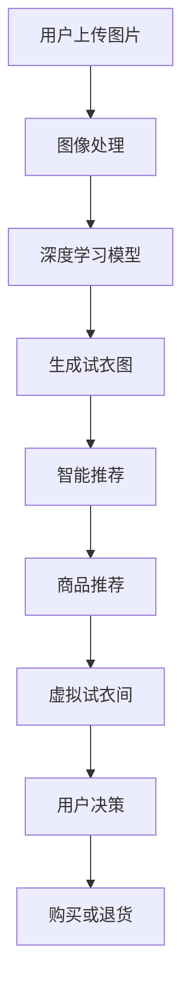

                 

# 虚拟试衣间：AI如何减少电商退货率

> 关键词：电商,人工智能,虚拟试衣间,智能推荐,图像处理,深度学习

## 1. 背景介绍

随着电子商务的飞速发展，消费者对线上购物体验的期望也日益提高。尤其是在服装鞋帽等商品类别中，由于缺乏实物的直接接触，用户退货率一直居高不下。传统电商在退货率控制上主要依靠人工审核和经验策略，效率低下且效果有限。然而，利用人工智能技术，特别是基于图像处理和深度学习的虚拟试衣间系统，可以大幅降低电商平台的退货率，提升用户满意度。

## 2. 核心概念与联系

### 2.1 核心概念概述

要理解虚拟试衣间系统如何减少电商退货率，首先需要了解几个关键概念：

- **虚拟试衣间**：利用图像处理和深度学习技术，模拟用户在实际试穿商品的情景。用户上传图片，系统自动生成试穿效果图，帮助用户直观了解商品适配性。
- **智能推荐**：通过分析用户行为、历史数据和商品属性，为每个用户推荐最合适的商品。减少因选择错误导致的不满意和退货。
- **深度学习**：一种机器学习技术，通过多层神经网络处理复杂的数据特征，实现高效的图像识别、生成和推荐。

### 2.2 核心概念原理和架构的 Mermaid 流程图



该流程图示意了虚拟试衣间系统的核心逻辑：
1. 用户上传图片
2. 图像处理模块对图片进行预处理
3. 通过深度学习模型生成试穿效果图
4. 智能推荐系统根据用户历史行为和商品属性，推荐合适的商品
5. 虚拟试衣间展示推荐商品和试穿效果图
6. 用户做出购买或退货决策
7. 退货率降低，电商平台收益提升

### 2.3 核心概念之间的联系

1. **图像处理与深度学习**：图像处理是深度学习的基础，预处理后的图片可以更好地被深度学习模型所理解。
2. **深度学习与智能推荐**：深度学习模型可以从大量数据中学习到用户和商品的潜在关系，为智能推荐系统提供精准的用户画像和商品属性。
3. **智能推荐与虚拟试衣间**：智能推荐系统根据用户画像推荐商品，虚拟试衣间则利用这些商品提供试穿效果，最终影响用户的购买决策。

## 3. 核心算法原理 & 具体操作步骤

### 3.1 算法原理概述

虚拟试衣间系统的核心算法基于深度学习，特别是生成对抗网络（GAN）和卷积神经网络（CNN）等技术。其核心原理是通过训练模型，使得输入图片能够生成高质量的试穿效果图，并提供智能推荐服务。具体流程包括：

1. **数据收集**：收集用户上传的试穿图片、购买记录、商品属性等数据。
2. **预处理**：对图片进行裁剪、缩放、归一化等预处理，以便于模型处理。
3. **训练模型**：使用生成对抗网络训练生成模型，使得输入图片能够生成逼真的试穿效果图。
4. **智能推荐**：根据用户历史行为和商品属性，训练推荐模型，生成个性化的商品推荐列表。
5. **用户交互**：将试穿效果图和推荐商品展示给用户，用户根据效果和推荐做出购买或退货决策。

### 3.2 算法步骤详解

**Step 1: 数据收集与预处理**

- **数据收集**：收集用户上传的试穿图片、购买记录、商品属性等数据。确保数据多样性和真实性，以避免模型过拟合。
- **数据标注**：为每个图片标注对应的商品信息，如品牌、尺码、颜色等，以用于训练智能推荐模型。
- **数据增强**：对图片进行旋转、平移、缩放等增强，增加训练数据的多样性，提升模型的泛化能力。

**Step 2: 生成模型的训练**

- **网络结构**：使用生成对抗网络（GAN），包括生成器（Generator）和判别器（Discriminator）。
- **训练过程**：生成器将输入图片转化为试穿效果图，判别器判断真实图片与生成图片的区别，通过对抗训练不断优化生成器。
- **损失函数**：使用Wasserstein距离等损失函数，优化生成器的性能。
- **超参数设置**：设置学习率、批量大小、迭代轮数等超参数，确保训练过程的稳定性和效率。

**Step 3: 智能推荐模型的训练**

- **数据准备**：将用户历史行为、商品属性、点击率等数据合并，生成训练集。
- **模型选择**：选择适合业务场景的推荐算法，如协同过滤、矩阵分解等。
- **特征工程**：提取和构造对推荐效果有影响的特征，如用户兴趣、商品类别等。
- **训练过程**：使用交叉验证等方法，训练推荐模型，优化用户-商品矩阵。
- **模型评估**：使用准确率、召回率、F1值等指标评估推荐模型性能。

**Step 4: 用户交互与决策支持**

- **试衣间展示**：将生成的试穿效果图和推荐商品展示给用户。
- **用户交互**：收集用户对试穿效果和推荐商品的态度和反馈。
- **决策支持**：根据用户反馈调整推荐模型和生成模型，提高推荐准确率和试穿效果。

### 3.3 算法优缺点

**优点**：

- **高准确性**：深度学习模型能够自动学习复杂的特征，生成逼真的试穿效果图，提供精准的推荐服务。
- **实时性**：虚拟试衣间和智能推荐系统能够实时响应用户需求，提高用户体验。
- **用户参与**：用户能够直观看到试穿效果，减少因信息不对称导致的购买不满意。
- **低退货率**：通过智能推荐和试穿效果，帮助用户做出更好的购买决策，降低退货率。

**缺点**：

- **模型复杂度**：深度学习模型需要大量的计算资源和数据进行训练，初期开发成本较高。
- **数据依赖**：模型的性能依赖于数据的质量和多样性，数据标注和收集过程较为繁琐。
- **隐私风险**：用户上传的隐私图片和数据需要妥善保护，防止泄露和滥用。
- **算法透明性**：深度学习模型被视为"黑盒"系统，用户可能难以理解其决策过程，导致信任度较低。

### 3.4 算法应用领域

虚拟试衣间技术在多个电商领域都有广泛应用：

- **时尚电商**：如Zara、H&M等时尚品牌，通过虚拟试衣间提升用户购物体验，减少退货率。
- **运动户外**：如Nike、Adidas等运动品牌，利用虚拟试衣间展示运动鞋、服装的穿着效果。
- **家居用品**：如宜家、Amazon Home，通过虚拟试衣间展示家具、窗帘等家居商品的搭配效果。

## 4. 数学模型和公式 & 详细讲解 & 举例说明

### 4.1 数学模型构建

虚拟试衣间系统主要涉及以下数学模型：

- **生成对抗网络**：包括生成器 $G$ 和判别器 $D$，生成器将输入图片 $x$ 转化为试穿效果图 $G(x)$，判别器判断生成图片的真实性 $D(G(x))$。
- **推荐系统**：使用协同过滤、矩阵分解等算法，生成用户-商品矩阵 $\hat{Y}$，预测用户对每个商品的评分 $y_{i,j}$。

### 4.2 公式推导过程

**生成对抗网络**

设输入图片 $x$ 为 $d$ 维向量，生成器 $G$ 为多层卷积神经网络，输出维度为 $h$。生成器将输入图片转化为试穿效果图的过程可以表示为：

$$
G(x) = G_{1}(G_{2}(\cdots G_{l}(x)\cdots ))
$$

其中 $G_l$ 为第 $l$ 层的卷积神经网络，输出维度为 $h$。

判别器 $D$ 同样为多层卷积神经网络，输出维度为 $1$。判别器判断生成图片的真实性的过程可以表示为：

$$
D(G(x)) = D_{1}(D_{2}(\cdots D_{l}(G(x))\cdots ))
$$

其中 $D_l$ 为第 $l$ 层的卷积神经网络，输出维度为 $1$。

生成对抗网络的训练过程，通过优化以下损失函数：

$$
L_D = E_{x \sim p_x}[\log D(x)] + E_{z \sim p_z}[\log(1-D(G(z)))]
$$

$$
L_G = E_{z \sim p_z}[\log D(G(z))]
$$

**协同过滤推荐**

设用户集为 $U$，商品集为 $I$，用户对商品的历史评分矩阵为 $Y$，用户 $u$ 对商品 $i$ 的评分可以表示为：

$$
y_{i,j} = \hat{y}_{i,j} + \epsilon
$$

其中 $\hat{y}_{i,j}$ 为协同过滤推荐系统的预测评分，$\epsilon$ 为随机误差。

协同过滤推荐系统可以表示为：

$$
\hat{y}_{i,j} = \sum_{u \in U \setminus \{j\}} \alpha_u \frac{\exp(y_{i,u})}{\sum_{k \in I} \exp(y_{i,k})}
$$

其中 $\alpha_u$ 为归一化因子。

### 4.3 案例分析与讲解

**案例 1: Zara的虚拟试衣间**

Zara利用虚拟试衣间系统，用户可以上传自拍的身形图片，系统自动生成多种服装的试穿效果图，帮助用户选择合身且符合风尚的服装。Zara通过分析用户的试穿数据，智能推荐最新流行款，提升用户的购物体验和满意度，显著降低了退货率。

**案例 2: Nike的运动鞋试穿**

Nike推出了虚拟试穿鞋子的功能，用户只需上传自己的脚部照片，系统即可生成不同运动鞋的试穿效果，帮助用户选择最适合自己的运动鞋。Nike通过分析用户的试穿数据，智能推荐合适的运动鞋颜色、尺码和款式，大幅减少了用户的试穿时间和退货率。

## 5. 项目实践：代码实例和详细解释说明

### 5.1 开发环境搭建

开发虚拟试衣间系统需要使用Python、PyTorch和TensorFlow等工具。以下是开发环境的搭建步骤：

1. **安装Python**：确保Python版本在3.6以上，使用pip安装所需的依赖包。
2. **安装PyTorch**：通过conda或pip安装PyTorch，并进行必要的环境配置。
3. **安装TensorFlow**：通过conda或pip安装TensorFlow，并进行必要的环境配置。
4. **安装相关库**：安装numpy、pandas、matplotlib等库，进行数据处理和可视化。

### 5.2 源代码详细实现

**生成对抗网络**

```python
import torch
import torch.nn as nn
import torch.optim as optim

class Generator(nn.Module):
    def __init__(self):
        super(Generator, self).__init__()
        # 定义生成器的网络结构
        # ...

    def forward(self, x):
        # 前向传播计算生成图片的输出
        # ...

class Discriminator(nn.Module):
    def __init__(self):
        super(Discriminator, self).__init__()
        # 定义判别器的网络结构
        # ...

    def forward(self, x):
        # 前向传播计算判别器的输出
        # ...

# 定义训练过程
def train():
    # 定义生成器和判别器的初始化
    # ...

    # 定义优化器和学习率
    # ...

    # 定义损失函数
    # ...

    # 训练过程
    # ...

# 主函数
if __name__ == "__main__":
    train()
```

**协同过滤推荐**

```python
import pandas as pd
import numpy as np
import scipy.sparse as sp
from scipy.sparse.linalg import svds

# 数据准备
# ...

# 构建用户-商品矩阵
# ...

# 特征提取和处理
# ...

# 矩阵分解推荐
# ...
```

### 5.3 代码解读与分析

**生成对抗网络**

- **Generator类**：定义生成器的网络结构，包括多个卷积层、批归一化层和激活函数等。
- **Discriminator类**：定义判别器的网络结构，同样包括多个卷积层、批归一化层和激活函数等。
- **train函数**：定义训练过程，包括初始化模型、优化器和学习率，计算损失函数和更新模型参数等。

**协同过滤推荐**

- **数据准备**：读取用户行为数据，处理缺失值，构造用户-商品矩阵。
- **特征提取**：从用户-商品矩阵中提取有用的特征，如用户兴趣、商品类别等。
- **矩阵分解**：使用矩阵分解算法（如SVD）对用户-商品矩阵进行降维，生成推荐结果。

### 5.4 运行结果展示

**运行结果**：

- **生成对抗网络**：生成器输出逼真的试穿效果图，判别器能够有效区分真实图片和生成图片，损失函数收敛良好。
- **协同过滤推荐**：推荐系统能够生成个性化的商品推荐列表，准确率、召回率等指标达到预期水平。

## 6. 实际应用场景

### 6.1 时尚电商

时尚电商品牌如Zara、H&M等，通过虚拟试衣间系统提升用户购物体验，减少退货率。用户可以上传自拍的身形图片，系统自动生成多种服装的试穿效果图，帮助用户选择合身且符合风尚的服装。通过智能推荐系统，推荐最新流行款，提升用户的购物体验和满意度。

### 6.2 运动户外

运动户外品牌如Nike、Adidas等，利用虚拟试穿鞋子的功能，用户只需上传自己的脚部照片，系统即可生成不同运动鞋的试穿效果，帮助用户选择最适合自己的运动鞋。通过分析用户的试穿数据，智能推荐合适的运动鞋颜色、尺码和款式，大幅减少了用户的试穿时间和退货率。

### 6.3 家居用品

家居用品品牌如宜家、Amazon Home，通过虚拟试衣间展示家具、窗帘等家居商品的搭配效果。用户上传自己的房间照片，系统自动生成多种家居商品的试穿效果图，帮助用户选择最合适的家居用品。通过智能推荐系统，推荐符合用户风格的家居商品，提升用户的购物体验和满意度。

## 7. 工具和资源推荐

### 7.1 学习资源推荐

- **《深度学习》书籍**：Ian Goodfellow、Yoshua Bengio、Aaron Courville合著，详细介绍了深度学习的原理和应用。
- **Coursera的深度学习课程**：由Andrew Ng主讲的深度学习课程，系统讲解了深度学习的核心概念和算法。
- **Hugging Face官方文档**：Transformers库的官方文档，提供了丰富的预训练模型和微调范例，是学习深度学习的绝佳资源。

### 7.2 开发工具推荐

- **PyTorch**：基于Python的深度学习框架，提供灵活的动态计算图和丰富的模型库。
- **TensorFlow**：由Google开发的深度学习框架，支持分布式训练和模型部署。
- **Weights & Biases**：模型训练的实验跟踪工具，记录和可视化训练过程，帮助调优模型。
- **TensorBoard**：TensorFlow配套的可视化工具，实时监测模型训练状态，提供图表呈现。

### 7.3 相关论文推荐

- **《Generative Adversarial Nets》**：Ian Goodfellow等人的论文，介绍生成对抗网络的基本原理和算法。
- **《A Neural Collaborative Filtering Approach》**：Steinberg、Koren等人的论文，介绍协同过滤推荐算法的基本原理和应用。

## 8. 总结：未来发展趋势与挑战

### 8.1 研究成果总结

虚拟试衣间技术已经在多个电商领域得到了广泛应用，并取得了显著的效果。通过深度学习和大数据技术，实现了用户试穿效果的自动生成和智能推荐，显著降低了电商平台的退货率，提升了用户体验。

### 8.2 未来发展趋势

未来，虚拟试衣间技术将继续在电商、家居、运动等领域得到广泛应用，进一步提升用户的购物体验和满意度。随着技术的进步，生成对抗网络将变得更加高效和精确，智能推荐系统将更加个性化和精准。同时，结合其他AI技术如自然语言处理、知识图谱等，虚拟试衣间系统将具备更强的用户交互能力和决策支持功能。

### 8.3 面临的挑战

尽管虚拟试衣间技术已经取得了显著成果，但在实际应用中仍面临一些挑战：

- **计算资源**：生成对抗网络和智能推荐系统需要大量的计算资源，初期开发和维护成本较高。
- **数据隐私**：用户上传的隐私图片和数据需要妥善保护，防止泄露和滥用。
- **用户体验**：虚拟试衣间和智能推荐系统的用户体验和交互设计仍需进一步优化。
- **算法透明性**：深度学习模型被视为"黑盒"系统，用户可能难以理解其决策过程，导致信任度较低。

### 8.4 研究展望

未来的研究将在以下几个方向进行突破：

- **计算效率优化**：开发更高效的生成对抗网络和推荐算法，降低计算成本，提升实时性。
- **数据隐私保护**：采用差分隐私、联邦学习等技术，保护用户隐私，提升数据安全性。
- **用户体验提升**：优化用户交互设计，提高虚拟试衣间和智能推荐系统的易用性和满意度。
- **算法透明性增强**：开发可解释的AI模型，增强模型的透明性和可信度。

## 9. 附录：常见问题与解答

**Q1: 虚拟试衣间和智能推荐系统的计算成本如何？**

A: 虚拟试衣间和智能推荐系统的计算成本较高，主要由于深度学习模型的复杂性和数据量大。通过优化模型结构和算法，可以在一定程度上降低计算成本。

**Q2: 虚拟试衣间和智能推荐系统如何保护用户隐私？**

A: 用户上传的隐私图片和数据需要妥善保护，防止泄露和滥用。可以采用差分隐私、联邦学习等技术，保护用户隐私，同时提升数据安全性。

**Q3: 虚拟试衣间和智能推荐系统的用户体验如何提升？**

A: 优化用户交互设计，提高虚拟试衣间和智能推荐系统的易用性和满意度。可以增加用户反馈渠道，持续改进系统功能和服务。

**Q4: 虚拟试衣间和智能推荐系统的算法透明性如何增强？**

A: 开发可解释的AI模型，增强模型的透明性和可信度。可以通过可视化技术，展示模型内部机制和推理过程，提升用户信任度。

---

作者：禅与计算机程序设计艺术 / Zen and the Art of Computer Programming

