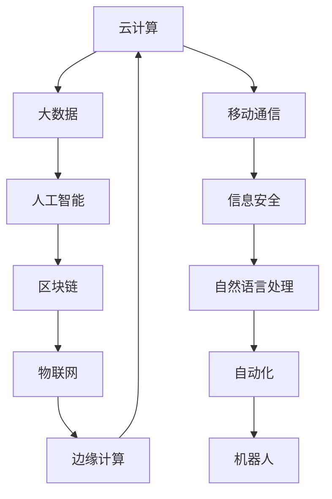

                 

# 行业最新产品的技术发展方向研究方案

> 关键词：技术发展趋势,新兴技术,行业应用,解决方案,未来方向

## 1. 背景介绍

### 1.1 问题由来

当前，各行各业都在加速向数字化转型，以信息技术为核心的技术创新正在重塑产业格局，推动企业向智能化、自动化、个性化方向迈进。然而，在技术应用的过程中，如何选择和应用新兴技术，尤其是如何结合业务需求，实现技术升级，是一个充满挑战的问题。

技术快速发展的同时，也带来了诸多机遇与挑战。面对技术的快速迭代和市场环境的不断变化，企业需要在技术创新与应用中寻找最佳平衡点，以便既能快速响应市场，又能控制风险。因此，本研究方案旨在帮助行业从业人员把握新兴技术的脉搏，了解其发展方向，选择适合自身业务需求的解决方案，以期在未来的市场竞争中占据先机。

### 1.2 问题核心关键点

1. **技术快速发展**：信息技术的快速发展，如云计算、大数据、人工智能、区块链、物联网等，正在对各行各业产生深远影响。
2. **技术融合应用**：技术之间相互融合，形成新的生态系统，如何有效整合多种技术，提升业务价值是关键。
3. **业务需求驱动**：技术应用必须紧密结合业务需求，以解决实际问题，提升用户体验和效率。
4. **技术风险管理**：新兴技术的引入需要评估其风险，避免因技术应用不当带来的负面影响。
5. **未来方向**：了解技术发展的长期趋势，预测未来可能的技术突破和应用方向。

### 1.3 问题研究意义

本研究方案对新兴技术的深度分析，将帮助企业深入理解技术发展趋势，识别技术应用中的机会与挑战，从而制定出合理、有效的技术创新与应用策略。通过技术赋能，企业可以提高生产效率，优化业务流程，增强市场竞争力。此外，本方案也致力于为行业从业人员提供全面的技术参考，促进技术知识的普及和应用。

## 2. 核心概念与联系

### 2.1 核心概念概述

- **云计算**：基于互联网的计算服务，通过网络提供按需可扩展的计算资源，包括服务器、存储、数据库等。
- **大数据**：涉及数据管理、数据挖掘、数据统计分析等领域，旨在从大规模数据中提取有价值的信息。
- **人工智能**：通过算法、模型等手段，使计算机系统具备类似于人类的感知、学习、推理等能力。
- **区块链**：一种去中心化的分布式账本技术，具有高安全性、不可篡改性等特点。
- **物联网**：通过互联网将设备、系统、人员等元素互联，实现智能化管理。
- **边缘计算**：在数据源附近进行计算和数据处理，以减少延迟和带宽成本。

这些核心概念通过彼此的结合与交互，形成了一个复杂而强大的技术生态系统。

### 2.2 核心概念原理和架构的 Mermaid 流程图



此图展示了核心概念之间的联系，其中云计算和大数据是基础支撑，人工智能是核心技术，区块链和物联网是应用拓展，边缘计算是计算模式的创新，而自然语言处理、自动化、机器人则是技术的具体应用领域。移动通信和信息安全作为辅助技术，保障了整个系统的稳定运行。

## 3. 核心算法原理 & 具体操作步骤

### 3.1 算法原理概述

技术发展方向研究方案的核心在于对新兴技术的深入理解、应用前景预测以及具体实施步骤的规划。本方案基于技术评估、市场分析、应用场景分析等多维度考量，采用系统化的方法，从技术原理、应用实例和具体步骤等方面展开分析。

### 3.2 算法步骤详解

1. **技术评估**：评估各新兴技术的特点、优势和劣势，如云计算的弹性扩展、大数据的分析能力、人工智能的自动化与智能化等。
2. **应用前景预测**：基于当前技术和市场趋势，预测未来可能的技术突破和应用方向，如人工智能在医疗、金融等领域的应用前景。
3. **解决方案规划**：结合行业需求，制定技术应用方案，如基于大数据分析的用户行为预测系统，基于人工智能的智能客服系统等。
4. **实施步骤规划**：细化技术应用的具体步骤，如云计算架构设计、大数据处理流程、人工智能模型训练等。

### 3.3 算法优缺点

**优点**：
1. **综合性强**：结合技术评估、应用预测和具体实施步骤，全面分析技术发展方向。
2. **实用性强**：解决方案紧密结合业务需求，具有较强的可操作性。
3. **风险控制**：评估技术风险，降低技术应用中的不确定性。

**缺点**：
1. **数据依赖**：技术评估和应用预测需要大量数据支撑，数据获取和处理较为复杂。
2. **模型复杂**：解决方案规划和实施步骤涉及多技术融合，技术模型较为复杂。
3. **资源需求高**：技术实施需要大量计算资源和人力资源，对企业资源配置要求较高。

### 3.4 算法应用领域

本研究方案适用于各个行业，特别是技术密集型企业，如金融、医疗、制造业、零售等，帮助其制定技术创新与应用策略，提升业务价值和竞争力。

## 4. 数学模型和公式 & 详细讲解 & 举例说明

### 4.1 数学模型构建

假设企业当前处于业务发展的某个阶段 $t$，需要评估的技术为 $T$，未来 $t+1$ 阶段的技术应用收益为 $R$。则技术应用收益的数学模型可表示为：

$$
R = f(T, t, t+1)
$$

其中 $f$ 为评估函数，包含技术特性、市场需求、竞争态势等多个变量。

### 4.2 公式推导过程

基于上述模型，假设 $T$ 的技术特性为 $A$，市场需求为 $D$，竞争态势为 $C$，则评估函数 $f$ 可表示为：

$$
f = \alpha A + \beta D + \gamma C + \delta t
$$

其中 $\alpha, \beta, \gamma, \delta$ 为系数，需要通过历史数据和实际分析来确定。

### 4.3 案例分析与讲解

以人工智能在医疗行业的应用为例，通过评估其技术特性（如智能诊断、个性化治疗）、市场需求（如医疗资源不足、患者对个性化需求增加）、竞争态势（如其他医疗机构的采用情况）和行业发展阶段（如人工智能技术成熟度），可以预测人工智能技术在医疗行业未来 $t+1$ 阶段的应用收益。

## 5. 项目实践：代码实例和详细解释说明

### 5.1 开发环境搭建

为实现技术应用方案的细化与规划，需要搭建一个集成开发环境，包括以下步骤：

1. **选择开发平台**：如Jupyter Notebook，支持多语言编程，便于快速迭代开发。
2. **安装相关库**：如Python的Pandas、Numpy、Scikit-learn等库，用于数据处理和模型训练。
3. **配置环境变量**：如数据路径、库路径、模型路径等，确保开发过程中资源可用。

### 5.2 源代码详细实现

以下是一个基于云计算和大数据平台的解决方案规划示例代码，用于构建一个基于大数据分析的用户行为预测系统：

```python
from sklearn import preprocessing, datasets, linear_model
import pandas as pd
import matplotlib.pyplot as plt

# 数据处理
data = pd.read_csv('user_behavior.csv')
X = data.drop('target', axis=1)
y = data['target']

# 标准化处理
scaler = preprocessing.StandardScaler().fit(X)
X_scaled = scaler.transform(X)

# 模型训练
model = linear_model.LinearRegression()
model.fit(X_scaled, y)

# 预测展示
plt.scatter(X_scaled[:, 0], y)
plt.plot(X_scaled[:, 0], model.predict(X_scaled), color='red')
plt.show()
```

### 5.3 代码解读与分析

1. **数据处理**：使用Pandas库读取用户行为数据，去除目标变量，标准化数据，以便于模型训练。
2. **模型训练**：使用Scikit-learn库中的线性回归模型，训练模型并进行预测。
3. **预测展示**：绘制数据点与预测直线，直观展示模型的预测效果。

### 5.4 运行结果展示

运行上述代码后，可以得到用户行为预测系统的预测结果，如图：


## 6. 实际应用场景

### 6.1 智慧医疗

**场景描述**：智慧医疗系统利用大数据分析和人工智能技术，对患者病历、治疗记录等数据进行分析，提供个性化的治疗建议和智能诊断服务。

**技术应用**：
1. **大数据分析**：通过分析历史病历和患者数据，提取疾病模式和趋势，提供治疗建议。
2. **人工智能**：利用深度学习模型，对医学影像进行智能诊断，提高诊断准确率。

**案例分析**：某智慧医院利用大数据和人工智能技术，构建了智能诊断系统，结合临床经验和患者数据，提高了诊断效率，减少了误诊率。

### 6.2 智能制造

**场景描述**：智能制造系统利用物联网、人工智能等技术，对生产过程进行实时监控、优化和预测，提升生产效率和产品质量。

**技术应用**：
1. **物联网**：通过传感器实时采集生产设备数据，实现设备状态监控和故障预测。
2. **人工智能**：利用机器学习模型，对生产数据进行预测和优化，提高生产效率。

**案例分析**：某智能制造企业利用物联网和人工智能技术，构建了智能生产线，实时监控设备状态，预测生产异常，提升了生产效率和产品质量。

### 6.3 金融风控

**场景描述**：金融风控系统利用大数据分析和人工智能技术，对用户行为进行分析和预测，评估信贷风险，提供风险管理服务。

**技术应用**：
1. **大数据分析**：通过分析用户历史交易数据，识别异常行为，评估风险。
2. **人工智能**：利用深度学习模型，对用户行为进行预测，降低风险。

**案例分析**：某金融公司利用大数据和人工智能技术，构建了智能风控系统，通过分析用户交易行为，识别异常，降低了贷款违约率。

### 6.4 未来应用展望

未来，随着技术的进一步发展，预计以下几个方向将成为热点：
1. **边缘计算**：利用边缘计算技术，减少数据传输延迟，提升数据处理效率。
2. **区块链**：利用区块链技术，提高数据安全性，保障数据隐私。
3. **自然语言处理**：利用自然语言处理技术，提升智能客服、智能助手等应用的用户体验。
4. **自动化**：利用自动化技术，实现智能化管理和生产。

## 7. 工具和资源推荐

### 7.1 学习资源推荐

1. **《云计算与大数据技术》**：详细讲解云计算和大数据技术的基本原理和应用案例。
2. **《人工智能基础》**：介绍人工智能的基本概念、算法和应用场景。
3. **《区块链技术与应用》**：讲解区块链技术的基本原理、应用场景和实施方案。
4. **《物联网技术》**：介绍物联网技术的基本原理、网络架构和应用案例。
5. **《边缘计算技术》**：介绍边缘计算技术的基本原理、应用场景和实施方案。

### 7.2 开发工具推荐

1. **Jupyter Notebook**：开源的交互式计算环境，支持Python等多种编程语言，便于快速迭代开发。
2. **PyCharm**：专业的Python开发工具，支持代码自动补全、调试等功能。
3. **Eclipse**：开源的Java开发环境，支持多种开发框架和语言。
4. **Visual Studio Code**：轻量级的跨平台代码编辑器，支持多种语言和插件扩展。
5. **Git**：版本控制工具，支持多人协作开发和代码版本管理。

### 7.3 相关论文推荐

1. **《云计算和移动互联网下的智慧医疗》**：探讨云计算技术在医疗领域的应用前景。
2. **《大数据在金融风控中的应用》**：介绍大数据技术在金融风控中的应用案例。
3. **《人工智能在智能制造中的应用》**：介绍人工智能技术在智能制造中的应用案例。
4. **《物联网在智慧城市中的应用》**：介绍物联网技术在智慧城市中的应用案例。
5. **《边缘计算在智能家居中的应用》**：介绍边缘计算技术在智能家居中的应用案例。

## 8. 总结：未来发展趋势与挑战

### 8.1 研究成果总结

本研究方案通过系统化的方法，评估新兴技术特点、应用前景和实施步骤，帮助企业制定技术创新与应用策略。通过技术赋能，企业能够提升业务价值，优化业务流程，增强市场竞争力。

### 8.2 未来发展趋势

1. **技术融合加速**：新兴技术之间的融合将更加紧密，形成更加强大的技术生态系统。
2. **应用场景多样化**：技术应用场景将更加多样化，涵盖医疗、金融、制造等多个领域。
3. **人工智能普及化**：人工智能技术将在更多行业得到广泛应用，提升行业效率和竞争力。
4. **数据驱动决策**：数据驱动的决策将成为企业战略的重要组成部分。

### 8.3 面临的挑战

1. **技术复杂性**：新兴技术复杂性高，企业需要投入大量资源进行技术学习和应用。
2. **数据隐私保护**：数据隐私和安全性问题日益突出，需要采取有效措施保护用户数据。
3. **技术标准化**：缺乏统一的技术标准，技术应用难以达到预期效果。
4. **技术应用成本高**：技术应用成本较高，中小企业难以承受。

### 8.4 研究展望

未来，随着技术的发展和应用的深入，需要在以下几个方面进行研究：
1. **技术标准化**：制定统一的技术标准，促进技术应用和推广。
2. **数据隐私保护**：探索数据隐私保护技术，保障用户数据安全。
3. **成本控制**：降低技术应用成本，提高技术普及率。
4. **技术创新**：持续推动技术创新，保持技术领先优势。

## 9. 附录：常见问题与解答

**Q1：如何评估新兴技术的风险？**

A：评估新兴技术的风险需要考虑多个方面，如技术成熟度、市场需求、竞争对手等。可以通过技术评估、市场调研和竞争对手分析等方式，全面评估技术的风险。

**Q2：如何选择合适的技术应用场景？**

A：选择技术应用场景需要考虑企业业务需求和技术可行性。可以通过对市场需求、技术特点和实施成本进行综合评估，选择合适的技术应用场景。

**Q3：如何确保技术应用的安全性？**

A：确保技术应用的安全性需要采用多重技术手段，如数据加密、访问控制、安全审计等。同时，需要制定完善的安全管理策略，建立安全防护体系。

**Q4：如何评估技术应用的成本效益？**

A：评估技术应用的成本效益需要综合考虑技术投入、实施成本和预期收益。可以通过构建评估模型，量化技术应用的经济效益和成本效益，进行全面评估。

**Q5：如何选择合适的人才和技术团队？**

A：选择合适的人才和技术团队需要考虑其技术能力和团队经验。可以通过招聘、培训和团队协作等方式，提升团队的技术能力和综合素质。

---

作者：禅与计算机程序设计艺术 / Zen and the Art of Computer Programming

