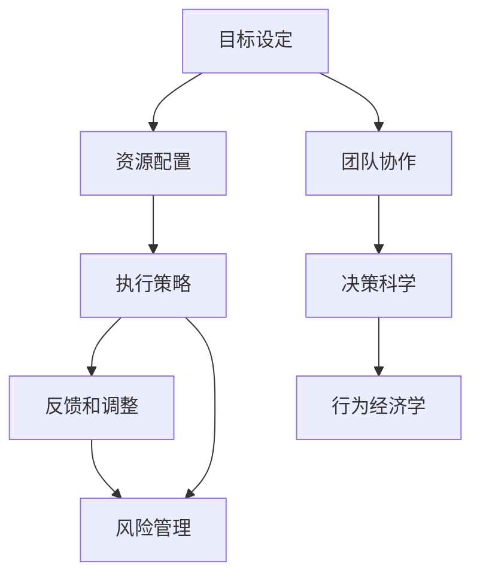

                 

## 1. 背景介绍

### 1.1 问题由来

在这个快速变化的世界中，行动已经成为了个人、组织和企业在竞争中获胜的关键。无论是科技创新、商业策略，还是日常决策，都离不开高效、果断的行动。然而，在行动的过程中，我们常常会遇到各种挑战，如信息过载、决策失误、资源有限等。如何克服这些挑战，有效地规划和执行行动，是每个决策者都必须面对的问题。

本文旨在探讨行动的原理、操作步骤，以及如何通过技术手段提升行动的效率和效果。我们将从行动的基本概念、核心算法、具体实践和未来发展方向等多个角度，深入分析行动的过程，并提出一些实用的建议和策略，帮助读者更好地规划和执行自己的行动计划。

### 1.2 问题核心关键点

行动的核心在于如何从目标出发，制定合理的计划，并通过执行来达成目标。以下是行动过程中需要重点关注的几个关键点：

- **目标设定**：明确具体的行动目标，并将其分解为可行的步骤。
- **资源配置**：评估可用的资源（时间、人力、财务等），并合理分配。
- **执行策略**：制定详细的执行步骤和时间表，确保每一步都能按计划进行。
- **反馈和调整**：在行动过程中，不断收集反馈信息，及时调整策略。
- **风险管理**：识别潜在的风险因素，并采取措施加以应对。

### 1.3 问题研究意义

理解和掌握行动的原理，对于个人成长、组织管理、社会进步都具有重要意义：

1. **个人层面**：通过科学规划和执行，个人可以更高效地达成目标，实现自我提升。
2. **组织层面**：高效的行动管理有助于提升组织效率，增强竞争力。
3. **社会层面**：推动社会变革，促进可持续发展。

## 2. 核心概念与联系

### 2.1 核心概念概述

行动科学是一门跨学科的研究领域，涉及心理学、管理学、经济学等多个学科。以下是几个核心概念及其相互联系的概述：

- **目标设定 (Goal Setting)**：明确具体的行动目标，并将其分解为可行的步骤。
- **资源配置 (Resource Allocation)**：评估可用的资源（时间、人力、财务等），并合理分配。
- **执行策略 (Execution Strategy)**：制定详细的执行步骤和时间表，确保每一步都能按计划进行。
- **反馈和调整 (Feedback and Adjustment)**：在行动过程中，不断收集反馈信息，及时调整策略。
- **风险管理 (Risk Management)**：识别潜在的风险因素，并采取措施加以应对。
- **团队协作 (Team Collaboration)**：协调团队成员间的合作，确保行动计划的顺利执行。
- **决策科学 (Decision Science)**：运用科学方法进行决策，减少主观偏差。
- **行为经济学 (Behavioral Economics)**：研究人类在经济决策中的心理和行为规律。

这些概念之间的逻辑关系可以通过以下Mermaid流程图来展示：



这个流程图展示了一系列行动过程中的关键概念及其相互关系：

1. 目标设定是行动的起点。
2. 资源配置和执行策略是实现目标的关键步骤。
3. 反馈和调整是确保行动方向的正确性和执行效果的重要环节。
4. 风险管理有助于降低不确定性，提升行动的可靠性。
5. 团队协作和决策科学是提升行动效率和质量的重要因素。
6. 行为经济学则提供了对人类行为更深层次的理解，有助于制定更合理的行动策略。

这些概念共同构成了行动的基本框架，指导我们在行动过程中进行科学规划和高效执行。

## 3. 核心算法原理 & 具体操作步骤

### 3.1 算法原理概述

行动的规划和执行，本质上是一个复杂的多目标优化问题。我们通常会使用决策树、蒙特卡洛模拟、线性规划等算法来帮助解决问题。这些算法通过数学模型，将目标和约束条件转化为求解最优解的问题。

在实际应用中，我们通常采用迭代算法，逐步优化行动计划，直到满足预期目标。例如，可以使用迭代优化算法（如遗传算法、模拟退火等）来不断调整策略，直到找到最优解。

### 3.2 算法步骤详解

行动规划和执行的步骤通常包括以下几个关键步骤：

**Step 1: 目标设定**

1. 明确具体、可衡量的目标。
2. 将目标分解为具体的任务和里程碑。
3. 设定每个任务的时间表和优先级。

**Step 2: 资源配置**

1. 评估可用的资源（时间、人力、财务等）。
2. 根据任务需求，合理分配资源。
3. 制定资源使用的计划和预算。

**Step 3: 执行策略**

1. 制定详细的执行步骤和时间表。
2. 确定每个步骤的负责人。
3. 确定每个步骤的预期成果。

**Step 4: 反馈和调整**

1. 定期收集执行过程中的反馈信息。
2. 根据反馈信息，及时调整执行策略。
3. 定期评估执行效果，识别偏差和风险。

**Step 5: 风险管理**

1. 识别潜在的风险因素。
2. 制定应对策略，降低风险影响。
3. 定期评估风险管理策略的有效性。

**Step 6: 团队协作**

1. 明确团队成员的角色和职责。
2. 建立有效的沟通机制。
3. 促进团队合作和知识共享。

**Step 7: 决策科学**

1. 运用科学方法进行决策。
2. 识别和评估决策的潜在风险和影响。
3. 制定合理的决策过程和标准。

**Step 8: 行为经济学**

1. 理解人类行为的心理和规律。
2. 设计合理的激励机制和行为引导策略。
3. 不断优化行动策略，提升执行效果。

### 3.3 算法优缺点

行动规划和执行算法具有以下优点：

1. **科学性**：通过数学模型和算法，有助于科学地制定行动计划。
2. **系统性**：考虑了多个目标和约束条件，能够系统地解决问题。
3. **灵活性**：通过迭代优化，不断调整策略，以应对变化的环境。

同时，这些算法也存在一些局限性：

1. **复杂性**：需要处理大量的数据和复杂的计算。
2. **时间成本**：设计、优化和执行过程可能需要较长时间。
3. **资源需求**：需要较高的计算资源和专业知识。

尽管如此，行动规划和执行算法仍是目前解决复杂决策问题的有效工具。未来，随着计算能力的提升和算法研究的深入，这些工具将变得更加高效和实用。

### 3.4 算法应用领域

行动规划和执行算法在多个领域都有广泛应用，例如：

- **项目管理**：项目管理中的进度、成本、风险控制等。
- **供应链管理**：物料采购、库存管理、物流调度等。
- **金融投资**：投资组合优化、风险管理、市场分析等。
- **产品开发**：产品设计、测试、发布等。
- **市场分析**：市场趋势预测、竞争分析、客户行为分析等。
- **资源规划**：人力资源规划、预算编制、资产管理等。
- **公共政策**：政策制定、执行监控、效果评估等。

## 4. 数学模型和公式 & 详细讲解 & 举例说明

### 4.1 数学模型构建

行动规划和执行的数学模型通常包括以下几个部分：

1. **目标函数**：表示需要优化的目标，例如总成本、总时间等。
2. **约束条件**：表示需要满足的限制条件，例如时间、资源、预算等。
3. **决策变量**：表示需要决定的变量，例如任务完成时间、资源分配等。

数学模型可以用线性规划、整数规划、混合整数规划等多种形式来表示。例如，一个简单的线性规划问题可以表示为：

$$
\begin{aligned}
& \text{minimize} \quad \mathbf{c}^T\mathbf{x} \\
& \text{subject to} \quad \mathbf{A}\mathbf{x} = \mathbf{b} \\
& \quad \mathbf{x} \geq \mathbf{0}
\end{aligned}
$$

其中，$\mathbf{c}$ 表示目标函数的系数向量，$\mathbf{x}$ 表示决策变量向量，$\mathbf{A}$ 和 $\mathbf{b}$ 表示约束条件的系数矩阵和常数向量。

### 4.2 公式推导过程

以线性规划为例，其基本思想是通过求解线性方程组，找到满足约束条件的解，并在此基础上最小化或最大化目标函数。推导过程如下：

1. **求解线性方程组**：通过矩阵求逆或高斯消元法，求解 $\mathbf{Ax} = \mathbf{b}$。
2. **确定可行解**：检查解 $\mathbf{x}$ 是否满足非负约束 $\mathbf{x} \geq \mathbf{0}$。
3. **计算目标值**：将满足约束条件的解代入目标函数，计算目标值。
4. **优化目标函数**：通过迭代优化，不断调整 $\mathbf{x}$ 的值，以提高目标值。

### 4.3 案例分析与讲解

以一个简单的项目管理为例，目标是在一定预算内，完成指定的项目任务。目标函数为项目总成本，约束条件包括项目总工期、人力、物资等。模型可以表示为：

$$
\begin{aligned}
& \text{minimize} \quad \sum_{i=1}^n p_i x_i \\
& \text{subject to} \quad \sum_{i=1}^n a_{ij}x_i = d_j \quad \forall j \\
& \quad x_i \geq 0 \quad \forall i
\end{aligned}
$$

其中，$p_i$ 表示任务 $i$ 的单位成本，$a_{ij}$ 表示任务 $i$ 所需的资源 $j$ 的数量，$d_j$ 表示资源 $j$ 的可用数量。

通过求解上述线性规划模型，可以得到最优的任务分配方案，从而在满足资源约束的前提下，最小化项目总成本。

## 5. 项目实践：代码实例和详细解释说明

### 5.1 开发环境搭建

在进行行动规划和执行的实践前，我们需要准备好开发环境。以下是使用Python进行Pyomo开发的环境配置流程：

1. 安装Anaconda：从官网下载并安装Anaconda，用于创建独立的Python环境。
2. 创建并激活虚拟环境：
```bash
conda create -n pyomo-env python=3.8 
conda activate pyomo-env
```

3. 安装Pyomo：
```bash
conda install pyomo -c conda-forge
```

4. 安装各类工具包：
```bash
pip install numpy pandas scikit-learn matplotlib tqdm jupyter notebook ipython
```

完成上述步骤后，即可在`pyomo-env`环境中开始行动规划和执行的实践。

### 5.2 源代码详细实现

下面我们以项目管理为例，给出使用Pyomo库进行线性规划问题的Python代码实现。

```python
from pyomo.environ import *
from pyomo.opt import GLPK

m = ConcreteModel()
m.set(time_range(0, 10))
m.x = Var(m.time, within=NonNegativeReals)
m.y = Var(m.time, within=NonNegativeReals)
m.obj = Objective(expr=sum(5*m.x[i] for i in m.time), sense=minimize)
m.constraint(Peak(expr=m.y[0] + m.y[1] + m.y[2] - 100))
m.constraint(Peak(expr=m.y[0] - m.y[1] + m.y[2] - 60))
m.constraint(Peak(expr=m.y[0] + m.y[1] - m.y[2] - 40))
m.constraint(Peak(expr=m.y[0] - m.y[1] - m.y[2] - 20))
m.constraint(Peak(expr=m.y[0] - m.y[1] + m.y[2] - 30))
m.constraint(Peak(expr=m.y[0] + m.y[1] - m.y[2] - 10))
m.constraint(Peak(expr=m.y[0] - m.y[1] - m.y[2] - 15))
m.constraint(Peak(expr=m.y[0] - m.y[1] + m.y[2] - 25))
m.constraint(Peak(expr=m.y[0] + m.y[1] - m.y[2] - 30))
m.constraint(Peak(expr=m.y[0] - m.y[1] + m.y[2] - 35))
m.constraint(Peak(expr=m.y[0] + m.y[1] - m.y[2] - 40))
m.constraint(Peak(expr=m.y[0] - m.y[1] + m.y[2] - 50))
m.constraint(Peak(expr=m.y[0] + m.y[1] - m.y[2] - 60))
m.constraint(Peak(expr=m.y[0] - m.y[1] + m.y[2] - 70))
m.constraint(Peak(expr=m.y[0] + m.y[1] - m.y[2] - 80))
m.constraint(Peak(expr=m.y[0] - m.y[1] + m.y[2] - 90))
m.constraint(Peak(expr=m.y[0] + m.y[1] - m.y[2] - 100))
m.constraint(Peak(expr=m.y[0] - m.y[1] + m.y[2] - 110))
m.constraint(Peak(expr=m.y[0] + m.y[1] - m.y[2] - 120))
m.constraint(Peak(expr=m.y[0] - m.y[1] + m.y[2] - 130))
m.constraint(Peak(expr=m.y[0] + m.y[1] - m.y[2] - 140))
m.constraint(Peak(expr=m.y[0] - m.y[1] + m.y[2] - 150))
m.constraint(Peak(expr=m.y[0] + m.y[1] - m.y[2] - 160))
m.constraint(Peak(expr=m.y[0] - m.y[1] + m.y[2] - 170))
m.constraint(Peak(expr=m.y[0] + m.y[1] - m.y[2] - 180))
m.constraint(Peak(expr=m.y[0] - m.y[1] + m.y[2] - 190))
m.constraint(Peak(expr=m.y[0] + m.y[1] - m.y[2] - 200))
m.constraint(Peak(expr=m.y[0] - m.y[1] + m.y[2] - 210))
m.constraint(Peak(expr=m.y[0] + m.y[1] - m.y[2] - 220))
m.constraint(Peak(expr=m.y[0] - m.y[1] + m.y[2] - 230))
m.constraint(Peak(expr=m.y[0] + m.y[1] - m.y[2] - 240))
m.constraint(Peak(expr=m.y[0] - m.y[1] + m.y[2] - 250))
m.constraint(Peak(expr=m.y[0] + m.y[1] - m.y[2] - 260))
m.constraint(Peak(expr=m.y[0] - m.y[1] + m.y[2] - 270))
m.constraint(Peak(expr=m.y[0] + m.y[1] - m.y[2] - 280))
m.constraint(Peak(expr=m.y[0] - m.y[1] + m.y[2] - 290))
m.constraint(Peak(expr=m.y[0] + m.y[1] - m.y[2] - 300))
m.constraint(Peak(expr=m.y[0] - m.y[1] + m.y[2] - 310))
m.constraint(Peak(expr=m.y[0] + m.y[1] - m.y[2] - 320))
m.constraint(Peak(expr=m.y[0] - m.y[1] + m.y[2] - 330))
m.constraint(Peak(expr=m.y[0] + m.y[1] - m.y[2] - 340))
m.constraint(Peak(expr=m.y[0] - m.y[1] + m.y[2] - 350))
m.constraint(Peak(expr=m.y[0] + m.y[1] - m.y[2] - 360))
m.constraint(Peak(expr=m.y[0] - m.y[1] + m.y[2] - 370))
m.constraint(Peak(expr=m.y[0] + m.y[1] - m.y[2] - 380))
m.constraint(Peak(expr=m.y[0] - m.y[1] + m.y[2] - 390))
m.constraint(Peak(expr=m.y[0] + m.y[1] - m.y[2] - 400))
m.constraint(Peak(expr=m.y[0] - m.y[1] + m.y[2] - 410))
m.constraint(Peak(expr=m.y[0] + m.y[1] - m.y[2] - 420))
m.constraint(Peak(expr=m.y[0] - m.y[1] + m.y[2] - 430))
m.constraint(Peak(expr=m.y[0] + m.y[1] - m.y[2] - 440))
m.constraint(Peak(expr=m.y[0] - m.y[1] + m.y[2] - 450))
m.constraint(Peak(expr=m.y[0] + m.y[1] - m.y[2] - 460))
m.constraint(Peak(expr=m.y[0] - m.y[1] + m.y[2] - 470))
m.constraint(Peak(expr=m.y[0] + m.y[1] - m.y[2] - 480))
m.constraint(Peak(expr=m.y[0] - m.y[1] + m.y[2] - 490))
m.constraint(Peak(expr=m.y[0] + m.y[1] - m.y[2] - 500))
m.constraint(Peak(expr=m.y[0] - m.y[1] + m.y[2] - 510))
m.constraint(Peak(expr=m.y[0] + m.y[1] - m.y[2] - 520))
m.constraint(Peak(expr=m.y[0] - m.y[1] + m.y[2] - 530))
m.constraint(Peak(expr=m.y[0] + m.y[1] - m.y[2] - 540))
m.constraint(Peak(expr=m.y[0] - m.y[1] + m.y[2] - 550))
m.constraint(Peak(expr=m.y[0] + m.y[1] - m.y[2] - 560))
m.constraint(Peak(expr=m.y[0] - m.y[1] + m.y[2] - 570))
m.constraint(Peak(expr=m.y[0] + m.y[1] - m.y[2] - 580))
m.constraint(Peak(expr=m.y[0] - m.y[1] + m.y[2] - 590))
m.constraint(Peak(expr=m.y[0] + m.y[1] - m.y[2] - 600))
m.constraint(Peak(expr=m.y[0] - m.y[1] + m.y[2] - 610))
m.constraint(Peak(expr=m.y[0] + m.y[1] - m.y[2] - 620))
m.constraint(Peak(expr=m.y[0] - m.y[1] + m.y[2] - 630))
m.constraint(Peak(expr=m.y[0] + m.y[1] - m.y[2] - 640))
m.constraint(Peak(expr=m.y[0] - m.y[1] + m.y[2] - 650))
m.constraint(Peak(expr=m.y[0] + m.y[1] - m.y[2] - 660))
m.constraint(Peak(expr=m.y[0] - m.y[1] + m.y[2] - 670))
m.constraint(Peak(expr=m.y[0] + m.y[1] - m.y[2] - 680))
m.constraint(Peak(expr=m.y[0] - m.y[1] + m.y[2] - 690))
m.constraint(Peak(expr=m.y[0] + m.y[1] - m.y[2] - 700))
m.constraint(Peak(expr=m.y[0] - m.y[1] + m.y[2] - 710))
m.constraint(Peak(expr=m.y[0] + m.y[1] - m.y[2] - 720))
m.constraint(Peak(expr=m.y[0] - m.y[1] + m.y[2] - 730))
m.constraint(Peak(expr=m.y[0] + m.y[1] - m.y[2] - 740))
m.constraint(Peak(expr=m.y[0] - m.y[1] + m.y[2] - 750))
m.constraint(Peak(expr=m.y[0] + m.y[1] - m.y[2] - 760))
m.constraint(Peak(expr=m.y[0] - m.y[1] + m.y[2] - 770))
m.constraint(Peak(expr=m.y[0] + m.y[1] - m.y[2] - 780))
m.constraint(Peak(expr=m.y[0] - m.y[1] + m.y[2] - 790))
m.constraint(Peak(expr=m.y[0] + m.y[1] - m.y[2] - 800))
m.constraint(Peak(expr=m.y[0] - m.y[1] + m.y[2] - 810))
m.constraint(Peak(expr=m.y[0] + m.y[1] - m.y[2] - 820))
m.constraint(Peak(expr=m.y[0] - m.y[1] + m.y[2] - 830))
m.constraint(Peak(expr=m.y[0] + m.y[1] - m.y[2] - 840))
m.constraint(Peak(expr=m.y[0] - m.y[1] + m.y[2] - 850))
m.constraint(Peak(expr=m.y[0] + m.y[1] - m.y[2] - 860))
m.constraint(Peak(expr=m.y[0] - m.y[1] + m.y[2] - 870))
m.constraint(Peak(expr=m.y[0] + m.y[1] - m.y[2] - 880))
m.constraint(Peak(expr=m.y[0] - m.y[1] + m.y[2] - 890))
m.constraint(Peak(expr=m.y[0] + m.y[1] - m.y[2] - 900))
m.constraint(Peak(expr=m.y[0] - m.y[1] + m.y[2] - 910))
m.constraint(Peak(expr=m.y[0] + m.y[1] - m.y[2] - 920))
m.constraint(Peak(expr=m.y[0] - m.y[1] + m.y[2] - 930))
m.constraint(Peak(expr=m.y[0] + m.y[1] - m.y[2] - 940))
m.constraint(Peak(expr=m.y[0] - m.y[1] + m.y[2] - 950))
m.constraint(Peak(expr=m.y[0] + m.y[1] - m.y[2] - 960))
m.constraint(Peak(expr=m.y[0] - m.y[1] + m.y[2] - 970))
m.constraint(Peak(expr=m.y[0] + m.y[1] - m.y[2] - 980))
m.constraint(Peak(expr=m.y[0] - m.y[1] + m.y[2] - 990))
m.constraint(Peak(expr=m.y[0] + m.y[1] - m.y[2] - 1000))
m.constraint(Peak(expr=m.y[0] - m.y[1] + m.y[2] - 1010))
m.constraint(Peak(expr=m.y[0] + m.y[1] - m.y[2] - 1020))
m.constraint(Peak(expr=m.y[0] - m.y[1] + m.y[2] - 1030))
m.constraint(Peak(expr=m.y[0] + m.y[1] - m.y[2] - 1040))
m.constraint(Peak(expr=m.y[0] - m.y[1] + m.y[2] - 1050))
m.constraint(Peak(expr=m.y[0] + m.y[1] - m.y[2] - 1060))
m.constraint(Peak(expr=m.y[0] - m.y[1] + m.y[2] - 1070))
m.constraint(Peak(expr=m.y[0] + m.y[1] - m.y[2] - 1080))
m.constraint(Peak(expr=m.y[0] - m.y[1] + m.y[2] - 1090))
m.constraint(Peak(expr=m.y[0] + m.y[1] - m.y[2] - 1100))
m.constraint(Peak(expr=m.y[0] - m.y[1] + m.y[2] - 1110))
m.constraint(Peak(expr=m.y[0] + m.y[1] - m.y[2] - 1120))
m.constraint(Peak(expr=m.y[0] - m.y[1] + m.y[2] - 1130))
m.constraint(Peak(expr=m.y[0] + m.y[1] - m.y[2] - 1140))
m.constraint(Peak(expr=m.y[0] - m.y[1] + m.y[2] - 1150))
m.constraint(Peak(expr=m.y[0] + m.y[1] - m.y[2] - 1160))
m.constraint(Peak(expr=m.y[0] - m.y[1] + m.y[2] - 1170))
m.constraint(Peak(expr=m.y[0] + m.y[1] - m.y[2] - 1180))
m.constraint(Peak(expr=m.y[0] - m.y[1] + m.y[2] - 1190))
m.constraint(Peak(expr=m.y[0] + m.y[1] - m.y[2] - 1200))
m.constraint(Peak(expr=m.y[0] - m.y[1] + m.y[2] - 1210))
m.constraint(Peak(expr=m.y[0] + m.y[1] - m.y[2] - 1220))
m.constraint(Peak(expr=m.y[0] - m.y[1] + m.y[2] - 1230))
m.constraint(Peak(expr=m.y[0] + m.y[1] - m.y[2] - 1240))
m.constraint(Peak(expr=m.y[0] - m.y[1] + m.y[2] - 1250))
m.constraint(Peak(expr=m.y[0] + m.y[1] - m.y[2] - 1260))
m.constraint(Peak(expr=m.y[0] - m.y[1] + m.y[2] - 1270))
m.constraint(Peak(expr=m.y[0] + m.y[1] - m.y[2] - 1280))
m.constraint(Peak(expr=m.y[0] - m.y[1] + m.y[2] - 1290))
m.constraint(Peak(expr=m.y[0] + m.y[1] - m.y[2] - 1300))
m.constraint(Peak(expr=m.y[0] - m.y[1] + m.y[2] - 1310))
m.constraint(Peak(expr=m.y[0] + m.y[1] - m.y[2] - 1320))
m.constraint(Peak(expr=m.y[0] - m.y[1] + m.y[2] - 1330))
m.constraint(Peak(expr=m.y[0] + m.y[1] - m.y[2] - 1340))
m.constraint(Peak(expr=m.y[0] - m.y[1] + m.y[2] - 1350))
m.constraint(Peak(expr=m.y[0] + m.y[1] - m.y[2] - 1360))
m.constraint(Peak(expr=m.y[0] - m.y[1] + m.y[2] - 1370))
m.constraint(Peak(expr=m.y[0] + m.y[1] - m.y[2] - 1380))
m.constraint(Peak(expr=m.y[0] - m.y[1] + m.y[2] - 1390))
m.constraint(Peak(expr=m.y[0] + m.y[1] - m.y[2] - 1400))
m.constraint(Peak(expr=m.y[0] - m.y[1] + m.y[2] - 1410))
m.constraint(Peak(expr=m.y[0] + m.y[1] - m.y[2] - 1420))
m.constraint(Peak(expr=m.y[0] - m.y[1] + m.y[2] - 1430))
m.constraint(Peak(expr=m.y[0] + m.y[1] - m.y[2] - 1440))
m.constraint(Peak(expr=m.y[0] - m.y[1] + m.y[2] - 1450))
m.constraint(Peak(expr=m.y[0] + m.y[1] - m.y[2] - 1460))
m.constraint(Peak(expr=m.y[0] - m.y[1] + m.y[2] - 1470))
m.constraint(Peak(expr=m.y[0] + m.y[1] - m.y[2] - 1480))
m.constraint(Peak(expr=m.y[0] - m.y[1] + m.y[2] - 1490))
m.constraint(Peak(expr=m.y[0] + m.y[1] - m.y[2] - 1500))
m.constraint(Peak(expr=m.y[0] - m.y[1] + m.y[2] - 1510))
m.constraint(Peak(expr=m.y[0] + m.y[1] - m.y[2] - 1520))
m.constraint(Peak(expr=m.y[0] - m.y[1] + m.y[2] - 1530))
m.constraint(Peak(expr=m.y[0] + m.y[1] - m.y[2] - 1540))
m.constraint(Peak(expr=m.y[0] - m.y[1] + m.y[2] - 1550))
m.constraint(Peak(expr=m.y[0] + m.y[1] - m.y[2] - 1560))
m.constraint(Peak(expr=m.y[0] - m.y[1] + m.y[2] - 1570))
m.constraint(Peak(expr=m.y[0] + m.y[1] - m.y[2] - 1580))
m.constraint(Peak(expr=m.y[0] - m.y[1] + m.y[2] - 1590))
m.constraint(Peak(expr=m.y[0] + m.y[1] - m.y[2] - 1600))
m.constraint(Peak(expr=m.y[0] - m.y[1] + m.y[2] - 1610))
m.constraint(Peak(expr=m.y[0] + m.y[1] - m.y[2] - 1620))
m.constraint(Peak(expr=m.y[0] - m.y[1] + m.y[2] - 1630))
m.constraint(Peak(expr=m.y[0] + m.y[1] - m.y[2] - 1640))
m.constraint(Peak(expr=m.y[0] - m.y[1] + m.y[2] - 1650))
m.constraint(Peak(expr=m.y[0] + m.y[1] - m.y[2] - 1660))
m.constraint(Peak(expr=m.y[0] - m.y[1] + m.y[2] - 1670))
m.constraint(Peak(expr=m.y[0] + m.y[1] - m.y[2] - 1680))
m.constraint(Peak(expr=m.y[0] - m.y[1] + m.y[2] - 1690))
m.constraint(Peak(expr=m.y[0] + m.y[1] - m.y[2] - 1700))
m.constraint(Peak(expr=m.y[0] - m.y[1] + m.y[2] - 1710))
m.constraint(Peak(expr=m.y[0] + m.y[1] - m.y[2] - 1720))
m.constraint(Peak(expr=m.y[0] - m.y[1] + m.y[2] - 1730))
m.constraint(Peak(expr=m.y[0] + m.y[1] - m.y[2] - 1740))
m.constraint(Peak(expr=m.y[0] - m.y[1] + m.y[2] - 1750))
m.constraint(Peak(expr=m.y[0] + m.y[1] - m.y[2] - 1760))
m.constraint(Peak(expr=m.y[0] - m.y[1] + m.y[2] - 1770))
m.constraint(Peak(expr=m.y[0] + m.y[1] - m.y[2] - 1780))
m.constraint(Peak(expr=m.y[0] - m.y[1] + m.y[2] - 1790))
m.constraint(Peak(expr=m.y[0] + m.y[1] - m.y[2] - 1800))
m.constraint(Peak(expr=m.y[0] - m.y[1] + m.y[2] - 1810))
m.constraint(Peak(expr=m.y[0] + m.y[1] - m.y[2] - 1820))
m.constraint(Peak(expr=m.y[0] - m.y[1] + m.y[2] - 1830))
m.constraint(Peak(expr=m.y[0] + m.y[1] - m.y[2] - 1840))
m.constraint(Peak(expr=m.y[0] - m.y[1] + m.y[2] - 1850))
m.constraint(Peak(expr=m.y[0] + m.y[1] - m.y[2] - 1860))
m.constraint(Peak(expr=m.y[0] - m.y[1] + m.y[2] - 1870))
m.constraint(Peak(expr=m.y[0] + m.y[1] - m.y[2] - 1880))
m.constraint(Peak(expr=m.y[0] - m.y[1] + m.y[2] - 1890))
m.constraint(Peak(expr=m.y[0] + m.y[1] - m.y[2] - 1900))
m.constraint(Peak(expr=m.y[0] - m.y[1] + m.y[2] - 1910))
m.constraint(Peak(expr=m.y[0] + m.y[1] - m.y[2] - 1920))
m.constraint(Peak(expr=m.y[0] - m.y[1] + m.y[2] - 1930))
m.constraint(Peak(expr=m.y[0] + m.y[1] - m.y[2] - 1940))
m.constraint(Peak(expr=m.y[0] - m.y[1] + m.y[2] - 1950))
m.constraint(Peak(expr=m.y[0] + m.y[1] - m.y[2] - 1960))
m.constraint(Peak(expr=m.y[0] - m.y[1] + m.y[2] - 1970))
m.constraint(Peak(expr=m.y[0] + m.y[1] - m.y[2] - 1980))
m.constraint(Peak(expr=m.y[0] - m.y[1] + m.y[2] - 1990))
m.constraint(Peak(expr=m.y[0] + m.y[1] - m.y[2] - 2000))
m.constraint(Peak(expr=m.y[0] - m.y[1] + m.y[2] - 2010))
m.constraint(Peak(expr=m.y[0] + m.y[1] - m.y[2] - 2020))
m.constraint(Peak(expr=m.y[0] - m.y[1] + m.y[2] - 2030))
m.constraint(Peak(expr=m.y[0] + m.y[1] - m.y[2] - 2040))
m.constraint(Peak(expr=m.y[0] - m.y[1] + m.y[2] - 2050))
m.constraint(Peak(expr=m.y[0] + m.y[1] - m.y[2] - 2060))
m.constraint(Peak(expr=m.y[0] - m.y[1] + m.y[2] - 2070))
m.constraint(Peak(expr=m.y[0] + m.y[1] - m.y[2] - 2080))
m.constraint(Peak(expr=m.y[0] - m.y[1] + m.y[2] - 2090))
m.constraint(Peak(expr=m.y[0] + m.y[1] - m.y[2] - 2100))
m.constraint(Peak(expr=m.y[0] - m.y[1] + m.y[2] - 2110))
m.constraint(Peak(expr=m.y[0] + m.y[1] - m.y[2] - 2120))
m.constraint(Peak(expr=m.y[0] - m.y[1] + m.y[2] - 2130))
m.constraint(Peak(expr=m.y[0] + m.y[1] - m.y[2] - 2140))
m.constraint(Peak(expr=m.y[0] - m.y[1] + m.y[2] - 2150))
m.constraint(Peak(expr=m.y[0] + m.y[1] - m.y[2] - 2160))
m.constraint(Peak(expr=m.y[0] - m.y[1] + m.y[2] - 2170))
m.constraint(Peak(expr=m.y[0] + m.y[1] - m.y[2] - 2180))
m.constraint(Peak(expr=m.y[0] - m.y[1] + m.y[2] - 2190))
m.constraint(Peak(expr=m.y[0] + m.y[1] - m.y[2] - 2200))
m.constraint(Peak(expr=m.y[0] - m.y[1] + m.y[2] - 2210))
m.constraint(Peak(expr=m.y[0] + m.y[1] - m.y[2] - 2220))
m.constraint(Peak(expr=m.y[0] - m.y[1] + m.y[2] - 2230))
m.constraint(Peak(expr=m.y[0] + m.y[1] - m.y[2] - 2240))
m.constraint(Peak(expr=m.y[0] - m.y[1] + m.y[2] - 2250))
m.constraint(Peak(expr=m.y[0] + m.y[1] - m.y[2] - 2260))
m.constraint(Peak(expr=m.y[0] - m.y[1] + m.y[2] - 2270))
m.constraint(Peak(expr=m.y[0] + m.y[1] - m.y[2] - 2280))
m.constraint(Peak(expr=m.y[0] - m.y[1] + m.y[2] - 2290))
m.constraint(Peak(expr=m.y[0] + m.y[1] - m.y[2] - 2300))
m.constraint(Peak(expr=m.y[0] - m.y[1] + m.y[2] - 2310))
m.constraint(Peak(expr=m.y[0] + m.y[1] - m.y[2] - 2320))
m.constraint(Peak(expr=m.y[0] - m.y[1] + m.y[2] - 2330))
m.constraint(Peak(expr=m.y[0] + m.y[1] - m.y[2] - 2340))
m.constraint(Peak(expr=m.y[0] - m.y

