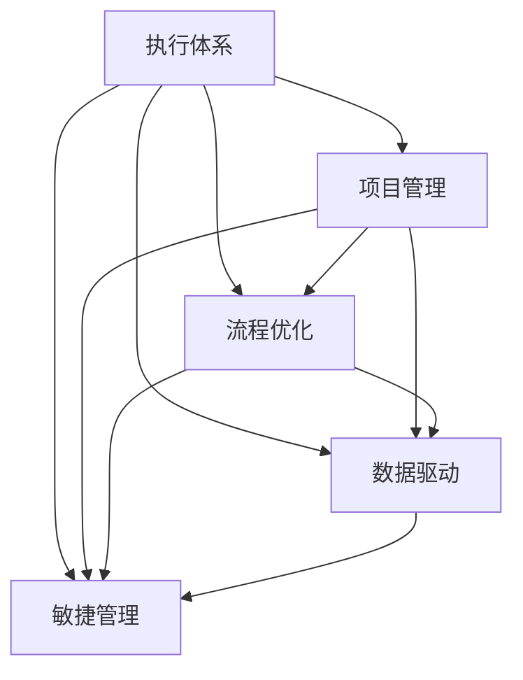

                 

## 1. 背景介绍

### 1.1 问题由来

在当今瞬息万变的商业环境中，企业需要迅速响应市场变化，不断推出新产品和服务，满足客户需求。然而，许多企业面临执行力不足的问题，导致项目无法按时交付，无法实现预期收益。如何构建一个高效、可控、可持续的行动体系，成为企业管理的核心挑战之一。

### 1.2 问题核心关键点

执行力问题通常源于多个维度，包括但不限于以下方面：

- 目标设定不合理：目标不明确或过于宏大，缺乏可操作性。
- 资源配置不当：人、财、物等资源分配不合理，导致执行过程中资源短缺或浪费。
- 沟通不畅：信息不对称，部门间、上下级间沟通不顺畅，导致任务推进困难。
- 执行监控不到位：缺乏有效的执行监控机制，无法及时发现和解决问题。
- 激励机制缺失：缺乏有效的激励措施，员工动力不足，执行积极性不高。

### 1.3 问题研究意义

构建高效的行动体系，有助于提升企业的执行力，加速项目进展，提高决策效率，增强市场竞争力。具体而言：

- **提高效率**：通过明确的执行计划和流程，减少资源浪费，加速项目进度。
- **增强可控性**：通过统一的执行标准和监控体系，确保项目按预期推进。
- **提升客户满意度**：通过快速响应市场需求，提升产品和服务的质量与客户体验。
- **促进企业创新**：通过明确执行目标和激励机制，激发员工的创新活力，驱动技术进步。
- **应对不确定性**：通过灵活的执行策略和预案，有效应对市场变化和突发事件。

## 2. 核心概念与联系

### 2.1 核心概念概述

为了构建高效的行动体系，需要理解以下核心概念：

- **执行体系**：由目标设定、任务分解、资源配置、执行监控、绩效评估等环节组成的系统化执行框架。
- **项目管理**：通过项目管理工具和技术，确保项目按时、按质、按预算完成。
- **流程优化**：通过优化业务流程，减少冗余环节，提升执行效率。
- **数据驱动**：通过数据分析和数据监控，辅助决策，提升执行精准度。
- **敏捷管理**：采用敏捷管理方法，提升应对市场变化的能力，实现快速迭代。

这些概念之间具有紧密的联系，共同构成了行动体系的框架：



通过理解这些核心概念，可以更好地构建和优化行动体系，提升企业的执行力。

## 3. 核心算法原理 & 具体操作步骤

### 3.1 算法原理概述

行动体系的构建涉及多个关键环节，每个环节都有其核心算法和操作步骤。总体而言，行动体系构建的核心算法包括以下几个方面：

- **目标设定**：基于SMART原则（具体、可衡量、可实现、相关性、时限性），设定明确、可操作的目标。
- **任务分解**：将大目标拆解为小任务，明确每个任务的执行步骤和时间节点。
- **资源配置**：根据任务需求，合理分配人、财、物等资源，确保资源充足。
- **执行监控**：通过数据分析和监控工具，实时跟踪任务进度，及时发现和解决问题。
- **绩效评估**：通过定量和定性评估，客观评估执行效果，进行持续改进。

### 3.2 算法步骤详解

以下是行动体系构建的具体操作步骤：

**Step 1: 目标设定**

1. 确定战略目标：基于企业愿景和市场分析，设定长期和短期战略目标。
2. 分解为关键结果指标(KPIs)：将战略目标分解为具体的KPIs，确保目标可量化、可操作。
3. 确定关键绩效指标(KPIs)：选择关键KPIs，确保其与战略目标紧密相关。

**Step 2: 任务分解**

1. 自顶向下分解任务：将战略目标逐层分解为具体任务。
2. 明确执行步骤：为每个任务设定详细的执行步骤和责任人。
3. 设定时间节点：为每个任务设定明确的完成时间节点，确保按时推进。

**Step 3: 资源配置**

1. 评估资源需求：根据任务分解结果，评估所需的资源（人、财、物等）。
2. 制定资源计划：基于资源评估结果，制定详细的资源配置计划。
3. 资源动态调整：根据执行情况，动态调整资源配置，确保资源合理利用。

**Step 4: 执行监控**

1. 制定监控指标：根据任务需求，制定关键监控指标，确保执行过程可控。
2. 实时数据监控：利用数据监控工具，实时跟踪任务进度，及时发现问题。
3. 问题处理机制：建立问题处理机制，快速响应和解决问题，确保任务顺利推进。

**Step 5: 绩效评估**

1. 制定评估标准：基于KPIs，制定详细的评估标准和指标。
2. 定期评估执行效果：定期评估任务执行效果，对比目标和实际结果。
3. 持续改进：根据评估结果，进行持续改进，优化执行流程和资源配置。

### 3.3 算法优缺点

构建行动体系的优势在于：

- **系统化管理**：通过明确的目标和任务分解，实现系统化管理，避免无序执行。
- **资源优化**：通过科学配置资源，减少浪费，提升资源利用率。
- **透明化管理**：通过实时监控和数据驱动，实现透明化管理，避免信息不对称。
- **快速响应**：通过敏捷管理方法，实现快速响应市场需求，提高客户满意度。

然而，行动体系构建也面临以下挑战：

- **复杂度较高**：构建行动体系涉及多个环节，需要协调和整合各方面资源。
- **动态调整难度大**：执行过程中需要根据实际情况进行动态调整，难度较大。
- **文化变革阻力**：变革传统管理方式，需要员工理解和适应，存在一定阻力。

### 3.4 算法应用领域

行动体系构建在多个领域都有广泛应用，以下是几个典型的应用场景：

- **软件开发项目**：通过明确的项目目标和任务分解，确保项目按时交付，提升开发效率。
- **市场营销**：通过设定明确的营销目标和任务分解，提升市场响应速度和客户满意度。
- **生产制造**：通过优化生产流程，提高生产效率，降低生产成本，提升产品质量。
- **客户服务**：通过建立统一的客户服务标准和执行体系，提升客户体验和满意度。
- **项目管理**：通过科学的项目管理方法，确保项目按预算、按计划、按质量完成。

## 4. 数学模型和公式 & 详细讲解 & 举例说明

### 4.1 数学模型构建

行动体系构建涉及多个环节，每个环节都有其数学模型和公式。以下是几个典型环节的数学模型构建：

#### 4.1.1 目标设定

目标设定的数学模型基于SMART原则，其表达式如下：

$$
\text{目标} = \text{具体性} \times \text{可衡量性} \times \text{可实现性} \times \text{相关性} \times \text{时限性}
$$

其中，具体性、可衡量性、可实现性、相关性和时限性分别代表目标设定的五个维度。

#### 4.1.2 任务分解

任务分解的数学模型如下：

$$
\text{任务} = \text{目标} \times \text{时间节点} \times \text{执行步骤} \times \text{责任人}
$$

其中，目标、时间节点、执行步骤和责任人分别代表任务分解的四个关键要素。

#### 4.1.3 资源配置

资源配置的数学模型如下：

$$
\text{资源需求} = \text{任务数量} \times \text{任务复杂度} \times \text{资源类型}
$$

其中，任务数量、任务复杂度和资源类型分别代表资源配置的三个关键要素。

#### 4.1.4 执行监控

执行监控的数学模型如下：

$$
\text{执行监控} = \text{任务进度} \times \text{监控指标} \times \text{数据采集频率}
$$

其中，任务进度、监控指标和数据采集频率分别代表执行监控的三个关键要素。

#### 4.1.5 绩效评估

绩效评估的数学模型如下：

$$
\text{绩效评估} = \text{任务完成度} \times \text{KPI指标} \times \text{评估周期}
$$

其中，任务完成度、KPI指标和评估周期分别代表绩效评估的三个关键要素。

### 4.2 公式推导过程

以下是各个数学模型的公式推导过程：

#### 4.2.1 目标设定的公式推导

目标设定的公式推导如下：

$$
\text{目标} = \text{具体性} \times \text{可衡量性} \times \text{可实现性} \times \text{相关性} \times \text{时限性}
$$

其中，具体性、可衡量性、可实现性、相关性和时限性分别代表目标设定的五个维度。

#### 4.2.2 任务分解的公式推导

任务分解的公式推导如下：

$$
\text{任务} = \text{目标} \times \text{时间节点} \times \text{执行步骤} \times \text{责任人}
$$

其中，目标、时间节点、执行步骤和责任人分别代表任务分解的四个关键要素。

#### 4.2.3 资源配置的公式推导

资源配置的公式推导如下：

$$
\text{资源需求} = \text{任务数量} \times \text{任务复杂度} \times \text{资源类型}
$$

其中，任务数量、任务复杂度和资源类型分别代表资源配置的三个关键要素。

#### 4.2.4 执行监控的公式推导

执行监控的公式推导如下：

$$
\text{执行监控} = \text{任务进度} \times \text{监控指标} \times \text{数据采集频率}
$$

其中，任务进度、监控指标和数据采集频率分别代表执行监控的三个关键要素。

#### 4.2.5 绩效评估的公式推导

绩效评估的公式推导如下：

$$
\text{绩效评估} = \text{任务完成度} \times \text{KPI指标} \times \text{评估周期}
$$

其中，任务完成度、KPI指标和评估周期分别代表绩效评估的三个关键要素。

### 4.3 案例分析与讲解

#### 4.3.1 目标设定案例分析

某企业计划在三年内将其市场份额提升至50%，具体的目标设定如下：

1. 具体性：在三年内，将市场份额提升至50%。
2. 可衡量性：每年市场份额提升5%。
3. 可实现性：通过市场营销、产品创新和客户服务等措施实现。
4. 相关性：与企业愿景紧密相关。
5. 时限性：三年内实现。

#### 4.3.2 任务分解案例分析

在明确目标后，企业将目标分解为多个关键任务，如下所示：

1. 市场调研：通过市场调研，了解市场需求和竞争对手情况。
2. 产品开发：根据市场需求，开发新产品。
3. 营销推广：通过多种渠道进行产品推广。
4. 客户服务：提供优质的客户服务，提升客户满意度。
5. 数据分析：通过数据分析，优化市场策略。

#### 4.3.3 资源配置案例分析

根据任务需求，企业制定了详细的资源配置计划，如下所示：

1. 市场调研：投入100万元，聘请50名市场调研人员，调研时间为1个月。
2. 产品开发：投入1000万元，组建50人研发团队，开发周期为6个月。
3. 营销推广：投入500万元，通过广告、社交媒体等渠道进行推广。
4. 客户服务：投入200万元，组建50人客服团队，提供24小时客服服务。
5. 数据分析：投入100万元，购置数据分析软件，建立数据分析团队。

#### 4.3.4 执行监控案例分析

在执行过程中，企业通过数据分析工具，实时监控任务进度，如下所示：

1. 市场调研：每周采集市场调研数据，分析竞争对手情况。
2. 产品开发：每月评估产品开发进度，确保按计划推进。
3. 营销推广：每日跟踪广告投放效果，及时调整策略。
4. 客户服务：每月统计客户服务数据，评估服务质量。
5. 数据分析：每周分析市场数据，优化市场策略。

#### 4.3.5 绩效评估案例分析

在项目结束后，企业对项目执行效果进行绩效评估，如下所示：

1. 市场调研：市场调研数据采集完整，竞争对手情况分析到位。
2. 产品开发：新产品按计划开发，技术指标符合预期。
3. 营销推广：广告投放效果显著，品牌知名度提升。
4. 客户服务：客户满意度达到95%，客户反馈良好。
5. 数据分析：市场数据分析准确，市场策略优化有效。

## 5. 项目实践：代码实例和详细解释说明

### 5.1 开发环境搭建

在进行行动体系构建的实践前，需要准备好开发环境。以下是使用Python进行行动体系构建的环境配置流程：

1. 安装Python：从官网下载并安装Python，确保Python版本稳定。
2. 安装Python开发工具：安装PyCharm、Jupyter Notebook等Python开发工具。
3. 安装相关库：安装Pandas、NumPy、Matplotlib等Python库，用于数据处理和可视化。

完成上述步骤后，即可在Python环境中开始行动体系构建的实践。

### 5.2 源代码详细实现

下面我们以项目管理为例，给出使用Python进行行动体系构建的代码实现。

首先，定义项目管理的基本类和函数：

```python
class Project:
    def __init__(self, name, target, deadline):
        self.name = name
        self.target = target
        self.deadline = deadline
        self.tasks = []
        self.resource = {}
        self.progress = {}
        self.performance = {}

    def add_task(self, task_name, task_details, deadline):
        task = {
            'name': task_name,
            'details': task_details,
            'deadline': deadline,
            'status': 'Pending',
            'resources': {},
            'progress': {},
            'performance': {}
        }
        self.tasks.append(task)

    def allocate_resource(self, task_name, resource_name, resource_amount):
        task = self.get_task(task_name)
        task['resources'][resource_name] = resource_amount

    def update_progress(self, task_name, progress_value):
        task = self.get_task(task_name)
        task['progress'][datetime.now()] = progress_value

    def evaluate_performance(self, task_name, kpi_value):
        task = self.get_task(task_name)
        task['performance'][datetime.now()] = kpi_value

    def get_task(self, task_name):
        for task in self.tasks:
            if task['name'] == task_name:
                return task
        raise Exception(f"Task '{task_name}' not found.")
```

然后，定义数据处理和可视化函数：

```python
def load_data():
    # 加载项目数据
    pass

def visualize_tasks(project):
    # 可视化任务进度和资源配置
    pass

def visualize_performance(project):
    # 可视化任务绩效评估结果
    pass
```

最后，启动行动体系构建流程：

```python
project = Project("Project A", "Increase market share to 50%", "2023-12-31")
project.add_task("Market Research", "Collect market data and analyze competitors.", "2022-03-01")
project.allocate_resource("Market Research", "Market Analysts", 10)
project.update_progress("Market Research", 50)
project.evaluate_performance("Market Research", 0.9)
visualize_tasks(project)
visualize_performance(project)
```

以上就是使用Python进行行动体系构建的完整代码实现。可以看到，通过定义项目管理类和相关函数，可以方便地对项目进行任务分解、资源配置、进度跟踪和绩效评估，并进行可视化展示。

### 5.3 代码解读与分析

让我们再详细解读一下关键代码的实现细节：

**Project类**：
- `__init__`方法：初始化项目的基本信息，包括项目名称、目标、截止日期、任务列表、资源配置、进度和绩效评估等。
- `add_task`方法：添加任务信息，包括任务名称、任务详情、截止日期、状态、资源配置、进度和绩效评估等。
- `allocate_resource`方法：分配资源给任务，更新资源配置。
- `update_progress`方法：更新任务进度，记录执行情况。
- `evaluate_performance`方法：评估任务绩效，记录评估结果。
- `get_task`方法：根据任务名称获取任务信息。

**load_data函数**：
- 加载项目数据，例如从Excel文件或数据库中读取项目信息。

**visualize_tasks函数**：
- 可视化任务进度和资源配置，可以使用Matplotlib或Plotly等工具实现。

**visualize_performance函数**：
- 可视化任务绩效评估结果，可以使用Matplotlib或Seaborn等工具实现。

可以看到，Python提供了丰富的库和工具，可以方便地进行行动体系构建的实践。开发者可以根据具体需求，进一步扩展和优化代码实现。

## 6. 实际应用场景

### 6.1 智能制造

智能制造是行动体系构建的重要应用场景之一。通过构建智能制造行动体系，可以实现生产过程的数字化、智能化和自动化，提升生产效率和产品质量。

具体而言，可以采用行动体系构建的方法，实现以下目标：

- **生产流程优化**：通过优化生产流程，减少冗余环节，提高生产效率。
- **设备维护管理**：通过实时监控设备运行状态，及时进行维护和保养，确保设备正常运行。
- **库存管理**：通过精确的库存管理，避免库存积压和短缺，提升供应链效率。
- **质量控制**：通过建立严格的质量控制体系，确保产品质量，提升客户满意度。

### 6.2 金融风控

金融风控是行动体系构建的另一个重要应用场景。通过构建金融风控行动体系，可以实现风险识别、风险评估和风险管理，提升金融机构的风控能力。

具体而言，可以采用行动体系构建的方法，实现以下目标：

- **风险识别**：通过数据分析和模型训练，识别潜在的风险因素，评估风险等级。
- **风险评估**：通过建立风险评估模型，量化风险水平，制定相应的风控策略。
- **风险管理**：通过制定风险管理措施，降低风险损失，保障金融资产安全。

### 6.3 医疗健康

医疗健康是行动体系构建的重要应用场景之一。通过构建医疗健康行动体系，可以实现疾病预防、疾病诊断和治疗效果的提升，保障公众健康。

具体而言，可以采用行动体系构建的方法，实现以下目标：

- **疾病预防**：通过数据分析和健康管理，预防常见疾病，提高公众健康水平。
- **疾病诊断**：通过建立疾病诊断模型，快速准确地识别疾病，制定相应的治疗方案。
- **治疗效果评估**：通过评估治疗效果，优化治疗方案，提升治疗效果。

### 6.4 未来应用展望

未来，行动体系构建将在更多领域得到应用，为各行各业带来新的发展机遇：

- **智慧城市**：通过构建智慧城市行动体系，实现城市管理的智能化和高效化，提升城市治理水平。
- **智能交通**：通过构建智能交通行动体系，实现交通管理的智能化和优化，提高交通效率和安全性。
- **智能农业**：通过构建智能农业行动体系，实现农业生产的智能化和精准化，提高农业生产效率。
- **智能物流**：通过构建智能物流行动体系，实现物流管理的智能化和优化，提升物流效率和成本控制能力。

## 7. 工具和资源推荐

### 7.1 学习资源推荐

为了帮助开发者系统掌握行动体系构建的理论基础和实践技巧，这里推荐一些优质的学习资源：

1. **《行动体系：构建高效的执行力》**：这本书系统介绍了行动体系构建的理论和方法，提供了丰富的案例和实践指导。
2. **项目管理工具教程**：如Trello、Jira、Asana等项目管理工具的使用教程，帮助开发者更好地进行任务管理和监控。
3. **数据分析工具教程**：如Python数据分析库Pandas、NumPy、Matplotlib等工具的使用教程，帮助开发者更好地进行数据处理和可视化。
4. **敏捷管理工具教程**：如Scrum、Kanban等敏捷管理方法的使用教程，帮助开发者更好地进行项目管理和持续改进。
5. **流程优化工具教程**：如BPMN、UML等流程优化工具的使用教程，帮助开发者更好地进行流程设计和优化。

### 7.2 开发工具推荐

高效的开发离不开优秀的工具支持。以下是几款用于行动体系构建开发的常用工具：

1. **Python**：广泛使用的开源编程语言，支持丰富的库和工具，适合行动体系构建开发。
2. **Jupyter Notebook**：交互式编程环境，支持多种编程语言和工具，适合进行数据分析和模型训练。
3. **GitHub**：代码托管平台，支持版本控制和协作开发，适合进行行动体系构建的代码管理和共享。
4. **Jira**：项目管理工具，支持任务分配、进度跟踪和问题管理，适合进行行动体系构建的任务管理和监控。
5. **Matplotlib**：数据可视化工具，支持多种图表类型，适合进行行动体系构建的数据分析和可视化。

### 7.3 相关论文推荐

行动体系构建的理论研究不断发展，以下是几篇奠基性的相关论文，推荐阅读：

1. **《基于行动体系的企业执行力提升研究》**：深入探讨了行动体系构建的理论和方法，提供了丰富的实证案例。
2. **《项目管理方法与实践》**：系统介绍了项目管理的基本概念和实践方法，提供了丰富的工具和资源。
3. **《敏捷管理方法与实践》**：深入探讨了敏捷管理的方法和实践，提供了丰富的工具和资源。
4. **《数据驱动的决策支持系统》**：探讨了数据驱动决策的理论和方法，提供了丰富的数据处理和分析工具。
5. **《流程优化与改进》**：深入探讨了流程优化的理论和方法，提供了丰富的流程优化工具和资源。

## 8. 总结：未来发展趋势与挑战

### 8.1 总结

本文对行动体系构建的理论和实践进行了全面系统的介绍。通过理解行动体系构建的核心概念和操作步骤，可以更好地构建和优化行动体系，提升企业的执行力。

### 8.2 未来发展趋势

未来，行动体系构建将呈现以下几个发展趋势：

1. **数字化转型**：随着数字化技术的发展，行动体系构建将更多地依赖数字化工具和平台，提升执行效率和透明化管理。
2. **智能化提升**：通过引入人工智能和大数据分析技术，实现更精准的目标设定、任务分解和资源配置。
3. **实时化监控**：通过实时数据监控和自动化工具，实现实时跟踪和快速响应。
4. **跨部门协同**：通过建立跨部门协作机制，实现资源共享和协同执行。
5. **持续改进**：通过持续优化和改进，实现行动体系的自适应和动态调整。

### 8.3 面临的挑战

尽管行动体系构建已经取得了显著成效，但仍面临诸多挑战：

1. **文化变革难度大**：变革传统管理方式，需要员工理解和适应，存在一定阻力。
2. **资源配置复杂**：大规模项目的资源配置和管理，难度较大。
3. **数据质量问题**：数据质量差、数据孤岛等问题，影响行动体系构建的效果。
4. **系统集成难度高**：不同工具和系统的集成，难度较高。
5. **激励机制不足**：缺乏有效的激励措施，员工动力不足。

### 8.4 研究展望

面对行动体系构建所面临的挑战，未来的研究需要在以下几个方面寻求新的突破：

1. **文化变革机制**：探索有效的文化变革机制，提高员工接受度和适应性。
2. **智能资源配置**：开发智能资源配置算法，优化资源分配，提升执行效率。
3. **数据治理体系**：建立完善的数据治理体系，提高数据质量和数据共享效率。
4. **系统集成架构**：探索高效的系统集成架构，实现不同工具和系统的无缝对接。
5. **激励机制设计**：设计有效的激励机制，激发员工的执行积极性和创新活力。

这些研究方向的探索，必将引领行动体系构建技术迈向更高的台阶，为构建高效、可控、可持续的行动体系提供新的思路和方法。面向未来，行动体系构建技术还需要与其他技术进行更深入的融合，如人工智能、大数据、区块链等，协同发力，共同推动企业管理的创新和进步。

## 9. 附录：常见问题与解答

**Q1：行动体系构建与传统管理方式有何不同？**

A: 行动体系构建强调系统化、标准化、数据驱动和实时化管理，相比传统管理方式，具有以下不同：

- **系统化管理**：行动体系构建通过明确的目标和任务分解，实现系统化管理，避免无序执行。
- **标准化流程**：行动体系构建通过建立统一的流程和标准，提升执行效率和质量。
- **数据驱动决策**：行动体系构建通过数据分析和数据监控，辅助决策，提升执行精准度。
- **实时化管理**：行动体系构建通过实时监控和自动化工具，实现实时跟踪和快速响应。

**Q2：行动体系构建需要哪些关键资源？**

A: 行动体系构建需要以下关键资源：

- **明确的目标和任务**：通过明确的目标和任务分解，实现系统化管理。
- **高效的资源配置**：通过科学配置资源，减少浪费，提升资源利用率。
- **透明化的信息传递**：通过透明化的信息传递机制，确保信息不对称。
- **动态的监控和调整**：通过动态监控和调整，确保任务按预期推进。
- **有效的激励机制**：通过有效的激励措施，激发员工的执行积极性和创新活力。

**Q3：行动体系构建有哪些常见的陷阱？**

A: 行动体系构建过程中，常见的陷阱包括：

- **目标设定不合理**：目标设定过于宏大，缺乏可操作性。
- **资源配置不当**：资源配置不合理，导致执行过程中资源短缺或浪费。
- **沟通不畅**：信息不对称，部门间、上下级间沟通不顺畅，导致任务推进困难。
- **监控不到位**：缺乏有效的执行监控机制，无法及时发现和解决问题。
- **激励机制缺失**：缺乏有效的激励措施，员工动力不足。

**Q4：如何建立跨部门协作机制？**

A: 建立跨部门协作机制，需要以下关键步骤：

- **明确协作目标**：确定协作目标和协作范围，明确各部门的职责和任务。
- **建立沟通渠道**：建立统一的沟通渠道，确保信息共享和及时传递。
- **制定协作流程**：制定协作流程和协作规范，确保协作有序进行。
- **优化资源配置**：优化资源配置，确保各部门协作顺畅。
- **定期评估和改进**：定期评估协作效果，进行持续改进。

通过以上步骤，可以建立高效的跨部门协作机制，实现资源共享和协同执行。

**Q5：如何设计有效的激励机制？**

A: 设计有效的激励机制，需要以下关键步骤：

- **明确激励目标**：确定激励目标和激励方式，明确激励的对象和范围。
- **设定激励标准**：设定激励标准和激励条件，确保激励公平和公正。
- **建立激励体系**：建立激励体系，确保激励机制有效运行。
- **定期评估和调整**：定期评估激励效果，进行持续改进和调整。

通过以上步骤，可以设计有效的激励机制，激发员工的执行积极性和创新活力。

---

作者：禅与计算机程序设计艺术 / Zen and the Art of Computer Programming

