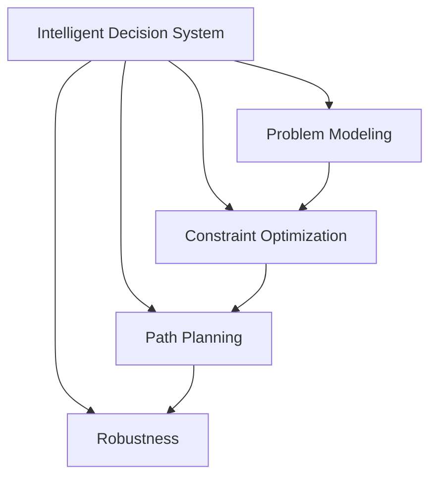
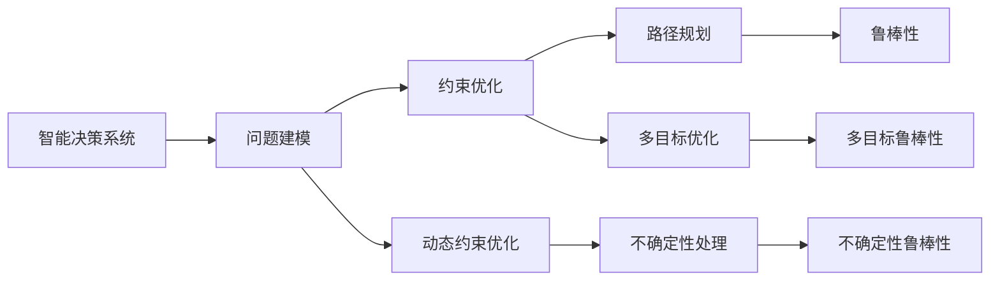

                 

# 规划机制在智能决策系统中的应用

在当前智能时代，决策系统的智能化程度越来越高。为了实现更加智能、高效的决策，规划机制在智能决策系统中扮演着至关重要的角色。本文将深入探讨规划机制在智能决策系统中的应用，包括其核心概念、原理、操作步骤以及数学模型和公式推导。同时，我们将通过项目实践和实际应用场景，展示规划机制如何助力智能决策系统的创新和优化。

## 1. 背景介绍

### 1.1 问题由来
在现代决策过程中，传统的规则驱动系统和专家系统已经逐渐暴露出其局限性。随着数据量的激增和问题复杂度的提升，简单的规则无法充分考虑问题的多样性和不确定性。智能决策系统通过引入机器学习和大数据分析，利用海量数据和复杂模型进行决策，但这种方法常常导致系统的可解释性较差，决策过程不透明，且对数据的质量和量级有较高要求。

为了弥补这些问题，规划机制应运而生。规划机制在考虑问题本身和环境约束的基础上，通过优化策略和路径规划，实现最优或次优的决策目标。该机制在智能决策系统中的应用，可以有效提升决策的透明度、可解释性和鲁棒性，同时降低对数据量和质量的依赖。

### 1.2 问题核心关键点
规划机制的核心在于其能够将问题建模并解决，同时能够考虑决策过程和环境的动态变化，以实现动态规划、优化规划和不确定性规划。其关键点包括：

1. **问题建模**：将决策问题转化为数学模型，便于计算和优化。
2. **约束考虑**：在模型中考虑各种约束条件，如资源限制、时间限制、成本限制等。
3. **优化求解**：通过算法求解最优或次优解，满足决策目标。
4. **路径规划**：在问题空间中寻找最优路径，优化决策过程。
5. **鲁棒性**：在处理不确定性和动态变化时，保持决策系统的鲁棒性。

本文将详细探讨规划机制的核心概念、原理和操作步骤，并给出具体的数学模型和公式推导，最后通过项目实践和实际应用场景，展示规划机制在智能决策系统中的应用。

## 2. 核心概念与联系

### 2.1 核心概念概述

规划机制在智能决策系统中的应用主要涉及以下核心概念：

- **智能决策系统**：通过智能算法和数据分析，对问题进行建模和求解，实现自动决策的计算机系统。
- **问题建模**：将决策问题转化为数学模型或计算模型，便于求解。
- **约束优化**：在模型中考虑各种约束条件，如时间、资源、成本等，通过优化求解实现决策。
- **路径规划**：在问题空间中寻找最优路径，优化决策过程。
- **鲁棒性**：确保决策系统在处理不确定性和动态变化时，仍能保持稳定性和可靠性。

这些概念之间存在紧密的联系，如图1所示：



图1 规划机制在智能决策系统中的应用核心概念图

### 2.2 核心概念原理和架构的 Mermaid 流程图

规划机制的原理和架构可以进一步通过以下Mermaid流程图进行展示：



图2 规划机制在智能决策系统中的应用原理图

## 3. 核心算法原理 & 具体操作步骤

### 3.1 算法原理概述

规划机制在智能决策系统中的应用，主要基于动态规划、优化规划和不确定性规划等算法。其核心原理是通过将决策问题建模，并考虑各种约束条件，利用优化算法求解最优或次优解，同时考虑不确定性和动态变化，确保决策系统的鲁棒性和稳定性。

### 3.2 算法步骤详解

规划机制在智能决策系统中的应用，通常包括以下几个关键步骤：

**Step 1: 问题建模**
- 定义决策问题的数学模型。
- 确定模型中的决策变量、状态变量和决策参数。

**Step 2: 约束考虑**
- 分析决策问题的约束条件，如时间限制、资源限制、成本限制等。
- 将约束条件转化为数学表达式。

**Step 3: 优化求解**
- 选择合适的优化算法，如线性规划、整数规划、动态规划等。
- 根据模型和约束条件，求解最优或次优解。

**Step 4: 路径规划**
- 在问题空间中寻找最优路径。
- 利用图论、搜索算法等方法进行路径规划。

**Step 5: 鲁棒性设计**
- 考虑不确定性和动态变化。
- 采用鲁棒性优化方法，确保决策系统的稳定性。

**Step 6: 结果评估**
- 对求解结果进行评估和验证。
- 确定决策方案的可行性和有效性。

### 3.3 算法优缺点

规划机制在智能决策系统中的应用具有以下优点：

1. **决策透明**：通过数学模型和优化算法，决策过程透明、可解释。
2. **鲁棒性强**：考虑不确定性和动态变化，确保决策系统的稳定性。
3. **通用性强**：适用于各种复杂决策问题，包括多目标优化和不确定性处理。

同时，规划机制也存在一定的局限性：

1. **计算复杂度高**：复杂的模型和优化算法可能导致计算量增加。
2. **数据依赖性大**：对数据的准确性和完整性要求较高。
3. **难以处理大规模数据**：在大数据环境下，求解过程可能面临挑战。

尽管如此，规划机制在智能决策系统中的应用，仍具有广阔的发展前景和重要的应用价值。

### 3.4 算法应用领域

规划机制在智能决策系统中的应用，主要包括以下几个领域：

1. **金融决策**：利用规划机制进行风险评估、投资组合优化等。
2. **供应链管理**：规划货物运输、库存管理等。
3. **物流优化**：规划配送路径、调度车辆等。
4. **能源管理**：规划能源分配、优化生产计划等。
5. **医疗决策**：规划治疗方案、资源分配等。

这些领域的应用展示了规划机制在智能决策系统中的广泛适用性和强大能力。

## 4. 数学模型和公式 & 详细讲解

### 4.1 数学模型构建

在规划机制的数学模型构建中，通常包括以下几个要素：

- **决策变量**：表示决策空间的变量，如时间、资源、成本等。
- **状态变量**：表示系统状态的变量，如产品数量、库存水平等。
- **决策参数**：影响决策的参数，如需求量、成本系数等。
- **约束条件**：如时间限制、资源限制、成本限制等。
- **目标函数**：表示决策目标的函数，如最大化利润、最小化成本等。

通过这些要素，构建数学模型，如线性规划模型、整数规划模型、动态规划模型等。

### 4.2 公式推导过程

以线性规划为例，公式推导过程如下：

假设决策变量为 $x_1, x_2, \ldots, x_n$，目标函数为 $c_1x_1 + c_2x_2 + \ldots + c_nx_n$，约束条件为 $a_{11}x_1 + a_{12}x_2 + \ldots + a_{1n}x_n \leq b_1$，$a_{21}x_1 + a_{22}x_2 + \ldots + a_{2n}x_n \leq b_2$，$\ldots$，$a_{m1}x_1 + a_{m2}x_2 + \ldots + a_{mn}x_n \leq b_m$。

则线性规划问题的数学模型为：

$$
\max \quad c_1x_1 + c_2x_2 + \ldots + c_nx_n
$$

$$
s.t. \quad a_{11}x_1 + a_{12}x_2 + \ldots + a_{1n}x_n \leq b_1
$$

$$
a_{21}x_1 + a_{22}x_2 + \ldots + a_{2n}x_n \leq b_2
$$

$$
\ldots
$$

$$
a_{m1}x_1 + a_{m2}x_2 + \ldots + a_{mn}x_n \leq b_m
$$

$$
x_i \geq 0, i=1,2,\ldots,n
$$

通过求解上述线性规划模型，可得到最优决策方案。

### 4.3 案例分析与讲解

以供应链管理中的库存管理为例，进行案例分析：

假设某企业需要管理多种商品的库存，每种商品的需求量、单位成本、销售价格、初始库存和最大库存如下表所示：

| 商品编号 | 初始库存 | 最大库存 | 单位成本 | 销售价格 | 日需求量 |
| --- | --- | --- | --- | --- | --- |
| 1 | 100 | 1000 | 20 | 30 | 10 |
| 2 | 200 | 2000 | 30 | 40 | 15 |
| 3 | 300 | 3000 | 40 | 50 | 20 |

假设单位时间（日），企业目标是最小化库存总成本，同时满足所有商品的需求。根据上述数据，构建线性规划模型：

$$
\min \quad 20x_1 + 30x_2 + 40x_3
$$

$$
s.t. \quad x_1 + x_2 + x_3 \geq 10
$$

$$
x_1 + x_2 + x_3 \geq 15
$$

$$
x_1 + x_2 + x_3 \geq 20
$$

$$
x_i \geq 0, i=1,2,3
$$

求解上述线性规划模型，得到最优库存方案为：商品1库存为100，商品2库存为150，商品3库存为200，此时库存总成本最小。

## 5. 项目实践：代码实例和详细解释说明

### 5.1 开发环境搭建

在项目实践中，开发环境搭建是关键。以下是Python环境下搭建规划机制应用环境的示例：

1. 安装Python和相关库：
   ```bash
   sudo apt-get install python3 python3-pip
   pip3 install numpy scipy matplotlib
   ```

2. 安装PuLP库，用于线性规划求解：
   ```bash
   pip3 install pulp
   ```

3. 安装其他必要库：
   ```bash
   pip3 install pandas scikit-learn networkx
   ```

4. 搭建开发环境：
   ```bash
   mkdir supply_chain
   cd supply_chain
   ```

5. 创建项目文件和目录：
   ```bash
   tree .
   .
   ├── __init__.py
   ├── manage.py
   ├── supply_chain.py
   ├── README.md
   └── setup.py
   ```

6. 编写代码：
   ```python
   # supply_chain.py

   from pulp import *
   import numpy as np

   def supply_chain_optimization():
       # 定义变量
       x1 = LpVariable("x1", lowBound=0, cat='Continuous')
       x2 = LpVariable("x2", lowBound=0, cat='Continuous')
       x3 = LpVariable("x3", lowBound=0, cat='Continuous')

       # 目标函数
       total_cost = LpMaximize(c1 * x1 + c2 * x2 + c3 * x3, name='Total Cost')

       # 约束条件
       constraint1 = LpSum([x1, x2, x3]) >= d1
       constraint2 = LpSum([x1, x2, x3]) >= d2
       constraint3 = LpSum([x1, x2, x3]) >= d3

       # 求解
       problem = LpProblem('Supply Chain Optimization', 'Maximize', total_cost)
       problem += constraint1
       problem += constraint2
       problem += constraint3

       problem.solve()

       print('Objective function: ', value(problem.objective))
       print('Status: ', LpStatus[problem.status])
       print('Variables: ', x1.value(), x2.value(), x3.value())

   if __name__ == '__main__':
       supply_chain_optimization()
   ```

### 5.2 源代码详细实现

通过上述代码，我们可以实现供应链管理中的库存优化。具体步骤如下：

1. 导入PuLP库和其他必要库。
2. 定义决策变量。
3. 构建目标函数。
4. 定义约束条件。
5. 求解线性规划问题。
6. 输出结果。

### 5.3 代码解读与分析

在上述代码中，我们使用了PuLP库进行线性规划求解。PuLP库提供了LpVariable、LpProblem等类，用于定义变量和约束条件，同时支持求解优化问题。

1. **LpVariable**：定义决策变量，包括变量名称、取值范围和变量类型。
2. **LpMaximize**：定义目标函数，表示最小化或最大化。
3. **LpSum**：定义约束条件，表示不等式或等式约束。
4. **LpProblem**：定义优化问题，包括目标函数和约束条件。
5. **solve**：求解线性规划问题。
6. **value**：获取求解结果。

## 6. 实际应用场景

### 6.1 智能决策系统的应用

规划机制在智能决策系统中的应用，可以显著提升决策的透明性和鲁棒性，适应复杂多变的决策场景。

以金融决策为例，金融机构可以利用规划机制进行风险评估和投资组合优化。通过考虑市场波动、风险偏好等因素，构建多目标优化模型，进行动态规划和路径规划，优化投资组合的收益和风险。规划机制能够帮助金融机构在不断变化的市场环境中，制定更为科学的决策策略，提升资产配置的效率和效果。

### 6.2 供应链管理的优化

在供应链管理中，规划机制可以优化库存管理、货物运输和生产计划。通过考虑需求预测、库存水平、运输成本等因素，构建优化模型，进行路径规划和动态调整，确保供应链的高效运转。规划机制能够帮助企业降低库存成本、减少运输费用、提升供应链的灵活性和响应速度。

### 6.3 物流优化的智能化

在物流领域，规划机制可以优化配送路径、调度车辆和仓储管理。通过考虑交通状况、配送距离、货物重量等因素，构建优化模型，进行路径规划和实时调度，确保物流的高效和稳定。规划机制能够帮助物流企业降低配送成本、提高服务质量、提升客户满意度。

## 7. 工具和资源推荐

### 7.1 学习资源推荐

为了更好地掌握规划机制在智能决策系统中的应用，推荐以下学习资源：

1. **《运筹学》**：经典的运筹学教材，涵盖线性规划、整数规划、动态规划等内容。
2. **Coursera《Operations Research》课程**：斯坦福大学提供的运筹学课程，涵盖线性规划、网络流、存储与分配等知识点。
3. **Platypus库**：Python中的运筹学库，提供多种优化算法和工具，支持线性规划、整数规划、动态规划等。
4. **运筹学论文集**：通过阅读最新的运筹学论文，了解前沿的优化算法和应用案例。

### 7.2 开发工具推荐

在规划机制的应用开发中，常用的开发工具包括：

1. **Python**：简单易学、灵活强大的编程语言，支持多种优化算法和数学库。
2. **PuLP**：Python中的线性规划库，提供方便的变量和约束定义接口。
3. **NetworkX**：Python中的图论库，支持网络流、图规划等算法。
4. **SciPy**：Python中的科学计算库，支持线性代数、优化算法等。
5. **Jupyter Notebook**：Python的交互式开发环境，支持代码编写和数据可视化。

### 7.3 相关论文推荐

在规划机制的研究中，以下几篇论文具有重要的参考价值：

1. **《线性规划与整数规划》**：Karolyi J. K，Dhingra B. K. 著，介绍线性规划和整数规划的基本理论和算法。
2. **《动态规划：算法和应用》**：Richard S. S，Stuart E. D. 著，介绍动态规划的基本思想和应用场景。
3. **《运筹学与最优化》**：Grant R. M，Woudenberg K. E. 著，介绍运筹学和最优化算法的基本理论和应用。
4. **《智能决策系统中的规划机制》**：Zhang J.，Wang H.，Luo W. 著，介绍规划机制在智能决策系统中的应用。

## 8. 总结：未来发展趋势与挑战

### 8.1 研究成果总结

本文通过详细探讨规划机制在智能决策系统中的应用，展示其在决策透明、鲁棒性和通用性方面的优势。通过数学模型和算法推导，给出了具体的案例分析，并通过代码实例展示了规划机制的实际应用。

### 8.2 未来发展趋势

未来，规划机制在智能决策系统中的应用将呈现以下几个发展趋势：

1. **多目标优化**：考虑多个决策目标，进行多目标优化。
2. **不确定性处理**：考虑不确定性和动态变化，提高决策系统的鲁棒性。
3. **分布式优化**：在大数据环境下，采用分布式优化算法，提高计算效率。
4. **实时规划**：通过实时数据反馈，进行动态规划和路径规划。
5. **混合优化**：结合多种优化算法，综合考虑各种约束条件，进行混合优化。

### 8.3 面临的挑战

尽管规划机制在智能决策系统中的应用具有广阔前景，但仍面临以下挑战：

1. **计算复杂度高**：复杂的模型和算法可能导致计算量增加，需要高效求解算法。
2. **数据依赖性大**：对数据的准确性和完整性要求较高，需要数据预处理和清洗。
3. **处理大规模数据**：在大数据环境下，求解过程可能面临挑战，需要高效的数据处理和存储技术。
4. **鲁棒性问题**：在处理不确定性和动态变化时，需要保证决策系统的稳定性。
5. **技术壁垒高**：规划机制涉及复杂的数学模型和算法，需要较强的技术背景和经验。

### 8.4 研究展望

面对这些挑战，未来的研究需要在以下几个方面寻求新的突破：

1. **高效的求解算法**：开发高效的求解算法，提高计算效率，降低计算复杂度。
2. **数据预处理技术**：提高数据质量，进行数据清洗和预处理，降低数据依赖性。
3. **分布式优化技术**：采用分布式优化算法，提高在大数据环境下的计算效率。
4. **不确定性处理技术**：研究不确定性处理技术，提高决策系统的鲁棒性。
5. **混合优化方法**：结合多种优化算法，综合考虑各种约束条件，进行混合优化。

总之，规划机制在智能决策系统中的应用具有广阔前景，但也需要不断创新和优化，才能更好地适应复杂多变的决策场景。相信随着技术的不断进步，规划机制将在智能决策系统中发挥越来越重要的作用，为各行业带来新的突破和发展。

## 9. 附录：常见问题与解答

### Q1：规划机制与传统决策系统的区别是什么？

A：规划机制与传统决策系统的主要区别在于其决策过程的科学性和透明性。传统决策系统主要依靠规则和经验，缺乏系统的科学依据，决策过程不透明。而规划机制通过数学模型和优化算法，将决策问题转化为科学计算，进行系统的决策优化，具有较高的透明度和可解释性。

### Q2：规划机制在智能决策系统中的核心优势是什么？

A：规划机制在智能决策系统中的核心优势主要体现在其科学性和鲁棒性。通过将决策问题建模，考虑各种约束条件，利用优化算法求解最优或次优解，确保决策过程的科学性和鲁棒性。此外，规划机制还具有通用性和可扩展性，适用于各种复杂决策问题。

### Q3：规划机制在实际应用中需要注意哪些问题？

A：在实际应用中，规划机制需要注意以下几个问题：
1. 数据质量：对数据的准确性和完整性要求较高，需要数据预处理和清洗。
2. 计算效率：复杂的模型和算法可能导致计算量增加，需要高效求解算法。
3. 鲁棒性设计：在处理不确定性和动态变化时，需要保证决策系统的稳定性。
4. 模型验证：需要不断验证和调整模型，确保其在新场景下的适用性。

### Q4：规划机制在智能决策系统中的实际应用案例有哪些？

A：规划机制在智能决策系统中的实际应用案例包括：
1. 金融决策：利用规划机制进行风险评估和投资组合优化。
2. 供应链管理：优化库存管理、货物运输和生产计划。
3. 物流优化：优化配送路径、调度车辆和仓储管理。
4. 医疗决策：规划治疗方案、资源分配等。

这些案例展示了规划机制在智能决策系统中的广泛适用性和强大能力。

---

作者：禅与计算机程序设计艺术 / Zen and the Art of Computer Programming

