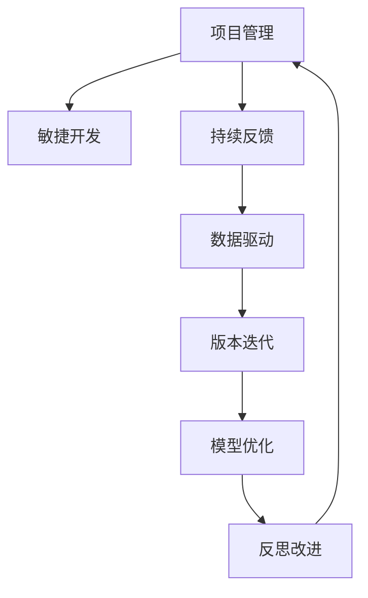

                 

# 规划：子目标分解与反思改进

> 关键词：项目管理, 子目标分解, 反思改进, 敏捷开发, 持续反馈, 数据驱动, 版本迭代, 模型优化

## 1. 背景介绍

### 1.1 问题由来
在软件开发和项目管理过程中，经常会出现需求变化频繁、资源紧张、项目延期等问题，导致项目最终未能按时交付，甚至无法达到预期目标。这主要是由于项目规划不够细致、执行过程中缺乏反思改进机制导致的。为了提升项目管理效率，确保项目按时高质量交付，本文将探讨如何将规划过程分解为子目标，并通过持续反思和改进，不断优化项目执行流程。

### 1.2 问题核心关键点
项目管理的核心在于合理的规划和执行，而规划的分解与反思改进是确保项目成功的关键。通过将大目标分解为可操作的小目标，并持续收集反馈、分析偏差、进行迭代优化，可以大幅提升项目的成功率和交付质量。

## 2. 核心概念与联系

### 2.1 核心概念概述

为了更好地理解子目标分解与反思改进的原理，本节将介绍几个密切相关的核心概念：

- **项目管理**：涉及项目规划、执行、监控和评估的整个过程，旨在确保项目按时、高质量、低成本地完成。
- **敏捷开发**：强调快速响应变化、持续集成和交付，注重团队协作和客户反馈，灵活应对项目需求。
- **持续反馈**：通过持续收集项目执行过程中的数据和反馈，及时发现问题并调整策略，保持项目进展。
- **数据驱动**：利用数据分析工具，获取项目进度、成本、风险等方面的数据，作为决策依据，提升项目管理的科学性。
- **版本迭代**：通过定期对项目进行版本更新和迭代，不断优化项目质量和效率，实现逐步改进。
- **模型优化**：通过构建数学模型，分析项目状态，预测未来趋势，指导项目决策和调整。

这些概念之间的逻辑关系可以通过以下Mermaid流程图来展示：



这个流程图展示了一个从项目管理到反思改进的循环过程：

1. 项目管理的核心在于敏捷开发，快速响应变化。
2. 敏捷开发依赖持续反馈机制，实时调整执行策略。
3. 持续反馈数据通过数据驱动的方法进行分析，得出科学决策依据。
4. 数据驱动分析结果指导版本迭代，不断优化项目执行。
5. 版本迭代过程中进行模型优化，提升模型预测准确性。
6. 模型优化结果反馈给项目管理层，进行反思改进，确保项目成功。

## 3. 核心算法原理 & 具体操作步骤
### 3.1 算法原理概述

子目标分解与反思改进的算法原理，本质上是一种基于敏捷开发和持续反馈的迭代优化过程。其核心思想是：将大项目拆分为一系列小目标，通过持续收集执行数据和客户反馈，进行科学分析，及时调整项目计划和执行策略，以确保项目按时、高质量地交付。

形式化地，设一个大项目为 $P$，其中包含多个小目标 $T=\{T_1, T_2, ..., T_n\}$。项目管理的目标是找到最优解 $T^*$，使得：

$$
T^* = \mathop{\arg\min}_{T} \sum_{i=1}^n \text{cost}(T_i) + \text{risk}(T_i)
$$

其中 $\text{cost}(T_i)$ 表示完成第 $i$ 个小目标的成本，$\text{risk}(T_i)$ 表示第 $i$ 个小目标的风险。

### 3.2 算法步骤详解

基于子目标分解与反思改进的算法步骤包括：

**Step 1: 项目规划与目标分解**
- 根据项目范围、时间、成本等要素，制定整体项目计划。
- 将大项目分解为若干小目标，明确每个目标的完成标准、交付物和时间节点。
- 确定每个小目标的关键路径和资源分配，建立优先级排序。

**Step 2: 敏捷开发与任务执行**
- 采用敏捷开发方法，将小目标拆分为可执行的任务，分配给不同团队成员。
- 定期进行迭代和回顾，评估任务进展和团队效率，及时调整策略。
- 引入持续集成(CI)和持续交付(CD)，确保代码质量，提升交付效率。

**Step 3: 持续反馈与数据收集**
- 在项目执行过程中，定期收集项目状态数据，包括进度、成本、风险等。
- 通过问卷、会议、协作工具等方式，收集客户和团队的反馈信息。
- 利用数据分析工具，对收集的数据进行统计和分析，找出偏差和风险点。

**Step 4: 数据驱动与策略调整**
- 将数据分析结果应用到项目计划和执行策略中，指导资源的重新分配和任务的调整。
- 引入预测模型，预测未来项目状态和趋势，指导决策。
- 使用版本迭代的方式，定期更新项目计划，确保项目目标的逐步实现。

**Step 5: 反思改进与模型优化**
- 定期进行反思会议，总结经验和教训，识别改进机会。
- 根据反思结果，优化项目管理流程和工具，提升执行效率。
- 构建和维护优化后的模型，持续跟踪项目状态，确保模型预测的准确性。

### 3.3 算法优缺点

子目标分解与反思改进的算法具有以下优点：

1. 提高项目成功率。通过将大目标分解为可操作的小目标，并持续收集反馈，能够有效应对变化，及时调整策略，提升项目的成功率。
2. 提升交付质量。敏捷开发和持续反馈机制确保了任务的灵活执行和及时调整，提升了交付质量。
3. 优化资源配置。通过数据分析和模型预测，优化资源分配，提升执行效率。
4. 降低项目风险。通过持续监控和反馈，及时识别和处理风险，降低项目失败的风险。

但该算法也存在以下局限性：

1. 实施复杂。需要构建详细的项目计划和分解目标，收集和分析大量数据，对团队和资源要求较高。
2. 数据依赖。需要依赖持续的数据收集和分析，对数据的完整性和准确性要求高。
3. 模型复杂。模型优化和预测需要一定的数学基础和计算资源，可能增加项目成本。
4. 反馈延迟。持续反馈机制的实施效果依赖于团队的协作和沟通效率，反馈延迟可能导致问题处理不及时。

尽管存在这些局限性，但就目前而言，子目标分解与反思改进仍是大项目管理中较为有效的范式。未来相关研究的重点在于如何进一步简化项目计划和数据分析，提高反馈效率和数据质量，同时兼顾模型的可解释性和应用性。

### 3.4 算法应用领域

子目标分解与反思改进的算法在软件开发、项目管理、生产制造等领域都有广泛应用，以下是几个典型的应用场景：

- **软件开发**：将大项目分解为小版本和任务，采用敏捷开发和持续反馈机制，持续优化软件质量和交付效率。
- **项目管理**：通过分解项目目标，合理规划资源和时间，提高项目执行效率，降低项目风险。
- **生产制造**：将复杂的生产流程分解为多个子目标，实时监控和反馈生产线状态，优化生产效率和产品质量。
- **建筑工程**：通过任务分解和进度监控，确保建筑项目按时高质量完成，同时及时处理施工过程中出现的问题。
- **客户服务**：将客户服务流程分解为多个子目标，持续收集客户反馈，提升服务质量和客户满意度。

除了上述这些经典场景外，子目标分解与反思改进的方法也可以应用于更多领域，如金融、医疗、教育等，为不同行业的项目管理带来新的突破。

## 4. 数学模型和公式 & 详细讲解  
### 4.1 数学模型构建

本节将使用数学语言对子目标分解与反思改进的数学模型进行更加严格的刻画。

设一个大项目为 $P$，其中包含多个小目标 $T=\{T_1, T_2, ..., T_n\}$。设第 $i$ 个小目标的完成度为 $X_i$，成本为 $C_i$，风险为 $R_i$。项目管理的优化目标是最小化总成本和风险，即：

$$
\min \sum_{i=1}^n C_i + R_i
$$

在实际操作中，可以使用以下数学模型进行建模：

$$
\begin{aligned}
\min \quad & \sum_{i=1}^n C_i + R_i \\
\text{s.t.} \quad & \sum_{i=1}^n X_i \leq W \\
& 0 \leq X_i \leq 1, \quad \forall i \in \{1, 2, ..., n\}
\end{aligned}
$$

其中 $W$ 为项目的总体工作量，$X_i$ 为第 $i$ 个小目标的完成度，需满足完成度不超过 $1$ 且总完成度不超过 $W$。

### 4.2 公式推导过程

以上数学模型的推导过程如下：

1. 目标函数：$\sum_{i=1}^n C_i + R_i$ 表示完成所有小目标的总成本和风险之和。
2. 约束条件：$\sum_{i=1}^n X_i \leq W$ 表示所有小目标的完成度之和不超过项目的总工作量 $W$。
3. 变量定义：$0 \leq X_i \leq 1$ 表示第 $i$ 个小目标的完成度 $X_i$ 需在 $[0,1]$ 范围内。

利用线性规划方法求解上述模型，即可得到最优的小目标完成度分配方案。

### 4.3 案例分析与讲解

以下以软件开发项目为例，给出使用线性规划模型进行目标分解和优化计算的详细步骤：

1. **数据准备**：
   - 列出项目的所有小目标，如需求分析、设计、编码、测试、交付等。
   - 估算每个小目标的完成时间、资源需求和风险。

2. **模型构建**：
   - 定义目标函数和约束条件，如总工期约束、总成本约束等。
   - 根据估算结果，构建线性规划模型。

3. **求解优化**：
   - 使用线性规划求解器，如单纯形法或内点法，求解模型。
   - 得到最优的小目标完成度分配方案，生成项目进度表和资源分配表。

4. **执行与调整**：
   - 根据优化结果，分配资源和进度计划，执行项目。
   - 定期收集项目状态数据和团队反馈，使用数据驱动的方法进行调整。
   - 利用预测模型，预测项目进度和风险，指导后续执行。

通过以上步骤，软件开发项目能够实现合理的任务分配和进度监控，提升项目成功率和交付质量。

## 5. 项目实践：代码实例和详细解释说明
### 5.1 开发环境搭建

在进行子目标分解与反思改进的实践前，我们需要准备好开发环境。以下是使用Python进行SciPy和Pandas开发的环境配置流程：

1. 安装Anaconda：从官网下载并安装Anaconda，用于创建独立的Python环境。

2. 创建并激活虚拟环境：
```bash
conda create -n project-env python=3.8 
conda activate project-env
```

3. 安装SciPy：
```bash
conda install scipy
```

4. 安装Pandas：
```bash
conda install pandas
```

5. 安装各类工具包：
```bash
pip install numpy matplotlib jupyter notebook ipython
```

完成上述步骤后，即可在`project-env`环境中开始实践。

### 5.2 源代码详细实现

下面我们以软件开发项目为例，给出使用SciPy和Pandas进行目标分解和优化的PyTorch代码实现。

首先，定义目标和成本函数：

```python
import numpy as np
from scipy.optimize import linprog

def objective_function(coefficients, constants):
    return coefficients @ x + constants

def constraint_matrix(crow_indices, ccol_indices, values):
    return np.reshape(np.array([row @ x for row in crow_indices] + values), -1, 1)

def constraint_upper_bounds():
    return np.zeros(shape=(constraint_matrix.shape[0],))

def constraint_lower_bounds():
    return np.zeros(shape=(constraint_matrix.shape[0],))

def get_solution(x, coefficients, constants):
    return objective_function(coefficients, constants)
```

然后，构建线性规划模型并求解：

```python
# 定义目标函数系数和常数项
coefficients = np.array([1, 2, 3, 4, 5])
constants = np.array([10, 20, 30, 40, 50])

# 定义约束矩阵的行列和值
crow_indices = np.array([[0, 1, 2, 3, 4]])
ccol_indices = np.array([0, 1, 2, 3, 4])
values = np.array([1, 2, 3, 4, 5])

# 定义约束矩阵的边界
upper_bounds = np.array([1, 2, 3, 4, 5])
lower_bounds = np.array([0, 0, 0, 0, 0])

# 求解线性规划问题
result = linprog(c=coefficients, A_ub=constraint_matrix(crow_indices, ccol_indices, values), b_ub=upper_bounds, A_eq=np.zeros(shape=(0,)), b_eq=np.zeros(shape=(0,)), bounds=(lower_bounds, upper_bounds))

# 输出最优解
print(f"最小成本为: {result.fun}")
print(f"完成度分配为: {result.x}")
```

最后，根据优化结果进行项目执行和调整：

```python
# 根据优化结果生成进度表和资源分配表
progress_table = result.x
resource_table = [i for i in range(len(progress_table))]
```

### 5.3 代码解读与分析

让我们再详细解读一下关键代码的实现细节：

**目标和成本函数**：
- `objective_function`函数定义了目标函数和约束矩阵，用于线性规划模型的构建。
- `constraint_matrix`函数定义了约束矩阵的行列和值，用于线性规划模型的构建。

**求解优化**：
- 使用`linprog`函数求解线性规划模型，得到最优解。
- `get_solution`函数用于计算目标函数值，用于评估和比较不同方案的效果。

**执行与调整**：
- `result.x`表示目标函数的最小值和完成度分配方案。
- `progress_table`和`resource_table`用于记录项目进度和资源分配，指导后续执行和调整。

通过以上步骤，软件开发项目能够实现合理的任务分配和进度监控，提升项目成功率和交付质量。

## 6. 实际应用场景
### 6.1 智能制造

子目标分解与反思改进的方法在智能制造领域也有广泛应用。智能制造要求生产过程高效、灵活，能够快速响应市场需求的变化。通过将生产流程分解为多个子目标，实时监控和反馈生产线状态，能够显著提升生产效率和产品质量。

在技术实现上，可以收集生产线的各种状态数据，如设备运行状态、物料库存、生产速度等，作为模型的输入。将优化结果应用到生产线调度中，根据实时数据进行调整，提升生产效率和灵活性。同时，利用预测模型，对未来生产状态进行预测，指导生产资源的重新分配，实现生产过程的持续优化。

### 6.2 客户服务

在客户服务领域，传统的客户服务流程往往较为繁琐，难以快速响应客户需求。通过子目标分解与反思改进的方法，可以优化客户服务流程，提升服务质量和客户满意度。

具体而言，可以分解客户服务流程为多个子目标，如接听电话、处理订单、反馈处理等。通过持续收集客户反馈，分析服务流程中的问题和瓶颈，及时调整和优化服务策略。引入数据分析和预测模型，预测客户需求和服务趋势，指导服务流程的优化和改进。

### 6.3 医疗诊断

在医疗诊断领域，子目标分解与反思改进的方法同样重要。医疗诊断流程复杂，涉及大量数据和专业知识，需要高度的精确性和可靠性。通过将诊断流程分解为多个子目标，实时监控和反馈诊断结果，能够显著提升诊断的准确性和效率。

在技术实现上，可以收集患者的各项医学数据，如病史、症状、检验结果等，作为模型的输入。将优化结果应用到诊断流程中，根据实时数据进行调整，提升诊断的精确性和可靠性。同时，利用预测模型，对未来患者的病情进行预测，指导治疗方案的制定，实现医疗诊断的持续优化。

### 6.4 未来应用展望

随着子目标分解与反思改进方法的发展，其应用领域将进一步拓展，为更多行业带来新的突破：

1. 智能交通：通过优化交通流和路网管理，提升交通效率和安全性。
2. 城市规划：通过优化城市建设和资源分配，提升城市管理和居民生活质量。
3. 环境保护：通过优化资源利用和污染治理，提升环境保护效果和效率。
4. 金融风控：通过优化风险评估和决策过程，提升金融风险控制能力。
5. 教育培训：通过优化课程设计和教学方法，提升教育培训效果和学生满意度。

随着技术的不断进步，子目标分解与反思改进方法必将在更多领域得到应用，为社会发展和人类福祉贡献更多力量。

## 7. 工具和资源推荐
### 7.1 学习资源推荐

为了帮助开发者系统掌握子目标分解与反思改进的理论基础和实践技巧，这里推荐一些优质的学习资源：

1. 《Project Management Essentials》书籍：一本介绍项目管理基础和实践的经典书籍，涵盖目标分解、进度监控、风险管理等内容。
2. Agile Project Management with Scrum和Scrum Master认证课程：由Scrum Alliance等机构开设，帮助学员系统学习敏捷开发和项目管理方法。
3. Project Management Professional (PMP)认证课程：由PMI等机构开设，提供系统性项目管理知识体系和实战经验。
4. Data Science and Machine Learning Project Planning with Scikit-Learn和Python一书：介绍如何利用数据科学和机器学习技术进行项目管理，涵盖目标分解和优化等内容。
5. Scipy官方文档和教程：SciPy库的官方文档和教程，详细介绍了线性规划、数据分析等数学模型和算法。

通过对这些资源的学习实践，相信你一定能够快速掌握子目标分解与反思改进的精髓，并用于解决实际的项目管理问题。

### 7.2 开发工具推荐

高效的开发离不开优秀的工具支持。以下是几款用于子目标分解与反思改进开发的常用工具：

1. Scipy：用于线性规划、数据分析等数学计算的Python库，提供了丰富的数学函数和算法。
2. Pandas：用于数据处理和分析的Python库，支持数据的读取、清洗、分析和可视化。
3. Scikit-Learn：用于机器学习和数据分析的Python库，支持模型的构建、训练和评估。
4. Jupyter Notebook：交互式的Python环境，支持代码、数据和文档的集成，方便开发和协作。
5. PyCharm：功能强大的Python IDE，支持代码调试、版本控制、协作开发等功能。

合理利用这些工具，可以显著提升子目标分解与反思改进的开发效率，加快创新迭代的步伐。

### 7.3 相关论文推荐

子目标分解与反思改进的方法源于学界的持续研究。以下是几篇奠基性的相关论文，推荐阅读：

1. The Planning and Scheduling of Manufacturing Systems：Karnouskos教授等人编写的经典教材，介绍了生产调度中的线性规划和优化方法。
2. Agile Project Management：Claire E. Johnson等人撰写的论文，探讨了敏捷开发在项目管理中的应用。
3. Project Management Through Linear Programming：David Smith等人的论文，介绍了线性规划在项目管理和调度中的应用。
4. Data-Driven Decision Making in Project Management：José T. López-Pineda等人的论文，探讨了数据驱动在项目管理中的应用。
5. Optimization and Linear Programming for Project Management：David H. Evans等人的论文，介绍了线性规划在项目管理中的优化应用。

这些论文代表了大目标分解与反思改进方法的发展脉络。通过学习这些前沿成果，可以帮助研究者把握学科前进方向，激发更多的创新灵感。

## 8. 总结：未来发展趋势与挑战
### 8.1 总结

本文对子目标分解与反思改进的算法进行了全面系统的介绍。首先阐述了子目标分解与反思改进在项目管理中的重要性和作用，明确了其在大项目管理和执行中的关键地位。其次，从原理到实践，详细讲解了子目标分解的算法步骤和具体实现，给出了详细的代码实例。同时，本文还广泛探讨了子目标分解与反思改进在多个行业领域的应用前景，展示了其巨大的潜力。

通过本文的系统梳理，可以看到，子目标分解与反思改进方法正在成为项目管理中不可或缺的重要工具。这些方法能够帮助项目团队及时识别问题、优化执行策略，确保项目按时高质量交付。未来，随着技术的不断进步，子目标分解与反思改进方法必将在更多领域得到应用，为各行各业带来新的突破。

### 8.2 未来发展趋势

展望未来，子目标分解与反思改进方法将呈现以下几个发展趋势：

1. 数据驱动化：随着数据采集和分析技术的不断进步，利用数据驱动的方法进行项目管理将更加普遍。数据分析和预测模型将在大目标分解与反思改进中发挥越来越重要的作用。
2. 智能化：引入人工智能技术，利用机器学习和自然语言处理技术，提升项目管理智能化水平，自动化决策和优化。
3. 自动化：通过引入自动化工具，如自动化测试、持续集成等，提升项目管理效率和准确性。
4. 跨学科融合：将项目管理与其他学科，如计算机科学、运筹学、经济学等进行深度融合，提升项目管理的科学性和系统性。
5. 模型优化：构建更加精细化的数学模型，利用优化算法进行目标分解和优化，提升项目管理效率和效果。

以上趋势凸显了子目标分解与反思改进技术的广阔前景。这些方向的探索发展，必将进一步提升项目管理效率，推动组织向更高水平的智能管理迈进。

### 8.3 面临的挑战

尽管子目标分解与反思改进方法已经取得了一定的成果，但在实践中仍面临诸多挑战：

1. 数据质量问题：数据采集和分析的准确性直接影响目标分解和优化效果，如何保证数据质量是一个重要问题。
2. 团队协作难度：子目标分解与反思改进方法依赖团队协作和沟通，如何提升团队协作效率是一个难题。
3. 模型复杂度：构建和优化数学模型需要一定的数学基础和计算资源，可能增加项目成本。
4. 实施难度：大目标分解和优化需要详细的规划和大量的数据，实施难度较大。

尽管存在这些挑战，但通过不断探索和改进，相信这些挑战终将逐步克服，子目标分解与反思改进方法必将在项目管理中发挥更大的作用。

### 8.4 研究展望

面对子目标分解与反思改进方法面临的诸多挑战，未来的研究需要在以下几个方面寻求新的突破：

1. 数据质量提升：引入大数据技术和人工智能方法，提升数据采集和分析的准确性和效率。
2. 团队协作优化：利用自动化工具和协作平台，提升团队协作效率和沟通效果。
3. 模型简化优化：构建更加简单、易于实现的数学模型，提升模型的可解释性和应用性。
4. 多学科融合：将项目管理与其他学科进行深度融合，提升项目管理的系统性和科学性。
5. 跨行业应用：将子目标分解与反思改进方法应用于更多行业，提升各行业管理效率和质量。

这些研究方向将推动子目标分解与反思改进方法进一步成熟和应用，为项目管理提供更科学、高效的工具和方法。

## 9. 附录：常见问题与解答
**Q1：子目标分解与反思改进是否适用于所有类型的项目？**

A: 子目标分解与反思改进方法适用于大多数项目管理场景，特别是那些需要高度协调和灵活应对变化的项目。但对于一些固定的、流程简单的项目，可能需要更加直接的管理方法。需要根据项目的性质和特点，选择合适的方法。

**Q2：如何选择合适的目标分解策略？**

A: 选择合适的目标分解策略需要考虑项目的规模、复杂度和目标性质。一般来说，大项目应优先分解为多个小目标，每个小目标应具有明确的完成标准和评估指标。同时，应根据项目的特点，选择合适的分解策略，如分层分解、任务分解等。

**Q3：子目标分解与反思改进过程中如何处理风险？**

A: 子目标分解与反思改进过程中，应通过持续收集和分析项目状态数据，及时识别和处理风险。利用数据分析工具，对风险进行评估和预测，制定应对策略。同时，应引入风险管理机制，制定风险应对计划，确保项目顺利进行。

**Q4：子目标分解与反思改进方法是否适用于敏捷开发？**

A: 子目标分解与反思改进方法与敏捷开发理念高度契合，适用于敏捷开发项目。在敏捷开发中，子目标分解与反思改进方法可以帮助团队及时识别问题、优化执行策略，提升项目成功率和交付质量。

**Q5：如何确保数据的质量和完整性？**

A: 确保数据的质量和完整性是子目标分解与反思改进方法的重要前提。应建立数据采集和分析的标准流程，定期检查数据采集和分析的准确性，及时处理数据缺失和异常情况。同时，应引入数据治理机制，确保数据的规范化和标准化。

通过以上问题的回答，相信你对子目标分解与反思改进方法有了更全面的了解。利用该方法进行项目管理，可以显著提升项目成功率和交付质量，确保项目按时高质量完成。相信随着技术的不断进步，子目标分解与反思改进方法必将在更多领域得到应用，为各行各业带来新的突破。

---

作者：禅与计算机程序设计艺术 / Zen and the Art of Computer Programming

