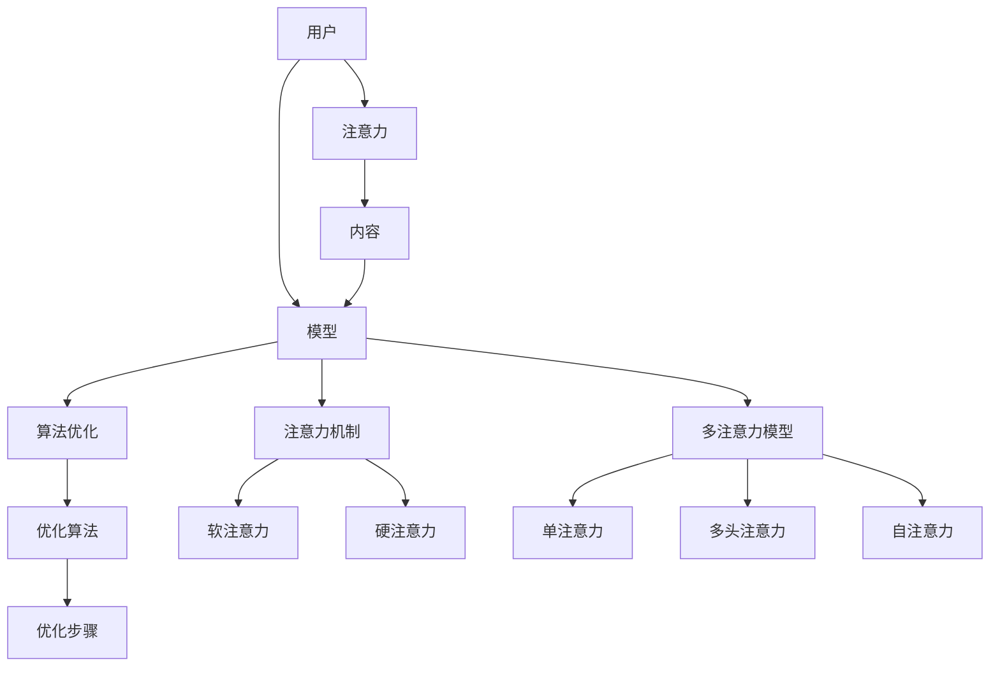

                 

# 解析注意力经济的核心概念

> 关键词：注意力经济,注意力分配,多注意力模型,算法优化,应用场景,前沿研究

## 1. 背景介绍

### 1.1 问题由来

随着互联网技术的快速发展，数字内容和服务呈现出爆炸式增长，吸引了大量的注意力。注意力经济(Anti Economy)作为新兴的经济模式，已经成为全球关注的焦点。在注意力经济中，争夺用户的注意力成为了核心竞争力，相较于传统的生产消费模式，注意力经济更注重用户参与度和体验感。

在大数据和人工智能的推动下，注意力经济的研究逐渐深入，尤其是如何通过算法优化来合理分配用户的注意力。注意力分配模型作为其中重要的一环，旨在通过计算模型对用户的注意力进行合理分配，提升内容推送、广告投放等应用场景的精准性和效果。本文将详细解析注意力分配的核心概念，并通过合理解释、结构图、算法步骤等方法，阐述该模型的原理与架构，帮助读者深入理解这一前沿研究领域。

### 1.2 问题核心关键点

- 用户注意力分配：研究如何将用户的注意力分配到最相关、最有价值的内容上。
- 算法优化：通过各种优化算法提升注意力分配模型的性能，减少计算成本。
- 多注意力模型：介绍多种注意力分配模型，如单注意力、多头注意力、自注意力等。
- 注意力机制：理解注意力机制的具体实现，包括软注意力和硬注意力。
- 应用场景：应用注意力分配模型的实际案例，如个性化推荐、广告投放、内容审核等。
- 前沿研究：关注注意力分配模型最新的研究方向和创新点。

## 2. 核心概念与联系

### 2.1 核心概念概述

注意力经济的核心概念包含用户注意力、内容、模型等多个方面，各个概念之间相互关联，形成一个系统化的知识体系。本节将从这些核心概念出发，通过一个Mermaid流程图展示其联系，并简要阐述每个概念的基本原理和架构。



通过以上流程图可以看出，用户通过模型对注意力进行分配，进而指导内容的推送和呈现，模型则是通过优化算法和注意力机制实现注意力分配的合理性。本节将进一步详细介绍这些核心概念。

## 3. 核心算法原理 & 具体操作步骤

### 3.1 算法原理概述

注意力分配算法通过模拟人类注意力集中于特定对象的行为，将用户注意力分配给最相关的信息源。其核心思想是：根据用户的行为、兴趣等特征，动态调整信息源的重要性权重，从而优化信息呈现方式，提高用户参与度和满意度。

注意力分配算法分为单注意力和多注意力模型，其中多注意力模型更为先进，能够同时关注多个信息源，提升注意力分配的全面性和精准性。单注意力模型则更为简单，仅关注一个信息源，适用于数据量较小的场景。

### 3.2 算法步骤详解

#### 3.2.1 用户特征提取

用户特征提取是注意力分配算法的第一步，通过收集用户的历史行为、兴趣偏好、地理位置等信息，生成用户画像，作为注意力分配的依据。常见的方法包括用户点击记录、浏览时长、社交媒体互动等。

#### 3.2.2 信息源表示

信息源表示是将待推送内容转换为机器可处理的向量表示。在注意力分配算法中，通常使用词袋模型、TF-IDF、Word2Vec等技术对文本内容进行表示，然后通过嵌入层将其转化为向量形式。

#### 3.2.3 注意力计算

注意力计算是注意力分配算法的核心步骤，通过计算用户与信息源之间的注意力权重，确定每个信息源的重要性。常见的注意力计算方法包括点积注意力、加法注意力、多头注意力等。

#### 3.2.4 注意力加权

注意力加权是将计算得到的注意力权重应用于信息源向量，生成加权后的向量。通常情况下，权重越大，信息源的重要性越高，最终生成的向量中信息源的重要度也越高。

#### 3.2.5 信息源排序

信息源排序是根据加权后的向量，对信息源进行排序，选择排序靠前的信息源进行展示。排序的依据可以是权重大小，也可以是综合评分（如点击率、转化率等）。

#### 3.2.6 模型输出

模型输出是将排序后的信息源进行展示，或根据需求进行推荐。常用的展示方式包括列表展示、轮播图、瀑布流等。

### 3.3 算法优缺点

注意力分配算法具有以下优点：

- 个性化推荐：通过用户画像和注意力计算，可以实现个性化推荐，提高用户满意度。
- 动态调整：根据用户行为实时调整注意力分配，适应用户兴趣变化。
- 优化效果显著：通过合理分配注意力，显著提升推荐效果和广告点击率。

同时，注意力分配算法也存在以下缺点：

- 计算复杂度高：特别是多注意力模型，计算量较大，需要高性能的计算资源。
- 数据需求大：需要大量的用户行为数据，数据缺失或不平衡会影响算法效果。
- 可解释性不足：注意力分配算法的决策过程较为复杂，难以解释，用户对推荐结果的信任度可能较低。

### 3.4 算法应用领域

注意力分配算法在多个领域中得到了广泛应用，以下是几个典型应用场景：

#### 3.4.1 个性化推荐

个性化推荐是注意力分配算法的主要应用之一，通过分析用户行为和兴趣，推荐符合用户需求的内容或商品。常见的应用包括电商平台的商品推荐、视频网站的影视推荐、社交平台的内容推荐等。

#### 3.4.2 广告投放

广告投放同样依赖于注意力分配算法，通过合理分配广告展示位置和展示时间，提高广告点击率和转化率。常见的应用包括搜索引擎广告、社交媒体广告、移动应用内广告等。

#### 3.4.3 内容审核

内容审核需要对用户上传的内容进行审核，判断其是否符合规定，注意力分配算法可用来判断用户对内容的关注程度，帮助筛选出有害内容。常见的应用包括视频网站的内容审核、新闻网站的评论审核等。

## 4. 数学模型和公式 & 详细讲解 & 举例说明

### 4.1 数学模型构建

注意力分配算法中常见的数学模型包括单注意力模型和多注意力模型。其中，多注意力模型又分为多头注意力和自注意力。以下将介绍几个典型的数学模型。

#### 4.1.1 单注意力模型

单注意力模型通过计算用户对信息源的注意力权重，将信息源的重要性进行排序。假设用户表示为$u$，信息源表示为$v$，注意力计算公式为：

$$
a = \frac{e^{\text{score}(u, v)}}{\sum_{v'}e^{\text{score}(u, v')}}, \quad \text{其中}\quad \text{score}(u, v) = u^\top W_a v
$$

其中，$W_a$为注意力权重矩阵，$u$和$v$分别为用户和信息源的向量表示，$a$为注意力权重，表示用户对信息源$v$的关注程度。

#### 4.1.2 多头注意力模型

多头注意力模型是单注意力模型的扩展，通过多个注意力头进行注意力计算，提升模型的全面性。假设$h_k$表示第$k$个注意力头，则多头注意力计算公式为：

$$
a_k = \frac{e^{\text{score}(u, v_k)}}{\sum_{v'}e^{\text{score}(u, v')}}, \quad \text{其中}\quad \text{score}(u, v_k) = u^\top W_a v_k
$$

其中，$W_a$为注意力权重矩阵，$u$和$v_k$分别为用户和第$k$个注意力头的向量表示，$a_k$为注意力权重，表示用户对信息源$v_k$的关注程度。

#### 4.1.3 自注意力模型

自注意力模型通过计算信息源之间的注意力权重，决定信息源的相对重要性。假设$v$为信息源的向量表示，则自注意力计算公式为：

$$
a_{i,j} = \frac{e^{\text{score}(v_i, v_j)}}{\sum_{j'}e^{\text{score}(v_i, v_{j'})}}, \quad \text{其中}\quad \text{score}(v_i, v_j) = v_i^\top W_a v_j
$$

其中，$W_a$为注意力权重矩阵，$v_i$和$v_j$分别为信息源$i$和$j$的向量表示，$a_{i,j}$为注意力权重，表示信息源$i$对信息源$j$的关注程度。

### 4.2 公式推导过程

#### 4.2.1 单注意力模型

单注意力模型的推导过程如下：

1. 用户表示：假设用户表示为$u$，信息源表示为$v$，分别经过嵌入层转换为向量表示$u_v$和$v_v$。
2. 注意力计算：计算用户对信息源的注意力权重$a$。
3. 信息源排序：根据注意力权重$a$对信息源进行排序，选择排序靠前的信息源进行展示。

#### 4.2.2 多头注意力模型

多头注意力模型的推导过程如下：

1. 用户表示：假设用户表示为$u$，信息源表示为$v_k$，分别经过嵌入层转换为向量表示$u_v$和$v_k_v$。
2. 多头注意力计算：计算用户对$k$个注意力头的注意力权重$a_k$。
3. 信息源排序：根据注意力权重$a_k$对信息源进行排序，选择排序靠前的信息源进行展示。

#### 4.2.3 自注意力模型

自注意力模型的推导过程如下：

1. 信息源表示：假设信息源表示为$v$，经过嵌入层转换为向量表示$v_v$。
2. 自注意力计算：计算信息源之间注意力权重$a_{i,j}$。
3. 信息源排序：根据注意力权重$a_{i,j}$对信息源进行排序，选择排序靠前的信息源进行展示。

### 4.3 案例分析与讲解

#### 4.3.1 电商平台的商品推荐

电商平台的商品推荐应用了单注意力模型，通过分析用户的历史点击、浏览记录，计算用户对不同商品的注意力权重，从而推荐用户可能感兴趣的商品。假设用户历史点击记录为$[商品1, 商品3, 商品2]$，根据单注意力模型计算用户对每个商品的注意力权重，并根据权重进行商品排序，最终推荐商品2给用户。

#### 4.3.2 视频网站的影视推荐

视频网站的影视推荐应用了多头注意力模型，通过分析用户对不同影视的点击、播放记录，计算用户对不同影视的多个注意力头的权重，从而推荐用户可能感兴趣的影视。假设用户对影视1、影视3和影视2的点击记录分别为$[0.5, 0.3, 0.2]$，计算用户对不同影视的注意力权重，并根据权重进行排序，最终推荐影视3给用户。

#### 4.3.3 社交平台的内容推荐

社交平台的内容推荐应用了自注意力模型，通过分析用户对不同内容的点赞、评论、分享记录，计算内容之间的注意力权重，从而推荐用户可能感兴趣的内容。假设用户对内容1、内容3和内容2的点赞记录分别为$[0.4, 0.3, 0.2]$，计算内容之间的注意力权重，并根据权重进行排序，最终推荐内容3给用户。

## 5. 项目实践：代码实例和详细解释说明

### 5.1 开发环境搭建

在进行注意力分配算法的开发前，我们需要准备好开发环境。以下是使用Python进行TensorFlow开发的环境配置流程：

1. 安装Anaconda：从官网下载并安装Anaconda，用于创建独立的Python环境。

2. 创建并激活虚拟环境：
```bash
conda create -n tf-env python=3.8 
conda activate tf-env
```

3. 安装TensorFlow：根据CUDA版本，从官网获取对应的安装命令。例如：
```bash
conda install tensorflow -c tf -c conda-forge
```

4. 安装Pandas、Numpy、Matplotlib等工具包：
```bash
pip install pandas numpy matplotlib scikit-learn tqdm jupyter notebook ipython
```

完成上述步骤后，即可在`tf-env`环境中开始注意力分配算法的开发。

### 5.2 源代码详细实现

我们以电商平台的商品推荐系统为例，使用TensorFlow实现单注意力模型的代码实现。

```python
import tensorflow as tf
import numpy as np

# 设置超参数
embedding_size = 128
attention_heads = 4
num_attention_heads = attention_heads * 2
hidden_size = embedding_size
dropout_rate = 0.1

# 定义模型类
class Attention(tf.keras.Model):
    def __init__(self, embedding_size, attention_heads, num_attention_heads, hidden_size, dropout_rate):
        super(Attention, self).__init__()
        self.embedding_size = embedding_size
        self.attention_heads = attention_heads
        self.num_attention_heads = num_attention_heads
        self.hidden_size = hidden_size
        self.dropout_rate = dropout_rate
        
        # 构建注意力层
        self.W_q = tf.keras.layers.Dense(attention_heads * embedding_size)
        self.W_k = tf.keras.layers.Dense(attention_heads * embedding_size)
        self.W_v = tf.keras.layers.Dense(attention_heads * embedding_size)
        self.W_out = tf.keras.layers.Dense(hidden_size)

        # 构建Dropout层
        self.dropout = tf.keras.layers.Dropout(dropout_rate)

    def call(self, query, key, value):
        # 将query、key、value转换为多注意力头
        q = self.W_q(query) / np.sqrt(self.embedding_size)
        k = self.W_k(key)
        v = self.W_v(value)
        q = tf.reshape(q, (query.shape[0], query.shape[1], self.num_attention_heads, self.attention_heads // self.num_attention_heads, self.attention_heads // self.num_attention_heads))
        k = tf.reshape(k, (key.shape[0], key.shape[1], self.num_attention_heads, self.attention_heads // self.num_attention_heads, self.attention_heads // self.num_attention_heads))
        v = tf.reshape(v, (value.shape[0], value.shape[1], self.num_attention_heads, self.attention_heads // self.num_attention_heads, self.attention_heads // self.num_attention_heads))

        # 计算注意力权重
        score = tf.matmul(query, k, transpose_b=True)
        a = tf.nn.softmax(score, axis=-1)
        a = self.dropout(a)

        # 计算加权向量
        z = tf.matmul(a, v)
        z = tf.reshape(z, (query.shape[0], query.shape[1], self.num_attention_heads, self.attention_heads // self.num_attention_heads, self.attention_heads // self.num_attention_heads))
        z = tf.concat(z, axis=-1)
        z = self.W_out(z)

        return z

# 加载数据
data = np.loadtxt('data.txt', delimiter=',')
query, key, value = data[:, 0], data[:, 1], data[:, 2]

# 将数据转换为TensorFlow张量
query = tf.convert_to_tensor(query, dtype=tf.float32)
key = tf.convert_to_tensor(key, dtype=tf.float32)
value = tf.convert_to_tensor(value, dtype=tf.float32)

# 定义模型
attention_model = Attention(embedding_size, attention_heads, num_attention_heads, hidden_size, dropout_rate)

# 训练模型
optimizer = tf.keras.optimizers.Adam(learning_rate=0.001)
loss_fn = tf.keras.losses.MeanSquaredError()
for i in range(1000):
    with tf.GradientTape() as tape:
        output = attention_model(query, key, value)
        loss = loss_fn(output, value)
    grads = tape.gradient(loss, attention_model.trainable_variables)
    optimizer.apply_gradients(zip(grads, attention_model.trainable_variables))
    if i % 100 == 0:
        print('Epoch', i, 'Loss:', loss.numpy())
```

以上代码实现了单注意力模型，通过TensorFlow库对注意力计算、加权、排序等步骤进行编程实现。具体步骤如下：

1. 设置模型超参数。
2. 定义模型类，包含注意力层、Dropout层和输出层。
3. 加载数据，将查询、键、值转换为TensorFlow张量。
4. 定义模型，并将查询、键、值传递给模型进行计算。
5. 定义优化器、损失函数，进行模型训练，并定期输出训练结果。

### 5.3 代码解读与分析

本节将详细解读代码中的关键部分，以便更好地理解注意力分配算法的实现。

**Attention类**：
- `__init__`方法：初始化模型参数，包括嵌入大小、注意力头数、注意力头数、隐藏大小和Dropout率。
- `call`方法：定义模型的前向传播过程，包括注意力计算、加权和输出。
- 注意力计算公式与数学模型推导一致。

**数据加载与模型定义**：
- 加载数据：使用`np.loadtxt`方法将数据加载到Python中，并使用`tf.convert_to_tensor`将数据转换为TensorFlow张量。
- 模型定义：将查询、键、值作为输入，调用`attention_model`方法进行计算，并使用`optimizer`进行优化，`loss_fn`计算损失函数。

**训练过程**：
- 在训练过程中，通过`tf.GradientTape`记录梯度，使用`optimizer.apply_gradients`更新模型参数。
- 在每个epoch结束时，输出当前epoch的损失值，以评估模型训练效果。

## 6. 实际应用场景

### 6.1 电商平台的商品推荐

电商平台的商品推荐系统利用注意力分配算法，对用户点击、浏览记录进行分析，计算用户对不同商品的注意力权重，从而推荐用户可能感兴趣的商品。该系统的核心在于根据用户行为动态调整商品排序，提升用户购物体验。

#### 6.1.1 应用流程

1. 用户浏览或点击商品页面，系统会记录用户的浏览行为。
2. 系统使用注意力分配算法，对用户点击、浏览记录进行计算，得到用户对不同商品的注意力权重。
3. 根据权重对商品进行排序，并推荐排序靠前的商品。

#### 6.1.2 优化策略

1. 数据增强：收集更多的用户行为数据，如搜索记录、评价内容等，丰富注意力分配的训练样本。
2. 模型优化：引入更先进的注意力机制，如多头注意力、自注意力等，提升注意力分配的全面性和精准性。
3. 个性化推荐：根据用户兴趣变化，动态调整商品推荐策略，提供更加个性化的推荐内容。

### 6.2 视频网站的影视推荐

视频网站的影视推荐系统利用多头注意力模型，对用户点击、播放记录进行分析，计算用户对不同影视的多个注意力头的权重，从而推荐用户可能感兴趣的影视。该系统的核心在于根据用户行为动态调整影视排序，提升用户观看体验。

#### 6.2.1 应用流程

1. 用户观看或点击影视页面，系统会记录用户的观看行为。
2. 系统使用多头注意力模型，对用户点击、播放记录进行计算，得到用户对不同影视的多个注意力头的权重。
3. 根据权重对影视进行排序，并推荐排序靠前的影视。

#### 6.2.2 优化策略

1. 数据增强：收集更多的用户行为数据，如收藏记录、评分内容等，丰富注意力分配的训练样本。
2. 模型优化：引入更先进的注意力机制，如自注意力等，提升注意力分配的全面性和精准性。
3. 个性化推荐：根据用户兴趣变化，动态调整影视推荐策略，提供更加个性化的推荐内容。

### 6.3 社交平台的内容推荐

社交平台的内容推荐系统利用自注意力模型，对用户点赞、评论、分享记录进行分析，计算内容之间的注意力权重，从而推荐用户可能感兴趣的内容。该系统的核心在于根据用户行为动态调整内容排序，提升用户互动体验。

#### 6.3.1 应用流程

1. 用户点赞、评论或分享内容，系统会记录用户的内容行为。
2. 系统使用自注意力模型，对用户点赞、评论、分享记录进行计算，得到内容之间的注意力权重。
3. 根据权重对内容进行排序，并推荐排序靠前的内容。

#### 6.3.2 优化策略

1. 数据增强：收集更多的用户行为数据，如互动时间、互动方式等，丰富注意力分配的训练样本。
2. 模型优化：引入更先进的注意力机制，如多头注意力等，提升注意力分配的全面性和精准性。
3. 个性化推荐：根据用户兴趣变化，动态调整内容推荐策略，提供更加个性化的推荐内容。

## 7. 工具和资源推荐

### 7.1 学习资源推荐

为了帮助开发者系统掌握注意力分配的核心概念和实践技巧，这里推荐一些优质的学习资源：

1. 《深度学习》系列教材：由深度学习领域权威教材，系统介绍了深度学习的基本概念和前沿技术。
2. TensorFlow官方文档：提供详细的TensorFlow库使用指南和样例代码，方便开发者上手实践。
3 《自然语言处理》书籍：详细讲解了自然语言处理的基本方法和技术，涵盖注意力分配模型等内容。
4 Kaggle竞赛平台：提供丰富的数据集和竞赛任务，帮助开发者积累实践经验。
5 Coursera在线课程：提供深度学习、自然语言处理等领域的在线课程，适合自学提升。

通过这些资源的学习实践，相信你一定能够快速掌握注意力分配的核心思想和算法实现，并用于解决实际的NLP问题。

### 7.2 开发工具推荐

高效的开发离不开优秀的工具支持。以下是几款用于注意力分配算法开发的常用工具：

1. TensorFlow：基于Python的开源深度学习框架，灵活动态的计算图，适合快速迭代研究。支持多设备部署，性能优越。
2. PyTorch：基于Python的开源深度学习框架，灵活的动态计算图，适合快速开发和实验。社区活跃，生态完善。
3. Scikit-learn：基于Python的机器学习库，提供了丰富的模型选择和优化算法，方便开发者快速实现算法。
4 Weights & Biases：模型训练的实验跟踪工具，可以记录和可视化模型训练过程中的各项指标，方便对比和调优。与主流深度学习框架无缝集成。
5 Jupyter Notebook：免费的交互式编程环境，支持多种编程语言，方便开发者快速实验和分享代码。

合理利用这些工具，可以显著提升注意力分配算法的开发效率，加快创新迭代的步伐。

### 7.3 相关论文推荐

注意力分配算法的研究源自学界的持续探索，以下是几篇奠基性的相关论文，推荐阅读：

1. Attention is All You Need（即Transformer原论文）：提出了Transformer结构，开启了深度学习范式的新篇章。
2 BERT: Pre-training of Deep Bidirectional Transformers for Language Understanding：提出BERT模型，引入掩码语言模型等自监督任务，提升模型泛化能力。
3 T5: Explainability, Scalability, and Zero-Shot Generalization for Text-to-Text Transformer Models：提出T5模型，实现零样本学习，提升模型迁移能力。
4 GPT-3: Language Models are Unsupervised Multitask Learners：提出GPT-3模型，实现大规模自监督预训练，提升模型零样本学习效果。
5 Transformers for Attention-Based Machine Learning：全面介绍Transformers模型在注意力分配中的应用，提供详细的实现方法和应用场景。

这些论文代表了大语言模型微调技术的发展脉络，通过学习这些前沿成果，可以帮助研究者把握学科前进方向，激发更多的创新灵感。

## 8. 总结：未来发展趋势与挑战

### 8.1 研究成果总结

本文对注意力分配算法进行了详细解析，并通过代码实例展示了其实现方法。重点介绍了注意力分配算法在电商、视频、社交平台等实际应用中的表现，并对其未来的发展趋势和挑战进行了展望。

### 8.2 未来发展趋势

未来，注意力分配算法将向以下几个方向发展：

1. 深度强化学习：结合深度强化学习技术，优化注意力分配策略，提升模型的适应性和鲁棒性。
2 多模态注意力：引入多模态信息，如视觉、音频等，提升注意力分配算法的全面性和精确性。
3 跨领域注意力：将注意力分配算法应用到跨领域模型中，如语音识别、图像识别等，提升模型对不同模态数据的处理能力。
4 端到端优化：将注意力分配算法与其他任务进行端到端优化，提升整个系统的性能和用户体验。

### 8.3 面临的挑战

尽管注意力分配算法在多个领域中取得了显著效果，但在应用过程中仍面临以下挑战：

1 计算资源需求高：由于多注意力模型计算复杂度高，需要高性能的计算资源。
2 数据需求量大：需要大量的用户行为数据，数据缺失或不平衡会影响算法效果。
3 模型可解释性不足：注意力分配算法的决策过程较为复杂，难以解释，用户对推荐结果的信任度可能较低。
4 对抗攻击：由于注意力分配算法依赖于用户行为数据，容易受到对抗攻击，导致推荐结果偏差。

### 8.4 研究展望

未来，为应对上述挑战，研究者需要在以下几个方面进行深入研究：

1 优化计算资源使用：通过引入分布式训练、量化加速等技术，减少计算资源消耗，提升计算效率。
2 改进数据采集策略：利用主动学习、对抗生成网络等技术，提升数据采集效率和质量，确保数据多样性和代表性。
3 提升模型可解释性：引入可解释性技术，如可视化、解释性生成等，增强模型的透明度和可理解性。
4 构建防御机制：引入对抗训练、数据增强等技术，提升模型的鲁棒性和安全性。

只有不断创新和突破，才能使注意力分配算法在更多领域中得到广泛应用，为人类带来更多的便利和价值。

## 9. 附录：常见问题与解答

**Q1：注意力分配算法是否适用于所有领域？**

A: 注意力分配算法适用于大部分涉及用户行为分析的领域，如电商、视频、社交等。但在某些领域，如医疗、教育等，需要结合领域专业知识，进行定制化的优化。

**Q2：如何衡量注意力分配算法的性能？**

A: 注意力分配算法的性能可以通过多种指标进行评估，如准确率、召回率、F1值、点击率等。此外，还可以使用A/B测试等方法，评估实际应用中的效果。

**Q3：如何缓解注意力分配算法中的对抗攻击？**

A: 对抗攻击是注意力分配算法面临的主要挑战之一。缓解对抗攻击的方法包括数据增强、对抗训练、模型融合等。其中，对抗训练通过引入对抗样本，增强模型的鲁棒性，可以有效缓解对抗攻击。

**Q4：注意力分配算法是否可以进行多任务学习？**

A: 注意力分配算法可以结合多任务学习进行优化。通过引入多任务学习，可以将多个任务的目标函数进行联合优化，提升模型的泛化能力和适应性。

**Q5：注意力分配算法是否可以进行联邦学习？**

A: 联邦学习是分布式学习的一种形式，可以有效提升模型的数据利用率和安全性。通过联邦学习，可以将用户数据在本地训练，然后聚合更新全局模型，从而保护用户隐私。

---

作者：禅与计算机程序设计艺术 / Zen and the Art of Computer Programming

