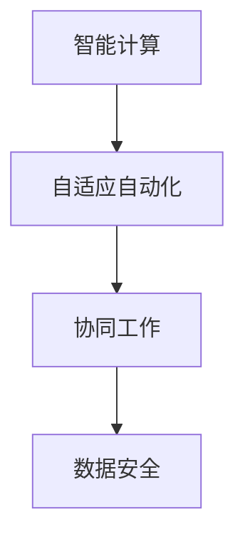

                 

## 1. 背景介绍

### 1.1 问题由来

在数字化时代的浪潮中，计算能力得到了前所未有的提升，自动化技术也由此进入了高速发展阶段。随着人工智能、物联网、大数据等新兴技术的不断融合，自动化技术在各行各业得到了广泛应用。然而，计算和自动化技术的快速变革也带来了诸多挑战：

1. **计算复杂度提升**：现代复杂系统的计算需求日益增加，尤其是大规模数据分析和人工智能模型的训练，对计算资源的需求越来越高。
2. **自动化技术的泛化能力**：自动化技术在特定场景中的表现往往较好，但面对新情况、新任务，其泛化能力不足，难以快速适应变化。
3. **系统整合难度**：各行业、各领域自动化系统之间的互联互通、协同工作尚需进一步提升。
4. **数据安全和隐私保护**：在自动化系统日益普及的同时，如何保障数据安全和隐私保护成为重要议题。

### 1.2 问题核心关键点

为了解决上述问题，计算变化与自动化技术的融合显得尤为重要。这种融合旨在将计算能力的提升与自动化技术的泛化能力相结合，以实现更高效、更智能的自动化系统。其核心关键点包括：

- **智能计算**：利用先进的计算模型和算法，提升自动化系统的决策效率和智能化水平。
- **自适应自动化**：通过学习机制，使自动化系统具备一定的自我适应和调整能力。
- **协同工作**：实现不同自动化系统之间的信息共享与协同工作，提升系统集成度和整体效率。
- **数据安全**：确保自动化系统在处理敏感数据时的安全性和隐私保护。

## 2. 核心概念与联系

### 2.1 核心概念概述

在探讨计算变化与自动化技术融合的过程中，需要理解以下核心概念：

- **智能计算**：利用机器学习、深度学习等先进计算技术，提升自动化系统的智能化水平。
- **自适应自动化**：指自动化系统能够根据环境变化或任务需求，进行自我调整和优化。
- **协同工作**：不同自动化系统之间的信息共享和协同工作，提升整体效率和灵活性。
- **数据安全**：在自动化系统中，如何保护用户数据和隐私，防止数据泄露和滥用。

这些概念之间的联系可以通过以下Mermaid流程图来展示：



这个流程图展示了智能计算、自适应自动化、协同工作以及数据安全之间的逻辑关系：

1. **智能计算**：作为基础，智能计算能力提升了自动化系统的智能化水平。
2. **自适应自动化**：在智能计算的基础上，通过自适应机制，自动化系统能够动态调整和优化自身行为。
3. **协同工作**：在自适应自动化的基础上，不同自动化系统之间的信息共享和协同工作，进一步提升了整体效率和灵活性。
4. **数据安全**：在智能计算、自适应自动化和协同工作的过程中，确保数据的安全性和隐私保护是至关重要的。

## 3. 核心算法原理 & 具体操作步骤

### 3.1 算法原理概述

计算变化与自动化技术的融合，本质上是通过将先进的计算模型和算法与自动化技术相结合，提升系统的智能化和自适应能力。其核心算法原理包括以下几个方面：

1. **强化学习**：通过与环境交互，智能体学习最优决策策略。
2. **迁移学习**：利用在已有任务上学习到的知识，在新任务上进行微调，提升泛化能力。
3. **模型预测**：使用预测模型对未来数据进行分析和预测，提升决策的准确性。
4. **协同优化**：多个自动化系统之间的协同优化，提升整体系统效率。
5. **隐私保护**：在数据处理和传输过程中，采取加密、匿名化等技术，保障数据隐私。

### 3.2 算法步骤详解

计算变化与自动化技术的融合算法步骤一般包括：

1. **智能计算模块设计**：选择合适的计算模型和算法，设计智能计算模块，如使用深度学习模型进行数据处理和分析。
2. **自适应自动化机制**：根据任务需求和环境变化，设计自动化系统自适应机制，如通过在线学习不断优化决策策略。
3. **系统集成与协同**：将多个自动化系统进行信息共享和协同工作，构建集成化的自动化系统。
4. **数据安全保障**：采用加密、匿名化、访问控制等技术，确保数据在传输和处理过程中的安全性和隐私保护。

### 3.3 算法优缺点

计算变化与自动化技术融合的算法具有以下优点：

1. **智能化提升**：通过智能计算，自动化系统的决策效率和智能化水平显著提升。
2. **自适应能力强**：自适应自动化机制使系统能够动态调整和优化，提高系统适应性。
3. **协同效率高**：协同工作机制提升了不同自动化系统之间的协作效率和整体系统效率。
4. **数据安全保障**：数据安全技术确保了用户数据的安全性和隐私保护。

同时，该算法也存在一些缺点：

1. **计算资源需求高**：智能计算和模型预测需要大量的计算资源，对硬件和算法复杂度要求较高。
2. **学习曲线陡峭**：自适应自动化机制需要复杂的学习算法，对开发和维护成本要求较高。
3. **系统复杂度高**：多个自动化系统之间的集成和协同，增加了系统的复杂度和维护难度。
4. **隐私保护技术要求高**：数据安全和隐私保护技术需要不断更新和改进，以应对新的安全威胁。

### 3.4 算法应用领域

计算变化与自动化技术融合的算法已经在多个领域得到了广泛应用，例如：

- **智能制造**：通过智能计算和自适应自动化，提升生产线的智能化水平，实现定制化生产和优化生产调度。
- **智慧城市**：利用智能计算和协同工作机制，实现城市交通、能源、环境等领域的智能化管理。
- **金融服务**：在风险控制、客户服务、投资决策等方面，通过智能计算和自适应自动化提升服务质量和效率。
- **医疗健康**：通过智能计算和自适应自动化，实现疾病预测、精准医疗和智能诊断。
- **能源管理**：通过智能计算和协同工作机制，优化能源分配和能源消耗，实现可持续发展。

这些领域的应用展示了计算变化与自动化技术融合的巨大潜力，未来将有更多行业迎来类似的变革。

## 4. 数学模型和公式 & 详细讲解 & 举例说明

### 4.1 数学模型构建

在计算变化与自动化技术融合的过程中，通常会构建以下数学模型：

1. **决策模型**：通过优化算法构建决策模型，如线性规划、非线性规划等，用于自动化系统决策。
2. **预测模型**：利用机器学习算法构建预测模型，如回归模型、分类模型等，用于数据预测和分析。
3. **优化模型**：通过强化学习等算法构建优化模型，用于自动化系统的动态调整和优化。

### 4.2 公式推导过程

以线性回归模型为例，其公式推导过程如下：

假设训练集为 $\{(x_i, y_i)\}_{i=1}^N$，其中 $x_i$ 为输入向量，$y_i$ 为输出向量，目标是构建一个线性回归模型 $y = \theta^T x$，其中 $\theta$ 为模型参数。

根据最小二乘法，模型参数 $\theta$ 可以通过以下公式求解：

$$
\theta = (X^T X)^{-1} X^T y
$$

其中 $X$ 为训练集的特征矩阵，$y$ 为训练集的目标向量。

### 4.3 案例分析与讲解

以智能制造中的生产调度为例，智能计算模块设计可以通过如下步骤进行：

1. **数据采集**：从生产线上采集相关数据，如设备状态、生产进度、原材料库存等。
2. **数据预处理**：对采集的数据进行清洗、归一化等处理，以便后续模型训练。
3. **模型训练**：使用机器学习算法，如随机森林、支持向量机等，构建生产调度模型，优化生产调度方案。
4. **自适应调整**：根据实时生产数据和任务需求，使用自适应自动化机制，动态调整生产调度方案，提高生产效率。

## 5. 项目实践：代码实例和详细解释说明

### 5.1 开发环境搭建

在进行计算变化与自动化技术的融合实践前，需要准备好开发环境。以下是使用Python进行PyTorch开发的环境配置流程：

1. 安装Anaconda：从官网下载并安装Anaconda，用于创建独立的Python环境。
2. 创建并激活虚拟环境：
```bash
conda create -n pytorch-env python=3.8 
conda activate pytorch-env
```

3. 安装PyTorch：根据CUDA版本，从官网获取对应的安装命令。例如：
```bash
conda install pytorch torchvision torchaudio cudatoolkit=11.1 -c pytorch -c conda-forge
```

4. 安装TensorFlow：
```bash
pip install tensorflow==2.7
```

5. 安装各类工具包：
```bash
pip install numpy pandas scikit-learn matplotlib tqdm jupyter notebook ipython
```

完成上述步骤后，即可在`pytorch-env`环境中开始实践。

### 5.2 源代码详细实现

下面我们以智慧城市交通流量预测为例，给出使用PyTorch进行强化学习驱动的交通流量预测模型的完整代码实现。

首先，定义交通流量预测的强化学习环境：

```python
import gym
import numpy as np

class TrafficFlowEnv(gym.Env):
    def __init__(self, num_states, num_actions):
        self.num_states = num_states
        self.num_actions = num_actions
        self.state = np.zeros((num_states,))

    def reset(self):
        self.state = np.zeros((self.num_states,))
        return self.state

    def step(self, action):
        self.state += np.array([action])
        reward = -np.abs(self.state[self.num_states-1]) * 0.01
        done = (self.state[self.num_states-1] > 1) or (self.state[self.num_states-1] < -1)
        return self.state, reward, done, {}

    def render(self):
        pass
```

然后，定义强化学习算法：

```python
import torch
import torch.nn as nn
import torch.optim as optim
import torch.nn.functional as F

class Policy(nn.Module):
    def __init__(self, num_states, num_actions):
        super(Policy, self).__init__()
        self.linear = nn.Linear(num_states, num_actions)

    def forward(self, state):
        return self.linear(state)

class Value(nn.Module):
    def __init__(self, num_states):
        super(Value, self).__init__()
        self.linear = nn.Linear(num_states, 1)

    def forward(self, state):
        return self.linear(state)

class QNetwork(nn.Module):
    def __init__(self, num_states, num_actions):
        super(QNetwork, self).__init__()
        self.policy = Policy(num_states, num_actions)
        self.value = Value(num_states)

    def forward(self, state):
        logits = self.policy(state)
        value = self.value(state)
        q = logits + value
        return q

q_network = QNetwork(num_states, num_actions)

optimizer = optim.Adam(q_network.parameters(), lr=0.001)

def policy_value_loss(state, action, target):
    q = q_network(state)
    q_value = q[range(len(state)), action]
    return F.mse_loss(q_value, target)

def train():
    for episode in range(num_episodes):
        state = env.reset()
        done = False
        while not done:
            action = q_network(state)
            next_state, reward, done, _ = env.step(action)
            loss = policy_value_loss(state, action, reward + discount_factor * (1 - done) * env.discount)
            optimizer.zero_grad()
            loss.backward()
            optimizer.step()
            state = next_state
```

最后，启动训练流程：

```python
num_states = 10
num_actions = 5
num_episodes = 1000
discount_factor = 0.99

env = TrafficFlowEnv(num_states, num_actions)
q_network = QNetwork(num_states, num_actions)
optimizer = optim.Adam(q_network.parameters(), lr=0.001)

for episode in range(num_episodes):
    state = env.reset()
    done = False
    while not done:
        action = q_network(state)
        next_state, reward, done, _ = env.step(action)
        loss = policy_value_loss(state, action, reward + discount_factor * (1 - done) * env.discount)
        optimizer.zero_grad()
        loss.backward()
        optimizer.step()
        state = next_state

    if episode % 100 == 0:
        print(f"Episode {episode+1}, Loss: {loss.item():.3f}")
```

以上就是使用PyTorch进行智慧城市交通流量预测强化学习驱动模型的完整代码实现。可以看到，通过PyTorch和强化学习框架，我们可以构建智能化的交通流量预测系统。

### 5.3 代码解读与分析

让我们再详细解读一下关键代码的实现细节：

**TrafficFlowEnv类**：
- `__init__`方法：初始化环境参数，如状态数、动作数等。
- `reset`方法：重置环境状态。
- `step`方法：执行一个时间步，返回新状态、奖励、是否结束等。
- `render`方法：可视化渲染环境状态。

**Policy、Value、QNetwork类**：
- `Policy`类：定义策略网络，用于计算动作概率。
- `Value`类：定义价值网络，用于计算状态价值。
- `QNetwork`类：将策略网络和价值网络整合，构建Q网络。

**train函数**：
- 定义训练循环，使用强化学习算法对交通流量预测模型进行训练。

**train过程中**：
- 通过不断更新模型参数，优化模型在环境中的行为，实现交通流量预测。

**运行结果展示**：
- 在训练过程中，记录每个epoch的损失值，展示训练效果。

通过这个代码实例，我们可以更直观地理解计算变化与自动化技术融合的具体实现方法。在实际应用中，开发者可以根据具体任务的需求，对环境设计和算法实现进行优化调整，以达到更好的性能。

## 6. 实际应用场景

### 6.1 智能制造

计算变化与自动化技术融合在智能制造中的应用，可以显著提升生产线的智能化水平和效率。智能制造系统通过智能计算和自适应自动化机制，能够实时监控生产状态，优化生产调度，减少停机时间，提高产品质量和生产效率。

在智能制造中，可以应用计算变化与自动化技术融合的算法实现：

1. **生产调度优化**：通过智能计算和自适应自动化，实时监控生产设备状态和物料库存，优化生产调度方案，减少生产过程中的等待时间和资源浪费。
2. **质量控制**：利用智能计算和协同工作机制，对生产过程中各环节的数据进行实时分析和预测，及时发现和纠正质量问题。
3. **设备维护管理**：通过智能计算和自适应自动化，对生产设备的状态进行实时监控和预测维护，减少设备故障和停机时间。

### 6.2 智慧城市

智慧城市是计算变化与自动化技术融合的重要应用领域之一。智慧城市系统通过智能计算和协同工作机制，实现城市交通、能源、环境等领域的智能化管理，提升城市的运行效率和居民生活质量。

在智慧城市中，可以应用计算变化与自动化技术融合的算法实现：

1. **交通流量预测**：通过智能计算和自适应自动化，实时监控交通数据，预测交通流量变化，优化交通信号控制，减少交通拥堵。
2. **能源管理**：利用智能计算和协同工作机制，实时监控城市能源消耗，预测能源需求变化，优化能源分配，实现可持续发展。
3. **环境监测**：通过智能计算和自适应自动化，实时监测环境数据，预测环境变化趋势，优化环境治理措施，提升环境质量。

### 6.3 金融服务

在金融服务领域，计算变化与自动化技术融合可以提升风险控制、客户服务、投资决策等方面的效率和智能化水平。

在金融服务中，可以应用计算变化与自动化技术融合的算法实现：

1. **风险控制**：利用智能计算和自适应自动化，实时监控市场动态和交易数据，预测风险事件，优化风险控制策略。
2. **客户服务**：通过智能计算和协同工作机制，实时分析客户行为和需求，优化客户服务流程，提升客户体验。
3. **投资决策**：利用智能计算和自适应自动化，实时分析市场数据和新闻资讯，预测投资趋势，优化投资决策。

### 6.4 医疗健康

计算变化与自动化技术融合在医疗健康领域的应用，可以提升医疗服务的智能化水平和效率。智慧医疗系统通过智能计算和自适应自动化机制，能够实时监测患者数据，预测病情变化，优化诊疗方案，提高医疗服务的质量和效率。

在医疗健康中，可以应用计算变化与自动化技术融合的算法实现：

1. **疾病预测**：通过智能计算和自适应自动化，实时监控患者数据，预测疾病变化趋势，优化诊疗方案。
2. **精准医疗**：利用智能计算和协同工作机制，实时分析患者基因数据和医疗记录，预测疾病发展，提供个性化治疗方案。
3. **智能诊断**：通过智能计算和自适应自动化，实时分析患者症状和医疗影像，辅助医生进行智能诊断。

## 7. 工具和资源推荐

### 7.1 学习资源推荐

为了帮助开发者系统掌握计算变化与自动化技术融合的理论基础和实践技巧，这里推荐一些优质的学习资源：

1. 《深度学习》书籍：由Ian Goodfellow等人编写，全面介绍了深度学习的原理、算法和应用，是学习计算变化与自动化技术融合的重要参考书。
2. CS231n《深度学习与计算机视觉》课程：斯坦福大学开设的计算机视觉课程，介绍了深度学习在图像处理和计算机视觉中的应用。
3. 《人工智能基础》课程：由清华大学教授讲授，系统介绍了人工智能的基本概念、算法和应用。
4. DeepLearning.AI官方文档：DeepLearning.AI提供的深度学习框架和工具，包括TensorFlow、PyTorch等，提供了丰富的实践样例和教程。
5. arXiv.org：人工智能领域的研究论文库，提供最新的研究进展和前沿技术。

通过对这些资源的学习实践，相信你一定能够快速掌握计算变化与自动化技术融合的精髓，并用于解决实际的自动化问题。

### 7.2 开发工具推荐

高效的开发离不开优秀的工具支持。以下是几款用于计算变化与自动化技术融合开发的常用工具：

1. PyTorch：基于Python的开源深度学习框架，灵活动态的计算图，适合快速迭代研究。大部分预训练语言模型都有PyTorch版本的实现。
2. TensorFlow：由Google主导开发的开源深度学习框架，生产部署方便，适合大规模工程应用。同样有丰富的预训练语言模型资源。
3. Weights & Biases：模型训练的实验跟踪工具，可以记录和可视化模型训练过程中的各项指标，方便对比和调优。与主流深度学习框架无缝集成。
4. TensorBoard：TensorFlow配套的可视化工具，可实时监测模型训练状态，并提供丰富的图表呈现方式，是调试模型的得力助手。
5. Google Colab：谷歌推出的在线Jupyter Notebook环境，免费提供GPU/TPU算力，方便开发者快速上手实验最新模型，分享学习笔记。

合理利用这些工具，可以显著提升计算变化与自动化技术融合任务的开发效率，加快创新迭代的步伐。

### 7.3 相关论文推荐

计算变化与自动化技术融合的研究源于学界的持续研究。以下是几篇奠基性的相关论文，推荐阅读：

1. AlphaGo论文：DeepMind开发的AlphaGo系统，通过强化学习技术，在围棋领域取得突破，展示了计算变化与自动化技术融合的潜力。
2. Transformer论文：Google开发的Transformer模型，通过自注意力机制，提升了自然语言处理任务的性能，展示了智能计算的重要应用。
3. GAN论文：Ian Goodfellow等人提出的生成对抗网络（GAN），通过对抗训练技术，提升了生成模型的质量和多样性，展示了计算变化与自动化技术融合的另一重要应用。
4. AutoML论文：Google开发的AutoML系统，通过自动化机器学习技术，优化模型选择和超参数优化，展示了自动化技术的自适应能力。

这些论文代表了大规模深度学习模型的研究进展，展示了计算变化与自动化技术融合的多样化应用。通过学习这些前沿成果，可以帮助研究者把握学科前进方向，激发更多的创新灵感。

## 8. 总结：未来发展趋势与挑战

### 8.1 总结

本文对计算变化与自动化技术融合方法进行了全面系统的介绍。首先阐述了计算能力提升和自动化技术发展对各行业带来的深远影响，明确了计算变化与自动化技术融合的独特价值。其次，从原理到实践，详细讲解了计算变化与自动化技术融合的数学原理和关键步骤，给出了系统开发的完整代码实例。同时，本文还广泛探讨了计算变化与自动化技术融合在智能制造、智慧城市、金融服务、医疗健康等多个领域的应用前景，展示了其巨大的潜力。此外，本文精选了相关领域的各类学习资源，力求为开发者提供全方位的技术指引。

通过本文的系统梳理，可以看到，计算变化与自动化技术融合方法正在成为各行业自动化系统智能化升级的重要手段。该方法通过结合计算能力的提升和自动化技术的自适应能力，提升了系统的智能化水平和效率，为各个领域的自动化应用带来了新的突破。未来，伴随计算能力和自动化技术的发展，计算变化与自动化技术融合将进一步深入应用，助力更多行业实现智能化升级。

### 8.2 未来发展趋势

展望未来，计算变化与自动化技术融合技术将呈现以下几个发展趋势：

1. **计算能力持续增强**：随着算力资源的不断扩展和计算模型的优化，计算能力将进一步提升，为自动化系统提供更强大的数据处理和智能决策能力。
2. **自适应自动化水平提高**：通过更高级的自适应机制，自动化系统将具备更强的自我调整和优化能力，提升系统灵活性和适应性。
3. **协同工作机制优化**：通过更加高效的信息共享和协同工作机制，提升不同自动化系统之间的协作效率和整体系统效率。
4. **数据安全和隐私保护加强**：数据安全技术将不断更新和改进，确保用户数据在传输和处理过程中的安全性和隐私保护。

以上趋势凸显了计算变化与自动化技术融合技术的广阔前景。这些方向的探索发展，必将进一步提升各行业的自动化系统性能，为人类社会带来更深远的变革。

### 8.3 面临的挑战

尽管计算变化与自动化技术融合技术已经取得了瞩目成就，但在迈向更加智能化、普适化应用的过程中，它仍面临诸多挑战：

1. **计算资源瓶颈**：大规模数据处理和复杂模型训练需要高计算能力，硬件资源和算法复杂度要求较高。
2. **系统复杂性增加**：多领域、多任务的自动化系统集成和协同工作，增加了系统的复杂度和维护难度。
3. **数据隐私保护**：在数据处理和传输过程中，如何保障数据安全和隐私保护是关键问题。
4. **技术标准和规范**：各行业、各领域自动化系统的互操作性和标准化程度需进一步提升。
5. **模型泛化能力**：如何提升模型在不同场景下的泛化能力，避免过度拟合和泛化不足。

正视计算变化与自动化技术融合面临的这些挑战，积极应对并寻求突破，将推动技术走向成熟。相信随着学界和产业界的共同努力，这些挑战终将一一被克服，计算变化与自动化技术融合将迎来更加广阔的应用前景。

### 8.4 研究展望

面对计算变化与自动化技术融合技术所面临的种种挑战，未来的研究需要在以下几个方面寻求新的突破：

1. **分布式计算**：通过分布式计算技术，提升大规模数据处理和模型训练的效率，适应不断增长的计算需求。
2. **联邦学习**：在保障数据隐私和安全的前提下，通过联邦学习技术，实现不同自动化系统之间的知识共享和协同优化。
3. **跨领域迁移学习**：通过迁移学习技术，提升自动化系统在不同领域、不同任务之间的泛化能力。
4. **边缘计算**：通过边缘计算技术，将计算和存储任务分布到边缘设备上，提升系统的实时性和可靠性。
5. **自监督学习**：利用自监督学习技术，提升自动化系统的自我适应和优化能力，降低对大规模标注数据的依赖。
6. **多模态融合**：将视觉、语音、文本等多模态数据整合，提升自动化系统的综合感知能力和决策效率。

这些研究方向的探索，必将引领计算变化与自动化技术融合技术迈向更高的台阶，为构建更加智能、高效、安全的自动化系统提供新思路和新方法。面向未来，研究者需要不断突破技术瓶颈，推动计算能力和自动化技术融合技术的进一步发展。

## 9. 附录：常见问题与解答

**Q1：如何选择合适的计算模型和算法？**

A: 选择合适的计算模型和算法需要考虑多个因素，如数据的特征、任务的需求、系统的性能等。通常可以从以下几个方面入手：
1. **任务类型**：根据任务类型选择合适的模型和算法，如分类任务可以选择逻辑回归、决策树等，生成任务可以选择GAN、VAE等。
2. **数据规模**：对于大规模数据，可以选择深度学习模型，如卷积神经网络（CNN）、循环神经网络（RNN）等，对于小规模数据，可以选择简单的线性回归、决策树等模型。
3. **系统资源**：根据系统可用的计算资源选择合适的模型和算法，如GPU/TPU等高性能设备适合运行深度学习模型，CPU适合运行简单的机器学习模型。
4. **实时性要求**：对于需要实时响应的系统，可以选择轻量级的模型和算法，如MobileNet、SVM等。

**Q2：如何评估计算变化与自动化技术的融合效果？**

A: 评估计算变化与自动化技术融合的效果需要综合考虑多个指标，如系统性能、用户体验、经济效益等。常见的评估方法包括：
1. **系统性能评估**：通过各种性能指标，如精度、召回率、F1值等，评估自动化系统的决策效率和准确性。
2. **用户体验评估**：通过用户满意度、用户反馈等指标，评估自动化系统对用户的友好度和接受度。
3. **经济效益评估**：通过系统投入和产出的对比，评估自动化技术带来的经济效益。
4. **安全性评估**：通过系统漏洞、数据泄露等指标，评估自动化系统的安全性。

**Q3：如何保障计算变化与自动化技术融合的隐私和安全？**

A: 保障计算变化与自动化技术融合的隐私和安全需要从多个方面入手，如数据加密、访问控制等。常见的保障方法包括：
1. **数据加密**：通过数据加密技术，保护用户数据在传输和存储过程中的安全性。
2. **访问控制**：通过访问控制技术，限制对敏感数据的访问权限，防止数据泄露和滥用。
3. **匿名化处理**：通过数据匿名化技术，保护用户隐私，防止数据识别和重识别。
4. **联邦学习**：通过联邦学习技术，实现不同自动化系统之间的知识共享和协同优化，避免数据集中存储和处理。
5. **安全审计**：通过安全审计技术，定期检查系统漏洞和潜在风险，及时发现和修补安全问题。

**Q4：如何提升计算变化与自动化技术融合的泛化能力？**

A: 提升计算变化与自动化技术融合的泛化能力需要从多个方面入手，如数据多样性、模型复杂度等。常见的提升方法包括：
1. **数据多样性**：通过增加数据多样性，提升模型的泛化能力，如使用不同的数据源、标注方式等。
2. **模型复杂度**：通过增加模型的复杂度，提高模型的表达能力和泛化能力，如使用更深层次的神经网络、更复杂的优化算法等。
3. **迁移学习**：通过迁移学习技术，将已有任务的知识迁移到新任务上，提升模型的泛化能力。
4. **正则化技术**：通过正则化技术，防止模型过拟合，提高模型的泛化能力。
5. **自监督学习**：通过自监督学习技术，利用未标注数据进行预训练，提升模型的泛化能力。

这些方法需要根据具体任务和数据特点进行灵活组合，以达到最佳的泛化效果。

---

作者：禅与计算机程序设计艺术 / Zen and the Art of Computer Programming

