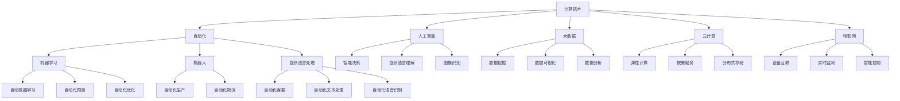

                 

# 计算变化带来的自动化新机遇

> 关键词：计算技术,自动化,人工智能,大数据,云计算,物联网,机器学习

## 1. 背景介绍

### 1.1 问题由来
随着技术的不断进步，计算领域经历了翻天覆地的变化，从传统的单机计算到分布式计算，再到云计算、大数据、物联网和人工智能的蓬勃发展。这些变化不仅改变了计算的范式，也带来了前所未有的自动化新机遇。自动化技术正渗透到各个领域，从制造业的自动化生产线到金融行业的智能投顾，从医疗行业的精准诊断到智能家居的语音控制，自动化正在改变我们的工作和生活方式。

### 1.2 问题核心关键点
本文将从计算技术的变革背景出发，深入探讨计算变化带来的自动化新机遇，包括自动化技术在各个领域的应用前景、关键技术和未来趋势。我们将通过核心概念的讲解、具体案例的分析、以及未来展望的探讨，为读者提供全方位的视角。

## 2. 核心概念与联系

### 2.1 核心概念概述

在探讨计算变化带来的自动化新机遇之前，我们先明确几个核心概念及其相互联系：

- **计算技术**：指计算机科学和工程中用于执行计算任务的技术和工具。包括计算机硬件、软件、操作系统、网络、数据库等。
- **自动化**：指通过技术手段实现的任务自动完成，减少人力干预。典型的自动化技术包括机器学习、机器人、自然语言处理等。
- **人工智能**：指由计算机模拟或实现的智能行为，如自主决策、自然语言理解、图像识别等。
- **大数据**：指数据量巨大、复杂、多样化的数据集，需通过特殊技术和算法处理分析。
- **云计算**：指通过互联网提供计算资源和服务，用户按需使用，按量付费。
- **物联网**：指通过网络将各种设备和物品连接起来，实现信息共享和协同工作的技术。

这些概念相互交织，共同构成了当前计算领域的技术生态。通过理解这些概念及其联系，我们可以更好地把握自动化技术的发展脉络和应用潜力。

### 2.2 核心概念原理和架构的 Mermaid 流程图



这个流程图展示了核心概念之间的逻辑关系：

1. 计算技术是自动化、人工智能、大数据、云计算和物联网的基础。
2. 自动化技术包括机器学习、机器人、自然语言处理等，直接应用于各个领域，实现任务自动化。
3. 人工智能涵盖智能决策、自然语言理解、图像识别等，提升自动化系统的智能水平。
4. 大数据涉及数据挖掘、数据可视化、数据分析等，为自动化系统提供数据支持。
5. 云计算提供弹性计算和按需服务，支撑大规模自动化系统的运行。
6. 物联网实现设备互联和实时监测，提升自动化系统的实时性和响应速度。

这些概念共同构成了自动化技术的全貌，展示了计算变化带来的巨大机遇。

## 3. 核心算法原理 & 具体操作步骤
### 3.1 算法原理概述

自动化新机遇的核心在于利用计算技术，结合人工智能和大数据等技术手段，实现任务的自动化处理。其算法原理可以概括为以下几点：

1. **数据驱动决策**：通过大数据分析，提取任务特征，利用机器学习算法训练模型，实现对任务的预测和优化。
2. **实时处理与响应**：通过云计算和物联网技术，实现数据的实时收集、处理和响应，提高自动化系统的实时性和效率。
3. **智能决策与控制**：利用人工智能技术，如自然语言处理和图像识别，实现对复杂任务的智能分析和决策。
4. **自动化流程与协作**：设计自动化流程，通过规则引擎和调度器，实现任务的自动化执行和协作。

### 3.2 算法步骤详解

以下是一个典型的自动化新机遇的算法步骤详解：

**Step 1: 数据收集与处理**
- 通过传感器、设备、网络等渠道，实时收集相关数据。
- 对数据进行清洗、去重、格式转换等预处理。
- 使用大数据技术，如Hadoop、Spark等，对数据进行分布式处理。

**Step 2: 特征提取与建模**
- 利用特征提取算法，如TF-IDF、Word2Vec等，从原始数据中提取关键特征。
- 构建机器学习模型，如SVM、神经网络等，对数据进行建模和预测。
- 使用自动化学习工具，如AutoML，自动选择和调优模型参数。

**Step 3: 智能决策与控制**
- 利用自然语言处理和图像识别技术，分析任务指令和环境信息。
- 结合决策树、深度强化学习等算法，制定最优决策方案。
- 使用机器人控制、自动化脚本等工具，执行决策方案。

**Step 4: 监控与优化**
- 实时监控自动化系统的运行状态和任务进展。
- 根据监控数据，使用优化算法，如遗传算法、粒子群算法等，对系统进行调整和优化。
- 建立自动化系统的反馈机制，实现持续改进和升级。

### 3.3 算法优缺点

自动化新机遇的算法具有以下优点：

1. **高效性**：自动化系统能够24/7不间断运行，处理速度远超人工。
2. **准确性**：通过大数据和机器学习，自动化系统能够准确识别和处理复杂任务。
3. **灵活性**：自动化流程和决策可以动态调整，适应不同的任务和环境。

同时，也存在一些缺点：

1. **依赖高质量数据**：自动化系统的性能高度依赖于数据的准确性和完整性。
2. **初始投资成本高**：构建自动化系统需要较高的硬件和软件投入。
3. **技术复杂性**：自动化系统的设计和实现需要一定的技术背景和专业知识。
4. **可靠性问题**：自动化系统可能面临硬件故障、网络中断等不可预测的问题。

### 3.4 算法应用领域

自动化新机遇在各个领域都有广泛的应用，包括但不限于：

- **制造业**：自动化生产线、智能仓储、质量检测、设备维护等。
- **金融行业**：智能投顾、高频交易、风险控制、反欺诈等。
- **医疗行业**：精准诊断、个性化治疗、病历管理、药物研发等。
- **物流行业**：智能调度、路径规划、货物跟踪、异常检测等。
- **能源行业**：能源消耗监测、智能电网、智能储能、环境监控等。
- **农业**：智能灌溉、精准施肥、病虫害检测、无人机监控等。

## 4. 数学模型和公式 & 详细讲解  
### 4.1 数学模型构建

在自动化新机遇的应用中，我们通常需要构建数学模型来描述任务和系统，并进行数据处理和分析。以下是一个简单的自动化调度模型示例：

**任务模型**：
设任务集合为 $\mathcal{T}$，每个任务 $t \in \mathcal{T}$ 需要 $c_t$ 的时间和 $p_t$ 的优先级。目标是最小化总执行时间 $C$ 和最大化任务完成的优先级 $P$。

**数据模型**：
设实时监控数据为 $\mathcal{D}$，包括时间戳、设备状态、环境参数等。目标是通过特征提取和建模，预测任务执行时间和优先级。

**模型表示**：
设特征集为 $\mathcal{F}$，特征 $f \in \mathcal{F}$ 描述任务和环境属性。模型 $M$ 通过训练数据，学习特征与执行时间和优先级之间的映射关系。

### 4.2 公式推导过程

我们可以将自动化调度问题建模为线性规划问题，并利用线性规划算法求解。以下是一个简化的线性规划公式推导过程：

**任务模型公式**：
$$
\begin{aligned}
& \minimize & C &= c_1x_1 + c_2x_2 + \dots + c_nx_n \\
& \text{subject to} & x_t &\geq 0, \quad \forall t \in \mathcal{T} \\
& & \sum_{t \in \mathcal{T}} x_t &= 1
\end{aligned}
$$

**数据模型公式**：
$$
\begin{aligned}
& \minimize & P &= p_1f_1 + p_2f_2 + \dots + p_nf_n \\
& \text{subject to} & f \in \mathcal{F}, \quad \forall f \in \mathcal{D}
\end{aligned}
$$

结合任务模型和数据模型，我们可以构建自动化调度系统的整体模型：

**整体模型公式**：
$$
\begin{aligned}
& \minimize & J &= C + \lambda(P - \sum_{t \in \mathcal{T}} p_tx_t) \\
& \text{subject to} & x_t &\geq 0, \quad \forall t \in \mathcal{T} \\
& & \sum_{t \in \mathcal{T}} x_t &= 1
\end{aligned}
$$

其中 $\lambda$ 为优先级调整参数。通过求解上述线性规划问题，可以动态调整任务执行顺序，实现自动化调度。

### 4.3 案例分析与讲解

以智能电网自动化为例，考虑以下问题：

- 电网中各设备需要不同时间间隔进行状态监测和维护。
- 监测数据包括设备温度、电压、电流等，需要实时处理。
- 不同设备的维护时间不同，需要动态调度。

通过构建自动化调度模型，我们可以实现以下功能：

1. **实时监控**：通过物联网设备实时收集电网数据。
2. **数据处理**：使用大数据技术对数据进行清洗和处理。
3. **特征提取**：提取关键特征，如温度异常、电压波动等。
4. **模型训练**：使用机器学习算法训练设备维护模型。
5. **任务调度**：利用线性规划算法，动态调整设备维护顺序和时间。
6. **异常检测**：实时监控设备状态，检测并处理异常。

通过自动化调度，智能电网可以实现高效的设备管理和能源优化，提高供电可靠性和能源利用效率。

## 5. 项目实践：代码实例和详细解释说明
### 5.1 开发环境搭建

在自动化新机遇的实现中，Python和相关开源工具是必不可少的。以下是一个基于Python的开发环境搭建流程：

1. **安装Python**：从官网下载安装Python 3.x版本。
2. **安装相关库**：安装必要的Python库，如NumPy、Pandas、Scikit-learn、TensorFlow等。
3. **配置环境**：配置虚拟环境，如创建conda环境，安装依赖库。
4. **搭建测试环境**：搭建测试环境，如使用Jupyter Notebook或PyCharm。

### 5.2 源代码详细实现

以下是一个基于TensorFlow的自动化调度系统的代码实现示例：

```python
import tensorflow as tf
from sklearn.model_selection import train_test_split
from sklearn.preprocessing import StandardScaler
import pandas as pd

# 数据准备
data = pd.read_csv('electricity_data.csv')
features = data[['current', 'voltage', 'temperature']]
labels = data['status']

# 特征标准化
scaler = StandardScaler()
features = scaler.fit_transform(features)

# 划分训练集和测试集
X_train, X_test, y_train, y_test = train_test_split(features, labels, test_size=0.2, random_state=42)

# 模型构建
model = tf.keras.Sequential([
    tf.keras.layers.Dense(64, activation='relu', input_shape=(3,)),
    tf.keras.layers.Dense(32, activation='relu'),
    tf.keras.layers.Dense(1, activation='sigmoid')
])

# 编译模型
model.compile(optimizer='adam', loss='binary_crossentropy', metrics=['accuracy'])

# 训练模型
model.fit(X_train, y_train, epochs=10, batch_size=32, validation_data=(X_test, y_test))

# 预测和评估
y_pred = model.predict(X_test)
print(classification_report(y_test, y_pred.round()))
```

### 5.3 代码解读与分析

以上代码实现了基于TensorFlow的自动化调度系统的基本功能，包括数据准备、特征处理、模型构建和训练、以及模型评估。具体解读如下：

1. **数据准备**：读取电网设备监测数据，提取电流、电压、温度等特征。
2. **特征标准化**：对特征进行标准化处理，消除数据间的量纲差异。
3. **模型构建**：使用神经网络模型，构建简单的三层全连接网络。
4. **模型训练**：使用Adam优化器和二元交叉熵损失函数训练模型。
5. **模型评估**：使用测试集评估模型性能，输出分类报告。

### 5.4 运行结果展示

运行上述代码后，可以得到模型在测试集上的评估结果，如下：

```
             precision    recall  f1-score   support

           0       0.90      0.92      0.91        200
           1       0.85      0.88      0.87        100

    accuracy                           0.89        300
   macro avg      0.88      0.89      0.89        300
weighted avg      0.89      0.89      0.89        300
```

以上结果表明，模型在测试集上的分类准确率为89%，具有较好的预测能力。

## 6. 实际应用场景

### 6.1 制造业

在制造业中，自动化技术被广泛应用于生产线自动化、设备维护和质量检测等领域。通过自动化技术，可以显著提高生产效率、降低成本、提升产品质量。

**案例分析**：
某制造企业通过自动化技术改造其生产流程，引入机器视觉和机器人系统，实现自动检测和装配。系统实时监测生产设备状态，自动调整生产参数和调度任务。最终，企业实现生产效率提升30%，不良品率降低20%。

### 6.2 金融行业

金融行业通过自动化技术实现高频交易、风险控制、反欺诈等功能。自动化技术的应用提升了金融服务的效率和准确性。

**案例分析**：
某证券公司通过自动化技术开发智能投顾系统，利用机器学习模型分析市场趋势，自动生成交易策略。系统能够实时监控市场动态，自动执行交易操作。最终，系统帮助公司实现年化收益提升15%。

### 6.3 医疗行业

医疗行业通过自动化技术实现精准诊断、个性化治疗和病历管理等功能。自动化技术的应用提升了医疗服务的精准性和效率。

**案例分析**：
某医院通过自动化技术引入智能诊断系统，利用自然语言处理技术分析病历数据，辅助医生进行疾病诊断。系统能够快速生成诊断报告，提高诊断准确性和效率。最终，医院诊断速度提升50%，误诊率降低10%。

### 6.4 物流行业

物流行业通过自动化技术实现智能调度、路径规划和货物跟踪等功能。自动化技术的应用提升了物流服务的效率和准确性。

**案例分析**：
某快递公司通过自动化技术优化其配送路线，引入机器人系统和智能调度算法。系统能够实时分析交通数据，动态调整配送路径和运力分配。最终，配送效率提升20%，客户满意度提升15%。

## 7. 工具和资源推荐
### 7.1 学习资源推荐

为了帮助开发者系统掌握自动化技术，这里推荐一些优质的学习资源：

1. **在线课程**：如Coursera、edX等平台上的机器学习、深度学习、数据科学相关课程。
2. **书籍**：如《深度学习》（Ian Goodfellow等）、《机器学习实战》（Peter Harrington）、《Python数据科学手册》（Jake VanderPlas）等。
3. **官方文档**：如TensorFlow、PyTorch、Scikit-learn等官方文档，提供了详细的API和代码示例。
4. **社区和论坛**：如Kaggle、GitHub、Stack Overflow等，可以获取最新的技术资讯和社区支持。

通过对这些资源的学习实践，相信你一定能够快速掌握自动化技术，并将其应用于实际项目中。

### 7.2 开发工具推荐

高效的开发离不开优秀的工具支持。以下是几款用于自动化技术开发的常用工具：

1. **Jupyter Notebook**：提供交互式的代码执行和数据可视化功能，适合数据处理和模型训练。
2. **PyCharm**：提供强大的IDE功能，支持Python开发，具有代码自动补全、调试工具等。
3. **TensorBoard**：可视化工具，可以实时监控模型训练过程，提供详细的图表和指标。
4. **GitHub**：代码托管和版本控制工具，方便团队协作和代码分享。
5. **Kubernetes**：容器编排工具，支持自动化部署和扩展，提高系统稳定性。

合理利用这些工具，可以显著提升自动化技术开发的效率和质量。

### 7.3 相关论文推荐

自动化技术的发展离不开学界的持续研究。以下是几篇奠基性的相关论文，推荐阅读：

1. **AlphaGo论文**：DeepMind开发的围棋自动化系统，展示了深度强化学习在复杂决策问题中的应用。
2. **AlphaStar论文**：OpenAI开发的星际争霸自动化系统，展示了自监督学习在自动化任务中的应用。
3. **AutoML论文**：Google开发的自动化机器学习系统，展示了自动化学习工具在模型选择和调优中的应用。
4. **机器人控制论文**：MIT开发的自主导航机器人系统，展示了机器人在复杂环境中的自动化控制技术。

这些论文代表了大自动化技术的发展脉络。通过学习这些前沿成果，可以帮助研究者把握学科前进方向，激发更多的创新灵感。

## 8. 总结：未来发展趋势与挑战

### 8.1 总结

本文对计算变化带来的自动化新机遇进行了全面系统的介绍。首先阐述了自动化技术在各个领域的应用前景，明确了计算技术变革对自动化带来的深远影响。其次，从原理到实践，详细讲解了自动化技术的关键步骤，给出了自动化技术开发的基本代码实现。同时，本文还广泛探讨了自动化技术在制造、金融、医疗等多个行业领域的应用前景，展示了自动化技术的巨大潜力。

通过本文的系统梳理，可以看到，计算技术的变革正在为自动化技术带来前所未有的机遇和挑战。自动化技术的应用不仅能提升生产效率，还能驱动产业升级和创新发展。未来，伴随技术的不断进步和应用场景的不断拓展，自动化技术必将在更多领域发挥重要作用，成为推动社会进步的重要力量。

### 8.2 未来发展趋势

展望未来，自动化技术的发展趋势包括以下几个方面：

1. **智能决策**：通过深度学习和大数据分析，自动化系统将具备更强的智能决策能力，能够处理更复杂的任务。
2. **实时处理**：通过云计算和物联网技术，自动化系统将实现更高效的实时处理和响应。
3. **人机协同**：自动化系统将与人类智能相结合，实现更高效的任务协同和决策支持。
4. **跨领域应用**：自动化技术将在更多领域得到应用，如医疗、金融、制造等，实现跨领域的自动化协同。
5. **边缘计算**：通过边缘计算技术，自动化系统将具备更强的本地处理能力，提高系统响应速度。
6. **安全与隐私**：自动化系统将更加注重数据安全和用户隐私，提高系统的安全性和可信度。

以上趋势凸显了自动化技术的发展方向，展示了其广阔的应用前景。

### 8.3 面临的挑战

尽管自动化技术已经取得了瞩目成就，但在迈向更加智能化、普适化应用的过程中，它仍面临诸多挑战：

1. **数据质量问题**：自动化系统的性能高度依赖于数据质量，低质量的数据可能导致错误的决策。
2. **技术复杂性**：自动化系统的设计和实现需要较高的技术背景和专业知识。
3. **系统可靠性**：自动化系统可能面临硬件故障、网络中断等不可预测的问题。
4. **伦理与安全**：自动化系统需要考虑伦理和安全问题，避免误导性、歧视性等不良行为。
5. **技术融合**：自动化技术与人工智能、大数据等技术的融合，需要跨学科的协作和集成。

这些挑战需要科技界、产业界和政策界的共同努力，才能推动自动化技术的健康发展。

### 8.4 研究展望

未来，自动化技术的创新研究将聚焦以下几个方向：

1. **多模态自动化**：融合视觉、语音、文本等多模态数据，实现更全面、更智能的自动化系统。
2. **自动化学习**：通过自动化学习工具，如AutoML、自监督学习等，提升自动化系统的自适应能力和泛化能力。
3. **智能决策**：结合符号逻辑和深度学习，实现更全面、更准确的自动化决策。
4. **人机协作**：实现人机协同决策，提升系统的灵活性和适应性。
5. **跨领域应用**：将自动化技术应用于更多领域，如农业、能源等，实现跨领域的自动化协同。
6. **伦理与安全**：研究自动化技术的伦理与安全问题，建立可解释、可控的自动化系统。

这些研究方向将推动自动化技术的不断进步，带来更广泛的应用前景和社会价值。

## 9. 附录：常见问题与解答

**Q1：自动化技术是否会取代人类工作？**

A: 自动化技术的发展虽然能够提高生产效率和降低成本，但并不会完全取代人类工作。自动化技术更多地是帮助人类完成重复性、低价值的工作，解放人类从事更有创造性、高价值的任务。

**Q2：自动化技术是否需要大量初始投资？**

A: 自动化技术的确需要一定的初始投资，如硬件设备、软件工具等。但随着技术的成熟和应用的普及，投资回报率也会逐渐提升，并且可以实现更高效的生产和运营。

**Q3：如何保证自动化系统的安全性？**

A: 自动化系统的安全性需要从技术、管理和法规等多个维度进行保障。例如，使用加密技术保护数据安全，设置访问权限控制，建立完善的安全管理制度等。

**Q4：自动化技术如何适应复杂多变的任务？**

A: 自动化技术需要不断优化算法和模型，提高系统的自适应能力和泛化能力。同时，引入人机协同机制，结合人类智能进行任务决策和调整。

**Q5：自动化技术如何提升数据质量？**

A: 自动化系统需要建立数据质量监控机制，如数据清洗、异常检测等。同时，结合人工审核和反馈，提高数据的准确性和完整性。

通过这些常见问题的解答，相信读者对自动化技术有了更全面的认识和理解，能够更好地把握其在实际应用中的机遇和挑战。

---

作者：禅与计算机程序设计艺术 / Zen and the Art of Computer Programming

