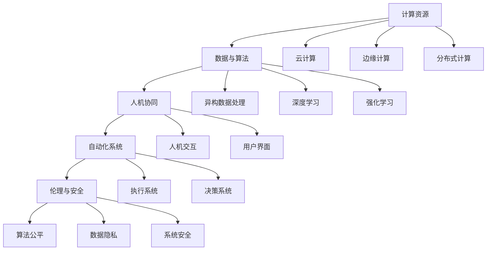

                 

# 计算本质变化与自动化技术

## 1. 背景介绍

### 1.1 问题由来

计算技术的进步改变了人类社会的基础设施结构，信息处理和决策支持的智能化趋势正迅速渗透到各个领域，推动着产业转型和社会进步。随着人工智能(AI)、机器学习(ML)等技术的发展，自动化技术的边界和深度不断被拓宽，各种场景下的自动化系统变得日益复杂。

自动化技术的发展使生产力和效率得到极大提升，但同时也带来了一系列新的问题和挑战，如数据隐私、算法公平性、系统安全等。计算技术所承载的核心本质发生了显著变化，需要我们在理论与实践中，不断探索、理解和应对这些变化。

### 1.2 问题核心关键点

自动化技术的本质变化可以从以下几个维度进行理解：

- **计算资源的多样化和异构性**：云计算、边缘计算、分布式计算等多样化的计算模式，使得数据处理和决策支持不再局限于传统的中心化集中计算，而是逐步向分布式、异构化方向发展。

- **数据与算法的多样性**：随着数据源的多样化，数据种类和格式不断增多，需要采用异构数据处理和融合技术，同时算法模型也更加复杂，从传统的线性模型向深度学习、强化学习等方向发展。

- **计算与执行的分离**：随着软件定义计算(SDC)理念的提出，计算与执行分离成为可能，计算资源可以像软件一样进行编排和调度，提升了系统弹性和灵活性。

- **人与系统的协同**：自动化技术的最终目标在于提升人机协同的工作效率，而非简单替代人工，因此如何设计人机交互界面，提升系统的可用性和用户体验，变得尤为重要。

- **技术与伦理的融合**：自动化系统承载着大量数据和决策，其伦理和法律责任不容忽视，如何平衡效率与公平、自由与约束，是自动化技术应用过程中必须面对的重要课题。

本博客将围绕这些关键点，深入探讨计算技术进步对自动化技术的本质影响，以及应对这些变化的创新思路和实践方法。

## 2. 核心概念与联系

### 2.1 核心概念概述

为了更好地理解自动化技术的本质变化，本节将介绍几个核心概念，并阐述它们之间的联系：

- **自动化系统**：一种基于软件、硬件结合，能够自动完成特定任务的系统，涉及数据收集、处理、决策、执行等环节。

- **计算资源**：包括计算硬件（如CPU、GPU、TPU）和软件（如操作系统、编程语言）等，是支持自动化系统运行的基础设施。

- **数据与算法**：数据是自动化系统决策的基础，算法则是处理和利用数据的工具。

- **人机协同**：指人机交互界面设计和系统使用体验的提升，使人类与自动化系统的互动更加高效和谐。

- **伦理与安全**：涉及自动化系统决策过程中的公平性、透明性、隐私保护和安全性等问题。

这些核心概念之间存在着紧密的联系，构成了一个完整的自动化技术生态系统。计算资源提供了系统运行的基础平台，数据和算法支撑了系统的核心功能，人机协同提升了用户体验，而伦理与安全则确保了系统的可信性和责任归属。

### 2.2 核心概念原理和架构的 Mermaid 流程图



这个流程图展示了自动化系统构建中涉及的关键要素及其相互关系：

- **计算资源（A）**：提供多层次的计算平台，支持分布式、异构化计算。
- **数据与算法（B）**：异构数据处理和复杂算法模型是系统决策的核心。
- **人机协同（C）**：通过人机交互界面和用户界面提升用户体验。
- **自动化系统（D）**：结合计算、数据、算法和人机协同功能，执行具体任务。
- **伦理与安全（E）**：确保系统决策的公平性和安全性。

以上各要素紧密联系，共同构建起了一个完整的自动化系统。理解这些要素及其关系，有助于深入分析自动化技术的本质变化，以及设计更高效的自动化系统。

## 3. 核心算法原理 & 具体操作步骤

### 3.1 算法原理概述

自动化技术中的核心算法，主要集中在以下几个方面：

- **数据预处理**：包括数据清洗、特征提取、数据增强等，为算法训练和决策提供高质量输入。
- **算法模型**：包括监督学习、无监督学习、强化学习等，用于从数据中提取知识，并进行决策。
- **模型训练与优化**：利用优化算法（如梯度下降、Adam等），训练模型以最小化损失函数，提升预测准确率。
- **模型集成与融合**：通过集成多个模型，或将不同模型进行融合，提升决策的鲁棒性和泛化能力。
- **模型部署与监控**：将训练好的模型部署到生产环境中，并设置监控机制，确保模型性能和稳定性。

这些算法原理构成了自动化技术的核心，而计算资源的多样化和异构性、数据与算法的多样性、计算与执行的分离等本质变化，为这些算法提出了新的要求和挑战。

### 3.2 算法步骤详解

以下是一个典型的自动化系统构建和部署流程，包括各个关键步骤的详细解释：

1. **需求分析**：明确自动化系统需要解决的具体问题，包括功能需求和性能指标等。

2. **数据准备**：收集和整理数据，进行清洗、标注等预处理，确保数据质量和完整性。

3. **模型选择**：根据问题特点选择合适的算法模型，如监督学习、无监督学习、强化学习等。

4. **模型训练**：使用训练数据集训练模型，调整模型超参数，最小化损失函数。

5. **模型评估**：在验证数据集上评估模型性能，选择最优模型。

6. **模型优化**：对模型进行调优，如使用正则化、Dropout、早停等技术防止过拟合。

7. **模型部署**：将模型部署到生产环境中，进行集成和调度。

8. **监控与迭代**：对模型性能进行实时监控，根据反馈进行模型更新和迭代。

### 3.3 算法优缺点

自动化系统中的核心算法有以下优点：

- **自动化决策**：通过算法模型，自动化系统能够快速、准确地完成决策任务，提高效率。
- **可扩展性强**：算法模型可以在不同规模的数据集上进行调整和优化，适应复杂的业务需求。
- **泛化能力强**：经过充分训练的模型，可以泛化到不同的场景和数据分布上，提高系统的通用性。

同时，这些算法也存在一些缺点：

- **数据依赖性强**：算法的表现高度依赖于数据质量和数据量，需要大量高质量标注数据。
- **模型复杂度高**：复杂算法模型训练和调优的计算成本较高，需要高性能计算资源。
- **模型解释性差**：黑盒模型（如深度学习）难以解释决策过程，缺乏可解释性。

### 3.4 算法应用领域

自动化技术在多个领域得到了广泛应用，例如：

- **工业自动化**：如制造业的生产线自动化、质量检测自动化等。
- **医疗自动化**：如病历分析、医学影像诊断等。
- **金融自动化**：如风险评估、交易策略优化等。
- **零售自动化**：如库存管理、客户推荐等。
- **交通自动化**：如自动驾驶、交通流量管理等。
- **能源自动化**：如智能电网、能源消耗优化等。

## 4. 数学模型和公式 & 详细讲解 & 举例说明

### 4.1 数学模型构建

自动化系统中的数学模型，通常包括以下几个部分：

- **损失函数**：如均方误差、交叉熵等，用于衡量模型预测值与真实值之间的差异。
- **优化目标**：如最小化损失函数，提升模型预测准确率。
- **模型参数**：如权重、偏置等，需要通过优化算法进行调整。
- **数据集**：如训练集、验证集、测试集等，用于模型训练和评估。

### 4.2 公式推导过程

以线性回归模型为例，推导模型的优化目标和损失函数：

设模型为 $y = \theta^T x + b$，其中 $y$ 为预测值，$x$ 为输入特征，$\theta$ 为模型参数，$b$ 为截距。损失函数为均方误差（MSE）：

$$
L(y, \theta) = \frac{1}{2} \sum_{i=1}^n (y_i - \theta^T x_i - b)^2
$$

优化目标为最小化损失函数：

$$
\min_{\theta, b} L(y, \theta)
$$

通过求解梯度下降方程，更新模型参数：

$$
\theta \leftarrow \theta - \eta \nabla_{\theta} L(y, \theta)
$$

其中 $\eta$ 为学习率，$\nabla_{\theta} L(y, \theta)$ 为损失函数对模型参数的梯度。

### 4.3 案例分析与讲解

以金融领域的信用评分系统为例，展示如何构建和优化自动化决策模型：

- **数据准备**：收集用户历史交易数据，包括消费金额、信用记录等，进行数据清洗和特征提取。
- **模型选择**：选择逻辑回归、随机森林等模型进行信用评分。
- **模型训练**：使用训练集训练模型，调整超参数，最小化损失函数。
- **模型评估**：在验证集上评估模型性能，选择最优模型。
- **模型优化**：通过正则化等技术防止过拟合。
- **模型部署**：将模型部署到生产环境中，进行实时信用评分。
- **监控与迭代**：根据反馈数据，定期更新模型参数，提升模型准确率。

## 5. 项目实践：代码实例和详细解释说明

### 5.1 开发环境搭建

自动化系统开发通常需要在高性能计算资源的支持下进行，以下是常见的开发环境搭建流程：

1. **安装Python和相关库**：使用Anaconda或Miniconda安装Python和相关库，如TensorFlow、PyTorch、Scikit-learn等。

2. **安装CUDA和cuDNN**：安装NVIDIA CUDA和cuDNN，用于加速深度学习模型的训练和推理。

3. **配置GPU**：在系统中配置GPU设备，确保模型在GPU上进行训练和推理。

4. **搭建服务器**：使用Kubernetes、Docker等容器化技术搭建服务器，支持分布式计算和自动扩展。

### 5.2 源代码详细实现

以下是一个简单的信用评分系统的实现，使用TensorFlow进行模型训练和推理：

```python
import tensorflow as tf
import numpy as np

# 准备数据
X_train = np.random.rand(1000, 3)
y_train = np.random.rand(1000, 1)

# 定义模型
model = tf.keras.Sequential([
    tf.keras.layers.Dense(64, activation='relu', input_shape=(3,)),
    tf.keras.layers.Dense(1)
])

# 编译模型
model.compile(optimizer=tf.keras.optimizers.Adam(0.001), loss='mse')

# 训练模型
model.fit(X_train, y_train, epochs=10, batch_size=32)

# 评估模型
y_pred = model.predict(X_train)
print(np.mean(np.square(y_pred - y_train)))
```

### 5.3 代码解读与分析

以上代码展示了信用评分系统的核心流程：

- **数据准备**：生成随机数据作为训练集。
- **模型定义**：定义一个简单的线性回归模型。
- **模型编译**：选择合适的优化器和损失函数。
- **模型训练**：使用随机梯度下降算法，最小化均方误差损失函数。
- **模型评估**：在训练集上计算预测值的均方误差。

## 6. 实际应用场景

### 6.1 工业自动化

工业自动化系统能够自动完成生产线上的各项任务，如制造、装配、质检等。通过自动化系统的引入，企业可以大幅提高生产效率，降低人力成本。例如，使用机器视觉技术自动检测产品质量，使用机器人自动化完成焊接、装配等操作。

### 6.2 医疗自动化

医疗自动化系统能够辅助医生进行疾病诊断、药物推荐等任务。例如，基于深度学习模型的医学影像识别系统，能够自动检测病变区域，提高诊断效率和准确性。同时，智能医疗助手能够根据病人的历史数据，推荐个性化的治疗方案。

### 6.3 金融自动化

金融自动化系统能够辅助金融机构进行风险评估、交易策略优化等任务。例如，基于深度学习模型的信用评分系统，能够自动评估客户的信用风险，帮助银行进行贷款审批。同时，智能交易系统能够自动执行交易策略，提高投资收益。

### 6.4 未来应用展望

随着计算资源的多样化和异构性、数据与算法的多样性、计算与执行的分离等本质变化，自动化技术将呈现出以下几个发展趋势：

1. **边缘计算**：越来越多的计算任务将在边缘设备上进行，减少数据传输延迟，提高系统响应速度。

2. **异构数据融合**：随着数据来源的多样化，异构数据融合技术将变得更加重要，提升系统的综合决策能力。

3. **计算与执行分离**：软件定义计算（SDC）理念将进一步推广，计算资源和执行资源分离，提升系统弹性和灵活性。

4. **人机协同增强**：人机交互界面设计和系统用户体验的提升将成为自动化技术的重要方向，提高系统的可用性和用户满意度。

5. **伦理与安全性**：自动化系统的公平性、透明性和安全性问题将得到更多关注，确保系统的可信性和安全性。

## 7. 工具和资源推荐

### 7.1 学习资源推荐

为了帮助开发者系统掌握自动化技术的核心概念和实践方法，这里推荐一些优质的学习资源：

1. **《深度学习》课程**：斯坦福大学Andrew Ng教授的深度学习课程，系统讲解深度学习基础和算法原理。

2. **《TensorFlow实战》书籍**：TensorFlow官方推荐书籍，涵盖TensorFlow的基本用法和高级应用。

3. **《Python数据科学手册》**：讲解Python在数据科学领域的应用，包括数据处理、机器学习、可视化等。

4. **Kaggle竞赛平台**：参与Kaggle竞赛，实战练习机器学习算法和模型优化。

5. **GitHub开源项目**：加入GitHub上的开源项目，学习最佳实践和代码实现。

### 7.2 开发工具推荐

高效的开发离不开优秀的工具支持。以下是几款用于自动化系统开发的常用工具：

1. **TensorFlow**：由Google开发的深度学习框架，支持分布式计算和自动微分，广泛应用于自动化系统的核心算法模型开发。

2. **PyTorch**：由Facebook开发的深度学习框架，支持动态图和静态图两种计算模型，灵活性高。

3. **Kubernetes**：Google开源的容器编排工具，支持自动化系统的分布式计算和资源管理。

4. **Docker**：容器化技术，支持自动化系统的快速部署和扩展。

5. **Jupyter Notebook**：交互式编程环境，支持自动化系统的模型训练和数据探索。

6. **Visual Studio Code**：轻量级集成开发环境，支持自动化系统的代码编写和调试。

### 7.3 相关论文推荐

自动化技术的发展源于学界的持续研究。以下是几篇奠基性的相关论文，推荐阅读：

1. **《深度学习》**：Goodfellow等著，全面介绍了深度学习原理和应用。

2. **《TensorFlow: A System for Large-Scale Machine Learning》**：Martin Abadi等著，介绍了TensorFlow的设计理念和核心技术。

3. **《Google's Machine Learning Crash Course》**：Google官方课程，讲解机器学习基础和TensorFlow基本用法。

4. **《Adversarial Examples》**：Ian Goodfellow等著，探讨深度学习模型的鲁棒性和安全性问题。

5. **《Python数据科学手册》**：Jake VanderPlas著，讲解Python在数据科学领域的应用，包括数据处理、机器学习、可视化等。

这些论文代表了大数据、深度学习和自动化技术的发展脉络，通过学习这些前沿成果，可以帮助研究者把握学科前进方向，激发更多的创新灵感。

## 8. 总结：未来发展趋势与挑战

### 8.1 研究成果总结

本文对计算技术进步对自动化技术的本质影响进行了系统探讨，明确了计算资源的多样化和异构性、数据与算法的多样性、计算与执行的分离等本质变化，并阐述了这些变化对自动化系统构建和部署的影响。

### 8.2 未来发展趋势

未来，自动化技术将呈现以下几个发展趋势：

1. **计算资源的多样化和异构性**：云计算、边缘计算、分布式计算等多样化的计算模式，将使得数据处理和决策支持不再局限于传统的中心化集中计算，而是逐步向分布式、异构化方向发展。

2. **数据与算法的多样性**：随着数据源的多样化，数据种类和格式不断增多，需要采用异构数据处理和融合技术，同时算法模型也更加复杂，从传统的线性模型向深度学习、强化学习等方向发展。

3. **计算与执行的分离**：随着软件定义计算（SDC）理念的提出，计算与执行分离成为可能，计算资源可以像软件一样进行编排和调度，提升了系统弹性和灵活性。

4. **人机协同增强**：人机交互界面设计和系统用户体验的提升将成为自动化技术的重要方向，提高系统的可用性和用户满意度。

5. **伦理与安全性**：自动化系统的公平性、透明性和安全性问题将得到更多关注，确保系统的可信性和安全性。

### 8.3 面临的挑战

尽管自动化技术已经取得了显著进展，但在迈向更加智能化、普适化应用的过程中，它仍面临诸多挑战：

1. **数据隐私保护**：自动化系统涉及大量数据处理，如何确保数据隐私和安全性是一个重要问题。

2. **算法公平性**：自动化系统决策过程可能存在偏见，如何确保决策过程的公平性和透明性，是一个重要挑战。

3. **系统鲁棒性**：自动化系统面对复杂环境时，如何保持稳定性和鲁棒性，避免出现系统崩溃或错误决策，是一个需要深入研究的问题。

4. **计算资源管理**：自动化系统需要高效管理计算资源，如何优化资源利用率，降低系统成本，是一个重要挑战。

5. **用户交互体验**：自动化系统如何设计良好的人机交互界面，提升用户体验，是一个重要挑战。

### 8.4 研究展望

未来的自动化技术需要从以下几个方面寻求新的突破：

1. **边缘计算和异构计算**：探索边缘计算和异构计算技术，提升系统响应速度和计算效率。

2. **异构数据融合和智能决策**：开发异构数据融合和智能决策技术，提升系统的综合决策能力。

3. **计算与执行分离**：进一步研究计算与执行分离技术，提升系统的弹性和灵活性。

4. **人机协同设计**：设计更加高效的人机协同界面，提升系统的用户体验和可用性。

5. **伦理与安全性**：加强自动化系统的公平性、透明性和安全性研究，确保系统的可信性和用户满意度。

这些研究方向的探索，将引领自动化技术迈向更高的台阶，为构建安全、可靠、可解释、可控的智能系统铺平道路。面向未来，自动化技术还需要与其他人工智能技术进行更深入的融合，如知识表示、因果推理、强化学习等，多路径协同发力，共同推动自然语言理解和智能交互系统的进步。只有勇于创新、敢于突破，才能不断拓展计算技术的边界，让智能技术更好地造福人类社会。

## 9. 附录：常见问题与解答

**Q1: 什么是计算资源的多样化和异构性？**

A: 计算资源的多样化和异构性指的是计算硬件（如CPU、GPU、TPU）和软件（如操作系统、编程语言）等计算资源的多样化。云计算、边缘计算、分布式计算等多样化的计算模式，使得数据处理和决策支持不再局限于传统的中心化集中计算，而是逐步向分布式、异构化方向发展。

**Q2: 什么是计算与执行的分离？**

A: 计算与执行的分离（Software-Defined Compute, SDC）指的是计算资源和执行资源的分离，计算资源可以像软件一样进行编排和调度，提升了系统弹性和灵活性。

**Q3: 什么是人机协同设计？**

A: 人机协同设计指的是在自动化系统的设计和开发过程中，充分考虑人机交互界面和用户体验，提升系统的可用性和用户满意度。

**Q4: 什么是伦理与安全？**

A: 伦理与安全指的是自动化系统在决策过程中的公平性、透明性和安全性问题，确保系统的可信性和用户满意度。

**Q5: 如何处理自动化系统的数据隐私问题？**

A: 处理自动化系统的数据隐私问题，可以采用数据脱敏、加密、匿名化等技术，确保数据的隐私和安全。同时，需要建立严格的数据使用和管理制度，规范数据的使用范围和权限。

---

作者：禅与计算机程序设计艺术 / Zen and the Art of Computer Programming

