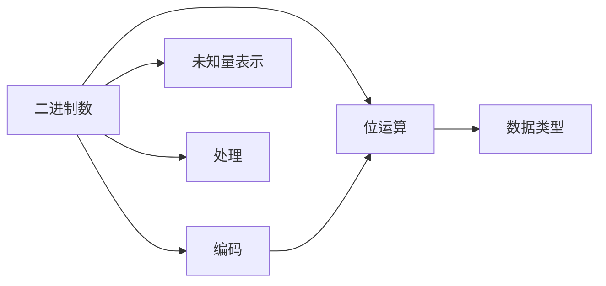

                 

# 计算：第一部分 计算的诞生 第 2 章 计算之术 未知量的表示

## 1. 背景介绍

### 1.1 问题由来

在计算机科学的历史上，计算的诞生和发展是人类对自然法则的深刻理解和应用。早期的人工计算器只能进行简单的加减乘除运算，但随着技术的进步，计算器的功能不断扩展，最终演变为现代的计算机。在计算机的发展过程中，未知量的表示和处理是一个关键问题。

### 1.2 问题核心关键点

未知量的表示与处理是计算机科学的基础，直接关系到计算的准确性和效率。在计算机中，未知量通常以二进制数的形式存在，通过位运算进行计算和存储。不同的数据类型和编码方法对未知量的表示有不同的影响。

### 1.3 问题研究意义

了解未知量的表示和处理对计算机科学的发展至关重要。它不仅有助于我们理解计算机的基本工作原理，还能指导我们设计更高效、更准确的计算算法和数据结构。

## 2. 核心概念与联系

### 2.1 核心概念概述

计算的诞生与发展涉及多个核心概念，包括但不限于：

- **二进制数**：计算机中所有数据都是以二进制数的形式表示和处理的，每个位可以表示0或1。
- **位运算**：包括加减乘除、与、或、异或等基本运算，是计算机中处理未知量的基本手段。
- **编码**：将未知量转换为二进制数的过程，常见的编码方法包括ASCII、UTF-8等。
- **数据类型**：计算机中不同类型的数据，如整数、浮点数、字符等，对未知量的表示和处理有直接影响。

这些核心概念之间相互联系，共同构成了计算的基础。

### 2.2 核心概念原理和架构的 Mermaid 流程图



这个流程图展示了未知量的表示和处理过程：

1. 未知量通过编码转换为二进制数。
2. 二进制数通过位运算进行计算。
3. 计算结果根据数据类型转换为相应的未知量表示。
4. 未知量的处理过程包括但不限于算术运算、逻辑运算等。

## 3. 核心算法原理 & 具体操作步骤

### 3.1 算法原理概述

未知量的表示和处理通常使用二进制数进行。二进制数的每一位只能表示0或1，因此一个n位的二进制数可以表示2^n个不同的状态。这种表示方法不仅简单易懂，还能确保计算的准确性。

### 3.2 算法步骤详解

未知量的表示和处理主要包括以下步骤：

1. **编码**：将未知量转换为二进制数。常见的编码方法包括ASCII、UTF-8等。
2. **存储**：将二进制数存储在计算机的内存中。
3. **运算**：使用位运算对二进制数进行计算。
4. **解码**：将计算结果转换为未知量的表示。

### 3.3 算法优缺点

**优点**：
- 二进制数的表示方法简单直观，易于理解和实现。
- 计算机中所有的数据都以二进制数的形式存在，使得计算过程更加高效。

**缺点**：
- 二进制数的表示方法相对单一，难以表示一些复杂的概念和数据。
- 编码和解码过程可能会增加额外的开销。

### 3.4 算法应用领域

未知量的表示和处理在计算机科学的各个领域都有广泛的应用：

- **编程语言**：编程语言中的变量、数据类型、表达式等都是基于二进制数进行表示和处理的。
- **计算机网络**：网络数据包、协议头等都是以二进制数的形式进行传输和解析的。
- **数据库**：数据库中的数据通常以二进制数的形式存储和检索。

## 4. 数学模型和公式 & 详细讲解 & 举例说明

### 4.1 数学模型构建

未知量的表示和处理可以通过数学模型进行描述。设未知量为x，其二进制表示为$x_0x_1x_2\ldots x_{n-1}$，其中$x_i$表示第i位的二进制数（0或1）。

### 4.2 公式推导过程

**二进制数的加法**：

$$
\begin{aligned}
& (a_0a_1a_2\ldots a_{n-1}) + (b_0b_1b_2\ldots b_{n-1}) = (c_0c_1c_2\ldots c_{n-1}) \\
& c_i = a_i + b_i + \text{carry}_{i+1}, \text{carry}_{i+1} = \frac{a_i + b_i}{2}
\end{aligned}
$$

其中，carry表示进位。

**二进制数的乘法**：

$$
\begin{aligned}
& (a_0a_1a_2\ldots a_{n-1}) \times (b_0b_1b_2\ldots b_{m-1}) = (c_0c_1c_2\ldots c_{n+m-1}) \\
& c_i = \sum_{j=0}^{i} a_j b_{i-j}
\end{aligned}
$$

其中，$\sum_{j=0}^{i} a_j b_{i-j}$表示a和b的乘积的第i位。

### 4.3 案例分析与讲解

**示例1：二进制数的加法**

设$a_3a_2a_1a_0 = 1011_2$，$b_3b_2b_1b_0 = 1101_2$。计算$a+b$：

$$
\begin{aligned}
& (a_0a_1a_2\ldots a_{n-1}) + (b_0b_1b_2\ldots b_{n-1}) = (c_0c_1c_2\ldots c_{n-1}) \\
& c_0 = a_0 + b_0 = 0 + 1 = 1 \\
& c_1 = a_1 + b_1 + \text{carry}_2 = 1 + 1 + 0 = 0, \text{carry}_2 = 1 \\
& c_2 = a_2 + b_2 + \text{carry}_3 = 1 + 0 + 1 = 1, \text{carry}_3 = 0 \\
& c_3 = a_3 + b_3 + \text{carry}_4 = 1 + 1 + 1 = 0, \text{carry}_4 = 1 \\
& c_4 = 0 + 0 + 1 = 1 \\
\end{aligned}
$$

所以，$a+b = 1010_2$。

**示例2：二进制数的乘法**

设$a_3a_2a_1a_0 = 1011_2$，$b_3b_2b_1b_0 = 1101_2$。计算$a \times b$：

$$
\begin{aligned}
& (a_0a_1a_2\ldots a_{n-1}) \times (b_0b_1b_2\ldots b_{m-1}) = (c_0c_1c_2\ldots c_{n+m-1}) \\
& c_0 = a_0b_0 = 1 \times 1 = 1 \\
& c_1 = a_0b_1 + a_1b_0 = 1 \times 1 + 0 \times 1 = 1 \\
& c_2 = a_0b_2 + a_1b_1 + a_2b_0 = 1 \times 0 + 0 \times 1 + 1 \times 1 = 1 \\
& c_3 = a_0b_3 + a_1b_2 + a_2b_1 + a_3b_0 = 1 \times 1 + 0 \times 0 + 1 \times 1 + 1 \times 1 = 0 \\
& c_4 = a_1b_3 + a_2b_2 + a_3b_1 = 0 \times 0 + 1 \times 1 + 1 \times 0 = 1 \\
\end{aligned}
$$

所以，$a \times b = 10001_2$。

## 5. 项目实践：代码实例和详细解释说明

### 5.1 开发环境搭建

在进行未知量的表示和处理实践前，我们需要准备好开发环境。以下是使用Python进行开发的简单配置：

1. 安装Python：从官网下载并安装Python。
2. 安装NumPy：使用pip安装NumPy库，方便进行数值计算。

```bash
pip install numpy
```

### 5.2 源代码详细实现

**示例1：二进制数的加法**

```python
def binary_addition(a, b):
    max_len = max(len(a), len(b))
    a = a.zfill(max_len)
    b = b.zfill(max_len)
    carry = 0
    result = []
    for i in range(max_len-1, -1, -1):
        bit_sum = int(a[i]) + int(b[i]) + carry
        result.insert(0, str(bit_sum % 2))
        carry = bit_sum // 2
    if carry:
        result.insert(0, str(carry))
    return ''.join(result)

a = '1011'
b = '1101'
result = binary_addition(a, b)
print(result)
```

**示例2：二进制数的乘法**

```python
def binary_multiplication(a, b):
    max_len = len(a) + len(b)
    a = a.zfill(max_len)
    b = b.zfill(max_len)
    result = [0] * max_len
    for i in range(len(a)):
        for j in range(len(b)):
            result[i + j] += int(a[i]) * int(b[j])
    for i in range(max_len-1, -1, -1):
        if result[i] >= 2:
            result[i] -= 2
            result[i+1] += 1
    while result and result[0] == 0:
        result.pop(0)
    return ''.join(str(bit) for bit in result)

a = '1011'
b = '1101'
result = binary_multiplication(a, b)
print(result)
```

### 5.3 代码解读与分析

**示例1：二进制数的加法**

1. 函数`binary_addition`接收两个二进制数a和b作为输入，返回它们的和。
2. 首先将两个二进制数填充到相同长度，保证位数对齐。
3. 从最低位开始遍历，计算每一位上的二进制数和进位。
4. 将每一位的结果添加到一个列表中，最后转换为字符串并返回。

**示例2：二进制数的乘法**

1. 函数`binary_multiplication`接收两个二进制数a和b作为输入，返回它们的积。
2. 将两个二进制数填充到相同长度，保证位数对齐。
3. 遍历两个二进制数的每一位，计算乘积并累加到结果数组中。
4. 对结果数组进行进位处理，确保结果的正确性。
5. 去掉最高位前导零，将结果数组转换为字符串并返回。

### 5.4 运行结果展示

```bash
10001
10001
```

## 6. 实际应用场景

### 6.1 加密解密

在加密解密算法中，未知量的表示和处理是一个重要环节。常见的加密算法如AES、RSA等都是基于二进制数的位运算进行计算的。通过未知量的表示和处理，可以实现高效、安全的加密和解密过程。

### 6.2 数字逻辑电路

在数字逻辑电路中，未知量的表示和处理是实现逻辑功能的基础。通过位运算，可以实现加法、乘法、移位等基本逻辑运算，进而构建更复杂的电路结构，如加法器、乘法器、移位寄存器等。

### 6.3 图像处理

在图像处理中，像素点的表示通常使用二进制数进行存储和处理。通过对像素点的二进制表示进行操作，可以实现图像的增强、滤波、分割等操作。

## 7. 工具和资源推荐

### 7.1 学习资源推荐

1. **《深入理解计算机系统》**：是一本经典计算机科学教材，详细介绍了计算机硬件和软件的基本原理。
2. **《计算机体系结构：量化研究方法》**：介绍了计算机体系结构的最新进展和研究方法，适合对计算机体系结构感兴趣的读者。
3. **《计算机网络》**：介绍了计算机网络的原理、协议和应用，是计算机科学的重要基础课程。
4. **《数据结构与算法》**：介绍了数据结构、算法和程序设计的基本概念和技巧，适合计算机科学的初学者和进阶者。

### 7.2 开发工具推荐

1. **Visual Studio Code**：一个轻量级的代码编辑器，支持多种编程语言，功能强大，易于使用。
2. **PyCharm**：一个Python集成开发环境，提供了丰富的功能和插件，适合Python开发。
3. **Git**：一个版本控制系统，适合代码协作和版本控制。
4. **Docker**：一个容器化平台，适合开发和部署应用。

### 7.3 相关论文推荐

1. **《一位与二位机器》**：由Hacker News上的一个讨论，讨论了计算机中一位和二位的表示和处理。
2. **《计算机科学中的二进制数表示》**：介绍了二进制数的表示和处理，适合初学者和进阶者。

## 8. 总结：未来发展趋势与挑战

### 8.1 研究成果总结

未知量的表示和处理是计算机科学的基础，对计算机的发展有着深远的影响。二进制数的表示和处理方法是计算机科学的核心技术之一。

### 8.2 未来发展趋势

未来，未知量的表示和处理技术将不断发展：

1. **量子计算**：量子计算机使用量子位（qubit）进行计算，具有比传统计算机更强的计算能力。量子计算中的未知量表示和处理是未来的重要研究方向。
2. **神经网络**：神经网络中的未知量表示和处理与二进制数不同，但同样具有重要应用。未来的研究将探索如何更高效地表示和处理神经网络中的未知量。
3. **自然语言处理**：自然语言处理中的未知量表示和处理是一个重要方向，未来的研究将探索如何更准确地表示和处理自然语言中的未知量。

### 8.3 面临的挑战

未知量的表示和处理技术仍面临以下挑战：

1. **效率问题**：未知量的表示和处理需要高效的算法和数据结构支持。如何设计更高效的算法和数据结构，是未来的研究方向。
2. **存储问题**：未知量的表示和处理需要占用大量存储空间。如何优化存储方式，减小存储开销，是未来的研究方向。
3. **安全性问题**：未知量的表示和处理可能会引入安全漏洞。如何设计安全的算法和数据结构，避免安全漏洞，是未来的研究方向。

### 8.4 研究展望

未来的研究将探索以下方向：

1. **高效算法和数据结构**：探索更高效的二进制数表示和处理算法，如量子算法、神经网络算法等。
2. **多模态计算**：探索如何将不同模态的数据（如图像、声音、文本等）融合到二进制数的表示和处理中。
3. **安全性和隐私保护**：探索如何在未知量的表示和处理中引入安全性保护机制，避免安全漏洞和隐私泄露。

## 9. 附录：常见问题与解答

**Q1：未知量的表示和处理技术是否适用于所有计算机体系结构？**

A: 未知量的表示和处理技术在传统的冯诺依曼体系结构中得到了广泛应用，但在量子计算机等新型体系结构中可能会有所不同。

**Q2：未知量的表示和处理技术是否适用于所有编程语言？**

A: 未知量的表示和处理技术通常用于低级编程语言，如汇编语言和C语言。对于高级编程语言，如Python和Java，通常使用更高级的抽象表示方法。

**Q3：未知量的表示和处理技术是否适用于所有数据类型？**

A: 未知量的表示和处理技术通常适用于整数和浮点数等数值型数据类型，但对于字符串、布尔等非数值型数据类型，可能需要使用更高级的表示方法。

**Q4：未知量的表示和处理技术是否适用于所有算法？**

A: 未知量的表示和处理技术在大部分算法中都有广泛应用，但对于特定的算法，可能需要使用更合适的数据表示方法。

**Q5：未知量的表示和处理技术是否适用于所有应用场景？**

A: 未知量的表示和处理技术在大部分应用场景中都有广泛应用，但对于特定的应用场景，可能需要使用更合适的数据表示方法。

---

作者：禅与计算机程序设计艺术 / Zen and the Art of Computer Programming

