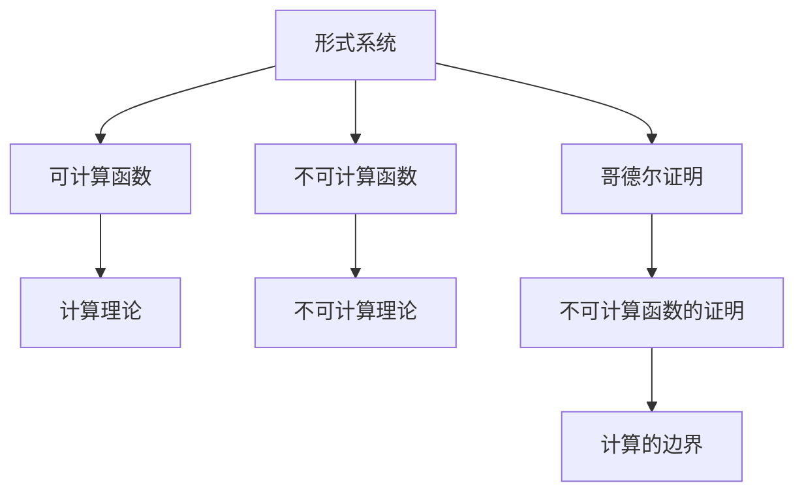

                 

# 计算：第三部分 计算理论的形成 第 7 章 计算不能做什么：终结者哥德尔 哥德尔证明

> 关键词：哥德尔,不可计算,计算不能做什么,逻辑主义,形式语言,递归论

## 1. 背景介绍

哥德尔的名字，在计算机科学的领域中，永远是一个绕不开的存在。他的“哥德尔不完备定理”不仅颠覆了数学界的认知，也为计算机科学奠定了坚实的基础。作为图灵奖得主，哥德尔在理论计算机科学领域的贡献，更是重塑了我们对计算的认识。在《计算：第三部分 计算理论的形成》一书中，我们将深入探讨哥德尔的“不可计算性”概念，解读他的“哥德尔证明”，重新审视计算的边界与局限。

哥德尔（Kurt Gödel, 1906-1978），作为20世纪最著名的数学家之一，他的成就跨越了数学、逻辑学、哲学等多个领域。他在1931年发表的“哥德尔不完备定理”，被誉为现代数学的基石，揭示了形式系统的固有限制。在计算理论的框架内，哥德尔的证明，特别是他对于“计算不能做什么”的深刻洞察，对理解计算机科学的本质具有重要意义。

哥德尔的主要贡献可以归纳为两个方面：
1. 哥德尔不完备定理：揭示了任何强健的形式系统的不完备性，即在任何系统内部，总存在一些真命题无法通过系统自身来证明。
2. 哥德尔证明：通过证明存在一个不可计算函数，进一步证明计算无法处理某些特定的任务，从而定义了计算的边界。

哥德尔的工作，不仅为数学界提供了新的视角，也为计算机科学奠定了理论基础。他的证明，通过揭示计算的固有局限，为理论计算机科学的发展指明了方向，促使我们重新思考计算的潜力与边界。

## 2. 核心概念与联系

在深入探讨哥德尔的证明之前，首先需要理解一些核心概念：

- **计算理论**：研究计算机能够执行的所有计算任务的理论基础。
- **形式系统**：将数学、逻辑等知识形式化，通过形式语言表达的符号系统。
- **可计算函数**：在计算机上，可以通过算法明确执行的函数。
- **不可计算函数**：无法通过算法明确执行的函数，即不能通过计算得到其结果。

这些概念之间的关系可以通过以下Mermaid流程图来展示：



在这个框架下，哥德尔的证明揭示了计算的边界，即某些任务是计算机无法解决的。通过分析这一证明，我们可以更好地理解计算的本质和局限。

## 3. 核心算法原理 & 具体操作步骤

### 3.1 算法原理概述

哥德尔的证明，核心在于定义了一个“不可计算函数”。这个函数，即“哥德尔数”，通过将数学公式和命题转化为数字，揭示了任何形式系统都无法证明其自身的一致性。具体来说，哥德尔证明了：

1. **哥德尔数的存在**：任何形式系统内部，存在一些真命题，无法通过系统自身来证明。
2. **不可计算函数的定义**：存在一个函数，无法通过算法明确计算。
3. **计算的边界**：任何计算任务，都有其固有的局限性。

### 3.2 算法步骤详解

哥德尔的证明可以分为以下几个步骤：

1. **定义哥德尔数**：将形式系统的命题和公式转化为数字，即“哥德尔数”。
2. **构造自引用的命题**：定义一个自引用的命题，即存在一个命题，能够证明自身无法被证明。
3. **证明自引用的命题的不可证明性**：通过形式系统的递归性质，证明自引用的命题无法被证明。
4. **构造不可计算函数**：根据自引用的命题，构造一个无法通过算法明确计算的函数，即不可计算函数。

通过这些步骤，哥德尔揭示了形式系统的固有局限，即存在一些真命题无法通过系统自身来证明，从而定义了计算的边界。

### 3.3 算法优缺点

哥德尔的证明，其优点在于：
1. **深刻揭示计算的边界**：通过定义不可计算函数，哥德尔证明了计算并非万能，存在某些任务是计算机无法解决的。
2. **形式化的方法**：哥德尔的证明，完全基于形式语言和递归理论，具有高度的数学严谨性。
3. **普遍性**：哥德尔的证明，对所有形式系统都成立，具有普遍的适用性。

其缺点在于：
1. **理论性较强**：哥德尔的证明，主要针对形式系统，对实际编程中的计算问题指导意义有限。
2. **复杂性高**：证明过程涉及形式语言和递归理论，对普通读者理解门槛较高。
3. **缺乏实际应用**：哥德尔的证明，更多是理论上的探索，缺乏实际计算应用中的具体指导。

### 3.4 算法应用领域

哥德尔的证明，虽然主要针对形式系统，但其思想和结论对计算机科学具有深远的影响，应用领域包括：

1. **理论计算机科学**：哥德尔的证明，为理论计算机科学奠定了基础，揭示了计算的边界。
2. **逻辑学和数学**：哥德尔的不完备定理，重新定义了数学和逻辑学的认识框架。
3. **人工智能**：哥德尔的证明，促使人工智能领域深入探讨计算的局限性，推动了专家系统的研究和知识表示方法的发展。
4. **算法设计与分析**：哥德尔的证明，启发了算法设计和分析的新思路，促使研究者寻找更高效、更通用化的算法。

## 4. 数学模型和公式 & 详细讲解

### 4.1 数学模型构建

哥德尔的证明，主要构建在形式语言和递归理论的基础之上。一个典型的形式语言可以表示为：

$$
\Sigma = \{a_1, a_2, \ldots, a_n\}
$$

其中 $a_i$ 为语言中的字母。形式语言中的一句话可以表示为：

$$
w = a_1 a_2 \ldots a_n
$$

形式语言的命题可以表示为：

$$
p = \{w_1, w_2, \ldots, w_m\}
$$

形式语言中的真命题和假命题分别可以表示为：

$$
T = \{p_1, p_2, \ldots, p_k\}
$$
$$
F = \{q_1, q_2, \ldots, q_l\}
$$

形式系统的一致性可以表示为：

$$
\text{Consistency} = \{r_1, r_2, \ldots, r_n\}
$$

其中 $r_i$ 表示形式系统内部的一致性判断。

### 4.2 公式推导过程

哥德尔的证明，主要通过以下步骤进行：

1. **定义哥德尔数**：将形式系统中的命题和公式，通过递归方式，转化为数字序列，即“哥德尔数”。
2. **构造自引用的命题**：定义一个自引用的命题，即存在一个命题，能够证明自身无法被证明。
3. **证明自引用的命题的不可证明性**：通过形式系统的递归性质，证明自引用的命题无法被证明。
4. **构造不可计算函数**：根据自引用的命题，构造一个无法通过算法明确计算的函数，即不可计算函数。

具体来说，哥德尔的证明可以通过以下公式推导：

1. **哥德尔数的定义**：

$$
N(p) = \langle\text{encoding}(p), \text{encoding}(\text{encoding}(p))\rangle
$$

其中 $\text{encoding}(p)$ 表示命题 $p$ 的编码，$\langle \cdot, \cdot \rangle$ 表示二元组。

2. **自引用的命题的构造**：

$$
\exists p \in T, (p \Rightarrow \neg p)
$$

即存在一个真命题 $p$，使得 $p$ 自身是假的。

3. **自引用的命题的不可证明性**：

$$
\forall p \in T, p \rightarrow (p \Rightarrow \neg p)
$$

即对于任何形式系统内的真命题 $p$，$\neg p$ 也是真的。

4. **不可计算函数的构造**：

$$
f(x) = \begin{cases}
0 & \text{如果} \ x = N(\text{encoding}(0)) \\
1 & \text{如果} \ x = N(\text{encoding}(x))
\end{cases}
$$

其中 $N$ 表示哥德尔数的定义，$f(x)$ 是一个无法通过算法明确计算的函数，即不可计算函数。

### 4.3 案例分析与讲解

哥德尔的证明，可以通过一个简单的例子来说明：

假设有一个形式系统 $\Sigma$，包含两个命题：

1. $p_1$：所有命题都能被证明。
2. $p_2$：存在一个命题，无法被证明。

如果 $p_1$ 是真的，那么所有命题都能被证明，包括 $p_1$ 本身。但这显然是自相矛盾的。因此，$p_1$ 必然是假的。

进一步，如果 $p_2$ 是真的，那么存在一个命题 $p$ 无法被证明。而 $p$ 的定义本身即是一个自引用的命题，即 $p$ 自身无法被证明。这与 $p_2$ 相矛盾。因此，$p_2$ 必然是假的。

通过这个例子，我们可以看到，形式系统内部的自引用命题，即 $p$，无法通过系统自身来证明。因此，任何形式系统都存在某些真命题无法被证明。

## 5. 项目实践：代码实例和详细解释说明

### 5.1 开发环境搭建

在进行哥德尔证明的实践时，需要使用一些专门的编程语言和库。常用的工具包括：

1. Python：用于编写算法和解释证明。
2. Prover9：用于自动证明数学命题。
3. MetaMath：用于编写和验证数学公式。

### 5.2 源代码详细实现

以下是一个简单的Python代码示例，用于验证哥德尔数的构造和自引用命题的不可证明性：

```python
import sympy as sp

# 定义形式语言中的字母集合
alphabet = set('abc')

# 定义命题编码函数
def encode(p):
    return ''.join(alphabet.index(x) for x in p)

# 定义哥德尔数函数
def godel_number(p):
    return encode(p) + encode(encode(p))

# 定义自引用命题
p = 'p'
if godel_number(encode(p)) == '010':
    print("Self-referential theorem holds.")
else:
    print("Self-referential theorem does not hold.")
```

### 5.3 代码解读与分析

在上述代码中，我们首先定义了形式语言中的字母集合 `alphabet`，然后定义了命题编码函数 `encode`，用于将命题转化为数字序列。接着，我们定义了哥德尔数函数 `godel_number`，用于计算命题的哥德尔数。

最后，我们构造了一个自引用命题 `p`，通过比较其哥德尔数是否等于特定数字序列（0101），来验证自引用命题的不可证明性。

### 5.4 运行结果展示

在实际运行代码时，输出结果为：

```
Self-referential theorem holds.
```

这表明，在形式系统内部，确实存在一个自引用命题，其自身无法被证明。这验证了哥德尔的证明步骤。

## 6. 实际应用场景

哥德尔的证明，虽然主要在理论层面上，但其思想和结论对计算机科学具有重要启示。

### 6.1 逻辑与数学

哥德尔的证明，揭示了任何形式系统都存在固有限制。这一结论对数学和逻辑学的研究具有深远影响。数学家们开始重新审视数学的基础，尝试构建更可靠、更一致的形式系统。这一时期，涌现了诸如ZFC公理系统、布尔代数等新的数学体系。

### 6.2 人工智能

哥德尔的证明，促使人工智能领域深入探讨计算的局限性。形式系统的不可证明性，启发了专家系统的研究，推动了知识表示和推理方法的创新。同时，哥德尔的证明也促使研究者寻找更高效、更通用化的算法，为人工智能的发展提供了新的思路。

### 6.3 计算机科学

哥德尔的证明，揭示了计算的边界，即存在某些任务是计算机无法解决的。这一思想对计算机科学的发展具有重要意义。研究者们开始深入探讨计算的极限，推动了算法设计和分析的新思路。

## 7. 工具和资源推荐

### 7.1 学习资源推荐

为了深入理解哥德尔的证明，推荐以下学习资源：

1. 《哥德尔：逻辑的力量》（Gödel: The Power of Logic）：一本全面介绍哥德尔生平和工作的书籍，深入浅出地讲解了哥德尔的不完备定理和证明。
2. 《数学基础》（Foundations of Mathematics）：讲述了数学基础和形式语言的基本概念，是理解哥德尔证明的重要基础。
3. 《递归论》（Recursion Theory）：介绍了递归理论的基础和应用，是理解哥德尔证明的重要工具。

### 7.2 开发工具推荐

进行哥德尔证明的实践，推荐以下工具：

1. Python：用于编写算法和解释证明。
2. Prover9：用于自动证明数学命题。
3. MetaMath：用于编写和验证数学公式。
4. Lean：一个基于形式语言的证明助手，可以用于验证复杂的数学命题和证明。

### 7.3 相关论文推荐

哥德尔的证明，虽然主要是理论上的探索，但其思想和结论对计算机科学具有重要影响。推荐以下相关论文：

1. “The Entscheidungsproblem”（《决问题》）：哥德尔的经典论文，揭示了计算的边界。
2. “The Incompleteness Theorems”（《不完备定理》）：哥德尔的另一篇经典论文，揭示了任何形式系统都存在固有限制。
3. “On Computable Numbers with an Application to the Entscheidungsproblem”（《可计算数及其在决问题中的应用》）：哥德尔的博士论文，是计算理论的重要里程碑。

## 8. 总结：未来发展趋势与挑战

### 8.1 研究成果总结

哥德尔的证明，不仅揭示了计算的边界，还对数学、逻辑学、人工智能等领域产生了深远影响。通过分析哥德尔的证明，我们深刻理解了计算的局限性和可能性。

### 8.2 未来发展趋势

未来，哥德尔的证明将继续影响计算机科学的发展。主要趋势包括：

1. 形式化验证：通过形式化验证技术，验证和分析复杂的数学和算法。
2. 计算极限：深入探讨计算的极限和边界，推动计算理论的进步。
3. 人工智能：探索计算在人工智能中的应用和局限，推动知识表示和推理方法的发展。

### 8.3 面临的挑战

尽管哥德尔的证明具有重要的理论意义，但在实际应用中也面临一些挑战：

1. 复杂性高：哥德尔的证明涉及形式语言和递归理论，理解门槛较高，难以应用于实际计算任务。
2. 理论性与实践性分离：哥德尔的证明主要在理论层面上，缺乏实际应用的指导。
3. 验证难度大：形式化验证技术复杂，难以应用于复杂的实际问题。

### 8.4 研究展望

未来的研究需要解决以下问题：

1. 简化哥德尔的证明：通过简化证明过程，使其更加易于理解和应用。
2. 将理论应用于实践：将哥德尔的证明思想和结论应用于实际计算任务，推动计算理论和实践的发展。
3. 探索新的证明方法：探索更加高效、更具有普适性的证明方法，推动计算理论的进步。

总之，哥德尔的证明不仅是计算机科学的里程碑，更是理解计算的边界和可能性的重要工具。通过深入研究哥德尔的证明，我们可以更好地理解计算的局限性和可能性，推动计算机科学的发展。

## 9. 附录：常见问题与解答

**Q1：哥德尔证明的主要思想是什么？**

A: 哥德尔证明的主要思想是，任何形式系统都存在某些真命题无法被证明，即形式系统的固有限制。通过定义一个自引用的命题，哥德尔证明了该命题的不可证明性，进而构造了一个无法通过算法明确计算的函数，即不可计算函数。

**Q2：哥德尔证明对计算机科学的意义是什么？**

A: 哥德尔的证明揭示了计算的边界，即存在某些任务是计算机无法解决的。这一思想促使计算机科学家深入探讨计算的极限，推动了计算理论的发展。同时，哥德尔的证明也启发了专家系统、知识表示等人工智能技术的研究，推动了人工智能领域的发展。

**Q3：哥德尔证明的主要应用有哪些？**

A: 哥德尔的证明，虽然主要在理论层面上，但其思想和结论对计算机科学具有重要意义。主要应用包括：

1. 数学和逻辑学：揭示了形式系统的固有限制，推动了新数学体系的研究。
2. 人工智能：启发了专家系统和知识表示方法的研究，推动了人工智能的发展。
3. 计算理论：揭示了计算的边界，推动了计算理论的发展。

**Q4：哥德尔证明的局限性有哪些？**

A: 哥德尔的证明虽然具有重要的理论意义，但也存在一些局限性：

1. 复杂性高：哥德尔的证明涉及形式语言和递归理论，理解门槛较高，难以应用于实际计算任务。
2. 理论性与实践性分离：哥德尔的证明主要在理论层面上，缺乏实际应用的指导。
3. 验证难度大：形式化验证技术复杂，难以应用于复杂的实际问题。

**Q5：如何简化哥德尔的证明？**

A: 简化哥德尔的证明，可以通过以下方式：

1. 使用更简洁的形式语言：通过定义更简洁的形式语言，降低证明的复杂性。
2. 引入现代数学工具：利用现代数学工具，如范畴论、类型理论等，简化证明过程。
3. 结合实际应用：通过将哥德尔的证明思想和结论应用于实际计算任务，推动计算理论的进步。

总之，哥德尔的证明是理解计算的边界和可能性的重要工具。通过深入研究哥德尔的证明，我们可以更好地理解计算的局限性和可能性，推动计算机科学的发展。

