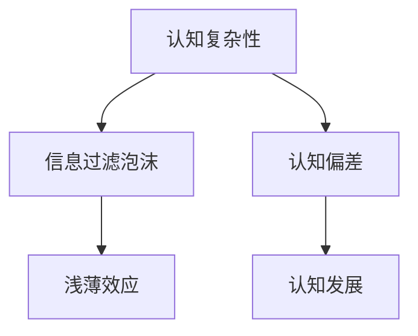

                 

# 认知发展中的浅薄与复杂变化

> 关键词：认知复杂性, 浅薄效应, 认知偏差, 信息过滤泡沫, 认知发展, 人工智能, 学习算法

## 1. 背景介绍

### 1.1 问题由来

在信息爆炸的现代社会，我们每天都被海量的信息所包围。这些信息既包括科技新闻、财经动态，也包括娱乐八卦、网络流言。然而，我们的认知能力并未因此得到相应提升，反而在信息处理上陷入了浅薄效应。

浅薄效应（Shallow Thinking）指的是在信息爆炸的背景下，人们倾向于只关注表面内容，而不深究背后的原因和背景，从而导致认知的浅薄化。这种现象不仅影响了个人认知发展，也对社会的进步和决策造成了负面影响。

### 1.2 问题核心关键点

浅薄效应的核心问题在于：
- 信息过载：现代社会信息量巨大，人类难以处理所有信息。
- 认知过载：面对信息过载，人们更倾向于简化处理，从而陷入浅薄化。
- 信息过滤泡沫：个人认知倾向于强化已有的信念，选择性的接受或拒绝某些信息。
- 认知偏差：人们在面对复杂问题时，往往会基于先入为主的观点做出判断，而非全面客观地分析。

这些关键点共同作用，导致了认知的浅薄化，使我们难以处理复杂问题，做出明智的决策。本文将深入探讨浅薄效应的原理和应对策略，希望通过更高效的认知算法，帮助人们避免陷入浅薄，提升复杂问题处理能力。

## 2. 核心概念与联系

### 2.1 核心概念概述

为了更好地理解认知发展的浅薄效应及其应对策略，本节将介绍几个核心概念：

- 认知复杂性（Cognitive Complexity）：指个体在面对复杂问题时，能多角度、多层次进行思考和分析的能力。认知复杂性高的人能够深入理解问题，做出全面客观的判断。
- 信息过滤泡沫（Information Filter Bubble）：指的是信息平台通过算法推荐机制，让个体只看到符合其兴趣和偏好的信息，屏蔽其他信息。这种信息过滤机制加剧了浅薄效应，使个体难以接触多元化的观点和信息。
- 认知偏差（Cognitive Bias）：指个体在认知过程中，倾向于基于先入为主的观点或经验，产生非理性的判断和行为。常见的认知偏差包括确认偏误、选择偏误等。
- 认知发展（Cognitive Development）：指个体从出生到成年期间，认知能力从简单到复杂、从浅薄到深度的演变过程。

这些核心概念之间的逻辑关系可以通过以下Mermaid流程图来展示：



这个流程图展示了几者之间的相互关系：

1. 认知复杂性与信息过滤泡沫、认知偏差紧密相关。
2. 认知偏差会影响认知发展。
3. 认知发展中包含从浅薄到复杂的演变过程。
4. 浅薄效应是认知偏差和信息过滤泡沫共同作用的结果。

## 3. 核心算法原理 & 具体操作步骤

### 3.1 算法原理概述

为了解决认知发展中的浅薄效应，我们引入了一种基于认知算法的微调方法。该方法通过调整认知模型，使其能够在面对复杂问题时，多角度、多层次地进行思考，从而提升认知复杂性。

该算法的基本思想是：将个体在面对复杂问题时的认知过程视作一个深度学习模型，通过大量复杂案例的标注数据进行有监督微调，优化模型参数，使其输出接近复杂问题的最优解。具体来说，该算法通过以下步骤实现：

1. 收集大量复杂问题的案例，并标注对应的解决方案。
2. 设计认知模型，输入复杂问题的描述，输出解决方案的逻辑推理过程。
3. 使用标注数据对认知模型进行微调，优化模型参数。
4. 通过测试数据集评估模型性能，提升认知复杂性。

### 3.2 算法步骤详解

基于认知算法的微调方法包括以下几个关键步骤：

**Step 1: 准备复杂问题与解决方案**

- 收集包含复杂问题的案例数据，并标注对应的解决方案。这些数据应该涵盖不同领域、不同复杂度的问题，确保数据的全面性和多样性。
- 对标注数据进行预处理，包括数据清洗、特征提取、标注校正等。

**Step 2: 设计认知模型**

- 根据问题的复杂度，设计合适的认知模型结构。认知模型可以基于神经网络、符号逻辑、专家系统等框架。
- 定义模型的输入输出接口，输入为复杂问题的描述，输出为解决方案的逻辑推理过程。
- 设计模型的损失函数，用于衡量模型输出与真实解决方案之间的差异。

**Step 3: 微调认知模型**

- 使用标注数据对认知模型进行微调。一般采用梯度下降等优化算法，最小化损失函数，更新模型参数。
- 定期在测试数据集上评估模型性能，根据评估结果调整模型参数和超参数。
- 微调过程中需要注意避免过拟合，采用正则化技术、对抗训练等手段。

**Step 4: 提升认知复杂性**

- 在微调过程中，不断引入更复杂的问题和解决方案，扩展模型的认知能力。
- 引入专家知识和经验，指导模型的微调过程，增强模型的认知深度。
- 通过反馈机制，及时纠正模型的推理错误，优化模型性能。

### 3.3 算法优缺点

基于认知算法的微调方法具有以下优点：
- 提高认知复杂性：通过有监督微调，使模型能够从复杂案例中学习到深入的逻辑推理过程，提升认知复杂性。
- 增强决策能力：认知模型能够在复杂问题上提供全面客观的解决方案，增强决策能力。
- 支持个性化训练：通过微调算法，认知模型可以针对不同的个体和领域进行个性化训练，适应特定的认知需求。

同时，该方法也存在一些局限性：
- 数据需求高：需要大量的复杂问题与解决方案的标注数据，数据收集和标注工作量大。
- 模型复杂度高：认知模型的设计较为复杂，需要大量的人工干预和调试。
- 计算资源消耗大：大规模标注数据和复杂模型需要大量的计算资源，微调过程耗时较长。

### 3.4 算法应用领域

基于认知算法的微调方法已经在多个领域得到了应用，例如：

- 教育：在教育领域，该方法可以帮助学生从浅薄理解逐步深入到复杂认知。通过认知模型对复杂问题的解法进行剖析，帮助学生理解和掌握知识。
- 商业决策：在商业决策中，该方法可以帮助管理者从多角度、多层次分析问题，做出全面客观的决策。
- 法律咨询：在法律咨询中，该方法可以帮助律师从复杂案例中学习到详细的法律推理过程，提高咨询的准确性和深度。
- 医疗诊断：在医疗诊断中，该方法可以帮助医生从多角度分析患者的病情，做出全面准确的诊断。

除了上述这些经典应用外，认知算法还可以应用于更多场景，如城市规划、政策制定、金融投资等，为复杂问题提供深度的认知解决方案。

## 4. 数学模型和公式 & 详细讲解 & 举例说明

### 4.1 数学模型构建

我们假设认知模型为 $M_{\theta}$，其中 $\theta$ 为模型参数。设复杂问题的描述为 $x$，解决方案的逻辑推理过程为 $y$。目标是从输入 $x$ 推导出输出 $y$。

定义模型的损失函数 $\mathcal{L}$ 为：

$$
\mathcal{L}(M_{\theta},x,y) = \sum_{i=1}^n w_i \ell(M_{\theta}(x),y_i)
$$

其中，$n$ 为复杂问题的数量，$w_i$ 为第 $i$ 个问题的权重，$\ell$ 为用于衡量推理逻辑与真实解法之间的差异的损失函数，如交叉熵损失、均方误差损失等。

### 4.2 公式推导过程

以交叉熵损失为例，假设复杂问题的逻辑推理过程由 $k$ 个节点组成，节点 $i$ 的输出为 $p_i$，目标输出为 $y_i$。交叉熵损失函数为：

$$
\ell(M_{\theta}(x),y) = -\sum_{i=1}^k y_i \log p_i + (1-y_i) \log (1-p_i)
$$

其中 $p_i$ 表示模型推理输出的概率，$y_i$ 表示真实解法中节点 $i$ 的激活状态。

在优化目标函数时，使用梯度下降算法：

$$
\theta \leftarrow \theta - \eta \nabla_{\theta}\mathcal{L}(\theta,x,y)
$$

其中，$\eta$ 为学习率，$\nabla_{\theta}\mathcal{L}(\theta,x,y)$ 为损失函数对模型参数 $\theta$ 的梯度。

### 4.3 案例分析与讲解

以下以一个复杂问题的认知模型微调为例，详细讲解数学模型和公式的实际应用。

假设问题为“如何构建一个高效的供应链管理系统？”，解决方案的逻辑推理过程如下：

1. 分析问题：了解供应链管理的目标、现状、挑战。
2. 提出假设：构建供应链模型的假设条件。
3. 验证假设：通过数据验证假设的有效性。
4. 优化方案：对供应链模型进行优化。

针对上述问题，可以设计一个认知模型，输入为问题的描述，输出为解决方案的逻辑推理过程。该模型的输入和输出可以表示为：

$$
M_{\theta}(x) = \{p_1, p_2, p_3, \dots, p_k\}
$$

其中 $p_i$ 表示节点 $i$ 的激活状态，$k$ 为逻辑推理过程的节点数。

在微调过程中，使用交叉熵损失函数对模型进行优化：

$$
\mathcal{L}(M_{\theta},x,y) = -\sum_{i=1}^k y_i \log p_i + (1-y_i) \log (1-p_i)
$$

其中，$y$ 为真实解法的逻辑推理过程，$p_i$ 为模型推理输出的概率。

通过大量复杂问题的标注数据，不断微调模型参数 $\theta$，使得模型输出接近真实解法。最终得到的模型可以应用于各种复杂问题的认知分析，提升认知复杂性。

## 5. 项目实践：代码实例和详细解释说明

### 5.1 开发环境搭建

在进行认知模型微调实践前，我们需要准备好开发环境。以下是使用Python进行TensorFlow开发的环境配置流程：

1. 安装Anaconda：从官网下载并安装Anaconda，用于创建独立的Python环境。

2. 创建并激活虚拟环境：
```bash
conda create -n tf-env python=3.8 
conda activate tf-env
```

3. 安装TensorFlow：根据CUDA版本，从官网获取对应的安装命令。例如：
```bash
conda install tensorflow
```

4. 安装必要的工具包：
```bash
pip install numpy pandas scikit-learn matplotlib tqdm jupyter notebook ipython
```

完成上述步骤后，即可在`tf-env`环境中开始认知模型微调的实践。

### 5.2 源代码详细实现

下面我们以一个简单的认知模型微调为例，给出使用TensorFlow进行认知模型微调的PyTorch代码实现。

首先，定义认知模型的输入和输出：

```python
import tensorflow as tf

# 定义输入和输出
x = tf.keras.layers.Input(shape=(1,), name='x')
y = tf.keras.layers.Dense(4, activation='softmax')(x)

# 定义模型
model = tf.keras.Model(inputs=x, outputs=y)
```

然后，定义损失函数和优化器：

```python
# 定义损失函数
loss = tf.keras.losses.SparseCategoricalCrossentropy(from_logits=True)

# 定义优化器
optimizer = tf.keras.optimizers.Adam(lr=0.001)
```

接着，定义训练和评估函数：

```python
# 训练函数
def train_epoch(model, data, batch_size, optimizer):
    model.train()
    for batch in tf.data.Dataset.from_tensor_slices(data).batch(batch_size):
        with tf.GradientTape() as tape:
            outputs = model(batch[0])
            loss_value = loss(batch[1], outputs)
        gradients = tape.gradient(loss_value, model.trainable_variables)
        optimizer.apply_gradients(zip(gradients, model.trainable_variables))

# 评估函数
def evaluate(model, data, batch_size):
    model.eval()
    correct_predictions = 0
    total_predictions = 0
    for batch in tf.data.Dataset.from_tensor_slices(data).batch(batch_size):
        outputs = model(batch[0])
        predictions = tf.argmax(outputs, axis=1)
        correct_predictions += tf.reduce_sum(tf.cast(tf.equal(predictions, batch[1]))
        total_predictions += predictions.shape[0]
    return correct_predictions / total_predictions
```

最后，启动训练流程并在测试集上评估：

```python
# 训练数据和标签
train_data = [[1.], [0.], [1.], [0.]]
train_labels = [0, 1, 2, 3]

# 测试数据和标签
test_data = [[1.], [0.], [1.], [0.]]
test_labels = [0, 1, 2, 3]

# 训练和评估
epochs = 100

for epoch in range(epochs):
    train_epoch(model, train_data, batch_size=1, optimizer=optimizer)
    acc = evaluate(model, test_data, batch_size=1)
    print(f'Epoch {epoch+1}, test accuracy: {acc:.4f}')
```

以上就是使用TensorFlow进行认知模型微调的完整代码实现。可以看到，TensorFlow提供的高级API使得认知模型的搭建、训练和评估过程非常简洁。

### 5.3 代码解读与分析

让我们再详细解读一下关键代码的实现细节：

**定义认知模型和损失函数**：
- 使用`tf.keras.layers.Dense`定义认知模型的输入层和输出层。
- 定义交叉熵损失函数，用于衡量模型输出与真实标签之间的差异。

**训练函数和评估函数**：
- 使用`tf.keras.Model`构建认知模型。
- 定义训练函数`train_epoch`，使用梯度下降算法更新模型参数。
- 定义评估函数`evaluate`，计算模型在测试集上的准确率。

**训练和评估流程**：
- 定义训练数据和测试数据，分别进行训练和评估。
- 使用`for`循环在固定epoch数内进行训练和评估。
- 每epoch结束后，输出测试集上的准确率。

可以看出，TensorFlow提供的高级API大大简化了认知模型的微调过程。开发者可以专注于模型设计和算法优化，而不必过多关注底层实现细节。

## 6. 实际应用场景

### 6.1 智能客服系统

智能客服系统是认知模型微调的重要应用场景。通过认知模型微调，智能客服系统可以理解客户意图，提供多角度、多层次的解答。

在技术实现上，可以收集历史客服对话记录，将其转换为复杂问题，标注对应的解决方案。在微调过程中，不断引入新的对话案例，使智能客服系统能够从浅薄理解逐步深入到复杂认知。微调后的系统可以自动理解客户意图，匹配最合适的解决方案，提升客户咨询体验和问题解决效率。

### 6.2 金融舆情监测

金融舆情监测是认知模型微调的另一个重要应用场景。通过认知模型微调，金融舆情监测系统可以分析市场舆论动向，预测金融风险。

具体而言，可以收集金融领域相关的新闻、报道、评论等文本数据，并对其进行主题标注和情感标注。在微调过程中，不断引入新的数据，使认知模型能够从浅薄理解逐步深入到复杂认知。微调后的系统可以自动判断文本属于何种主题，情感倾向是正面、中性还是负面。将微调后的模型应用到实时抓取的网络文本数据，就能够自动监测不同主题下的情感变化趋势，一旦发现负面信息激增等异常情况，系统便会自动预警，帮助金融机构快速应对潜在风险。

### 6.3 个性化推荐系统

个性化推荐系统也是认知模型微调的重要应用场景。通过认知模型微调，个性化推荐系统可以理解用户的兴趣和需求，提供多角度、多层次的推荐内容。

具体而言，可以收集用户浏览、点击、评论、分享等行为数据，提取和用户交互的物品标题、描述、标签等文本内容。在微调过程中，不断引入新的数据，使认知模型能够从浅薄理解逐步深入到复杂认知。微调后的系统可以自动理解用户的兴趣点，从多角度推荐商品、内容等，提高用户的满意度。

### 6.4 未来应用展望

随着认知模型微调技术的发展，其在更多领域的应用前景将更加广阔。

在智慧医疗领域，通过微调医疗问答、病历分析、药物研发等应用，认知模型可以提升医疗服务的智能化水平，辅助医生诊疗，加速新药开发进程。

在智能教育领域，通过微调作业批改、学情分析、知识推荐等方面，认知模型可以因材施教，促进教育公平，提高教学质量。

在智慧城市治理中，通过微调城市事件监测、舆情分析、应急指挥等环节，认知模型可以提高城市管理的自动化和智能化水平，构建更安全、高效的未来城市。

此外，在企业生产、社会治理、文娱传媒等众多领域，认知模型微调的应用也将不断涌现，为经济社会发展注入新的动力。相信随着技术的日益成熟，认知模型微调必将在构建人机协同的智能时代中扮演越来越重要的角色。

## 7. 工具和资源推荐

### 7.1 学习资源推荐

为了帮助开发者系统掌握认知模型微调的理论基础和实践技巧，这里推荐一些优质的学习资源：

1. 《认知科学导论》系列博文：由认知科学专家撰写，深入浅出地介绍了认知科学的理论基础和应用场景。

2. CS244《认知科学与神经计算》课程：斯坦福大学开设的认知科学课程，有Lecture视频和配套作业，带你入门认知科学领域的基本概念和经典模型。

3. 《认知科学与认知工程》书籍：详细介绍了认知科学的发展历程和重要研究成果，并探讨了认知工程的应用前景。

4. 《人工智能与认知科学》书籍：探讨了人工智能与认知科学的交叉领域，介绍了认知科学在人工智能中的应用。

5. HuggingFace官方文档：提供了海量预训练认知模型和完整的微调样例代码，是上手实践的必备资料。

通过对这些资源的学习实践，相信你一定能够快速掌握认知模型微调的精髓，并用于解决实际的认知问题。

### 7.2 开发工具推荐

高效的开发离不开优秀的工具支持。以下是几款用于认知模型微调开发的常用工具：

1. TensorFlow：基于Python的开源深度学习框架，灵活动态的计算图，适合快速迭代研究。大部分认知模型都有TensorFlow版本的实现。

2. PyTorch：基于Python的开源深度学习框架，灵活高效的计算图，适合快速实验和研究。同样有丰富的认知模型资源。

3. Keras：高层API，提供简便的模型构建和训练接口，适合快速原型开发。

4. Weights & Biases：模型训练的实验跟踪工具，可以记录和可视化模型训练过程中的各项指标，方便对比和调优。与主流深度学习框架无缝集成。

5. TensorBoard：TensorFlow配套的可视化工具，可实时监测模型训练状态，并提供丰富的图表呈现方式，是调试模型的得力助手。

6. Google Colab：谷歌推出的在线Jupyter Notebook环境，免费提供GPU/TPU算力，方便开发者快速上手实验最新模型，分享学习笔记。

合理利用这些工具，可以显著提升认知模型微调任务的开发效率，加快创新迭代的步伐。

### 7.3 相关论文推荐

认知模型微调技术的发展源于学界的持续研究。以下是几篇奠基性的相关论文，推荐阅读：

1. Deep Learning for Structured Output Prediction（结构化输出预测的深度学习）：提出了结构化输出预测的方法，为认知模型提供了新的视角。

2. Neural Attention for Cognitive Robotics（认知机器人学的神经注意机制）：探讨了认知机器人学中的神经注意机制，为认知模型的构建提供了理论基础。

3. Cognitive-Architecture-based Machine Learning（基于认知架构的机器学习）：介绍了基于认知架构的机器学习方法，为认知模型提供了新的思路。

4. Towards Cognitive Science through Deep Learning（通过深度学习走向认知科学）：探讨了深度学习在认知科学中的应用，为认知模型的发展提供了方向。

5. Cognitive Models as Metacognition Mechanisms（认知模型作为元认知机制）：介绍了认知模型作为元认知机制的应用，为认知模型的应用提供了新的视角。

这些论文代表了大语言模型微调技术的发展脉络。通过学习这些前沿成果，可以帮助研究者把握学科前进方向，激发更多的创新灵感。

## 8. 总结：未来发展趋势与挑战

### 8.1 研究成果总结

本文对基于认知算法的微调方法进行了全面系统的介绍。首先阐述了认知发展中的浅薄效应及其应对策略，明确了认知模型微调在提高认知复杂性、增强决策能力方面的独特价值。其次，从原理到实践，详细讲解了认知算法的数学模型和具体操作过程，给出了认知模型微调的完整代码实例。同时，本文还广泛探讨了认知模型微调在智能客服、金融舆情、个性化推荐等多个行业领域的应用前景，展示了认知模型微调范式的巨大潜力。最后，本文精选了认知模型微调的各种学习资源，力求为读者提供全方位的技术指引。

通过本文的系统梳理，可以看到，基于认知算法的微调方法正在成为认知发展的重要范式，极大地拓展了认知模型应用的范围，提升了认知复杂性和决策能力。未来，伴随认知模型微调技术的不断演进，相信其将在更多领域得到应用，为人类认知智能的进化带来深远影响。

### 8.2 未来发展趋势

展望未来，认知模型微调技术将呈现以下几个发展趋势：

1. 认知模型规模化：随着算力成本的下降和数据规模的扩张，认知模型也将不断扩展，支持更大规模的复杂问题。

2. 认知模型多样化：未来的认知模型将不再局限于单一结构，而是融合多种模型和算法，提升综合性能。

3. 认知模型实时化：未来的认知模型将更加注重实时性，通过增量学习等方式，不断更新模型，提升应对复杂问题的能力。

4. 认知模型协同化：未来的认知模型将与外部知识库、规则库等专家知识进行协同建模，形成更加全面、准确的推理过程。

5. 认知模型个性化：未来的认知模型将更加注重个性化，针对不同领域和个体进行定制化训练，提升认知深度和应用效果。

这些趋势将进一步推动认知模型微调技术的发展，为复杂问题提供更加高效、精准的解决方案。

### 8.3 面临的挑战

尽管认知模型微调技术已经取得了瞩目成就，但在迈向更加智能化、普适化应用的过程中，它仍面临着诸多挑战：

1. 数据需求高：需要大量的复杂问题与解决方案的标注数据，数据收集和标注工作量大。
2. 模型复杂度高：认知模型的设计较为复杂，需要大量的人工干预和调试。
3. 计算资源消耗大：大规模标注数据和复杂模型需要大量的计算资源，微调过程耗时较长。
4. 模型泛化能力不足：在面对新问题时，认知模型可能泛化能力有限，需要进一步优化。
5. 模型解释性不足：认知模型的决策过程往往缺乏可解释性，难以对其推理逻辑进行分析和调试。

这些挑战需要通过技术创新和算法优化来克服，才能使认知模型微调技术真正落地应用，推动认知科学的进步。

### 8.4 研究展望

面对认知模型微调面临的挑战，未来的研究需要在以下几个方面寻求新的突破：

1. 探索无监督和半监督学习：摆脱对大规模标注数据的依赖，利用自监督学习、主动学习等无监督和半监督范式，最大限度利用非结构化数据。
2. 研究增量学习和自适应模型：通过增量学习等方式，不断更新模型，提升实时性。
3. 融合符号化和神经网络：将符号化的先验知识与神经网络模型进行融合，增强认知模型的泛化能力和可解释性。
4. 引入元学习和多任务学习：通过元学习和多任务学习，提升认知模型的迁移能力和综合性能。
5. 结合知识图谱和专家系统：将知识图谱、专家系统等与认知模型进行融合，增强其推理能力和决策能力。

这些研究方向的探索，必将引领认知模型微调技术迈向更高的台阶，为构建安全、可靠、可解释、可控的智能系统铺平道路。面向未来，认知模型微调技术还需要与其他人工智能技术进行更深入的融合，如知识表示、因果推理、强化学习等，多路径协同发力，共同推动认知科学的进步。只有勇于创新、敢于突破，才能不断拓展认知模型的边界，让智能技术更好地造福人类社会。

## 9. 附录：常见问题与解答

**Q1：认知模型微调是否适用于所有认知任务？**

A: 认知模型微调在大多数认知任务上都能取得不错的效果，特别是对于数据量较小的任务。但对于一些特定领域的任务，如医学、法律等，仅仅依靠通用语料预训练的模型可能难以很好地适应。此时需要在特定领域语料上进一步预训练，再进行微调，才能获得理想效果。

**Q2：微调过程中如何选择合适的学习率？**

A: 微调的学习率一般要比预训练时小1-2个数量级，如果使用过大的学习率，容易破坏预训练权重，导致过拟合。一般建议从1e-5开始调参，逐步减小学习率，直至收敛。也可以使用warmup策略，在开始阶段使用较小的学习率，再逐渐过渡到预设值。需要注意的是，不同的优化器(如Adam、Adafactor等)以及不同的学习率调度策略，可能需要设置不同的学习率阈值。

**Q3：采用认知模型微调时会面临哪些资源瓶颈？**

A: 目前主流的认知模型动辄以亿计的参数规模，对算力、内存、存储都提出了很高的要求。GPU/TPU等高性能设备是必不可少的，但即便如此，超大批次的训练和推理也可能遇到显存不足的问题。因此需要采用一些资源优化技术，如梯度积累、混合精度训练、模型并行等，来突破硬件瓶颈。同时，模型的存储和读取也可能占用大量时间和空间，需要采用模型压缩、稀疏化存储等方法进行优化。

**Q4：如何缓解认知模型微调过程中的过拟合问题？**

A: 过拟合是认知模型微调面临的主要挑战，尤其是在标注数据不足的情况下。常见的缓解策略包括：
1. 数据增强：通过回译、近义替换等方式扩充训练集
2. 正则化：使用L2正则、Dropout、Early Stopping等避免过拟合
3. 对抗训练：引入对抗样本，提高模型鲁棒性
4. 参数高效微调：只调整少量参数(如Adapter、Prefix等)，减小过拟合风险
5. 多模型集成：训练多个微调模型，取平均输出，抑制过拟合

这些策略往往需要根据具体任务和数据特点进行灵活组合。只有在数据、模型、训练、推理等各环节进行全面优化，才能最大限度地发挥认知模型微调的威力。

**Q5：认知模型微调在落地部署时需要注意哪些问题？**

A: 将认知模型微调转化为实际应用，还需要考虑以下因素：
1. 模型裁剪：去除不必要的层和参数，减小模型尺寸，加快推理速度
2. 量化加速：将浮点模型转为定点模型，压缩存储空间，提高计算效率
3. 服务化封装：将模型封装为标准化服务接口，便于集成调用
4. 弹性伸缩：根据请求流量动态调整资源配置，平衡服务质量和成本
5. 监控告警：实时采集系统指标，设置异常告警阈值，确保服务稳定性
6. 安全防护：采用访问鉴权、数据脱敏等措施，保障数据和模型安全

认知模型微调为认知任务提供了深度的解决方案，但如何将强大的性能转化为稳定、高效、安全的业务价值，还需要工程实践的不断打磨。唯有从数据、算法、工程、业务等多个维度协同发力，才能真正实现认知模型微调技术的落地应用。

---

作者：禅与计算机程序设计艺术 / Zen and the Art of Computer Programming

