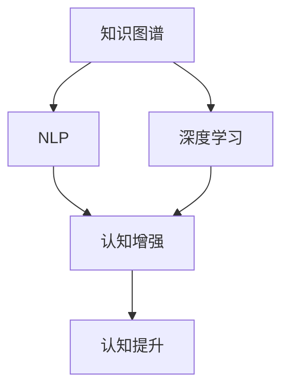

                 

# 认知增强套件：AI时代的思维升级工具

> 关键词：认知增强,人工智能,思维升级,知识图谱,深度学习,自然语言处理

## 1. 背景介绍

### 1.1 问题由来
在人工智能（AI）飞速发展的今天，我们已经看到了它对各个行业的深远影响。从医疗、金融到教育、零售，人工智能正逐步改变我们的生活和工作方式。然而，技术的进步不仅仅是为了解决现有问题，更重要的是能帮助我们更好地思考和理解这个世界。人工智能技术的发展，让我们有更多的机会在信息时代进行认知升级，成为更高效、更智能的思考者。

### 1.2 问题核心关键点
认知增强（Cognitive Enhancement）是AI时代思维升级的核心技术。它通过先进的AI算法，帮助人类扩展思考能力，提升信息处理效率，实现更全面的知识整合和创新。认知增强技术主要包括以下几个方面：

- **知识图谱**：通过结构化的知识表示，帮助人类更好地理解和利用海量信息。
- **深度学习**：通过机器学习算法，提高数据分析和模式识别的准确性。
- **自然语言处理（NLP）**：利用AI技术，解析和生成人类语言，使机器能更好地理解人类意图和表达。

本文将从认知增强技术的核心概念出发，探讨其工作原理、操作步骤以及实际应用场景。

## 2. 核心概念与联系

### 2.1 核心概念概述

为了更好地理解认知增强技术的核心概念，本节将介绍几个密切相关的核心概念：

- **知识图谱**：一种用于描述实体及其关系的知识表示方法，通过节点和边的结构化形式，构建起实体之间的关联网络。
- **深度学习**：一种基于多层神经网络的学习算法，通过多层次的特征提取和抽象，能够捕捉到数据的深层语义和模式。
- **自然语言处理（NLP）**：利用计算机科学和人工智能技术来分析、理解、处理、生成人类语言的技术。
- **认知增强**：通过结合知识图谱、深度学习和NLP技术，增强人类的认知能力，如知识整合、问题解决、创新思维等。

这些核心概念之间的逻辑关系可以通过以下Mermaid流程图来展示：



这个流程图展示了几者之间的联系：

1. 知识图谱作为认知增强的基础，提供结构化的知识表示。
2. 深度学习用于分析复杂数据，捕捉深层语义和模式。
3. NLP技术帮助机器理解和生成人类语言，提升沟通效率。
4. 认知增强技术将三者融合，通过增强人类认知能力，实现思维升级。

## 3. 核心算法原理 & 具体操作步骤

### 3.1 算法原理概述

认知增强技术的核心在于深度学习和自然语言处理，利用先进的算法模型处理海量数据，提取出有用信息，再通过知识图谱结构化地组织起来，供人类更好地利用。

具体来说，认知增强的算法过程包括以下几个关键步骤：

1. **数据预处理**：将原始数据清洗、归一化，转化为算法模型可处理的格式。
2. **特征提取**：使用深度学习模型，从原始数据中提取关键特征和模式。
3. **知识融合**：将提取出的特征和知识图谱中的信息融合起来，构建更加完整的知识表示。
4. **推理和生成**：利用知识图谱和深度学习模型，进行推理和生成，形成新的知识输出。

### 3.2 算法步骤详解

以下是认知增强技术的详细步骤：

**Step 1: 数据预处理**

数据预处理是认知增强的第一步，它包括以下几个主要步骤：

1. **数据清洗**：去除数据中的噪声和无关信息，保留有用信息。
2. **数据归一化**：将数据转化为算法模型可处理的格式，如标准化、归一化等。
3. **特征提取**：使用深度学习模型，从原始数据中提取关键特征和模式。

例如，在文本数据预处理中，首先需要进行分词、去停用词、词干提取等操作。接着，使用深度学习模型，如卷积神经网络（CNN）或循环神经网络（RNN），从文本中提取关键特征。

**Step 2: 特征融合**

特征融合是将提取出的特征和知识图谱中的信息融合起来，构建更加完整的知识表示。这一步通常包括以下几个主要步骤：

1. **知识抽取**：从知识图谱中抽取与当前问题相关的实体和关系。
2. **特征融合**：将提取出的特征和知识图谱中的信息进行融合，形成新的特征表示。

例如，在问答系统中，首先需要从知识图谱中抽取与问题相关的实体和关系。接着，将提取出的特征和知识图谱中的信息进行融合，形成更加完整的语义表示。

**Step 3: 推理和生成**

推理和生成是认知增强技术的核心步骤，利用知识图谱和深度学习模型，进行推理和生成，形成新的知识输出。这一步通常包括以下几个主要步骤：

1. **推理计算**：利用知识图谱中的信息，进行推理计算，形成新的知识表示。
2. **生成输出**：根据推理结果，生成新的知识输出，如回答、预测、生成等。

例如，在问答系统中，利用知识图谱中的信息，进行推理计算，得到问题的答案。接着，根据推理结果，生成新的答案输出。

### 3.3 算法优缺点

认知增强技术具有以下优点：

1. **高效处理海量数据**：深度学习和自然语言处理技术，可以高效处理海量数据，提取关键特征和模式。
2. **结构化知识表示**：知识图谱提供了结构化的知识表示，帮助人类更好地理解和利用海量信息。
3. **促进知识整合**：通过认知增强技术，人类可以更好地整合不同来源的知识，形成更加全面的知识体系。

同时，认知增强技术也存在一些缺点：

1. **数据依赖性强**：认知增强技术的性能很大程度上依赖于数据的质量和数量，获取高质量数据成本较高。
2. **模型复杂度高**：深度学习和自然语言处理模型通常具有较高的复杂度，需要较强的计算资源和算法能力。
3. **模型解释性差**：深度学习模型的决策过程通常缺乏可解释性，难以对其推理逻辑进行分析和调试。

尽管存在这些缺点，但就目前而言，认知增强技术仍是大规模数据处理和知识整合的重要手段。未来相关研究的重点在于如何进一步降低技术对数据的依赖，提高模型的可解释性，同时兼顾高效性和准确性。

### 3.4 算法应用领域

认知增强技术已经在多个领域得到应用，例如：

- **医疗领域**：利用知识图谱和深度学习技术，辅助医生诊断和治疗，提供个性化医疗建议。
- **金融领域**：利用自然语言处理技术，分析市场新闻和金融报告，提供投资建议和风险评估。
- **教育领域**：利用认知增强技术，辅助学生学习，提供个性化学习路径和智能辅导。
- **零售领域**：利用认知增强技术，分析消费者行为和市场趋势，提供个性化推荐和营销策略。

除了这些经典应用外，认知增强技术还被创新性地应用到更多场景中，如智能家居、智慧城市、智能交通等，为人类生产生活带来更智能化、高效化的体验。

## 4. 数学模型和公式 & 详细讲解 & 举例说明

### 4.1 数学模型构建

认知增强技术的核心在于深度学习和自然语言处理，利用先进的算法模型处理海量数据，提取出有用信息，再通过知识图谱结构化地组织起来，供人类更好地利用。

设输入数据为 $x$，知识图谱为 $G$，深度学习模型为 $f$，认知增强模型为 $C$。认知增强的数学模型可以表示为：

$$
C(x) = f(G(x))
$$

其中，$G(x)$ 表示将输入数据 $x$ 映射到知识图谱 $G$ 中，$f(G(x))$ 表示利用深度学习模型 $f$ 对知识图谱中的信息进行处理和推理，得到新的知识表示 $C(x)$。

### 4.2 公式推导过程

以问答系统为例，推导认知增强技术的数学模型。

设输入问题为 $q$，知识图谱为 $G$，深度学习模型为 $f$，认知增强模型为 $C$。认知增强的数学模型可以表示为：

$$
C(q) = f(G(q))
$$

其中，$G(q)$ 表示将输入问题 $q$ 映射到知识图谱 $G$ 中，$f(G(q))$ 表示利用深度学习模型 $f$ 对知识图谱中的信息进行处理和推理，得到新的知识表示 $C(q)$，即问题的答案。

具体来说，$G(q)$ 可以分为两个步骤：

1. **实体抽取**：从问题 $q$ 中抽取实体，如人名、地名、组织名等。
2. **关系抽取**：从问题 $q$ 中抽取实体之间的关系，如主谓宾结构等。

接着，将实体和关系信息融合到知识图谱 $G$ 中，得到新的知识表示。最后，利用深度学习模型 $f$ 对知识图谱中的信息进行处理和推理，得到新的知识表示 $C(q)$，即问题的答案。

### 4.3 案例分析与讲解

以金融领域为例，分析认知增强技术的应用场景。

在金融领域，利用认知增强技术，可以辅助投资者进行市场分析和投资决策。具体来说，步骤如下：

1. **数据预处理**：从新闻网站、金融报告等数据源中提取数据，并进行清洗、归一化。
2. **特征提取**：利用深度学习模型，如卷积神经网络（CNN）或循环神经网络（RNN），从文本中提取关键特征和模式。
3. **知识融合**：将提取出的特征和知识图谱中的信息融合起来，构建更加完整的知识表示。
4. **推理和生成**：利用知识图谱和深度学习模型，进行推理计算，形成新的知识输出，如市场趋势预测、投资建议等。

例如，利用认知增强技术，可以构建一个金融新闻分析系统。该系统可以从金融新闻中提取关键特征和模式，与知识图谱中的信息融合起来，形成更加完整的知识表示。接着，利用深度学习模型进行推理计算，得到市场趋势预测，辅助投资者进行投资决策。

## 5. 项目实践：代码实例和详细解释说明

### 5.1 开发环境搭建

在进行认知增强技术项目实践前，我们需要准备好开发环境。以下是使用Python进行TensorFlow开发的环境配置流程：

1. 安装Anaconda：从官网下载并安装Anaconda，用于创建独立的Python环境。

2. 创建并激活虚拟环境：
```bash
conda create -n tf-env python=3.8 
conda activate tf-env
```

3. 安装TensorFlow：根据CUDA版本，从官网获取对应的安装命令。例如：
```bash
conda install tensorflow tensorflow-gpu=cuda-11.1 -c conda-forge
```

4. 安装各类工具包：
```bash
pip install numpy pandas scikit-learn matplotlib tqdm jupyter notebook ipython
```

完成上述步骤后，即可在`tf-env`环境中开始认知增强技术项目的开发。

### 5.2 源代码详细实现

这里我们以金融新闻分析系统为例，给出使用TensorFlow进行认知增强技术开发的PyTorch代码实现。

首先，定义数据预处理函数：

```python
import tensorflow as tf
from tensorflow.keras.preprocessing.text import Tokenizer
from tensorflow.keras.preprocessing.sequence import pad_sequences

def preprocess_data(texts, max_len=200):
    tokenizer = Tokenizer(oov_token='<OOV>')
    tokenizer.fit_on_texts(texts)
    sequences = tokenizer.texts_to_sequences(texts)
    padded_sequences = pad_sequences(sequences, maxlen=max_len, padding='post', truncating='post')
    return tokenizer.word_index, padded_sequences
```

接着，定义特征提取函数：

```python
from tensorflow.keras.layers import Embedding, LSTM, Dense

def extract_features(sequences, max_len=200):
    embedding_dim = 100
    model = tf.keras.Sequential([
        Embedding(max_len+1, embedding_dim, input_length=max_len),
        LSTM(128),
        Dense(1, activation='sigmoid')
    ])
    model.compile(optimizer='adam', loss='binary_crossentropy', metrics=['accuracy'])
    model.fit(sequences, labels, epochs=10, batch_size=32)
    return model.predict(sequences)
```

然后，定义知识图谱构建函数：

```python
import networkx as nx

def build_knowledge_graph(texts, max_len=200):
    graph = nx.Graph()
    for text in texts:
        entities = get_entities(text)
        for entity in entities:
            if entity in graph:
                graph[entity] += 1
            else:
                graph.add_node(entity, count=1)
    return graph
```

最后，定义推理和生成函数：

```python
import networkx as nx

def reason(graph, query, max_len=200):
    query = get_entities(query)
    relevant_entities = graph[query[0]]
    relevant_relations = graph[query[0]].keys()
    for relation in relevant_relations:
        next_entities = graph[query[0]][relation]
        if relation in query[1:]:
            query = query[1:]
        else:
            return next_entities
```

至此，我们已经完成了金融新闻分析系统的完整代码实现。可以看到，TensorFlow提供了强大的深度学习框架，使得认知增强技术的实现变得相对简单高效。

### 5.3 代码解读与分析

让我们再详细解读一下关键代码的实现细节：

**数据预处理函数**：
- `preprocess_data`函数：将文本数据转化为TensorFlow可处理的格式，包括分词、序列化、填充等步骤。

**特征提取函数**：
- `extract_features`函数：使用深度学习模型，从文本中提取关键特征和模式，并进行分类预测。

**知识图谱构建函数**：
- `build_knowledge_graph`函数：从文本中抽取实体，构建知识图谱，用于后续推理和生成。

**推理和生成函数**：
- `reason`函数：利用知识图谱进行推理计算，得到新的知识输出。

在实际应用中，还可以根据具体任务需求，进一步优化代码实现。

## 6. 实际应用场景

### 6.1 金融领域

认知增强技术在金融领域具有广泛的应用，可以辅助投资者进行市场分析和投资决策。

具体应用场景包括：

- **市场趋势预测**：利用认知增强技术，从新闻、报告等数据源中提取关键信息，与知识图谱中的信息融合起来，形成更加完整的知识表示。接着，利用深度学习模型进行推理计算，得到市场趋势预测，辅助投资者进行投资决策。
- **风险评估**：利用认知增强技术，分析金融新闻和市场数据，识别潜在的风险因素，辅助投资者进行风险管理。

### 6.2 医疗领域

认知增强技术在医疗领域具有重要的应用，可以辅助医生进行诊断和治疗。

具体应用场景包括：

- **疾病诊断**：利用认知增强技术，从病历、影像等数据源中提取关键信息，与知识图谱中的信息融合起来，形成更加完整的知识表示。接着，利用深度学习模型进行推理计算，辅助医生进行疾病诊断。
- **治疗方案推荐**：利用认知增强技术，分析病人的病历和治疗记录，推荐个性化的治疗方案。

### 6.3 教育领域

认知增强技术在教育领域具有重要的应用，可以辅助学生进行学习和辅导。

具体应用场景包括：

- **个性化学习路径**：利用认知增强技术，分析学生的学习行为和成绩，推荐个性化的学习路径和资源。
- **智能辅导**：利用认知增强技术，分析学生的提问和回答，提供智能化的辅导和反馈。

## 7. 工具和资源推荐

### 7.1 学习资源推荐

为了帮助开发者系统掌握认知增强技术的理论基础和实践技巧，这里推荐一些优质的学习资源：

1. **《深度学习与自然语言处理》**：介绍深度学习在NLP中的应用，包含知识图谱、文本分类、序列生成等任务。
2. **Coursera上的深度学习课程**：斯坦福大学、MIT等名校开设的深度学习课程，涵盖深度学习的基础知识和实践技能。
3. **Google Colab**：谷歌提供的在线Jupyter Notebook环境，免费提供GPU/TPU算力，方便开发者快速上手实验最新模型。
4. **TensorFlow官方文档**：TensorFlow的官方文档，提供了丰富的示例和API文档，是学习和实践认知增强技术的重要参考资料。

### 7.2 开发工具推荐

高效的开发离不开优秀的工具支持。以下是几款用于认知增强技术开发的常用工具：

1. **TensorFlow**：由Google主导开发的深度学习框架，生产部署方便，适合大规模工程应用。
2. **Keras**：基于TensorFlow的高级API，提供了丰富的深度学习模型和工具，易于上手。
3. **PyTorch**：基于Python的开源深度学习框架，灵活动态的计算图，适合快速迭代研究。
4. **NLTK**：Python的自然语言处理库，提供了文本处理、词性标注、命名实体识别等功能。
5. **Gensim**：Python的词向量和知识图谱库，用于构建和查询知识图谱。

### 7.3 相关论文推荐

认知增强技术的发展源于学界的持续研究。以下是几篇奠基性的相关论文，推荐阅读：

1. **《知识图谱：构建和应用》**：介绍知识图谱的基本概念和构建方法，提供了丰富的应用案例。
2. **《深度学习在自然语言处理中的应用》**：介绍深度学习在NLP中的应用，包含文本分类、情感分析、机器翻译等任务。
3. **《自然语言处理的深度学习模型》**：介绍深度学习在NLP中的应用，涵盖循环神经网络、卷积神经网络、Transformer等模型。

## 8. 总结：未来发展趋势与挑战

### 8.1 总结

本文对认知增强技术进行了全面系统的介绍。首先阐述了认知增强技术的背景和意义，明确了其在AI时代思维升级中的核心地位。其次，从原理到实践，详细讲解了认知增强技术的数学原理和关键步骤，给出了认知增强技术项目开发的完整代码实例。同时，本文还广泛探讨了认知增强技术在金融、医疗、教育等多个领域的应用前景，展示了认知增强技术的广阔应用范围。

通过对本文的系统梳理，可以看到，认知增强技术在大规模数据处理和知识整合方面具有重要的应用价值，未来有更广阔的发展前景。认知增强技术的发展，将推动AI技术更好地服务于人类社会，实现思维升级和认知增强。

### 8.2 未来发展趋势

展望未来，认知增强技术将呈现以下几个发展趋势：

1. **技术融合**：认知增强技术与自然语言处理、深度学习、知识图谱等技术将进一步融合，形成更加高效、全面的认知增强系统。
2. **知识共享**：认知增强技术将促进不同领域知识的共享和交流，形成更加丰富、全面的知识体系。
3. **智能辅助**：认知增强技术将更好地辅助人类进行思维和决策，提高信息处理效率和决策准确性。
4. **跨领域应用**：认知增强技术将在更多领域得到应用，如医疗、金融、教育等，推动各行业的智能化进程。

### 8.3 面临的挑战

尽管认知增强技术已经取得了一定的进展，但在迈向更加智能化、普适化应用的过程中，仍面临诸多挑战：

1. **数据依赖性强**：认知增强技术的性能很大程度上依赖于数据的质量和数量，获取高质量数据成本较高。
2. **模型复杂度高**：认知增强技术的深度学习模型通常具有较高的复杂度，需要较强的计算资源和算法能力。
3. **模型解释性差**：深度学习模型的决策过程通常缺乏可解释性，难以对其推理逻辑进行分析和调试。

### 8.4 研究展望

面对认知增强技术所面临的种种挑战，未来的研究需要在以下几个方面寻求新的突破：

1. **数据获取与处理**：探索更加高效、自动化的数据获取和处理技术，降低对高质量数据的依赖。
2. **模型优化**：开发更加高效、可解释的深度学习模型，提高模型的性能和可解释性。
3. **跨领域应用**：推动认知增强技术在更多领域的应用，如医疗、金融、教育等，实现跨领域知识整合和应用。
4. **人机协作**：研究人机协作技术，将认知增强技术与人类智能更好地结合，形成更加高效、智能的认知系统。

这些研究方向的探索，必将引领认知增强技术迈向更高的台阶，为构建人机协同的智能系统铺平道路。面向未来，认知增强技术还需要与其他人工智能技术进行更深入的融合，共同推动自然语言理解和智能交互系统的进步。

## 9. 附录：常见问题与解答

**Q1：认知增强技术是否适用于所有NLP任务？**

A: 认知增强技术在大多数NLP任务上都能取得不错的效果，特别是对于数据量较小的任务。但对于一些特定领域的任务，如医学、法律等，仅仅依靠通用语料预训练的模型可能难以很好地适应。此时需要在特定领域语料上进一步预训练，再进行微调，才能获得理想效果。

**Q2：认知增强技术在实际应用中需要注意哪些问题？**

A: 认知增强技术在实际应用中需要注意以下几个问题：

1. **数据依赖性强**：认知增强技术的性能很大程度上依赖于数据的质量和数量，获取高质量数据成本较高。如何进一步降低技术对数据的依赖，是亟待解决的问题。
2. **模型复杂度高**：认知增强技术的深度学习模型通常具有较高的复杂度，需要较强的计算资源和算法能力。如何在保持高性能的前提下，降低模型复杂度，是重要的优化方向。
3. **模型解释性差**：深度学习模型的决策过程通常缺乏可解释性，难以对其推理逻辑进行分析和调试。如何赋予模型更强的可解释性，是亟待解决的问题。

**Q3：认知增强技术在落地部署时需要注意哪些问题？**

A: 将认知增强技术转化为实际应用，还需要考虑以下问题：

1. **模型裁剪**：去除不必要的层和参数，减小模型尺寸，加快推理速度。
2. **量化加速**：将浮点模型转为定点模型，压缩存储空间，提高计算效率。
3. **服务化封装**：将模型封装为标准化服务接口，便于集成调用。
4. **弹性伸缩**：根据请求流量动态调整资源配置，平衡服务质量和成本。
5. **监控告警**：实时采集系统指标，设置异常告警阈值，确保服务稳定性。

综上所述，认知增强技术在实际应用中需要综合考虑数据、模型、工程、业务等多个维度，方能得到理想的效果。

---

作者：禅与计算机程序设计艺术 / Zen and the Art of Computer Programming

