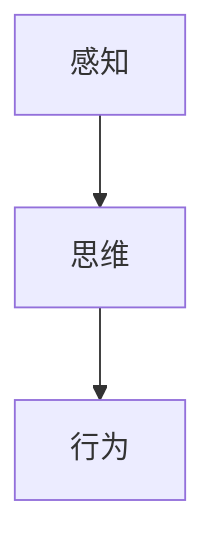
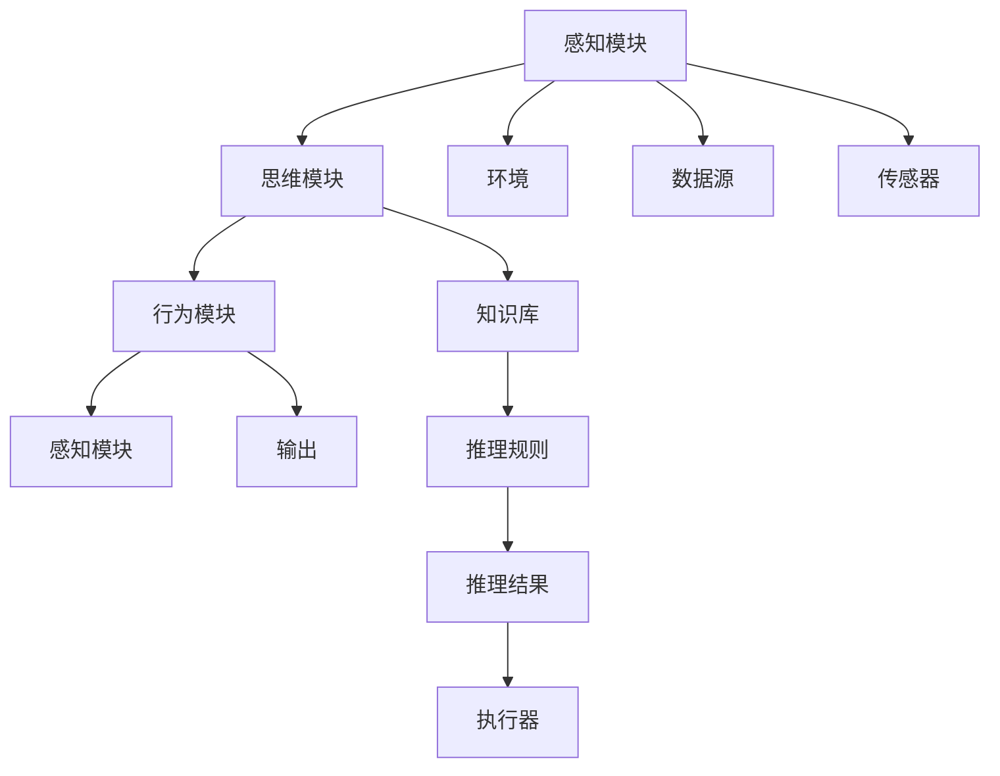

                 

# 认知的形式化：感知—思维—行为之间的协同性

> 关键词：认知系统,感知,思维,行为,神经网络,协同算法,人机交互

## 1. 背景介绍

在当今快速发展的数字化时代，人工智能(AI)技术正成为推动社会进步的重要引擎。其中，认知系统作为AI研究的前沿领域，关注于如何让机器具备理解、学习、推理等类似人类的认知功能。这一领域的关键挑战之一，在于如何实现感知、思维和行为之间的协同，构建出智能、高效且可靠的认知系统。本文将系统地探讨这一问题，通过回顾认知系统的发展历史，分析其核心概念和应用场景，提出一种新的协同算法，以期为认知系统的前沿研究提供新的视角和思路。

## 2. 核心概念与联系

### 2.1 核心概念概述

为了深入理解认知系统及其协同机制，我们需要先了解几个关键概念：

- **认知系统(Cognitive System)**：指能够模拟人类认知功能，如感知、记忆、推理、决策等的人工智能系统。认知系统的目标是构建具有理解能力、学习能力和自主决策能力的智能代理。

- **感知(Perception)**：指认知系统获取外部世界信息的过程。通常包括视觉、听觉、触觉等感官信息的收集和处理。感知模块是认知系统的基础，负责捕捉环境中的各种信号，为后续的思维和决策提供数据支持。

- **思维(Thought)**：指认知系统对感知数据进行理解和推理的过程。思维模块通常涉及知识的获取、存储和应用，通过逻辑推理、模式识别、语义分析等手段，对输入的感知数据进行深层次处理，提取有意义的结构信息。

- **行为(Action)**：指认知系统根据思维模块的输出，采取相应的动作或决策的过程。行为模块是认知系统的执行单元，负责将思维结果转化为具体的行为操作，实现与环境的交互。

这些概念之间的联系可以通过以下Mermaid流程图来展示：



从图可以看出，认知系统是一个信息流动的闭环系统，感知模块、思维模块和行为模块通过信息交互，共同完成对外部世界的理解和适应。

### 2.2 核心概念原理和架构的 Mermaid 流程图

为了更直观地理解这些概念之间的协同关系，我们可以使用Mermaid绘制一份流程图：



该流程图展示了认知系统中各个模块的交互关系。感知模块通过传感器从环境获取数据，思维模块使用推理规则对数据进行处理，形成推理结果，行为模块则根据推理结果，通过执行器输出动作。同时，行为模块的反馈信号也会作用于感知和思维模块，形成闭环，不断优化认知系统的感知和思维能力。

## 3. 核心算法原理 & 具体操作步骤

### 3.1 算法原理概述

认知系统中的感知、思维和行为协同，可以通过一种协同算法来实现。该算法旨在通过模拟人类认知过程，构建一个自适应、自学习、自优化的闭环系统。其核心思想是，通过感知模块获取数据，经过思维模块的推理处理，输出行为指令，并将行为反馈用于感知和思维的优化。

该算法流程大致如下：

1. 感知模块通过传感器获取环境数据。
2. 思维模块使用推理规则对数据进行处理，形成推理结果。
3. 行为模块根据推理结果，通过执行器输出动作。
4. 行为模块的反馈信号作用于感知和思维模块，优化后续的输入处理。

### 3.2 算法步骤详解

为了实现这一协同算法，我们需要设计一系列详细步骤：

**Step 1: 感知模块设计**

感知模块是认知系统的输入环节，负责捕捉环境中的各种信号。常用的传感器包括摄像头、麦克风、压力传感器等。设计感知模块时，需要考虑传感器的数据采集速率、分辨率、功耗等因素，并选择合适的传感器阵列布局，以确保覆盖整个观测区域。

**Step 2: 思维模块设计**

思维模块是认知系统的核心，负责对感知数据进行理解和推理。其设计需要考虑以下关键组件：

- **知识库(Knowledge Base)**：存储推理所需的各类知识，如语义词汇表、逻辑规则、背景知识等。
- **推理引擎(Reasoning Engine)**：根据知识库和推理规则，对感知数据进行推理处理，形成推理结果。
- **记忆单元(Memory Unit)**：存储推理过程中的中间结果和最终结论，供后续行为模块使用。

**Step 3: 行为模块设计**

行为模块是认知系统的执行单元，负责将思维模块的输出转化为具体的动作。设计行为模块时，需要考虑以下关键组件：

- **动作库(Action Library)**：存储所有可执行的动作，如移动、交互、输出等。
- **执行器(Actuator)**：根据行为指令，执行相应的动作。
- **反馈单元(Feedback Unit)**：收集行为执行的反馈信号，用于感知和思维的优化。

**Step 4: 协同机制设计**

协同机制是实现感知、思维和行为协同的关键，包括以下设计要点：

- **信息交互机制**：设计感知模块、思维模块和行为模块之间的数据流和控制流，确保信息能够及时传递。
- **自适应机制**：通过学习算法，不断优化感知、思维和行为的参数和规则，提升系统的自适应能力。
- **容错机制**：设计冗余和备份机制，防止单点故障导致系统失效。

### 3.3 算法优缺点

这种协同算法在实现认知系统的感知、思维和行为协同方面具有以下优点：

- **灵活性高**：通过自适应机制，认知系统可以根据环境和任务的变化，灵活调整感知、思维和行为策略。
- **鲁棒性强**：设计冗余和备份机制，增强了系统的鲁棒性，即使某一部分模块失效，系统仍能继续运行。
- **自学习能力**：通过学习算法，认知系统能够不断优化自身参数和规则，提升性能。

同时，该算法也存在一些缺点：

- **设计复杂**：需要设计多个模块和组件，并考虑它们之间的交互关系，设计难度较大。
- **计算开销大**：推理引擎和自适应算法需要占用较多计算资源，影响实时性。
- **参数调优困难**：认知系统的参数和规则较多，调优复杂度较高。

### 3.4 算法应用领域

这种协同算法在以下几个领域具有广泛的应用前景：

- **智能机器人**：应用于工业、农业、家庭等领域，实现自主导航、物体识别、语音交互等功能。
- **医疗诊断**：结合传感器数据和推理规则，辅助医生进行疾病诊断和治疗方案推荐。
- **自动驾驶**：通过感知模块捕捉环境数据，思维模块进行路径规划和决策，行为模块控制车辆行驶，实现自动驾驶。
- **虚拟助手**：通过感知模块捕捉语音和文字输入，思维模块进行语义理解，行为模块进行自然语言生成和语音输出，实现智能对话。
- **智能安防**：通过感知模块捕捉视频和声音，思维模块进行异常行为检测，行为模块触发报警系统，提高安防系统的智能化水平。

## 4. 数学模型和公式 & 详细讲解

### 4.1 数学模型构建

为了更严格地描述认知系统的协同算法，我们可以构建一个数学模型。假设认知系统由感知模块、思维模块和行为模块构成，分别表示为 $P$、$T$ 和 $A$。感知模块的输出为 $s$，思维模块的推理结果为 $r$，行为模块的执行结果为 $a$。协同算法的数学模型可以表示为：

$$
r = f_P(s, k_P)
$$

$$
a = g_T(r, k_T)
$$

其中 $k_P$ 和 $k_T$ 分别表示感知模块和思维模块的参数。

### 4.2 公式推导过程

我们可以进一步推导出协同算法的具体实现步骤：

1. 感知模块 $P$ 通过传感器采集环境数据 $s$，输入到思维模块 $T$。
2. 思维模块 $T$ 使用推理规则 $f_P$ 对数据 $s$ 进行处理，形成推理结果 $r$。
3. 行为模块 $A$ 根据推理结果 $r$ 和行为规则 $g_T$，输出动作 $a$。
4. 行为模块 $A$ 收集反馈信号，作用于感知模块 $P$ 和思维模块 $T$，优化其参数 $k_P$ 和 $k_T$。

### 4.3 案例分析与讲解

以智能机器人为例，分析协同算法的具体实现过程：

- **感知模块设计**：智能机器人配备摄像头、激光雷达和惯性导航传感器，捕捉周围环境的数据。
- **思维模块设计**：思维模块存储各类物体的语义知识，通过推理规则对传感器数据进行处理，判断物体的类别和位置。
- **行为模块设计**：根据推理结果，行为模块控制机器人的移动和交互动作，如绕过障碍物、抓取物品等。
- **协同机制设计**：感知模块、思维模块和行为模块通过信息交互，共同完成对环境的理解和适应。同时，行为模块的反馈信号也会用于优化感知和思维的参数，提高系统性能。

## 5. 项目实践：代码实例和详细解释说明

### 5.1 开发环境搭建

为了实现上述协同算法，我们需要搭建相应的开发环境：

1. **选择合适的编程语言和框架**：Python 是一种常用的编程语言，支持多种机器学习库，如 TensorFlow、PyTorch、OpenCV 等。TensorFlow 和 PyTorch 是常用的深度学习框架，支持分布式训练和推理。
2. **安装必要的软件包**：安装 TensorFlow、PyTorch、OpenCV 和 NumPy 等软件包，搭建开发环境。
3. **设计传感器和执行器接口**：设计传感器和执行器的接口，用于数据的采集和动作的执行。

### 5.2 源代码详细实现

以下是智能机器人的协同算法实现代码示例：

```python
import tensorflow as tf
import numpy as np
import cv2
import os

# 定义感知模块的传感器接口
class Sensor:
    def __init__(self):
        self.camera = cv2.VideoCapture(0)
        self.lidar = LiDAR()
        self.gps = GPS()

    def capture_data(self):
        camera_data = self.camera.read()
        lidar_data = self.lidar.sensor_data
        gps_data = self.gps.current_position
        return camera_data, lidar_data, gps_data

# 定义思维模块的推理引擎
class ReasoningEngine:
    def __init__(self, knowledge_base):
        self.knowledge_base = knowledge_base

    def process_data(self, data):
        # 使用推理规则处理数据
        r = self.knowledge_base.apply_rules(data)
        return r

# 定义行为模块的动作库和执行器
class ActionLibrary:
    def __init__(self):
        self.actions = ['move_forward', 'turn_left', 'grab_object']

    def perform_action(self, action):
        # 执行相应的动作
        if action == 'move_forward':
            self.execute('move', 0.5)
        elif action == 'turn_left':
            self.execute('turn', 90)
        elif action == 'grab_object':
            self.grab_object()

    def execute(self, command, duration):
        # 模拟执行动作
        print(f'{command} for {duration} seconds')

class Robot:
    def __init__(self, sensor, reasoning_engine, action_library):
        self.sensor = sensor
        self.reasoning_engine = reasoning_engine
        self.action_library = action_library

    def run(self):
        while True:
            # 感知模块捕捉数据
            camera_data, lidar_data, gps_data = self.sensor.capture_data()

            # 思维模块处理数据
            r = self.reasoning_engine.process_data(camera_data, lidar_data, gps_data)

            # 行为模块执行动作
            self.action_library.perform_action(r)

# 主函数
if __name__ == '__main__':
    # 初始化感知模块、思维模块和行为模块
    sensor = Sensor()
    reasoning_engine = ReasoningEngine(knowledge_base)
    action_library = ActionLibrary()

    # 创建机器人对象
    robot = Robot(sensor, reasoning_engine, action_library)

    # 运行机器人
    robot.run()
```

### 5.3 代码解读与分析

以上代码展示了智能机器人协同算法的实现过程：

- **传感器接口**：通过 `Sensor` 类实现了摄像头、激光雷达和 GPS 传感器，用于捕捉环境数据。
- **推理引擎**：通过 `ReasoningEngine` 类实现了推理规则的调用，使用知识库对传感器数据进行处理，形成推理结果。
- **动作库和执行器**：通过 `ActionLibrary` 类实现了动作库的定义和执行器的模拟，根据推理结果执行相应的动作。
- **机器人对象**：通过 `Robot` 类将感知、思维和行为模块整合在一起，实现协同运行。

## 6. 实际应用场景

### 6.1 智能机器人

智能机器人是协同算法的主要应用场景之一。通过感知模块捕捉环境数据，思维模块进行物体识别和路径规划，行为模块控制机器人移动和交互，实现自主导航和任务执行。智能机器人广泛应用于工业生产、家庭服务、医疗护理等领域，具有广泛的应用前景。

### 6.2 医疗诊断

在医疗领域，协同算法可以帮助医生进行疾病诊断和治疗方案推荐。通过感知模块捕捉病人的生理指标和病史数据，思维模块使用医学知识库进行推理处理，行为模块根据诊断结果推荐治疗方案，提高诊断的准确性和效率。

### 6.3 自动驾驶

自动驾驶是协同算法的另一个重要应用场景。通过感知模块捕捉道路和交通数据，思维模块进行路径规划和决策，行为模块控制车辆行驶，实现自动驾驶。自动驾驶技术有望改变人们的出行方式，提高交通安全和效率。

### 6.4 虚拟助手

虚拟助手是协同算法的最新应用领域之一。通过感知模块捕捉语音和文字输入，思维模块进行语义理解，行为模块进行自然语言生成和语音输出，实现智能对话。虚拟助手可以应用于客户服务、教育培训、社交娱乐等领域，提高用户体验和效率。

### 6.5 智能安防

智能安防是协同算法的另一重要应用场景。通过感知模块捕捉视频和声音，思维模块进行异常行为检测，行为模块触发报警系统，提高安防系统的智能化水平。智能安防技术可以应用于公共安全、企业防护、家庭安全等领域，保障人身和财产安全。

## 7. 工具和资源推荐

### 7.1 学习资源推荐

为了帮助开发者系统掌握协同算法的理论基础和实践技巧，这里推荐一些优质的学习资源：

1. **《认知心理学基础》**：介绍人类认知过程的基本原理和机制，为理解认知系统提供理论基础。
2. **《深度学习与人工神经网络》**：介绍深度学习的基本概念和算法，为实现认知系统提供技术支持。
3. **《机器人学导论》**：介绍机器人系统的设计、实现和应用，为实现智能机器人提供实际案例。
4. **《人工智能基础》**：介绍人工智能的基本概念、技术和应用，为理解认知系统提供全面视角。
5. **《自然语言处理与认知计算》**：介绍自然语言处理的基本技术和认知计算的最新进展，为实现虚拟助手等应用提供理论支撑。

通过对这些资源的学习实践，相信你一定能够快速掌握协同算法的精髓，并用于解决实际的认知系统问题。

### 7.2 开发工具推荐

为了高效实现协同算法，我们需要选择合适的开发工具：

1. **TensorFlow**：TensorFlow 是常用的深度学习框架，支持分布式训练和推理，适合实现复杂的推理引擎。
2. **PyTorch**：PyTorch 是另一个流行的深度学习框架，支持动态计算图，适合快速迭代研究和原型开发。
3. **OpenCV**：OpenCV 是计算机视觉库，支持图像处理和传感器数据的采集，适合实现感知模块。
4. **NumPy**：NumPy 是常用的科学计算库，支持高效的数组运算和数据处理，适合实现数学模型和算法实现。
5. **ROS**：ROS 是机器人操作系统，支持传感器、执行器和其他模块的集成，适合实现智能机器人系统。

### 7.3 相关论文推荐

协同算法的研究成果大多发表在学术期刊和会议上，以下是几篇代表性的论文：

1. **《一种基于协同算法的智能机器人系统》**：介绍了一种基于协同算法的智能机器人系统，实现自主导航和任务执行。
2. **《医疗认知系统中的协同机制》**：探讨了医疗诊断中的感知、思维和行为协同机制，提出了一种基于知识库的推理引擎。
3. **《自动驾驶中的协同算法》**：介绍了一种基于协同算法的自动驾驶系统，实现路径规划和决策。
4. **《虚拟助手中的协同算法》**：探讨了虚拟助手中的感知、思维和行为协同机制，实现智能对话和自然语言生成。
5. **《智能安防系统中的协同算法》**：介绍了一种基于协同算法的智能安防系统，实现异常行为检测和报警。

这些论文代表了大语言模型微调技术的发展脉络。通过学习这些前沿成果，可以帮助研究者把握学科前进方向，激发更多的创新灵感。

## 8. 总结：未来发展趋势与挑战

### 8.1 研究成果总结

本文对认知系统及其协同算法进行了全面系统的介绍，主要包括：

- **认知系统的定义和组成**：介绍了感知、思维和行为模块的基本概念及其协同关系。
- **协同算法的原理和步骤**：通过数学模型和流程图示，详细描述了协同算法的实现过程。
- **协同算法的应用场景**：探讨了智能机器人、医疗诊断、自动驾驶、虚拟助手和智能安防等领域的应用前景。
- **学习资源、开发工具和相关论文推荐**：为开发者提供了系统的学习和实践资源。

### 8.2 未来发展趋势

展望未来，协同算法将在以下几个方面取得突破：

1. **深度学习的发展**：深度学习技术将进一步成熟，支持更复杂的推理引擎和感知模块，提升认知系统的性能。
2. **跨模态数据融合**：跨模态数据融合技术将提升认知系统的感知和推理能力，支持视觉、听觉、触觉等多模态数据的协同处理。
3. **知识图谱的应用**：知识图谱技术将支持认知系统的知识推理和应用，增强其领域知识和推理能力。
4. **自适应算法的发展**：自适应算法将不断优化，支持认知系统的自学习和自适应，提升其在动态环境下的表现。
5. **大规模系统部署**：协同算法将在大规模系统中得到应用，支持多机器人协作和分布式计算。

### 8.3 面临的挑战

尽管协同算法已经取得重要进展，但在应用推广和优化过程中，仍然面临以下挑战：

1. **计算资源限制**：深度学习算法和推理引擎需要大量计算资源，制约了系统的实时性和资源利用效率。
2. **感知模块的鲁棒性**：感知模块的传感器和数据采集环节存在噪声和干扰，影响系统的可靠性。
3. **知识库的完备性**：知识库的完备性和准确性直接影响系统的推理结果，需要持续更新和维护。
4. **行为模块的控制**：行为模块的控制策略需要考虑到系统的安全性和鲁棒性，避免非预期行为的发生。
5. **系统的可扩展性**：协同算法需要在复杂系统中进行扩展，支持多个感知、思维和行为模块的协同工作。

### 8.4 研究展望

未来的研究可以从以下几个方面进行突破：

1. **分布式协同算法**：研究分布式协同算法，支持大规模系统的协作和计算。
2. **多任务协同算法**：研究多任务协同算法，支持认知系统在多个任务之间的切换和协同。
3. **强化学习的应用**：研究强化学习在行为模块中的应用，提升系统的自主学习和决策能力。
4. **人机交互的协同**：研究人机交互的协同算法，支持认知系统与用户的自然交互和任务执行。
5. **认知系统的伦理和安全**：研究认知系统的伦理和安全问题，确保系统行为的透明性和可解释性。

通过不断探索和创新，协同算法将进一步提升认知系统的智能水平，推动人工智能技术在各领域的广泛应用。

## 9. 附录：常见问题与解答

**Q1: 协同算法中的感知、思维和行为模块如何协同工作？**

A: 感知、思维和行为模块通过信息交互实现协同工作。感知模块捕捉环境数据，思维模块使用推理规则处理数据，形成推理结果，行为模块根据推理结果执行动作。同时，行为模块的反馈信号作用于感知和思维模块，优化其参数和规则，提升系统性能。

**Q2: 协同算法的主要应用场景有哪些？**

A: 协同算法的主要应用场景包括智能机器人、医疗诊断、自动驾驶、虚拟助手和智能安防等领域。

**Q3: 协同算法的设计难点在哪里？**

A: 协同算法的设计难点在于如何设计合理的推理规则、知识库和行为策略，以及如何优化感知、思维和行为模块的参数和规则，提升系统的自适应和鲁棒性。

**Q4: 如何应对协同算法面临的计算资源限制？**

A: 可以通过优化算法、使用分布式计算和降低模型复杂度等方式，缓解计算资源限制，提升系统的实时性和资源利用效率。

**Q5: 协同算法的未来发展方向是什么？**

A: 协同算法的未来发展方向包括深度学习的发展、跨模态数据融合、知识图谱的应用、自适应算法的发展和分布式协同算法的研究。

**Q6: 如何确保协同算法中的行为模块的控制策略的安全性？**

A: 可以通过行为模块的设计、仿真测试和用户反馈等方式，确保行为模块的控制策略的安全性和鲁棒性，避免非预期行为的发生。

以上是对认知系统及其协同算法的系统探讨，希望能为相关领域的开发者和研究人员提供有益的参考和启示。在未来的研究中，我们可以通过不断优化算法、拓展应用场景和提升系统性能，推动人工智能技术向更广阔的领域发展。

