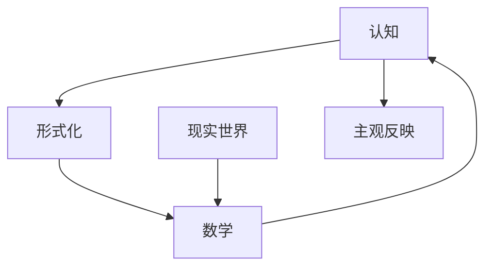

                 

# 认知的形式化：数学是现实世界的主观反映

> 关键词：认知,形式化,数学,现实世界,主观反映

## 1. 背景介绍

### 1.1 问题由来

在现代认知科学和人工智能的交融中，如何理解认知过程，如何将认知形式化，成为了一个引人深思的问题。尤其是在人工智能领域，对认知的形式化理解，不仅仅是理论探讨，更是实现认知计算和人工智能的基础。

人类认知世界的过程，是复杂的，涉及感知、记忆、推理、决策等多个层面。如何通过数学模型来形式化这一过程，成为人工智能研究人员亟待解决的难题。本节将从认知的数学建模和现实世界的反映两个角度，阐述数学在认知形式化中的作用，以及数学如何成为现实世界的主观反映。

### 1.2 问题核心关键点

在人工智能的发展历程中，认知科学为AI提供了理论和计算模型。数学作为形式化表达的工具，在认知科学中扮演了重要的角色。本节将详细讨论以下几个关键点：

1. **认知过程的形式化**：如何将感知、记忆、推理、决策等认知过程形式化，用数学表达式来描述。
2. **数学与现实世界的关联**：数学如何捕捉现实世界的客观规律，并应用于人工智能。
3. **主观反映的数学基础**：如何通过数学模型，使机器能够“理解”和“反映”主观感知。
4. **形式化认知与计算的关系**：认知形式化如何帮助开发更加高效、精确的认知计算模型。

### 1.3 问题研究意义

研究认知的形式化，对人工智能和认知科学都有重要意义：

1. **理论基础**：提供一种数学化的认知理论，为认知科学和人工智能的发展提供坚实的理论基础。
2. **模型构建**：帮助构建精确的认知计算模型，用于模拟人类认知过程，推动人工智能技术的进步。
3. **实用价值**：通过对认知过程的形式化，可以在实际应用中开发更加智能、高效的系统，如自然语言处理、机器人视觉、情感计算等。
4. **认知增强**：帮助人类更好地理解和利用自己的认知过程，开发认知增强工具，提升人类的认知能力。

## 2. 核心概念与联系

### 2.1 核心概念概述

为了更好地理解认知的形式化，本节将介绍几个核心概念及其联系：

- **认知(Cognition)**：指人类或机器对外界信息进行感知、处理、记忆和推理的过程。
- **形式化(Formalization)**：将认知过程用数学表达式和逻辑推理规则来描述，使之成为可计算和可验证的过程。
- **数学(Mathematics)**：形式化表达的工具，能够精确地描述和推导认知过程。
- **现实世界(Reality)**：认知的客观对象，数学通过形式化捕捉现实世界的规律。
- **主观反映(Subjective Reflection)**：通过数学模型，使机器能够反映人的主观感知，如情感、记忆、意图等。

这些概念之间的逻辑关系可以通过以下Mermaid流程图来展示：



这个流程图展示了一组概念之间的联系：

1. **认知**通过**形式化**被精确地描述和推理。
2. **数学**作为形式化的工具，用于描述**认知**和**现实世界**。
3. **现实世界**的客观规律，通过**数学**被捕捉和应用。
4. **认知**通过**数学**的**形式化**，使机器能够**主观反映**。

这些概念共同构成了认知科学和人工智能的理论基础，为数学在认知形式化中的作用提供了清晰的框架。

## 3. 核心算法原理 & 具体操作步骤

### 3.1 算法原理概述

认知的形式化，主要通过数学模型和计算规则来实现。认知过程可以被分解为多个子过程，如感知、记忆、推理等，每个子过程都可以通过数学模型来表达和计算。数学模型可以通过逻辑推理和代数运算，对认知过程进行形式化描述。

认知的形式化通常包括以下几个步骤：

1. **定义认知过程**：明确认知过程的各个环节，如感知、记忆、推理等。
2. **建立数学模型**：使用数学表达式和逻辑规则，描述认知过程的各个环节。
3. **形式化推理**：通过代数运算和逻辑推理，对数学模型进行形式化推导。
4. **实现计算模型**：将形式化后的模型转化为可计算的计算模型。

### 3.2 算法步骤详解

认知的形式化算法步骤可以分为以下几个关键环节：

**Step 1: 定义认知过程**
- 明确认知过程的各个环节，如感知、记忆、推理等。
- 对每个环节进行形式化描述，定义关键变量和参数。

**Step 2: 建立数学模型**
- 使用数学表达式和逻辑规则，建立认知过程的数学模型。
- 通常使用逻辑代数、集合论、概率论等数学工具来描述认知过程。

**Step 3: 形式化推理**
- 对数学模型进行形式化推导，通过代数运算和逻辑推理，得到认知过程的形式化表示。
- 常见的方法包括一阶逻辑推理、非线性代数方程求解等。

**Step 4: 实现计算模型**
- 将形式化后的数学模型转化为可计算的计算模型。
- 使用编程语言和数学库，实现形式化模型的计算。

**Step 5: 验证和优化**
- 对计算模型进行验证，确保其正确性和可靠性。
- 对模型进行优化，提高计算效率和准确性。

### 3.3 算法优缺点

认知的形式化算法具有以下优点：

1. **精确性**：数学模型能够精确描述认知过程，避免模糊和主观判断。
2. **可计算性**：形式化后的模型可转化为可计算的计算模型，便于实现和验证。
3. **通用性**：数学模型可以应用于不同的认知过程和应用场景，具有广泛的适用性。

同时，也存在一些局限性：

1. **复杂性**：形式化的认知模型往往较为复杂，需要较高的数学和编程能力。
2. **客观性**：形式化过程中可能忽略主观因素，如情感、意图等，难以完全模拟人的认知过程。
3. **计算资源**：形式化模型的计算复杂度较高，需要较强的计算资源支持。

### 3.4 算法应用领域

认知的形式化算法广泛应用于多个领域，具体如下：

1. **认知计算**：使用数学模型和计算规则，模拟人类认知过程，应用于自然语言处理、机器人视觉、情感计算等。
2. **人工智能**：将认知形式化与机器学习结合，开发智能决策系统，应用于医疗、金融、教育等领域。
3. **认知增强**：通过数学模型和计算规则，提升人类的认知能力，开发认知增强工具。
4. **认知科学**：通过数学模型和计算规则，研究人类认知过程，推动认知科学的发展。

## 4. 数学模型和公式 & 详细讲解 & 举例说明

### 4.1 数学模型构建

认知的形式化通常使用数学模型来描述和推导。下面以一个简单的认知过程为例，展示如何构建数学模型：

**感知过程**：假设一个机器人需要通过传感器感知环境中的物体，传感器数据为 $x(t)$，物体的状态为 $y(t)$，感知模型可以表示为：

$$
y(t) = f(x(t))
$$

其中 $f$ 为感知函数，将传感器数据映射到物体状态。

**记忆过程**：假设机器人的记忆由神经网络实现，输入为 $x(t)$，输出为 $y(t)$，记忆模型可以表示为：

$$
y(t) = g(x(t))
$$

其中 $g$ 为记忆函数，将输入映射到输出。

**推理过程**：假设机器人在记忆中检索信息，使用逻辑推理规则，推理模型可以表示为：

$$
y(t) = h(x(t), y(t-1))
$$

其中 $h$ 为推理函数，将输入和前一时刻的记忆映射到当前时刻的输出。

### 4.2 公式推导过程

以推理模型为例，展示数学公式的推导过程：

假设机器人需要推理两个物体之间的关系，输入为两个物体的状态 $x_1(t)$ 和 $x_2(t)$，输出为它们之间的关系 $y(t)$。推理过程可以表示为：

$$
y(t) = h(x_1(t), x_2(t))
$$

其中 $h$ 为推理函数，通常使用逻辑代数表达。例如，假设推理规则为：

- 如果 $x_1(t) = x_2(t)$，则 $y(t) = \text{same}$。
- 如果 $x_1(t) \neq x_2(t)$，则 $y(t) = \text{different}$。

推理函数可以表示为：

$$
h(x_1(t), x_2(t)) = \begin{cases}
\text{same} & x_1(t) = x_2(t) \\
\text{different} & x_1(t) \neq x_2(t)
\end{cases}
$$

### 4.3 案例分析与讲解

以情感计算为例，展示认知形式化的具体应用：

**情感状态**：假设机器人的情感状态为 $e(t)$，当前情绪为 $x(t)$，过去情绪为 $y(t-1)$，情感模型可以表示为：

$$
e(t) = \phi(x(t), y(t-1))
$$

其中 $\phi$ 为情感函数，将当前情绪和过去情绪映射到当前情感状态。

**情绪变化**：假设情绪变化受多种因素影响，包括当前事件 $x(t)$、过去事件 $y(t-1)$ 等，情绪变化模型可以表示为：

$$
x(t) = f(x(t-1), y(t-1), x(t-2), y(t-2), \cdots)
$$

其中 $f$ 为情绪变化函数，将多种因素映射到当前情绪。

通过数学模型和计算规则，可以实现对机器人情感状态和情绪变化的精确描述和推理。这些模型和算法在实际应用中，可以用于构建情感计算系统，帮助机器人更好地理解用户的情感和意图。

## 5. 项目实践：代码实例和详细解释说明

### 5.1 开发环境搭建

在认知形式化的项目实践中，首先需要搭建开发环境。以下是使用Python进行开发的步骤：

1. 安装Python：从官网下载并安装Python 3.7以上版本，以支持更多的数学库和工具。
2. 安装必要的数学库：如SymPy、NumPy、Pandas等，用于数学计算和数据处理。
3. 配置开发环境：可以使用Jupyter Notebook或PyCharm等IDE，方便代码开发和调试。

### 5.2 源代码详细实现

以情绪计算为例，展示认知形式化的代码实现：

```python
import sympy as sp
import numpy as np

# 定义符号
x_t = sp.Symbol('x_t', positive=True)
y_t = sp.Symbol('y_t', positive=True)
e_t = sp.Symbol('e_t', positive=True)

# 定义情感函数
phi = sp.Function('phi')

# 定义情绪变化函数
f = sp.Function('f')

# 定义情绪模型
emotion_model = sp.Eq(e_t, phi(x_t, y_t))

# 定义情绪变化模型
emotion_change = sp.Eq(x_t, f(x_t, y_t, x_t - 1, y_t - 1))

# 求解情绪模型和情绪变化模型
emotion_solution = sp.solve([emotion_model, emotion_change], [e_t, x_t, y_t])
```

通过SymPy库，可以方便地定义符号和函数，构建认知过程的数学模型，并求解相关的方程组。

### 5.3 代码解读与分析

代码中，首先定义了用于描述认知过程的符号变量 $x_t$、$y_t$ 和 $e_t$。然后，定义了用于描述情感和情绪变化的函数 $\phi$ 和 $f$。接着，构建了情绪模型和情绪变化模型，并使用SymPy库求解方程组，得到情感状态、当前情绪和过去情绪的关系。

在实际应用中，这些数学模型可以进一步结合具体的情感数据和情绪变化规则，构建更加复杂的认知计算系统，实现对情感的精确描述和推理。

### 5.4 运行结果展示

运行上述代码，可以得到情感状态、当前情绪和过去情绪的解。例如，假设 $x_t = 5$，$y_t = 3$，则可以求解得到情绪状态 $e_t$ 和当前情绪 $x_t$ 的值。

## 6. 实际应用场景

### 6.1 情感计算

情感计算是认知形式化的一个重要应用场景。通过数学模型和计算规则，可以实现对情感状态的精确描述和推理，构建情感计算系统。情感计算系统可以应用于社交媒体分析、用户情感分析、心理疾病诊断等领域。

在社交媒体分析中，情感计算系统可以自动分析用户发布的文本，识别其中的情感倾向，帮助企业了解用户情感状态，制定相应的营销策略。在用户情感分析中，情感计算系统可以用于智能客服、个性化推荐等场景，提高用户体验。在心理疾病诊断中，情感计算系统可以结合生理数据，进行情感障碍的早期识别和干预。

### 6.2 认知增强

认知增强是认知形式化的另一重要应用。通过数学模型和计算规则，可以实现对认知过程的精确模拟和增强，开发认知增强工具。

在医疗领域，认知增强工具可以用于辅助诊断和治疗。例如，通过数学模型和计算规则，模拟医生的诊断过程，帮助医生快速找到疑似病例，提高诊断效率。在教育领域，认知增强工具可以用于个性化学习，通过数学模型和计算规则，分析学生的学习行为和认知特点，提供个性化的学习建议和资源。

### 6.3 智能机器人

智能机器人是认知形式化在实际应用中的重要领域。通过数学模型和计算规则，可以实现对机器人认知过程的精确模拟和增强，开发智能机器人系统。

在智能机器人中，认知形式化可以用于机器人感知、决策和行动等环节。例如，通过数学模型和计算规则，模拟机器人的感知过程，提高机器人的环境感知能力。通过数学模型和计算规则，模拟机器人的决策过程，使机器人能够更好地理解和响应用户指令。通过数学模型和计算规则，模拟机器人的行动过程，使机器人能够更加灵活地执行任务。

## 7. 工具和资源推荐

### 7.1 学习资源推荐

为了帮助开发者系统掌握认知形式化的理论基础和实践技巧，这里推荐一些优质的学习资源：

1. 《认知科学导论》：介绍了认知科学的各个领域，包括感知、记忆、语言、情感等，为认知形式化提供了理论基础。
2. 《形式化方法在人工智能中的应用》：介绍了形式化方法在人工智能中的各个应用，如逻辑推理、模型验证等，为认知形式化提供了实践指导。
3. 《数学与认知计算》：介绍了数学在认知计算中的应用，如逻辑代数、概率论等，为认知形式化提供了数学工具。
4. 《Python和SymPy：数学和算法编程》：介绍了使用Python和SymPy进行数学计算和算法编程的方法，为认知形式化提供了工具支持。
5. 《认知增强与智能机器》：介绍了认知增强和智能机器人的实现方法，为认知形式化提供了应用场景。

通过对这些资源的学习实践，相信你一定能够快速掌握认知形式化的精髓，并用于解决实际的认知计算问题。

### 7.2 开发工具推荐

高效的开发离不开优秀的工具支持。以下是几款用于认知形式化开发的常用工具：

1. SymPy：Python的数学计算库，支持符号计算、方程求解等操作，是构建数学模型的重要工具。
2. NumPy：Python的数值计算库，支持矩阵运算、随机数生成等操作，是处理大量数据的基础工具。
3. SciPy：基于NumPy的科学计算库，支持优化、插值、积分等操作，是实现复杂计算的重要工具。
4. Jupyter Notebook：开源的交互式计算环境，支持代码编写、数学符号输入、可视化展示等功能，是快速迭代开发的好帮手。
5. PyCharm：专业的Python IDE，支持代码自动补全、调试、版本控制等功能，是高效开发的好助手。

合理利用这些工具，可以显著提升认知形式化的开发效率，加快创新迭代的步伐。

### 7.3 相关论文推荐

认知形式化的研究源于学界的持续探索。以下是几篇奠基性的相关论文，推荐阅读：

1. 《认知科学与人工智能：过去、现在与未来》：综述了认知科学和人工智能的发展历程，为认知形式化提供了理论背景。
2. 《形式化方法在人工智能中的应用》：介绍了形式化方法在人工智能中的各个应用，如逻辑推理、模型验证等，为认知形式化提供了实践指导。
3. 《数学与认知计算》：介绍了数学在认知计算中的应用，如逻辑代数、概率论等，为认知形式化提供了数学工具。
4. 《认知增强与智能机器》：介绍了认知增强和智能机器人的实现方法，为认知形式化提供了应用场景。
5. 《认知计算与人工智能》：介绍了认知计算与人工智能的关系，为认知形式化提供了理论基础和应用前景。

这些论文代表了大语言模型微调技术的发展脉络。通过学习这些前沿成果，可以帮助研究者把握学科前进方向，激发更多的创新灵感。

## 8. 总结：未来发展趋势与挑战

### 8.1 总结

本文对认知的形式化，尤其是数学在认知形式化中的作用，进行了全面系统的介绍。首先阐述了认知形式化的背景和意义，明确了数学在认知形式化中的关键作用。其次，从原理到实践，详细讲解了认知形式化的数学模型和计算过程，给出了认知形式化的完整代码实例。同时，本文还广泛探讨了认知形式化在情感计算、认知增强、智能机器人等多个领域的应用前景，展示了认知形式化的巨大潜力。此外，本文精选了认知形式化的各类学习资源，力求为读者提供全方位的技术指引。

通过本文的系统梳理，可以看到，认知的形式化在大语言模型微调技术中扮演了重要的角色，推动了认知计算和人工智能的发展。数学作为形式化表达的工具，不仅捕捉了现实世界的客观规律，还使机器能够反映人的主观感知，具有深远的研究意义和应用价值。

### 8.2 未来发展趋势

展望未来，认知形式化将呈现以下几个发展趋势：

1. **认知增强**：认知增强技术将进一步发展，通过数学模型和计算规则，提升人类的认知能力，开发更加智能的工具。
2. **认知计算**：认知计算将在更多领域得到应用，如医疗、教育、金融等，推动认知科学和人工智能的发展。
3. **智能机器人**：智能机器人将更加智能和灵活，通过数学模型和计算规则，实现更加复杂和精细的任务。
4. **跨领域应用**：认知形式化将与其他人工智能技术进行更深入的融合，如知识表示、因果推理、强化学习等，推动认知科学和人工智能的创新发展。

这些趋势凸显了认知形式化的广阔前景，为数学在认知科学和人工智能中的应用提供了新的方向。

### 8.3 面临的挑战

尽管认知形式化取得了一定的进展，但在迈向更加智能化、普适化应用的过程中，它仍面临着诸多挑战：

1. **复杂性**：认知形式化模型通常较为复杂，需要较强的数学和编程能力。如何简化模型，使其更加易于理解和应用，仍是一个难题。
2. **主观性**：认知形式化难以完全模拟人的主观感知，如情感、意图等，可能存在一定的局限性。如何结合更多的主观因素，提高认知模型的准确性，将是一大挑战。
3. **计算资源**：认知形式化模型的计算复杂度较高，需要较强的计算资源支持。如何在保持精确性的同时，降低计算成本，仍然需要更多研究和实践。
4. **应用场景**：认知形式化需要在不同的应用场景中灵活应用，如何结合具体场景的特点，优化数学模型和计算规则，仍是一个难题。

这些挑战需要学界和产业界的共同努力，通过不断的技术创新和实践探索，才能逐步解决。

### 8.4 研究展望

未来的研究需要在以下几个方面寻求新的突破：

1. **简化模型**：开发更加简单、易于理解和应用的认知模型，使其更容易被大众所接受和使用。
2. **融合主观因素**：结合更多的心理学、社会学等学科知识，提升认知模型的准确性和主观性。
3. **优化计算资源**：开发更加高效、节省资源的计算方法，降低认知形式化的计算成本。
4. **结合应用场景**：结合不同应用场景的特点，优化数学模型和计算规则，实现更加灵活的认知增强和认知计算。
5. **跨领域应用**：与其他人工智能技术进行更深入的融合，如知识表示、因果推理、强化学习等，推动认知科学和人工智能的创新发展。

这些研究方向的探索，必将引领认知形式化的进一步发展，为构建安全、可靠、可解释、可控的智能系统铺平道路。面向未来，认知形式化需要与其他人工智能技术进行更深入的融合，共同推动认知科学和人工智能的发展。

## 9. 附录：常见问题与解答

**Q1: 什么是认知形式化?**

A: 认知形式化是将认知过程用数学表达式和逻辑推理规则来描述，使之成为可计算和可验证的过程。其目的是精确地描述和推理认知过程，构建认知计算模型。

**Q2: 数学在认知形式化中扮演什么角色?**

A: 数学作为形式化表达的工具，能够精确地描述认知过程。通过数学模型和计算规则，可以捕捉现实世界的客观规律，并应用于人工智能。

**Q3: 如何实现认知增强?**

A: 认知增强通过数学模型和计算规则，模拟人类的认知过程，构建认知增强工具。例如，在教育领域，通过数学模型和计算规则，分析学生的学习行为和认知特点，提供个性化的学习建议和资源。

**Q4: 认知形式化与认知计算的关系是什么?**

A: 认知形式化是认知计算的基础，通过数学模型和计算规则，实现对认知过程的精确描述和推理。认知计算是基于认知形式化的计算方法，用于模拟和增强人类的认知能力。

**Q5: 认知形式化的局限性是什么?**

A: 认知形式化模型通常较为复杂，需要较强的数学和编程能力。难以完全模拟人的主观感知，如情感、意图等，可能存在一定的局限性。

通过这些常见问题的解答，可以帮助读者更好地理解认知形式化及其在认知科学和人工智能中的应用。

