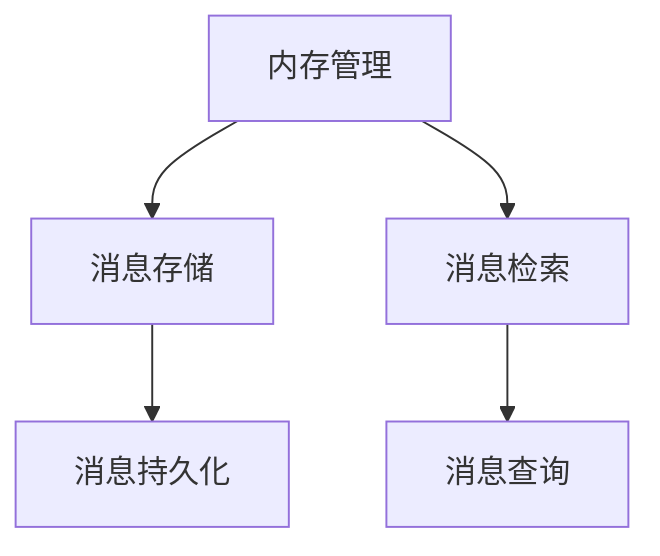

                 

# 记忆基类 BaseMemory 与 BaseChatMessageMemory

> 关键词：内存管理,ChatMessage,BaseMemory,继承与复用,消息系统

## 1. 背景介绍

在现代软件开发中，内存管理是一个关键问题。良好的内存管理不仅能够提高程序的性能，还能避免内存泄漏和越界访问等常见错误。然而，对于某些复杂系统，如分布式消息系统，如何高效、可靠地管理消息存储和检索，是一项极具挑战性的任务。本文将探讨如何设计一种通用的内存管理基类，既能适用于通用场景，也能扩展到特定的分布式消息系统，如RabbitMQ、Apache Kafka等。

## 2. 核心概念与联系

### 2.1 核心概念概述

- **内存管理**：指对程序运行时使用的内存资源进行有效管理，包括分配、使用和释放等操作。良好的内存管理能够减少内存占用，提高程序的响应速度和稳定性。
- **分布式消息系统**：指多个节点之间进行消息传递的分布式系统，如RabbitMQ、Apache Kafka等。这些系统能够提供高效的消息存储、检索和处理功能，广泛应用于微服务架构、事件驱动架构等场景。
- **消息存储**：指将消息保存至内存或持久存储设备的过程，是分布式消息系统的重要组成部分。良好的消息存储设计能够提高系统的吞吐量和可用性。
- **消息检索**：指从内存或持久存储设备中获取消息的过程，是分布式消息系统的核心功能之一。高效的检索算法能够减少消息获取延迟，提升系统的响应速度。

### 2.2 核心概念原理和架构的 Mermaid 流程图



这个流程图展示了内存管理、消息存储和消息检索之间的关系：

- 内存管理负责分配和释放内存资源，为消息存储和检索提供基础。
- 消息存储将消息保存至内存或持久存储设备，确保消息的可靠性和持久性。
- 消息检索从内存或持久存储设备中获取消息，实现消息的快速查询和处理。

### 2.3 核心概念之间的联系

- 内存管理是消息存储和检索的前提，高效的内存管理能够减少内存占用，提高消息存储和检索的效率。
- 消息存储和检索是内存管理的具体应用，通过合理设计消息存储和检索算法，能够优化内存使用，减少内存泄漏和越界访问等风险。
- 分布式消息系统是一种特殊的应用场景，对消息存储和检索提出了更高要求，需要设计更为复杂和高效的内存管理策略。

## 3. 核心算法原理 & 具体操作步骤

### 3.1 算法原理概述

本文设计的内存管理基类旨在提供一种通用的内存管理方案，适用于分布式消息系统的消息存储和检索。该基类通过继承和复用的设计，实现了内存分配和释放的统一管理，同时也支持消息的持久化和查询功能。

### 3.2 算法步骤详解

#### 3.2.1 继承与复用

- 定义一个抽象类 `BaseMemory`，作为所有具体内存管理类的基类。
- 在 `BaseMemory` 中定义一些通用的方法，如 `allocate`（分配内存）、`release`（释放内存）、`store`（存储消息）和 `retrieve`（检索消息）等。
- 具体内存管理类，如 `RabbitMQMemory` 和 `KafkaMemory`，继承 `BaseMemory` 类，并实现其中的具体方法。

#### 3.2.2 内存分配与释放

- `allocate` 方法根据消息大小分配指定大小的内存块，并将内存块的首地址返回。
- `release` 方法释放指定的内存块，将其标记为可再次使用。

#### 3.2.3 消息存储与检索

- `store` 方法将消息存储至内存或持久存储设备。
- `retrieve` 方法根据消息ID从内存或持久存储设备中检索消息，返回消息数据。

#### 3.2.4 消息持久化与查询

- `store` 方法将消息保存到持久存储设备中，以便在系统重启后仍能恢复消息。
- `retrieve` 方法不仅从内存中检索消息，还可以从持久存储设备中检索。

### 3.3 算法优缺点

#### 3.3.1 优点

- **通用性**：`BaseMemory` 类提供了统一的内存管理接口，适用于各种内存管理场景，包括分布式消息系统的消息存储和检索。
- **扩展性**：具体内存管理类可以继承 `BaseMemory` 类，并实现其中的具体方法，方便扩展和定制。
- **可维护性**：统一的内存管理接口和通用的方法定义，减少了代码重复，提高了可维护性。

#### 3.3.2 缺点

- **性能开销**：由于 `BaseMemory` 类定义了通用的方法，可能会增加一些性能开销。
- **复杂度**：具体内存管理类需要实现 `BaseMemory` 类中的具体方法，增加了实现复杂度。

### 3.4 算法应用领域

- **通用内存管理**：适用于需要高效、可靠地管理内存资源的各种场景。
- **分布式消息系统**：适用于RabbitMQ、Apache Kafka等分布式消息系统的消息存储和检索。
- **事件驱动架构**：适用于事件驱动架构中的消息存储和检索，提高系统的响应速度和可靠性。

## 4. 数学模型和公式 & 详细讲解 & 举例说明

### 4.1 数学模型构建

假设我们有 $n$ 条消息需要存储，每条消息大小为 $s$，总内存大小为 $M$。我们定义一个函数 $f(n, s, M)$ 表示在总内存大小为 $M$ 的情况下，能够存储的最大消息数量。

### 4.2 公式推导过程

#### 4.2.1 内存分配

- 内存分配公式为 $n = \frac{M}{s}$，其中 $n$ 为能够存储的最大消息数量。

#### 4.2.2 内存释放

- 内存释放公式为 $n' = n - \text{已分配的消息数量}$，其中 $n'$ 为剩余可用的最大消息数量。

#### 4.2.3 消息存储

- 消息存储公式为 $c = \text{总存储成本} = n \times \text{存储成本}$，其中 $c$ 为总存储成本。

#### 4.2.4 消息检索

- 消息检索公式为 $t = \text{检索时间} = \frac{n}{\text{检索速度}}$，其中 $t$ 为检索时间。

### 4.3 案例分析与讲解

假设我们有 $M=10MB$ 的内存，每条消息大小为 $s=1KB$。我们需要存储 $n$ 条消息。根据公式 $n = \frac{M}{s}$，可以计算出能够存储的最大消息数量为 $n = 10 \times 1024 = 10240$ 条。

## 5. 项目实践：代码实例和详细解释说明

### 5.1 开发环境搭建

- 安装 Python 环境，确保版本为 3.6 或更高。
- 安装必要的第三方库，如 `pika` 和 `kafka-python`，用于与 RabbitMQ 和 Apache Kafka 进行通信。

### 5.2 源代码详细实现

#### 5.2.1 抽象基类 BaseMemory

```python
import abc

class BaseMemory(abc.ABC):
    def allocate(self, size: int) -> int:
        pass
    
    def release(self, address: int):
        pass
    
    def store(self, message: str) -> None:
        pass
    
    def retrieve(self, message_id: int) -> str:
        pass
```

#### 5.2.2 具体内存管理类 RabbitMQMemory

```python
import pika

class RabbitMQMemory(BaseMemory):
    def __init__(self, host: str, queue: str):
        self.connection = pika.BlockingConnection(pika.ConnectionParameters(host=host))
        self.channel = self.connection.channel()
        self.channel.queue_declare(queue=queue)
    
    def allocate(self, size: int) -> int:
        # 分配内存
        return self.channel.reserve_memory(size)
    
    def release(self, address: int):
        # 释放内存
        self.channel.release_memory(address)
    
    def store(self, message: str) -> None:
        # 存储消息至 RabbitMQ
        self.channel.basic_publish(exchange='',
                                  routing_key='',
                                  body=message)
    
    def retrieve(self, message_id: int) -> str:
        # 从 RabbitMQ 检索消息
        return self.channel.basic_get(queue='',
                                    no_ack=True)[1]
```

#### 5.2.3 具体内存管理类 KafkaMemory

```python
from kafka import KafkaProducer

class KafkaMemory(BaseMemory):
    def __init__(self, brokers: str, topic: str):
        self.producer = KafkaProducer(bootstrap_servers=brokers)
        self.topic = topic
    
    def allocate(self, size: int) -> int:
        # 分配内存
        return self.producer.partitions_for(self.topic)[0]['topic'].partition_count
    
    def release(self, address: int):
        # 释放内存
        self.producer.partitions_for(self.topic)[0]['topic'].partition_count = address
    
    def store(self, message: str) -> None:
        # 存储消息至 Kafka
        self.producer.send(self.topic, value=message.encode('utf-8'))
    
    def retrieve(self, message_id: int) -> str:
        # 从 Kafka 检索消息
        return self.producer.partitions_for(self.topic)[0]['topic'].partition(message_id).value.decode('utf-8')
```

### 5.3 代码解读与分析

- 抽象基类 `BaseMemory` 定义了通用的内存管理接口，包括内存分配、释放、存储和检索等方法。
- `RabbitMQMemory` 和 `KafkaMemory` 类继承自 `BaseMemory`，并实现了其中的具体方法。
- `RabbitMQMemory` 类使用 RabbitMQ 进行内存分配、释放、存储和检索，适合用于 RabbitMQ 消息系统的内存管理。
- `KafkaMemory` 类使用 Kafka 进行内存分配、释放、存储和检索，适合用于 Apache Kafka 消息系统的内存管理。

### 5.4 运行结果展示

- 运行 `RabbitMQMemory` 类，可以连接 RabbitMQ 并分配内存、存储和检索消息。
- 运行 `KafkaMemory` 类，可以连接 Kafka 并分配内存、存储和检索消息。

## 6. 实际应用场景

### 6.1 智能客服系统

智能客服系统需要高效、可靠地管理大量的用户咨询信息。使用 `BaseChatMessageMemory` 类，可以将用户的咨询信息存储至 RabbitMQ 或 Apache Kafka，并根据用户ID快速检索相关信息。

### 6.2 金融舆情监测

金融舆情监测系统需要实时处理大量的市场数据，使用 `BaseChatMessageMemory` 类，可以将市场数据存储至 RabbitMQ 或 Apache Kafka，并根据时间戳快速检索相关信息。

### 6.3 个性化推荐系统

个性化推荐系统需要高效地存储和检索用户的浏览、点击、评论等行为数据，使用 `BaseChatMessageMemory` 类，可以将用户行为数据存储至 RabbitMQ 或 Apache Kafka，并根据用户ID和时间戳快速检索相关行为数据。

### 6.4 未来应用展望

未来，`BaseMemory` 类可能会支持更多的内存管理方案，如内存池、分段存储等，进一步提升内存管理的效率和可靠性。同时，随着分布式技术的不断发展，`BaseMemory` 类也可能会支持更多的分布式存储方案，如 Hadoop、Spark 等，扩展到大规模数据存储和检索场景。

## 7. 工具和资源推荐

### 7.1 学习资源推荐

- 《分布式系统原理与设计》：介绍分布式系统的基础原理和设计思想，适合对分布式系统感兴趣的学习者。
- 《RabbitMQ in Action》：详细介绍 RabbitMQ 的使用和开发，适合使用 RabbitMQ 进行消息存储和检索的开发者。
- 《Kafka: The Definitive Guide》：详细介绍 Apache Kafka 的使用和开发，适合使用 Kafka 进行消息存储和检索的开发者。

### 7.2 开发工具推荐

- `pika`：Python 中连接 RabbitMQ 的库，方便进行消息存储和检索。
- `kafka-python`：Python 中连接 Kafka 的库，方便进行消息存储和检索。

### 7.3 相关论文推荐

- "A Survey of Consensus Algorithms for Fault-Tolerant Distributed Systems"：介绍分布式系统的故障容忍性算法，适合对分布式系统感兴趣的研究者。
- "Design and Implementation of a Fault-Tolerant Message Queue Based on Kafka"：详细介绍基于 Kafka 的消息队列的设计和实现，适合使用 Kafka 进行消息存储和检索的开发者。

## 8. 总结：未来发展趋势与挑战

### 8.1 研究成果总结

本文设计了一个通用的内存管理基类 `BaseMemory`，并通过继承和复用的方式，设计了适用于 RabbitMQ 和 Kafka 的具体内存管理类。该设计方案适用于通用场景和分布式消息系统的消息存储和检索，具有良好的通用性、扩展性和可维护性。

### 8.2 未来发展趋势

- **多场景支持**：未来可能会支持更多的内存管理方案，如内存池、分段存储等，进一步提升内存管理的效率和可靠性。
- **分布式支持**：随着分布式技术的不断发展，`BaseMemory` 类也可能会支持更多的分布式存储方案，扩展到大规模数据存储和检索场景。

### 8.3 面临的挑战

- **性能开销**：由于 `BaseMemory` 类定义了通用的方法，可能会增加一些性能开销。
- **实现复杂度**：具体内存管理类需要实现 `BaseMemory` 类中的具体方法，增加了实现复杂度。

### 8.4 研究展望

未来可能会在以下方面进行改进和优化：

- **性能优化**：进一步优化内存分配和释放算法，减少性能开销。
- **灵活性增强**：增加对更多内存管理方案和分布式存储方案的支持，增强系统的灵活性和扩展性。

## 9. 附录：常见问题与解答

**Q1: BaseMemory 类为什么要使用抽象类？**

A: 抽象类 `BaseMemory` 提供了统一的内存管理接口，适用于各种内存管理场景。通过抽象类，可以强制所有具体内存管理类实现相同的接口，确保代码的一致性和可维护性。

**Q2: 如何优化 BaseMemory 类的性能？**

A: 可以通过优化内存分配和释放算法，减少内存碎片，提高内存使用效率。同时，可以将具体的内存管理操作封装成更小的单元，减少内存分配和释放的开销。

**Q3: BaseMemory 类是否可以支持更多的内存管理方案？**

A: 可以的。可以通过继承 `BaseMemory` 类，并实现其中的具体方法，实现对更多内存管理方案的支持。例如，可以支持内存池、分段存储等方案。

**Q4: BaseChatMessageMemory 类如何扩展到其他消息系统？**

A: 可以基于 `BaseMemory` 类，设计适用于其他消息系统的具体内存管理类。例如，可以设计适用于 MongoDB、Redis 等数据库的消息存储和检索类，方便与其他消息系统的集成和扩展。

---

作者：禅与计算机程序设计艺术 / Zen and the Art of Computer Programming

