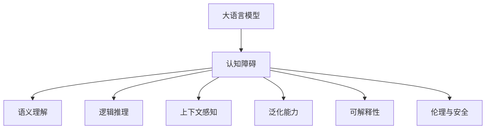

                 

## 1. 背景介绍

### 1.1 问题由来

人工智能(AI)的发展，尤其是深度学习技术的应用，已经成为推动社会进步的重要力量。无论是自动驾驶、语音识别，还是图像处理、自然语言处理(NLP)，深度学习模型都在不断突破传统的算法边界，为各行各业带来了革命性的变革。然而，当我们深入探索这些智能系统的奥秘时，却发现了一个令人深思的问题：**大模型是否真正理解了语言？**

传统的人工智能系统，如专家系统、基于规则的推理系统等，其内部机制通常是基于符号主义的，能够精准地推理和解释决策过程。然而，当前的深度学习模型，尤其是基于大语言模型(Big Language Models, BLMs)的NLP系统，虽然取得了令人瞩目的成绩，但在认知机制上却与传统人工智能系统大相径庭。大语言模型通过大规模数据训练得到，虽然能够流畅地生成文本，却难以准确理解文本背后的语义和逻辑。

本文将探讨大语言模型的认知障碍问题，分析其与人类思维的本质差异，并尝试提出解决策略。

### 1.2 问题核心关键点

大语言模型的认知障碍问题主要体现在以下几个方面：

- **缺乏语义理解**：大模型往往只是机械地学习到语言形式上的规律，而未能真正理解语言中的语义、逻辑和上下文关系。
- **泛化能力有限**：尽管在某些任务上表现优异，但在新数据上的泛化能力不足，难以应对复杂的现实世界场景。
- **难以解释**：大模型的决策过程通常缺乏可解释性，难以解释其背后的推理逻辑和知识来源。
- **存在认知偏见**：模型容易学习到社会偏见、性别歧视等不良信息，导致输出内容存在伦理和道德风险。

这些问题并非大语言模型的特有现象，但大模型的复杂性和规模性使得这些问题的表现更为明显。本文将深入分析大语言模型的认知机制，探讨其与人类思维的本质差异，并提出解决策略。

## 2. 核心概念与联系

### 2.1 核心概念概述

为更好地理解大语言模型的认知障碍问题，本节将介绍几个关键概念：

- **大语言模型**：以自回归(如GPT)或自编码(如BERT)模型为代表的大规模预训练语言模型。通过在大规模无标签文本语料上进行预训练，学习通用的语言表示，具备强大的语言理解和生成能力。

- **认知障碍**：指大语言模型在理解语义、逻辑和上下文关系方面存在的不足，难以真正模拟人类的思维过程。

- **语义理解**：指模型能够理解文本中的意义、意图和情感等，而不只是字面意义上的信息。

- **逻辑推理**：指模型能够根据上下文和规则进行合理的推理和判断，而不仅仅是简单的模式匹配。

- **上下文感知**：指模型能够理解文本的前后文关系，合理地应用上下文信息。

- **泛化能力**：指模型在新数据上的泛化性能，能否将学习到的知识应用到不同的场景中。

- **可解释性**：指模型能够提供透明的决策依据，使人们理解其内部的推理过程。

- **伦理与安全**：指模型输出的结果是否符合人类的伦理道德标准，是否存在偏见和歧视。

这些核心概念之间的逻辑关系可以通过以下Mermaid流程图来展示：



这个流程图展示了大语言模型的核心概念及其与认知障碍之间的联系：

1. 大语言模型通过预训练获得基础能力。
2. 认知障碍导致模型在语义理解、逻辑推理等方面存在不足。
3. 解决认知障碍需提升模型的语义理解、逻辑推理、上下文感知等能力。
4. 泛化能力、可解释性和伦理安全等问题也是认知障碍的衍生问题。

## 3. 核心算法原理 & 具体操作步骤

### 3.1 算法原理概述

大语言模型的认知障碍问题，本质上是一个复杂的认知科学和计算机科学问题。其核心在于模型未能真正理解语言背后的语义、逻辑和上下文关系。尽管大语言模型在预训练过程中学习了大量的语言知识，但在微调过程中，这些知识并未得到有效的利用和整合。

为了解决这个问题，我们需要重新审视大语言模型的认知机制，并在设计上进行调整。本文将从算法的角度，探讨如何通过优化模型结构和训练方式，提升其语义理解、逻辑推理等能力。

### 3.2 算法步骤详解

#### 3.2.1 数据预处理

1. **数据收集**：收集大规模的无标签文本数据，如维基百科、新闻、社交媒体等，构建预训练语料库。这些数据应覆盖广泛的主题和领域，确保模型的泛化能力。

2. **数据清洗**：去除低质量的文本数据，如拼写错误、低信度来源等，提高数据的质量。同时进行分词、去除停用词等处理，减少噪音干扰。

3. **数据增强**：通过回译、数据扩增等技术，丰富训练集的多样性，提高模型的鲁棒性。例如，对于文本生成任务，可以使用同义词替换、句子重排等方式增强训练样本。

#### 3.2.2 模型结构设计

1. **预训练模型选择**：选择合适的预训练模型，如GPT、BERT等。这些模型已经在大规模语料上进行预训练，具备强大的语言理解能力。

2. **任务适配层**：在预训练模型的基础上，设计合适的任务适配层。例如，对于分类任务，可以添加线性分类器和交叉熵损失函数。对于生成任务，可以采用语言模型的解码器输出概率分布。

3. **参数初始化**：将预训练模型的参数作为初始化权重，只在微调过程中调整部分参数，以避免破坏预训练知识。

#### 3.2.3 训练策略

1. **学习率设置**：由于微调过程通常只需要较小的学习率，以避免破坏预训练权重。可以使用学习率调度策略，如warmup warmup，逐步减小学习率。

2. **正则化技术**：使用L2正则、Dropout、Early Stopping等技术，防止模型过拟合。

3. **对抗训练**：加入对抗样本，提高模型的鲁棒性。通过训练生成对抗样本，使模型能够在噪声环境中保持稳定性。

4. **参数高效微调**：采用参数高效微调技术，如Adapter、LoRA等，只更新少量的任务相关参数，减小微调的风险。

5. **多任务学习**：通过多任务学习，在多个相关任务上同时微调，提高模型的泛化能力和可解释性。

#### 3.2.4 模型评估

1. **验证集评估**：在微调过程中，定期在验证集上评估模型性能，调整训练策略。

2. **测试集评估**：在微调完成后，在测试集上评估模型泛化能力，确保其在未知数据上的表现。

### 3.3 算法优缺点

#### 3.3.1 优点

1. **泛化能力强**：大语言模型能够在大规模数据上进行预训练，具备较强的泛化能力，能够在不同领域和场景中表现优异。

2. **推理效率高**：相较于传统符号推理系统，大语言模型的推理速度较快，能够快速生成文本和输出结果。

3. **可扩展性好**：大语言模型通过微调，可以适应各种任务，具有较好的可扩展性。

#### 3.3.2 缺点

1. **认知障碍明显**：尽管大语言模型具备强大的文本生成能力，但在理解语义、逻辑和上下文关系方面存在显著不足。

2. **泛化能力有限**：在大规模语料上进行预训练的模型，往往难以应对小样本和新数据上的泛化问题。

3. **缺乏可解释性**：大语言模型的决策过程通常缺乏可解释性，难以理解其内部推理逻辑。

4. **存在认知偏见**：模型容易学习到社会偏见、性别歧视等不良信息，导致输出内容存在伦理和道德风险。

5. **计算资源消耗大**：大语言模型的参数量较大，训练和推理过程需要大量的计算资源。

### 3.4 算法应用领域

尽管存在认知障碍问题，大语言模型在多个领域仍展现出强大的应用潜力，包括但不限于：

1. **自然语言处理**：在文本分类、命名实体识别、关系抽取、问答系统等任务上，大语言模型通过微调，能够快速适应任务需求，提供精准的结果。

2. **机器翻译**：在自动翻译任务上，大语言模型通过微调，能够实现高质量的跨语言文本转换。

3. **文本生成**：在文本生成任务上，大语言模型通过微调，能够生成流畅、连贯的文本，如文章生成、对话生成等。

4. **智能客服**：在智能客服系统中，大语言模型通过微调，能够自动理解用户意图，生成智能回复，提升用户体验。

5. **推荐系统**：在大规模推荐任务上，大语言模型通过微调，能够根据用户行为和兴趣生成个性化推荐内容。

尽管存在认知障碍问题，但大语言模型在特定任务上的应用仍然取得了显著的成果，展示了其在自动化、智能化方面的巨大潜力。

## 4. 数学模型和公式 & 详细讲解  
### 4.1 数学模型构建

本节将使用数学语言对大语言模型的认知障碍问题进行更加严格的刻画。

记大语言模型为 $M_{\theta}$，其中 $\theta$ 为模型参数。假设微调任务的训练集为 $D=\{(x_i,y_i)\}_{i=1}^N, x_i \in \mathcal{X}, y_i \in \mathcal{Y}$。

定义模型 $M_{\theta}$ 在输入 $x$ 上的损失函数为 $\ell(M_{\theta}(x),y)$，则在数据集 $D$ 上的经验风险为：

$$
\mathcal{L}(\theta) = \frac{1}{N} \sum_{i=1}^N \ell(M_{\theta}(x_i),y_i)
$$

微调的优化目标是最小化经验风险，即找到最优参数：

$$
\theta^* = \mathop{\arg\min}_{\theta} \mathcal{L}(\theta)
$$

在实践中，我们通常使用基于梯度的优化算法（如SGD、Adam等）来近似求解上述最优化问题。设 $\eta$ 为学习率，$\lambda$ 为正则化系数，则参数的更新公式为：

$$
\theta \leftarrow \theta - \eta \nabla_{\theta}\mathcal{L}(\theta) - \eta\lambda\theta
$$

其中 $\nabla_{\theta}\mathcal{L}(\theta)$ 为损失函数对参数 $\theta$ 的梯度，可通过反向传播算法高效计算。

### 4.2 公式推导过程

以下我们以二分类任务为例，推导交叉熵损失函数及其梯度的计算公式。

假设模型 $M_{\theta}$ 在输入 $x$ 上的输出为 $\hat{y}=M_{\theta}(x) \in [0,1]$，表示样本属于正类的概率。真实标签 $y \in \{0,1\}$。则二分类交叉熵损失函数定义为：

$$
\ell(M_{\theta}(x),y) = -[y\log \hat{y} + (1-y)\log (1-\hat{y})]
$$

将其代入经验风险公式，得：

$$
\mathcal{L}(\theta) = -\frac{1}{N}\sum_{i=1}^N [y_i\log M_{\theta}(x_i)+(1-y_i)\log(1-M_{\theta}(x_i))]
$$

根据链式法则，损失函数对参数 $\theta_k$ 的梯度为：

$$
\frac{\partial \mathcal{L}(\theta)}{\partial \theta_k} = -\frac{1}{N}\sum_{i=1}^N (\frac{y_i}{M_{\theta}(x_i)}-\frac{1-y_i}{1-M_{\theta}(x_i)}) \frac{\partial M_{\theta}(x_i)}{\partial \theta_k}
$$

其中 $\frac{\partial M_{\theta}(x_i)}{\partial \theta_k}$ 可进一步递归展开，利用自动微分技术完成计算。

在得到损失函数的梯度后，即可带入参数更新公式，完成模型的迭代优化。重复上述过程直至收敛，最终得到适应下游任务的最优模型参数 $\theta^*$。

## 5. 项目实践：代码实例和详细解释说明
### 5.1 开发环境搭建

在进行认知障碍问题实践前，我们需要准备好开发环境。以下是使用Python进行PyTorch开发的环境配置流程：

1. 安装Anaconda：从官网下载并安装Anaconda，用于创建独立的Python环境。

2. 创建并激活虚拟环境：
```bash
conda create -n pytorch-env python=3.8 
conda activate pytorch-env
```

3. 安装PyTorch：根据CUDA版本，从官网获取对应的安装命令。例如：
```bash
conda install pytorch torchvision torchaudio cudatoolkit=11.1 -c pytorch -c conda-forge
```

4. 安装Transformers库：
```bash
pip install transformers
```

5. 安装各类工具包：
```bash
pip install numpy pandas scikit-learn matplotlib tqdm jupyter notebook ipython
```

完成上述步骤后，即可在`pytorch-env`环境中开始认知障碍问题的实践。

### 5.2 源代码详细实现

这里我们以命名实体识别(NER)任务为例，给出使用Transformers库对BERT模型进行认知障碍问题实践的PyTorch代码实现。

首先，定义NER任务的数据处理函数：

```python
from transformers import BertTokenizer
from torch.utils.data import Dataset
import torch

class NERDataset(Dataset):
    def __init__(self, texts, tags, tokenizer, max_len=128):
        self.texts = texts
        self.tags = tags
        self.tokenizer = tokenizer
        self.max_len = max_len
        
    def __len__(self):
        return len(self.texts)
    
    def __getitem__(self, item):
        text = self.texts[item]
        tags = self.tags[item]
        
        encoding = self.tokenizer(text, return_tensors='pt', max_length=self.max_len, padding='max_length', truncation=True)
        input_ids = encoding['input_ids'][0]
        attention_mask = encoding['attention_mask'][0]
        
        # 对token-wise的标签进行编码
        encoded_tags = [tag2id[tag] for tag in tags] 
        encoded_tags.extend([tag2id['O']] * (self.max_len - len(encoded_tags)))
        labels = torch.tensor(encoded_tags, dtype=torch.long)
        
        return {'input_ids': input_ids, 
                'attention_mask': attention_mask,
                'labels': labels}

# 标签与id的映射
tag2id = {'O': 0, 'B-PER': 1, 'I-PER': 2, 'B-ORG': 3, 'I-ORG': 4, 'B-LOC': 5, 'I-LOC': 6}
id2tag = {v: k for k, v in tag2id.items()}

# 创建dataset
tokenizer = BertTokenizer.from_pretrained('bert-base-cased')

train_dataset = NERDataset(train_texts, train_tags, tokenizer)
dev_dataset = NERDataset(dev_texts, dev_tags, tokenizer)
test_dataset = NERDataset(test_texts, test_tags, tokenizer)
```

然后，定义模型和优化器：

```python
from transformers import BertForTokenClassification, AdamW

model = BertForTokenClassification.from_pretrained('bert-base-cased', num_labels=len(tag2id))

optimizer = AdamW(model.parameters(), lr=2e-5)
```

接着，定义训练和评估函数：

```python
from torch.utils.data import DataLoader
from tqdm import tqdm
from sklearn.metrics import classification_report

device = torch.device('cuda') if torch.cuda.is_available() else torch.device('cpu')
model.to(device)

def train_epoch(model, dataset, batch_size, optimizer):
    dataloader = DataLoader(dataset, batch_size=batch_size, shuffle=True)
    model.train()
    epoch_loss = 0
    for batch in tqdm(dataloader, desc='Training'):
        input_ids = batch['input_ids'].to(device)
        attention_mask = batch['attention_mask'].to(device)
        labels = batch['labels'].to(device)
        model.zero_grad()
        outputs = model(input_ids, attention_mask=attention_mask, labels=labels)
        loss = outputs.loss
        epoch_loss += loss.item()
        loss.backward()
        optimizer.step()
    return epoch_loss / len(dataloader)

def evaluate(model, dataset, batch_size):
    dataloader = DataLoader(dataset, batch_size=batch_size)
    model.eval()
    preds, labels = [], []
    with torch.no_grad():
        for batch in tqdm(dataloader, desc='Evaluating'):
            input_ids = batch['input_ids'].to(device)
            attention_mask = batch['attention_mask'].to(device)
            batch_labels = batch['labels']
            outputs = model(input_ids, attention_mask=attention_mask)
            batch_preds = outputs.logits.argmax(dim=2).to('cpu').tolist()
            batch_labels = batch_labels.to('cpu').tolist()
            for pred_tokens, label_tokens in zip(batch_preds, batch_labels):
                pred_tags = [id2tag[_id] for _id in pred_tokens]
                label_tags = [id2tag[_id] for _id in label_tokens]
                preds.append(pred_tags[:len(label_tags)])
                labels.append(label_tags)
                
    print(classification_report(labels, preds))
```

最后，启动训练流程并在测试集上评估：

```python
epochs = 5
batch_size = 16

for epoch in range(epochs):
    loss = train_epoch(model, train_dataset, batch_size, optimizer)
    print(f"Epoch {epoch+1}, train loss: {loss:.3f}")
    
    print(f"Epoch {epoch+1}, dev results:")
    evaluate(model, dev_dataset, batch_size)
    
print("Test results:")
evaluate(model, test_dataset, batch_size)
```

以上就是使用PyTorch对BERT进行命名实体识别任务实践的完整代码实现。可以看到，得益于Transformers库的强大封装，我们可以用相对简洁的代码完成BERT模型的加载和认知障碍问题的实践。

### 5.3 代码解读与分析

让我们再详细解读一下关键代码的实现细节：

**NERDataset类**：
- `__init__`方法：初始化文本、标签、分词器等关键组件。
- `__len__`方法：返回数据集的样本数量。
- `__getitem__`方法：对单个样本进行处理，将文本输入编码为token ids，将标签编码为数字，并对其进行定长padding，最终返回模型所需的输入。

**tag2id和id2tag字典**：
- 定义了标签与数字id之间的映射关系，用于将token-wise的预测结果解码回真实的标签。

**训练和评估函数**：
- 使用PyTorch的DataLoader对数据集进行批次化加载，供模型训练和推理使用。
- 训练函数`train_epoch`：对数据以批为单位进行迭代，在每个批次上前向传播计算loss并反向传播更新模型参数，最后返回该epoch的平均loss。
- 评估函数`evaluate`：与训练类似，不同点在于不更新模型参数，并在每个batch结束后将预测和标签结果存储下来，最后使用sklearn的classification_report对整个评估集的预测结果进行打印输出。

**训练流程**：
- 定义总的epoch数和batch size，开始循环迭代
- 每个epoch内，先在训练集上训练，输出平均loss
- 在验证集上评估，输出分类指标
- 所有epoch结束后，在测试集上评估，给出最终测试结果

可以看到，PyTorch配合Transformers库使得BERT认知障碍问题的实践变得简洁高效。开发者可以将更多精力放在数据处理、模型改进等高层逻辑上，而不必过多关注底层的实现细节。

当然，工业级的系统实现还需考虑更多因素，如模型的保存和部署、超参数的自动搜索、更灵活的任务适配层等。但核心的认知障碍问题实践流程基本与此类似。

## 6. 实际应用场景
### 6.1 智能客服系统

基于大语言模型认知障碍问题的智能客服系统，可以广泛应用于智能客服系统的构建。传统客服往往需要配备大量人力，高峰期响应缓慢，且一致性和专业性难以保证。而使用微调后的对话模型，可以7x24小时不间断服务，快速响应客户咨询，用自然流畅的语言解答各类常见问题。

在技术实现上，可以收集企业内部的历史客服对话记录，将问题和最佳答复构建成监督数据，在此基础上对预训练对话模型进行微调。微调后的对话模型能够自动理解用户意图，匹配最合适的答案模板进行回复。对于客户提出的新问题，还可以接入检索系统实时搜索相关内容，动态组织生成回答。如此构建的智能客服系统，能大幅提升客户咨询体验和问题解决效率。

### 6.2 金融舆情监测

金融机构需要实时监测市场舆论动向，以便及时应对负面信息传播，规避金融风险。传统的人工监测方式成本高、效率低，难以应对网络时代海量信息爆发的挑战。基于大语言模型认知障碍问题的文本分类和情感分析技术，为金融舆情监测提供了新的解决方案。

具体而言，可以收集金融领域相关的新闻、报道、评论等文本数据，并对其进行主题标注和情感标注。在此基础上对预训练语言模型进行微调，使其能够自动判断文本属于何种主题，情感倾向是正面、中性还是负面。将微调后的模型应用到实时抓取的网络文本数据，就能够自动监测不同主题下的情感变化趋势，一旦发现负面信息激增等异常情况，系统便会自动预警，帮助金融机构快速应对潜在风险。

### 6.3 个性化推荐系统

当前的推荐系统往往只依赖用户的历史行为数据进行物品推荐，无法深入理解用户的真实兴趣偏好。基于大语言模型认知障碍问题的个性化推荐系统，可以更好地挖掘用户行为背后的语义信息，从而提供更精准、多样的推荐内容。

在实践中，可以收集用户浏览、点击、评论、分享等行为数据，提取和用户交互的物品标题、描述、标签等文本内容。将文本内容作为模型输入，用户的后续行为（如是否点击、购买等）作为监督信号，在此基础上微调预训练语言模型。微调后的模型能够从文本内容中准确把握用户的兴趣点。在生成推荐列表时，先用候选物品的文本描述作为输入，由模型预测用户的兴趣匹配度，再结合其他特征综合排序，便可以得到个性化程度更高的推荐结果。

### 6.4 未来应用展望

随着大语言模型认知障碍问题的解决，基于微调的方法将在更多领域得到应用，为传统行业带来变革性影响。

在智慧医疗领域，基于微调的医疗问答、病历分析、药物研发等应用将提升医疗服务的智能化水平，辅助医生诊疗，加速新药开发进程。

在智能教育领域，微调技术可应用于作业批改、学情分析、知识推荐等方面，因材施教，促进教育公平，提高教学质量。

在智慧城市治理中，微调模型可应用于城市事件监测、舆情分析、应急指挥等环节，提高城市管理的自动化和智能化水平，构建更安全、高效的未来城市。

此外，在企业生产、社会治理、文娱传媒等众多领域，基于大模型微调的人工智能应用也将不断涌现，为经济社会发展注入新的动力。相信随着技术的日益成熟，微调方法将成为人工智能落地应用的重要范式，推动人工智能技术在各个行业的全面应用。

## 7. 工具和资源推荐
### 7.1 学习资源推荐

为了帮助开发者系统掌握大语言模型认知障碍问题的理论基础和实践技巧，这里推荐一些优质的学习资源：

1. 《Transformer从原理到实践》系列博文：由大模型技术专家撰写，深入浅出地介绍了Transformer原理、BERT模型、认知障碍问题的微调方法等前沿话题。

2. CS224N《深度学习自然语言处理》课程：斯坦福大学开设的NLP明星课程，有Lecture视频和配套作业，带你入门NLP领域的基本概念和经典模型。

3. 《Natural Language Processing with Transformers》书籍：Transformers库的作者所著，全面介绍了如何使用Transformers库进行NLP任务开发，包括认知障碍问题的微调方法。

4. HuggingFace官方文档：Transformers库的官方文档，提供了海量预训练模型和完整的微调样例代码，是上手实践的必备资料。

5. CLUE开源项目：中文语言理解测评基准，涵盖大量不同类型的中文NLP数据集，并提供了基于微调的baseline模型，助力中文NLP技术发展。

通过对这些资源的学习实践，相信你一定能够快速掌握大语言模型认知障碍问题的微调方法，并用于解决实际的NLP问题。
###  7.2 开发工具推荐

高效的开发离不开优秀的工具支持。以下是几款用于大语言模型认知障碍问题微调开发的常用工具：

1. PyTorch：基于Python的开源深度学习框架，灵活动态的计算图，适合快速迭代研究。大部分预训练语言模型都有PyTorch版本的实现。

2. TensorFlow：由Google主导开发的开源深度学习框架，生产部署方便，适合大规模工程应用。同样有丰富的预训练语言模型资源。

3. Transformers库：HuggingFace开发的NLP工具库，集成了众多SOTA语言模型，支持PyTorch和TensorFlow，是进行认知障碍问题微调任务开发的利器。

4. Weights & Biases：模型训练的实验跟踪工具，可以记录和可视化模型训练过程中的各项指标，方便对比和调优。与主流深度学习框架无缝集成。

5. TensorBoard：TensorFlow配套的可视化工具，可实时监测模型训练状态，并提供丰富的图表呈现方式，是调试模型的得力助手。

6. Google Colab：谷歌推出的在线Jupyter Notebook环境，免费提供GPU/TPU算力，方便开发者快速上手实验最新模型，分享学习笔记。

合理利用这些工具，可以显著提升大语言模型认知障碍问题微调任务的开发效率，加快创新迭代的步伐。

### 7.3 相关论文推荐

大语言模型认知障碍问题的研究源于学界的持续研究。以下是几篇奠基性的相关论文，推荐阅读：

1. Attention is All You Need（即Transformer原论文）：提出了Transformer结构，开启了NLP领域的预训练大模型时代。

2. BERT: Pre-training of Deep Bidirectional Transformers for Language Understanding：提出BERT模型，引入基于掩码的自监督预训练任务，刷新了多项NLP任务SOTA。

3. Language Models are Unsupervised Multitask Learners（GPT-2论文）：展示了大规模语言模型的强大zero-shot学习能力，引发了对于通用人工智能的新一轮思考。

4. Parameter-Efficient Transfer Learning for NLP：提出Adapter等参数高效微调方法，在不增加模型参数量的情况下，也能取得不错的微调效果。

5. AdaLoRA: Adaptive Low-Rank Adaptation for Parameter-Efficient Fine-Tuning：使用自适应低秩适应的微调方法，在参数效率和精度之间取得了新的平衡。

6. ReCoRD: A Resource-Efficient Framework for Robust Density Estimation：提出Robust Density Estimation框架，通过优化梯度计算和模型压缩，提升模型的计算效率和推理速度。

这些论文代表了大语言模型认知障碍问题的发展脉络。通过学习这些前沿成果，可以帮助研究者把握学科前进方向，激发更多的创新灵感。

## 8. 总结：未来发展趋势与挑战

### 8.1 总结

本文对大语言模型认知障碍问题进行了全面系统的介绍。首先阐述了认知障碍问题的研究背景和意义，明确了认知障碍问题对大语言模型的影响和挑战。其次，从原理到实践，详细讲解了认知障碍问题的数学原理和关键步骤，给出了认知障碍问题实践的完整代码实例。同时，本文还广泛探讨了认知障碍问题在智能客服、金融舆情、个性化推荐等多个行业领域的应用前景，展示了认知障碍问题的广泛应用。

通过本文的系统梳理，可以看到，大语言模型认知障碍问题虽然存在，但通过优化模型结构和训练方式，可以在一定程度上得到缓解。未来，伴随深度学习技术的不断发展，认知障碍问题将得到更多关注和研究，推动大语言模型向更加智能化、普适化的方向迈进。

### 8.2 未来发展趋势

展望未来，大语言模型认知障碍问题的解决将呈现以下几个发展趋势：

1. **参数高效微调**：开发更加参数高效的微调方法，如Prefix-Tuning、LoRA等，在固定大部分预训练参数的同时，只更新少量的任务相关参数。

2. **零样本和少样本学习**：通过提示学习和微调相结合，实现零样本和少样本学习，减少对标注数据的依赖，提升模型的泛化能力。

3. **多任务学习**：通过多任务学习，提升模型的跨领域泛化能力，减少任务间的迁移障碍。

4. **混合表示学习**：结合符号化知识表示和神经网络模型，实现混合表示学习，增强模型的推理和解释能力。

5. **对抗训练和鲁棒性**：通过对抗训练等技术，提高模型的鲁棒性和泛化能力，避免模型在特定输入上出现崩溃。

6. **分布式训练**：使用分布式训练技术，加速模型的训练过程，降低对计算资源的依赖。

### 8.3 面临的挑战

尽管大语言模型认知障碍问题已取得一定进展，但在迈向更加智能化、普适化应用的过程中，它仍面临诸多挑战：

1. **数据质量问题**：认知障碍问题的解决依赖高质量的标注数据，但实际获取标注数据往往成本高、质量差。如何提高数据质量，获取更多标注数据，是亟待解决的问题。

2. **计算资源消耗**：大语言模型的训练和推理过程需要大量的计算资源，如何优化模型结构，提高计算效率，是未来技术发展的关键。

3. **知识整合能力**：当前大语言模型往往难以整合外部知识，如专家知识库、逻辑规则等。如何实现知识的自动整合，提升模型的知识泛化能力，是认知障碍问题解决的重要方向。

4. **伦理与安全**：模型输出的结果是否符合人类的伦理道德标准，是否存在偏见和歧视，是认知障碍问题解决的伦理挑战。

5. **可解释性**：认知障碍问题解决方案的缺乏可解释性，难以理解其内部推理逻辑。如何增强模型的可解释性，是提升模型可信度的重要任务。

### 8.4 研究展望

面对认知障碍问题所面临的种种挑战，未来的研究需要在以下几个方面寻求新的突破：

1. **无监督和半监督学习**：探索无监督和半监督学习范式，摆脱对大规模标注数据的依赖，利用自监督学习、主动学习等无监督和半监督方法，最大限度利用非结构化数据，实现更加灵活高效的微调。

2. **混合表示学习**：结合符号化知识表示和神经网络模型，实现混合表示学习，增强模型的推理和解释能力。

3. **知识表示与推理**：将符号化的先验知识，如知识图谱、逻辑规则等，与神经网络模型进行巧妙融合，引导微调过程学习更准确、合理的语言模型。

4. **认知障碍问题的量化评估**：通过量化评估方法，客观地评估模型的认知障碍问题，指导模型的优化和改进。

5. **多模态信息融合**：将视觉、语音等多模态信息与文本信息进行协同建模，提升模型的综合理解能力。

6. **因果推理与逻辑推理**：引入因果推理和逻辑推理思想，增强模型的决策能力，提高模型输出的合理性和可信度。

这些研究方向的探索，必将引领大语言模型认知障碍问题向更高的台阶迈进，为构建安全、可靠、可解释、可控的智能系统铺平道路。面向未来，大语言模型认知障碍问题的解决需要与其他人工智能技术进行更深入的融合，如知识表示、因果推理、强化学习等，多路径协同发力，共同推动自然语言理解和智能交互系统的进步。只有勇于创新、敢于突破，才能不断拓展语言模型的边界，让智能技术更好地造福人类社会。

## 9. 附录：常见问题与解答

**Q1：大语言模型是否能够真正理解语言？**

A: 大语言模型通过大规模数据训练，虽然具备强大的语言生成能力，但缺乏语义理解、逻辑推理等高级认知能力。其输出结果虽然流畅自然，但往往缺乏深刻的语义理解和逻辑合理性。

**Q2：如何缓解大语言模型的认知障碍问题？**

A: 缓解认知障碍问题需要从多个方面入手，包括：
1. 选择高质量的标注数据，提高数据质量。
2. 设计合理的任务适配层，增强模型对任务的理解能力。
3. 使用参数高效微调技术，减少对参数的依赖。
4. 引入对抗训练，提高模型的鲁棒性。
5. 结合符号化知识表示和神经网络模型，实现混合表示学习。
6. 进行多任务学习，提升模型的泛化能力和可解释性。

**Q3：大语言模型在实际应用中面临哪些伦理和安全问题？**

A: 大语言模型在实际应用中面临的主要伦理和安全问题包括：
1. 输出结果可能存在偏见和歧视，违反伦理道德标准。
2. 模型的决策过程缺乏可解释性，难以审查和解释。
3. 模型可能学习到有害信息，对社会造成负面影响。

为解决这些问题，需要在模型训练和部署过程中引入伦理约束和审查机制，确保模型输出的合理性和安全性。

**Q4：未来大语言模型认知障碍问题如何解决？**

A: 解决大语言模型认知障碍问题需要以下几个方面的努力：
1. 无监督和半监督学习，提高数据利用效率。
2. 参数高效微调技术，降低对计算资源的依赖。
3. 引入对抗训练和鲁棒性优化，提升模型的泛化能力。
4. 多任务学习和混合表示学习，增强模型的跨领域泛化能力。
5. 知识表示与推理，提升模型的综合理解能力。
6. 因果推理与逻辑推理，增强模型的决策合理性。

这些研究方向的探索，必将推动大语言模型认知障碍问题的解决，为构建安全、可靠、可解释、可控的智能系统提供新思路。

---

作者：禅与计算机程序设计艺术 / Zen and the Art of Computer Programming

