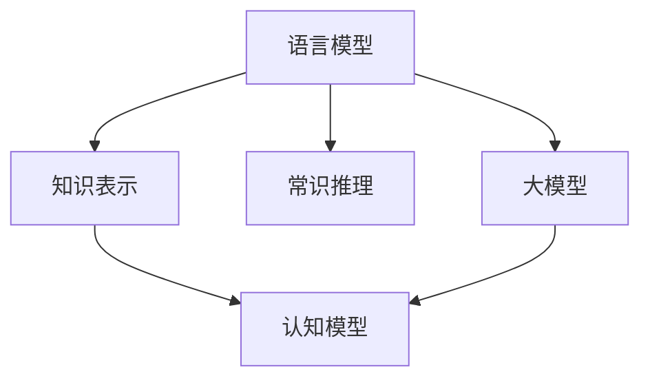

                 

# 语言与思维的差异：大模型的认知挑战

> 关键词：语言模型, 认知, 大模型, 语言理解, 知识表示, 常识推理

## 1. 背景介绍

在当今的数字化时代，人工智能(AI)和自然语言处理(NLP)技术正在迅速发展，对语言与思维的认识也在不断深入。语言和思维是人类认知能力的重要组成部分，它们在AI和NLP中的应用也日益受到关注。尤其是大模型如GPT-3、BERT等，其强大的语言理解和生成能力，让人们开始思考，语言模型是否能够真正理解和模仿人类的思维过程？

### 1.1 问题由来
近年来，深度学习尤其是Transformer和注意力机制的兴起，使得大语言模型的性能有了质的飞跃。这些模型通常基于大规模无标签文本进行预训练，学习到了丰富的语言知识和常识，能够进行复杂的自然语言处理任务。但与此同时，语言模型在理解、推理、知识表示等方面的能力，是否能够与人类思维方式相匹配，成为了一个值得深入探讨的问题。

### 1.2 问题核心关键点
1. **语言模型的认知能力**：大语言模型能否真正理解和模仿人类的认知过程？
2. **知识表示和推理能力**：模型是否具备良好的知识表示和推理能力？
3. **思维的连续性和一致性**：模型是否能够在连续思维中保持一致性？
4. **认知的自主性**：模型是否具备一定的自主性，能够主动探索问题？
5. **伦理和安全性**：模型在认知过程中是否能够考虑伦理和安全性问题？

### 1.3 问题研究意义
理解大语言模型的认知能力，对于推动人工智能技术的发展具有重要意义：

1. **提升技术效果**：帮助研究者更好地设计和优化语言模型，提升其在特定任务上的表现。
2. **拓宽应用范围**：为语言模型在医疗、法律、金融等领域的实际应用提供理论支持。
3. **构建人机协同**：帮助构建更符合人类认知的智能系统，促进人机交互的和谐发展。
4. **促进跨学科研究**：促进认知科学、心理学、人工智能等多学科的交叉融合，推动认知科学研究进步。
5. **保证模型安全**：确保模型在推理过程中考虑伦理和安全性问题，避免误导性输出。

## 2. 核心概念与联系

### 2.1 核心概念概述

语言模型和认知模型在大模型中扮演着重要的角色。了解它们之间的联系，有助于更好地理解大模型的认知能力。

- **语言模型**：以自回归方式预测文本序列的概率分布，是NLP中最基础的技术。
- **认知模型**：模拟人类认知过程，如记忆、推理、规划等。
- **大模型**：通过大规模预训练和微调，具备复杂的语言理解和生成能力，能够处理各种NLP任务。
- **知识表示**：将知识结构化编码，供模型进行推理使用。
- **常识推理**：利用常识信息进行推理，如因果关系、事实判断等。

这些概念通过以下Mermaid流程图展示其联系：



### 2.2 核心概念原理和架构

语言模型通过自回归方式预测下一个单词或短语的概率，从而学习到语言的统计规律。认知模型通过神经网络等方式模拟人类认知过程，能够进行推理、记忆等操作。大模型通过大规模预训练和微调，具备丰富的语言知识和常识，能够进行各种自然语言处理任务。

在大模型中，语言模型和认知模型通过知识表示、常识推理等手段进行相互协作。例如，语言模型可以基于知识表示进行推理，认知模型可以基于常识信息进行判断。这些模块的协作，使得大模型能够更全面、准确地处理自然语言数据。

## 3. 核心算法原理 & 具体操作步骤
### 3.1 算法原理概述

大模型的认知能力主要通过预训练和微调来实现。预训练过程中，模型在大规模无标签文本上进行自监督学习，学习到丰富的语言知识。微调则是在特定任务上，通过有监督学习进一步优化模型，提升其在特定领域的表现。

认知能力的具体实现方式如下：

- **预训练**：在大规模无标签文本上进行自监督学习，学习语言的统计规律和结构。
- **微调**：在特定任务上，通过有监督学习优化模型，提升其在特定领域的表现。
- **推理**：利用语言模型和认知模型，进行推理和判断。
- **知识表示**：将知识结构化编码，供模型进行推理使用。
- **常识推理**：利用常识信息进行推理，如因果关系、事实判断等。

### 3.2 算法步骤详解

大模型的认知能力实现过程分为预训练、微调和推理三个步骤。

#### 预训练

1. **数据准备**：收集大规模无标签文本数据，构建训练集。
2. **模型选择**：选择合适的预训练模型，如BERT、GPT-3等。
3. **预训练**：在训练集上进行自监督学习，学习语言的统计规律和结构。

#### 微调

1. **任务适配**：根据特定任务，设计合适的任务适配层。
2. **数据准备**：收集任务相关的标注数据，构建训练集、验证集和测试集。
3. **模型初始化**：使用预训练模型作为初始化参数。
4. **微调**：在标注数据上进行有监督学习，优化模型在特定领域的表现。
5. **评估**：在验证集上评估模型性能，根据性能调整超参数。
6. **测试**：在测试集上评估模型性能，给出最终结果。

#### 推理

1. **输入处理**：将输入文本转换为模型可以处理的格式。
2. **推理**：使用语言模型和认知模型进行推理和判断。
3. **输出**：根据推理结果，生成最终输出。

### 3.3 算法优缺点

#### 优点

- **泛化能力**：大模型在预训练过程中学习到丰富的语言知识，具有较强的泛化能力。
- **灵活性**：通过微调，模型能够适应不同领域的特定任务。
- **高效性**：利用预训练和微调技术，可以显著提高模型性能，减少训练时间和计算成本。

#### 缺点

- **过拟合风险**：在微调过程中，模型容易过拟合标注数据，导致泛化能力下降。
- **模型复杂度**：大模型参数量庞大，对计算资源和存储空间有较高要求。
- **知识表示**：模型在处理复杂常识推理时，可能无法准确地表示和应用知识。

### 3.4 算法应用领域

大模型的认知能力在多个领域得到了广泛应用：

- **自然语言处理(NLP)**：如文本分类、命名实体识别、机器翻译等。
- **智能对话**：如智能客服、对话系统等。
- **智能推荐**：如推荐系统、广告投放等。
- **情感分析**：如舆情监测、用户反馈分析等。
- **自动摘要**：如文本摘要、自动生成报告等。

## 4. 数学模型和公式 & 详细讲解 & 举例说明

### 4.1 数学模型构建

假设大模型为 $M_{\theta}$，其中 $\theta$ 为模型参数。在预训练阶段，模型通过自回归方式学习文本序列的概率分布，目标函数为：

$$
\mathcal{L} = -\frac{1}{N} \sum_{i=1}^N \log P(x_i)
$$

其中 $N$ 为训练集大小，$x_i$ 为训练集中的文本序列，$P(x_i)$ 为模型在 $x_i$ 上的概率分布。

在微调阶段，模型通过有监督学习优化，目标函数为：

$$
\mathcal{L} = \frac{1}{N} \sum_{i=1}^N \ell(y_i, M_{\theta}(x_i))
$$

其中 $y_i$ 为任务标注，$\ell$ 为任务特定的损失函数，如交叉熵损失、均方误差损失等。

### 4.2 公式推导过程

以文本分类任务为例，使用交叉熵损失函数：

$$
\ell(y, \hat{y}) = -y \log \hat{y} - (1-y) \log (1-\hat{y})
$$

在微调过程中，目标函数为：

$$
\mathcal{L} = \frac{1}{N} \sum_{i=1}^N \ell(y_i, M_{\theta}(x_i))
$$

其中 $y_i \in \{0, 1\}$ 为分类标注，$\hat{y} = M_{\theta}(x_i)$ 为模型预测结果。

目标函数的梯度为：

$$
\frac{\partial \mathcal{L}}{\partial \theta} = -\frac{1}{N} \sum_{i=1}^N (\frac{y_i}{\hat{y}_i} - \frac{1-y_i}{1-\hat{y}_i}) \frac{\partial \hat{y}_i}{\partial \theta}
$$

其中 $\frac{\partial \hat{y}_i}{\partial \theta}$ 可以通过链式法则递归求解。

### 4.3 案例分析与讲解

以BERT模型为例，使用交叉熵损失函数进行微调。设 $M_{\theta}$ 为BERT模型，$x_i$ 为输入文本，$y_i$ 为分类标注。

1. **数据准备**：收集分类任务的标注数据，划分为训练集、验证集和测试集。
2. **模型初始化**：使用预训练好的BERT模型作为初始化参数。
3. **微调**：在训练集上进行有监督学习，优化模型在分类任务上的表现。
4. **评估**：在验证集上评估模型性能，根据性能调整超参数。
5. **测试**：在测试集上评估模型性能，给出最终结果。

## 5. 项目实践：代码实例和详细解释说明

### 5.1 开发环境搭建

为了进行大模型的认知能力实践，我们需要准备好开发环境。以下是使用Python进行TensorFlow开发的详细环境配置流程：

1. 安装Anaconda：从官网下载并安装Anaconda，用于创建独立的Python环境。
2. 创建并激活虚拟环境：
```bash
conda create -n tf-env python=3.7
conda activate tf-env
```
3. 安装TensorFlow：根据CUDA版本，从官网获取对应的安装命令。例如：
```bash
conda install tensorflow
```
4. 安装TensorFlow Addons：用于支持Transformer等高级模块。
```bash
pip install tensorflow-addons
```
5. 安装各类工具包：
```bash
pip install numpy pandas scikit-learn matplotlib tqdm jupyter notebook ipython
```

完成上述步骤后，即可在`tf-env`环境中开始认知能力实践。

### 5.2 源代码详细实现

这里我们以情感分析任务为例，使用TensorFlow进行BERT模型的微调和推理。

首先，定义情感分析任务的数据处理函数：

```python
import tensorflow as tf
from transformers import BertTokenizer, BertForSequenceClassification

tokenizer = BertTokenizer.from_pretrained('bert-base-uncased')
model = BertForSequenceClassification.from_pretrained('bert-base-uncased', num_labels=2)

def preprocess_text(text):
    input_ids = tokenizer(text, return_tensors='tf')
    return input_ids['input_ids'], input_ids['attention_mask']

def predict_sentiment(text):
    input_ids, attention_mask = preprocess_text(text)
    outputs = model(tf.convert_to_tensor(input_ids), attention_mask=tf.convert_to_tensor(attention_mask), return_dict=True)
    logits = outputs.logits.numpy()
    prob = tf.nn.softmax(logits)
    return prob[0][1] if prob[0][1] > prob[0][0] else prob[0][0]
```

然后，定义微调和评估函数：

```python
from tensorflow.keras import callbacks
import os

# 设置数据集路径和模型保存路径
train_data_path = 'train_data.csv'
dev_data_path = 'dev_data.csv'
test_data_path = 'test_data.csv'
model_path = 'saved_model'

# 加载数据集
train_dataset = tf.data.CsvDataset(train_data_path, select_columns=['text', 'label'], batch_size=32, shuffle=True)
dev_dataset = tf.data.CsvDataset(dev_data_path, select_columns=['text', 'label'], batch_size=32, shuffle=False)
test_dataset = tf.data.CsvDataset(test_data_path, select_columns=['text', 'label'], batch_size=32, shuffle=False)

# 数据预处理
train_dataset = train_dataset.map(preprocess_text)
dev_dataset = dev_dataset.map(preprocess_text)
test_dataset = test_dataset.map(preprocess_text)

# 定义模型训练步骤
def train(model, train_dataset, dev_dataset, epochs, batch_size, learning_rate):
    model.compile(optimizer=tf.keras.optimizers.Adam(learning_rate=learning_rate), loss=tf.keras.losses.CategoricalCrossentropy(), metrics=[tf.keras.metrics.AUC()])
    early_stopping = callbacks.EarlyStopping(monitor='val_auc', patience=3)
    model.fit(train_dataset.shuffle(buffer_size=10000).batch(batch_size), validation_data=dev_dataset.batch(batch_size), epochs=epochs, callbacks=[early_stopping], verbose=1)
    model.save_weights(model_path)

# 定义模型评估步骤
def evaluate(model, test_dataset, batch_size):
    model = tf.keras.models.load_model(model_path)
    test_dataset = test_dataset.map(preprocess_text)
    test_dataset = test_dataset.batch(batch_size)
    test_dataset = test_dataset.prefetch(1)
    logits = []
    labels = []
    for batch in test_dataset:
        logits.append(model.predict(batch))
        labels.append(batch['label'])
    y_pred = tf.concat(logits, axis=0)
    y_true = tf.concat(labels, axis=0)
    auc = tf.keras.metrics.AUC()(y_true, y_pred).numpy()
    return auc

# 启动训练流程
train(train_dataset, dev_dataset, test_dataset, epochs=10, batch_size=32, learning_rate=2e-5)

# 在测试集上评估模型
auc = evaluate(test_dataset, test_dataset.batch(32))
print('Test AUC:', auc)
```

### 5.3 代码解读与分析

让我们再详细解读一下关键代码的实现细节：

**数据处理函数**：
- `preprocess_text`：将输入文本转换为模型所需的格式，包括输入序列和注意力掩码。

**微调和评估函数**：
- `train`：在训练集上进行有监督学习，优化模型在情感分析任务上的表现。使用Adam优化器，交叉熵损失函数，AUC作为评价指标。
- `evaluate`：在测试集上评估模型性能，使用AUC作为评价指标。

**训练流程**：
- 定义训练集、验证集和测试集的路径和模型保存路径。
- 加载数据集，并进行数据预处理。
- 定义训练步骤，包括模型编译、优化器、损失函数和评价指标。
- 使用EarlyStopping回调函数监控验证集上的性能，提前停止训练。
- 保存模型权重到指定路径。
- 在测试集上评估模型性能，输出AUC值。

## 6. 实际应用场景

### 6.1 智能客服系统

在智能客服系统中，大模型的认知能力可以显著提升用户体验和问题解决效率。传统客服系统依赖人力，难以应对高峰期的服务需求，且无法实现24/7不间断服务。使用微调后的认知模型，可以实现自然流畅的对话，快速解决客户咨询，提高服务质量和响应速度。

在技术实现上，可以收集企业内部的历史客服对话记录，将问题和最佳答复构建成监督数据，在此基础上对预训练对话模型进行微调。微调后的对话模型能够自动理解用户意图，匹配最合适的答案模板进行回复。对于客户提出的新问题，还可以接入检索系统实时搜索相关内容，动态组织生成回答。

### 6.2 金融舆情监测

金融舆情监测是大模型在金融领域的重要应用场景。金融机构需要实时监测市场舆论动向，以便及时应对负面信息传播，规避金融风险。传统的人工监测方式成本高、效率低，难以应对网络时代海量信息爆发的挑战。

基于大语言模型微调的文本分类和情感分析技术，为金融舆情监测提供了新的解决方案。具体而言，可以收集金融领域相关的新闻、报道、评论等文本数据，并对其进行主题标注和情感标注。在此基础上对预训练语言模型进行微调，使其能够自动判断文本属于何种主题，情感倾向是正面、中性还是负面。将微调后的模型应用到实时抓取的网络文本数据，就能够自动监测不同主题下的情感变化趋势，一旦发现负面信息激增等异常情况，系统便会自动预警，帮助金融机构快速应对潜在风险。

### 6.3 个性化推荐系统

当前的推荐系统往往只依赖用户的历史行为数据进行物品推荐，无法深入理解用户的真实兴趣偏好。基于大语言模型微调技术，个性化推荐系统可以更好地挖掘用户行为背后的语义信息，从而提供更精准、多样的推荐内容。

在实践中，可以收集用户浏览、点击、评论、分享等行为数据，提取和用户交互的物品标题、描述、标签等文本内容。将文本内容作为模型输入，用户的后续行为（如是否点击、购买等）作为监督信号，在此基础上微调预训练语言模型。微调后的模型能够从文本内容中准确把握用户的兴趣点。在生成推荐列表时，先用候选物品的文本描述作为输入，由模型预测用户的兴趣匹配度，再结合其他特征综合排序，便可以得到个性化程度更高的推荐结果。

### 6.4 未来应用展望

随着大语言模型和微调方法的不断发展，基于微调范式将在更多领域得到应用，为传统行业带来变革性影响。

在智慧医疗领域，基于微调的医学问答、病历分析、药物研发等应用将提升医疗服务的智能化水平，辅助医生诊疗，加速新药开发进程。

在智能教育领域，微调技术可应用于作业批改、学情分析、知识推荐等方面，因材施教，促进教育公平，提高教学质量。

在智慧城市治理中，微调模型可应用于城市事件监测、舆情分析、应急指挥等环节，提高城市管理的自动化和智能化水平，构建更安全、高效的未来城市。

此外，在企业生产、社会治理、文娱传媒等众多领域，基于大模型微调的人工智能应用也将不断涌现，为经济社会发展注入新的动力。相信随着预训练语言模型和微调方法的持续演进，大语言模型的认知能力将进一步提升，推动人工智能技术在各个垂直行业的规模化落地。

## 7. 工具和资源推荐

### 7.1 学习资源推荐

为了帮助开发者系统掌握大语言模型微调的理论基础和实践技巧，这里推荐一些优质的学习资源：

1. 《深度学习理论与实践》系列博文：由深度学习专家撰写，深入浅出地介绍了深度学习的基本原理和经典模型。
2. 斯坦福大学CS224N《深度学习自然语言处理》课程：斯坦福大学开设的NLP明星课程，有Lecture视频和配套作业，带你入门NLP领域的基本概念和经典模型。
3. 《自然语言处理综述》书籍：全面介绍了自然语言处理的理论、技术和应用，是学习NLP领域的必备书籍。
4. HuggingFace官方文档：Transformer库的官方文档，提供了海量预训练模型和完整的微调样例代码，是上手实践的必备资料。
5. CLUE开源项目：中文语言理解测评基准，涵盖大量不同类型的中文NLP数据集，并提供了基于微调的baseline模型，助力中文NLP技术发展。

通过对这些资源的学习实践，相信你一定能够快速掌握大语言模型微调的精髓，并用于解决实际的NLP问题。

### 7.2 开发工具推荐

高效的开发离不开优秀的工具支持。以下是几款用于大语言模型微调开发的常用工具：

1. TensorFlow：由Google主导开发的开源深度学习框架，生产部署方便，适合大规模工程应用。同样有丰富的预训练语言模型资源。
2. PyTorch：基于Python的开源深度学习框架，灵活动态的计算图，适合快速迭代研究。大部分预训练语言模型都有PyTorch版本的实现。
3. Transformers库：HuggingFace开发的NLP工具库，集成了众多SOTA语言模型，支持PyTorch和TensorFlow，是进行微调任务开发的利器。
4. Weights & Biases：模型训练的实验跟踪工具，可以记录和可视化模型训练过程中的各项指标，方便对比和调优。与主流深度学习框架无缝集成。
5. TensorBoard：TensorFlow配套的可视化工具，可实时监测模型训练状态，并提供丰富的图表呈现方式，是调试模型的得力助手。
6. Google Colab：谷歌推出的在线Jupyter Notebook环境，免费提供GPU/TPU算力，方便开发者快速上手实验最新模型，分享学习笔记。

合理利用这些工具，可以显著提升大语言模型微调任务的开发效率，加快创新迭代的步伐。

### 7.3 相关论文推荐

大语言模型和微调技术的发展源于学界的持续研究。以下是几篇奠基性的相关论文，推荐阅读：

1. Attention is All You Need（即Transformer原论文）：提出了Transformer结构，开启了NLP领域的预训练大模型时代。
2. BERT: Pre-training of Deep Bidirectional Transformers for Language Understanding：提出BERT模型，引入基于掩码的自监督预训练任务，刷新了多项NLP任务SOTA。
3. Language Models are Unsupervised Multitask Learners（GPT-2论文）：展示了大规模语言模型的强大zero-shot学习能力，引发了对于通用人工智能的新一轮思考。
4. Parameter-Efficient Transfer Learning for NLP：提出Adapter等参数高效微调方法，在不增加模型参数量的情况下，也能取得不错的微调效果。
5. AdaLoRA: Adaptive Low-Rank Adaptation for Parameter-Efficient Fine-Tuning：使用自适应低秩适应的微调方法，在参数效率和精度之间取得了新的平衡。
6. Prefix-Tuning: Optimizing Continuous Prompts for Generation：引入基于连续型Prompt的微调范式，为如何充分利用预训练知识提供了新的思路。

这些论文代表了大语言模型微调技术的发展脉络。通过学习这些前沿成果，可以帮助研究者把握学科前进方向，激发更多的创新灵感。

## 8. 总结：未来发展趋势与挑战

### 8.1 总结

本文对大语言模型的认知能力进行了全面系统的介绍。首先阐述了大语言模型和认知模型之间的关系，明确了认知能力在NLP任务中的重要作用。其次，从原理到实践，详细讲解了认知能力的实现步骤，给出了微调任务开发的完整代码实例。同时，本文还广泛探讨了认知能力在智能客服、金融舆情、个性化推荐等多个行业领域的应用前景，展示了认知能力的巨大潜力。

通过本文的系统梳理，可以看到，大语言模型的认知能力正在成为NLP领域的重要范式，极大地拓展了预训练语言模型的应用边界，催生了更多的落地场景。受益于大规模语料的预训练和微调技术的不断进步，大语言模型将逐渐具备更强的认知能力，推动NLP技术向更高水平发展。

### 8.2 未来发展趋势

展望未来，大语言模型的认知能力将呈现以下几个发展趋势：

1. **模型规模持续增大**：随着算力成本的下降和数据规模的扩张，预训练语言模型的参数量还将持续增长。超大规模语言模型蕴含的丰富语言知识，有望支撑更加复杂多变的认知任务。
2. **认知模型日趋多样**：除了传统的神经网络模型外，未来将涌现更多类型的认知模型，如符号计算、因果推理等，增强模型在认知过程中的自主性和灵活性。
3. **跨模态认知能力提升**：将符号化的先验知识，如知识图谱、逻辑规则等，与神经网络模型进行巧妙融合，引导微调过程学习更准确、合理的语言模型。同时加强不同模态数据的整合，实现视觉、语音等多模态信息与文本信息的协同建模。
4. **认知能力的泛化能力增强**：通过引入更多先验知识，如常识推理、因果分析等，增强大模型的泛化能力，使其能够更好地适应各种复杂任务。

以上趋势凸显了大语言模型认知能力的发展前景。这些方向的探索发展，必将进一步提升NLP系统的性能和应用范围，为人类认知智能的进化带来深远影响。

### 8.3 面临的挑战

尽管大语言模型认知能力已经取得了瞩目成就，但在迈向更加智能化、普适化应用的过程中，它仍面临着诸多挑战：

1. **认知模型的鲁棒性不足**：大模型在面对复杂认知任务时，可能出现认知失误或逻辑错误。如何提高模型的鲁棒性，避免灾难性遗忘，还需要更多理论和实践的积累。
2. **知识表示和推理的局限性**：模型在处理复杂常识推理时，可能无法准确地表示和应用知识。如何设计更好的知识表示和推理框架，是未来研究的重要方向。
3. **认知能力的连续性**：大模型在连续思维中可能出现跳跃性推理，难以保持一致性。如何设计更好的认知框架，实现更加连续和一致的推理，也是未来的研究方向。
4. **认知模型的可解释性**：认知模型的决策过程通常缺乏可解释性，难以对其推理逻辑进行分析和调试。如何赋予认知模型更强的可解释性，将是亟待攻克的难题。
5. **认知模型的伦理和安全问题**：认知模型在推理过程中可能产生误导性、歧视性的输出，给实际应用带来安全隐患。如何确保模型的安全性和伦理性，也是未来的研究方向。

### 8.4 研究展望

面对认知能力面临的挑战，未来的研究需要在以下几个方面寻求新的突破：

1. **探索无监督和半监督认知能力**：摆脱对大规模标注数据的依赖，利用自监督学习、主动学习等无监督和半监督范式，最大限度利用非结构化数据，实现更加灵活高效的认知能力。
2. **研究参数高效和计算高效的认知范式**：开发更加参数高效的认知模型，在固定大部分预训练参数的同时，只更新极少量的认知相关参数。同时优化认知模型的计算图，减少前向传播和反向传播的资源消耗，实现更加轻量级、实时性的部署。
3. **引入更多先验知识**：将符号化的先验知识，如知识图谱、逻辑规则等，与神经网络模型进行巧妙融合，引导认知过程学习更准确、合理的语言模型。同时加强不同模态数据的整合，实现视觉、语音等多模态信息与文本信息的协同建模。
4. **结合因果分析和博弈论工具**：将因果分析方法引入认知模型，识别出模型决策的关键特征，增强输出解释的因果性和逻辑性。借助博弈论工具刻画人机交互过程，主动探索并规避模型的脆弱点，提高系统稳定性。
5. **纳入伦理道德约束**：在认知模型的训练目标中引入伦理导向的评估指标，过滤和惩罚有偏见、有害的输出倾向。同时加强人工干预和审核，建立模型行为的监管机制，确保输出符合人类价值观和伦理道德。

这些研究方向的探索，必将引领大语言模型认知能力迈向更高的台阶，为构建安全、可靠、可解释、可控的智能系统铺平道路。面向未来，大语言模型认知能力还需要与其他人工智能技术进行更深入的融合，如知识表示、因果推理、强化学习等，多路径协同发力，共同推动认知科学的发展和智能技术的进步。只有勇于创新、敢于突破，才能不断拓展语言模型的边界，让智能技术更好地造福人类社会。

## 9. 附录：常见问题与解答

**Q1：大语言模型是否具备真正的认知能力？**

A: 大语言模型在预训练过程中学习到了丰富的语言知识和常识，具备一定的认知能力。但与人类复杂的认知过程相比，模型在推理、判断等方面仍存在局限性。模型在面对复杂认知任务时，可能出现认知失误或逻辑错误。

**Q2：如何提高大语言模型的认知能力？**

A: 提高大语言模型的认知能力，可以从以下几个方面入手：
1. **引入更多先验知识**：将符号化的先验知识，如知识图谱、逻辑规则等，与神经网络模型进行巧妙融合，引导认知过程学习更准确、合理的语言模型。
2. **引入因果推理**：通过引入因果推理，增强模型的推理能力和决策逻辑性。
3. **设计更好的知识表示和推理框架**：设计更好的知识表示和推理框架，提高模型的泛化能力和推理效率。
4. **多模态融合**：加强不同模态数据的整合，实现视觉、语音等多模态信息与文本信息的协同建模。

**Q3：认知模型在推理过程中可能面临哪些问题？**

A: 认知模型在推理过程中可能面临以下几个问题：
1. **认知失误**：模型可能出现认知失误，无法正确判断或推理。
2. **逻辑错误**：模型可能出现逻辑错误，推理过程不符合因果关系或事实判断。
3. **连续性问题**：模型在连续思维中可能出现跳跃性推理，难以保持一致性。
4. **可解释性不足**：认知模型的决策过程通常缺乏可解释性，难以对其推理逻辑进行分析和调试。

**Q4：如何保证认知模型的伦理性？**

A: 保证认知模型的伦理性，可以从以下几个方面入手：
1. **引入伦理导向的评估指标**：在认知模型的训练目标中引入伦理导向的评估指标，过滤和惩罚有偏见、有害的输出倾向。
2. **加强人工干预和审核**：通过人工干预和审核，确保模型的输出符合人类价值观和伦理道德。
3. **建立模型行为的监管机制**：建立模型行为的监管机制，确保模型在推理过程中遵守伦理规范。

**Q5：认知模型在推理过程中如何避免过拟合？**

A: 认知模型在推理过程中避免过拟合，可以从以下几个方面入手：
1. **数据增强**：通过数据增强，扩充训练集，减少模型对特定样本的依赖。
2. **正则化技术**：使用L2正则、Dropout等正则化技术，防止模型过度拟合训练集。
3. **对抗训练**：引入对抗样本，提高模型的鲁棒性和泛化能力。
4. **多模型集成**：训练多个认知模型，取平均输出，抑制过拟合。

**Q6：认知模型在推理过程中如何保证输出的一致性？**

A: 认知模型在推理过程中保证输出的一致性，可以从以下几个方面入手：
1. **引入因果推理**：通过引入因果推理，增强模型的推理能力和决策逻辑性，提高推理的一致性。
2. **设计更好的知识表示和推理框架**：设计更好的知识表示和推理框架，提高模型的推理一致性。
3. **加强多模态融合**：加强不同模态数据的整合，实现视觉、语音等多模态信息与文本信息的协同建模，提高推理的一致性。

通过以上措施，可以有效提升大语言模型的认知能力，使其在实际应用中更加可靠和高效。但认知能力仍处于发展初期，未来的研究还需不断探索和优化，才能真正实现大规模落地应用。

---

作者：禅与计算机程序设计艺术 / Zen and the Art of Computer Programming

