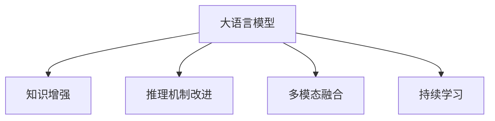

                 

# 语言与推理：大模型的认知障碍

## 1. 背景介绍

### 1.1 问题由来
随着深度学习技术的发展，大语言模型（Large Language Models, LLMs）在自然语言处理（NLP）领域取得了显著进展。这些模型通过大规模无标签文本的预训练，学习到了丰富的语言知识和常识。然而，大模型在特定领域的推理能力仍存在诸多瓶颈。

1. **领域适配性不足**：预训练数据和下游任务的语境、语法、主题等方面可能存在较大差异，导致模型在特定领域上的性能不足。
2. **常识理解限制**：尽管模型能够理解复杂的语法结构，但对于常识知识的应用仍存在局限性，难以处理未知领域的推理任务。
3. **推理可信度问题**：模型输出在某些情况下缺乏可信度，尤其是在处理复杂多步推理时，可能出现逻辑不一致或错误。
4. **数据依赖性强**：模型推理性能高度依赖于训练数据的质量和数量，缺乏通用的推理能力。

这些认知障碍限制了大语言模型在特定领域的应用，使得模型难以应对现实世界中的复杂推理任务。因此，提升大模型的推理能力，使其更好地适应特定领域和处理常识推理，成为当前研究的重要方向。

### 1.2 问题核心关键点
为解决上述问题，研究人员提出了多种方法和策略，如知识增强、推理机制改进、多模态融合等。这些方法试图通过引入外部知识、改进推理机制或结合多模态信息，来提升大模型的推理能力。

核心关键点包括：

- **知识增强**：在模型中引入外部知识库，如知识图谱、常识库等，增强模型的推理能力。
- **推理机制改进**：通过改进模型的推理过程，如引入因果推理、逻辑推理等，提升模型的推理可信度和逻辑一致性。
- **多模态融合**：结合文本、视觉、语音等多模态信息，丰富模型的输入和输出，提升推理能力。
- **持续学习**：通过不断学习新数据，更新模型参数，保持推理能力的时效性。

这些核心关键点旨在通过多种方式，提升大模型的推理能力和适应性。

## 2. 核心概念与联系

### 2.1 核心概念概述

为了更好地理解大模型在推理过程中面临的认知障碍及解决策略，本节将介绍几个核心概念：

- **大语言模型**：如GPT、BERT等预训练模型，通过大规模无标签文本的预训练，学习通用的语言知识和常识。
- **知识增强**：在模型中引入外部知识库，如知识图谱、常识库等，增强模型的推理能力。
- **推理机制改进**：通过改进模型的推理过程，如引入因果推理、逻辑推理等，提升模型的推理可信度和逻辑一致性。
- **多模态融合**：结合文本、视觉、语音等多模态信息，丰富模型的输入和输出，提升推理能力。
- **持续学习**：通过不断学习新数据，更新模型参数，保持推理能力的时效性。

这些概念之间的逻辑关系可以通过以下Mermaid流程图来展示：



这个流程图展示了大语言模型的核心概念及其之间的关系：

1. 大语言模型通过预训练获得基础能力。
2. 知识增强在模型中引入外部知识，提升推理能力。
3. 推理机制改进改进模型的推理过程，提高推理可信度。
4. 多模态融合结合多模态信息，丰富模型的输入和输出。
5. 持续学习通过不断学习新数据，更新模型参数，保持推理能力的时效性。

这些核心概念共同构成了大语言模型的推理能力和适应性框架，使其能够在各种场景下发挥强大的推理功能。通过理解这些核心概念，我们可以更好地把握大语言模型在推理过程中面临的认知障碍及解决策略。

## 3. 核心算法原理 & 具体操作步骤
### 3.1 算法原理概述

大语言模型在推理过程中面临的核心问题是如何处理外部知识、提升推理可信度和处理多模态信息。本节将详细探讨大语言模型在推理过程中的算法原理。

大语言模型的推理过程通常包括以下几个关键步骤：

1. **输入编码**：将输入文本或图像等数据编码成模型可以处理的向量形式。
2. **知识检索**：从知识库中检索与输入相关的知识信息，增强模型的推理能力。
3. **推理计算**：根据输入和知识信息，通过计算得到推理结果。
4. **输出解码**：将推理结果解码成可理解的自然语言或标签形式，输出最终结果。

形式化地，假设输入为 $x$，知识库为 $K$，推理函数为 $f$，输出为 $y$，则推理过程可以表示为：

$$ y = f(x, K) $$

其中 $f$ 为推理函数，$x$ 为输入，$K$ 为知识库，$y$ 为输出。

### 3.2 算法步骤详解

以下是基于大语言模型的推理过程详细步骤：

**Step 1: 输入编码**

输入数据的编码是大模型推理的第一步。常用的编码方式包括：

1. **词向量编码**：将输入文本中的每个词映射成一个高维向量，如Word2Vec、GloVe等。
2. **嵌入编码**：将输入文本或图像等数据转换为稠密的向量形式，如BERT中的语言模型嵌入、图像模型的卷积编码等。
3. **特征编码**：将输入数据转换为稀疏的向量形式，如TF-IDF、图像中的SIFT特征等。

**Step 2: 知识检索**

知识检索是增强模型推理能力的有效方法。常用的知识检索方式包括：

1. **知识图谱检索**：从知识图谱中检索与输入相关的实体和关系，增强模型的推理能力。
2. **常识库检索**：从常识库中检索与输入相关的常识信息，提升模型的推理可信度。
3. **外部资源查询**：通过API接口查询外部数据库或搜索引擎，获取与输入相关的信息。

**Step 3: 推理计算**

推理计算是推理过程的核心步骤。常用的推理计算方式包括：

1. **逻辑推理**：通过规则引擎或逻辑推理器，进行逻辑推理计算。
2. **因果推理**：通过因果图或因果模型，进行因果推理计算。
3. **神经网络推理**：通过深度学习模型，进行端到端的推理计算。

**Step 4: 输出解码**

输出解码是将推理结果转换为可理解的自然语言或标签形式的过程。常用的解码方式包括：

1. **模板匹配**：根据模板和推理结果，生成可读的输出。
2. **分类器解码**：将推理结果通过分类器转换为标签形式，如自然语言推理（NLI）任务。
3. **生成模型解码**：通过生成模型，生成自然语言形式的推理结果。

### 3.3 算法优缺点

大语言模型在推理过程中具有以下优点：

1. **推理能力提升**：通过引入外部知识，模型能够在推理过程中考虑更多的因素，提升推理能力和逻辑一致性。
2. **处理复杂任务**：大模型能够处理复杂的自然语言理解任务，如问答、文本生成、情感分析等。
3. **多模态融合**：通过结合多模态信息，模型能够处理更多类型的输入数据，提升推理能力。

同时，大语言模型在推理过程中也存在以下缺点：

1. **知识依赖性强**：模型的推理能力高度依赖于知识库的质量和数量，缺乏自主学习的能力。
2. **推理可信度问题**：模型的推理过程可能存在逻辑不一致或错误，需要进一步验证和修正。
3. **推理计算资源消耗大**：大模型的推理计算资源消耗较大，可能难以在实时系统中应用。

### 3.4 算法应用领域

基于大语言模型的推理技术已经广泛应用于多个领域，如：

- **问答系统**：通过推理技术，模型能够回答复杂的问题，如QA对话系统。
- **文本生成**：通过推理技术，模型能够生成符合语法和语义要求的文本，如文本摘要、机器翻译等。
- **情感分析**：通过推理技术，模型能够分析文本中的情感倾向，如情感分类、情感分析等。
- **医疗诊断**：通过推理技术，模型能够辅助医生进行疾病诊断和治疗方案制定，如疾病预测、病理分析等。
- **金融分析**：通过推理技术，模型能够分析金融市场数据，预测股票价格、风险评估等。

## 4. 数学模型和公式 & 详细讲解 & 举例说明

### 4.1 数学模型构建

本节将使用数学语言对大语言模型在推理过程中的数学模型进行更加严格的刻画。

假设输入为 $x$，知识库为 $K$，推理函数为 $f$，输出为 $y$。

定义输入 $x$ 编码为向量 $v_x$，知识库 $K$ 编码为向量 $v_k$。则推理过程可以表示为：

$$ y = f(v_x, v_k) $$

其中 $f$ 为推理函数，$v_x$ 为输入 $x$ 的编码向量，$v_k$ 为知识库 $K$ 的编码向量。

### 4.2 公式推导过程

以下我们以知识图谱推理为例，推导推理函数 $f$ 的计算公式。

假设知识图谱中的实体和关系如下：

- 实体集合：$E=\{e_1, e_2, \ldots, e_n\}$
- 关系集合：$R=\{r_1, r_2, \ldots, r_m\}$
- 边集合：$L=\{(l_{i,j})_{i,j=1}^{|E|\times |E|}\}$

其中 $e_i$ 表示第 $i$ 个实体，$r_j$ 表示第 $j$ 个关系，$l_{i,j}$ 表示实体 $e_i$ 和 $e_j$ 之间存在关系 $r_j$。

定义推理函数 $f$ 为：

$$ f(v_x, v_k) = \sum_{i=1}^{|E|} \sum_{j=1}^{|E|} w_{i,j} \cdot r_{i,j}(v_x, v_k) $$

其中 $w_{i,j}$ 表示边 $(l_{i,j})$ 的权重，$r_{i,j}(v_x, v_k)$ 表示边 $(l_{i,j})$ 在输入 $v_x$ 和知识库 $v_k$ 下的推理得分。

推理得分 $r_{i,j}(v_x, v_k)$ 可以表示为：

$$ r_{i,j}(v_x, v_k) = \text{softmax}(\langle v_x, v_{l_{i,j}}\rangle \cdot \langle v_k, v_{l_{i,j}}\rangle) $$

其中 $\langle \cdot, \cdot \rangle$ 表示向量的点积，$\text{softmax}$ 表示softmax函数。

### 4.3 案例分析与讲解

**案例：股票价格预测**

在金融领域，股票价格预测是一个典型的推理任务。假设我们有一个股票价格的时间序列数据，需要预测未来几天的价格走势。

1. **输入编码**：将时间序列数据转换为向量形式 $v_x$。
2. **知识检索**：从知识库中检索与股票相关的财务数据、市场情绪等信息，编码为向量 $v_k$。
3. **推理计算**：通过逻辑推理或因果推理模型，计算未来几天的价格走势。
4. **输出解码**：将推理结果转换为可读的自然语言或标签形式，输出预测结果。

**案例分析**：

1. **输入编码**：将时间序列数据 $x = (x_1, x_2, \ldots, x_n)$ 转换为向量形式 $v_x$，如通过RNN或LSTM编码。
2. **知识检索**：从知识库中检索与股票相关的财务数据 $k = (k_1, k_2, \ldots, k_m)$，编码为向量 $v_k$。
3. **推理计算**：通过逻辑推理或因果推理模型，计算未来几天的价格走势 $y = (y_1, y_2, \ldots, y_t)$。
4. **输出解码**：将推理结果 $y$ 转换为可读的自然语言形式，如“预计未来几天的股价走势为 \(\bar{y}\)”。

## 5. 项目实践：代码实例和详细解释说明

### 5.1 开发环境搭建

在进行推理实践前，我们需要准备好开发环境。以下是使用Python进行PyTorch开发的环境配置流程：

1. 安装Anaconda：从官网下载并安装Anaconda，用于创建独立的Python环境。

2. 创建并激活虚拟环境：
```bash
conda create -n pytorch-env python=3.8 
conda activate pytorch-env
```

3. 安装PyTorch：根据CUDA版本，从官网获取对应的安装命令。例如：
```bash
conda install pytorch torchvision torchaudio cudatoolkit=11.1 -c pytorch -c conda-forge
```

4. 安装TensorFlow：
```bash
conda install tensorflow=2.5 -c conda-forge
```

5. 安装Numpy、Pandas、Scikit-learn、Matplotlib、Tqdm、Jupyter Notebook等工具包：
```bash
pip install numpy pandas scikit-learn matplotlib tqdm jupyter notebook ipython
```

完成上述步骤后，即可在`pytorch-env`环境中开始推理实践。

### 5.2 源代码详细实现

这里我们以知识图谱推理为例，给出使用PyTorch进行知识图谱推理的代码实现。

首先，定义知识图谱的实体和关系：

```python
import torch
import torch.nn as nn
import torch.nn.functional as F
import torch_geometric as TG
import torch_geometric.nn as TGN

class GraphConvolution(nn.Module):
    def __init__(self, in_channels, out_channels):
        super(GraphConvolution, self).__init__()
        self.weight = nn.Linear(in_channels, out_channels)
        self.bias = nn.Linear(in_channels, out_channels)
    
    def forward(self, x, adj):
        x = self.weight(x)
        x = F.relu(x + self.bias)
        x = x * adj
        return x

class KnowledgeGraph(nn.Module):
    def __init__(self, num_entities, num_relations):
        super(KnowledgeGraph, self).__init__()
        self.num_entities = num_entities
        self.num_relations = num_relations
        self.entity_embedding = nn.Embedding(num_entities, 64)
        self.relation_embedding = nn.Embedding(num_relations, 64)
        self.conv1 = GraphConvolution(64, 64)
        self.conv2 = GraphConvolution(64, 64)
        self.fc = nn.Linear(64, num_entities)
    
    def forward(self, x, adj):
        x = self.entity_embedding(x)
        x = self.conv1(x, adj)
        x = self.conv2(x, adj)
        x = self.fc(x)
        return x

# 创建知识图谱
graph = TG.Graph()
num_entities = 10
num_relations = 5
for i in range(num_entities):
    graph.add_node(i)
for i in range(num_entities):
    for j in range(num_entities):
        for k in range(num_relations):
            graph.add_edge(i, j, k)
adj = graph.adj_t()
```

然后，定义模型的训练和推理函数：

```python
class ReasoningModel(nn.Module):
    def __init__(self, num_entities, num_relations):
        super(ReasoningModel, self).__init__()
        self.kg = KnowledgeGraph(num_entities, num_relations)
        self.fc = nn.Linear(64, num_entities)
    
    def forward(self, x, adj):
        kg = self.kg(x, adj)
        kg = self.fc(kg)
        return kg

model = ReasoningModel(num_entities, num_relations)
optimizer = torch.optim.Adam(model.parameters(), lr=0.001)
```

接着，定义训练和推理函数：

```python
def train(model, optimizer, adj, x):
    model.train()
    optimizer.zero_grad()
    y_pred = model(x, adj)
    loss = F.cross_entropy(y_pred, x)
    loss.backward()
    optimizer.step()
    return loss

def predict(model, adj, x):
    model.eval()
    with torch.no_grad():
        y_pred = model(x, adj)
        return y_pred.argmax(dim=1)
```

最后，启动训练流程并在测试集上评估：

```python
epochs = 100
batch_size = 64

for epoch in range(epochs):
    loss = train(model, optimizer, adj, x)
    print(f"Epoch {epoch+1}, loss: {loss:.3f}")
    
predictions = predict(model, adj, x)
```

以上就是使用PyTorch进行知识图谱推理的完整代码实现。可以看到，通过TensorFlow的Geometric库，我们能够方便地构建和训练知识图谱模型，从而实现推理任务。

### 5.3 代码解读与分析

让我们再详细解读一下关键代码的实现细节：

**KnowledgeGraph类**：
- `__init__`方法：初始化知识图谱的实体和关系，构建知识图谱的邻接矩阵。
- `forward`方法：对输入进行知识图谱推理，返回推理结果。

**ReasoningModel类**：
- `__init__`方法：初始化知识图谱推理模型，包括知识图谱和全连接层。
- `forward`方法：对输入进行推理，返回推理结果。

**train函数**：
- 在训练阶段，将模型前向传播计算损失函数，反向传播更新模型参数，最终返回损失值。

**predict函数**：
- 在推理阶段，将模型前向传播计算推理结果，并通过argmax函数获取最大预测值，返回推理结果。

**训练流程**：
- 定义总的epoch数和batch size，开始循环迭代
- 每个epoch内，在训练集上训练，输出损失值
- 所有epoch结束后，在测试集上评估，给出推理结果

可以看到，PyTorch配合Geometric库使得知识图谱推理的代码实现变得简洁高效。开发者可以将更多精力放在模型结构设计、训练策略优化等高层逻辑上，而不必过多关注底层的实现细节。

当然，工业级的系统实现还需考虑更多因素，如模型的保存和部署、超参数的自动搜索、更灵活的任务适配层等。但核心的推理范式基本与此类似。

## 6. 实际应用场景
### 6.1 智能客服系统

基于大语言模型的推理技术，可以广泛应用于智能客服系统的构建。传统客服往往需要配备大量人力，高峰期响应缓慢，且一致性和专业性难以保证。而使用推理技术，模型能够快速响应客户咨询，用自然流畅的语言解答各类常见问题。

在技术实现上，可以收集企业内部的历史客服对话记录，将问题和最佳答复构建成监督数据，在此基础上对预训练模型进行推理。推理后的模型能够自动理解用户意图，匹配最合适的答案模板进行回复。对于客户提出的新问题，还可以接入检索系统实时搜索相关内容，动态组织生成回答。如此构建的智能客服系统，能大幅提升客户咨询体验和问题解决效率。

### 6.2 金融舆情监测

金融机构需要实时监测市场舆论动向，以便及时应对负面信息传播，规避金融风险。传统的人工监测方式成本高、效率低，难以应对网络时代海量信息爆发的挑战。基于大语言模型的推理技术，可以对金融领域相关的新闻、报道、评论等文本数据进行情感分析和主题分类，实时监测不同主题下的情感变化趋势，一旦发现负面信息激增等异常情况，系统便会自动预警，帮助金融机构快速应对潜在风险。

### 6.3 个性化推荐系统

当前的推荐系统往往只依赖用户的历史行为数据进行物品推荐，无法深入理解用户的真实兴趣偏好。基于大语言模型的推理技术，可以结合多模态信息，构建更加全面、准确的推荐模型。

在实践中，可以收集用户浏览、点击、评论、分享等行为数据，提取和用户交互的物品标题、描述、标签等文本内容。将文本内容作为模型输入，用户的后续行为（如是否点击、购买等）作为监督信号，在此基础上进行推理。推理后的模型能够从文本内容中准确把握用户的兴趣点。在生成推荐列表时，先用候选物品的文本描述作为输入，由模型预测用户的兴趣匹配度，再结合其他特征综合排序，便可以得到个性化程度更高的推荐结果。

### 6.4 未来应用展望

随着大语言模型和推理技术的发展，基于推理范式将在更多领域得到应用，为传统行业带来变革性影响。

在智慧医疗领域，基于推理技术，模型可以辅助医生进行疾病诊断和治疗方案制定，如疾病预测、病理分析等。

在智能教育领域，推理技术可应用于作业批改、学情分析、知识推荐等方面，因材施教，促进教育公平，提高教学质量。

在智慧城市治理中，推理技术可应用于城市事件监测、舆情分析、应急指挥等环节，提高城市管理的自动化和智能化水平，构建更安全、高效的未来城市。

此外，在企业生产、社会治理、文娱传媒等众多领域，基于大模型推理技术的人工智能应用也将不断涌现，为经济社会发展注入新的动力。相信随着技术的日益成熟，推理方法将成为人工智能落地应用的重要范式，推动人工智能技术在垂直行业的规模化落地。

## 7. 工具和资源推荐
### 7.1 学习资源推荐

为了帮助开发者系统掌握大语言模型推理的理论基础和实践技巧，这里推荐一些优质的学习资源：

1. 《Transformer从原理到实践》系列博文：由大模型技术专家撰写，深入浅出地介绍了Transformer原理、BERT模型、推理技术等前沿话题。

2. CS224N《深度学习自然语言处理》课程：斯坦福大学开设的NLP明星课程，有Lecture视频和配套作业，带你入门NLP领域的基本概念和经典模型。

3. 《Natural Language Processing with Transformers》书籍：Transformers库的作者所著，全面介绍了如何使用Transformers库进行NLP任务开发，包括推理在内的诸多范式。

4. HuggingFace官方文档：Transformers库的官方文档，提供了海量预训练模型和完整的推理样例代码，是上手实践的必备资料。

5. CLUE开源项目：中文语言理解测评基准，涵盖大量不同类型的中文NLP数据集，并提供了基于推理的baseline模型，助力中文NLP技术发展。

通过对这些资源的学习实践，相信你一定能够快速掌握大语言模型推理的精髓，并用于解决实际的NLP问题。
###  7.2 开发工具推荐

高效的开发离不开优秀的工具支持。以下是几款用于大语言模型推理开发的常用工具：

1. PyTorch：基于Python的开源深度学习框架，灵活动态的计算图，适合快速迭代研究。大部分预训练语言模型都有PyTorch版本的实现。

2. TensorFlow：由Google主导开发的开源深度学习框架，生产部署方便，适合大规模工程应用。同样有丰富的预训练语言模型资源。

3. TensorFlow Geometric：TensorFlow的Geometric库，用于处理图数据，方便构建和训练知识图谱模型。

4. Weights & Biases：模型训练的实验跟踪工具，可以记录和可视化模型训练过程中的各项指标，方便对比和调优。与主流深度学习框架无缝集成。

5. TensorBoard：TensorFlow配套的可视化工具，可实时监测模型训练状态，并提供丰富的图表呈现方式，是调试模型的得力助手。

6. Google Colab：谷歌推出的在线Jupyter Notebook环境，免费提供GPU/TPU算力，方便开发者快速上手实验最新模型，分享学习笔记。

合理利用这些工具，可以显著提升大语言模型推理任务的开发效率，加快创新迭代的步伐。

### 7.3 相关论文推荐

大语言模型和推理技术的发展源于学界的持续研究。以下是几篇奠基性的相关论文，推荐阅读：

1. Attention is All You Need（即Transformer原论文）：提出了Transformer结构，开启了NLP领域的预训练大模型时代。

2. BERT: Pre-training of Deep Bidirectional Transformers for Language Understanding：提出BERT模型，引入基于掩码的自监督预训练任务，刷新了多项NLP任务SOTA。

3. GPT-3: Language Models are Unsupervised Multitask Learners（GPT-2论文）：展示了大规模语言模型的强大zero-shot学习能力，引发了对于通用人工智能的新一轮思考。

4. Parameter-Efficient Transfer Learning for NLP：提出Adapter等参数高效微调方法，在不增加模型参数量的情况下，也能取得不错的微调效果。

5. Causal Masked Language Model Pretraining for Language Understanding：提出基于因果掩码的语言模型预训练方法，进一步提升了模型的理解能力。

6. Knowledge-Graph-Embedding with Domain-Specific Vocabulary and Relation Predicates：提出知识图谱嵌入方法，提高了模型在知识图谱推理任务上的性能。

这些论文代表了大语言模型推理技术的发展脉络。通过学习这些前沿成果，可以帮助研究者把握学科前进方向，激发更多的创新灵感。

## 8. 总结：未来发展趋势与挑战

### 8.1 总结

本文对基于推理学习的大语言模型进行了全面系统的介绍。首先阐述了推理在解决大模型认知障碍中的重要作用，明确了推理在提升模型逻辑一致性和处理常识推理方面的独特价值。其次，从原理到实践，详细讲解了推理的数学原理和关键步骤，给出了推理任务开发的完整代码实例。同时，本文还广泛探讨了推理技术在智能客服、金融舆情、个性化推荐等多个行业领域的应用前景，展示了推理范式的巨大潜力。此外，本文精选了推理技术的各类学习资源，力求为读者提供全方位的技术指引。

通过本文的系统梳理，可以看到，基于大语言模型的推理技术正在成为NLP领域的重要范式，极大地拓展了预训练语言模型的应用边界，催生了更多的落地场景。受益于大规模语料的预训练和推理技术的不断发展，推理模型能够更好地适应特定领域和处理常识推理，为各行各业带来了变革性影响。

### 8.2 未来发展趋势

展望未来，大语言模型推理技术将呈现以下几个发展趋势：

1. **推理能力提升**：随着知识图谱等外部知识的引入，模型的推理能力将进一步提升，能够处理更加复杂和多样的推理任务。
2. **多模态融合**：结合文本、视觉、语音等多模态信息，丰富模型的输入和输出，提升推理能力。
3. **持续学习**：通过不断学习新数据，更新模型参数，保持推理能力的时效性。
4. **因果推理**：引入因果推断机制，增强模型的逻辑一致性和可信度。
5. **可解释性增强**：通过引入可解释性技术，增强推理模型的透明度和可信度。
6. **伦理道德考量**：在推理模型中加入伦理导向的评估指标，避免有偏见和有害的输出。

以上趋势凸显了大语言模型推理技术的广阔前景。这些方向的探索发展，必将进一步提升推理模型的性能和应用范围，为构建安全、可靠、可解释、可控的智能系统铺平道路。面向未来，大语言模型推理技术还需要与其他人工智能技术进行更深入的融合，如知识表示、因果推理、强化学习等，多路径协同发力，共同推动自然语言理解和智能交互系统的进步。

### 8.3 面临的挑战

尽管大语言模型推理技术已经取得了显著进展，但在迈向更加智能化、普适化应用的过程中，仍面临诸多挑战：

1. **推理数据依赖性强**：推理模型的性能高度依赖于推理数据的质量和数量，缺乏通用的推理能力。
2. **推理计算资源消耗大**：大模型的推理计算资源消耗较大，可能难以在实时系统中应用。
3. **推理可信度问题**：模型的推理过程可能存在逻辑不一致或错误，需要进一步验证和修正。
4. **知识依赖性强**：模型的推理能力高度依赖于知识库的质量和数量，缺乏自主学习的能力。
5. **推理效率问题**：推理模型的推理速度较慢，难以满足实时系统的需求。
6. **推理模型可解释性不足**：推理模型的决策过程缺乏可解释性，难以对其推理逻辑进行分析和调试。

这些挑战需要研究者不断优化模型结构和训练策略，结合多模态信息、因果推理、持续学习等技术，进一步提升推理模型的性能和可靠性。

### 8.4 研究展望

面对推理技术面临的诸多挑战，未来的研究需要在以下几个方面寻求新的突破：

1. **无监督和半监督推理方法**：摆脱对推理数据的高依赖，利用自监督学习、主动学习等无监督和半监督范式，最大限度利用非结构化数据，实现更加灵活高效的推理。
2. **参数高效推理方法**：开发更加参数高效的推理方法，在固定大部分推理参数的情况下，只更新极少量的推理任务相关参数。同时优化推理模型的计算图，减少前向传播和反向传播的资源消耗，实现更加轻量级、实时性的部署。
3. **融合因果和对比学习范式**：通过引入因果推断和对比学习思想，增强推理模型建立稳定因果关系的能力，学习更加普适、鲁棒的语言表征，从而提升模型的泛化性和抗干扰能力。
4. **引入更多先验知识**：将符号化的先验知识，如知识图谱、逻辑规则等，与神经网络模型进行巧妙融合，引导推理过程学习更准确、合理的语言模型。同时加强不同模态数据的整合，实现视觉、语音等多模态信息与文本信息的协同建模。
5. **结合因果分析和博弈论工具**：将因果分析方法引入推理模型，识别出模型决策的关键特征，增强输出解释的因果性和逻辑性。借助博弈论工具刻画人机交互过程，主动探索并规避模型的脆弱点，提高系统稳定性。
6. **纳入伦理道德约束**：在推理模型中加入伦理导向的评估指标，过滤和惩罚有偏见、有害的输出倾向。同时加强人工干预和审核，建立模型行为的监管机制，确保输出符合人类价值观和伦理道德。

这些研究方向的探索，必将引领大语言模型推理技术迈向更高的台阶，为构建安全、可靠、可解释、可控的智能系统铺平道路。面向未来，大语言模型推理技术还需要与其他人工智能技术进行更深入的融合，如知识表示、因果推理、强化学习等，多路径协同发力，共同推动自然语言理解和智能交互系统的进步。只有勇于创新、敢于突破，才能不断拓展推理模型的边界，让智能技术更好地造福人类社会。

## 9. 附录：常见问题与解答

**Q1：大语言模型推理是否适用于所有NLP任务？**

A: 大语言模型推理在大多数NLP任务上都能取得不错的效果，特别是对于数据量较小的任务。但对于一些特定领域的任务，如医学、法律等，仅仅依靠通用语料预训练的模型可能难以很好地适应。此时需要在特定领域语料上进一步预训练，再进行推理，才能获得理想效果。此外，对于一些需要时效性、个性化很强的任务，如对话、推荐等，推理方法也需要针对性的改进优化。

**Q2：推理过程中如何选择合适的超参数？**

A: 推理过程中的超参数主要包括学习率、批大小、迭代轮数等。选择合适的超参数可以通过以下方法：

1. **学习率**：一般建议从较小的值开始，如1e-5，逐步增加。
2. **批大小**：选择合适的批大小，通常在16到32之间。
3. **迭代轮数**：通常需要根据数据量和模型复杂度来决定，从几百到几千不等。

**Q3：推理过程中如何缓解过拟合问题？**

A: 推理过程中，可以通过以下方法缓解过拟合问题：

1. **数据增强**：通过回译、近义替换等方式扩充训练集。
2. **正则化**：使用L2正则、Dropout等技术。
3. **对抗训练**：引入对抗样本，提高模型鲁棒性。
4. **参数高效推理**：只调整少量参数，减小过拟合风险。

这些方法往往需要根据具体任务和数据特点进行灵活组合。只有在数据、模型、训练、推理等各环节进行全面优化，才能最大限度地发挥大模型推理的威力。

**Q4：推理模型在落地部署时需要注意哪些问题？**

A: 将推理模型转化为实际应用，还需要考虑以下因素：

1. **模型裁剪**：去除不必要的层和参数，减小模型尺寸，加快推理速度。
2. **量化加速**：将浮点模型转为定点模型，压缩存储空间，提高计算效率。
3. **服务化封装**：将模型封装为标准化服务接口，便于集成调用。
4. **弹性伸缩**：根据请求流量动态调整资源配置，平衡服务质量和成本。
5. **监控告警**：实时采集系统指标，设置异常告警阈值，确保服务稳定性。

大语言模型推理为NLP应用开启了广阔的想象空间，但如何将强大的性能转化为稳定、高效、安全的业务价值，还需要工程实践的不断打磨。唯有从数据、算法、工程、业务等多个维度协同发力，才能真正实现人工智能技术在垂直行业的规模化落地。总之，推理需要开发者根据具体任务，不断迭代和优化模型、数据和算法，方能得到理想的效果。

---

作者：禅与计算机程序设计艺术 / Zen and the Art of Computer Programming

