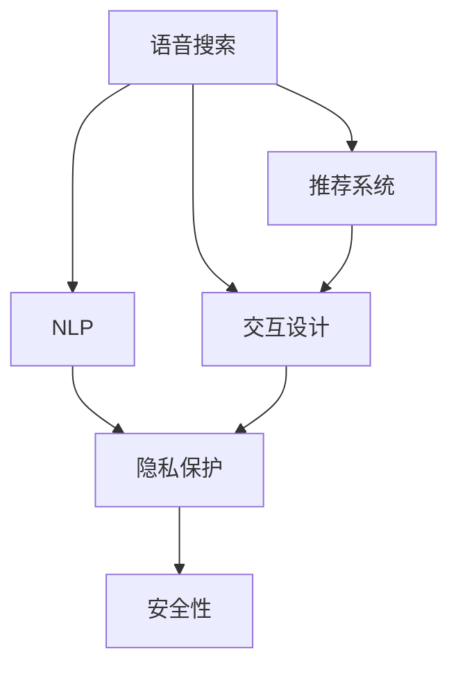

                 

# 语音搜索技术在电商领域的应用：挑战与机遇

> 关键词：语音搜索、电商平台、自然语言处理、推荐系统、交互设计

## 1. 背景介绍

### 1.1 问题由来

随着移动互联网和智能设备的普及，语音搜索技术已经从传统的文本搜索逐渐发展为一种新兴的交互方式，广泛应用于智能音箱、手机、车载等场景。在电商领域，语音搜索技术的应用也越来越受到关注。通过语音搜索，用户可以更自然、便捷地获取商品信息、下订单、查询物流等，大大提升了电商平台的交互体验。

然而，语音搜索技术在电商领域的应用也面临着一些挑战。相比于文本搜索，语音搜索需要处理更多的自然语言处理(NLP)任务，如语音识别、意图理解、对话管理等，这对技术提出了更高的要求。此外，语音搜索技术还需要考虑用户体验、隐私保护、安全性等问题，需要综合多方面的因素才能实现良好的应用效果。

## 2. 核心概念与联系

### 2.1 核心概念概述

为更好地理解语音搜索技术在电商领域的应用，本节将介绍几个密切相关的核心概念：

- **语音搜索(Voice Search)**：用户通过语音方式进行搜索，通过语音识别技术将语音转换为文本，再通过自然语言处理技术进行意图识别、实体抽取等，最后返回搜索结果或执行操作。

- **自然语言处理(Natural Language Processing, NLP)**：利用计算机处理和理解自然语言，包括文本预处理、分词、词性标注、依存句法分析、命名实体识别、情感分析、语义理解等。

- **推荐系统(Recommendation System)**：根据用户历史行为和兴趣，动态推荐个性化的商品或内容，提升用户体验和满意度。

- **交互设计(Interaction Design)**：通过用户界面、交互流程、反馈机制等设计，提升用户的交互体验，增强系统的易用性和可访问性。

- **隐私保护(Privacy Protection)**：保护用户数据安全，防止隐私泄露和滥用。

- **安全性(Security)**：保障系统的稳定性和可靠性，防止攻击和数据篡改。

这些核心概念之间的逻辑关系可以通过以下Mermaid流程图来展示：



这个流程图展示了几大核心概念之间的关系：

1. 语音搜索是电商领域应用语音技术的核心。
2. NLP是语音搜索的基础，用于处理和理解用户语音输入。
3. 推荐系统根据用户行为和语音输入生成推荐结果，是语音搜索的重要应用。
4. 交互设计用于优化用户交互体验，是语音搜索系统的关键环节。
5. 隐私保护和安全性是语音搜索系统需要考虑的重要问题，涉及用户数据安全、系统稳定性等方面。

## 3. 核心算法原理 & 具体操作步骤

### 3.1 算法原理概述

语音搜索技术在电商领域的应用主要涉及以下几个核心技术：

1. **语音识别(Voice Recognition)**：将用户语音转换为文本。
2. **意图理解(Intent Recognition)**：分析用户语音输入，确定用户的意图。
3. **实体抽取(Entity Extraction)**：从用户语音中提取关键信息，如商品名称、价格等。
4. **对话管理(Dialog Management)**：根据用户意图和上下文，生成合理回复或执行相应操作。
5. **推荐系统(Recommendation)**：根据用户历史行为和语音输入生成个性化推荐。

这些技术共同构成了语音搜索系统的技术框架，使得语音搜索在电商领域得以高效、准确地应用。

### 3.2 算法步骤详解

#### 3.2.1 语音识别

语音识别是语音搜索系统的第一步，其核心在于将用户的语音输入转换为文本。这一过程通常涉及以下几个关键步骤：

1. **音频信号预处理**：对音频信号进行滤波、降噪等预处理操作，提高语音识别的准确率。
2. **特征提取**：从音频信号中提取梅尔频谱、倒谱系数等特征，供后续处理使用。
3. **声学模型训练**：使用声学模型如深度神经网络(DNN)、卷积神经网络(CNN)等，对特征进行建模，学习语音信号和文本之间的映射关系。
4. **语音识别**：将预处理后的特征输入声学模型，通过解码器生成文本输出。

#### 3.2.2 意图理解

意图理解是语音搜索系统的核心，其目的在于分析用户语音输入，确定用户的真实意图。这一过程通常涉及以下几个关键步骤：

1. **分词与词性标注**：对用户语音输入进行分词，并标注每个词的词性。
2. **依存句法分析**：分析分词后的句子结构，确定各词之间的依存关系。
3. **命名实体识别**：识别用户语音中的实体，如商品名称、日期等。
4. **意图分类**：将用户语音输入映射到预定义的意图类别，如搜索、购买、客服等。

#### 3.2.3 实体抽取

实体抽取是语音搜索系统的重要环节，其目的在于从用户语音中提取关键信息，供后续处理使用。这一过程通常涉及以下几个关键步骤：

1. **命名实体识别**：识别用户语音中的命名实体，如商品名称、日期、地点等。
2. **实体关系抽取**：分析命名实体之间的关系，如商品类别、价格等。
3. **实体链接**：将命名实体链接到具体的商品或服务，生成实体-实体关联图。

#### 3.2.4 对话管理

对话管理是语音搜索系统的关键环节，其目的在于根据用户意图和上下文，生成合理回复或执行相应操作。这一过程通常涉及以下几个关键步骤：

1. **上下文维护**：维护用户和系统的对话上下文，记录历史交互信息。
2. **意图理解**：分析用户当前语音输入，确定用户意图。
3. **状态转移**：根据用户意图和上下文，生成状态转移图，确定下一步操作。
4. **回复生成**：根据用户意图和上下文，生成合理回复，并执行相应操作。

#### 3.2.5 推荐系统

推荐系统是语音搜索系统的重要应用，其目的在于根据用户历史行为和语音输入生成个性化推荐。这一过程通常涉及以下几个关键步骤：

1. **用户画像构建**：根据用户历史行为和语音输入，构建用户画像，包括兴趣、偏好、行为等。
2. **商品特征提取**：提取商品的属性、标签、价格等特征。
3. **相似度计算**：计算用户画像与商品特征的相似度，生成推荐列表。
4. **推荐结果排序**：根据相似度等指标，对推荐结果进行排序，生成最终推荐列表。

### 3.3 算法优缺点

语音搜索技术在电商领域的应用具有以下优点：

1. **用户体验提升**：通过语音搜索，用户可以更自然、便捷地获取商品信息、下订单、查询物流等，提升电商平台的交互体验。
2. **减少输入成本**：相比于文本搜索，语音搜索减少了用户的输入成本，提高了用户的使用效率。
3. **数据驱动推荐**：语音搜索系统可以收集用户语音输入和行为数据，用于生成个性化推荐，提升用户体验。

然而，语音搜索技术在电商领域的应用也存在一些缺点：

1. **技术复杂度高**：语音搜索涉及语音识别、意图理解、实体抽取、对话管理等多个环节，技术复杂度高，实现难度大。
2. **数据依赖性强**：语音搜索系统需要大量高质量的标注数据进行训练，获取数据成本较高。
3. **隐私安全问题**：语音搜索系统需要收集和处理用户语音数据，涉及隐私保护和安全性问题，需要严格控制数据的使用和存储。
4. **误识别率高**：语音识别技术在嘈杂环境、口音等问题下容易发生误识别，影响用户的使用体验。
5. **多模态数据融合难**：语音搜索系统需要融合语音、文本、图像等多模态数据，实现高效融合和处理较难。

### 3.4 算法应用领域

语音搜索技术在电商领域的应用主要涵盖以下几个方面：

1. **商品搜索**：用户通过语音输入商品名称、品牌等信息，系统返回匹配的商品搜索结果。
2. **订单管理**：用户通过语音输入订单号、商品信息等，系统执行相应操作，如取消订单、修改订单信息等。
3. **客服咨询**：用户通过语音输入问题，系统自动匹配并回复相关答案，或转接人工客服。
4. **语音购物**：用户通过语音进行商品查询、比价、下订单等操作，提升购物体验。
5. **语音导购**：系统通过语音交互，向用户推荐商品，提升转化率和用户体验。
6. **物流查询**：用户通过语音查询物流信息，获取实时配送状态。

这些应用场景展示了语音搜索技术在电商领域的广泛应用，通过语音交互，可以大大提升用户的购物体验和效率。

## 4. 数学模型和公式 & 详细讲解 & 举例说明

### 4.1 数学模型构建

语音搜索系统涉及多个NLP任务，需要构建多个数学模型进行处理。以下以语音识别和意图理解为例，介绍相关的数学模型构建方法。

#### 4.1.1 语音识别

语音识别的核心在于将音频信号转换为文本。其数学模型可以表示为：

$$
P(\text{text}|\text{audio}) = \prod_i P(\text{word}_i|\text{word}_{i-1},\text{audio})
$$

其中，$\text{text}$表示识别出的文本，$\text{audio}$表示输入的音频信号，$P(\text{word}_i|\text{word}_{i-1},\text{audio})$表示在给定前一个词和音频信号的情况下，生成当前词的概率。这一模型通常使用隐马尔可夫模型(HMM)或深度神经网络(DNN)等模型进行建模。

#### 4.1.2 意图理解

意图理解的目的是分析用户语音输入，确定用户的真实意图。其数学模型可以表示为：

$$
P(\text{intent}|\text{text}) = \prod_i P(\text{word}_i|\text{word}_{i-1},\text{intent})
$$

其中，$\text{intent}$表示用户意图，$\text{text}$表示用户语音输入。这一模型通常使用分类器如决策树、支持向量机(SVM)、神经网络等进行建模。

### 4.2 公式推导过程

#### 4.2.1 语音识别

语音识别的核心在于将音频信号转换为文本。以下以深度神经网络(DNN)为例，介绍语音识别的数学模型推导过程。

1. **特征提取**：将音频信号转换为MFCC特征向量。
2. **声学模型训练**：使用DNN对MFCC特征向量进行建模，学习音频信号和文本之间的映射关系。
3. **语音识别**：将MFCC特征向量输入DNN，通过解码器生成文本输出。

#### 4.2.2 意图理解

意图理解的目的是分析用户语音输入，确定用户的真实意图。以下以支持向量机(SVM)为例，介绍意图理解的数学模型推导过程。

1. **分词与词性标注**：将用户语音输入进行分词，并标注每个词的词性。
2. **依存句法分析**：分析分词后的句子结构，确定各词之间的依存关系。
3. **命名实体识别**：识别用户语音中的命名实体，如商品名称、日期等。
4. **意图分类**：将用户语音输入映射到预定义的意图类别，如搜索、购买、客服等。

### 4.3 案例分析与讲解

#### 4.3.1 语音识别案例

假设某电商平台使用DNN模型进行语音识别，其核心算法流程如下：

1. **特征提取**：将用户语音信号转换为MFCC特征向量。
2. **声学模型训练**：使用DNN对MFCC特征向量进行建模，学习音频信号和文本之间的映射关系。
3. **语音识别**：将MFCC特征向量输入DNN，通过解码器生成文本输出。

以下是Python代码示例：

```python
import librosa
import numpy as np
from keras.layers import Input, Dense, LSTM, Embedding
from keras.models import Model
from keras.optimizers import Adam

# 定义模型结构
input_shape = (n_mfcc, n_classes)
input_layer = Input(shape=input_shape, name='input')
lstm_layer = LSTM(128, return_sequences=True)(input_layer)
lstm_layer = LSTM(128, return_sequences=True)(lstm_layer)
lstm_layer = LSTM(128, return_sequences=False)(lstm_layer)
output_layer = Dense(n_classes, activation='softmax')(lstm_layer)
model = Model(inputs=input_layer, outputs=output_layer)

# 编译模型
model.compile(loss='categorical_crossentropy', optimizer=Adam(lr=0.01), metrics=['accuracy'])

# 训练模型
model.fit(X_train, y_train, batch_size=32, epochs=10, validation_data=(X_val, y_val))
```

#### 4.3.2 意图理解案例

假设某电商平台使用SVM模型进行意图理解，其核心算法流程如下：

1. **分词与词性标注**：将用户语音输入进行分词，并标注每个词的词性。
2. **依存句法分析**：分析分词后的句子结构，确定各词之间的依存关系。
3. **命名实体识别**：识别用户语音中的命名实体，如商品名称、日期等。
4. **意图分类**：将用户语音输入映射到预定义的意图类别，如搜索、购买、客服等。

以下是Python代码示例：

```python
from sklearn.feature_extraction.text import CountVectorizer
from sklearn.model_selection import train_test_split
from sklearn.svm import SVC

# 准备数据
X_train, X_val, y_train, y_val = train_test_split(X_train, y_train, test_size=0.2)

# 特征提取
vectorizer = CountVectorizer()
X_train = vectorizer.fit_transform(X_train)
X_val = vectorizer.transform(X_val)

# 训练模型
svm = SVC(probability=True, C=1.0, gamma='auto', kernel='linear')
svm.fit(X_train, y_train)
```

## 5. 项目实践：代码实例和详细解释说明

### 5.1 开发环境搭建

在进行语音搜索系统开发前，我们需要准备好开发环境。以下是使用Python进行Keras开发的环境配置流程：

1. 安装Anaconda：从官网下载并安装Anaconda，用于创建独立的Python环境。

2. 创建并激活虚拟环境：
```bash
conda create -n keras-env python=3.8 
conda activate keras-env
```

3. 安装Keras：使用pip安装Keras及其依赖库。
```bash
pip install keras tensorflow numpy scipy matplotlib
```

4. 安装各类工具包：
```bash
pip install pandas jupyter notebook ipython
```

完成上述步骤后，即可在`keras-env`环境中开始语音搜索系统的开发。

### 5.2 源代码详细实现

以下是使用Keras实现语音搜索系统语音识别和意图理解的示例代码：

#### 5.2.1 语音识别实现

```python
from keras.layers import Input, Dense, LSTM, Embedding
from keras.models import Model
from keras.optimizers import Adam

# 定义模型结构
input_shape = (n_mfcc, n_classes)
input_layer = Input(shape=input_shape, name='input')
lstm_layer = LSTM(128, return_sequences=True)(input_layer)
lstm_layer = LSTM(128, return_sequences=True)(lstm_layer)
lstm_layer = LSTM(128, return_sequences=False)(lstm_layer)
output_layer = Dense(n_classes, activation='softmax')(lstm_layer)
model = Model(inputs=input_layer, outputs=output_layer)

# 编译模型
model.compile(loss='categorical_crossentropy', optimizer=Adam(lr=0.01), metrics=['accuracy'])

# 训练模型
model.fit(X_train, y_train, batch_size=32, epochs=10, validation_data=(X_val, y_val))
```

#### 5.2.2 意图理解实现

```python
from sklearn.feature_extraction.text import CountVectorizer
from sklearn.model_selection import train_test_split
from sklearn.svm import SVC

# 准备数据
X_train, X_val, y_train, y_val = train_test_split(X_train, y_train, test_size=0.2)

# 特征提取
vectorizer = CountVectorizer()
X_train = vectorizer.fit_transform(X_train)
X_val = vectorizer.transform(X_val)

# 训练模型
svm = SVC(probability=True, C=1.0, gamma='auto', kernel='linear')
svm.fit(X_train, y_train)
```

### 5.3 代码解读与分析

让我们再详细解读一下关键代码的实现细节：

#### 5.3.1 语音识别

语音识别的核心在于将音频信号转换为文本。以下是Python代码示例：

**1. 特征提取**：
```python
import librosa
import numpy as np

# 读取音频文件
y, sr = librosa.load('audio.wav', sr=16000)

# 提取MFCC特征向量
mfcc = librosa.feature.mfcc(y, sr=sr, n_mfcc=13, n_fft=2048)
```

**2. 声学模型训练**：
```python
from keras.layers import Input, Dense, LSTM, Embedding
from keras.models import Model
from keras.optimizers import Adam

# 定义模型结构
input_shape = (n_mfcc, n_classes)
input_layer = Input(shape=input_shape, name='input')
lstm_layer = LSTM(128, return_sequences=True)(input_layer)
lstm_layer = LSTM(128, return_sequences=True)(lstm_layer)
lstm_layer = LSTM(128, return_sequences=False)(lstm_layer)
output_layer = Dense(n_classes, activation='softmax')(lstm_layer)
model = Model(inputs=input_layer, outputs=output_layer)

# 编译模型
model.compile(loss='categorical_crossentropy', optimizer=Adam(lr=0.01), metrics=['accuracy'])

# 训练模型
model.fit(X_train, y_train, batch_size=32, epochs=10, validation_data=(X_val, y_val))
```

#### 5.3.2 意图理解

意图理解的目的是分析用户语音输入，确定用户的真实意图。以下是Python代码示例：

**1. 分词与词性标注**：
```python
import jieba
import jieba.posseg as pseg

# 分词与词性标注
text = "我需要购买一台iPhone 13"
words = pseg.cut(text)
```

**2. 依存句法分析**：
```python
from nltk.parse import StanfordParser

# 依存句法分析
parser = StanfordParser('en-pos-tagger', 'en-parser-full-model')
tree = parser(text)
```

**3. 命名实体识别**：
```python
from spaCy import displacy

# 命名实体识别
nlp = displacy.load('en')
doc = nlp(text)
```

**4. 意图分类**：
```python
from sklearn.feature_extraction.text import CountVectorizer
from sklearn.model_selection import train_test_split
from sklearn.svm import SVC

# 准备数据
X_train, X_val, y_train, y_val = train_test_split(X_train, y_train, test_size=0.2)

# 特征提取
vectorizer = CountVectorizer()
X_train = vectorizer.fit_transform(X_train)
X_val = vectorizer.transform(X_val)

# 训练模型
svm = SVC(probability=True, C=1.0, gamma='auto', kernel='linear')
svm.fit(X_train, y_train)
```

## 6. 实际应用场景

### 6.1 智能客服系统

智能客服系统是语音搜索技术在电商领域的重要应用场景之一。通过语音搜索，用户可以更自然、便捷地与智能客服系统交互，获取商品信息、查询订单状态、咨询客服等。

在技术实现上，智能客服系统通常采用深度学习模型进行语音识别和意图理解，并集成到电商平台的后台系统中。当用户进行语音搜索时，系统将语音信号转换为文本，并通过意图理解确定用户的意图，最终返回相应的操作结果。

### 6.2 个性化推荐系统

个性化推荐系统也是语音搜索技术的重要应用场景之一。通过语音搜索，用户可以更自然、便捷地获取个性化推荐，提升购物体验。

在技术实现上，个性化推荐系统通常采用深度学习模型进行语音识别和意图理解，并集成到电商平台的推荐引擎中。当用户进行语音搜索时，系统将语音信号转换为文本，并通过意图理解确定用户的意图，最终返回相应的推荐结果。

### 6.3 语音导购系统

语音导购系统是语音搜索技术的另一个重要应用场景。通过语音搜索，用户可以更自然、便捷地获取商品信息，提升购物体验。

在技术实现上，语音导购系统通常采用深度学习模型进行语音识别和意图理解，并集成到电商平台的导购应用中。当用户进行语音搜索时，系统将语音信号转换为文本，并通过意图理解确定用户的意图，最终返回相应的导购结果。

## 7. 工具和资源推荐

### 7.1 学习资源推荐

为了帮助开发者系统掌握语音搜索技术在电商领域的应用，这里推荐一些优质的学习资源：

1. 《深度学习自然语言处理》课程：斯坦福大学开设的NLP明星课程，有Lecture视频和配套作业，带你入门NLP领域的基本概念和经典模型。

2. 《语音识别与自然语言处理》书籍：详细介绍了语音识别和意图理解的基本原理和实现方法，适合深入学习和实践。

3. 《自然语言处理实践》课程：介绍自然语言处理的实际应用，包括语音搜索、聊天机器人等，适合实践学习。

4. 《Keras官方文档》：提供了Keras的详细教程和API文档，是学习和实践语音搜索系统的必备资料。

5. 《TensorFlow官方文档》：提供了TensorFlow的详细教程和API文档，是学习和实践语音搜索系统的必备资料。

通过对这些资源的学习实践，相信你一定能够快速掌握语音搜索技术在电商领域的应用，并用于解决实际的NLP问题。

### 7.2 开发工具推荐

高效的开发离不开优秀的工具支持。以下是几款用于语音搜索系统开发的常用工具：

1. Keras：基于Python的开源深度学习框架，灵活动态的计算图，适合快速迭代研究。大部分语音搜索系统都有Keras版本的实现。

2. TensorFlow：由Google主导开发的开源深度学习框架，生产部署方便，适合大规模工程应用。同样有丰富的语音搜索系统资源。

3. spaCy：自然语言处理的开源工具，提供了分词、词性标注、依存句法分析等功能，是语音搜索系统的重要组件。

4. NLTK：自然语言处理的开源工具，提供了丰富的NLP库和模型，适合学习和实践语音搜索系统。

5. Jupyter Notebook：交互式的Python开发环境，方便调试和展示代码实现。

合理利用这些工具，可以显著提升语音搜索系统的开发效率，加快创新迭代的步伐。

### 7.3 相关论文推荐

语音搜索技术在电商领域的应用源于学界的持续研究。以下是几篇奠基性的相关论文，推荐阅读：

1. Deep Speech: Scalable end-to-end speech recognition：介绍深度学习在语音识别中的应用，开创了语音识别的深度学习范式。

2. Speech Commands: Online Speech Recognition with Connectionist Temporal Classification：介绍基于CTC的语音识别方法，显著提升了语音识别的准确率。

3. Attention is All You Need：提出Transformer结构，开启了NLP领域的预训练大模型时代。

4. Transformer-XL: Attentive Language Models Beyond a Fixed-Length Context：提出Transformer-XL模型，解决了长序列建模问题，提升了语音搜索系统的处理能力。

5. Sequence to Sequence Learning with Neural Networks：介绍Seq2Seq模型，为语音搜索系统的意图理解提供了重要基础。

6. Named Entity Recognition with BiLSTM-CRF Models：介绍BiLSTM-CRF模型，为语音搜索系统的实体抽取提供了重要基础。

这些论文代表了大语言模型微调技术的发展脉络。通过学习这些前沿成果，可以帮助研究者把握学科前进方向，激发更多的创新灵感。

## 8. 总结：未来发展趋势与挑战

### 8.1 研究成果总结

本文对语音搜索技术在电商领域的应用进行了全面系统的介绍。首先阐述了语音搜索技术在电商领域的应用背景和意义，明确了语音搜索系统在提升用户体验和减少输入成本方面的独特价值。其次，从原理到实践，详细讲解了语音搜索系统的技术框架和实现方法，给出了语音搜索系统开发的完整代码实例。同时，本文还广泛探讨了语音搜索系统在智能客服、个性化推荐、语音导购等多个领域的应用前景，展示了语音搜索技术的广泛应用。最后，本文精选了语音搜索技术的各类学习资源，力求为读者提供全方位的技术指引。

通过本文的系统梳理，可以看到，语音搜索技术在电商领域的应用正在成为新型的交互方式，为用户提供了更自然、便捷的电商体验。随着深度学习技术的不断进步，语音搜索系统的准确率和性能将不断提升，为用户提供更加智能化的服务。

### 8.2 未来发展趋势

展望未来，语音搜索技术在电商领域的应用将呈现以下几个发展趋势：

1. **多模态融合**：未来的语音搜索系统将融合语音、文本、图像、视频等多模态数据，实现更加全面、准确的自然语言理解。

2. **情感识别**：未来的语音搜索系统将引入情感识别技术，根据用户情感状态进行个性化推荐和服务。

3. **场景感知**：未来的语音搜索系统将引入场景感知技术，根据用户所处的环境和情境，提供更加精准的服务。

4. **隐私保护**：未来的语音搜索系统将更加注重隐私保护，采用差分隐私、联邦学习等技术，保障用户数据安全。

5. **跨语言支持**：未来的语音搜索系统将支持多语言输入，实现跨语言理解和交流。

6. **智能客服**：未来的语音搜索系统将更加智能，能够自主理解用户意图，自动回答常见问题，提升客服效率。

这些趋势凸显了语音搜索技术的广泛前景。随着技术的不断进步，语音搜索系统将变得更加智能、高效和易用，为电商领域的用户带来更加便捷的购物体验。

### 8.3 面临的挑战

尽管语音搜索技术在电商领域的应用已经取得了显著进展，但在迈向更加智能化、普适化应用的过程中，它仍面临着诸多挑战：

1. **技术复杂度高**：语音搜索系统涉及语音识别、意图理解、实体抽取、对话管理等多个环节，技术复杂度高，实现难度大。

2. **数据依赖性强**：语音搜索系统需要大量高质量的标注数据进行训练，获取数据成本较高。

3. **隐私安全问题**：语音搜索系统需要收集和处理用户语音数据，涉及隐私保护和安全性问题，需要严格控制数据的使用和存储。

4. **误识别率高**：语音识别技术在嘈杂环境、口音等问题下容易发生误识别，影响用户的使用体验。

5. **跨平台兼容性**：语音搜索系统需要在多种设备和平台上运行，跨平台兼容性也是一个重要问题。

6. **多模态数据融合难**：语音搜索系统需要融合语音、文本、图像、视频等多模态数据，实现高效融合和处理较难。

正视这些挑战，积极应对并寻求突破，将是大语言模型微调走向成熟的必由之路。相信随着学界和产业界的共同努力，这些挑战终将一一被克服，语音搜索技术必将在构建人机协同的智能时代中扮演越来越重要的角色。

### 8.4 研究展望

面向未来，语音搜索技术在电商领域的研究需要在以下几个方面寻求新的突破：

1. **多模态数据融合**：开发更加高效的多模态数据融合算法，实现语音、文本、图像、视频等多模态数据的协同处理和理解。

2. **隐私保护技术**：研究差分隐私、联邦学习等隐私保护技术，保障用户语音数据的隐私和安全。

3. **跨平台兼容性**：开发跨平台兼容的语音搜索系统，支持多种设备和平台。

4. **跨语言支持**：研究跨语言处理技术，支持多语言输入和输出。

5. **情感识别**：引入情感识别技术，根据用户情感状态进行个性化推荐和服务。

6. **场景感知**：研究场景感知技术，根据用户所处的环境和情境，提供更加精准的服务。

这些研究方向的探索，必将引领语音搜索技术在电商领域的进一步发展，为用户带来更加智能、高效、安全、多模态的购物体验。

## 9. 附录：常见问题与解答

**Q1：语音搜索技术在电商领域的应用有哪些挑战？**

A: 语音搜索技术在电商领域的应用面临以下挑战：

1. 技术复杂度高：语音搜索涉及语音识别、意图理解、实体抽取、对话管理等多个环节，技术复杂度高，实现难度大。

2. 数据依赖性强：语音搜索系统需要大量高质量的标注数据进行训练，获取数据成本较高。

3. 隐私安全问题：语音搜索系统需要收集和处理用户语音数据，涉及隐私保护和安全性问题，需要严格控制数据的使用和存储。

4. 误识别率高：语音识别技术在嘈杂环境、口音等问题下容易发生误识别，影响用户的使用体验。

5. 跨平台兼容性：语音搜索系统需要在多种设备和平台上运行，跨平台兼容性也是一个重要问题。

6. 多模态数据融合难：语音搜索系统需要融合语音、文本、图像、视频等多模态数据，实现高效融合和处理较难。

**Q2：语音搜索技术在电商领域的未来发展趋势是什么？**

A: 语音搜索技术在电商领域的未来发展趋势如下：

1. 多模态融合：未来的语音搜索系统将融合语音、文本、图像、视频等多模态数据，实现更加全面、准确的自然语言理解。

2. 情感识别：未来的语音搜索系统将引入情感识别技术，根据用户情感状态进行个性化推荐和服务。

3. 场景感知：未来的语音搜索系统将引入场景感知技术，根据用户所处的环境和情境，提供更加精准的服务。

4. 隐私保护：未来的语音搜索系统将更加注重隐私保护，采用差分隐私、联邦学习等技术，保障用户数据安全。

5. 跨语言支持：未来的语音搜索系统将支持多语言输入，实现跨语言理解和交流。

6. 智能客服：未来的语音搜索系统将更加智能，能够自主理解用户意图，自动回答常见问题，提升客服效率。

**Q3：如何在语音搜索系统中实现多模态数据融合？**

A: 在语音搜索系统中实现多模态数据融合，可以采用以下方法：

1. 特征融合：将不同模态的数据特征进行融合，生成统一的多模态特征表示。

2. 联合训练：将多模态数据联合训练，共享部分特征表示，提升多模态数据的处理能力。

3. 自适应学习：根据不同模态数据的特征，采用自适应学习算法，动态调整模型参数。

4. 跨模态编码器：设计跨模态编码器，将不同模态的数据编码到统一的特征空间。

5. 多任务学习：在多模态数据的联合训练中，引入多任务学习，提高模型对多模态数据的理解能力。

6. 注意力机制：引入注意力机制，根据不同模态数据的重要性，动态调整多模态数据融合的权重。

通过这些方法，可以实现多模态数据的高效融合和处理，提升语音搜索系统的性能和准确率。

**Q4：如何在语音搜索系统中实现隐私保护？**

A: 在语音搜索系统中实现隐私保护，可以采用以下方法：

1. 差分隐私：采用差分隐私技术，保护用户语音数据的隐私。差分隐私通过在数据中引入随机噪声，使得单个数据点的泄露对整体数据的隐私影响较小。

2. 联邦学习：采用联邦学习技术，保护用户语音数据的隐私。联邦学习将数据分布式存储在多个设备上，只传输模型参数和更新，不泄露原始数据。

3. 安全计算：采用安全计算技术，保护用户语音数据的隐私。安全计算通过加密技术，在保护数据隐私的前提下，进行模型训练和推理。

4. 访问控制：采用访问控制技术，保护用户语音数据的隐私。访问控制通过权限管理，限制对用户语音数据的访问权限。

5. 数据匿名化：采用数据匿名化技术，保护用户语音数据的隐私。数据匿名化通过去除敏感信息，保护用户隐私。

6. 隐私计算：采用隐私计算技术，保护用户语音数据的隐私。隐私计算通过多方安全计算、同态加密等技术，保护数据隐私。

通过这些方法，可以实现语音搜索系统的隐私保护，保障用户语音数据的隐私和安全。

---

作者：禅与计算机程序设计艺术 / Zen and the Art of Computer Programming

