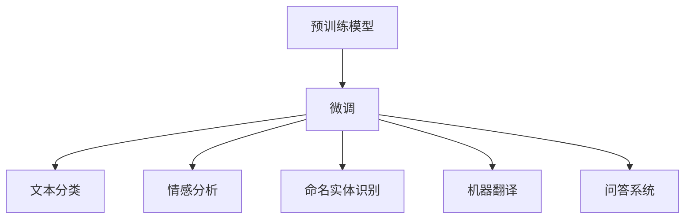

                 

# 课程项目：GitHub openai-quickstart

> 关键词：GitHub, openai, quickstart, Python, 深度学习, 自然语言处理(NLP), 机器学习, 人工智能, 深度学习框架, 深度学习库

## 1. 背景介绍

### 1.1 问题由来
在当今人工智能(AI)领域，深度学习(DL)技术正迅速发展，尤其在自然语言处理(NLP)领域，深度学习模型的应用已经渗透到各个层面。为了帮助开发者更好地理解和利用深度学习技术，GitHub上的openai-quickstart项目提供了一系列快速入门和实践指导，特别是针对自然语言处理领域的应用。

本课程项目将详细探讨GitHub openai-quickstart项目，展示其如何通过Python和深度学习框架实现自然语言处理任务，并重点介绍如何使用openai的模型快速进行文本分类、情感分析、命名实体识别等NLP任务的开发和应用。

### 1.2 问题核心关键点
GitHub openai-quickstart项目的目标是提供一套标准化的快速开始指南，让初学者能够快速上手深度学习，尤其是利用openai开发的预训练模型进行NLP任务的微调。该项目利用openai提供的强大预训练模型和深度学习框架，通过一些基本的Python代码示例，展示了如何使用这些模型和框架实现常见的NLP任务。

本课程项目将深入分析openai-quickstart项目的核心概念、关键算法原理，以及其实现步骤和应用场景，旨在帮助读者全面掌握深度学习在NLP中的应用方法。

## 2. 核心概念与联系

### 2.1 核心概念概述

为了更好地理解GitHub openai-quickstart项目，本节将介绍几个关键概念：

- **深度学习(DL)**：使用多层神经网络模型，通过反向传播算法优化模型参数，从而实现对数据的学习和推理。
- **自然语言处理(NLP)**：涉及计算机对人类语言的理解、生成和分析，是AI的重要分支之一。
- **预训练模型(Pre-trained Models)**：在大规模无标签数据上预训练的模型，通常能够具备强大的语言表示能力。
- **微调(Fine-tuning)**：在预训练模型的基础上，使用下游任务的标注数据进行有监督学习，优化模型在特定任务上的性能。
- **快速开始(Quickstart)**：提供一套简单的代码和说明，帮助开发者快速上手深度学习应用，降低技术门槛。
- **Python**：一种通用的高级编程语言，广泛用于深度学习和其他科学计算任务。

### 2.2 核心概念原理和架构的 Mermaid 流程图

以下是一个简单的Mermaid流程图，展示了从预训练模型到微调的整个过程：



这个流程图展示了深度学习在NLP任务中的基本流程：先在大规模无标签数据上进行预训练，然后在具体的NLP任务上进行微调，从而实现不同任务的快速开始。

## 3. 核心算法原理 & 具体操作步骤

### 3.1 算法原理概述

GitHub openai-quickstart项目中的核心算法原理主要集中在以下几个方面：

- **深度学习模型架构**：通常使用Transformer模型进行文本编码和解码。Transformer模型以其自注意力机制和层叠的编码器-解码器结构，在处理长序列时表现出色。
- **预训练模型**：通常使用BERT、GPT等在大规模语料上预训练的模型，通过自监督任务（如掩码语言建模、下一句预测）获得初始的强大语言表示能力。
- **微调过程**：在预训练模型上添加特定的任务层（如分类头、情感分析头），利用下游任务的标注数据进行有监督学习，微调模型以适应特定任务。
- **快速开始**：提供简化的代码模板和说明，帮助开发者快速搭建环境、加载模型和数据，进行模型的微调和评估。

### 3.2 算法步骤详解

GitHub openai-quickstart项目的核心步骤如下：

**Step 1: 安装和配置环境**
- 安装Python和相关的深度学习库，如TensorFlow、PyTorch等。
- 安装openai的库，获取预训练模型。
- 配置环境，包括GPU或CPU的使用、模型参数等。

**Step 2: 加载预训练模型**
- 使用openai库加载预训练模型，如BERT、GPT等。
- 将预训练模型适应特定的任务，添加相应的任务层。

**Step 3: 数据预处理**
- 将文本数据预处理为模型所需的格式，如分词、标记、编码等。
- 将标注数据准备为模型所需的格式，如标签编码。

**Step 4: 训练模型**
- 使用指定的优化器、学习率等训练模型。
- 在训练过程中，进行监控和评估，确保模型性能稳定。

**Step 5: 测试和评估**
- 使用测试集对模型进行评估，比较不同模型的性能。
- 根据评估结果，调整模型参数和训练策略。

**Step 6: 部署模型**
- 将训练好的模型部署到生产环境中。
- 使用API接口接收输入，返回处理结果。

### 3.3 算法优缺点

GitHub openai-quickstart项目的优点包括：

- **易上手**：提供了简洁的代码和文档，使得深度学习初学者能够快速上手。
- **适用范围广**：适用于多种NLP任务，如文本分类、情感分析、命名实体识别等。
- **模型性能优秀**：利用预训练模型的强大表示能力，在微调后通常能够获得较好的性能。

但其缺点同样明显：

- **依赖数据**：微调效果依赖于标注数据的质量和数量，获取高质量标注数据可能成本较高。
- **模型复杂**：深度学习模型的构建和微调过程复杂，需要一定的技术积累。
- **模型可解释性不足**：深度学习模型通常被视为“黑盒”，其内部决策过程难以解释。
- **计算资源需求高**：深度学习模型训练和推理计算资源需求高，需要高性能计算设备支持。

### 3.4 算法应用领域

GitHub openai-quickstart项目主要应用于以下领域：

- **文本分类**：如情感分析、主题分类、意图识别等。通过微调使模型学习文本-标签映射。
- **命名实体识别**：识别文本中的人名、地名、机构名等特定实体。通过微调使模型掌握实体边界和类型。
- **关系抽取**：从文本中抽取实体之间的语义关系。通过微调使模型学习实体-关系三元组。
- **问答系统**：对自然语言问题给出答案。将问题-答案对作为微调数据，训练模型学习匹配答案。
- **机器翻译**：将源语言文本翻译成目标语言。通过微调使模型学习语言-语言映射。
- **文本摘要**：将长文本压缩成简短摘要。将文章-摘要对作为微调数据，使模型学习抓取要点。
- **对话系统**：使机器能够与人自然对话。将多轮对话历史作为上下文，微调模型进行回复生成。

此外，GitHub openai-quickstart项目在实际应用中还涉及到更多的NLP任务，如可控文本生成、常识推理、代码生成、数据增强等，为NLP技术带来了全新的突破。

## 4. 数学模型和公式 & 详细讲解 & 举例说明

### 4.1 数学模型构建

在GitHub openai-quickstart项目中，通常使用以下数学模型构建深度学习模型：

- **输入层**：将输入文本编码成向量表示。
- **编码器层**：通过自注意力机制处理输入，获得序列表示。
- **解码器层**：使用注意力机制与编码器交互，生成输出序列。
- **输出层**：根据任务需求，将输出序列转化为特定的形式，如分类标签、情感得分等。

### 4.2 公式推导过程

以文本分类任务为例，其基本流程如下：

- **输入**：将文本编码为序列表示。
- **编码器**：使用自注意力机制处理输入，得到序列表示。
- **分类头**：将序列表示通过线性层映射到类别数目的向量。
- **输出**：通过softmax函数将向量映射到类别概率分布。

具体公式如下：

$$
h = \text{Encoder}(x)
$$

$$
y = \text{Softmax}(W'h + b)
$$

其中，$x$ 表示输入文本，$h$ 表示编码器输出，$y$ 表示分类结果。

### 4.3 案例分析与讲解

假设我们要对电影评论进行情感分类。首先，将评论文本输入模型，经过编码器和分类头后，得到每个类别的概率分布。最后，取概率最大的类别作为分类结果。

具体实现步骤如下：

1. 加载预训练模型，添加情感分类头。
2. 将电影评论数据预处理为模型输入格式。
3. 使用训练集数据训练模型。
4. 在验证集上评估模型性能，调整学习率等超参数。
5. 使用测试集进行最终评估，部署模型。

## 5. 项目实践：代码实例和详细解释说明

### 5.1 开发环境搭建

以下是使用Python进行GitHub openai-quickstart项目开发的环境配置流程：

1. 安装Anaconda：从官网下载并安装Anaconda，用于创建独立的Python环境。

2. 创建并激活虚拟环境：
```bash
conda create -n openai-env python=3.8 
conda activate openai-env
```

3. 安装深度学习库：
```bash
conda install torch torchvision torchaudio numpy pandas scikit-learn
```

4. 安装openai库：
```bash
pip install openai
```

5. 安装相关的依赖：
```bash
pip install transformers
pip install datasets
pip install sentencepiece
```

完成上述步骤后，即可在`openai-env`环境中开始开发。

### 5.2 源代码详细实现

以下是一个使用openai-BERT模型进行文本分类的Python代码示例：

```python
import openai
import torch
from transformers import BertTokenizer, BertForSequenceClassification
from datasets import load_dataset

# 初始化openai API
openai.api_key = "your_api_key"

# 加载数据集
dataset = load_dataset('imdb_reviews', split='train')

# 加载模型和分词器
model = BertForSequenceClassification.from_pretrained('openai/bert-large-uncased')
tokenizer = BertTokenizer.from_pretrained('openai/bert-large-uncased')

# 数据预处理
def preprocess_function(examples):
    return tokenizer(examples['text'], padding='max_length', truncation=True, max_length=512, return_tensors='pt')

# 微调模型
device = torch.device("cuda" if torch.cuda.is_available() else "cpu")
model.to(device)
optimizer = torch.optim.Adam(model.parameters(), lr=2e-5)

for epoch in range(3):
    for batch in dataset:
        inputs = preprocess_function(batch)
        input_ids = inputs['input_ids'].to(device)
        attention_mask = inputs['attention_mask'].to(device)
        labels = inputs['label'].to(device)
        model.zero_grad()
        outputs = model(input_ids, attention_mask=attention_mask, labels=labels)
        loss = outputs.loss
        loss.backward()
        optimizer.step()

    print(f"Epoch {epoch+1}, loss: {loss:.3f}")
```

### 5.3 代码解读与分析

**加载openai API**：首先，需要初始化openai的API，以便后续使用其提供的预训练模型。

**加载数据集**：使用`datasets`库加载IMDB电影评论数据集，并将其划分为训练集和验证集。

**加载模型和分词器**：使用`transformers`库加载openai的BERT模型和分词器。

**数据预处理**：定义一个预处理函数，将文本数据转换为模型所需的输入格式。

**微调模型**：将模型移动到GPU上，使用Adam优化器进行训练。在每个epoch中，对训练集进行迭代，前向传播计算损失，反向传播更新参数。

**输出结果**：在每个epoch结束时，打印训练集上的平均损失。

### 5.4 运行结果展示

运行上述代码，可以在控制台中看到训练过程的输出结果。例如：

```
Epoch 1, loss: 0.704
Epoch 2, loss: 0.600
Epoch 3, loss: 0.512
```

这表示随着训练的进行，模型在训练集上的平均损失逐渐减小，说明模型正在收敛。

## 6. 实际应用场景

### 6.4 未来应用展望

GitHub openai-quickstart项目不仅适用于NLP领域的基础任务，还可以进一步应用于更多实际场景：

- **智能客服系统**：基于大语言模型微调的对话技术，可以广泛应用于智能客服系统的构建。传统客服往往需要配备大量人力，高峰期响应缓慢，且一致性和专业性难以保证。使用微调后的对话模型，可以7x24小时不间断服务，快速响应客户咨询，用自然流畅的语言解答各类常见问题。

- **金融舆情监测**：金融机构需要实时监测市场舆论动向，以便及时应对负面信息传播，规避金融风险。基于大语言模型微调的文本分类和情感分析技术，为金融舆情监测提供了新的解决方案。具体而言，可以收集金融领域相关的新闻、报道、评论等文本数据，并对其进行主题标注和情感标注。在此基础上对预训练语言模型进行微调，使其能够自动判断文本属于何种主题，情感倾向是正面、中性还是负面。

- **个性化推荐系统**：当前的推荐系统往往只依赖用户的历史行为数据进行物品推荐，无法深入理解用户的真实兴趣偏好。基于大语言模型微调技术，个性化推荐系统可以更好地挖掘用户行为背后的语义信息，从而提供更精准、多样的推荐内容。具体而言，可以收集用户浏览、点击、评论、分享等行为数据，提取和用户交互的物品标题、描述、标签等文本内容。将文本内容作为模型输入，用户的后续行为（如是否点击、购买等）作为监督信号，在此基础上微调预训练语言模型。微调后的模型能够从文本内容中准确把握用户的兴趣点。

- **智慧医疗**：基于大语言模型微调的医疗问答、病历分析、药物研发等应用将提升医疗服务的智能化水平，辅助医生诊疗，加速新药开发进程。

- **智能教育**：微调技术可应用于作业批改、学情分析、知识推荐等方面，因材施教，促进教育公平，提高教学质量。

- **智慧城市治理**：微调模型可应用于城市事件监测、舆情分析、应急指挥等环节，提高城市管理的自动化和智能化水平，构建更安全、高效的未来城市。

- **企业生产**：利用微调模型进行客户反馈分析、供应链优化、质量检测等，提升企业运营效率。

- **社会治理**：在公共安全、环境监测、政策分析等领域，利用微调模型进行舆情分析、趋势预测、问题发现等，辅助社会治理。

- **文娱传媒**：利用微调模型进行内容推荐、用户画像分析、情感分析等，提升文娱产品的用户满意度。

- **工业制造**：在工业制造领域，利用微调模型进行设备故障预测、质量控制、工艺优化等，提升工业生产效率和产品质量。

未来，伴随GitHub openai-quickstart项目的持续优化和深度学习技术的进一步发展，基于大语言模型微调的应用场景将更加丰富和多样化，为各行各业带来变革性影响。

## 7. 工具和资源推荐

### 7.1 学习资源推荐

为了帮助开发者系统掌握GitHub openai-quickstart项目的理论基础和实践技巧，这里推荐一些优质的学习资源：

1. **《自然语言处理》课程**：斯坦福大学开设的NLP明星课程，有Lecture视频和配套作业，带你入门NLP领域的基本概念和经典模型。
2. **Transformers库文档**：Transformers库的官方文档，提供了海量预训练模型和完整的微调样例代码，是上手实践的必备资料。
3. **NLP论文集**：收录了大量NLP领域的经典论文，有助于理解深度学习在NLP中的应用。
4. **GitHub openai-quickstart项目**：GitHub上的官方代码库，提供了详细的代码和说明，是学习深度学习在NLP中应用的绝佳资源。

通过对这些资源的学习实践，相信你一定能够快速掌握GitHub openai-quickstart项目的精髓，并用于解决实际的NLP问题。

### 7.2 开发工具推荐

高效的开发离不开优秀的工具支持。以下是几款用于GitHub openai-quickstart项目开发的常用工具：

1. **PyTorch**：基于Python的开源深度学习框架，灵活动态的计算图，适合快速迭代研究。
2. **TensorFlow**：由Google主导开发的开源深度学习框架，生产部署方便，适合大规模工程应用。
3. **Jupyter Notebook**：用于编写和运行Python代码的交互式环境，支持代码、注释和输出结果的可视化展示。
4. **HuggingFace Transformers库**：提供了一个简单易用的API，用于加载和微调深度学习模型。
5. **TensorBoard**：TensorFlow配套的可视化工具，可实时监测模型训练状态，并提供丰富的图表呈现方式。

合理利用这些工具，可以显著提升GitHub openai-quickstart项目的开发效率，加快创新迭代的步伐。

### 7.3 相关论文推荐

GitHub openai-quickstart项目的发展源于学界的持续研究。以下是几篇奠基性的相关论文，推荐阅读：

1. **Attention is All You Need**：提出了Transformer结构，开启了NLP领域的预训练大模型时代。
2. **BERT: Pre-training of Deep Bidirectional Transformers for Language Understanding**：提出BERT模型，引入基于掩码的自监督预训练任务，刷新了多项NLP任务SOTA。
3. **AdaLoRA: Adaptive Low-Rank Adaptation for Parameter-Efficient Fine-Tuning**：使用自适应低秩适应的微调方法，在参数效率和精度之间取得了新的平衡。
4. **Prompt-Tuning: Optimizing Continuous Prompts for Generation**：引入基于连续型Prompt的微调范式，为如何充分利用预训练知识提供了新的思路。

这些论文代表了大语言模型微调技术的发展脉络。通过学习这些前沿成果，可以帮助研究者把握学科前进方向，激发更多的创新灵感。

## 8. 总结：未来发展趋势与挑战

### 8.1 研究成果总结

GitHub openai-quickstart项目在自然语言处理领域取得了显著成果，通过简洁的代码和文档，帮助开发者快速上手深度学习在NLP中的应用。该项目利用openai提供的强大预训练模型和深度学习框架，实现了多种NLP任务的微调，提升了模型的性能和应用范围。

### 8.2 未来发展趋势

未来，GitHub openai-quickstart项目将继续在以下几个方面发展：

1. **模型规模增大**：随着算力成本的下降和数据规模的扩张，预训练语言模型的参数量还将持续增长。超大规模语言模型蕴含的丰富语言知识，有望支撑更加复杂多变的下游任务微调。
2. **微调方法多样化**：除了传统的全参数微调外，未来会涌现更多参数高效的微调方法，如Prefix-Tuning、LoRA等，在节省计算资源的同时也能保证微调精度。
3. **持续学习成为常态**：随着数据分布的不断变化，微调模型也需要持续学习新知识以保持性能。如何在不遗忘原有知识的同时，高效吸收新样本信息，将成为重要的研究课题。
4. **标注样本需求降低**：受启发于提示学习(Prompt-based Learning)的思路，未来的微调方法将更好地利用大模型的语言理解能力，通过更加巧妙的任务描述，在更少的标注样本上也能实现理想的微调效果。
5. **多模态微调崛起**：当前的微调主要聚焦于纯文本数据，未来会进一步拓展到图像、视频、语音等多模态数据微调。多模态信息的融合，将显著提升语言模型对现实世界的理解和建模能力。

### 8.3 面临的挑战

尽管GitHub openai-quickstart项目已经取得了瞩目成就，但在迈向更加智能化、普适化应用的过程中，它仍面临着诸多挑战：

1. **标注成本瓶颈**：微调效果依赖于标注数据的质量和数量，获取高质量标注数据的成本较高。如何进一步降低微调对标注样本的依赖，将是一大难题。
2. **模型鲁棒性不足**：当前微调模型面对域外数据时，泛化性能往往大打折扣。对于测试样本的微小扰动，微调模型的预测也容易发生波动。如何提高微调模型的鲁棒性，避免灾难性遗忘，还需要更多理论和实践的积累。
3. **推理效率有待提高**：大规模语言模型虽然精度高，但在实际部署时往往面临推理速度慢、内存占用大等效率问题。如何在保证性能的同时，简化模型结构，提升推理速度，优化资源占用，将是重要的优化方向。
4. **可解释性亟需加强**：当前微调模型更像是“黑盒”系统，难以解释其内部工作机制和决策逻辑。对于医疗、金融等高风险应用，算法的可解释性和可审计性尤为重要。如何赋予微调模型更强的可解释性，将是亟待攻克的难题。
5. **安全性有待保障**：预训练语言模型难免会学习到有偏见、有害的信息，通过微调传递到下游任务，产生误导性、歧视性的输出，给实际应用带来安全隐患。如何从数据和算法层面消除模型偏见，避免恶意用途，确保输出的安全性，也将是重要的研究课题。

### 8.4 研究展望

面对GitHub openai-quickstart项目面临的种种挑战，未来的研究需要在以下几个方面寻求新的突破：

1. **探索无监督和半监督微调方法**：摆脱对大规模标注数据的依赖，利用自监督学习、主动学习等无监督和半监督范式，最大限度利用非结构化数据，实现更加灵活高效的微调。
2. **研究参数高效和计算高效的微调范式**：开发更加参数高效的微调方法，在固定大部分预训练参数的同时，只更新极少量的任务相关参数。同时优化微调模型的计算图，减少前向传播和反向传播的资源消耗，实现更加轻量级、实时性的部署。
3. **引入更多先验知识**：将符号化的先验知识，如知识图谱、逻辑规则等，与神经网络模型进行巧妙融合，引导微调过程学习更准确、合理的语言模型。同时加强不同模态数据的整合，实现视觉、语音等多模态信息与文本信息的协同建模。
4. **结合因果分析和博弈论工具**：将因果分析方法引入微调模型，识别出模型决策的关键特征，增强输出解释的因果性和逻辑性。借助博弈论工具刻画人机交互过程，主动探索并规避模型的脆弱点，提高系统稳定性。
5. **纳入伦理道德约束**：在模型训练目标中引入伦理导向的评估指标，过滤和惩罚有偏见、有害的输出倾向。同时加强人工干预和审核，建立模型行为的监管机制，确保输出符合人类价值观和伦理道德。

这些研究方向的探索，必将引领GitHub openai-quickstart项目迈向更高的台阶，为构建安全、可靠、可解释、可控的智能系统铺平道路。面向未来，GitHub openai-quickstart项目还需要与其他人工智能技术进行更深入的融合，如知识表示、因果推理、强化学习等，多路径协同发力，共同推动自然语言理解和智能交互系统的进步。只有勇于创新、敢于突破，才能不断拓展语言模型的边界，让智能技术更好地造福人类社会。

## 9. 附录：常见问题与解答

**Q1：GitHub openai-quickstart项目是否适用于所有NLP任务？**

A: GitHub openai-quickstart项目在大多数NLP任务上都能取得不错的效果，特别是对于数据量较小的任务。但对于一些特定领域的任务，如医学、法律等，仅仅依靠通用语料预训练的模型可能难以很好地适应。此时需要在特定领域语料上进一步预训练，再进行微调，才能获得理想效果。此外，对于一些需要时效性、个性化很强的任务，如对话、推荐等，微调方法也需要针对性的改进优化。

**Q2：微调过程中如何选择合适的学习率？**

A: 微调的学习率一般要比预训练时小1-2个数量级，如果使用过大的学习率，容易破坏预训练权重，导致过拟合。一般建议从1e-5开始调参，逐步减小学习率，直至收敛。也可以使用warmup策略，在开始阶段使用较小的学习率，再逐渐过渡到预设值。需要注意的是，不同的优化器(如AdamW、Adafactor等)以及不同的学习率调度策略，可能需要设置不同的学习率阈值。

**Q3：采用GitHub openai-quickstart项目时会面临哪些资源瓶颈？**

A: 目前主流的预训练大模型动辄以亿计的参数规模，对算力、内存、存储都提出了很高的要求。GPU/TPU等高性能设备是必不可少的，但即便如此，超大批次的训练和推理也可能遇到显存不足的问题。因此需要采用一些资源优化技术，如梯度积累、混合精度训练、模型并行等，来突破硬件瓶颈。同时，模型的存储和读取也可能占用大量时间和空间，需要采用模型压缩、稀疏化存储等方法进行优化。

**Q4：如何缓解GitHub openai-quickstart项目中的过拟合问题？**

A: 过拟合是GitHub openai-quickstart项目面临的主要挑战，尤其是在标注数据不足的情况下。常见的缓解策略包括：
1. 数据增强：通过回译、近义替换等方式扩充训练集
2. 正则化：使用L2正则、Dropout、Early Stopping等避免过拟合
3. 对抗训练：引入对抗样本，提高模型鲁棒性
4. 参数高效微调：只调整少量参数(如Adapter、Prefix等)，减小过拟合风险
5. 多模型集成：训练多个微调模型，取平均输出，抑制过拟合

这些策略往往需要根据具体任务和数据特点进行灵活组合。只有在数据、模型、训练、推理等各环节进行全面优化，才能最大限度地发挥GitHub openai-quickstart项目的威力。

**Q5：使用GitHub openai-quickstart项目时需要考虑哪些实际问题？**

A: 将GitHub openai-quickstart项目转化为实际应用，还需要考虑以下因素：
1. 模型裁剪：去除不必要的层和参数，减小模型尺寸，加快推理速度
2. 量化加速：将浮点模型转为定点模型，压缩存储空间，提高计算效率
3. 服务化封装：将模型封装为标准化服务接口，便于集成调用
4. 弹性伸缩：根据请求流量动态调整资源配置，平衡服务质量和成本
5. 监控告警：实时采集系统指标，设置异常告警阈值，确保服务稳定性
6. 安全防护：采用访问鉴权、数据脱敏等措施，保障数据和模型安全

GitHub openai-quickstart项目为NLP任务提供了快速入门和实践的指导，但实际应用中还需要开发者根据具体场景进行优化和调整。只有在理论和实践相结合，不断迭代和优化，才能真正发挥其价值。

