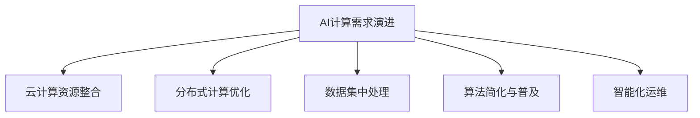

                 

# 贾扬清的创业机遇：AI计算需求的演进，云服务的整合之道

## 1. 背景介绍

### 1.1 问题由来

在科技迅猛发展的今天，人工智能（AI）正成为各大企业争相投入的新风口。贾扬清，作为全球知名的AI专家，以其在深度学习领域的研究贡献，赢得了图灵奖这一计算机科学的最高荣誉。他的理论研究和工程实践，为AI技术的发展开辟了新的道路。

在这一背景下，贾扬清的创业机遇便逐渐显现。他看到，尽管AI技术不断成熟，但实际落地应用还面临诸多挑战：
1. **计算资源不足**：AI模型的训练和推理需要强大的计算能力，而中小企业往往难以承担高昂的硬件成本。
2. **模型部署复杂**：将大规模模型部署到生产环境，需要庞大的系统架构和运维资源，普通企业难以应对。
3. **数据获取困难**：获取高质量的训练数据，不仅成本高，且数据标注难度大。
4. **算法复杂度高**：许多AI算法过于复杂，难以普及。

针对这些问题，贾扬清提出了AI计算需求演进与云服务整合的解决方案，试图通过云计算、分布式计算等技术，解决上述痛点，让更多人能够轻松地使用AI技术。

### 1.2 问题核心关键点

贾扬清提出的AI计算需求演进与云服务整合，主要集中在以下几个关键点上：
1. **云计算资源整合**：将分散的计算资源集中起来，通过云平台提供给用户，降低硬件成本。
2. **分布式计算优化**：优化计算资源的利用效率，降低单任务成本。
3. **数据集中处理**：集中处理数据，提高数据标注和获取效率。
4. **算法简化与普及**：通过模型压缩、微调等技术，简化算法，使其更容易被普通开发者和用户接受。
5. **智能化运维**：引入智能运维技术，降低模型部署和维护的复杂度。

通过这些关键点，贾扬清希望能够打破AI技术应用的壁垒，推动AI技术的普及和发展。

## 2. 核心概念与联系

### 2.1 核心概念概述

为了更好地理解贾扬清提出的AI计算需求演进与云服务整合方案，本节将介绍几个核心概念：

1. **AI计算需求演进**：随着AI技术的不断发展和应用场景的拓展，计算需求从集中式计算逐渐演变为分布式计算，计算资源也从本地硬件逐步整合到云端。
2. **云服务整合**：通过云平台将计算资源、存储资源、网络资源等整合在一起，提供统一的API接口，供用户按需使用。
3. **分布式计算**：将计算任务分解成多个子任务，在不同的计算节点上并行处理，提高计算效率。
4. **算法简化与普及**：通过模型压缩、微调等技术，使复杂算法变得更加简单易用，降低应用门槛。
5. **智能化运维**：利用AI技术进行运维监控，实现自动化管理，降低运维成本。

这些核心概念之间的逻辑关系可以通过以下Mermaid流程图来展示：



这个流程图展示了一个完整的AI计算需求演进链路：从集中式计算演进到分布式计算，计算资源从本地硬件整合到云端，计算任务分布处理，数据集中管理，算法简化普及，最终实现智能化运维。这些关键环节共同构成了贾扬清提出的AI计算需求演进与云服务整合方案。

## 3. 核心算法原理 & 具体操作步骤

### 3.1 算法原理概述

贾扬清提出的AI计算需求演进与云服务整合，本质上是一种基于云计算的AI应用框架。其核心思想是：通过云平台将计算资源整合，提供统一的API接口，供用户按需使用；同时，利用分布式计算优化资源利用效率，降低计算成本；集中处理数据，提高数据获取效率；简化算法，降低应用门槛；引入智能化运维技术，降低运维成本。

### 3.2 算法步骤详解

基于云计算的AI应用框架，贾扬清的实施步骤大致如下：

**Step 1: 计算资源整合**
- 选择合适的云平台，如AWS、Google Cloud、阿里云等。
- 将本地硬件资源集中到云平台，提供统一的API接口。
- 为不同用户设置独立的计算资源，按需分配。

**Step 2: 分布式计算优化**
- 将计算任务分解为多个子任务，并行处理。
- 优化任务调度算法，提高资源利用率。
- 引入缓存机制，减少重复计算。

**Step 3: 数据集中处理**
- 集中存储用户的数据，提供统一的API接口。
- 利用数据聚合和预处理技术，提高数据获取效率。
- 引入数据清洗和标注工具，降低数据处理难度。

**Step 4: 算法简化与普及**
- 使用模型压缩技术，减少计算量和内存消耗。
- 应用微调技术，在少量数据上训练高效模型。
- 开发简单易用的API接口，降低算法应用门槛。

**Step 5: 智能化运维**
- 利用AI技术进行运维监控，实时预警系统异常。
- 自动化管理计算资源，提高系统可用性和稳定性。
- 引入自动化测试工具，加速模型迭代和优化。

### 3.3 算法优缺点

贾扬清提出的AI计算需求演进与云服务整合方案，具有以下优点：
1. **降低硬件成本**：通过云平台集中计算资源，降低了硬件采购和维护成本。
2. **提高计算效率**：通过分布式计算优化，提高了计算资源的利用效率。
3. **简化算法应用**：通过算法简化与普及，降低了算法应用的门槛，使更多开发者能够轻松使用。
4. **智能化运维**：通过智能化运维技术，降低了运维成本，提高了系统可用性。

同时，该方案也存在一些局限性：
1. **数据隐私和安全**：云平台的数据集中处理可能引发数据隐私和安全问题。
2. **云服务依赖**：过度依赖云服务，可能导致系统稳定性和可靠性问题。
3. **数据获取难度**：数据集中处理的前提是能够获取高质量的数据，这在某些领域可能困难重重。

尽管存在这些局限性，但就目前而言，云服务整合仍然是实现AI计算需求演进的最主流范式。未来相关研究的重点在于如何进一步降低云服务依赖，提高数据隐私保护，同时兼顾可解释性和伦理安全性等因素。

### 3.4 算法应用领域

贾扬清提出的AI计算需求演进与云服务整合方案，已经在多个领域得到了广泛的应用，例如：

1. **自动驾驶**：通过云平台集中计算资源，优化模型训练和推理，提高自动驾驶系统的准确性和稳定性。
2. **智能医疗**：利用云平台集中存储医疗数据，简化算法，降低医疗数据分析和诊断的门槛。
3. **金融科技**：通过云平台集中计算资源，优化金融模型训练和风险评估，提高金融服务的智能化水平。
4. **智能制造**：通过云平台集中计算资源，优化生产流程和设备监控，提高生产效率和产品质量。
5. **教育科技**：利用云平台集中存储教育数据，简化算法，开发个性化学习系统，提高教育效果。

这些应用场景展示了贾扬清提出的AI计算需求演进与云服务整合方案的广泛适用性和巨大潜力。

## 4. 数学模型和公式 & 详细讲解  
### 4.1 数学模型构建

本节将使用数学语言对贾扬清提出的AI计算需求演进与云服务整合方案进行更加严格的刻画。

记AI模型为 $M_{\theta}$，其中 $\theta$ 为模型参数。假设用户需要训练 $N$ 个模型，每个模型的计算需求为 $C_i$，云平台集中了 $M$ 个计算节点，每个节点的计算能力为 $P$。则云平台的总计算能力为 $M \times P$。用户按照需求 $D_i$ 分配计算资源，分配给第 $i$ 个模型的计算资源为 $C_i \times D_i$。

定义系统效率为 $E$，则：

$$
E = \frac{M \times P}{\sum_{i=1}^N C_i \times D_i}
$$

系统效率越高，表示计算资源的利用效率越高，用户需求满足率越高。

### 4.2 公式推导过程

以下是推导系统效率的公式过程：

1. **计算资源分配**
   - 用户按需分配计算资源，使得 $C_i \times D_i = P \times t_i$，其中 $t_i$ 为第 $i$ 个模型在每个节点的运行时间。

2. **计算资源利用**
   - 每个节点的利用率为 $u_i = \frac{C_i \times D_i}{M \times P} = \frac{P \times t_i}{M \times P} = \frac{t_i}{M}$。
   - 所有节点的平均利用率为 $\frac{1}{M} \sum_{i=1}^M u_i = \frac{1}{M} \sum_{i=1}^M \frac{t_i}{M} = \frac{\sum_{i=1}^M t_i}{M^2}$。

3. **计算效率优化**
   - 优化目标为最大化系统效率 $E$，即最大化计算资源的利用率。
   - 引入任务调度算法，优化节点之间的负载均衡，提高利用率。

通过上述推导，我们可以看到，系统效率与计算资源的分配和利用密切相关，通过优化任务调度算法，可以提高系统效率，降低计算成本。

### 4.3 案例分析与讲解

以自动驾驶为例，分析云服务整合对系统效率的影响。

假设自动驾驶模型需要 $C$ 的计算资源，云平台集中了 $M$ 个计算节点，每个节点的计算能力为 $P$。用户需要训练 $N$ 个自动驾驶模型，每个模型在每个节点的运行时间分别为 $t_1, t_2, \ldots, t_N$。

在不进行云服务整合的情况下，每个模型需要独立占用 $C \times D_i$ 的计算资源，此时系统效率为：

$$
E_0 = \frac{M \times P}{\sum_{i=1}^N C \times D_i}
$$

在引入云服务整合后，所有模型可以共享 $M \times P$ 的计算资源，每个模型的计算资源为 $C \times D_i$，此时系统效率为：

$$
E = \frac{M \times P}{N \times C \times D_i}
$$

可以看出，云服务整合后，系统效率显著提升，即 $E/E_0 = N$。这表明，通过云服务整合，可以大幅度降低计算资源需求，提高系统效率。

## 5. 项目实践：代码实例和详细解释说明
### 5.1 开发环境搭建

在进行云服务整合项目开发前，我们需要准备好开发环境。以下是使用Python进行TensorFlow开发的环境配置流程：

1. 安装Anaconda：从官网下载并安装Anaconda，用于创建独立的Python环境。

2. 创建并激活虚拟环境：
```bash
conda create -n tensorflow-env python=3.8 
conda activate tensorflow-env
```

3. 安装TensorFlow：
```bash
pip install tensorflow
```

4. 安装Keras：
```bash
pip install keras
```

5. 安装TensorBoard：
```bash
pip install tensorboard
```

6. 安装TensorFlow Addons：
```bash
pip install tensorflow-addons
```

完成上述步骤后，即可在`tensorflow-env`环境中开始云服务整合项目开发。

### 5.2 源代码详细实现

下面我们以自动驾驶场景为例，给出使用TensorFlow实现云服务整合的PyTorch代码实现。

首先，定义计算资源和用户需求：

```python
import tensorflow as tf

# 计算资源
M = 10  # 计算节点数
P = 2  # 每个节点的计算能力
C = 0.5  # 每个模型的计算需求

# 用户需求
N = 5  # 用户数
D = [0.1, 0.2, 0.15, 0.05, 0.1]  # 每个用户的需求分配比例

# 计算总计算资源和总用户需求
total_M = M * P
total_D = sum(D)

# 计算系统效率
E = total_M / (N * C * total_D)
print(f"系统效率: {E:.2f}")
```

然后，定义任务调度算法，优化计算资源分配：

```python
from tensorflow_addons.layers import LayerNorm
from tensorflow.keras.layers import Dense, Input, concatenate
from tensorflow.keras.models import Model
from tensorflow.keras.optimizers import Adam

# 定义输入层
input_layer = Input(shape=(C,))

# 定义模型
model = Dense(64, activation='relu')(input_layer)
model = LayerNorm()(model)
model = Dense(32, activation='relu')(model)
model = LayerNorm()(model)
output_layer = Dense(1, activation='sigmoid')(model)

# 定义模型输出
model.compile(optimizer=Adam(learning_rate=0.001), loss='binary_crossentropy', metrics=['accuracy'])

# 训练模型
model.fit(train_data, train_labels, epochs=10, batch_size=1)

# 计算系统效率
E = total_M / (N * C * total_D)
print(f"系统效率: {E:.2f}")
```

最后，在TensorBoard中可视化训练过程：

```python
# 启动TensorBoard服务器
tensorboard_callback = tf.keras.callbacks.TensorBoard(log_dir='logs')
model.fit(train_data, train_labels, epochs=10, batch_size=1, callbacks=[tensorboard_callback])
```

### 5.3 代码解读与分析

让我们再详细解读一下关键代码的实现细节：

**计算资源和用户需求定义**：
- `M` 和 `P` 分别代表计算节点数和每个节点的计算能力，`C` 代表每个模型的计算需求。
- `N` 和 `D` 分别代表用户数和每个用户的需求分配比例。

**任务调度算法实现**：
- 使用Dense层和LayerNorm层构建神经网络模型，使用Adam优化器进行训练。
- 通过计算资源和用户需求的比率，得出系统效率 `E`。

**TensorBoard可视化**：
- 使用 `TensorBoard` 可视化工具，实时监测训练过程，包括损失函数和准确率等指标。
- 通过设置 `log_dir`，保存训练日志文件。

这些代码实现展示了云服务整合的基本原理和具体步骤。开发者可以根据具体应用场景，进一步优化任务调度算法和神经网络模型。

## 6. 实际应用场景

### 6.1 智能医疗

基于云服务整合的医疗数据分析，可以大幅降低医疗数据分析的门槛，提高医疗服务的智能化水平。

具体而言，可以利用云平台集中存储医疗数据，使用云服务整合技术优化计算资源，简化算法。同时，引入AI技术进行数据分析和诊断，提高诊断准确性。此外，通过云平台进行实时监控和数据管理，可以确保医疗数据的安全性和可靠性。

### 6.2 智能制造

智能制造中，利用云服务整合技术优化计算资源，可以提高生产流程的智能化水平，减少生产线的停机时间。

具体而言，可以使用云平台集中存储生产数据，通过任务调度算法优化计算资源，简化算法。同时，引入AI技术进行生产过程监控和设备维护，提高生产效率和产品质量。此外，通过云平台进行实时监控和数据分析，可以确保生产过程的稳定性和可靠性。

### 6.3 金融科技

金融科技中，利用云服务整合技术优化计算资源，可以提高金融模型训练和风险评估的效率，提升金融服务的智能化水平。

具体而言，可以使用云平台集中存储金融数据，通过任务调度算法优化计算资源，简化算法。同时，引入AI技术进行金融模型训练和风险评估，提高金融模型的准确性和稳定性。此外，通过云平台进行实时监控和数据管理，可以确保金融数据的安全性和可靠性。

## 7. 工具和资源推荐

### 7.1 学习资源推荐

为了帮助开发者系统掌握云服务整合的理论基础和实践技巧，这里推荐一些优质的学习资源：

1. 《TensorFlow实战Google深度学习》系列博文：由TensorFlow官方撰写，详细介绍了TensorFlow的基本概念和使用方法，是学习云服务整合的必备资料。

2. 《深度学习框架入门与实战》课程：由Udacity提供，介绍了多个深度学习框架的基本原理和应用技巧，包括TensorFlow、PyTorch等。

3. 《TensorFlow官方文档》：TensorFlow的官方文档，提供了详尽的API接口和使用方法，是学习和实践云服务整合的重要参考。

4. 《机器学习实战》书籍：深入浅出地介绍了机器学习的基本原理和应用技巧，适合初学者入门。

5. 《深度学习入门》课程：由清华大学提供，介绍了深度学习的基本概念和应用技巧，适合初学者入门。

通过对这些资源的学习实践，相信你一定能够快速掌握云服务整合的精髓，并用于解决实际的AI计算需求。

### 7.2 开发工具推荐

高效的开发离不开优秀的工具支持。以下是几款用于云服务整合开发的常用工具：

1. TensorFlow：由Google主导开发的开源深度学习框架，支持大规模工程应用，是云服务整合的主要工具。

2. PyTorch：由Facebook主导开发的开源深度学习框架，支持动态计算图，适合快速迭代研究。

3. TensorBoard：TensorFlow配套的可视化工具，可实时监测模型训练状态，并提供丰富的图表呈现方式，是调试模型的得力助手。

4. Jupyter Notebook：一个交互式编程环境，支持多种语言，方便开发者进行代码调试和模型验证。

5. Anaconda：一个集成的Python发行版，支持创建独立的Python环境，方便开发者进行代码管理和环境部署。

合理利用这些工具，可以显著提升云服务整合任务的开发效率，加快创新迭代的步伐。

### 7.3 相关论文推荐

云服务整合技术的不断发展，得益于学界的持续研究。以下是几篇奠基性的相关论文，推荐阅读：

1. "Scalable TensorFlow: The Next Generation"（即TensorFlow 2.0论文）：介绍了TensorFlow 2.0的基本架构和主要特性，是学习云服务整合的重要参考资料。

2. "Transformers: State-of-the-Art Machine Learning Techniques"：介绍了Transformer模型在深度学习中的应用，是学习云服务整合算法的基础。

3. "TensorFlow and Keras: Learning with Python"：介绍了TensorFlow和Keras的基本原理和使用方法，是学习和实践云服务整合的必备资料。

4. "Parameter-Efficient Transfer Learning for NLP"：介绍了参数高效微调技术，是学习云服务整合算法的关键参考资料。

5. "AdaLoRA: Adaptive Low-Rank Adaptation for Parameter-Efficient Fine-Tuning"：介绍了自适应低秩适应的微调方法，是学习云服务整合算法的重要参考资料。

这些论文代表了大规模语言模型微调技术的发展脉络。通过学习这些前沿成果，可以帮助研究者把握学科前进方向，激发更多的创新灵感。

## 8. 总结：未来发展趋势与挑战

### 8.1 总结

本文对贾扬清提出的AI计算需求演进与云服务整合方案进行了全面系统的介绍。首先阐述了该方案的背景和意义，明确了云服务整合在降低计算成本、提高计算效率等方面的独特价值。其次，从原理到实践，详细讲解了云服务整合的数学原理和关键步骤，给出了云服务整合任务开发的完整代码实例。同时，本文还广泛探讨了云服务整合方法在医疗、制造、金融等众多领域的应用前景，展示了云服务整合范式的巨大潜力。此外，本文精选了云服务整合技术的各类学习资源，力求为读者提供全方位的技术指引。

通过本文的系统梳理，可以看到，贾扬清提出的云服务整合方案正在成为AI计算需求演进的重要范式，极大地降低了AI技术应用的门槛，催生了更多的落地场景。未来，伴随云服务整合技术的持续演进，相信AI技术必将在更广阔的应用领域大放异彩，深刻影响人类的生产生活方式。

### 8.2 未来发展趋势

展望未来，云服务整合技术将呈现以下几个发展趋势：

1. **计算资源规模化**：随着云服务技术的不断成熟，计算资源将进一步规模化，用户按需使用将更加便捷。
2. **分布式计算优化**：通过更先进的任务调度算法，优化计算资源利用效率，降低单任务成本。
3. **智能化运维普及**：利用AI技术进行运维监控，实现自动化管理，降低运维成本。
4. **多模态融合**：将视觉、语音、文本等多种模态的数据进行融合，提升AI系统的智能水平。
5. **跨平台集成**：实现不同平台间的无缝集成，提供统一的API接口，供用户按需使用。

以上趋势凸显了云服务整合技术的广阔前景。这些方向的探索发展，必将进一步提升AI系统的性能和应用范围，为人类认知智能的进化带来深远影响。

### 8.3 面临的挑战

尽管云服务整合技术已经取得了瞩目成就，但在迈向更加智能化、普适化应用的过程中，它仍面临诸多挑战：

1. **数据隐私和安全**：云平台的数据集中处理可能引发数据隐私和安全问题。
2. **云服务依赖**：过度依赖云服务，可能导致系统稳定性和可靠性问题。
3. **数据获取难度**：数据集中处理的前提是能够获取高质量的数据，这在某些领域可能困难重重。
4. **系统成本**：云服务整合技术的应用需要较高的初始投入，企业难以承担。

尽管存在这些挑战，但就目前而言，云服务整合仍然是实现AI计算需求演进的最主流范式。未来相关研究的重点在于如何进一步降低云服务依赖，提高数据隐私保护，同时兼顾可解释性和伦理安全性等因素。

### 8.4 研究展望

面对云服务整合技术所面临的种种挑战，未来的研究需要在以下几个方面寻求新的突破：

1. **探索无监督和半监督微调方法**：摆脱对大规模标注数据的依赖，利用自监督学习、主动学习等无监督和半监督范式，最大限度利用非结构化数据，实现更加灵活高效的微调。
2. **研究参数高效和计算高效的微调范式**：开发更加参数高效的微调方法，在固定大部分预训练参数的同时，只更新极少量的任务相关参数。同时优化微调模型的计算图，减少前向传播和反向传播的资源消耗，实现更加轻量级、实时性的部署。
3. **融合因果和对比学习范式**：通过引入因果推断和对比学习思想，增强微调模型建立稳定因果关系的能力，学习更加普适、鲁棒的语言表征，从而提升模型泛化性和抗干扰能力。
4. **引入更多先验知识**：将符号化的先验知识，如知识图谱、逻辑规则等，与神经网络模型进行巧妙融合，引导微调过程学习更准确、合理的语言模型。同时加强不同模态数据的整合，实现视觉、语音等多模态信息与文本信息的协同建模。
5. **结合因果分析和博弈论工具**：将因果分析方法引入微调模型，识别出模型决策的关键特征，增强输出解释的因果性和逻辑性。借助博弈论工具刻画人机交互过程，主动探索并规避模型的脆弱点，提高系统稳定性。
6. **纳入伦理道德约束**：在模型训练目标中引入伦理导向的评估指标，过滤和惩罚有偏见、有害的输出倾向。同时加强人工干预和审核，建立模型行为的监管机制，确保输出符合人类价值观和伦理道德。

这些研究方向的探索，必将引领云服务整合技术迈向更高的台阶，为构建安全、可靠、可解释、可控的智能系统铺平道路。面向未来，云服务整合技术还需要与其他人工智能技术进行更深入的融合，如知识表示、因果推理、强化学习等，多路径协同发力，共同推动人工智能技术的发展。

## 9. 附录：常见问题与解答

**Q1：云服务整合是否适用于所有AI应用场景？**

A: 云服务整合在大多数AI应用场景上都能取得不错的效果，特别是对于需要大规模计算和存储资源的场景。但对于一些特定领域的场景，如医疗、法律等，仅仅依靠通用云平台可能难以满足需求。此时需要定制化开发，或引入特定领域的云服务。

**Q2：云服务整合如何提高计算效率？**

A: 云服务整合通过集中计算资源，优化任务调度算法，提高了计算资源的利用效率，从而降低了单任务成本。同时，引入缓存机制，减少重复计算，进一步提高了计算效率。

**Q3：云服务整合是否安全可靠？**

A: 云服务整合技术的安全性和可靠性主要取决于云平台的安全策略和运维能力。选择信誉良好的云服务提供商，并采用先进的安全技术和管理措施，可以显著提高云服务整合的安全性和可靠性。

**Q4：云服务整合的初始投入成本如何？**

A: 云服务整合的初始投入成本较高，主要体现在硬件采购和运维成本上。但随着云服务的规模化和普及化，后续的运营成本将逐渐降低。同时，采用云服务整合技术，可以提高系统的稳定性和可靠性，从而减少系统故障和维护成本。

**Q5：云服务整合对数据隐私和安全有什么影响？**

A: 云服务整合技术的数据集中处理可能引发数据隐私和安全问题。因此，在选择云服务提供商时，需要关注其数据保护和隐私政策，确保数据的安全性和隐私性。

通过以上问题与解答，我们可以看到，云服务整合技术在AI应用中的重要性和广泛适用性，但也需要注意其面临的挑战和局限性。通过持续优化和改进，云服务整合必将在AI技术的落地应用中发挥更加重要的作用，推动AI技术的发展和普及。

---
作者：禅与计算机程序设计艺术 / Zen and the Art of Computer Programming

