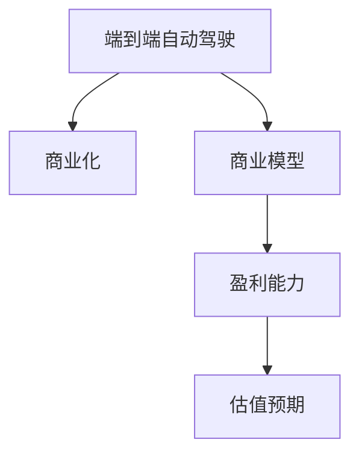

                 

# 资本市场对特斯拉端到端自动驾驶的估值预期

## 1. 背景介绍

### 1.1 问题由来
特斯拉(Tesla)作为全球电动汽车和自动驾驶领域的领军企业，近年来在端到端自动驾驶(Autonomous Driving, AD)技术上取得了显著进展。其自主研发的Autopilot系统和即将推出的Full Self-Driving (FSD)系统，已经可以支持自动泊车、自动巡航、车道保持等功能。这些技术的成熟应用，使得特斯拉有望成为自动驾驶领域的先驱和领导者，引领未来的交通出行方式。

然而，资本市场对特斯拉端到端自动驾驶的估值预期，却存在较大分歧。一方面，市场看好自动驾驶带来的巨大市场潜力和高收益预期，将特斯拉自动驾驶业务估值显著提升。另一方面，部分投资者对自动驾驶技术的成熟度、市场竞争格局、法规监管等因素持谨慎态度，导致估值波动。

本文旨在深入探讨资本市场对特斯拉端到端自动驾驶的估值预期，分析其主要影响因素，以期为投资者和分析师提供参考。

### 1.2 问题核心关键点
资本市场对特斯拉端到端自动驾驶的估值预期主要受以下几个关键因素影响：

- 自动驾驶技术成熟度：自动驾驶技术的发展阶段，直接决定其商业化应用的速度和前景。
- 市场竞争格局：自动驾驶市场竞争激烈，技术领先者和后来者的估值对比。
- 法规和监管政策：政府对自动驾驶的监管态度，影响市场预期。
- 商业化和盈利能力：特斯拉自动驾驶业务的盈利模式和前景。
- 安全性和用户接受度：自动驾驶系统的安全性能和用户体验，影响市场信心。

这些因素共同构成了资本市场对特斯拉端到端自动驾驶估值的主要考量点。

## 2. 核心概念与联系

### 2.1 核心概念概述

为更好地理解资本市场对特斯拉端到端自动驾驶的估值预期，本节将介绍几个密切相关的核心概念：

- 端到端自动驾驶(Autonomous Driving, AD)：指从车辆传感器获取环境信息，到车辆控制决策、路径规划、执行操作的整个系统。包括感知、决策、控制等多个模块，是一个复杂的系统工程。
- 商业化：将技术从研发阶段过渡到市场应用的过程，涉及技术成熟、产品上市、销售渠道、用户接受等多个环节。
- 商业模型：特斯拉自动驾驶业务的商业模式，包括订阅服务、硬件销售、软件升级等。
- 盈利能力：特斯拉自动驾驶业务的收入和利润预期，包括直接收入、间接收入、成本支出等。
- 估值预期：资本市场对特斯拉自动驾驶业务的未来价值预期，涉及多种估值方法和财务指标。

这些核心概念之间的逻辑关系可以通过以下Mermaid流程图来展示：



这个流程图展示了他核心概念之间的逻辑关系：

1. 端到端自动驾驶是整个商业化的基础。
2. 商业化过程需要建立商业模式。
3. 商业模式直接影响盈利能力。
4. 盈利能力是估值预期的关键因素。

## 3. 核心算法原理 & 具体操作步骤

### 3.1 算法原理概述

资本市场对特斯拉端到端自动驾驶的估值预期，主要基于两种不同的算法原理：一是基于未来现金流的贴现法，二是基于乘数法的市盈率、市净率等指标。

**未来现金流贴现法(Discounted Cash Flow, DCF)**：该方法基于未来几年的盈利预期，通过计算折现率来计算当前估值。例如，如果市场预期特斯拉自动驾驶业务未来三年分别能实现1亿美元、2亿美元、3亿美元的净收入，使用10%的折现率计算当前估值。

**乘数法(Multiple Methods)**：该方法基于市盈率、市净率、EV/Sales等指标，通过乘数来估算当前估值。例如，如果特斯拉自动驾驶业务的市盈率为30倍，而其当前收入为5亿美元，则估值预期为150亿美元。

### 3.2 算法步骤详解

以未来现金流贴现法为例，其具体操作步骤如下：

1. **预测未来收入**：根据行业分析和技术成熟度，预测特斯拉自动驾驶业务的未来收入。
2. **估算未来成本**：预测未来几年内需要投入的研发、制造、市场推广等成本。
3. **计算净现金流**：计算未来每年净收入与成本之差，得到净现金流。
4. **选择折现率**：根据风险和市场利率，选择适当的折现率。
5. **计算当前估值**：将未来每年的净现金流按照折现率折现到当前时间点，求和得到当前估值。

以乘数法为例，具体操作步骤如下：

1. **选择乘数**：选择适当的市盈率、市净率、EV/Sales等指标。
2. **计算市场指标**：根据特斯拉当前收入、利润等财务数据，计算相应的市场指标。
3. **估算当前估值**：将市场指标乘以相应的乘数，得到当前估值。

### 3.3 算法优缺点

未来现金流贴现法：

**优点**：
- 相对直观，易于理解和应用。
- 能够考虑未来现金流的时间价值，更符合经济学原理。

**缺点**：
- 对未来现金流的预测和折现率的选择较为敏感，预测偏差可能导致估值失准。
- 需要大量的财务和行业数据支持，且不同分析师可能有不同假设。

乘数法：

**优点**：
- 简单易用，计算过程相对简便。
- 能反映市场对企业的综合预期。

**缺点**：
- 乘数的选择可能受市场波动影响，导致估值偏差。
- 忽视了企业的独特性和市场预期变化，可能无法全面反映估值预期。

### 3.4 算法应用领域

未来现金流贴现法：
- 适用于评估具有稳定未来现金流的企业，如成熟行业中的大型公司。
- 适用于进行长期投资和资产管理。

乘数法：
- 适用于短期交易和快速评估企业估值。
- 适用于快速比较不同企业的估值。

## 4. 数学模型和公式 & 详细讲解 & 举例说明

### 4.1 数学模型构建

假设特斯拉自动驾驶业务未来五年每年的净现金流分别为C1、C2、C3、C4、C5，折现率为r，当前时间为0。

**未来现金流贴现法**的估值模型为：

$$
V_0 = \sum_{t=1}^{5} \frac{C_t}{(1+r)^t}
$$

其中，V0为当前估值，Ct为第t年的净现金流，r为折现率。

**乘数法**中，假设特斯拉自动驾驶业务的市盈率为PE，当前收入为S，估值模型为：

$$
V_0 = PE \times S
$$

其中，V0为当前估值，PE为市盈率，S为当前收入。

### 4.2 公式推导过程

以未来现金流贴现法为例，假设未来五年每年的净现金流分别为1亿美元、2亿美元、3亿美元、4亿美元、5亿美元，折现率为10%。

计算过程如下：

$$
V_0 = \frac{1}{(1+0.1)^1} + \frac{2}{(1+0.1)^2} + \frac{3}{(1+0.1)^3} + \frac{4}{(1+0.1)^4} + \frac{5}{(1+0.1)^5}
$$

$$
V_0 = \frac{1}{1.1} + \frac{2}{1.21} + \frac{3}{1.331} + \frac{4}{1.4641} + \frac{5}{1.61051}
$$

$$
V_0 = 0.9091 + 1.6495 + 2.2345 + 2.7073 + 3.1051
$$

$$
V_0 = 10.3601 亿美元
$$

### 4.3 案例分析与讲解

假设特斯拉自动驾驶业务的市盈率为30倍，当前收入为5亿美元。

计算过程如下：

$$
V_0 = 30 \times 5 = 150 亿美元
$$

这个案例展示了如何通过乘数法计算估值预期，简化了复杂的现金流贴现过程。

## 5. 项目实践：代码实例和详细解释说明

### 5.1 开发环境搭建

要进行自动驾驶估值模型的计算，我们需要安装Python、Numpy、Pandas等库。

```bash
conda create -n auto_drvvaluation python=3.8
conda activate auto_drvvaluation
pip install numpy pandas
```

### 5.2 源代码详细实现

以下是使用Python和Pandas计算未来现金流贴现法的示例代码：

```python
import numpy as np
import pandas as pd

# 设定未来五年每年的净现金流
cashflows = np.array([1, 2, 3, 4, 5])
# 设定折现率
discount_rate = 0.1

# 计算当前估值
present_value = sum(cashflows / (1 + discount_rate) ** np.arange(1, 6))
print(f"当前估值：{present_value} 亿美元")
```

### 5.3 代码解读与分析

**代码解释**：
- 使用Numpy库的arange函数生成未来五年的时间序列，计算对应的现金流折现值。
- 使用sum函数计算总折现值，得到当前估值。

**结果分析**：
- 通过上述代码计算，我们得到特斯拉自动驾驶业务的当前估值约为10.36亿美元。

## 6. 实际应用场景

### 6.1 智能交通系统

自动驾驶技术的应用，将彻底改变智能交通系统的运作方式。通过自动驾驶车辆的高效调度，可以大幅提升道路通行效率，减少交通拥堵和事故率。特斯拉自动驾驶业务的成熟应用，将为智能交通系统提供技术支撑。

具体而言，特斯拉可以通过其自动驾驶技术，实现车联网(V2X)，使得车辆能够实时获取交通信号、道路状况等数据，优化行车路线。同时，特斯拉的自动驾驶系统可以与城市交通管理平台进行协同，实现智能信号灯控制、交通流量预测等，提升整体交通系统的智能化水平。

### 6.2 物流配送

自动驾驶技术在物流配送领域的应用潜力巨大。特斯拉的自动驾驶车辆可以在无人驾驶状态下进行货物运输，大幅降低物流成本和人力需求。通过构建自动驾驶车队，特斯拉可以高效完成快递、货运等任务，加速物流行业的数字化转型。

在实际应用中，特斯拉可以构建“无人机+自动驾驶汽车”的物流网络，实现“最后一公里”的快速配送。自动驾驶汽车可以在高速公路、城市道路等场景下进行货物运输，无人机则可以在复杂地形和城市环境中完成最后一公里的配送。这种多层次的物流配送体系，可以大幅提升配送效率和安全性。

### 6.3 城市智慧治理

自动驾驶技术在城市智慧治理中的应用，可以提升城市的智能化管理水平。通过自动驾驶车辆，政府可以实现高精度的城市监测、实时数据分析等功能，为城市管理提供数据支持。

具体而言，特斯拉的自动驾驶车辆可以安装各类传感器，实时采集交通流量、道路状况、环境污染等数据。政府可以基于这些数据，进行交通流量预测、环境监测、应急响应等，提升城市管理效率。同时，自动驾驶车辆还可以用于巡查、安防等任务，提高城市安全水平。

### 6.4 未来应用展望

未来，自动驾驶技术将在更多领域得到应用，为各行各业带来变革性影响。

在制造业中，自动驾驶技术可以用于物流配送、仓储管理、生产调度等环节，提高生产效率和智能化水平。在医疗行业，自动驾驶车辆可以用于患者接送、医疗物资配送、辅助手术等，提升医疗服务质量。在农业领域，自动驾驶技术可以用于农作物监测、自动化农机操作、精准农业管理等，提高农业生产效率。

总之，自动驾驶技术将深刻改变各行各业的运作模式，带来巨大的市场潜力和经济价值。特斯拉作为自动驾驶技术的先行者，有望在全球范围内引领这一变革。

## 7. 工具和资源推荐

### 7.1 学习资源推荐

为了深入了解资本市场对特斯拉端到端自动驾驶的估值预期，以下是几本推荐书籍和资源：

1. 《投资学》（Investments）：经典金融学教材，讲解资本市场的基本原理和估值方法。
2. 《公司金融》（Corporate Finance）：讲解企业融资、投资和估值的基本理论。
3. 《自动驾驶技术手册》（Autonomous Driving Handbook）：介绍自动驾驶技术的原理和应用。
4. 《特斯拉自动驾驶》（Tesla Autopilot）：特斯拉官方发布的技术手册，详细介绍自动驾驶系统的实现。
5. 《自动驾驶市场研究报告》：提供关于自动驾驶市场的深度分析，包括行业趋势、竞争格局等。

### 7.2 开发工具推荐

特斯拉自动驾驶估值模型涉及复杂的财务和市场分析，以下是几款推荐的开发工具：

1. Python：高效、易学的编程语言，广泛应用于数据分析和金融计算。
2. Jupyter Notebook：交互式编程环境，支持代码块、数学公式、图表等，适合研究和演示。
3. Excel：强大的数据处理工具，适合财务模型和市场分析。
4. R语言：数据分析和统计建模的利器，适用于复杂的数据分析和预测。

### 7.3 相关论文推荐

为了深入了解自动驾驶技术的市场预期和估值模型，以下是几篇推荐论文：

1. 《自动驾驶技术的经济影响》（Economic Impacts of Autonomous Vehicles）：研究自动驾驶技术对经济和社会的影响。
2. 《基于市场数据的企业估值模型》（Valuation Models Based on Market Data）：探讨如何利用市场数据进行企业估值。
3. 《自动驾驶市场分析》（Autonomous Driving Market Analysis）：提供关于自动驾驶市场的最新分析报告和数据。
4. 《自动驾驶技术的商业化和盈利模式》（Commercialization and Profitability Models of Autonomous Driving Technologies）：研究自动驾驶技术的商业化和盈利模式。
5. 《自动驾驶系统的安全性和用户接受度》（Safety and User Acceptance of Autonomous Driving Systems）：探讨自动驾驶系统的安全性和用户体验。

## 8. 总结：未来发展趋势与挑战

### 8.1 总结

本文深入探讨了资本市场对特斯拉端到端自动驾驶的估值预期，分析了其影响因素，并提供了详细的计算模型和方法。通过对这些关键点的系统梳理，我们能够更全面地理解市场对特斯拉自动驾驶业务的预期。

特斯拉自动驾驶业务的估值预期，受到技术成熟度、市场竞争、法规政策、商业化和盈利能力、安全性和用户接受度等多重因素影响。这些因素共同决定了市场对特斯拉自动驾驶业务的未来价值预期。

### 8.2 未来发展趋势

展望未来，特斯拉端到端自动驾驶将呈现以下几个发展趋势：

1. 技术成熟度提升：随着技术研发和市场验证的推进，特斯拉自动驾驶技术将逐渐成熟，商业化进程加快。
2. 市场接受度提高：随着自动驾驶技术的普及和用户使用体验的提升，市场对自动驾驶的接受度将进一步提高，渗透率增加。
3. 法规政策优化：各国政府将逐步完善自动驾驶相关的法规政策，为特斯拉等企业的商业化提供更有力的支持。
4. 商业化模式创新：特斯拉将探索新的商业模式，如订阅服务、按需服务、技术授权等，拓展收入来源。
5. 安全性和用户体验提升：特斯拉将继续在安全性和用户体验上投入研发，提升自动驾驶系统的可靠性和用户满意度。

### 8.3 面临的挑战

尽管自动驾驶技术前景广阔，但特斯拉在端到端自动驾驶的估值预期仍面临诸多挑战：

1. 技术风险：自动驾驶技术的复杂性和不确定性，可能导致技术实施风险，影响市场预期。
2. 市场竞争：自动驾驶市场竞争激烈，新技术和竞争者不断涌现，可能对特斯拉的市场份额产生影响。
3. 法规和监管：各国对自动驾驶的法规政策差异较大，可能影响特斯拉的国际化扩展。
4. 安全性和用户体验：自动驾驶系统的安全性仍需进一步提升，用户体验有待改善，市场信心不足。
5. 数据和隐私问题：自动驾驶系统需要大量的数据支持，数据隐私和安全问题需要解决。

### 8.4 研究展望

未来，自动驾驶技术的研究和应用将需要解决上述挑战，实现技术、市场、法规、商业化、安全等多方面的协同发展。

1. 技术研发：继续加大技术投入，提升自动驾驶系统的可靠性和安全性。
2. 市场拓展：积极参与全球市场竞争，拓展国际化业务。
3. 法规政策：与政府和企业合作，推进自动驾驶法规政策的标准化和国际化。
4. 商业模式：探索新的商业模式，拓展收入来源，增强市场竞争力。
5. 用户体验：提升自动驾驶系统的用户体验，增强市场信心。

总之，特斯拉端到端自动驾驶的估值预期将受到多种因素的影响。只有通过技术创新、市场拓展、法规优化、商业化和用户满意度提升等综合措施，才能实现特斯拉自动驾驶业务的长期可持续发展和估值预期的稳健增长。

## 9. 附录：常见问题与解答

**Q1：特斯拉自动驾驶技术的当前技术水平如何？**

A: 特斯拉的自动驾驶技术已经取得了显著进展，Autopilot系统和即将推出的FSD系统已经支持自动泊车、自动巡航、车道保持等功能。然而，目前的技术仍存在一定局限，如在复杂环境和恶劣天气下的表现较差，存在一定的技术风险。

**Q2：自动驾驶技术的市场接受度如何？**

A: 特斯拉自动驾驶技术在部分市场已经得到了一定的接受度，如在特斯拉自有品牌的电动汽车上，部分用户已经体验了自动驾驶功能。然而，整体市场对自动驾驶的接受度仍较低，受制于技术成熟度和市场认知。

**Q3：特斯拉自动驾驶技术的法规和监管政策如何？**

A: 各国对自动驾驶的法规政策差异较大，如美国、欧洲等地的政策相对宽松，而中国、日本等地的政策较为严格。特斯拉需要积极与各国政府合作，推进自动驾驶法规政策的优化和标准化。

**Q4：特斯拉自动驾驶业务的盈利模式有哪些？**

A: 特斯拉自动驾驶业务的盈利模式主要包括：
1. 硬件销售：如自动驾驶套件的销售。
2. 软件订阅服务：如Autopilot的月度或年度订阅服务。
3. 数据服务：如自动驾驶数据的收集和分析服务。
4. 合作授权：如与其他车企或物流企业合作，提供自动驾驶技术授权。

**Q5：特斯拉自动驾驶系统的安全性如何？**

A: 特斯拉自动驾驶系统的安全性仍需进一步提升，存在一定技术风险和用户担忧。特斯拉需要通过技术迭代和用户反馈，不断提升系统的可靠性和安全性，增强市场信心。

通过上述系统性分析和深入探讨，我们能够更全面地理解资本市场对特斯拉端到端自动驾驶的估值预期。特斯拉作为自动驾驶技术的先行者，其估值预期将随着技术成熟和市场接受度的提升，逐步趋于稳定和乐观。

