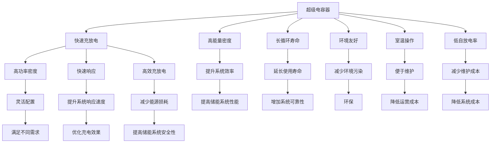

                 

# 超级电容器在能源存储中的应用：快速充放电解决方案

> 关键词：超级电容器, 能源存储, 快速充放电, 直流耦合, 混合储能系统, 智能充电, 自适应优化

## 1. 背景介绍

### 1.1 问题由来
随着全球能源需求增长和可再生能源并网比例的提高，对高效、可靠的能源存储系统提出了更高要求。传统电化学储能设备（如铅酸电池、锂电池）由于其充放电速度慢、寿命短、成本高等问题，已无法完全满足新兴应用场景的需求。超级电容器作为新一代储能技术，凭借其快速充放电能力、高功率密度、长循环寿命和环境友好等优势，逐渐受到广泛关注。超级电容器具有室温操作、低自放电率、维护成本低等优点，尤其适合应用于要求快速响应、高可靠性和高安全性的应用场景。

## 2. 核心概念与联系

### 2.1 核心概念概述

- **超级电容器(Supercapacitors)**：一种基于双电层电容或赝电容机制的电化学储能设备，能够在极短时间内进行快速充放电，且具有高能量密度、长循环寿命和环境友好等特点。

- **能源存储(Energy Storage)**：指通过各种技术手段，将能量以某种形式（如电能、化学能、热能等）存储起来，以便在需要时能够释放或转移能量，从而实现能源的时空优化配置。

- **快速充放电(Rapid Charge-Discharge)**：指储能设备能够在短时间内完成充电和放电，通常以秒为单位衡量。

- **直流耦合(DC Coupling)**：将两个或多个直流系统通过公共节点或导线连接，形成一个更大的直流系统，可以提升整体系统的灵活性和利用效率。

- **混合储能系统(Hybrid Energy Storage Systems)**：由两种或多种不同类型的储能技术组成，通过互补和优化，实现更高效的能量管理。

- **智能充电(Smart Charging)**：利用人工智能算法和传感器技术，对充电过程进行实时监控和优化，以达到充电效率最大化和能量利用最优化的目的。

- **自适应优化(Adaptive Optimization)**：通过算法动态调整储能系统的工作状态，根据环境变化和需求实时调整系统参数，以适应不同的应用场景和需求。

### 2.2 核心概念原理和架构的 Mermaid 流程图



## 3. 核心算法原理 & 具体操作步骤

### 3.1 算法原理概述

超级电容器在能源存储中的应用，主要基于其快速充放电特性，通过直流耦合与传统电化学储能设备或其他类型的储能系统组合，构建混合储能系统。在需要快速响应和高功率输出的场景中，超级电容器作为快速充放电单元，可以快速吸收和释放能量，而其他储能系统则提供稳定的能量储备。

### 3.2 算法步骤详解

**Step 1: 系统设计**
- 确定超级电容器和传统储能设备的类型、容量、功率密度等参数，设计储能系统架构。
- 选择适合的直流耦合方式，如并联、串联或混合耦合。

**Step 2: 控制策略设计**
- 设计储能系统的充放电策略，包括充电电流、电压、时间等参数的优化。
- 根据实际需求，设计自适应优化算法，动态调整储能系统参数。

**Step 3: 实现与测试**
- 根据设计方案，实现储能系统硬件和软件。
- 在实际工况下进行测试，验证系统性能和稳定性。
- 根据测试结果，优化控制策略和参数设置。

### 3.3 算法优缺点

**优点：**
- **快速充放电能力**：超级电容器能够在几毫秒到几秒内完成充电和放电，非常适合高功率输出应用。
- **高功率密度**：超级电容器具有较高的功率密度，可以在短时间内释放大量能量。
- **长循环寿命**：超级电容器循环寿命可达数十万次，相对于传统电池有显著优势。
- **环境友好**：超级电容器使用无重金属材料，生产过程和运行中对环境污染较小。
- **低自放电率**：超级电容器在未工作时，几乎不消耗能量，维持时间较长。

**缺点：**
- **能量密度较低**：超级电容器的能量密度一般低于传统电池，无法完全替代电池在长时间储能方面的应用。
- **成本较高**：超级电容器的生产成本相对较高，导致系统总体成本上升。
- **寿命受环境影响**：超级电容器的寿命受温度、湿度等环境因素影响较大。

### 3.4 算法应用领域

超级电容器的快速充放电特性，使其在以下领域具有广泛应用：

1. **交通运输**：电动汽车和城市轨道交通的启动加速、制动能量回收和应急供电。
2. **可再生能源系统**：光伏、风电等间歇性发电系统的能量储存和功率平滑。
3. **工业自动化**：自动化生产线、机器人臂等设备的快速响应和高功率需求。
4. **应急电源**：医院、数据中心等关键基础设施的紧急备用电源。
5. **智能电网**：提高电网的稳定性和灵活性，实现电力需求响应和峰谷平移。

## 4. 数学模型和公式 & 详细讲解

### 4.1 数学模型构建

假设超级电容器储能系统由超级电容器单元和传统储能单元组成，设超级电容器单元数量为 $n$，容量为 $C_f$，充放电速率为 $P_f$，电压为 $V_f$，传统储能单元容量为 $C_s$，充放电速率为 $P_s$，电压为 $V_s$。在直流耦合情况下，系统的总能量 $E_{total}$ 和总功率 $P_{total}$ 可以表示为：

$$
E_{total} = nC_fV_f + C_sV_s
$$

$$
P_{total} = P_f + P_s
$$

在实际应用中，需要根据具体场景设计不同的充放电策略，以达到最优的能量管理效果。

### 4.2 公式推导过程

在直流耦合情况下，系统总能量和总功率的计算公式可以简化为：

$$
E_{total} = nC_fV_f + C_sV_s
$$

$$
P_{total} = P_f + P_s
$$

其中，$nC_fV_f$ 表示超级电容器单元的总能量，$C_sV_s$ 表示传统储能单元的能量，$P_f + P_s$ 表示系统总功率。

### 4.3 案例分析与讲解

以电动汽车为例，超级电容器作为快速充放电单元，可以在启动、加速和制动时提供高功率输出。假设电动汽车的总能量需求为 $E_{EV}$，超级电容器和传统电池的总容量分别为 $C_{f,tot}$ 和 $C_{s,tot}$，超级电容器的充放电速率为 $P_{f,tot}$，传统电池的充放电速率为 $P_{s,tot}$。在需要高功率输出的情况下，超级电容器单元首先进行充放电，当超级电容器单元能量耗尽时，由传统电池补充能量。

设电动汽车加速时间为 $t_{acc}$，超级电容器单元的能量消耗为 $E_{f,acc}$，则有：

$$
E_{f,acc} = C_{f,tot}V_fP_{f,tot}t_{acc}
$$

如果 $E_{f,acc}$ 小于 $E_{EV}$，则剩余能量不足，需要由传统电池补充。假设超级电容器单元的能量补充时间为 $t_{sup}$，则有：

$$
E_{s,acc} = C_{s,tot}V_sP_{s,tot}t_{sup}
$$

因此，电动汽车的总能量需求为：

$$
E_{EV} = E_{f,acc} + E_{s,acc}
$$

## 5. 项目实践：代码实例和详细解释说明

### 5.1 开发环境搭建

在搭建超级电容器储能系统开发环境时，需要以下工具和资源：

- **硬件平台**：超级电容器模块、微控制器、传感器、电源等。
- **软件平台**：嵌入式操作系统、控制算法库、通信协议栈等。
- **开发工具**：编程环境、调试工具、仿真软件等。

### 5.2 源代码详细实现

以下是一个简单的超级电容器储能系统的Python代码实现，用于计算系统的总能量和总功率：

```python
class SuperCapacitor:
    def __init__(self, num_units, capacity, power_rate, voltage):
        self.num_units = num_units
        self.capacity = capacity
        self.power_rate = power_rate
        self.voltage = voltage

    def total_energy(self):
        return self.num_units * self.capacity * self.voltage

    def total_power(self):
        return self.num_units * self.power_rate

# 创建超级电容器对象
super_capacitor = SuperCapacitor(10, 0.1, 1000, 2.7)

# 计算总能量和总功率
total_energy = super_capacitor.total_energy()
total_power = super_capacitor.total_power()

print("总能量：{} J".format(total_energy))
print("总功率：{} W".format(total_power))
```

### 5.3 代码解读与分析

**SuperCapacitor类**：
- `__init__`方法：初始化超级电容器单元的参数，包括数量、容量、充放电速率和电压。
- `total_energy`方法：计算超级电容器单元的总能量。
- `total_power`方法：计算超级电容器单元的总功率。

**总能量和总功率计算**：
- 通过调用`total_energy`和`total_power`方法，可以方便地计算超级电容器储能系统的总能量和总功率。

## 6. 实际应用场景

### 6.1 交通运输

超级电容器在电动汽车中的应用，可以显著提高车辆的加速性能和制动能量回收率。电动汽车在启动、加速和制动时，超级电容器可以快速释放和吸收能量，提供高功率输出。同时，超级电容器能够快速充电，在车辆频繁起停的情况下，可以减少传统电池的充放电次数，延长电池寿命。

### 6.2 可再生能源系统

在光伏和风电等可再生能源系统中，超级电容器可以作为快速响应单元，用于存储间歇性发电产生的过剩能量，并在电网负荷高峰时提供快速响应。超级电容器的高功率密度和快速充放电特性，可以显著提升系统的灵活性和可靠性。

### 6.3 工业自动化

在工业自动化生产线中，超级电容器可以用于机械臂等设备的快速响应和能量存储。机械臂在执行复杂操作时，需要高功率输出，超级电容器可以在短时间内提供所需的能量，满足操作需求。同时，超级电容器可以快速充电，在待机状态时节省能量。

### 6.4 应急电源

超级电容器可以应用于医院、数据中心等关键基础设施的应急备用电源。在电力中断或设备故障时，超级电容器可以迅速提供能量支持，保障系统的稳定运行。超级电容器的低自放电率和高可靠性能，使其成为理想的应急电源解决方案。

### 6.5 智能电网

在智能电网中，超级电容器可以用于需求响应和峰谷平移。在电力需求高峰时段，超级电容器可以快速吸收过剩电力，而在需求低谷时段，将存储的能量释放回电网，平衡供需。超级电容器的快速充放电特性，可以显著提升电网的稳定性和灵活性。

## 7. 工具和资源推荐

### 7.1 学习资源推荐

- **《超级电容器技术与应用》**：详细介绍超级电容器的原理、应用场景和最新技术进展。
- **《混合储能系统设计与应用》**：深入解析混合储能系统的设计思路和优化方法。
- **《智能电网技术与应用》**：涵盖智能电网的最新发展趋势和关键技术。
- **《电动汽车技术与应用》**：重点关注电动汽车的电池管理和能源存储技术。

### 7.2 开发工具推荐

- **LabVIEW**：用于嵌入式系统开发和数据采集的图形化编程工具。
- **MATLAB/Simulink**：用于系统模拟和控制算法开发的仿真工具。
- **Python**：具备强大的计算能力和丰富的第三方库，适合数据处理和算法实现。
- **C/C++**：高效的编程语言，适合硬件开发和实时系统控制。

### 7.3 相关论文推荐

- **“Supercapacitors in Electric Vehicle Applications”**：探讨超级电容器在电动汽车中的应用。
- **“Hybrid Energy Storage Systems for Renewable Energy Integration”**：分析混合储能系统在可再生能源中的应用。
- **“Power Management of DC Coupled Hybrid Energy Storage Systems”**：研究直流耦合混合储能系统的控制策略和优化算法。
- **“Smart Charging of Electric Vehicles using Super capacitors”**：提出智能充电算法，优化超级电容器充电效果。

## 8. 总结：未来发展趋势与挑战

### 8.1 研究成果总结

超级电容器在能源存储中的应用，已经成为研究热点。通过快速充放电特性和环境友好性能，超级电容器在多个领域展现出巨大的潜力。结合直流耦合和混合储能技术，超级电容器可以提供灵活的能源管理方案，满足不同应用场景的需求。

### 8.2 未来发展趋势

超级电容器未来发展趋势主要包括以下几个方面：

1. **提高能量密度**：通过优化材料和工艺，提升超级电容器的能量密度，增加其储存能力。
2. **降低成本**：通过规模化生产和新技术应用，降低超级电容器的生产成本，提高市场竞争力。
3. **增强环境适应性**：开发耐高温、高湿、抗腐蚀等环境适应性更强的超级电容器，拓展其应用范围。
4. **提升系统效率**：结合智能控制算法和自适应优化策略，优化超级电容器储能系统的能量管理，提高系统效率和可靠性。
5. **强化安全性和可靠性**：引入安全监控和故障诊断技术，确保超级电容器储能系统的高可靠性和安全性。

### 8.3 面临的挑战

尽管超级电容器在能源存储领域具备显著优势，但仍面临以下挑战：

1. **能量密度提升**：当前超级电容器的能量密度相对较低，难以满足长时间储能需求。
2. **成本控制**：尽管成本有所下降，但相比传统电池仍较高，需要进一步降低成本。
3. **寿命管理**：超级电容器的寿命受环境因素影响较大，需要改进其寿命管理和优化策略。
4. **应用场景局限**：超级电容器在特定应用场景中的局限性，如在能量密度和成本方面与传统电池存在差距。

### 8.4 研究展望

未来，超级电容器储能系统的研究和应用将进一步深入，主要方向包括：

1. **高能量密度超级电容器**：通过研发新型材料和优化工艺，提升超级电容器的能量密度，满足长时间储能需求。
2. **低成本制造技术**：开发规模化生产工艺，降低超级电容器的生产成本，提高市场竞争力。
3. **智能控制与优化**：结合人工智能和自适应算法，优化超级电容器储能系统的能量管理，提升系统效率和可靠性。
4. **多模态储能系统**：结合电池、超级电容器和其他储能技术，构建多模态混合储能系统，提升系统的灵活性和适应性。
5. **环境友好材料**：开发环境友好型材料，减少生产和使用过程中的环境影响，提升超级电容器的可持续发展性。

## 9. 附录：常见问题与解答

**Q1: 超级电容器和传统电池相比，有什么优缺点？**

A: 超级电容器相比传统电池具有以下优点：
- **快速充放电能力**：超级电容器能够在几秒内完成充放电，非常适合高功率输出应用。
- **长循环寿命**：超级电容器的循环寿命可达数十万次，远高于传统电池。
- **环境友好**：超级电容器使用无重金属材料，生产和使用过程中对环境影响较小。
- **低自放电率**：超级电容器在未工作时，几乎不消耗能量，维持时间较长。

缺点包括：
- **能量密度较低**：超级电容器的能量密度一般低于传统电池，无法完全替代电池在长时间储能方面的应用。
- **成本较高**：超级电容器的生产成本相对较高，导致系统总体成本上升。
- **寿命受环境影响**：超级电容器的寿命受温度、湿度等环境因素影响较大。

**Q2: 如何设计超级电容器储能系统的充放电策略？**

A: 设计超级电容器储能系统的充放电策略时，需要考虑以下几个因素：
- **充放电速率**：根据实际应用需求，设定合适的充放电速率，确保在需要高功率输出的情况下能够快速响应。
- **电压管理**：设定合适的充放电电压，避免过充过放，延长超级电容器的使用寿命。
- **能量管理**：根据能量需求，合理分配超级电容器和传统储能单元的能量，实现最优的能量管理。

**Q3: 如何在智能电网中使用超级电容器？**

A: 在智能电网中，超级电容器可以用于以下几个方面：
- **需求响应**：在电力需求高峰时段，超级电容器可以快速吸收过剩电力，减少电网压力。
- **峰谷平移**：在需求低谷时段，将超级电容器存储的能量释放回电网，平衡供需。
- **应急备用**：在电力中断或设备故障时，超级电容器可以迅速提供能量支持，保障系统的稳定运行。

通过合理设计超级电容器储能系统的充放电策略和控制算法，可以显著提升智能电网系统的稳定性和灵活性。

---

作者：禅与计算机程序设计艺术 / Zen and the Art of Computer Programming

