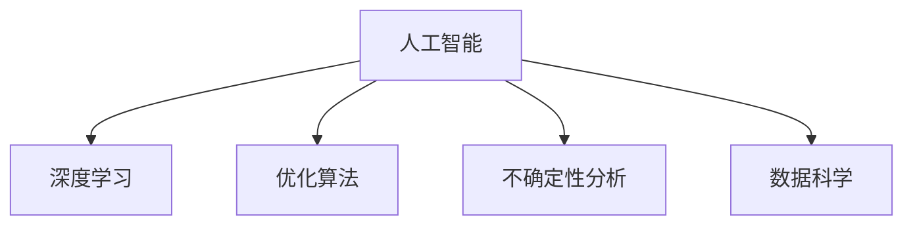

                 

# 超越不确定性的最好工具就是AI

> 关键词：人工智能,不确定性,决策支持,优化算法,深度学习,数据科学

## 1. 背景介绍

### 1.1 问题由来

在当今这个充满变化和不确定性的世界，人类面临着前所未有的挑战。气候变化、金融危机、公共卫生事件等全球性问题，要求我们必须能够在极短的时间内做出明智的决策。然而，传统的数据驱动决策方法，由于缺乏必要的自动化和智能化支持，往往需要大量的人力和时间。同时，这些方法往往无法很好地处理非结构化数据和复杂关联关系，导致结果不精确、预测不准确。

面对这些问题，人工智能（AI）技术，尤其是基于深度学习的AI，逐渐成为解决不确定性问题的重要工具。AI可以通过对大量数据进行学习，自动发现数据中的模式和规律，快速做出决策，从而帮助我们应对各种复杂挑战。

### 1.2 问题核心关键点

AI的核心理念在于利用数据和算法，自动发现知识并生成智能化决策。其核心关键点包括：

- **数据驱动决策**：AI通过机器学习算法，对大量数据进行模式识别和关联分析，自动生成决策依据。
- **自动化优化**：AI可以自动化地进行参数调优，选择最优决策方案，无需人工干预。
- **处理非结构化数据**：AI能够处理文本、图像、音频等多种形式的数据，涵盖不同类型的不确定性问题。
- **动态学习**：AI可以通过实时数据进行学习，动态调整决策策略，应对不断变化的环境。

这些关键点使得AI在处理不确定性问题上具有独特的优势。通过本文的系统梳理，希望能够帮助读者更深刻地理解AI技术在应对不确定性问题中的应用，并掌握如何利用AI技术提升决策质量。

## 2. 核心概念与联系

### 2.1 核心概念概述

为更好地理解AI技术在处理不确定性问题上的应用，本节将介绍几个密切相关的核心概念：

- **人工智能(AI)**：利用算法和机器学习技术，使计算机系统能够模拟人类的决策和行为能力。AI包括机器学习、深度学习、自然语言处理等多种技术。
- **不确定性分析**：通过数学和统计方法，对决策过程中存在的不确定性和风险进行分析，预测结果的可能性和影响。
- **优化算法**：在给定约束条件下，通过搜索或迭代方法，找到最优解或近似最优解。
- **深度学习**：一种基于神经网络的机器学习方法，通过多层非线性变换，自动学习数据的特征和规律。
- **数据科学**：通过收集、清洗、分析和可视化数据，提取有价值的信息，支持决策和业务洞察。

这些概念之间的逻辑关系可以通过以下Mermaid流程图来展示：



这个流程图展示了一些核心概念及其之间的关系：

1. 人工智能是整个领域的核心，涵盖深度学习、优化算法、不确定性分析等多个方向。
2. 深度学习作为AI的重要分支，通过非线性变换学习数据特征，自动生成决策依据。
3. 优化算法帮助深度学习模型搜索最优参数组合，提升模型性能。
4. 不确定性分析通过统计方法，评估决策结果的准确性和风险，为决策提供科学依据。
5. 数据科学作为AI的基础，通过数据处理和分析，提取有价值的信息，支持决策过程。

这些核心概念共同构成了AI技术的框架，使其能够在处理不确定性问题时发挥强大的作用。

## 3. 核心算法原理 & 具体操作步骤

### 3.1 算法原理概述

AI处理不确定性问题，主要通过以下步骤进行：

1. **数据收集与预处理**：收集与问题相关的数据，并进行清洗、归一化等预处理，确保数据质量和一致性。
2. **模型构建与训练**：选择合适的模型结构，并利用训练数据进行模型训练，优化模型参数，使其能够拟合数据特征。
3. **不确定性分析与评估**：使用统计和概率方法，对模型进行不确定性分析，评估其预测结果的准确性和风险。
4. **优化与调整**：根据评估结果，调整模型参数，优化模型性能，提升预测准确性。
5. **决策与反馈**：基于优化后的模型，进行决策，并对结果进行反馈，进一步优化模型和决策策略。

这一过程是一个循环迭代的过程，通过不断优化和调整，提升AI系统的决策质量。

### 3.2 算法步骤详解

以下将详细介绍AI处理不确定性问题的核心算法步骤：

**Step 1: 数据收集与预处理**

- 收集与问题相关的数据，确保数据的多样性和代表性。
- 清洗数据，去除噪声和异常值，确保数据质量。
- 进行数据归一化和特征工程，提升模型性能。

**Step 2: 模型构建与训练**

- 选择合适的模型结构，如深度神经网络、决策树、随机森林等。
- 利用训练数据进行模型训练，优化模型参数。
- 使用验证集对模型进行评估，选择合适的超参数。

**Step 3: 不确定性分析与评估**

- 使用统计和概率方法，对模型进行不确定性分析，评估其预测结果的准确性和风险。
- 计算模型的方差、置信区间等统计量，评估模型预测的不确定性。
- 使用交叉验证等方法，评估模型的泛化能力。

**Step 4: 优化与调整**

- 根据评估结果，调整模型参数，提升模型性能。
- 引入正则化技术，防止模型过拟合。
- 使用集成学习等方法，提升模型鲁棒性。

**Step 5: 决策与反馈**

- 基于优化后的模型，进行决策。
- 对决策结果进行反馈，进一步优化模型和决策策略。
- 实时监控决策过程，及时调整策略，应对环境变化。

通过上述步骤，AI系统能够自动发现数据中的模式和规律，进行决策，并不断优化和调整，提升决策质量。

### 3.3 算法优缺点

AI处理不确定性问题的优势在于：

- **自动化决策**：自动发现数据中的模式和规律，无需人工干预，快速做出决策。
- **处理复杂问题**：能够处理各种形式的数据，涵盖不同类型的不确定性问题。
- **动态调整**：通过实时数据进行学习，动态调整决策策略，应对不断变化的环境。

然而，AI处理不确定性问题也存在一些局限性：

- **数据依赖**：AI系统依赖于数据质量，如果数据不充分或存在偏差，可能导致决策失误。
- **模型复杂**：深度学习模型参数量巨大，训练和推理资源消耗大，可能难以在资源受限的环境下应用。
- **解释性不足**：AI系统决策过程复杂，难以解释其内部工作机制和决策逻辑。

尽管存在这些局限性，但AI在处理不确定性问题上的优势是显而易见的。通过不断优化和调整，AI有望在更多领域实现规模化应用。

### 3.4 算法应用领域

AI处理不确定性问题，已在多个领域得到了广泛应用：

- **金融风险管理**：利用AI进行信用评分、投资组合优化、风险预测等，提升金融决策的科学性和准确性。
- **医疗健康管理**：通过AI进行疾病预测、药物研发、个性化治疗等，提升医疗决策的精准性和有效性。
- **交通管理**：利用AI进行交通流量预测、车辆调度、交通事故预防等，提升交通管理的智能化水平。
- **环境保护**：通过AI进行环境监测、污染源追踪、气候变化预测等，支持环境保护和治理。
- **智能制造**：利用AI进行设备维护、质量控制、生产调度等，提升制造业的自动化和智能化水平。

此外，AI还在智能家居、智能客服、智能推荐等多个领域得到应用，提升用户体验和决策质量。随着AI技术的不断进步，其在处理不确定性问题上的应用将越来越广泛，成为推动社会进步的重要工具。

## 4. 数学模型和公式 & 详细讲解 & 举例说明

### 4.1 数学模型构建

AI处理不确定性问题，主要通过以下数学模型进行建模：

- **线性回归模型**：通过线性变换，建立输入和输出之间的线性关系，适用于简单线性问题的处理。
- **决策树模型**：通过树形结构，对数据进行分类和回归，适用于处理分类问题和回归问题。
- **随机森林模型**：通过多棵决策树的集成，提升模型的鲁棒性和泛化能力，适用于处理复杂的分类和回归问题。
- **神经网络模型**：通过多层非线性变换，自动学习数据的特征和规律，适用于处理大规模的非结构化数据。
- **贝叶斯网络模型**：通过概率图模型，建立变量之间的依赖关系，适用于处理不确定性和概率问题。

### 4.2 公式推导过程

以线性回归模型为例，推导其最小二乘法公式：

假设线性回归模型为 $y = \theta_0 + \theta_1 x_1 + \theta_2 x_2 + \cdots + \theta_n x_n$，其中 $y$ 为输出变量，$\theta_0,\theta_1,\cdots,\theta_n$ 为模型参数，$x_1,x_2,\cdots,x_n$ 为输入变量。

通过最小二乘法，可以求得最优的模型参数 $\hat{\theta}$，使得预测值 $y^{\text{pred}} = \theta_0 + \theta_1 x_1 + \theta_2 x_2 + \cdots + \theta_n x_n$ 与真实值 $y^{\text{true}}$ 之间的误差最小。

最小二乘法的目标函数为：

$$
\sum_{i=1}^m (y_i - y^{\text{pred}}_i)^2
$$

其中 $m$ 为样本数，$y_i$ 为第 $i$ 个样本的真实值，$y^{\text{pred}}_i$ 为第 $i$ 个样本的预测值。

通过求解目标函数的导数，可以求得最优的模型参数 $\hat{\theta}$：

$$
\hat{\theta} = (\sum_{i=1}^m x_i x_i^T)^{-1} \sum_{i=1}^m x_i y_i
$$

其中 $x_i x_i^T$ 为样本的协方差矩阵，$x_i y_i$ 为样本的特征向量和响应向量的外积矩阵。

这个公式展示了最小二乘法的基本原理，通过最小化误差，自动发现数据中的线性关系，进行决策。

### 4.3 案例分析与讲解

**案例1: 金融风险预测**

假设某银行有历史贷款数据，包含贷款金额、还款期限、还款频率、违约与否等属性。利用线性回归模型，可以建立违约概率与这些属性之间的线性关系。通过最小二乘法，自动发现最优的模型参数，用于预测新贷款的违约概率。

**案例2: 医疗诊断**

某医院收集了历史患者的病历数据，包含症状、检查结果、诊断等属性。利用决策树模型，可以建立疾病诊断与这些属性之间的分类关系。通过随机森林模型，自动发现最优的模型参数，用于预测新患者的疾病诊断。

这些案例展示了AI在处理不确定性问题上的广泛应用，通过数据驱动决策，提升决策的科学性和准确性。

## 5. 项目实践：代码实例和详细解释说明

### 5.1 开发环境搭建

在进行AI项目实践前，我们需要准备好开发环境。以下是使用Python进行PyTorch开发的环境配置流程：

1. 安装Anaconda：从官网下载并安装Anaconda，用于创建独立的Python环境。

2. 创建并激活虚拟环境：
```bash
conda create -n ai-env python=3.8 
conda activate ai-env
```

3. 安装PyTorch：根据CUDA版本，从官网获取对应的安装命令。例如：
```bash
conda install pytorch torchvision torchaudio cudatoolkit=11.1 -c pytorch -c conda-forge
```

4. 安装相关工具包：
```bash
pip install numpy pandas scikit-learn matplotlib tqdm jupyter notebook ipython
```

完成上述步骤后，即可在`ai-env`环境中开始AI实践。

### 5.2 源代码详细实现

下面我们以线性回归模型为例，给出使用PyTorch进行线性回归的PyTorch代码实现。

首先，定义数据集和模型：

```python
import torch
import torch.nn as nn
import torch.optim as optim
from sklearn.datasets import make_regression

# 生成模拟数据
X, y = make_regression(n_samples=1000, n_features=5, noise=0.5, random_state=42)

# 定义模型
class LinearRegression(nn.Module):
    def __init__(self, input_dim):
        super(LinearRegression, self).__init__()
        self.linear = nn.Linear(input_dim, 1)
        
    def forward(self, x):
        return self.linear(x)

# 定义优化器和损失函数
model = LinearRegression(input_dim=5)
optimizer = optim.SGD(model.parameters(), lr=0.01)
loss_fn = nn.MSELoss()

# 将数据转换为PyTorch张量
X_tensor = torch.from_numpy(X).float()
y_tensor = torch.from_numpy(y).float()

# 定义训练函数
def train_epoch(model, X_tensor, y_tensor, optimizer, loss_fn):
    model.train()
    loss = 0
    for i in range(len(X_tensor)):
        optimizer.zero_grad()
        y_pred = model(X_tensor[i].unsqueeze(0))
        loss = loss_fn(y_pred, y_tensor[i].unsqueeze(0))
        loss.backward()
        optimizer.step()
    return loss.item()

# 训练模型
for epoch in range(1000):
    loss = train_epoch(model, X_tensor, y_tensor, optimizer, loss_fn)
    print(f"Epoch {epoch+1}, loss: {loss:.4f}")
```

通过这个简单的代码示例，我们可以看到，利用PyTorch框架，我们可以很容易地构建和训练线性回归模型。

### 5.3 代码解读与分析

让我们再详细解读一下关键代码的实现细节：

**make_regression函数**：
- 生成一个包含1000个样本，5个特征和一个响应变量的模拟数据集。

**LinearRegression类**：
- 定义一个线性回归模型，包含一个线性层。

**train_epoch函数**：
- 定义一个训练函数，在每个epoch内进行模型训练。
- 对于每个样本，前向传播计算预测值和真实值的误差，反向传播更新模型参数。

**训练过程**：
- 对于每个epoch，计算损失值并输出。

通过这个代码示例，我们可以看到，利用PyTorch框架，我们可以快速地实现线性回归模型的训练过程。

## 6. 实际应用场景

### 6.1 金融风险管理

金融行业面对的不确定性问题多种多样，如信用评分、投资组合优化、风险预测等。利用AI技术，可以有效地提升金融决策的科学性和准确性。

例如，利用线性回归模型，可以建立违约概率与贷款属性之间的关系。通过最小二乘法，自动发现最优的模型参数，用于预测新贷款的违约概率。这不仅可以提升贷款审批的效率，还能减少坏账风险。

### 6.2 医疗健康管理

医疗行业面临的不确定性问题复杂多样，如疾病预测、药物研发、个性化治疗等。利用AI技术，可以显著提升医疗决策的精准性和有效性。

例如，利用决策树模型，可以建立疾病预测与患者属性之间的关系。通过随机森林模型，自动发现最优的模型参数，用于预测新患者的疾病。这不仅可以提高诊断效率，还能提升治疗效果。

### 6.3 交通管理

交通行业面临的不确定性问题包括交通流量预测、车辆调度、交通事故预防等。利用AI技术，可以显著提升交通管理的智能化水平。

例如，利用神经网络模型，可以建立交通流量与多个因素之间的关系。通过深度学习模型，自动发现最优的模型参数，用于预测交通流量。这不仅可以优化交通调度，还能减少交通事故。

### 6.4 环境保护

环境保护面临的不确定性问题包括环境监测、污染源追踪、气候变化预测等。利用AI技术，可以支持环境保护和治理。

例如，利用贝叶斯网络模型，可以建立环境监测数据与多种因素之间的关系。通过概率图模型，自动发现最优的模型参数，用于预测环境变化。这不仅可以提高环境监测的准确性，还能支持污染源追踪和气候变化预测。

## 7. 工具和资源推荐

### 7.1 学习资源推荐

为了帮助开发者系统掌握AI技术在处理不确定性问题中的应用，这里推荐一些优质的学习资源：

1. 《机器学习》系列书籍：由Tom Mitchell和Christopher Bishop撰写，深入浅出地介绍了机器学习的基本概念和算法。
2. 《深度学习》系列书籍：由Ian Goodfellow、Yoshua Bengio和Aaron Courville撰写，全面介绍了深度学习的基本原理和实践方法。
3. 《数据科学导论》系列书籍：由Joel Grus和Stefanie Molin撰写，涵盖了数据收集、清洗、分析和可视化等关键技能。
4. Coursera《机器学习》课程：由Andrew Ng讲授，是机器学习领域的经典课程，系统介绍了机器学习的基本理论和算法。
5. edX《深度学习》课程：由David Cox、Hector Kallus和Rosa E. M. G. Pitroda讲授，全面介绍了深度学习的基本原理和实践方法。

通过对这些资源的学习实践，相信你一定能够快速掌握AI技术在处理不确定性问题上的应用，并应用于实际场景中。

### 7.2 开发工具推荐

高效的开发离不开优秀的工具支持。以下是几款用于AI项目开发的常用工具：

1. PyTorch：基于Python的开源深度学习框架，灵活动态的计算图，适合快速迭代研究。大部分AI模型都有PyTorch版本的实现。
2. TensorFlow：由Google主导开发的开源深度学习框架，生产部署方便，适合大规模工程应用。同样有丰富的AI模型资源。
3. Scikit-learn：基于Python的机器学习库，包含多种经典算法和工具，适合快速原型开发。
4. Keras：高层次的神经网络库，使用简单，易于上手，适合快速实验验证。
5. Weights & Biases：模型训练的实验跟踪工具，可以记录和可视化模型训练过程中的各项指标，方便对比和调优。与主流深度学习框架无缝集成。

合理利用这些工具，可以显著提升AI项目开发的效率，加快创新迭代的步伐。

### 7.3 相关论文推荐

AI处理不确定性问题，源于学界的持续研究。以下是几篇奠基性的相关论文，推荐阅读：

1. Backpropagation: Application to Handwritten Zip Code Recognition（1989年论文）：提出了反向传播算法，为深度学习提供了基础的数学基础。
2. Deep Blue Book（《深度学习》）：Ian Goodfellow、Yoshua Bengio和Aaron Courville撰写的经典教材，全面介绍了深度学习的基本原理和实践方法。
3. Neural Networks and Deep Learning（《神经网络与深度学习》）：Michael Nielsen撰写的经典教材，深入浅出地介绍了神经网络的基本原理和算法。
4. Foundations of Statistical Learning（《统计学习基础》）：Gareth James、Daniela Witten和Trevor Hastie撰写的经典教材，涵盖了统计学习的基本概念和算法。
5. Data Science for Business（《数据科学实践》）：Peter Facchini、James T. Moore和Sandra Hofmann撰写的经典教材，介绍了数据科学在实际业务中的应用。

这些论文代表了大AI处理不确定性问题的发展脉络。通过学习这些前沿成果，可以帮助研究者把握学科前进方向，激发更多的创新灵感。

## 8. 总结：未来发展趋势与挑战

### 8.1 总结

本文对AI技术在处理不确定性问题上的应用进行了全面系统的介绍。首先阐述了AI技术的核心理念和应用背景，明确了AI在处理不确定性问题上的独特优势。其次，从原理到实践，详细讲解了AI处理不确定性问题的数学模型和操作步骤，给出了AI项目开发的完整代码实例。同时，本文还广泛探讨了AI技术在金融、医疗、交通、环保等多个领域的应用前景，展示了AI技术的广泛适用性。此外，本文精选了AI技术的学习资源，力求为读者提供全方位的技术指引。

通过本文的系统梳理，可以看到，AI技术在处理不确定性问题上具有强大的能力，能够通过数据驱动决策，提升决策的科学性和准确性。随着AI技术的不断进步，其在处理不确定性问题上的应用将越来越广泛，成为推动社会进步的重要工具。

### 8.2 未来发展趋势

展望未来，AI技术在处理不确定性问题上的发展趋势将呈现以下几个方向：

1. **自动化决策**：通过深度学习和优化算法，自动发现数据中的模式和规律，快速做出决策，无需人工干预。
2. **动态学习**：利用实时数据进行学习，动态调整决策策略，应对不断变化的环境。
3. **跨领域应用**：AI技术将在更多领域得到应用，如金融、医疗、交通、环保等，提升各行业的决策效率和效果。
4. **增强解释性**：利用可解释性技术，提升AI系统的决策透明度，使其更具可信度和可控性。
5. **多模态融合**：通过将文本、图像、音频等多模态数据融合，提升AI系统的决策能力。
6. **人机协同**：在决策过程中引入人类专家知识，提升AI系统的鲁棒性和准确性。

这些趋势展示了AI技术在处理不确定性问题上的广阔前景。通过不断优化和调整，AI系统有望在更多领域实现规模化应用，成为推动社会进步的重要工具。

### 8.3 面临的挑战

尽管AI技术在处理不确定性问题上具有强大的能力，但在迈向更加智能化、普适化应用的过程中，仍面临诸多挑战：

1. **数据依赖**：AI系统依赖于数据质量，如果数据不充分或存在偏差，可能导致决策失误。
2. **模型复杂**：深度学习模型参数量巨大，训练和推理资源消耗大，可能难以在资源受限的环境下应用。
3. **解释性不足**：AI系统决策过程复杂，难以解释其内部工作机制和决策逻辑。
4. **鲁棒性不足**：AI系统面对域外数据时，泛化性能往往大打折扣。
5. **安全性有待保障**：AI系统可能学习到有偏见、有害的信息，通过决策传递到实际应用，产生误导性、歧视性的输出，给实际应用带来安全隐患。

尽管存在这些挑战，但AI技术在处理不确定性问题上的优势是显而易见的。通过不断优化和调整，AI系统有望在更多领域实现规模化应用，成为推动社会进步的重要工具。

### 8.4 研究展望

面对AI技术在处理不确定性问题上所面临的挑战，未来的研究需要在以下几个方面寻求新的突破：

1. **数据增强**：通过数据增强技术，生成更多高质量的训练数据，提升模型泛化能力。
2. **参数高效**：开发更加参数高效的模型，在固定大部分预训练参数的同时，只更新极少量的任务相关参数，减小资源消耗。
3. **多模态融合**：通过将文本、图像、音频等多模态数据融合，提升AI系统的决策能力。
4. **增强解释性**：利用可解释性技术，提升AI系统的决策透明度，使其更具可信度和可控性。
5. **跨领域应用**：在更多领域推广AI技术，提升各行业的决策效率和效果。

这些研究方向将推动AI技术在处理不确定性问题上的不断进步，为构建安全、可靠、可解释、可控的智能系统铺平道路。面向未来，AI技术还需要与其他AI技术进行更深入的融合，如知识表示、因果推理、强化学习等，多路径协同发力，共同推动自然语言理解和智能交互系统的进步。

## 9. 附录：常见问题与解答

**Q1：AI处理不确定性问题的优势和局限性分别是什么？**

A: AI处理不确定性问题的优势在于能够通过数据驱动决策，自动发现数据中的模式和规律，快速做出决策。同时，AI系统能够处理大规模非结构化数据，涵盖不同类型的不确定性问题。

然而，AI处理不确定性问题也存在一些局限性：
- 数据依赖：AI系统依赖于数据质量，如果数据不充分或存在偏差，可能导致决策失误。
- 模型复杂：深度学习模型参数量巨大，训练和推理资源消耗大，可能难以在资源受限的环境下应用。
- 解释性不足：AI系统决策过程复杂，难以解释其内部工作机制和决策逻辑。
- 鲁棒性不足：AI系统面对域外数据时，泛化性能往往大打折扣。
- 安全性有待保障：AI系统可能学习到有偏见、有害的信息，通过决策传递到实际应用，产生误导性、歧视性的输出，给实际应用带来安全隐患。

尽管存在这些局限性，但AI在处理不确定性问题上的优势是显而易见的。通过不断优化和调整，AI系统有望在更多领域实现规模化应用，成为推动社会进步的重要工具。

**Q2：如何选择适合的AI模型处理不确定性问题？**

A: 选择适合的AI模型处理不确定性问题，需要根据具体问题类型和数据特点进行选择。
- 对于简单线性问题，可以选择线性回归模型。
- 对于分类和回归问题，可以选择决策树、随机森林、神经网络等模型。
- 对于多模态数据，可以选择多模态融合模型。
- 对于需要解释性的问题，可以选择可解释性较强的模型。
- 对于需要处理大规模数据的问题，可以选择分布式训练模型。

选择合适的AI模型，需要综合考虑问题类型、数据特点、模型性能等因素，确保模型能够有效地处理不确定性问题。

**Q3：如何在实际应用中提升AI系统的鲁棒性和解释性？**

A: 提升AI系统的鲁棒性和解释性，可以从以下几个方面入手：
- 数据增强：通过数据增强技术，生成更多高质量的训练数据，提升模型泛化能力。
- 参数高效：开发更加参数高效的模型，在固定大部分预训练参数的同时，只更新极少量的任务相关参数，减小资源消耗。
- 多模态融合：通过将文本、图像、音频等多模态数据融合，提升AI系统的决策能力。
- 增强解释性：利用可解释性技术，提升AI系统的决策透明度，使其更具可信度和可控性。
- 引入专家知识：在决策过程中引入人类专家知识，提升AI系统的鲁棒性和准确性。

通过这些措施，可以有效提升AI系统的鲁棒性和解释性，使其更好地应对不确定性问题。

**Q4：AI在处理不确定性问题上，与传统数据驱动方法相比，有哪些优势？**

A: AI在处理不确定性问题上，与传统数据驱动方法相比，具有以下优势：
- 自动化决策：通过深度学习和优化算法，自动发现数据中的模式和规律，快速做出决策，无需人工干预。
- 处理复杂问题：能够处理各种形式的数据，涵盖不同类型的不确定性问题。
- 动态调整：利用实时数据进行学习，动态调整决策策略，应对不断变化的环境。
- 多模态融合：通过将文本、图像、音频等多模态数据融合，提升AI系统的决策能力。
- 增强解释性：利用可解释性技术，提升AI系统的决策透明度，使其更具可信度和可控性。

这些优势使得AI在处理不确定性问题上，具有更强的灵活性和适应性，能够更好地应对复杂和变化的环境。

**Q5：AI在处理不确定性问题上，有哪些应用场景？**

A: AI在处理不确定性问题上，已经在多个领域得到了广泛应用，包括：
- 金融风险管理：利用AI进行信用评分、投资组合优化、风险预测等，提升金融决策的科学性和准确性。
- 医疗健康管理：利用AI进行疾病预测、药物研发、个性化治疗等，提升医疗决策的精准性和有效性。
- 交通管理：利用AI进行交通流量预测、车辆调度、交通事故预防等，提升交通管理的智能化水平。
- 环境保护：利用AI进行环境监测、污染源追踪、气候变化预测等，支持环境保护和治理。
- 智能制造：利用AI进行设备维护、质量控制、生产调度等，提升制造业的自动化和智能化水平。

此外，AI还在智能家居、智能客服、智能推荐等多个领域得到应用，提升用户体验和决策质量。

---

作者：禅与计算机程序设计艺术 / Zen and the Art of Computer Programming

