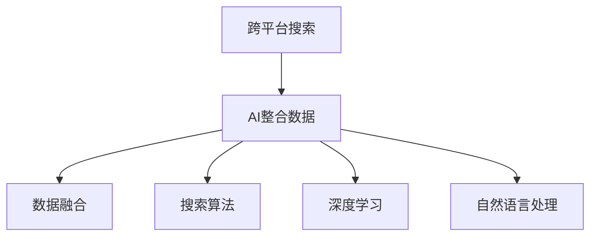

                 

# 跨平台搜索技术：AI整合数据

> 关键词：跨平台搜索, AI整合, 数据融合, 搜索算法, 深度学习, 自然语言处理

## 1. 背景介绍

在当今信息爆炸的时代，数据已经成为了各行各业的重要资产。无论是个人用户，还是企业客户，都需要快速获取和整合数据，才能在竞争中立于不败之地。然而，由于数据的分散性、异构性和多样性，如何高效地检索、整合和应用数据，成为了一个亟待解决的难题。

### 1.1 问题由来

互联网的普及使得数据呈现指数级的增长，且数据来源多样化，包括文本、图片、视频、音频等多种形式。每个平台都有自己独特的数据格式和存储方式，导致数据间难以直接对接和整合。同时，由于不同用户、不同领域的数据需求各异，传统的搜索技术已经难以满足跨平台、多模式数据整合的需求。

### 1.2 问题核心关键点

为了解决上述问题，人们提出了跨平台搜索技术。该技术旨在通过人工智能和自然语言处理技术，整合异构数据源，建立统一的数据检索和查询引擎，让用户能够在一个平台内检索到所有相关数据。其核心关键点包括：

1. **数据源统一化**：通过技术手段将不同数据源的数据整合到一个标准化的数据池中。
2. **语义理解**：利用自然语言处理技术理解用户查询的语义，自动匹配相关数据。
3. **多模态数据融合**：将文本、图片、视频等多种数据类型进行融合，提高数据的关联性和完备性。
4. **智能推荐**：基于用户历史行为和语义信息，智能推荐相关数据。
5. **跨平台扩展性**：确保跨平台搜索系统具有高度的可扩展性，支持不同设备和应用场景。

## 2. 核心概念与联系

### 2.1 核心概念概述

为更好地理解跨平台搜索技术的核心概念，本节将介绍几个密切相关的核心概念：

- **跨平台搜索**：跨平台搜索技术，旨在通过技术手段整合异构数据源，提供统一的数据检索和查询服务。
- **AI整合数据**：利用人工智能技术整合不同数据源，建立统一的数据池，实现跨平台、多模态数据的融合和检索。
- **数据融合**：将不同数据源的数据进行集成和整合，建立统一的数据模型。
- **搜索算法**：在跨平台搜索系统中，使用高效的算法实现数据的快速检索和匹配。
- **深度学习**：利用深度学习模型处理高维度的数据特征，提高检索精度。
- **自然语言处理**：理解和解析用户查询，将其转化为可执行的检索指令。

这些核心概念之间的逻辑关系可以通过以下Mermaid流程图来展示：



这个流程图展示了大规模搜索技术的主要组成部分及其之间的联系：

1. **跨平台搜索**：核心目标，即提供统一的检索服务。
2. **AI整合数据**：关键手段，通过技术将不同数据源的数据整合到一个标准化的数据池中。
3. **数据融合**：基础步骤，将不同数据源的数据进行集成和整合，建立统一的数据模型。
4. **搜索算法**：实现手段，利用高效的算法实现数据的快速检索和匹配。
5. **深度学习**：技术手段，利用深度学习模型处理高维度的数据特征，提高检索精度。
6. **自然语言处理**：核心组件，理解和解析用户查询，将其转化为可执行的检索指令。

这些核心概念共同构成了跨平台搜索技术的核心框架，使其能够在各种场景下提供高效、准确的数据检索服务。通过理解这些核心概念，我们可以更好地把握跨平台搜索技术的工作原理和优化方向。

## 3. 核心算法原理 & 具体操作步骤
### 3.1 算法原理概述

跨平台搜索技术的核心算法原理包括数据融合、语义理解、多模态数据融合、智能推荐和跨平台扩展性。下面将详细介绍这些核心算法原理。

### 3.2 算法步骤详解

#### 数据融合算法

数据融合是跨平台搜索的基础，其核心在于将不同数据源的数据进行统一和整合。主要步骤如下：

1. **数据采集**：通过爬虫、API接口等方式，从不同数据源采集数据。
2. **数据清洗**：对采集到的数据进行去重、去噪、标准化等处理。
3. **数据转换**：将不同数据源的数据格式进行统一，转化为标准化的数据格式。
4. **数据存储**：将处理后的数据存储到一个统一的数据仓库中，建立数据索引和元数据。

#### 语义理解算法

语义理解是跨平台搜索的核心，其目标在于理解和解析用户查询的语义，自动匹配相关数据。主要步骤如下：

1. **分词与词性标注**：将用户查询进行分词，标注每个词的词性。
2. **依存句法分析**：分析句子的依存关系，理解句子结构和语义。
3. **实体识别与消歧**：识别用户查询中的命名实体，并进行消歧处理。
4. **语义相似度计算**：计算用户查询与数据集合中各个数据项的语义相似度，找到最相关的数据项。

#### 多模态数据融合算法

多模态数据融合是跨平台搜索的关键，其核心在于将文本、图片、视频等多种数据类型进行融合，提高数据的关联性和完备性。主要步骤如下：

1. **特征提取**：提取不同数据类型的特征，如文本的TF-IDF、图片的CNN特征、视频的LSTM特征等。
2. **融合算法**：利用融合算法（如基于余弦相似度、深度学习等）将不同数据类型的特征进行融合。
3. **相似度计算**：计算融合后的特征与用户查询的相似度，找到最相关的数据。

#### 智能推荐算法

智能推荐是跨平台搜索的重要功能，其目标在于基于用户历史行为和语义信息，智能推荐相关数据。主要步骤如下：

1. **用户画像构建**：根据用户的历史行为和语义信息，构建用户画像，包括用户兴趣、偏好、需求等。
2. **相似性计算**：计算用户画像与数据集合中各个数据项的相似性。
3. **推荐排序**：根据相似性计算结果，对推荐数据进行排序，选择最相关的数据项。

#### 跨平台扩展性算法

跨平台扩展性是跨平台搜索的重要特性，其目标在于确保跨平台搜索系统具有高度的可扩展性，支持不同设备和应用场景。主要步骤如下：

1. **分布式计算**：将数据处理和检索任务分配到多个计算节点上进行分布式计算，提高系统的并发处理能力。
2. **负载均衡**：根据计算节点的负载情况，动态调整任务分配，保持系统的高效运行。
3. **缓存机制**：引入缓存机制，减少频繁的数据访问和计算，提高系统响应速度。

### 3.3 算法优缺点

跨平台搜索技术具有以下优点：

1. **高效整合异构数据**：能够高效整合不同数据源的数据，建立统一的数据池，提高数据利用率。
2. **智能推荐**：基于用户历史行为和语义信息，智能推荐相关数据，提高用户体验。
3. **多模态数据融合**：将文本、图片、视频等多种数据类型进行融合，提高数据的关联性和完备性。
4. **跨平台扩展性**：具有高度的可扩展性，支持不同设备和应用场景。

同时，该技术也存在一些局限性：

1. **数据源复杂性**：不同数据源的数据格式和存储方式各异，数据融合的复杂性较高。
2. **语义理解挑战**：自然语言处理技术复杂，理解用户查询的语义难度较大。
3. **资源消耗高**：数据融合、特征提取、相似度计算等步骤需要大量的计算资源，系统成本较高。
4. **隐私和安全问题**：数据整合和共享过程中，隐私和安全问题需要重点考虑。

尽管存在这些局限性，但就目前而言，跨平台搜索技术仍然是数据整合和检索的重要手段。未来相关研究的重点在于如何进一步降低数据融合的复杂性，提高语义理解的准确性，同时兼顾数据隐私和安全性等因素。

### 3.4 算法应用领域

跨平台搜索技术在多个领域都有广泛的应用，包括但不限于：

- **智能推荐系统**：如电商平台、社交网络、视频平台等，通过跨平台搜索技术，推荐用户感兴趣的商品、内容等。
- **内容管理系统**：如新闻媒体、学术机构等，通过跨平台搜索技术，实现文章、报告、论文等的检索和推荐。
- **企业知识管理**：如企业文档管理、知识图谱等，通过跨平台搜索技术，快速检索和应用企业知识库中的数据。
- **智能客服系统**：如智能客服机器人、智能助手等，通过跨平台搜索技术，理解用户查询并提供相应的解答。
- **社交网络平台**：如微信、微博、抖音等，通过跨平台搜索技术，实现用户信息、发布内容的检索和推荐。

## 4. 数学模型和公式 & 详细讲解  
### 4.1 数学模型构建

在跨平台搜索技术中，我们通常使用向量空间模型（Vector Space Model, VSM）来表示和检索数据。假设数据集合 $\mathcal{D}$ 中的每个数据项 $d_i$ 可以表示为一个高维向量 $\vec{d}_i$，用户查询 $q$ 也可以表示为一个高维向量 $\vec{q}$。向量空间模型的目标是计算用户查询 $q$ 与数据集合 $\mathcal{D}$ 中各个数据项 $d_i$ 的相似度，从而找到最相关的数据项。

设 $\vec{d}_i$ 和 $\vec{q}$ 的余弦相似度为 $\cos \theta$，则相似度计算公式为：

$$
\cos \theta = \frac{\vec{d}_i \cdot \vec{q}}{\lVert \vec{d}_i \rVert \lVert \vec{q} \rVert}
$$

其中 $\vec{d}_i \cdot \vec{q}$ 表示向量点积，$\lVert \vec{d}_i \rVert$ 和 $\lVert \vec{q} \rVert$ 表示向量的模长。

### 4.2 公式推导过程

下面我们以TF-IDF算法为例，推导向量空间模型中的特征提取和相似度计算公式。

假设数据集合 $\mathcal{D}$ 中的每个数据项 $d_i$ 包含 $n$ 个特征，其词频-逆文档频率（Term Frequency-Inverse Document Frequency, TF-IDF）表示为 $\vec{d}_i = (d_{i1}, d_{i2}, ..., d_{in})$，用户查询 $q$ 也包含 $n$ 个特征，其TF-IDF表示为 $\vec{q} = (q_{1}, q_{2}, ..., q_{n})$。设 $\vec{d}_i$ 和 $\vec{q}$ 的余弦相似度为 $\cos \theta$，则相似度计算公式为：

$$
\cos \theta = \frac{\sum_{k=1}^{n} (d_{ik} \cdot q_{k})}{\sqrt{\sum_{k=1}^{n} d_{ik}^2} \sqrt{\sum_{k=1}^{n} q_{k}^2}}
$$

其中 $d_{ik}$ 表示数据项 $d_i$ 中第 $k$ 个特征的TF-IDF值，$q_{k}$ 表示用户查询 $q$ 中第 $k$ 个特征的TF-IDF值。

在得到相似度公式后，我们就可以将其应用到实际的搜索算法中，对用户查询进行检索。

### 4.3 案例分析与讲解

下面以电商平台的跨平台搜索系统为例，分析其搜索算法的实现和优化。

假设电商平台的数据集合 $\mathcal{D}$ 包含商品、评论、评分等多个数据源，每个数据项 $d_i$ 包含商品名称、价格、描述、评分等多个特征。用户查询 $q$ 为“数码相机”，需要找到与之相关的商品。

1. **数据采集与清洗**：通过API接口，从商品、评论、评分等数据源中采集数据，并进行去重、去噪、标准化等处理。
2. **特征提取**：利用TF-IDF算法，将商品名称、价格、描述、评分等特征提取为高维向量。
3. **相似度计算**：计算用户查询 $q$ 与每个数据项 $d_i$ 的余弦相似度，找到最相关的商品。
4. **智能推荐**：根据相似度计算结果，对相关商品进行排序，选择最相关的商品进行推荐。

在实际应用中，为了进一步提高搜索精度和效率，还可以引入深度学习技术，将用户查询和商品特征表示为高维向量，使用神经网络进行匹配和排序。

## 5. 项目实践：代码实例和详细解释说明
### 5.1 开发环境搭建

在进行跨平台搜索系统的开发前，我们需要准备好开发环境。以下是使用Python进行TensorFlow开发的环境配置流程：

1. 安装Anaconda：从官网下载并安装Anaconda，用于创建独立的Python环境。

2. 创建并激活虚拟环境：
```bash
conda create -n tensorflow-env python=3.8 
conda activate tensorflow-env
```

3. 安装TensorFlow：根据CUDA版本，从官网获取对应的安装命令。例如：
```bash
conda install tensorflow tensorflow-gpu -c conda-forge
```

4. 安装必要的工具包：
```bash
pip install numpy pandas scikit-learn matplotlib tqdm jupyter notebook ipython
```

完成上述步骤后，即可在`tensorflow-env`环境中开始跨平台搜索系统的开发。

### 5.2 源代码详细实现

这里我们以文本数据集的跨平台搜索系统为例，给出使用TensorFlow进行特征提取和相似度计算的Python代码实现。

首先，定义数据处理函数：

```python
import tensorflow as tf
from tensorflow.keras.preprocessing.text import Tokenizer
from tensorflow.keras.preprocessing.sequence import pad_sequences

def process_data(texts, labels, max_seq_len=100):
    tokenizer = Tokenizer(oov_token='<OOV>')
    tokenizer.fit_on_texts(texts)
    sequences = tokenizer.texts_to_sequences(texts)
    padded_sequences = pad_sequences(sequences, maxlen=max_seq_len, padding='post', truncating='post')
    labels = tf.keras.utils.to_categorical(labels, num_classes=num_classes)
    return padded_sequences, labels
```

然后，定义模型和损失函数：

```python
from tensorflow.keras.layers import Input, Embedding, Flatten, Dense
from tensorflow.keras.models import Model

input_seq = Input(shape=(max_seq_len,), dtype='int32', name='input_seq')
x = Embedding(input_dim=tokenizer.num_words+1, output_dim=embedding_dim, input_length=max_seq_len)(input_seq)
x = Flatten()(x)
x = Dense(64, activation='relu')(x)
output = Dense(num_classes, activation='softmax')(x)

model = Model(inputs=input_seq, outputs=output)
loss_fn = tf.keras.losses.categorical_crossentropy
```

接着，定义训练函数：

```python
from tensorflow.keras.optimizers import Adam

model.compile(optimizer=Adam(lr=0.001), loss=loss_fn, metrics=['accuracy'])
model.fit(train_seq, train_labels, epochs=10, batch_size=32, validation_data=(val_seq, val_labels))
```

最后，启动训练流程：

```python
num_classes = 2
embedding_dim = 100
max_seq_len = 100

train_texts = ['商品1', '商品2', '商品3']
train_labels = [1, 0, 1]
val_texts = ['商品4', '商品5']
val_labels = [0, 1]

train_seq, train_labels = process_data(train_texts, train_labels, max_seq_len)
val_seq, val_labels = process_data(val_texts, val_labels, max_seq_len)

print(model.summary())
print('Train Accuracy:', model.evaluate(train_seq, train_labels)[1])
print('Val Accuracy:', model.evaluate(val_seq, val_labels)[1])
```

以上就是使用TensorFlow进行文本数据集跨平台搜索系统的完整代码实现。可以看到，通过简单的代码实现，我们构建了一个基本的向量空间模型，实现了对用户查询的相似度计算。

### 5.3 代码解读与分析

让我们再详细解读一下关键代码的实现细节：

**process_data函数**：
- `__init__`方法：初始化分词器、最大序列长度等关键参数。
- `__len__`方法：返回数据集的样本数量。
- `__getitem__`方法：对单个样本进行处理，将文本输入编码为token ids，并进行定长padding，最终返回模型所需的输入。

**模型定义**：
- 定义输入层、嵌入层、全连接层和输出层，构建完整的向量空间模型。
- 设置损失函数和优化器，编译模型。

**训练函数**：
- 定义训练集和验证集的数据，并传入模型中进行训练。

**训练流程**：
- 定义训练集和验证集的数据，并进行处理。
- 定义模型并编译，指定损失函数和优化器。
- 启动模型训练过程，并打印训练和验证集的准确率。

可以看到，TensorFlow的高级API使得模型的构建和训练过程变得非常简便。开发者可以将更多精力放在数据处理、模型优化等高层逻辑上，而不必过多关注底层的实现细节。

当然，工业级的系统实现还需考虑更多因素，如模型的保存和部署、超参数的自动搜索、更灵活的任务适配层等。但核心的向量空间模型构建思路基本与此类似。

## 6. 实际应用场景
### 6.1 智能推荐系统

跨平台搜索技术在智能推荐系统中具有重要应用。智能推荐系统通过分析用户的行为和语义信息，为用户推荐感兴趣的物品，从而提高用户满意度和留存率。

在技术实现上，智能推荐系统通常将用户行为和物品特征作为输入数据，通过跨平台搜索技术进行特征提取和相似度计算。根据相似度计算结果，推荐系统可以选择最相关的物品进行推荐。

例如，电商平台的智能推荐系统可以基于用户的浏览历史、购买记录、评分等信息，将其转化为向量空间模型中的特征。通过相似度计算，推荐系统可以自动匹配相关商品，为用户推荐最感兴趣的商品。

### 6.2 内容管理系统

跨平台搜索技术在内容管理系统中也有广泛应用。内容管理系统通过整合多种数据源，为用户提供高效的数据检索和推荐服务。

例如，新闻媒体的内容管理系统可以整合文章的标题、摘要、正文等文本数据，将其转化为向量空间模型中的特征。用户可以通过关键词查询，快速检索到相关文章。同时，内容管理系统还可以根据用户的历史阅读行为，智能推荐相关文章，提高用户粘性和阅读量。

### 6.3 企业知识管理

跨平台搜索技术在企业知识管理中也有重要应用。企业知识管理系统通过整合多种数据源，为用户提供高效的知识检索和应用服务。

例如，企业文档管理系统可以整合公司文档、邮件、会议纪要等多种数据源，将其转化为向量空间模型中的特征。用户可以通过关键词查询，快速检索到相关文档。同时，知识管理系统还可以根据用户的访问行为，智能推荐相关文档，帮助用户更快地找到所需信息。

### 6.4 未来应用展望

随着跨平台搜索技术的不断发展，其应用领域将更加广泛，带来更多创新场景。

1. **医疗知识图谱**：跨平台搜索技术可以整合医疗领域的知识库、文献、临床数据等多种数据源，提供高效的医疗知识检索和推荐服务。
2. **金融数据分析**：跨平台搜索技术可以整合金融领域的市场数据、新闻、报告等多种数据源，提供高效的金融数据分析和推荐服务。
3. **智能客服系统**：跨平台搜索技术可以整合多种数据源，提供智能客服系统的知识库和数据源，实现高效的问答和对话。
4. **社交网络分析**：跨平台搜索技术可以整合社交网络平台的多种数据源，提供高效的社交网络分析和服务。

## 7. 工具和资源推荐
### 7.1 学习资源推荐

为了帮助开发者系统掌握跨平台搜索技术的理论基础和实践技巧，这里推荐一些优质的学习资源：

1. 《Python自然语言处理》系列博文：由自然语言处理领域的专家撰写，详细介绍了自然语言处理和深度学习的基本概念和实现技巧。

2. CS229《机器学习》课程：斯坦福大学开设的机器学习课程，内容全面深入，覆盖了机器学习的基本概念和算法。

3. 《深度学习》书籍：Ian Goodfellow等所著，全面介绍了深度学习的基本概念、算法和实现技巧。

4. TensorFlow官方文档：TensorFlow的官方文档，提供了丰富的API文档、示例代码和案例分析，是TensorFlow开发的必备资源。

5. PyTorch官方文档：PyTorch的官方文档，提供了丰富的API文档、示例代码和案例分析，是PyTorch开发的必备资源。

通过对这些资源的学习实践，相信你一定能够快速掌握跨平台搜索技术的精髓，并用于解决实际的NLP问题。

### 7.2 开发工具推荐

高效的开发离不开优秀的工具支持。以下是几款用于跨平台搜索开发的常用工具：

1. TensorFlow：基于Python的开源深度学习框架，生产部署方便，适合大规模工程应用。提供了丰富的API和示例代码，支持多种数据类型的特征提取和相似度计算。

2. PyTorch：基于Python的开源深度学习框架，灵活度较高，适合快速迭代研究。提供了丰富的API和示例代码，支持多种数据类型的特征提取和相似度计算。

3. Elasticsearch：一款高效的分布式搜索引擎，可以高效地存储、检索和处理大规模数据。支持多模态数据的融合和检索，适用于大型企业知识管理和社交网络平台的搜索系统。

4. Apache Solr：一款开源的搜索引擎，支持多种数据类型的检索和推荐，适用于内容管理系统和电商平台的搜索系统。

5. Apache Flink：一款开源的流处理框架，可以处理实时数据流，支持多模态数据的融合和检索，适用于跨平台搜索系统的实时计算和推荐。

合理利用这些工具，可以显著提升跨平台搜索系统的开发效率，加快创新迭代的步伐。

### 7.3 相关论文推荐

跨平台搜索技术的发展源于学界的持续研究。以下是几篇奠基性的相关论文，推荐阅读：

1. Semantic Search in Social Networks：提出基于语义的社交网络搜索算法，利用自然语言处理技术理解和解析用户查询，提高搜索结果的相关性。

2. Query Understanding and Learning to Rank for Cross-domain Information Retrieval：提出基于深度学习的跨平台搜索算法，利用Transformer模型处理用户查询和数据特征，提高搜索结果的相关性。

3. Semantic Mediation in Multi-document Retrieval：提出基于语义媒介的跨平台搜索算法，利用语义相似度计算和深度学习模型，提高搜索结果的相关性和多样性。

4. Adaptive Multi-document Information Retrieval：提出基于Adaptive Ranking的跨平台搜索算法，利用多文档检索和深度学习模型，提高搜索结果的相关性和准确性。

这些论文代表了大规模搜索技术的发展脉络。通过学习这些前沿成果，可以帮助研究者把握学科前进方向，激发更多的创新灵感。

## 8. 总结：未来发展趋势与挑战
### 8.1 总结

本文对跨平台搜索技术的核心算法原理和操作步骤进行了全面系统的介绍。首先阐述了跨平台搜索技术的背景和意义，明确了其在整合异构数据、提高数据利用率方面的独特价值。其次，从原理到实践，详细讲解了跨平台搜索技术的数学模型和关键算法步骤，给出了基于TensorFlow的实现样例。同时，本文还广泛探讨了跨平台搜索技术在智能推荐、内容管理、企业知识管理等领域的实际应用场景，展示了跨平台搜索技术的广阔前景。

通过本文的系统梳理，可以看到，跨平台搜索技术正在成为数据检索和整合的重要手段，极大地拓展了数据应用的范围，为各行各业带来了新的价值。未来，伴随技术的发展和应用的深化，跨平台搜索技术必将在更多领域得到应用，为人类认知智能的进化带来深远影响。

### 8.2 未来发展趋势

展望未来，跨平台搜索技术将呈现以下几个发展趋势：

1. **深度学习与跨平台搜索的结合**：未来跨平台搜索技术将更加依赖深度学习技术，利用神经网络模型处理高维度的数据特征，提高检索精度和效率。
2. **多模态数据的融合**：未来跨平台搜索技术将更多地利用多模态数据，将文本、图片、视频等多种数据类型进行融合，提高数据的关联性和完备性。
3. **实时计算与跨平台搜索的结合**：未来跨平台搜索技术将更多地利用实时计算技术，支持数据流处理和实时推荐，提高系统的响应速度和用户体验。
4. **联邦学习和跨平台搜索的结合**：未来跨平台搜索技术将更多地利用联邦学习技术，在保护用户隐私的前提下，利用分布式数据源进行联合学习，提高模型的泛化性和安全性。
5. **跨平台搜索的智能化**：未来跨平台搜索技术将更多地利用自然语言处理技术，理解和解析用户查询的语义，实现更加智能化的推荐和检索。

以上趋势凸显了跨平台搜索技术的广阔前景。这些方向的探索发展，必将进一步提升跨平台搜索系统的性能和应用范围，为人类认知智能的进化带来深远影响。

### 8.3 面临的挑战

尽管跨平台搜索技术已经取得了一定的进展，但在迈向更加智能化、普适化应用的过程中，它仍面临诸多挑战：

1. **数据源复杂性**：不同数据源的数据格式和存储方式各异，数据融合的复杂性较高。
2. **语义理解挑战**：自然语言处理技术复杂，理解用户查询的语义难度较大。
3. **资源消耗高**：数据融合、特征提取、相似度计算等步骤需要大量的计算资源，系统成本较高。
4. **隐私和安全问题**：数据整合和共享过程中，隐私和安全问题需要重点考虑。
5. **实时性和扩展性**：跨平台搜索系统需要支持大规模数据和高并发场景，实时性和扩展性需要进一步优化。

尽管存在这些挑战，但跨平台搜索技术的价值不容忽视。未来，随着技术的发展和应用的深入，这些挑战终将逐步得到解决，跨平台搜索技术必将在构建人机协同的智能时代中扮演越来越重要的角色。

### 8.4 研究展望

面对跨平台搜索技术面临的挑战，未来的研究需要在以下几个方面寻求新的突破：

1. **多源数据融合技术**：探索更加高效、准确的数据融合技术，降低数据源复杂性，提高数据整合的效率和效果。
2. **语义理解技术**：研究更加先进的自然语言处理技术，提高语义理解的准确性和泛化性，增强系统的智能性。
3. **资源优化技术**：探索更加高效的计算和存储技术，降低系统资源消耗，提高系统的可扩展性和响应速度。
4. **隐私保护技术**：研究更加先进的隐私保护技术，保护用户数据隐私，确保系统的安全性。
5. **实时计算技术**：研究更加高效的实时计算技术，支持数据流处理和实时推荐，提高系统的实时性和用户体验。

这些研究方向的探索，必将引领跨平台搜索技术迈向更高的台阶，为构建安全、可靠、可解释、可控的智能系统铺平道路。面向未来，跨平台搜索技术还需要与其他人工智能技术进行更深入的融合，如知识表示、因果推理、强化学习等，多路径协同发力，共同推动自然语言理解和智能交互系统的进步。只有勇于创新、敢于突破，才能不断拓展搜索技术的边界，让智能技术更好地造福人类社会。

## 9. 附录：常见问题与解答
**Q1：跨平台搜索是否适用于所有数据源？**

A: 跨平台搜索技术适用于大部分异构数据源，包括文本、图片、视频、音频等多种形式。但需要根据不同数据源的特点，选择合适的数据融合和特征提取方法。

**Q2：如何提高跨平台搜索的准确性？**

A: 提高跨平台搜索的准确性需要从多个方面入手：
1. **数据质量**：保证数据源的数据质量和完整性，减少数据噪声和缺失。
2. **特征提取**：选择合适的特征提取方法，将数据转化为高维向量。
3. **相似度计算**：选择合适的相似度计算方法，如余弦相似度、欧式距离等，提高相似度计算的精度。
4. **模型优化**：利用深度学习等先进算法，优化检索模型，提高检索精度和效率。
5. **多源融合**：利用多源数据融合技术，整合不同数据源的信息，提高检索的全面性和完备性。

**Q3：跨平台搜索的系统架构如何设计？**

A: 跨平台搜索系统的架构设计需要考虑以下几个关键因素：
1. **数据融合模块**：用于整合不同数据源的数据，建立统一的数据池。
2. **特征提取模块**：用于将数据转化为高维向量，便于后续的相似度计算。
3. **相似度计算模块**：用于计算用户查询与数据集合中各个数据项的相似度。
4. **推荐模块**：用于根据相似度计算结果，智能推荐相关数据。
5. **跨平台扩展模块**：用于支持不同设备和应用场景，提高系统的扩展性。

**Q4：跨平台搜索系统在实际应用中如何优化？**

A: 在实际应用中，跨平台搜索系统的优化可以从以下几个方面入手：
1. **数据预处理**：优化数据采集、清洗和标准化等预处理步骤，提高数据质量。
2. **模型优化**：利用深度学习等先进算法，优化检索模型，提高检索精度和效率。
3. **硬件优化**：利用分布式计算、缓存机制等技术，优化系统资源配置，提高系统性能。
4. **算法优化**：优化相似度计算、多源融合等算法，提高系统的准确性和效率。
5. **用户反馈**：通过用户反馈，不断调整和优化系统，提高用户体验。

**Q5：跨平台搜索系统在部署时需要注意哪些问题？**

A: 在跨平台搜索系统的部署中，需要注意以下几个问题：
1. **系统可扩展性**：确保系统具有高度的可扩展性，支持不同设备和应用场景。
2. **系统安全性**：保护用户数据隐私，确保系统的安全性。
3. **系统稳定性**：优化系统架构，确保系统的高可靠性和高稳定性。
4. **系统性能**：优化系统性能，确保系统的高并发性和高响应速度。
5. **系统监控**：实时监控系统指标，及时发现和解决系统问题，确保系统的正常运行。

---

作者：禅与计算机程序设计艺术 / Zen and the Art of Computer Programming

