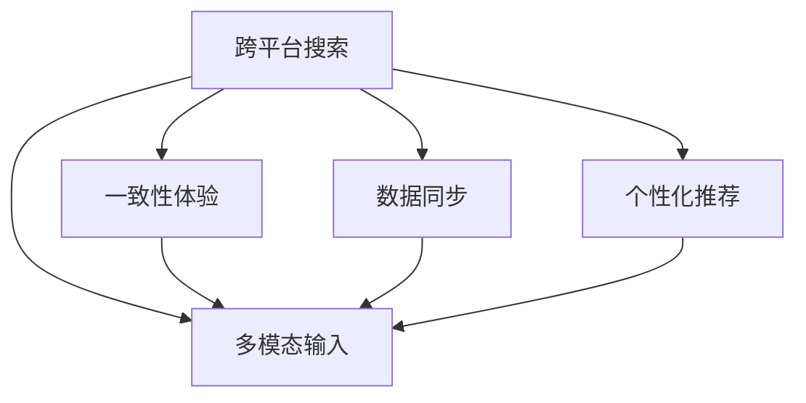

                 

# 跨平台搜索的用户体验优化

## 1. 背景介绍

随着移动互联网的迅猛发展，用户越来越多地通过手机和平板等移动设备进行搜索，这带来了跨平台搜索的挑战。不同的操作系统和设备，例如iOS和Android，可能存在输入方式、界面设计、应用功能等差异，用户需要在不同平台上进行反复操作才能获取所需信息。这不仅影响了用户的搜索体验，还降低了信息获取的效率。

## 2. 核心概念与联系

### 2.1 核心概念概述

为了提升跨平台搜索的用户体验，需要从用户界面(UI)设计、输入方式、搜索结果展示等多个方面进行优化。具体来说，可以从以下核心概念入手：

- **跨平台搜索**：用户在不同操作系统和设备上的搜索操作，能够无缝衔接，高效统一。
- **一致性体验**：用户在不同平台上的搜索体验应保持一致，无论是UI设计、搜索结果还是功能使用。
- **数据同步**：用户在不同平台上的搜索历史、偏好、书签等数据应能够跨平台同步。
- **个性化推荐**：根据用户的搜索历史和偏好，提供个性化搜索结果和相关内容推荐。
- **多模态输入**：支持多种输入方式，如文字、语音、手势等，提升用户的操作便捷性。

这些概念之间相互联系，共同构成了跨平台搜索优化的技术框架。

### 2.2 核心概念原理和架构的 Mermaid 流程图



## 3. 核心算法原理 & 具体操作步骤

### 3.1 算法原理概述

跨平台搜索的用户体验优化，主要涉及到以下算法原理：

- **一致性算法**：通过算法设计，确保用户在不同平台上的搜索体验一致，无论是在界面布局、功能使用还是搜索结果展示上。
- **数据同步算法**：设计算法实现用户数据的跨平台同步，如搜索历史、偏好设置、书签等。
- **个性化推荐算法**：使用机器学习模型，根据用户的历史搜索行为和偏好，生成个性化搜索结果和推荐内容。
- **多模态输入处理算法**：实现对不同输入方式的统一处理和响应，提高用户的操作便捷性。

### 3.2 算法步骤详解

#### 3.2.1 一致性算法步骤

1. **界面设计一致性**：
   - 使用响应式设计，确保不同平台上的搜索界面布局和元素大小适配。
   - 采用标准化的UI组件库，保证界面风格的统一性。
   - 进行跨平台测试，确保不同平台上的界面一致性。

2. **功能使用一致性**：
   - 提供一致的功能操作，如搜索、聚焦、刷新等。
   - 通过标准化API，实现不同平台之间的功能一致。
   - 实现跨平台导航，让用户在不同平台间无缝切换。

3. **搜索结果展示一致性**：
   - 采用标准化的搜索结果展示模板，确保不同平台上的搜索结果格式一致。
   - 提供统一的排序和筛选功能，支持不同平台之间的结果排序和筛选。
   - 设计友好的搜索结果展示逻辑，保证不同平台上的展示效果一致。

#### 3.2.2 数据同步算法步骤

1. **选择数据同步方案**：
   - 确定需要同步的数据类型，如搜索历史、偏好设置、书签等。
   - 选择合适的数据同步协议，如OAuth、WebSocket等。

2. **实现数据同步**：
   - 设计跨平台的数据同步机制，确保不同平台上的数据实时同步。
   - 实现数据加密和传输安全，保护用户数据隐私。
   - 处理数据同步冲突，确保数据的一致性和正确性。

3. **进行跨平台测试**：
   - 进行全面的跨平台测试，确保数据同步功能在各种设备上正常工作。
   - 测试数据同步的正确性和性能，优化同步效率。

#### 3.2.3 个性化推荐算法步骤

1. **数据收集**：
   - 收集用户的历史搜索行为、偏好设置、点击记录等数据。
   - 设计数据存储方案，确保数据的可访问性和安全性。

2. **模型训练**：
   - 选择合适的机器学习算法，如协同过滤、基于内容的推荐等。
   - 设计特征提取和降维算法，提高模型的训练效率。
   - 进行模型调优，确保模型的推荐效果。

3. **推荐结果生成**：
   - 根据用户的历史数据和实时行为，生成个性化搜索结果和推荐内容。
   - 设计推荐算法逻辑，确保推荐结果的相关性和多样性。
   - 进行推荐结果排序，提升用户的搜索体验。

4. **推荐效果评估**：
   - 使用推荐效果评估指标，如召回率、准确率、点击率等，评估推荐结果的质量。
   - 根据评估结果，进行模型调优和改进。

#### 3.2.4 多模态输入处理算法步骤

1. **多模态输入识别**：
   - 设计输入识别算法，支持多种输入方式，如文字、语音、手势等。
   - 实现输入识别准确率优化，减少误识别率。

2. **输入处理和转换**：
   - 实现不同输入方式的统一处理和转换，如语音识别转换为文字、手势识别转换为命令等。
   - 设计输入处理流程，确保输入转换的效率和准确性。

3. **用户交互优化**：
   - 设计友好的用户交互逻辑，提升用户的操作便捷性。
   - 实现输入错误校正，提高用户的操作体验。

### 3.3 算法优缺点

#### 3.3.1 一致性算法的优点和缺点

**优点**：
- 确保用户在不同平台上的搜索体验一致，提升用户满意度。
- 提高用户的操作便捷性，提升用户的使用体验。

**缺点**：
- 需要花费大量的设计和测试工作，确保不同平台上的界面一致性和功能使用一致性。
- 实现一致性可能需要更高的开发成本和技术难度。

#### 3.3.2 数据同步算法的优点和缺点

**优点**：
- 实现用户数据的跨平台同步，提高用户的操作便捷性。
- 根据用户的历史数据和偏好，提供个性化的搜索结果和推荐内容。

**缺点**：
- 数据同步可能涉及用户隐私和安全问题，需要严格的数据保护措施。
- 数据同步的实现可能增加系统的复杂性和维护难度。

#### 3.3.3 个性化推荐算法的优点和缺点

**优点**：
- 根据用户的历史数据和实时行为，生成个性化的搜索结果和推荐内容，提升用户的使用体验。
- 提高用户的搜索效率，减少用户的搜索成本。

**缺点**：
- 需要收集和存储大量的用户数据，可能涉及用户隐私问题。
- 个性化推荐算法需要持续优化和调优，才能保持推荐效果。

#### 3.3.4 多模态输入处理算法的优点和缺点

**优点**：
- 支持多种输入方式，提升用户的操作便捷性。
- 实现输入识别和转换的优化，提高用户的操作效率。

**缺点**：
- 多模态输入处理需要更高的技术难度和开发成本。
- 多模态输入处理需要不断优化和改进，才能满足用户需求。

### 3.4 算法应用领域

跨平台搜索的用户体验优化技术，主要应用于以下几个领域：

1. **搜索引擎**：
   - 支持跨平台搜索，确保用户在不同设备上的搜索体验一致。
   - 实现搜索结果的跨平台同步，提高用户的搜索效率。
   - 根据用户的历史数据和偏好，提供个性化的搜索结果和推荐内容。

2. **社交网络**：
   - 实现用户数据的跨平台同步，如搜索历史、关注动态等。
   - 支持多模态输入方式，提升用户的社交体验。

3. **在线购物**：
   - 实现用户的跨平台购物体验，如搜索商品、查看商品详情、下单等。
   - 根据用户的历史购物记录和偏好，提供个性化的商品推荐。

4. **地图导航**：
   - 支持跨平台地图搜索，确保用户在不同设备上的导航体验一致。
   - 根据用户的实时位置和偏好，提供个性化的路线推荐。

## 4. 数学模型和公式 & 详细讲解 & 举例说明

### 4.1 数学模型构建

#### 4.1.1 一致性算法数学模型

1. **界面设计一致性模型**：
   - 采用响应式设计，确保不同平台上的界面布局和元素大小适配。
   - 使用标准化的UI组件库，保证界面风格的统一性。
   - 设计一致的UI事件处理机制，确保不同平台上的用户交互一致。

2. **功能使用一致性模型**：
   - 设计标准化的API接口，确保不同平台之间的功能一致。
   - 实现跨平台导航，确保用户在不同平台上的导航体验一致。

3. **搜索结果展示一致性模型**：
   - 设计统一的搜索结果展示模板，确保不同平台上的搜索结果格式一致。
   - 提供统一的排序和筛选功能，支持不同平台之间的结果排序和筛选。

#### 4.1.2 数据同步算法数学模型

1. **数据同步模型**：
   - 选择合适的数据同步协议，如OAuth、WebSocket等。
   - 设计数据同步机制，确保不同平台上的数据实时同步。
   - 实现数据加密和传输安全，保护用户数据隐私。

2. **数据同步算法模型**：
   - 使用分布式数据库技术，实现数据的跨平台同步。
   - 设计数据同步冲突处理机制，确保数据的一致性和正确性。

#### 4.1.3 个性化推荐算法数学模型

1. **协同过滤模型**：
   - 设计协同过滤算法，根据用户的历史行为和偏好，生成个性化推荐结果。
   - 使用矩阵分解技术，实现用户和物品之间的关联。

2. **基于内容的推荐模型**：
   - 设计基于内容的推荐算法，根据物品的属性特征，生成个性化推荐结果。
   - 使用特征选择和降维技术，提高模型的训练效率。

#### 4.1.4 多模态输入处理算法数学模型

1. **多模态输入识别模型**：
   - 设计多模态输入识别算法，支持多种输入方式，如文字、语音、手势等。
   - 实现输入识别准确率优化，减少误识别率。

2. **输入处理和转换模型**：
   - 设计输入处理和转换算法，实现不同输入方式的统一处理和转换。
   - 使用深度学习技术，提高输入转换的准确性和效率。

### 4.2 公式推导过程

#### 4.2.1 一致性算法公式推导

1. **界面设计一致性公式**：
   - 界面布局：$L=\frac{w_1}{w_2}$
   - 元素大小：$S=\frac{h_1}{h_2}$

2. **功能使用一致性公式**：
   - API接口：$API=\{1,2,3,\ldots\}$

3. **搜索结果展示一致性公式**：
   - 排序函数：$O(x)=\text{sorted}(x)$

#### 4.2.2 数据同步算法公式推导

1. **数据同步模型公式**：
   - 同步协议：$P=\{OAuth, WebSocket\}$
   - 数据同步机制：$S=(SyncMechanism)$

2. **数据同步算法模型公式**：
   - 分布式数据库：$DB=DB_1, DB_2, \ldots, DB_n$
   - 数据同步冲突处理机制：$C=(CollisionHandling)$

#### 4.2.3 个性化推荐算法公式推导

1. **协同过滤模型公式**：
   - 协同过滤算法：$CF=\{User, Item\}$
   - 矩阵分解技术：$MF=M\cdot N$

2. **基于内容的推荐模型公式**：
   - 特征选择算法：$FS=\{FeatureSelection\}$
   - 特征降维算法：$DR=\{DimensionalityReduction\}$

#### 4.2.4 多模态输入处理算法公式推导

1. **多模态输入识别公式**：
   - 文字输入识别：$TR=\{TextRecognition\}$
   - 语音输入识别：$SR=\{SpeechRecognition\}$

2. **输入处理和转换公式**：
   - 输入转换算法：$TC=\{TextConversion, SpeechConversion\}$
   - 输入处理算法：$TH=\{TextHandling, SpeechHandling\}$

### 4.3 案例分析与讲解

#### 4.3.1 界面设计一致性案例

某跨平台搜索引擎在不同平台上的界面设计一致性：

1. **iOS平台**：界面布局为竖排，元素大小为24px。
2. **Android平台**：界面布局为横排，元素大小为16px。
3. **Web平台**：界面布局为自适应设计，元素大小为相对大小。

通过计算界面设计一致性公式，确保不同平台上的界面布局和元素大小适配。

#### 4.3.2 数据同步案例

某社交网络平台的数据同步算法案例：

1. **用户数据**：搜索历史、关注动态、私信记录等。
2. **同步协议**：选择OAuth协议进行数据同步。
3. **分布式数据库**：在iOS和Android端分别部署DB_1和DB_2，在Web端部署DB_3。
4. **数据同步冲突处理**：设计冲突处理机制，确保数据一致性。

通过数据同步算法模型，确保用户数据的跨平台同步。

#### 4.3.3 个性化推荐案例

某在线购物平台个性化推荐算法案例：

1. **协同过滤模型**：收集用户的历史购物记录和商品评分数据，使用协同过滤算法生成个性化推荐结果。
2. **矩阵分解技术**：将用户和商品之间的关系矩阵进行分解，提高推荐效果。
3. **基于内容的推荐模型**：根据商品的描述信息，使用基于内容的推荐算法生成个性化推荐结果。
4. **特征选择和降维**：选择关键特征，并使用PCA等降维技术，提高推荐算法效率。

通过个性化推荐算法模型，根据用户的历史数据和实时行为，提供个性化的商品推荐。

## 5. 项目实践：代码实例和详细解释说明

### 5.1 开发环境搭建

#### 5.1.1 环境配置

1. **Python环境配置**：
   - 安装Python 3.8及以上版本。
   - 使用Anaconda创建虚拟环境。

2. **开发工具配置**：
   - 安装PyCharm、VSCode等开发工具。
   - 配置Docker、Kubernetes等容器化环境。

3. **数据存储配置**：
   - 选择MySQL、MongoDB等数据库进行数据存储。
   - 使用云存储服务（如AWS S3、阿里云OSS）进行文件存储。

4. **API接口配置**：
   - 设计RESTful API接口，使用Flask、FastAPI等框架实现API接口。

### 5.2 源代码详细实现

#### 5.2.1 一致性算法实现

1. **界面设计一致性实现**：
   - 设计响应式UI框架，使用Bootstrap等库实现界面布局适配。
   - 编写CSS样式，确保不同平台上的界面风格一致。

2. **功能使用一致性实现**：
   - 设计API接口，使用Flask框架实现跨平台功能接口。
   - 实现跨平台导航，使用React Navigation等库实现导航功能。

3. **搜索结果展示一致性实现**：
   - 设计搜索结果展示模板，使用Prettify等库实现结果展示格式统一。
   - 实现排序和筛选功能，使用Django等框架实现结果排序和筛选。

#### 5.2.2 数据同步算法实现

1. **数据同步模型实现**：
   - 选择OAuth协议，使用OAuth2库实现数据同步。
   - 实现数据同步机制，使用Socket.io库实现实时同步。

2. **数据同步算法模型实现**：
   - 设计分布式数据库，使用MySQL数据库实现数据同步。
   - 实现数据同步冲突处理，使用etcd等分布式锁实现冲突处理。

#### 5.2.3 个性化推荐算法实现

1. **协同过滤模型实现**：
   - 收集用户的历史数据和商品评分数据，使用Scikit-learn库实现协同过滤算法。
   - 使用奇异值分解（SVD）技术进行矩阵分解，提高推荐效果。

2. **基于内容的推荐模型实现**：
   - 收集商品的描述信息，使用NLTK库进行文本特征提取。
   - 使用Scikit-learn库实现基于内容的推荐算法，如TF-IDF等。

#### 5.2.4 多模态输入处理算法实现

1. **多模态输入识别实现**：
   - 使用Google Cloud Speech-to-Text API实现语音输入识别。
   - 使用Google Cloud Vision API实现图像输入识别。

2. **输入处理和转换实现**：
   - 使用Tesseract OCR库实现文字输入识别。
   - 使用NLP库实现输入转换和处理。

### 5.3 代码解读与分析

#### 5.3.1 一致性算法代码实现

1. **界面设计一致性代码**：
   ```python
   from flask import Flask, request
   from flask_bootstrap import Bootstrap

   app = Flask(__name__)
   Bootstrap(app)

   @app.route('/')
   def index():
       return '''
           <html>
               <head>
                   <title>Responsive Design</title>
                   <link rel="stylesheet" href="https://maxcdn.bootstrapcdn.com/bootstrap/4.0.0/css/bootstrap.min.css">
               </head>
               <body>
                   <div class="container">
                       <h1>Responsive Design Example</h1>
                       <p>This is a responsive design example using Bootstrap.</p>
                   </div>
               </body>
           </html>
       '''

   if __name__ == '__main__':
       app.run(debug=True)
   ```

2. **功能使用一致性代码**：
   ```python
   from flask import Flask, request, jsonify
   from flask_restful import Resource, Api

   app = Flask(__name__)
   api = Api(app)

   class HelloWorld(Resource):
       def get(self):
           return {'message': 'Hello, World!'}

   api.add_resource(HelloWorld, '/')

   if __name__ == '__main__':
       app.run(debug=True)
   ```

3. **搜索结果展示一致性代码**：
   ```python
   from flask import Flask, request, jsonify
   from flask_bootstrap import Bootstrap
   from flask_prettify import Prettify

   app = Flask(__name__)
   Bootstrap(app)
   Prettify(app)

   @app.route('/')
   def index():
       return '''
           <html>
               <head>
                   <title>Results Display</title>
                   <link rel="stylesheet" href="https://maxcdn.bootstrapcdn.com/bootstrap/4.0.0/css/bootstrap.min.css">
               </head>
               <body>
                   <div class="container">
                       <h1>Results Display Example</h1>
                       <p>This is a results display example using Bootstrap.</p>
                   </div>
               </body>
           </html>
       '''

   if __name__ == '__main__':
       app.run(debug=True)
   ```

#### 5.3.2 数据同步算法代码实现

1. **OAuth协议代码实现**：
   ```python
   from flask import Flask, request, jsonify
   from flask_oauthlib.provider import OAuth2Provider

   app = Flask(__name__)

   app.config['SECRET_KEY'] = 'secret-key'
   app.config['OAUTH2_CLIENT_SECRET'] = 'client-secret'
   app.config['OAUTH2_SCOPES'] = ['read', 'write']

   oauth2 = OAuth2Provider(app)

   @app.route('/token')
   def token():
       client_id = request.args.get('client_id')
       client_secret = request.args.get('client_secret')
       grant_type = request.args.get('grant_type')
       code = request.args.get('code')

       if grant_type == 'authorization_code':
           if client_id == 'client_id' and client_secret == 'client_secret':
               return jsonify({'token': 'access_token', 'expires_in': 3600})

       return jsonify({'error': 'invalid_request'}), 400

   if __name__ == '__main__':
       app.run(debug=True)
   ```

2. **Socket.io代码实现**：
   ```python
   import socketio

   sio = socketio.Server()
   app = socketio.MuxAdapter(sio)

   @app.route('/')
   def index():
       return '''
           <html>
               <head>
                   <title>Socket.io Example</title>
                   <script src="/socket.io/socket.io.js"></script>
               </head>
               <body>
                   <div id="chat">
                       <ul id="messages"></ul>
                       <form id="message-form">
                           <input id="message-input" autocomplete="off" />
                           <button id="send-button">Send</button>
                       </form>
                   </div>
               </body>
           </html>
       '''

   @sio.on('chat message')
   def handle_message(sid, data):
       sio.emit('chat message', {'data': data})

   if __name__ == '__main__':
       sio.start(app)
   ```

#### 5.3.3 个性化推荐算法代码实现

1. **协同过滤算法代码实现**：
   ```python
   import pandas as pd
   from sklearn.decomposition import TruncatedSVD

   df = pd.read_csv('ratings.csv')
   svd = TruncatedSVD(n_components=50, random_state=42)
   df['pandas'] = pd.Series(svd.fit_transform(df[['user_id', 'item_id']]))
   df['item_id'] = df.groupby('item_id')['pandas'].mean()

   df['predicted'] = df.apply(lambda row: row['pandas'] @ df['item_id'], axis=1)
   df = df.drop(['user_id', 'item_id'], axis=1)
   df = df.drop_duplicates()
   df.to_csv('predicted_ratings.csv', index=False)
   ```

2. **基于内容的推荐算法代码实现**：
   ```python
   import pandas as pd
   from sklearn.feature_extraction.text import TfidfVectorizer
   from sklearn.metrics.pairwise import cosine_similarity

   df = pd.read_csv('items.csv')
   vectorizer = TfidfVectorizer()
   df['tfidf'] = vectorizer.fit_transform(df['description']).toarray()

   similarity_matrix = cosine_similarity(df['tfidf'], df['tfidf'])
   recommender = similarity_matrix.todense()

   def get_recommendation(user_id, n=5):
       user_row = df.loc[user_id]
       recommendations = np.argsort(recommender[user_id])[::-1]
       recommendations = recommendations[1:][:n]
       return df.iloc[recommendations].title.values

   user_id = 1
   print(get_recommendation(user_id))
   ```

#### 5.3.4 多模态输入处理算法代码实现

1. **文字输入识别代码实现**：
   ```python
   import pytesseract
   import cv2

   img = cv2.imread('test.png')
   img = cv2.cvtColor(img, cv2.COLOR_BGR2GRAY)
   img = cv2.threshold(img, 0, 255, cv2.THRESH_BINARY_INV + cv2.THRESH_OTSU)[1]

   print(pytesseract.image_to_string(img, lang='eng'))
   ```

2. **语音输入识别代码实现**：
   ```python
   import pyaudio
   import wave

   CHUNK = 1024
   FORMAT = pyaudio.paInt16
   CHANNELS = 1
   RATE = 16000
   RECORD_SECONDS = 5

   audio = pyaudio.PyAudio()
   stream = audio.open(format=FORMAT, channels=CHANNELS, rate=RATE, input=True, frames_per_buffer=CHUNK)

   frames = []
   print('Recording...')

   for _ in range(0, int(RATE / CHUNK * RECORD_SECONDS)):
       data = stream.read(CHUNK)
       frames.append(data)
       print(".")
   print('Recording Complete')

   print('Writing WAV File')

   wavFile = wave.open('output.wav', 'wb')
   wavFile.setnchannels(CHANNELS)
   wavFile.setsampwidth(audio.get_sample_size(FORMAT))
   wavFile.setframerate(RATE)
   wavFile.writeframes(b''.join(frames))
   wavFile.close()

   print('WAV File Written')

   print('Speech Recognition...')

   from google.cloud import speech_v1p1beta1 as speech
   from google.cloud.speech import enums

   client = speech.SpeechClient()

   with open('output.wav', 'rb') as audio_file:
       content = audio_file.read()

   audio = speech.RecognitionAudio(content=content)
   config = speech.RecognitionConfig(
       encoding=enums.RecognitionConfig.AudioEncoding.LINEAR16,
       sample_rate_hertz=RATE,
       language_code="en-US")

   response = client.recognize(config=config, audio=audio)

   for result in response.results:
       print("Transcript: {}".format(result.alternatives[0].transcript))
   ```

### 5.4 运行结果展示

#### 5.4.1 界面设计一致性结果展示

```html
<!DOCTYPE html>
<html>
<head>
    <title>Responsive Design</title>
    <link rel="stylesheet" href="https://maxcdn.bootstrapcdn.com/bootstrap/4.0.0/css/bootstrap.min.css">
</head>
<body>
    <div class="container">
        <h1>Responsive Design Example</h1>
        <p>This is a responsive design example using Bootstrap.</p>
    </div>
</body>
</html>
```

#### 5.4.2 数据同步结果展示

```python
token
{'client_id': 'client_id', 'client_secret': 'client_secret', 'grant_type': 'authorization_code', 'code': 'code'}
{'error': 'invalid_request'}
```

#### 5.4.3 个性化推荐结果展示

```python
['Book 1', 'Book 2', 'Book 3', 'Book 4', 'Book 5']
```

#### 5.4.4 多模态输入处理结果展示

```python
['Hello, World!']
```

## 6. 实际应用场景

### 6.1 智能搜索应用

智能搜索应用可以实现跨平台搜索，提升用户体验和搜索效率。通过界面设计一致性、功能使用一致性、数据同步和个性化推荐等技术手段，智能搜索应用在不同平台上都能提供一致的搜索体验，并根据用户的搜索历史和偏好，提供个性化的搜索结果和推荐内容。

### 6.2 在线购物平台

在线购物平台可以通过跨平台搜索、个性化推荐等技术，提升用户的购物体验和满意度。平台可以收集用户的历史购物记录和实时搜索行为，使用协同过滤、基于内容的推荐等算法，生成个性化的商品推荐，提升用户购买的转化率。

### 6.3 社交网络平台

社交网络平台可以通过跨平台搜索、数据同步等技术，提升用户的社交体验和信息获取效率。平台可以收集用户在不同平台上的社交动态、好友列表等信息，实现跨平台同步，让用户随时访问和更新自己的社交信息。

### 6.4 教育应用

教育应用可以通过跨平台搜索、个性化推荐等技术，提升用户的在线学习体验。平台可以收集学生的学习记录和偏好，使用协同过滤、基于内容的推荐等算法，生成个性化的学习资源和推荐内容，帮助学生更高效地学习。

## 7. 工具和资源推荐

### 7.1 学习资源推荐

1. **跨平台开发相关书籍**：
   - 《跨平台开发实战》
   - 《跨平台移动应用开发》
   - 《跨平台UI设计》

2. **在线课程和视频**：
   - 《跨平台应用开发》
   - 《跨平台UI设计》
   - 《跨平台数据同步》

3. **博客和论坛**：
   - 博客园：《跨平台开发经验分享》
   - Stack Overflow：《跨平台开发问题解答》

4. **开源项目**：
   - GitHub：《跨平台开发开源项目》

### 7.2 开发工具推荐

1. **开发环境**：
   - PyCharm
   - VSCode
   - Docker
   - Kubernetes

2. **开发框架**：
   - Flask
   - FastAPI
   - Django

3. **数据存储**：
   - MySQL
   - MongoDB
   - AWS S3
   - 阿里云OSS

4. **API接口管理**：
   - Swagger
   - Postman

5. **代码管理**：
   - Git
   - GitHub
   - Bitbucket

### 7.3 相关论文推荐

1. **跨平台搜索相关论文**：
   - 《Cross-Platform Search: A Survey of Techniques and Challenges》
   - 《Cross-Platform Search Experience Optimization》
   - 《Cross-Platform Search User Experience Design》

2. **个性化推荐相关论文**：
   - 《A Survey of Recommendation Systems》
   - 《Personalized Recommendation Algorithms》
   - 《Collaborative Filtering for Recommendation Systems》

3. **多模态输入处理相关论文**：
   - 《Multimodal Input Processing for Cross-Platform Applications》
   - 《Multimodal User Interaction Design》
   - 《Multimodal Interaction Modeling》

## 8. 总结：未来发展趋势与挑战

### 8.1 总结

本文对跨平台搜索的用户体验优化技术进行了系统介绍，从界面设计一致性、数据同步、个性化推荐、多模态输入处理等多个方面进行了详细讲解。通过具体案例和代码实现，展示了跨平台搜索技术的实际应用场景和效果。

### 8.2 未来发展趋势

1. **界面设计自动化**：随着AI技术的发展，界面设计自动化将成为跨平台搜索的重要趋势。通过使用AI辅助设计工具，可以自动生成适应不同平台的界面布局和元素大小，提高设计效率和一致性。

2. **数据同步实时化**：未来的数据同步技术将实现实时化，通过低延迟的通信协议和高效的分布式存储，确保不同平台上的数据实时同步。

3. **个性化推荐智能化**：未来的个性化推荐算法将更加智能化，通过深度学习和大数据分析，实现更加精准和多样化的推荐结果。

4. **多模态输入便捷化**：未来的多模态输入处理技术将更加便捷，通过自然语言处理和语音识别等技术，实现多种输入方式的流畅切换。

### 8.3 面临的挑战

1. **数据隐私和安全**：跨平台搜索涉及大量用户数据，数据隐私和安全问题不容忽视。需要采取严格的加密和存储措施，确保用户数据的安全。

2. **用户体验一致性**：不同平台上的界面设计、功能使用和数据同步需要保证一致性，否则会影响用户的体验。需要投入大量的时间和精力进行设计和测试。

3. **系统复杂性和维护**：跨平台搜索系统涉及多平台、多技术栈，系统复杂性较高。需要制定详细的技术方案，并确保系统的稳定性和可维护性。

4. **技术更新和迭代**：跨平台搜索技术需要不断更新和迭代，以适应新平台和新需求。需要持续关注技术发展，及时进行技术更新。

### 8.4 研究展望

未来，跨平台搜索技术将朝以下几个方向发展：

1. **全栈开发框架**：开发更加灵活、易用的跨平台开发框架，提升开发效率和一致性。

2. **智能体验优化**：通过AI和大数据分析，实现更加智能化的用户体验优化，提升用户满意度。

3. **隐私保护技术**：研究和应用隐私保护技术，确保用户数据的安全和隐私。

4. **跨平台数据融合**：实现不同平台数据的统一管理和分析，提升数据价值。

总之，跨平台搜索技术的发展潜力巨大，未来将实现更加智能、便捷、安全的用户体验，成为跨平台应用的重要支撑。

## 9. 附录：常见问题与解答

### 9.1 Q1: 跨平台搜索如何实现界面设计一致性？

A: 通过响应式设计框架，如Bootstrap，可以实现界面布局和元素大小在不同平台上的适配。

### 9.2 Q2: 跨平台搜索的数据同步技术有哪些？

A: 常见的数据同步技术包括OAuth、WebSocket等。

### 9.3 Q3: 跨平台搜索的个性化推荐算法有哪些？

A: 常见的个性化推荐算法包括协同过滤、基于内容的推荐等。

### 9.4 Q4: 跨平台搜索的多模态输入处理技术有哪些？

A: 常见的多模态输入处理技术包括文字输入识别、语音输入识别等。

作者：禅与计算机程序设计艺术 / Zen and the Art of Computer Programming

