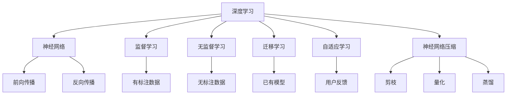

                 

# 软件 2.0 的发展趋势：深度学习、强化学习

## 1. 背景介绍

### 1.1 问题由来
随着人工智能技术的快速发展，软件工程领域也发生了深刻的变革。软件2.0（Software 2.0）的概念应运而生，强调通过机器学习、深度学习、强化学习等先进技术，提高软件开发效率和软件质量。深度学习和强化学习作为人工智能的两大核心技术，在软件工程中的应用前景广阔，被视为未来软件2.0发展的关键驱动力。

深度学习（Deep Learning, DL）和强化学习（Reinforcement Learning, RL）作为新一代人工智能技术，正在深刻影响着各行各业，并逐步成为推动软件2.0发展的核心力量。深度学习通过模拟人脑神经网络，使计算机能够处理复杂的数据，并从中提取规律和模式。强化学习通过试错训练，使计算机能够在动态环境中自主学习最优策略。本文将从深度学习和强化学习的原理、应用及未来趋势等方面进行探讨。

## 2. 核心概念与联系

### 2.1 核心概念概述

为更好地理解深度学习、强化学习及其在软件2.0中的应用，本节将介绍几个密切相关的核心概念：

- 深度学习（Deep Learning, DL）：一种基于神经网络的机器学习方法，通过多层次的特征提取和数据处理，实现对复杂问题的建模和预测。深度学习已经在计算机视觉、自然语言处理、语音识别等领域取得了显著的成果。
- 强化学习（Reinforcement Learning, RL）：一种基于奖惩机制的机器学习方法，通过与环境的交互，学习最优的决策策略，广泛应用于游戏AI、机器人控制、自动驾驶等场景。
- 神经网络（Neural Network, NN）：深度学习的基础，通过多层神经元模拟人脑的神经元网络，实现对数据的高效处理和复杂问题的解决。
- 监督学习（Supervised Learning）：深度学习中的一种常用方法，通过有标注的训练数据，使模型能够学习到输入和输出之间的映射关系。
- 无监督学习（Unsupervised Learning）：深度学习中的一种方法，通过无标注的数据，发现数据的潜在结构和规律。
- 迁移学习（Transfer Learning）：利用已有模型在某个领域的学习，快速适应新领域的问题，降低学习成本。
- 自适应学习（Adaptive Learning）：根据用户的反馈和行为，动态调整模型参数，提高学习效果和用户满意度。
- 神经网络压缩（Neural Network Compression）：通过剪枝、量化、蒸馏等技术，降低神经网络的参数和计算复杂度，提升模型推理速度。

这些核心概念之间的逻辑关系可以通过以下Mermaid流程图来展示：



这个流程图展示了深度学习和强化学习的基础知识及其应用，帮助读者理解这些概念之间的关系。

## 3. 核心算法原理 & 具体操作步骤

### 3.1 算法原理概述

深度学习和强化学习作为新一代人工智能技术，在软件2.0中的应用主要体现在以下几个方面：

- 自动化软件开发：通过深度学习模型，自动生成代码、调试程序、测试等功能，大幅提升软件开发效率。
- 自适应优化：利用强化学习模型，动态调整软件性能参数，提高软件质量。
- 智能运维：通过深度学习模型，实时监控和分析软件运行状态，快速定位故障，保障软件稳定运行。
- 自动测试：利用深度学习模型，自动化生成测试用例，减少人工测试的复杂度和成本。
- 知识图谱构建：通过强化学习模型，动态调整知识图谱的结构和内容，提高知识获取和应用效率。

### 3.2 算法步骤详解

#### 3.2.1 深度学习算法步骤
深度学习算法的主要步骤包括：
1. 数据预处理：对原始数据进行清洗、归一化、分片等预处理操作。
2. 构建神经网络模型：根据任务需求选择合适的神经网络结构，如卷积神经网络（CNN）、循环神经网络（RNN）、长短时记忆网络（LSTM）等。
3. 训练模型：使用有标注的数据集，通过反向传播算法，最小化损失函数，更新模型参数。
4. 验证和调优：在验证集上评估模型性能，根据结果调整超参数，如学习率、正则化系数、批大小等。
5. 测试和应用：在测试集上评估模型泛化性能，将其应用于实际问题中。

#### 3.2.2 强化学习算法步骤
强化学习算法的主要步骤包括：
1. 定义环境：明确学习环境，如游戏环境、机器人控制环境、自动驾驶环境等。
2. 定义状态和动作：根据环境定义状态和动作空间，如游戏中的角色位置、机器人控制中的关节角度、自动驾驶中的车速和方向等。
3. 定义奖励函数：根据环境定义奖励函数，奖励模型执行的动作。
4. 训练模型：使用蒙特卡罗方法、Q-learning、深度Q网络等算法，训练模型学习最优策略。
5. 测试和应用：在测试环境中评估模型性能，调整策略，应用于实际问题中。

### 3.3 算法优缺点

深度学习和强化学习在软件2.0中具有以下优点：
1. 自动化：深度学习和强化学习可以自动化地处理复杂问题，减少人工干预。
2. 灵活性：深度学习和强化学习具有较强的适应性，可以应用到各种软件场景中。
3. 高精度：深度学习和强化学习通过大量的训练数据，可以取得较高的预测和决策精度。
4. 持续学习：深度学习和强化学习可以持续学习新数据和新知识，保持模型的高效性。

同时，这些算法也存在一些局限性：
1. 数据需求：深度学习和强化学习需要大量的标注数据和环境数据，数据获取成本较高。
2. 计算资源：深度学习和强化学习需要大量的计算资源和存储资源，对硬件要求较高。
3. 可解释性：深度学习和强化学习模型通常是"黑盒"模型，难以解释其决策过程。
4. 泛化能力：深度学习和强化学习模型容易过拟合，泛化能力有限。
5. 鲁棒性：深度学习和强化学习模型对输入数据的噪声和异常值敏感，鲁棒性较差。

尽管存在这些局限性，但深度学习和强化学习在软件2.0中的应用前景广阔，其优势明显，具有巨大的发展潜力。

### 3.4 算法应用领域

深度学习和强化学习在软件2.0中具有广泛的应用领域，以下是一些典型的应用场景：

- 自动代码生成：利用深度学习模型，自动生成高质量的代码，提升开发效率。
- 代码缺陷检测：利用深度学习模型，自动检测代码中的缺陷和错误，保障软件质量。
- 软件测试：利用深度学习模型，自动生成测试用例，减少人工测试工作量。
- 软件性能优化：利用强化学习模型，动态调整软件性能参数，提高软件运行效率。
- 软件推荐系统：利用深度学习和强化学习模型，推荐合适的软件，提升用户体验。
- 软件运维自动化：利用深度学习模型，实时监控和分析软件运行状态，快速定位故障，保障软件稳定运行。
- 自然语言处理：利用深度学习模型，处理自然语言输入，实现智能问答、翻译等功能。
- 机器人控制：利用强化学习模型，训练机器人执行复杂任务，提高自动化程度。
- 自动驾驶：利用深度学习和强化学习模型，实现自动驾驶车辆的控制和决策，提升安全性和效率。
- 知识图谱构建：利用深度学习模型，自动构建和更新知识图谱，提升知识获取和应用效率。

这些应用场景展示了深度学习和强化学习在软件2.0中的重要地位和广泛应用。

## 4. 数学模型和公式 & 详细讲解 & 举例说明

### 4.1 数学模型构建

#### 4.1.1 深度学习模型构建
深度学习模型通常由多层神经网络构成，每一层包含多个神经元，通过前向传播和反向传播算法进行训练。深度学习模型的数学模型可以表示为：

$$
\hat{y} = f(\mathbf{W} \mathbf{x} + \mathbf{b})
$$

其中，$\hat{y}$表示模型的预测输出，$\mathbf{x}$表示输入数据，$\mathbf{W}$和$\mathbf{b}$表示模型的参数，$f$表示激活函数。深度学习模型的目标是最小化预测输出和真实输出之间的差距，通常使用均方误差（MSE）或交叉熵（CE）作为损失函数。

#### 4.1.2 强化学习模型构建
强化学习模型通常由策略网络和价值网络构成，通过蒙特卡罗方法、Q-learning、深度Q网络等算法进行训练。强化学习模型的数学模型可以表示为：

$$
Q(s,a) = r + \gamma \max_{a'} Q(s',a')
$$

其中，$s$表示当前状态，$a$表示当前动作，$r$表示奖励，$s'$表示下一个状态，$a'$表示下一个动作，$\gamma$表示折扣因子。强化学习模型的目标是在给定状态下，选择最优动作，使得未来奖励最大。

### 4.2 公式推导过程

#### 4.2.1 深度学习公式推导
深度学习模型通常使用反向传播算法进行训练，其公式推导过程如下：

1. 前向传播：
$$
\hat{y} = f(\mathbf{W} \mathbf{x} + \mathbf{b})
$$

2. 计算损失函数：
$$
\mathcal{L} = \frac{1}{N} \sum_{i=1}^N (\hat{y}_i - y_i)^2
$$

3. 反向传播：
$$
\frac{\partial \mathcal{L}}{\partial \mathbf{W}} = -2(\hat{y} - y) \frac{\partial \hat{y}}{\partial \mathbf{W}}
$$

4. 更新参数：
$$
\mathbf{W} = \mathbf{W} - \eta \frac{\partial \mathcal{L}}{\partial \mathbf{W}}
$$

其中，$\eta$表示学习率，$\frac{\partial \hat{y}}{\partial \mathbf{W}}$表示激活函数的导数。

#### 4.2.2 强化学习公式推导
强化学习模型通常使用Q-learning算法进行训练，其公式推导过程如下：

1. 计算Q值：
$$
Q(s,a) = Q(s,a) + \alpha (r + \gamma Q(s',a') - Q(s,a))
$$

2. 选择动作：
$$
a = \arg\max_a Q(s,a)
$$

其中，$\alpha$表示学习率，$r$表示奖励，$s'$表示下一个状态，$a'$表示下一个动作。

### 4.3 案例分析与讲解

#### 4.3.1 深度学习案例分析
假设有一个手写数字识别任务，需要识别手写数字图像并将其转化为数字。我们可以使用卷积神经网络（CNN）进行训练，具体步骤如下：

1. 数据预处理：将手写数字图像进行归一化、灰度化、裁剪等预处理操作。
2. 构建神经网络模型：使用卷积层、池化层、全连接层等构建CNN模型。
3. 训练模型：使用训练集对CNN模型进行训练，最小化交叉熵损失函数。
4. 验证和调优：在验证集上评估模型性能，根据结果调整超参数，如学习率、正则化系数等。
5. 测试和应用：在测试集上评估模型泛化性能，将其应用于实际问题中。

#### 4.3.2 强化学习案例分析
假设有一个机器人控制任务，需要控制机器人抓取物体并将其放在指定位置。我们可以使用强化学习模型进行训练，具体步骤如下：

1. 定义环境：定义机器人的运动空间和物体的位置。
2. 定义状态和动作：定义机器人的状态（如位置、角度等）和动作（如左移、右移、上移、下移等）。
3. 定义奖励函数：根据机器人抓取物体并放置到指定位置的行为，定义奖励函数，奖励正确的动作。
4. 训练模型：使用蒙特卡罗方法或深度Q网络等算法，训练模型学习最优策略。
5. 测试和应用：在测试环境中评估模型性能，调整策略，应用于实际问题中。

## 5. 项目实践：代码实例和详细解释说明

### 5.1 开发环境搭建

在进行深度学习和强化学习实践前，我们需要准备好开发环境。以下是使用Python进行TensorFlow和PyTorch开发的环境配置流程：

1. 安装Anaconda：从官网下载并安装Anaconda，用于创建独立的Python环境。

2. 创建并激活虚拟环境：
```bash
conda create -n tf-env python=3.8 
conda activate tf-env
```

3. 安装TensorFlow：根据CUDA版本，从官网获取对应的安装命令。例如：
```bash
conda install tensorflow -c conda-forge
```

4. 安装PyTorch：从官网下载并安装PyTorch，用于深度学习模型的开发。

5. 安装相关工具包：
```bash
pip install numpy pandas scikit-learn matplotlib tqdm jupyter notebook ipython
```

完成上述步骤后，即可在`tf-env`环境中开始深度学习和强化学习的实践。

### 5.2 源代码详细实现

下面我们以手写数字识别任务为例，给出使用TensorFlow进行深度学习的PyTorch代码实现。

首先，定义数据集和模型：

```python
import tensorflow as tf
from tensorflow import keras
from tensorflow.keras import layers

# 定义数据集
(x_train, y_train), (x_test, y_test) = keras.datasets.mnist.load_data()

# 数据预处理
x_train = x_train / 255.0
x_test = x_test / 255.0

# 构建卷积神经网络模型
model = keras.Sequential([
    layers.Conv2D(32, kernel_size=(3, 3), activation='relu', input_shape=(28, 28, 1)),
    layers.MaxPooling2D(pool_size=(2, 2)),
    layers.Flatten(),
    layers.Dense(10, activation='softmax')
])

# 定义优化器
optimizer = tf.keras.optimizers.Adam(learning_rate=0.001)

# 编译模型
model.compile(optimizer=optimizer, loss='categorical_crossentropy', metrics=['accuracy'])
```

然后，定义训练和评估函数：

```python
# 训练模型
model.fit(x_train, y_train, epochs=10, batch_size=64, validation_data=(x_test, y_test))

# 评估模型
model.evaluate(x_test, y_test)
```

最后，启动训练流程并在测试集上评估：

```python
epochs = 10
batch_size = 64

for epoch in range(epochs):
    model.fit(x_train, y_train, epochs=1, batch_size=batch_size, validation_data=(x_test, y_test))
    model.evaluate(x_test, y_test)
```

以上就是使用TensorFlow对深度学习模型进行手写数字识别任务训练的完整代码实现。可以看到，得益于TensorFlow的强大封装，我们可以用相对简洁的代码完成深度学习模型的开发和训练。

### 5.3 代码解读与分析

让我们再详细解读一下关键代码的实现细节：

**数据集定义和预处理**：
- `(x_train, y_train), (x_test, y_test) = keras.datasets.mnist.load_data()`：加载手写数字识别数据集，将数据集划分为训练集和测试集。
- `x_train = x_train / 255.0; x_test = x_test / 255.0`：对图像数据进行归一化，将其转化为0到1之间的浮点数。

**模型构建**：
- `model = keras.Sequential()`：定义一个顺序模型，用于构建卷积神经网络。
- `layers.Conv2D(32, kernel_size=(3, 3), activation='relu', input_shape=(28, 28, 1))`：定义卷积层，参数32表示神经元数量，kernel_size表示卷积核大小，activation表示激活函数为ReLU。
- `layers.MaxPooling2D(pool_size=(2, 2))`：定义池化层，pool_size表示池化核大小。
- `layers.Flatten()`：将二维的卷积特征图展开为向量。
- `layers.Dense(10, activation='softmax')`：定义全连接层，10表示神经元数量，softmax表示输出层使用softmax激活函数。

**优化器定义和模型编译**：
- `optimizer = tf.keras.optimizers.Adam(learning_rate=0.001)`：定义Adam优化器，学习率为0.001。
- `model.compile(optimizer=optimizer, loss='categorical_crossentropy', metrics=['accuracy'])`：编译模型，指定优化器、损失函数和评估指标。

**训练和评估流程**：
- `model.fit(x_train, y_train, epochs=10, batch_size=64, validation_data=(x_test, y_test))`：训练模型，batch_size表示批次大小，epochs表示训练轮数，validation_data表示验证集。
- `model.evaluate(x_test, y_test)`：评估模型，返回测试集上的准确率。

可以看到，TensorFlow和PyTorch的强大封装使得深度学习模型的开发和训练变得相对简洁高效。开发者可以将更多精力放在模型架构设计、超参数调优等高层逻辑上，而不必过多关注底层的实现细节。

当然，工业级的系统实现还需考虑更多因素，如模型的保存和部署、超参数的自动搜索、更灵活的任务适配层等。但核心的深度学习框架和算法实现基本与此类似。

## 6. 实际应用场景

### 6.1 工业智能制造

深度学习和强化学习在工业智能制造中的应用非常广泛，例如：
- 预测性维护：利用深度学习模型，对设备运行数据进行分析，预测设备故障，提前进行维护。
- 智能调度：利用强化学习模型，动态调整生产线调度策略，优化生产效率。
- 质量控制：利用深度学习模型，对产品质量进行检测和分类，提高质量控制水平。
- 异常检测：利用深度学习模型，实时监控设备运行状态，检测异常情况，保障生产安全。
- 资源优化：利用深度学习模型，对资源进行优化配置，减少浪费，提升资源利用率。

### 6.2 金融风险控制

深度学习和强化学习在金融风险控制中的应用也日益重要，例如：
- 信用评估：利用深度学习模型，分析客户信用数据，预测信用风险。
- 欺诈检测：利用深度学习模型，分析交易数据，检测欺诈行为。
- 风险定价：利用强化学习模型，动态调整风险定价策略，优化投资组合。
- 资产配置：利用深度学习模型，分析市场数据，优化资产配置。
- 交易自动化：利用强化学习模型，自动执行交易策略，提高交易效率。

### 6.3 医疗健康管理

深度学习和强化学习在医疗健康管理中的应用也非常广泛，例如：
- 疾病预测：利用深度学习模型，分析医疗数据，预测疾病发生风险。
- 治疗方案：利用深度学习模型，分析患者数据，推荐治疗方案。
- 健康监测：利用深度学习模型，分析健康数据，监测身体状况。
- 诊疗辅助：利用强化学习模型，辅助医生进行诊断和治疗，提高诊疗准确性。
- 医疗资源优化：利用深度学习模型，优化医疗资源配置，提高服务效率。

### 6.4 未来应用展望

随着深度学习和强化学习的不断发展，其在软件2.0中的应用前景广阔，未来还将有更多的突破和创新。

- 自动化软件开发：深度学习和强化学习将进一步自动化软件开发的各个环节，包括代码生成、调试、测试等，大幅提升开发效率和质量。
- 智能运维：深度学习和强化学习将进一步优化软件运维流程，实时监控和预测系统故障，保障软件稳定运行。
- 自动测试：深度学习和强化学习将进一步优化软件测试流程，自动生成测试用例，减少人工测试工作量。
- 智能推荐：深度学习和强化学习将进一步优化推荐系统，推荐合适的软件和服务，提升用户体验。
- 自然语言处理：深度学习和强化学习将进一步优化自然语言处理技术，实现智能问答、翻译等功能，提升人机交互体验。
- 机器人控制：深度学习和强化学习将进一步优化机器人控制技术，实现自主导航、操作等，提升自动化程度。
- 自动驾驶：深度学习和强化学习将进一步优化自动驾驶技术，提高安全性和效率。
- 知识图谱构建：深度学习和强化学习将进一步优化知识图谱构建技术，提升知识获取和应用效率。

## 7. 工具和资源推荐

### 7.1 学习资源推荐

为了帮助开发者系统掌握深度学习和强化学习的理论基础和实践技巧，这里推荐一些优质的学习资源：

1. 《深度学习》书籍：由Ian Goodfellow、Yoshua Bengio和Aaron Courville联合撰写，全面介绍了深度学习的原理和应用。

2. 《强化学习》书籍：由Richard Sutton和Andrew Barto联合撰写，全面介绍了强化学习的原理和应用。

3. Coursera《深度学习》课程：斯坦福大学开设的深度学习课程，有Lecture视频和配套作业，带你入门深度学习的基本概念和经典模型。

4. Udacity《强化学习》课程：Coursera的强化学习课程，由Andrew Ng主讲，涵盖强化学习的各个方面。

5. Google Deep Learning与Google AI Blog：Google的深度学习博客和研究报告，提供最新的深度学习技术动态和应用案例。

6. DeepMind Blog：DeepMind的研究博客，涵盖最新的强化学习技术进展和应用案例。

通过对这些资源的学习实践，相信你一定能够快速掌握深度学习和强化学习的精髓，并用于解决实际的NLP问题。

### 7.2 开发工具推荐

高效的开发离不开优秀的工具支持。以下是几款用于深度学习和强化学习开发的常用工具：

1. TensorFlow：由Google主导开发的开源深度学习框架，生产部署方便，适合大规模工程应用。

2. PyTorch：Facebook开发的开源深度学习框架，灵活度较高，适合快速迭代研究。

3. Keras：由François Chollet开发的高级深度学习API，简化了深度学习模型的构建过程。

4. OpenAI Gym：OpenAI开发的强化学习环境，提供丰富的模拟环境和实验工具。

5. TensorBoard：TensorFlow配套的可视化工具，可实时监测模型训练状态，并提供丰富的图表呈现方式。

6. Weights & Biases：模型训练的实验跟踪工具，可以记录和可视化模型训练过程中的各项指标，方便对比和调优。

合理利用这些工具，可以显著提升深度学习和强化学习的开发效率，加快创新迭代的步伐。

### 7.3 相关论文推荐

深度学习和强化学习的发展离不开学界的持续研究。以下是几篇奠基性的相关论文，推荐阅读：

1. AlexNet：ImageNet大规模视觉识别挑战赛的冠军模型，标志着深度学习在计算机视觉领域的崛起。

2. ResNet：深度残差网络，通过残差连接解决了深度神经网络退化的问题，推动了深度学习的发展。

3. AlphaGo：Google DeepMind开发的围棋AI，利用深度强化学习技术，在围棋领域取得人类级表现。

4. GANs：生成对抗网络，通过生成器和判别器的对抗训练，生成高质量的图像、音频、视频等。

5. 自适应学习算法：Adaptive Learning，通过动态调整模型参数，提高学习效果和用户体验。

6. 自适应强化学习算法：Adaptive Reinforcement Learning，通过动态调整策略参数，优化模型性能。

这些论文代表了大深度学习和强化学习的发展脉络。通过学习这些前沿成果，可以帮助研究者把握学科前进方向，激发更多的创新灵感。

## 8. 总结：未来发展趋势与挑战

### 8.1 研究成果总结

本文对深度学习和强化学习在软件2.0中的应用进行了全面系统的介绍。首先阐述了深度学习和强化学习的原理和应用场景，明确了其在自动化软件开发、智能运维、自动测试等方面的重要地位。其次，从算法原理到实际应用，详细讲解了深度学习和强化学习模型的构建、训练和评估方法，给出了具体的代码实现和解释分析。最后，展望了深度学习和强化学习在工业智能制造、金融风险控制、医疗健康管理等领域的应用前景，强调了其在未来软件2.0发展中的重要意义。

通过本文的系统梳理，可以看到，深度学习和强化学习在软件2.0中的应用前景广阔，其优势明显，具有巨大的发展潜力。未来，伴随技术的不断发展，深度学习和强化学习必将成为软件2.0发展的核心驱动力。

### 8.2 未来发展趋势

展望未来，深度学习和强化学习在软件2.0中的发展趋势如下：

1. 自动化：深度学习和强化学习将进一步自动化软件开发的各个环节，包括代码生成、调试、测试等，大幅提升开发效率和质量。

2. 智能化：深度学习和强化学习将进一步优化智能运维流程，实时监控和预测系统故障，保障软件稳定运行。

3. 高效性：深度学习和强化学习将进一步优化自动测试流程，自动生成测试用例，减少人工测试工作量。

4. 可解释性：深度学习和强化学习将进一步增强模型的可解释性，使决策过程透明化，提高可信度。

5. 融合性：深度学习和强化学习将进一步与其他技术进行融合，如知识图谱、因果推理、强化学习等，多路径协同发力，共同推动智能系统的发展。

6. 泛化能力：深度学习和强化学习将进一步提高模型的泛化能力，在更广泛的领域中取得优异表现。

7. 多模态融合：深度学习和强化学习将进一步融合多模态数据，实现视觉、语音、文本等多模态信息的协同建模。

以上趋势凸显了深度学习和强化学习在软件2.0中的重要地位和广泛应用前景。这些方向的探索发展，必将进一步提升深度学习和强化学习模型的性能和应用范围，为软件2.0的发展注入新的动力。

### 8.3 面临的挑战

尽管深度学习和强化学习在软件2.0中的应用前景广阔，但在迈向更加智能化、普适化应用的过程中，也面临着诸多挑战：

1. 数据需求：深度学习和强化学习需要大量的标注数据和环境数据，数据获取成本较高。

2. 计算资源：深度学习和强化学习需要大量的计算资源和存储资源，对硬件要求较高。

3. 可解释性：深度学习和强化学习模型通常是"黑盒"模型，难以解释其决策过程。

4. 泛化能力：深度学习和强化学习模型容易过拟合，泛化能力有限。

5. 鲁棒性：深度学习和强化学习模型对输入数据的噪声和异常值敏感，鲁棒性较差。

6. 安全性：深度学习和强化学习模型容易出现对抗性攻击，保障模型的安全性至关重要。

尽管存在这些挑战，但深度学习和强化学习在软件2.0中的应用前景广阔，其优势明显，具有巨大的发展潜力。未来，通过进一步的技术创新和优化，这些挑战终将一一被克服。

### 8.4 研究展望

面对深度学习和强化学习在软件2.0中面临的挑战，未来的研究需要在以下几个方面寻求新的突破：

1. 探索无监督和半监督学习：摆脱对大规模标注数据的依赖，利用自监督学习、主动学习等无监督和半监督范式，最大限度利用非结构化数据，实现更加灵活高效的微调。

2. 研究参数高效和计算高效的微调范式：开发更加参数高效的微调方法，在固定大部分预训练参数的同时，只更新极少量的任务相关参数。同时优化微调模型的计算图，减少前向传播和反向传播的资源消耗，实现更加轻量级、实时性的部署。

3. 融合因果分析和博弈论工具：将因果分析方法引入微调模型，识别出模型决策的关键特征，增强输出解释的因果性和逻辑性。借助博弈论工具刻画人机交互过程，主动探索并规避模型的脆弱点，提高系统稳定性。

4. 纳入伦理道德约束：在模型训练目标中引入伦理导向的评估指标，过滤和惩罚有偏见、有害的输出倾向。同时加强人工干预和审核，建立模型行为的监管机制，确保输出符合人类价值观和伦理道德。

这些研究方向的探索，必将引领深度学习和强化学习在软件2.0中的发展，为构建安全、可靠、可解释、可控的智能系统铺平道路。

## 9. 附录：常见问题与解答

**Q1：深度学习和强化学习在软件2.0中的应用前景如何？**

A: 深度学习和强化学习在软件2.0中的应用前景广阔，其自动化、智能化、高效性、可解释性等优势明显。未来，随着技术的不断发展，深度学习和强化学习必将成为软件2.0发展的核心驱动力。

**Q2：深度学习和强化学习有哪些局限性？**

A: 深度学习和强化学习需要大量的标注数据和计算资源，对硬件要求较高。模型通常是"黑盒"模型，难以解释其决策过程。容易过拟合，泛化能力有限。对输入数据的噪声和异常值敏感，鲁棒性较差。

**Q3：如何提高深度学习和强化学习的可解释性？**

A: 通过引入因果分析方法，识别出模型决策的关键特征，增强输出解释的因果性和逻辑性。借助博弈论工具刻画人机交互过程，主动探索并规避模型的脆弱点，提高系统稳定性。

**Q4：深度学习和强化学习在工业智能制造中的应用场景有哪些？**

A: 深度学习和强化学习在工业智能制造中的应用场景包括预测性维护、智能调度、质量控制、异常检测、资源优化等。

**Q5：如何优化深度学习和强化学习的计算效率？**

A: 通过剪枝、量化、蒸馏等技术，降低神经网络的参数和计算复杂度，提升模型推理速度。同时，优化模型的计算图，减少前向传播和反向传播的资源消耗。

---

作者：禅与计算机程序设计艺术 / Zen and the Art of Computer Programming

