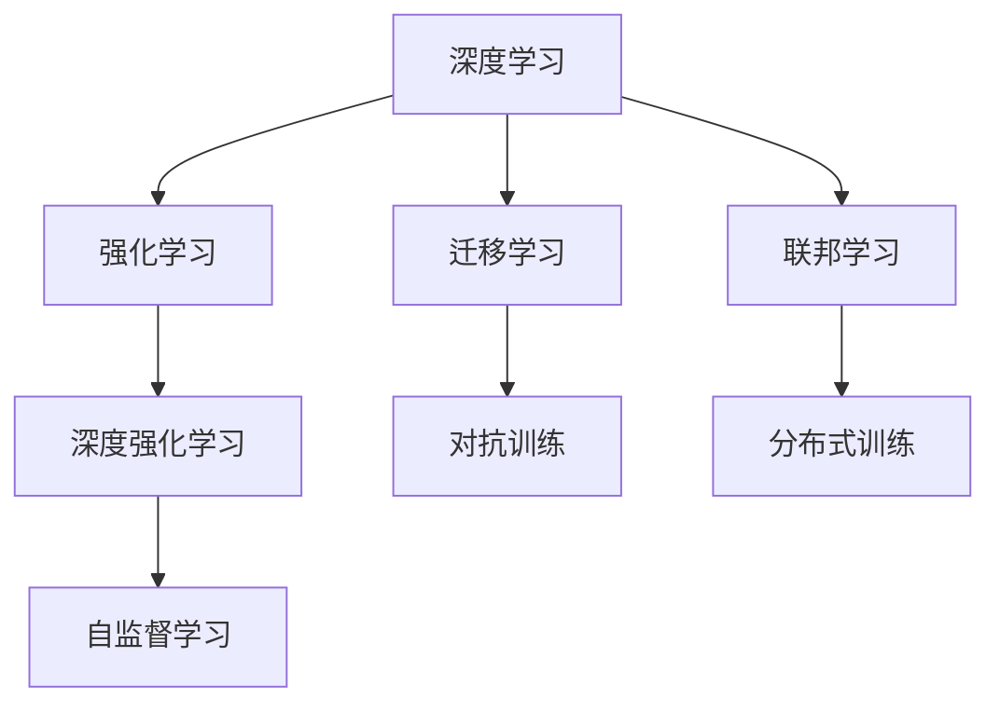

                 

# 软件 2.0 的发展趋势：深度学习、强化学习

> 关键词：深度学习, 强化学习, 自动驾驶, 工业自动化, 机器人, 图像识别, 自然语言处理, 视频分析, 智能游戏

## 1. 背景介绍

### 1.1 问题由来
随着科技的飞速发展，软件技术正处于一个历史性的转折点。传统的软件模式，基于人工编写代码、手工调试维护，已经无法满足快速变化的业务需求。而以深度学习、强化学习为代表的"软件 2.0"范式，正在成为新一代软件技术发展的主流方向。

这一趋势源于以下几个关键因素：

- 数据量的爆炸性增长：大数据时代，从互联网到物联网，海量数据正在以前所未有的速度生成。深度学习、强化学习等数据驱动的方法，通过大数据挖掘，可以揭示复杂数据背后的规律，实现精确的预测和决策。
- 计算能力的飞速提升：随着高性能计算平台（如GPU、TPU）的普及，以及云计算、分布式计算技术的发展，深度学习模型的训练和推理速度显著提升，为复杂任务提供了可行的解决方案。
- 智能交互的需求增加：人们对于智能交互、人机协同的需求日益增长，深度学习、强化学习等方法能够实现自然语言理解、语音识别、视觉感知等高级交互功能，提升用户体验。
- 自动化和优化的要求提高：在工业生产、自动驾驶等领域，高精度、高效率的自动化和优化需求日益迫切。深度学习、强化学习等算法，能够自动发现最优策略，实现更高效的自动化流程。

### 1.2 问题核心关键点
深度学习和强化学习技术，通过学习和优化模型，在诸多领域实现了突破性进展。其核心原理和应用模式如下：

- **深度学习**：基于多层神经网络，从数据中自动学习特征表示，通过反向传播算法进行优化。在图像识别、自然语言处理、视频分析等领域展现了强大的能力。
- **强化学习**：通过与环境交互，优化智能体（如机器人、游戏玩家等）的决策策略，以最大化长期奖励。在自动驾驶、工业自动化、智能游戏等领域具有广泛应用前景。
- **深度强化学习**：将深度学习与强化学习结合，通过神经网络逼近价值函数或策略，实现更高效的策略学习。

这些技术共同构成了"软件 2.0"的核心，驱动了大数据、云计算、人工智能等领域的发展，改变了传统软件开发和运维的范式。

## 2. 核心概念与联系

### 2.1 核心概念概述

为更好地理解深度学习和强化学习技术的发展趋势，本节将介绍几个密切相关的核心概念：

- **深度学习**：基于多层神经网络的学习方法，通过反向传播算法进行优化，自动提取数据特征，实现高精度预测。
- **强化学习**：通过智能体与环境的交互，学习最优决策策略，以最大化长期奖励。
- **深度强化学习**：结合深度学习与强化学习的优点，使用神经网络逼近价值函数或策略，实现高效决策。
- **自监督学习**：利用无标签数据进行预训练，减少标注成本，提高模型泛化能力。
- **迁移学习**：将在一个任务上学习到的知识迁移到另一个相关任务，减少新任务的学习负担。
- **对抗训练**：通过引入对抗样本，提升模型的鲁棒性和泛化能力。
- **联邦学习**：分布式训练大模型，保护数据隐私，提高模型性能。

这些核心概念之间的逻辑关系可以通过以下Mermaid流程图来展示：



这个流程图展示了深度学习和强化学习的核心概念及其之间的联系：

1. 深度学习是强化学习的基础，通过学习大量特征，为智能体提供决策依据。
2. 强化学习则通过智能体与环境的交互，优化决策策略，提升性能。
3. 深度强化学习结合两者的优点，能够处理更加复杂的决策问题。
4. 自监督学习能够提升模型的泛化能力，减少标注成本。
5. 迁移学习能够将知识迁移到新任务，加速模型学习。
6. 对抗训练通过引入对抗样本，提升模型的鲁棒性和泛化能力。
7. 联邦学习通过分布式训练，保护数据隐私，提升模型性能。

这些概念共同构成了深度学习和强化学习的知识体系，为其在实际应用中的广泛应用提供了坚实的基础。

## 3. 核心算法原理 & 具体操作步骤
### 3.1 算法原理概述

深度学习和强化学习的核心算法原理，在于通过大量数据和复杂模型，自动学习特征表示和最优决策策略。其中，深度学习侧重于特征提取，强化学习侧重于决策优化。

### 3.2 算法步骤详解

以深度学习为例，其基本步骤包括：

1. **数据预处理**：清洗、归一化、划分训练集、验证集和测试集等。
2. **模型设计**：选择合适的神经网络架构，如卷积神经网络（CNN）、循环神经网络（RNN）、变压器（Transformer）等。
3. **模型训练**：通过反向传播算法，根据损失函数进行参数优化。
4. **模型评估**：在验证集和测试集上进行性能评估，选择合适的超参数。
5. **模型部署**：将训练好的模型部署到实际应用中，进行推理和预测。

强化学习的步骤则包括：

1. **环境定义**：定义智能体与环境的交互界面，包括状态、动作、奖励等。
2. **策略设计**：选择合适的策略函数，如Q-learning、SARSA等。
3. **模型训练**：通过与环境的交互，不断调整策略参数，最大化长期奖励。
4. **策略评估**：在测试环境中评估策略性能，进行优化。
5. **策略部署**：将训练好的策略部署到实际应用中，控制智能体行为。

### 3.3 算法优缺点

深度学习和强化学习技术各有优缺点，具体如下：

**深度学习的优点**：
1. 自动特征提取：深度学习模型能够自动提取高维特征，减少手工特征工程的工作量。
2. 模型泛化能力强：通过大量数据进行训练，深度学习模型通常具有较强的泛化能力。
3. 应用范围广：深度学习已经在图像识别、自然语言处理、视频分析等领域取得了显著的成果。

**深度学习的缺点**：
1. 数据依赖性强：深度学习需要大量标注数据进行训练，数据采集成本高。
2. 模型复杂度高：深度学习模型通常包含大量参数，训练和推理复杂度高。
3. 易过拟合：深度学习模型容易在训练集上过拟合，泛化能力下降。

**强化学习的优点**：
1. 决策优化能力强：强化学习能够通过与环境的交互，优化智能体的决策策略。
2. 适应性强：强化学习适用于动态环境、不确定性高、复杂决策的问题。
3. 可扩展性强：强化学习算法能够轻松扩展到多智能体、分布式系统等领域。

**强化学习的缺点**：
1. 环境定义复杂：强化学习需要精确定义环境模型，对于复杂环境难以建模。
2. 训练成本高：强化学习通常需要大量计算资源进行训练，训练时间较长。
3. 策略不稳定：强化学习算法容易陷入局部最优解，策略不稳定。

### 3.4 算法应用领域

深度学习和强化学习技术在诸多领域得到了广泛应用，具体如下：

- **自动驾驶**：深度学习用于图像识别、语音识别等感知任务，强化学习用于路径规划、行为控制等决策任务。
- **工业自动化**：深度学习用于质量检测、设备状态预测等任务，强化学习用于机器人控制、优化调度等决策任务。
- **机器人**：深度学习用于视觉识别、动作生成等任务，强化学习用于路径规划、动作优化等决策任务。
- **智能游戏**：深度学习用于图像识别、语音识别等感知任务，强化学习用于游戏策略生成、对手智能控制等决策任务。
- **视频分析**：深度学习用于视频特征提取、行为识别等任务，强化学习用于视频内容生成、自动编辑等决策任务。

此外，深度学习和强化学习还应用于金融、医疗、教育、能源等诸多领域，推动了这些行业的数字化转型和智能化升级。

## 4. 数学模型和公式 & 详细讲解 & 举例说明
### 4.1 数学模型构建

深度学习和强化学习的数学模型，通常包括以下几个关键部分：

- **深度学习模型**：一般使用神经网络进行建模，其中卷积神经网络（CNN）用于图像处理，循环神经网络（RNN）用于序列数据处理，变压器（Transformer）用于自然语言处理等。
- **强化学习模型**：一般使用Q-learning、SARSA、策略梯度等算法进行建模。

以CNN模型为例，其数学模型可以表示为：

$$
y = \text{CNN}(x) = W^l \cdot \sigma(W^{l-1} \cdot \sigma(... \cdot W^1 \cdot x))
$$

其中，$x$ 为输入数据，$y$ 为输出结果，$\sigma$ 为激活函数，$W$ 为权重矩阵。

### 4.2 公式推导过程

以深度学习模型为例，其反向传播算法的公式推导如下：

$$
\frac{\partial \mathcal{L}}{\partial W^l} = \frac{\partial \mathcal{L}}{\partial y} \cdot \frac{\partial y}{\partial W^{l-1}} \cdot \sigma'(W^{l-1} \cdot \sigma(... \cdot W^1 \cdot x))
$$

其中，$\mathcal{L}$ 为损失函数，$\frac{\partial \mathcal{L}}{\partial y}$ 为输出层的梯度，$\frac{\partial y}{\partial W^{l-1}}$ 为中间层的梯度，$\sigma'$ 为激活函数的导数。

### 4.3 案例分析与讲解

以图像分类任务为例，假设输入图像 $x$ 经过CNN模型处理后得到输出 $y$，损失函数为交叉熵损失：

$$
\mathcal{L} = -\frac{1}{N} \sum_{i=1}^N \sum_{j=1}^C y_j \log \hat{y}_j
$$

其中，$N$ 为样本数，$C$ 为类别数，$y_j$ 为真实标签，$\hat{y}_j$ 为模型预测结果。

在训练过程中，通过反向传播算法更新权重矩阵 $W$，最小化损失函数：

$$
W \leftarrow W - \eta \nabla_{W} \mathcal{L}
$$

其中，$\eta$ 为学习率，$\nabla_{W} \mathcal{L}$ 为损失函数对权重的梯度。

## 5. 项目实践：代码实例和详细解释说明
### 5.1 开发环境搭建

在进行深度学习和强化学习项目实践前，我们需要准备好开发环境。以下是使用Python进行TensorFlow开发的环境配置流程：

1. 安装Anaconda：从官网下载并安装Anaconda，用于创建独立的Python环境。

2. 创建并激活虚拟环境：
```bash
conda create -n tf-env python=3.8 
conda activate tf-env
```

3. 安装TensorFlow：根据CUDA版本，从官网获取对应的安装命令。例如：
```bash
conda install tensorflow==2.6.0-cu111
```

4. 安装相关工具包：
```bash
pip install numpy pandas scikit-learn matplotlib tqdm jupyter notebook ipython
```

完成上述步骤后，即可在`tf-env`环境中开始深度学习和强化学习项目的开发。

### 5.2 源代码详细实现

这里我们以图像分类任务为例，给出使用TensorFlow进行卷积神经网络模型训练的代码实现。

首先，定义CNN模型：

```python
import tensorflow as tf
from tensorflow.keras import layers

model = tf.keras.Sequential([
    layers.Conv2D(32, (3,3), activation='relu', input_shape=(28, 28, 1)),
    layers.MaxPooling2D((2,2)),
    layers.Conv2D(64, (3,3), activation='relu'),
    layers.MaxPooling2D((2,2)),
    layers.Flatten(),
    layers.Dense(10, activation='softmax')
])
```

然后，定义训练和评估函数：

```python
from tensorflow.keras import datasets, optimizers
import numpy as np

(x_train, y_train), (x_test, y_test) = datasets.mnist.load_data()
x_train = x_train.reshape(-1, 28, 28, 1) / 255.0
x_test = x_test.reshape(-1, 28, 28, 1) / 255.0

model.compile(optimizer=optimizers.Adam(), loss='sparse_categorical_crossentropy', metrics=['accuracy'])

def train_epoch(model, x, y):
    model.fit(x, y, batch_size=64, epochs=1, validation_data=(x_test, y_test))

def evaluate(model, x, y):
    loss, accuracy = model.evaluate(x, y)
    print('Test loss:', loss)
    print('Test accuracy:', accuracy)
```

最后，启动训练流程并在测试集上评估：

```python
train_epoch(model, x_train, y_train)
evaluate(model, x_test, y_test)
```

以上就是使用TensorFlow进行图像分类任务CNN模型训练的完整代码实现。可以看到，TensorFlow提供了高度模块化的API，使得模型定义、训练和评估过程变得简洁高效。

### 5.3 代码解读与分析

让我们再详细解读一下关键代码的实现细节：

**模型定义**：
- `tf.keras.Sequential`：创建顺序模型，按顺序堆叠多个层。
- `layers.Conv2D`：定义卷积层，用于提取图像特征。
- `layers.MaxPooling2D`：定义池化层，用于降低特征图的维度。
- `layers.Flatten`：将特征图展平为向量。
- `layers.Dense`：定义全连接层，用于分类。

**训练函数**：
- `model.compile`：配置模型的优化器、损失函数和评价指标。
- `model.fit`：使用训练集进行模型训练，设置批次大小和训练轮数。

**评估函数**：
- `model.evaluate`：使用测试集评估模型性能，计算损失和准确率。

**训练流程**：
- 对模型进行定义和编译。
- 使用训练集进行单次epoch的训练。
- 在测试集上评估模型性能，输出损失和准确率。

可以看到，TensorFlow提供的高级API使得模型构建、训练和评估过程非常直观。开发者只需关注核心算法逻辑，即可快速迭代出高精度的模型。

## 6. 实际应用场景
### 6.1 智能驾驶系统

深度学习和强化学习在智能驾驶系统中具有广泛应用。自动驾驶汽车通过摄像头、雷达等传感器获取环境信息，通过深度学习模型进行图像识别、行为预测等任务，通过强化学习模型进行路径规划、决策优化等任务。通过学习和优化，智能驾驶系统能够实现自动泊车、自主导航、交通避障等功能。

在技术实现上，可以收集大量驾驶场景数据，使用深度学习模型进行环境感知，使用强化学习模型进行决策规划。微调后的模型能够适应不同的驾驶场景，提高自动驾驶的安全性和可靠性。

### 6.2 工业生产自动化

深度学习和强化学习在工业生产自动化中也有着广泛应用。自动化生产线通过摄像头、传感器等设备获取生产环境信息，使用深度学习模型进行缺陷检测、设备状态预测等任务，使用强化学习模型进行优化调度、路径规划等任务。通过学习和优化，自动化生产线能够实现高精度、高效率的生产过程。

在技术实现上，可以采集大量生产数据，使用深度学习模型进行环境感知，使用强化学习模型进行决策优化。微调后的模型能够适应不同的生产环境，提高生产线的自动化水平。

### 6.3 机器人控制系统

深度学习和强化学习在机器人控制系统中也具有重要应用。服务机器人通过摄像头、传感器等设备获取环境信息，使用深度学习模型进行目标识别、行为预测等任务，使用强化学习模型进行路径规划、动作优化等任务。通过学习和优化，机器人能够实现自主导航、物品搬运、语音交互等功能。

在技术实现上，可以收集大量机器人操作数据，使用深度学习模型进行环境感知，使用强化学习模型进行决策优化。微调后的模型能够适应不同的操作场景，提高机器人的智能化水平。

### 6.4 未来应用展望

随着深度学习和强化学习技术的不断发展，其在未来将有更广阔的应用前景：

1. **智能家居系统**：通过深度学习和强化学习技术，实现家庭设备的自动化控制，提升家居舒适度和安全性。例如，智能音箱能够理解自然语言指令，自动控制家电设备。
2. **智能医疗系统**：通过深度学习和强化学习技术，实现医疗影像的自动诊断，智能推荐治疗方案，提升医疗服务的效率和质量。例如，智能影像诊断系统能够自动识别肿瘤等病变区域。
3. **智能游戏平台**：通过深度学习和强化学习技术，实现游戏角色的智能决策，提升游戏体验。例如，智能游戏NPC能够自动生成任务、对话等，增强游戏的沉浸感和互动性。
4. **智能城市管理**：通过深度学习和强化学习技术，实现城市交通的智能调控，提升城市管理效率。例如，智能交通系统能够自动优化信号灯控制，缓解交通拥堵。

未来，深度学习和强化学习技术将在更多领域得到应用，推动人工智能技术的普及和发展，为人类社会带来更多便利和福祉。

## 7. 工具和资源推荐
### 7.1 学习资源推荐

为了帮助开发者系统掌握深度学习和强化学习理论基础和实践技巧，这里推荐一些优质的学习资源：

1. **《深度学习》系列课程**：斯坦福大学开设的深度学习课程，详细讲解了深度学习的基本原理、算法和应用。
2. **《强化学习》系列课程**：Coursera上的强化学习课程，涵盖强化学习的基本原理、算法和应用。
3. **TensorFlow官方文档**：TensorFlow的官方文档，提供了丰富的模型和算法示例，适合学习和实践。
4. **PyTorch官方文档**：PyTorch的官方文档，提供了丰富的模型和算法示例，适合学习和实践。
5. **Kaggle竞赛平台**：Kaggle的机器学习竞赛平台，提供了大量实战项目和数据集，适合训练和竞赛。
6. **arXiv预印本**：arXiv预印本，汇集了大量前沿研究论文，适合学习和阅读。

通过对这些资源的学习和实践，相信你一定能够快速掌握深度学习和强化学习的精髓，并用于解决实际问题。

### 7.2 开发工具推荐

高效的开发离不开优秀的工具支持。以下是几款用于深度学习和强化学习开发的常用工具：

1. **TensorFlow**：由Google主导开发的深度学习框架，功能全面，支持分布式训练和部署。
2. **PyTorch**：由Facebook主导开发的深度学习框架，灵活高效，支持动态图和静态图。
3. **OpenAI Gym**：OpenAI开发的强化学习环境库，支持多种游戏和任务。
4. **RLlib**：Facebook开发的强化学习库，支持分布式训练和多种算法。
5. **TensorBoard**：TensorFlow配套的可视化工具，可实时监测模型训练状态，提供丰富的图表呈现方式。
6. **Weights & Biases**：模型训练的实验跟踪工具，可以记录和可视化模型训练过程中的各项指标，方便对比和调优。

合理利用这些工具，可以显著提升深度学习和强化学习的开发效率，加快创新迭代的步伐。

### 7.3 相关论文推荐

深度学习和强化学习的研究发展迅速，以下是几篇奠基性的相关论文，推荐阅读：

1. **《ImageNet Classification with Deep Convolutional Neural Networks》**：提出卷积神经网络（CNN），用于图像分类任务，取得了SOTA结果。
2. **《Playing Atari with Deep Reinforcement Learning》**：提出使用深度强化学习训练DQN模型，实现自动玩游戏任务。
3. **《AlphaGo Zero》**：提出使用深度强化学习训练AlphaGoZero模型，实现了围棋零样本学习。
4. **《Object Detection with Deep Convolutional Neural Networks》**：提出使用深度学习进行目标检测任务，取得了SOTA结果。
5. **《Generative Adversarial Nets》**：提出生成对抗网络（GAN），用于生成高质量的图像和视频等。

这些论文代表了大数据、深度学习和强化学习的发展脉络。通过学习这些前沿成果，可以帮助研究者把握学科前进方向，激发更多的创新灵感。

## 8. 总结：未来发展趋势与挑战

### 8.1 总结

本文对深度学习和强化学习的发展趋势进行了全面系统的介绍。首先阐述了深度学习和强化学习技术的研究背景和意义，明确了深度学习和强化学习在自动驾驶、工业自动化、机器人等领域的重要作用。其次，从原理到实践，详细讲解了深度学习和强化学习的数学模型和核心算法，给出了深度学习和强化学习任务的代码实现。同时，本文还广泛探讨了深度学习和强化学习在实际应用中的广泛场景，展示了其强大的应用潜力。此外，本文精选了深度学习和强化学习的学习资源、开发工具和相关论文，力求为读者提供全方位的技术指引。

通过本文的系统梳理，可以看到，深度学习和强化学习技术正在成为AI领域的主流方向，极大地推动了大数据、云计算、人工智能等领域的发展，改变了传统软件开发和运维的范式。未来，伴随深度学习和强化学习技术的不断演进，其在更多领域得到应用，将为人类社会带来更多的便利和福祉。

### 8.2 未来发展趋势

展望未来，深度学习和强化学习技术将呈现以下几个发展趋势：

1. **模型规模持续增大**：随着算力成本的下降和数据规模的扩张，深度学习模型的参数量还将持续增长。超大规模模型蕴含的丰富知识，将支撑更加复杂多变的任务。
2. **模型泛化能力增强**：深度学习和强化学习技术将通过迁移学习、自监督学习等方法，提升模型的泛化能力，减少对标注数据的依赖。
3. **模型实时性提升**：通过模型裁剪、量化加速、分布式训练等技术，深度学习和强化学习模型将具备更高的实时性和推理效率。
4. **多模态融合能力提升**：深度学习和强化学习技术将更好地整合视觉、语音、文本等多模态信息，实现更全面的感知和决策。
5. **模型交互能力增强**：通过对话系统、智能代理等技术，深度学习和强化学习模型将具备更强的交互能力，提升用户体验。
6. **模型安全性提升**：通过引入对抗样本、隐私保护等技术，深度学习和强化学习模型将具备更高的安全性和鲁棒性。

以上趋势凸显了深度学习和强化学习技术的广阔前景。这些方向的探索发展，必将进一步提升AI系统的性能和应用范围，为人类社会带来更多的便利和福祉。

### 8.3 面临的挑战

尽管深度学习和强化学习技术已经取得了显著的成果，但在迈向更加智能化、普适化应用的过程中，仍然面临诸多挑战：

1. **数据采集成本高**：深度学习和强化学习需要大量标注数据进行训练，数据采集和标注成本高昂。如何降低数据成本，提升数据质量，是一个重要课题。
2. **模型泛化能力不足**：深度学习和强化学习模型容易在训练集上过拟合，泛化能力下降。如何提升模型的泛化能力，减少过拟合风险，仍然是一个挑战。
3. **模型鲁棒性不足**：深度学习和强化学习模型面对噪声、对抗样本等干扰时，性能波动较大。如何提升模型的鲁棒性，避免过拟合和灾难性遗忘，仍然是一个挑战。
4. **模型可解释性不足**：深度学习和强化学习模型通常被称为"黑盒"系统，难以解释其内部工作机制和决策逻辑。如何提升模型的可解释性，增强模型可信度，仍然是一个挑战。
5. **模型计算资源消耗大**：深度学习和强化学习模型计算资源消耗大，训练和推理复杂度高。如何提升模型效率，降低资源消耗，仍然是一个挑战。
6. **模型安全性不足**：深度学习和强化学习模型容易学习到有害信息，产生误导性、歧视性的输出。如何保证模型安全性，防止恶意用途，仍然是一个挑战。

正视这些挑战，积极应对并寻求突破，将使深度学习和强化学习技术更加成熟和稳定，为构建安全、可靠、可解释、可控的智能系统铺平道路。

### 8.4 研究展望

面向未来，深度学习和强化学习技术需要在以下几个方面寻求新的突破：

1. **无监督和半监督学习**：探索无监督和半监督学习方法，减少对标注数据的依赖，提升模型的泛化能力。
2. **模型压缩和优化**：开发模型裁剪、量化加速、分布式训练等技术，提升模型的实时性和推理效率。
3. **多模态融合**：将视觉、语音、文本等多模态信息进行融合，实现更全面的感知和决策。
4. **模型交互**：通过对话系统、智能代理等技术，提升模型的交互能力和用户体验。
5. **模型安全性**：引入对抗样本、隐私保护等技术，提升模型的安全性。
6. **模型可解释性**：引入因果推断、模型可视化等技术，提升模型的可解释性和可信度。

这些研究方向的研究，必将引领深度学习和强化学习技术迈向更高的台阶，为构建安全、可靠、可解释、可控的智能系统提供坚实的基础。未来，深度学习和强化学习技术将与其他人工智能技术进行更深入的融合，共同推动自然语言理解和智能交互系统的进步，为人类认知智能的进化带来深远影响。

## 9. 附录：常见问题与解答

**Q1：深度学习和强化学习与传统机器学习有何区别？**

A: 深度学习和强化学习与传统机器学习的区别主要体现在以下几个方面：
1. 数据依赖性：深度学习和强化学习需要大量数据进行训练，而传统机器学习可以在少量数据上获得较好的效果。
2. 模型复杂度：深度学习和强化学习模型通常包含大量参数，结构复杂，而传统机器学习模型结构相对简单。
3. 学习方式：深度学习和强化学习模型通过反向传播和与环境的交互进行学习，而传统机器学习模型通过手动设计特征进行学习。
4. 应用场景：深度学习和强化学习模型适用于大规模数据和高复杂度任务，如图像识别、自然语言处理、自动驾驶等，而传统机器学习模型适用于小规模数据和低复杂度任务。

**Q2：深度学习和强化学习在训练过程中容易出现什么问题？**

A: 深度学习和强化学习在训练过程中容易出现以下问题：
1. 过拟合：深度学习和强化学习模型容易在训练集上过拟合，泛化能力下降。需要采用正则化、Dropout等技术进行缓解。
2. 梯度消失或爆炸：深度学习模型在反向传播过程中，梯度容易消失或爆炸，导致模型训练困难。需要采用激活函数、梯度裁剪等技术进行优化。
3. 模型不稳定：深度学习和强化学习模型容易陷入局部最优解，策略不稳定。需要采用随机梯度下降、Adam等优化器进行优化。
4. 数据质量问题：深度学习和强化学习模型对数据质量要求较高，数据采集和标注成本高。需要采用数据增强、对抗样本等技术进行优化。

**Q3：深度学习和强化学习在实际应用中需要注意哪些问题？**

A: 深度学习和强化学习在实际应用中需要注意以下问题：
1. 数据隐私保护：深度学习和强化学习模型通常需要大量数据进行训练，需要注意数据隐私保护，防止数据泄露。
2. 模型部署效率：深度学习和强化学习模型通常规模较大，需要考虑模型部署效率，避免资源浪费。
3. 模型监控和调试：深度学习和强化学习模型需要实时监控和调试，及时发现和解决模型问题。
4. 模型鲁棒性提升：深度学习和强化学习模型需要具备鲁棒性，避免模型在噪声、对抗样本等干扰下性能下降。
5. 模型可解释性增强：深度学习和强化学习模型需要具备可解释性，增强模型可信度和用户理解。

综上所述，深度学习和强化学习技术在实际应用中需要注意数据、模型、训练、推理等多个环节的优化和提升。只有在数据、算法、工程、业务等多个维度协同发力，才能真正实现深度学习和强化学习技术在实际应用中的价值。

---

作者：禅与计算机程序设计艺术 / Zen and the Art of Computer Programming

