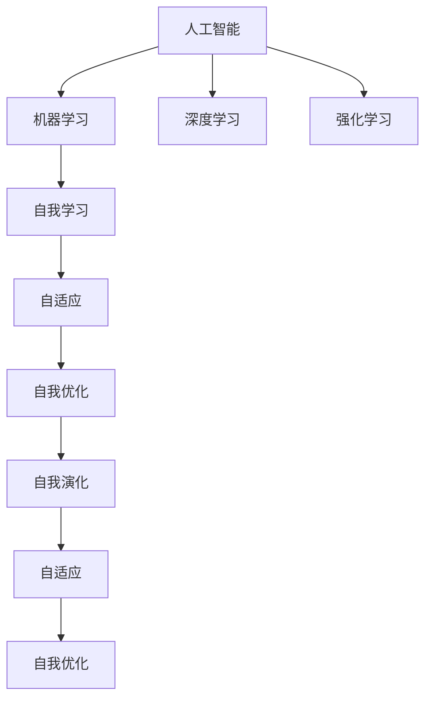
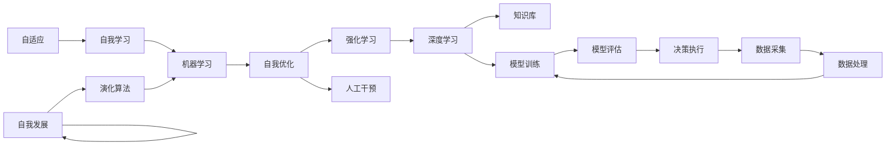

                 

## 1. 背景介绍

### 1.1 问题由来

软件的发展经历了从 1.0 到 2.0 的演变，1.0 的开发模式以“编程即编码”为特点，程序员通过代码手动实现功能。而 2.0 时代，软件开发模式则变为“编程即描述”，用户通过界面等方式描述需求，软件自动生成代码实现。这一变化，标志着软件从"手写"向"自生"的转变，即软件从程序员的笔下走向了人工智能的决策。

人工智能(AI)的哲学本质在于，它是一种自我发展的能力，而不是单纯依赖人的指令进行执行。AI 之所以能够成为软件 2.0 的基石，是因为它具备自我进化、自我学习、自我适应、自我优化的能力，这正是软件 2.0 追求的目标。

### 1.2 问题核心关键点

1. **编程范式转变**：从传统的“编程即编码”转变为“编程即描述”。
2. **自我发展能力**：AI 具备自我进化、学习、适应、优化的能力。
3. **泛化与应用**：AI 能够泛化于多种领域，应用于多个场景。
4. **人机协同**：AI 与人类共同协作，提升决策与执行效率。
5. **伦理与责任**：AI 决策透明性、可解释性、责任归属等伦理问题。

## 2. 核心概念与联系

### 2.1 核心概念概述

为更好地理解 AI 的本质，本节将介绍几个密切相关的核心概念：

- **人工智能**：通过机器学习、深度学习、强化学习等技术，使机器具备模仿人类智能行为的能力。
- **机器学习**：让机器通过数据学习和改进模型，无需人工编程实现特定功能。
- **深度学习**：利用神经网络模型，模拟人脑的层次化结构，实现高维数据的表示与处理。
- **强化学习**：通过奖励机制，使机器在连续环境中不断试错学习，优化策略实现目标。
- **自我学习**：AI 自动进行特征提取、模型训练等学习过程，无需人工干预。
- **自适应**：AI 能够根据环境变化，调整自身策略，适应新任务。
- **自我优化**：AI 能够不断优化自身算法，提升性能。
- **自我演化**：AI 通过遗传算法、种群演化等方法，进行自我迭代，不断提升能力。

这些核心概念之间的逻辑关系可以通过以下 Mermaid 流程图来展示：



这个流程图展示了一些关键概念间的联系，强调了人工智能如何通过不同技术手段实现自我发展能力。

### 2.2 核心概念原理和架构的 Mermaid 流程图

以下是 Mermaid 流程图的具体绘制：



此图展示了 AI 从数据采集、处理、模型训练、评估到决策执行的全过程，以及各个阶段之间的联系。

## 3. 核心算法原理 & 具体操作步骤

### 3.1 算法原理概述

人工智能的算法原理主要包括以下几个方面：

- **监督学习**：通过有标注的数据，训练模型预测新数据的结果。
- **无监督学习**：从未标注的数据中，自动发现数据的内在结构。
- **强化学习**：通过奖励机制，使模型在特定环境中学习最优策略。
- **生成对抗网络**：利用对抗性训练，生成高质量的伪造数据。
- **迁移学习**：将一个领域学到的知识，迁移到另一个领域，提升学习效率。
- **自适应学习**：根据环境变化，自动调整模型参数。
- **演化算法**：通过模拟自然界的演化过程，优化模型参数。

### 3.2 算法步骤详解

以深度学习算法为例，其步骤通常包括以下几个关键点：

**Step 1: 数据准备**
- 收集标注数据，准备训练集、验证集、测试集。
- 预处理数据，如归一化、降维、特征提取等。

**Step 2: 模型构建**
- 选择神经网络结构，如卷积神经网络、循环神经网络等。
- 设计损失函数，如交叉熵损失、均方误差损失等。

**Step 3: 模型训练**
- 初始化模型参数，如权重、偏置等。
- 前向传播，计算预测值与真实值之差，得到损失。
- 反向传播，根据损失函数计算梯度。
- 更新参数，使损失最小化。

**Step 4: 模型评估**
- 在验证集上评估模型性能，如精度、召回率、F1 值等。
- 调整模型超参数，如学习率、批大小、迭代轮数等。

**Step 5: 模型测试**
- 在测试集上测试模型性能，如准确率、误差率、ROC 曲线等。
- 分析模型性能，优化模型结构。

### 3.3 算法优缺点

深度学习算法的主要优点包括：

- 能够处理高维数据，适合大规模数据集。
- 自适应能力强，适应不同领域、不同任务。
- 具有很高的泛化能力，能够应用于多种场景。
- 能够自动提取特征，无需人工干预。

深度学习算法的主要缺点包括：

- 需要大量标注数据，训练成本高。
- 模型复杂，计算量大，训练时间长。
- 存在过拟合风险，需要正则化等方法避免。
- 黑盒模型，难以解释决策过程。

### 3.4 算法应用领域

深度学习算法已经在众多领域得到广泛应用，包括但不限于：

- **计算机视觉**：图像识别、物体检测、图像生成等。
- **自然语言处理**：文本分类、情感分析、机器翻译等。
- **语音识别**：语音转文字、情感识别、语音生成等。
- **医疗**：疾病诊断、影像分析、基因分析等。
- **自动驾驶**：目标检测、道路识别、决策规划等。
- **游戏与娱乐**：智能推荐、角色控制、虚拟现实等。

这些应用展示了深度学习算法的强大能力，证明了其在各个领域的广泛适用性。

## 4. 数学模型和公式 & 详细讲解 & 举例说明

### 4.1 数学模型构建

以神经网络为例，数学模型构建的过程可以概括为以下几个步骤：

1. 定义输入数据 $x$ 和输出目标 $y$。
2. 定义神经网络结构，包括输入层、隐藏层、输出层等。
3. 定义损失函数，如均方误差 $MSE$。
4. 定义优化器，如随机梯度下降 $SGD$。
5. 定义模型训练的迭代过程。

数学模型构建的具体公式如下：

$$
\begin{aligned}
\text{输入层} & : x = (x_1, x_2, ..., x_n) \\
\text{隐藏层} & : h = W_1x + b_1 \\
\text{输出层} & : y = W_2h + b_2 \\
\text{损失函数} & : L(y, \hat{y}) = \frac{1}{2n}\sum_{i=1}^n (y_i - \hat{y}_i)^2 \\
\text{优化器} & : \theta_j = \theta_j - \eta \frac{\partial L(y, \hat{y})}{\partial \theta_j}
\end{aligned}
$$

其中，$W$ 为权重矩阵，$b$ 为偏置向量，$\eta$ 为学习率，$\theta$ 为模型参数。

### 4.2 公式推导过程

以一个简单的单层神经网络为例，进行数学模型的推导。

设输入数据 $x$ 为二维向量 $(x_1, x_2)$，输出目标 $y$ 为单值 $y_1$。定义单层神经网络的结构如下：

$$
h = W_1x + b_1 \\
y = W_2h + b_2
$$

其中 $W_1$ 和 $W_2$ 为权重矩阵，$b_1$ 和 $b_2$ 为偏置向量。

假设 $y$ 的预测值为 $\hat{y}$，则损失函数为：

$$
L(y, \hat{y}) = \frac{1}{2}(y_1 - \hat{y})^2
$$

对 $W_1$、$W_2$、$b_1$、$b_2$ 求偏导，得：

$$
\frac{\partial L(y, \hat{y})}{\partial W_1} = \frac{\partial \left(\frac{1}{2}(y_1 - h_1)^2\right)}{\partial W_1} = (y_1 - h_1)h \\
\frac{\partial L(y, \hat{y})}{\partial b_1} = \frac{\partial \left(\frac{1}{2}(y_1 - h_1)^2\right)}{\partial b_1} = y_1 - h_1 \\
\frac{\partial L(y, \hat{y})}{\partial W_2} = \frac{\partial \left(\frac{1}{2}(y_1 - y_2)^2\right)}{\partial W_2} = (y_1 - y_2)h \\
\frac{\partial L(y, \hat{y})}{\partial b_2} = \frac{\partial \left(\frac{1}{2}(y_1 - y_2)^2\right)}{\partial b_2} = y_1 - y_2
$$

根据反向传播算法，可以求得权重和偏置的更新公式：

$$
W_1 = W_1 - \eta (y_1 - h_1)h \\
b_1 = b_1 - \eta (y_1 - h_1) \\
W_2 = W_2 - \eta (y_1 - y_2)h \\
b_2 = b_2 - \eta (y_1 - y_2)
$$

其中 $\eta$ 为学习率。

### 4.3 案例分析与讲解

以手写数字识别为例，进行深度学习模型的案例分析。

**Step 1: 数据准备**
- 收集 MNIST 数据集，其中包含 60000 张手写数字图片和标签。
- 数据预处理，将图片归一化、转换为向量形式。

**Step 2: 模型构建**
- 定义神经网络结构，包括一个输入层、两个隐藏层、一个输出层。
- 定义交叉熵损失函数。

**Step 3: 模型训练**
- 初始化模型参数，随机设置权重、偏置。
- 前向传播，计算预测值与真实值之差。
- 反向传播，计算梯度。
- 更新参数，使损失最小化。

**Step 4: 模型评估**
- 在验证集上评估模型性能，如准确率、误差率等。
- 调整模型超参数，如学习率、批大小等。

**Step 5: 模型测试**
- 在测试集上测试模型性能，如准确率、误差率、ROC 曲线等。
- 分析模型性能，优化模型结构。

最终，通过不断迭代训练，可以构建一个手写数字识别精度极高的神经网络模型。

## 5. 项目实践：代码实例和详细解释说明

### 5.1 开发环境搭建

在进行深度学习项目实践前，我们需要准备好开发环境。以下是使用 Python 进行 PyTorch 开发的环境配置流程：

1. 安装 Anaconda：从官网下载并安装 Anaconda，用于创建独立的 Python 环境。

2. 创建并激活虚拟环境：
```bash
conda create -n torch-env python=3.8 
conda activate torch-env
```

3. 安装 PyTorch：根据 CUDA 版本，从官网获取对应的安装命令。例如：
```bash
conda install pytorch torchvision torchaudio cudatoolkit=11.1 -c pytorch -c conda-forge
```

4. 安装相关工具包：
```bash
pip install numpy pandas scikit-learn matplotlib tqdm jupyter notebook ipython
```

完成上述步骤后，即可在 `torch-env` 环境中开始深度学习项目实践。

### 5.2 源代码详细实现

这里我们以手写数字识别为例，给出使用 PyTorch 进行深度学习项目开发的完整代码实现。

首先，定义手写数字识别任务的数据处理函数：

```python
import torch
from torchvision import datasets, transforms
from torch.utils.data import DataLoader

# 数据预处理
transform = transforms.Compose([
    transforms.ToTensor(),
    transforms.Normalize((0.1307,), (0.3081,))
])

# 加载数据集
train_dataset = datasets.MNIST(root='data', train=True, download=True, transform=transform)
test_dataset = datasets.MNIST(root='data', train=False, download=True, transform=transform)

# 数据批处理
train_loader = DataLoader(train_dataset, batch_size=64, shuffle=True)
test_loader = DataLoader(test_dataset, batch_size=64, shuffle=False)
```

然后，定义模型和优化器：

```python
import torch.nn as nn
import torch.optim as optim

# 定义神经网络结构
class Net(nn.Module):
    def __init__(self):
        super(Net, self).__init__()
        self.fc1 = nn.Linear(784, 500)
        self.fc2 = nn.Linear(500, 10)

    def forward(self, x):
        x = x.view(-1, 784)
        x = torch.relu(self.fc1(x))
        x = self.fc2(x)
        return x

# 定义优化器
model = Net()
criterion = nn.CrossEntropyLoss()
optimizer = optim.SGD(model.parameters(), lr=0.01, momentum=0.5)
```

接着，定义训练和评估函数：

```python
import matplotlib.pyplot as plt

# 训练函数
def train(epoch):
    model.train()
    running_loss = 0.0
    for batch_idx, (data, target) in enumerate(train_loader):
        optimizer.zero_grad()
        output = model(data)
        loss = criterion(output, target)
        loss.backward()
        optimizer.step()
        running_loss += loss.item()
        if batch_idx % 100 == 99:
            print('[%d, %5d] loss: %.3f' %
                  (epoch + 1, batch_idx + 1, running_loss / 100))
            running_loss = 0.0

# 评估函数
def test():
    model.eval()
    correct = 0
    total = 0
    with torch.no_grad():
        for data, target in test_loader:
            output = model(data)
            _, predicted = torch.max(output.data, 1)
            total += target.size(0)
            correct += (predicted == target).sum().item()

    print('Accuracy of the network on the 10000 test images: %d %%' % (
        100 * correct / total))

# 启动训练
for epoch in range(10):
    train(epoch)
    test()
```

最后，启动训练流程：

```python
# 训练模型
for epoch in range(10):
    train(epoch)
    test()
```

以上就是使用 PyTorch 进行深度学习项目开发的完整代码实现。可以看到，得益于 PyTorch 的强大封装，我们能够以相对简洁的代码完成手写数字识别的深度学习任务。

### 5.3 代码解读与分析

让我们再详细解读一下关键代码的实现细节：

**Net 类**：
- `__init__` 方法：初始化神经网络结构。
- `forward` 方法：前向传播计算模型输出。

**训练函数**：
- 在每个epoch内，使用 DataLoader 对训练集进行批次化加载。
- 对每个批次数据，前向传播计算模型输出，并使用交叉熵损失计算损失。
- 反向传播计算梯度，并使用 SGD 优化器更新模型参数。
- 输出每个batch的平均损失。

**测试函数**：
- 在测试集上，对模型进行评估，计算准确率。
- 打印模型在测试集上的表现。

可以看到，PyTorch 的深度学习框架具有简单易用的特性，使得开发者可以更专注于算法设计和模型优化。

当然，工业级的系统实现还需考虑更多因素，如模型的保存和部署、超参数的自动搜索、更灵活的训练目标等。但核心的深度学习范式基本与此类似。

## 6. 实际应用场景

### 6.1 医疗影像诊断

深度学习算法已经在医疗影像诊断领域得到广泛应用，通过图像处理和模式识别技术，帮助医生快速准确地进行疾病诊断。例如，利用卷积神经网络(CNN)对医学影像进行特征提取和分类，可以识别出肿瘤、骨折、脑出血等疾病。

**案例**：使用卷积神经网络进行乳腺癌筛查。医生拍摄乳腺 X 光片，卷积神经网络自动分析图像，识别出恶性肿瘤。该方法能够快速准确地筛查出乳腺癌，显著提高乳腺癌的早期诊断率，降低乳腺癌患者的死亡率。

### 6.2 金融欺诈检测

金融欺诈检测是深度学习算法在金融领域的重要应用之一。通过分析客户的交易行为和金融记录，深度学习算法可以识别出异常交易和欺诈行为，及时预警，保护金融机构和客户资产安全。

**案例**：使用深度学习算法对信用卡交易进行分析，识别出信用卡盗刷、洗钱等异常行为。通过实时监测交易记录，并结合用户行为模式，深度学习算法能够准确地识别出可疑交易，及时通知银行，防止资金流失。

### 6.3 自动驾驶

自动驾驶是深度学习算法在交通领域的重要应用。通过图像识别、路径规划、决策优化等技术，深度学习算法可以使汽车自动完成驾驶任务，提高驾驶安全性、舒适性和效率。

**案例**：使用卷积神经网络进行车道识别，深度学习算法可以自动识别车道线，并计算出车辆的当前位置。通过与其他传感器信息结合，深度学习算法可以规划出最优路径，自动驾驶汽车安全行驶。

### 6.4 未来应用展望

未来，随着深度学习算法的发展，AI 将在更多领域得到应用，为人类带来更多的便利和效益。以下是一些未来应用展望：

- **智能家居**：深度学习算法可以用于智能家居设备的识别和控制，提高生活便捷性。
- **个性化推荐**：深度学习算法可以用于电商、视频、音乐等平台的个性化推荐，提升用户体验。
- **教育**：深度学习算法可以用于学生行为分析、作业批改、智能辅导等，提升教育效果。
- **智慧城市**：深度学习算法可以用于城市交通管理、环境监测、灾害预警等，提升城市治理水平。
- **医疗健康**：深度学习算法可以用于疾病预测、基因分析、药物研发等，提升医疗健康水平。

深度学习算法在各个领域的广泛应用，将深刻改变人类的生产生活方式，带来新的机遇和挑战。

## 7. 工具和资源推荐

### 7.1 学习资源推荐

为了帮助开发者系统掌握深度学习理论基础和实践技巧，这里推荐一些优质的学习资源：

1. **《深度学习》教材**：由深度学习领域权威学者 Ian Goodfellow 等合著，系统介绍了深度学习的理论基础和实践方法。
2. **Coursera 深度学习课程**：由深度学习先驱 Andrew Ng 开设，涵盖了深度学习的基础和进阶内容。
3. **Kaggle 数据科学竞赛**：通过参与深度学习项目竞赛，获取实战经验，了解最新应用案例。
4. **PyTorch 官方文档**：提供丰富的教程和示例代码，是深度学习开发的必备参考资料。
5. **TensorFlow 官方文档**：提供深度学习框架的详细文档和示例，支持多种编程语言和设备。

通过对这些资源的学习实践，相信你一定能够快速掌握深度学习技术的精髓，并用于解决实际的深度学习问题。

### 7.2 开发工具推荐

高效的开发离不开优秀的工具支持。以下是几款用于深度学习开发的常用工具：

1. **PyTorch**：基于 Python 的开源深度学习框架，灵活动态的计算图，适合快速迭代研究。
2. **TensorFlow**：由 Google 主导开发的开源深度学习框架，生产部署方便，适合大规模工程应用。
3. **MXNet**：由亚马逊公司开发的深度学习框架，支持多种编程语言和设备，具有高效的分布式训练能力。
4. **Keras**：高层神经网络 API，简洁易用，适合快速原型设计和实验验证。
5. **JAX**：由 Google 开发的自动微分库，支持高性能计算和自动向量化和并行化。

合理利用这些工具，可以显著提升深度学习任务的开发效率，加快创新迭代的步伐。

### 7.3 相关论文推荐

深度学习算法的快速发展离不开学界的持续研究。以下是几篇奠基性的相关论文，推荐阅读：

1. **AlexNet**：Alex Krizhevsky 等人提出的深度卷积神经网络，开启了深度学习在图像识别领域的应用。
2. **ResNet**：Kaiming He 等人提出的残差网络，解决了深度神经网络中的梯度消失问题，使得深层网络成为可能。
3. **VGG**：Simonyan 和 Zisserman 等人提出的卷积神经网络，通过大量实验验证了卷积神经网络在图像识别中的有效性。
4. **LSTM**：Hochreiter 和 Schmidhuber 等人提出的长短时记忆网络，用于处理序列数据，显著提升了自然语言处理任务的性能。
5. **YOLO**：Joseph Redmon 等人提出的实时单阶段检测器，实现了目标检测任务的快速准确识别。

这些论文代表了大深度学习算法的研发历程，推动了深度学习技术的广泛应用。

## 8. 总结：未来发展趋势与挑战

### 8.1 研究成果总结

本文对深度学习算法的原理、操作步骤、实际应用等进行了全面系统的介绍。通过本文的梳理，可以看到深度学习算法在各个领域的广泛应用，证明了其在工业界的巨大价值。同时，本文还提供了深度学习项目开发的完整代码实现，为开发者提供了实际应用的参考。

### 8.2 未来发展趋势

未来，深度学习算法将呈现以下几个发展趋势：

1. **模型规模持续增大**：随着算力成本的下降和数据规模的扩张，深度学习模型的参数量还将持续增长，具有更大容量的模型将带来更好的性能。
2. **自适应学习成为常态**：深度学习模型将具备更强的自适应能力，能够实时学习新知识和数据，适应环境变化。
3. **多模态融合**：深度学习算法将与其他模态（如视觉、听觉、传感器等）进行融合，实现更加全面和准确的感知和理解。
4. **可解释性和透明性增强**：深度学习模型将具备更好的可解释性和透明性，能够提供更有说服力的决策依据。
5. **边缘计算普及**：深度学习模型将更多地应用于边缘计算环境，减少数据传输，提高计算效率。
6. **多任务学习**：深度学习模型将能够同时处理多个任务，提升资源利用率，降低开发成本。

### 8.3 面临的挑战

尽管深度学习算法已经取得了巨大成功，但在迈向更加智能化、普适化应用的过程中，它仍面临诸多挑战：

1. **计算资源瓶颈**：深度学习模型对计算资源的要求较高，大规模模型的训练和推理需要高性能设备。
2. **数据标注成本高**：深度学习算法通常需要大量标注数据进行训练，数据标注成本高。
3. **模型鲁棒性不足**：深度学习模型对输入数据的变化较为敏感，鲁棒性不足。
4. **可解释性差**：深度学习模型的决策过程难以解释，缺乏可解释性。
5. **安全性和隐私问题**：深度学习模型的应用可能导致数据隐私泄露和模型滥用等问题。

### 8.4 研究展望

未来，深度学习算法需要在以下几个方面进行深入研究：

1. **低资源高效模型**：开发低资源、高效能的深度学习模型，适用于资源受限的场景。
2. **多任务联合训练**：开发能够同时处理多个任务的深度学习模型，提升资源利用率。
3. **自监督学习**：通过无监督学习，减少对标注数据的依赖，降低标注成本。
4. **自适应算法**：开发更加自适应、鲁棒的深度学习算法，提升模型性能和泛化能力。
5. **知识图谱融合**：将深度学习算法与知识图谱进行结合，提升模型理解和推理能力。
6. **伦理与安全**：研究深度学习算法的伦理和安全问题，确保模型应用符合人类价值观和法律法规。

这些研究方向的探索，将推动深度学习技术不断进步，提升其在各个领域的实际应用能力。

## 9. 附录：常见问题与解答

**Q1：深度学习算法是否适合所有数据类型？**

A: 深度学习算法适合处理结构化数据和非结构化数据，但不同类型的数据需要不同的处理方法。例如，图像数据通常使用卷积神经网络，文本数据通常使用循环神经网络或Transformer模型。对于非结构化数据，如语音、视频等，需要进行特征提取和编码，才能输入到深度学习模型中。

**Q2：深度学习算法是否需要大量标注数据？**

A: 深度学习算法通常需要大量标注数据进行训练，但可以通过迁移学习和无监督学习方法，减少对标注数据的依赖。例如，可以使用预训练模型和领域特定数据，进行微调和小样本学习。

**Q3：深度学习算法如何避免过拟合？**

A: 深度学习算法可以通过以下方法避免过拟合：
1. 数据增强：通过对数据进行扰动、旋转、缩放等操作，扩充训练集。
2. 正则化：使用L2正则、Dropout等技术，限制模型复杂度。
3. 早停机制：在验证集上评估模型性能，当性能不再提升时，停止训练。
4. 批标准化：对每一层的输入数据进行标准化，减少内部协变量偏移。

这些方法可以在一定程度上降低深度学习算法的过拟合风险。

**Q4：深度学习算法在实际应用中需要注意哪些问题？**

A: 在实际应用中，深度学习算法需要注意以下问题：
1. 模型部署：将深度学习模型部署到生产环境中，需要考虑性能、资源和可靠性等问题。
2. 模型优化：针对不同场景进行模型调优，提升性能和可解释性。
3. 数据隐私：在使用深度学习算法处理敏感数据时，需要考虑数据隐私和安全问题。
4. 模型监控：实时监控深度学习模型的性能和健康状况，及时发现问题并进行处理。
5. 模型更新：定期更新深度学习模型，适应新的数据和任务需求。

合理处理这些问题，可以确保深度学习算法在实际应用中的稳定性和可靠性。

**Q5：深度学习算法的未来发展方向是什么？**

A: 深度学习算法的未来发展方向包括：
1. 模型规模化：开发更大规模的深度学习模型，提升模型的表现力和泛化能力。
2. 多任务学习：开发能够同时处理多个任务的深度学习算法，提升资源利用率。
3. 自适应算法：开发更加自适应、鲁棒的深度学习算法，适应环境变化。
4. 可解释性算法：开发具备可解释性和透明性的深度学习算法，提升模型的可信度和可接受性。
5. 边缘计算：开发适用于边缘计算环境的深度学习算法，提升计算效率和数据隐私。

这些方向的研究将进一步推动深度学习技术的发展，提升其在各个领域的实际应用能力。

---

作者：禅与计算机程序设计艺术 / Zen and the Art of Computer Programming

