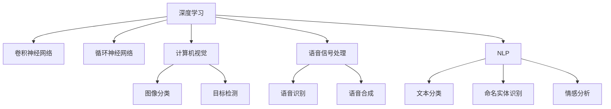

                 

# 软件 2.0 的应用领域：图像识别、语音识别

> 关键词：软件 2.0, 图像识别, 语音识别, 深度学习, 卷积神经网络, 循环神经网络, 计算机视觉, 语音信号处理, 自然语言处理

## 1. 背景介绍

### 1.1 问题由来
随着计算机科学和人工智能技术的飞速发展，软件2.0（Software 2.0）的概念应运而生。它指的是软件通过学习和适应新技术和数据模式，从而实现智能化和自动化的过程。在图像识别和语音识别领域，深度学习、卷积神经网络（CNN）和循环神经网络（RNN）等技术的应用，使得软件2.0在这些领域取得了突破性进展。

### 1.2 问题核心关键点
图像识别和语音识别的核心在于将非结构化的数据（如图像和语音）转换为结构化的信息，使得机器能够理解和处理这些数据。深度学习通过多层神经网络的学习，提取数据的高级特征，从而实现识别任务。以下是图像识别和语音识别应用中的一些关键点：
- 深度学习的神经网络结构设计
- 特征提取和降维技术
- 损失函数和优化算法
- 模型评估和应用部署

### 1.3 问题研究意义
软件2.0在图像识别和语音识别领域的应用，具有重要的研究意义：

1. 提升信息处理效率：图像和语音数据的海量性和复杂性使得传统处理方法难以应对，而软件2.0能够高效地处理和分析这些数据。
2. 促进自动化：在图像和语音处理中，软件2.0可以自动化地完成从数据采集到分析的全过程，节省人力成本。
3. 提高准确性和可靠性：深度学习等技术的应用，使得图像识别和语音识别任务的准确性大幅提升。
4. 推动新应用场景的出现：软件2.0为图像和语音识别技术在智能监控、智能家居、智能客服等新应用场景中的应用提供了可能。
5. 促进技术普及和产业升级：软件2.0技术的推广，使得图像和语音识别技术更易于使用，加速了技术在各行业的普及和应用。

## 2. 核心概念与联系

### 2.1 核心概念概述

为更好地理解图像识别和语音识别的软件2.0应用，本节将介绍几个密切相关的核心概念：

- 深度学习（Deep Learning）：一种基于多层神经网络的学习方法，通过反向传播算法更新网络参数，实现对复杂非线性关系的建模。
- 卷积神经网络（Convolutional Neural Network, CNN）：一种特殊类型的神经网络，主要用于图像处理任务，通过卷积操作提取局部特征，从而实现图像分类、目标检测等。
- 循环神经网络（Recurrent Neural Network, RNN）：一种用于处理序列数据的神经网络，能够捕捉时间上的依赖关系，适用于语音识别、自然语言处理等任务。
- 计算机视觉（Computer Vision）：使用计算机处理和分析图像和视频数据的技术，目标是从视觉数据中提取有用的信息。
- 语音信号处理（Speech Signal Processing）：涉及对语音信号的采集、处理和分析，以实现语音识别、语音合成等任务。
- 自然语言处理（Natural Language Processing, NLP）：研究如何让计算机理解和生成人类语言的技术，包括文本分类、命名实体识别、情感分析等。

这些核心概念之间的逻辑关系可以通过以下Mermaid流程图来展示：



这个流程图展示了一部分核心概念及其之间的关系：

1. 深度学习作为底层技术，支持卷积神经网络、循环神经网络等模型的应用。
2. 卷积神经网络主要用于计算机视觉领域，实现图像分类、目标检测等任务。
3. 循环神经网络主要应用于语音信号处理和自然语言处理领域。
4. 计算机视觉和语音信号处理分别涵盖图像处理和语音处理的技术手段。
5. 自然语言处理包括文本分类、命名实体识别、情感分析等多个子任务。

这些概念共同构成了软件2.0在图像识别和语音识别领域的应用框架，使其能够高效地处理和分析图像和语音数据。

## 3. 核心算法原理 & 具体操作步骤
### 3.1 算法原理概述

图像识别和语音识别的软件2.0应用，本质上是通过深度学习模型对输入的非结构化数据进行特征提取和模式识别，最终输出结构化的信息。其核心原理包括以下几个方面：

1. **特征提取**：通过多层神经网络的学习，提取输入数据中的高级特征，包括图像中的边缘、纹理、形状等特征，以及语音中的频率、强度、持续时间等特征。
2. **模式识别**：通过分类器或回归器对提取的特征进行模式识别，实现对输入数据的分类或量化的预测。
3. **损失函数和优化算法**：使用损失函数衡量模型预测输出与真实标签之间的差异，并通过优化算法（如梯度下降、Adam等）更新模型参数，最小化损失函数。
4. **模型评估和应用部署**：在测试集上评估模型性能，并根据评估结果调整模型参数，最终将模型部署到实际应用中。

### 3.2 算法步骤详解

以下以图像识别中的卷积神经网络为例，详细讲解软件2.0应用的算法步骤：

**Step 1: 数据准备**
- 收集和预处理图像数据，包括数据增强、归一化、标准化等。
- 将图像数据划分为训练集、验证集和测试集。

**Step 2: 模型选择和初始化**
- 选择合适的卷积神经网络架构（如ResNet、Inception等）。
- 初始化模型参数，通常使用随机权重或预训练模型。

**Step 3: 损失函数定义**
- 选择适当的损失函数（如交叉熵损失、均方误差损失等）。
- 将损失函数应用于模型的输出与真实标签之间的差异。

**Step 4: 前向传播和反向传播**
- 将训练集数据输入模型，计算模型输出。
- 计算损失函数值，并根据梯度下降算法更新模型参数。
- 重复上述过程直至收敛。

**Step 5: 模型评估和部署**
- 在测试集上评估模型性能。
- 将模型部署到实际应用中，进行推理预测。

### 3.3 算法优缺点

软件2.0在图像识别和语音识别领域的应用，具有以下优点：
1. 高效处理非结构化数据：深度学习模型能够高效处理图像和语音等非结构化数据，提取其中的有用信息。
2. 精度高：通过多层次的特征提取和复杂的学习过程，深度学习模型在图像识别和语音识别任务中取得了高精度的预测结果。
3. 可扩展性强：卷积神经网络和循环神经网络等模型可以通过增加层数和神经元数量来提升模型性能。
4. 应用广泛：软件2.0技术已经被广泛应用于图像分类、目标检测、语音识别、语音合成等多个领域。

同时，这些应用也存在一些局限性：
1. 数据依赖性高：深度学习模型需要大量的标注数据进行训练，数据质量对模型性能有显著影响。
2. 计算资源需求高：深度学习模型的训练和推理需要大量的计算资源，对硬件配置要求较高。
3. 模型复杂度高：深度学习模型通常具有较高的复杂度，难以解释和调试。
4. 过拟合风险：在训练过程中容易发生过拟合现象，特别是在数据量不足的情况下。
5. 模型迁移性有限：深度学习模型在不同任务和数据分布上的迁移性有限，需要针对具体任务进行微调。

### 3.4 算法应用领域

软件2.0在图像识别和语音识别领域的应用已经非常广泛，包括但不限于以下几个方面：

- **计算机视觉**：
  - 图像分类：如猫狗识别、汽车品牌识别等。
  - 目标检测：如人脸检测、行人检测等。
  - 图像分割：如语义分割、实例分割等。

- **语音信号处理**：
  - 语音识别：如语音转文本、语音控制等。
  - 语音合成：如TTS（Text-to-Speech）、语音翻译等。

- **自然语言处理**：
  - 文本分类：如垃圾邮件过滤、情感分析等。
  - 命名实体识别：如人名、地名、机构名等识别。
  - 问答系统：如基于语义的理解和回答。

以上应用场景展示了软件2.0在图像识别和语音识别领域的广泛应用，为各个行业的智能化升级提供了可能。

## 4. 数学模型和公式 & 详细讲解 & 举例说明

### 4.1 数学模型构建

本节将使用数学语言对软件2.0在图像识别和语音识别中的应用进行更加严格的刻画。

假设输入数据为 $x$，输出标签为 $y$，卷积神经网络模型的参数为 $\theta$，则模型的预测输出为：

$$
\hat{y} = M_{\theta}(x)
$$

其中 $M_{\theta}$ 为卷积神经网络模型。

模型的损失函数为交叉熵损失：

$$
\mathcal{L}(\theta) = -\frac{1}{N}\sum_{i=1}^N \sum_{j=1}^C y_{i,j} \log \hat{y}_{i,j}
$$

其中 $N$ 为样本数量，$C$ 为类别数量，$y_{i,j}$ 为样本 $i$ 在第 $j$ 个类别上的真实标签，$\hat{y}_{i,j}$ 为模型预测的第 $j$ 个类别概率。

### 4.2 公式推导过程

以下以卷积神经网络为例，推导损失函数的梯度计算公式。

假设输入数据 $x$ 的大小为 $H \times W \times C$，其中 $H$ 为高度，$W$ 为宽度，$C$ 为通道数。卷积神经网络通过卷积层、池化层等操作提取特征，最终通过全连接层输出分类结果。假设最后一层的输出大小为 $L \times C$，其中 $L$ 为类别数量。

定义卷积神经网络模型的预测输出为 $\hat{y} \in \{0,1\}^N \times \{0,1\}^C$，其中每个元素表示样本属于对应类别的概率。

损失函数为交叉熵损失，则梯度计算公式为：

$$
\frac{\partial \mathcal{L}(\theta)}{\partial \theta_k} = -\frac{1}{N}\sum_{i=1}^N \sum_{j=1}^C \frac{\partial \mathcal{L}(\theta)}{\partial \hat{y}_{i,j}} \frac{\partial \hat{y}_{i,j}}{\partial \theta_k}
$$

其中：

$$
\frac{\partial \mathcal{L}(\theta)}{\partial \hat{y}_{i,j}} = \frac{y_{i,j}}{\hat{y}_{i,j}} - 1
$$

$$
\frac{\partial \hat{y}_{i,j}}{\partial \theta_k} = \frac{\partial M_{\theta}(x)}{\partial \theta_k} \cdot \frac{\partial M_{\theta}(x)}{\partial \hat{y}_{i,j}}
$$

在得到损失函数的梯度后，即可带入参数更新公式，完成模型的迭代优化。重复上述过程直至收敛，最终得到适应特定任务的模型参数 $\theta^*$。

### 4.3 案例分析与讲解

以手写数字识别为例，分析卷积神经网络在图像识别中的应用。

假设输入数据为手写数字图片，通过卷积神经网络模型进行特征提取和分类。模型的架构包括卷积层、池化层和全连接层。在训练过程中，通过反向传播算法更新模型参数，最小化损失函数。在测试阶段，将测试集数据输入模型，计算预测结果，评估模型性能。

## 5. 项目实践：代码实例和详细解释说明

### 5.1 开发环境搭建

在进行软件2.0在图像识别和语音识别领域的应用开发前，我们需要准备好开发环境。以下是使用Python进行PyTorch开发的环境配置流程：

1. 安装Anaconda：从官网下载并安装Anaconda，用于创建独立的Python环境。

2. 创建并激活虚拟环境：
```bash
conda create -n pytorch-env python=3.8 
conda activate pytorch-env
```

3. 安装PyTorch：根据CUDA版本，从官网获取对应的安装命令。例如：
```bash
conda install pytorch torchvision torchaudio cudatoolkit=11.1 -c pytorch -c conda-forge
```

4. 安装TensorFlow：根据CUDA版本，从官网获取对应的安装命令。例如：
```bash
conda install tensorflow -c conda-forge -c anaconda -c pytorch -c pypi
```

5. 安装各类工具包：
```bash
pip install numpy pandas scikit-learn matplotlib tqdm jupyter notebook ipython
```

完成上述步骤后，即可在`pytorch-env`环境中开始软件开发。

### 5.2 源代码详细实现

以下以卷积神经网络在图像分类任务中的应用为例，给出使用PyTorch进行深度学习模型训练的代码实现。

首先，定义模型结构：

```python
import torch
import torch.nn as nn
import torch.optim as optim

class CNNModel(nn.Module):
    def __init__(self):
        super(CNNModel, self).__init__()
        self.conv1 = nn.Conv2d(1, 32, kernel_size=3, stride=1, padding=1)
        self.pool = nn.MaxPool2d(kernel_size=2, stride=2)
        self.fc1 = nn.Linear(32*7*7, 128)
        self.fc2 = nn.Linear(128, 10)
    
    def forward(self, x):
        x = self.pool(torch.relu(self.conv1(x)))
        x = x.view(-1, 32*7*7)
        x = torch.relu(self.fc1(x))
        x = self.fc2(x)
        return x
```

然后，定义损失函数和优化器：

```python
criterion = nn.CrossEntropyLoss()
optimizer = optim.Adam(model.parameters(), lr=0.001)
```

接着，定义训练和评估函数：

```python
def train_model(model, device, train_loader, criterion, optimizer, n_epochs):
    model.train()
    for epoch in range(n_epochs):
        running_loss = 0.0
        for i, data in enumerate(train_loader, 0):
            inputs, labels = data[0].to(device), data[1].to(device)
            optimizer.zero_grad()
            outputs = model(inputs)
            loss = criterion(outputs, labels)
            loss.backward()
            optimizer.step()
            running_loss += loss.item()
        print(f'Epoch {epoch+1}, Loss: {running_loss/len(train_loader)}')
    
def evaluate_model(model, device, test_loader, criterion):
    model.eval()
    correct = 0
    total = 0
    with torch.no_grad():
        for data in test_loader:
            inputs, labels = data[0].to(device), data[1].to(device)
            outputs = model(inputs)
            _, predicted = torch.max(outputs.data, 1)
            total += labels.size(0)
            correct += (predicted == labels).sum().item()
    print(f'Accuracy: {100 * correct / total}%')
```

最后，启动训练流程并在测试集上评估：

```python
n_epochs = 10

device = torch.device('cuda') if torch.cuda.is_available() else torch.device('cpu')

model.to(device)

train_loader = torch.utils.data.DataLoader(train_dataset, batch_size=64, shuffle=True)
test_loader = torch.utils.data.DataLoader(test_dataset, batch_size=64, shuffle=False)

train_model(model, device, train_loader, criterion, optimizer, n_epochs)
evaluate_model(model, device, test_loader, criterion)
```

以上就是使用PyTorch对卷积神经网络进行图像分类任务训练的完整代码实现。可以看到，利用PyTorch框架，我们可以用相对简洁的代码实现复杂的深度学习模型，并进行训练和评估。

### 5.3 代码解读与分析

让我们再详细解读一下关键代码的实现细节：

**CNNModel类**：
- `__init__`方法：初始化卷积层、池化层和全连接层等关键组件。
- `forward`方法：定义前向传播过程，依次进行卷积、池化、全连接等操作，最终输出分类结果。

**损失函数和优化器**：
- `nn.CrossEntropyLoss`：交叉熵损失函数，用于衡量模型预测输出与真实标签之间的差异。
- `optim.Adam`：Adam优化器，用于更新模型参数，最小化损失函数。

**训练和评估函数**：
- `train_model`函数：对模型进行训练，迭代更新参数，输出每个epoch的平均损失。
- `evaluate_model`函数：在测试集上评估模型性能，输出准确率。

**训练流程**：
- 定义总的epoch数，将模型转移到指定设备上。
- 创建训练集和测试集的DataLoader，进行批次化加载。
- 开始训练，每个epoch内，对每个批次数据进行前向传播、反向传播和参数更新。
- 在测试集上评估模型性能，输出最终准确率。

可以看到，PyTorch配合TensorFlow等深度学习框架使得深度学习模型的训练过程变得简洁高效。开发者可以将更多精力放在模型结构、数据处理等高层逻辑上，而不必过多关注底层的实现细节。

当然，工业级的系统实现还需考虑更多因素，如模型的保存和部署、超参数的自动搜索、更灵活的任务适配层等。但核心的微调范式基本与此类似。

## 6. 实际应用场景
### 6.1 智能监控系统

在智能监控系统中，图像识别技术可以广泛应用于视频分析、异常检测、目标追踪等场景。例如，通过监控视频识别出异常行为，及时发出警报。此外，图像识别技术还可以用于人脸识别、车牌识别等生物识别任务，增强监控系统的安全性和准确性。

在技术实现上，可以收集历史监控视频数据，将目标检测、行为分析等任务作为微调数据，训练模型学习识别不同的行为模式。微调后的模型可以实时分析视频流，识别异常事件，提高监控效率和精度。

### 6.2 智能家居系统

智能家居系统通过语音识别技术，实现了智能音箱、智能灯光、智能温控等功能。例如，用户可以通过语音命令控制家电设备，查询天气预报等。语音识别技术能够识别用户的声音特征，准确理解和回应语音指令，提升用户体验。

在技术实现上，可以收集家庭成员的语音数据，将语音识别任务作为微调数据，训练模型学习识别不同的语音指令。微调后的模型可以实时识别用户语音，进行智能交互，提升家居系统的智能化水平。

### 6.3 智能客服系统

智能客服系统通过图像识别和语音识别技术，可以实现自动问答、文本分析、情感识别等功能。例如，通过分析客户的表情和语调，判断其情绪状态，提供更加人性化的服务。

在技术实现上，可以收集客户的语音和视频数据，将情感分析、语义理解等任务作为微调数据，训练模型学习识别客户的情绪和意图。微调后的模型可以实时分析客户的语音和视频信息，进行智能对话，提高客服系统的效率和客户满意度。

### 6.4 未来应用展望

随着软件2.0技术的不断发展，图像识别和语音识别领域的应用前景将更加广阔。未来，软件2.0技术有望在以下几个方面取得突破：

1. 多模态融合：将图像、语音、文本等多种模态的信息进行融合，实现更全面、更准确的信息理解和处理。
2. 实时处理：通过硬件加速和算法优化，实现图像识别和语音识别的实时处理和分析。
3. 个性化推荐：结合用户的历史行为和偏好，实现更精准、个性化的推荐服务。
4. 增强现实（AR）和虚拟现实（VR）：将图像识别和语音识别技术应用于AR/VR场景，实现更自然、沉浸式的交互体验。
5. 自主学习：通过持续学习和迁移学习，使模型能够不断适应新数据和新任务，保持性能的稳定性和可靠性。

以上趋势凸显了软件2.0在图像识别和语音识别领域的应用前景。这些方向的探索发展，必将进一步提升系统性能，推动技术在更多行业中的应用。

## 7. 工具和资源推荐
### 7.1 学习资源推荐

为了帮助开发者系统掌握软件2.0在图像识别和语音识别领域的应用，这里推荐一些优质的学习资源：

1. 《深度学习》书籍：Ian Goodfellow等著，系统介绍了深度学习的基本概念和常用技术。
2. 《计算机视觉：模型、学习和推理》书籍：Richard Szeliski等著，介绍了计算机视觉领域的经典算法和技术。
3. CS231n《卷积神经网络》课程：斯坦福大学开设的计算机视觉课程，有Lecture视频和配套作业，适合入门和进阶学习。
4. CS224n《自然语言处理》课程：斯坦福大学开设的自然语言处理课程，涵盖了NLP领域的经典算法和技术。
5. TensorFlow官方文档：Google开发的深度学习框架，提供了丰富的API和样例代码，适合实际开发和研究。

通过对这些资源的学习实践，相信你一定能够快速掌握软件2.0在图像识别和语音识别领域的应用精髓，并用于解决实际的NLP问题。

### 7.2 开发工具推荐

高效的开发离不开优秀的工具支持。以下是几款用于软件2.0在图像识别和语音识别领域应用的常用工具：

1. PyTorch：基于Python的开源深度学习框架，灵活动态的计算图，适合快速迭代研究。
2. TensorFlow：由Google主导开发的开源深度学习框架，生产部署方便，适合大规模工程应用。
3. Keras：基于Python的高级深度学习框架，提供简单易用的API，适合快速原型开发和实验。
4. Jupyter Notebook：支持在Python环境中进行交互式编程，方便调试和分享学习笔记。
5. Matplotlib：绘图库，支持多种图形的绘制，适合可视化数据和结果。

合理利用这些工具，可以显著提升软件2.0在图像识别和语音识别领域的开发效率，加快创新迭代的步伐。

### 7.3 相关论文推荐

软件2.0在图像识别和语音识别领域的应用研究源于学界的持续研究。以下是几篇奠基性的相关论文，推荐阅读：

1. AlexNet：ImageNet Large Scale Visual Recognition Challenge，提出卷积神经网络在图像分类任务中的应用。
2. Inception-v3：Google开发的高性能卷积神经网络，应用于Google Photos等应用。
3. Speech and Language Processing with Deep Learning，介绍深度学习在语音信号处理中的应用。
4. Attention is All You Need，提出Transformer模型，为自然语言处理任务提供了新的方向。
5. Self-Supervised Learning with Masked Language Models，介绍BERT等预训练模型的应用，提升了NLP任务的精度。

这些论文代表了大语言模型微调技术的发展脉络。通过学习这些前沿成果，可以帮助研究者把握学科前进方向，激发更多的创新灵感。

## 8. 总结：未来发展趋势与挑战

### 8.1 总结

本文对软件2.0在图像识别和语音识别领域的应用进行了全面系统的介绍。首先阐述了图像识别和语音识别的核心概念和关键技术，明确了深度学习、卷积神经网络和循环神经网络等技术在图像和语音处理中的应用。其次，从原理到实践，详细讲解了软件2.0应用的算法步骤，给出了深度学习模型的训练代码实现。同时，本文还广泛探讨了软件2.0技术在多个行业领域的应用前景，展示了其在智能化升级中的巨大潜力。最后，本文精选了软件2.0技术的各类学习资源，力求为读者提供全方位的技术指引。

通过本文的系统梳理，可以看到，软件2.0在图像识别和语音识别领域的应用已经取得了显著进展，并将在更多领域得到广泛应用。未来，随着技术的不断演进，图像识别和语音识别技术将进一步提升智能化水平，为各行各业带来变革性影响。

### 8.2 未来发展趋势

展望未来，软件2.0在图像识别和语音识别领域的应用将呈现以下几个发展趋势：

1. 技术融合：图像识别和语音识别技术的不断融合，将带来更加全面、智能的信息处理方式。
2. 实时处理：随着硬件性能的提升和算法优化，图像识别和语音识别任务的实时处理和分析将成为可能。
3. 跨领域应用：图像识别和语音识别技术将应用于更多垂直领域，如医疗、金融、教育等，推动各行业的智能化转型。
4. 多模态融合：图像、语音、文本等多种模态信息的融合，将提升系统的全面性和准确性。
5. 个性化推荐：结合用户行为和偏好，提供更精准、个性化的推荐服务。
6. 增强现实和虚拟现实：图像识别和语音识别技术在AR/VR场景中的应用，将带来更沉浸式、交互式的用户体验。

以上趋势凸显了软件2.0在图像识别和语音识别领域的应用前景。这些方向的探索发展，必将进一步提升系统性能，推动技术在更多行业中的应用。

### 8.3 面临的挑战

尽管软件2.0在图像识别和语音识别领域的应用取得了显著进展，但在迈向更加智能化、普适化应用的过程中，仍面临诸多挑战：

1. 数据依赖性高：深度学习模型需要大量的标注数据进行训练，数据质量对模型性能有显著影响。
2. 计算资源需求高：深度学习模型的训练和推理需要大量的计算资源，对硬件配置要求较高。
3. 模型复杂度高：深度学习模型通常具有较高的复杂度，难以解释和调试。
4. 过拟合风险：在训练过程中容易发生过拟合现象，特别是在数据量不足的情况下。
5. 模型迁移性有限：深度学习模型在不同任务和数据分布上的迁移性有限，需要针对具体任务进行微调。
6. 安全性和隐私：图像识别和语音识别技术在应用过程中，涉及到大量的个人隐私数据，需要确保数据的安全性和隐私保护。

### 8.4 研究展望

面对软件2.0在图像识别和语音识别领域的应用所面临的挑战，未来的研究需要在以下几个方面寻求新的突破：

1. 无监督学习和半监督学习：探索无监督学习和半监督学习方法，降低对标注数据的依赖，利用非结构化数据进行模型训练。
2. 模型压缩和量化：开发更高效的模型压缩和量化技术，减少计算资源消耗，提升模型的实时处理能力。
3. 多任务学习：探索多任务学习方法，提高模型的泛化能力和迁移性。
4. 因果推理：引入因果推理技术，增强模型的可解释性和决策逻辑。
5. 鲁棒性和泛化性：提高模型的鲁棒性和泛化能力，使其能够在不同的数据分布上表现稳定。
6. 伦理和安全：研究如何在模型训练和应用过程中考虑伦理和安全问题，确保系统的公平性和安全性。

这些研究方向的探索，必将引领软件2.0在图像识别和语音识别领域的应用迈向更高的台阶，为构建智能化的未来提供新的动力。

## 9. 附录：常见问题与解答

**Q1：深度学习在图像识别和语音识别中的主要优势是什么？**

A: 深度学习在图像识别和语音识别中的主要优势包括：
1. 高精度：通过多层神经网络的学习，深度学习模型能够提取数据的高级特征，实现高精度的预测。
2. 自动特征提取：深度学习模型能够自动学习数据中的特征，无需手工设计特征提取器。
3. 鲁棒性：深度学习模型能够应对输入数据的扰动和噪声，具有较强的鲁棒性。
4. 端到端训练：深度学习模型能够实现端到端的训练和推理，无需手工设计中间特征提取和融合步骤。
5. 扩展性：深度学习模型可以通过增加层数和神经元数量来提升模型性能，具有较高的扩展性。

**Q2：深度学习在图像识别和语音识别中是否存在一些局限性？**

A: 深度学习在图像识别和语音识别中也存在一些局限性：
1. 数据依赖性高：深度学习模型需要大量的标注数据进行训练，数据质量对模型性能有显著影响。
2. 计算资源需求高：深度学习模型的训练和推理需要大量的计算资源，对硬件配置要求较高。
3. 模型复杂度高：深度学习模型通常具有较高的复杂度，难以解释和调试。
4. 过拟合风险：在训练过程中容易发生过拟合现象，特别是在数据量不足的情况下。
5. 模型迁移性有限：深度学习模型在不同任务和数据分布上的迁移性有限，需要针对具体任务进行微调。

**Q3：如何缓解深度学习模型在图像识别和语音识别中的过拟合现象？**

A: 缓解深度学习模型在图像识别和语音识别中的过拟合现象，可以采取以下策略：
1. 数据增强：通过旋转、翻转、裁剪等方式扩充训练集，提高模型的泛化能力。
2. 正则化技术：使用L2正则、Dropout等技术，防止模型过度适应训练集。
3. 提前停止训练：在验证集上监控模型性能，及时停止训练，避免过拟合。
4. 模型集成：训练多个模型，取平均输出，抑制过拟合。
5. 迁移学习：在预训练模型基础上进行微调，利用预训练模型的知识，提升模型泛化能力。

这些策略往往需要根据具体任务和数据特点进行灵活组合。只有在数据、模型、训练、推理等各环节进行全面优化，才能最大限度地发挥深度学习模型的性能。

**Q4：深度学习模型在图像识别和语音识别中的训练和推理过程有哪些资源优化技术？**

A: 深度学习模型在图像识别和语音识别中的训练和推理过程，可以采用以下资源优化技术：
1. 梯度累积：将多个小批次的梯度进行累加，模拟大批次训练，减少内存消耗。
2. 混合精度训练：使用float16或bfloat16格式进行训练，减少内存占用和计算时间。
3. 模型并行：将模型分解成多个子模型，分别在不同的GPU上并行训练，提高训练速度。
4. 量化加速：将浮点模型转为定点模型，压缩存储空间，提高计算效率。
5. 动态图优化：使用TensorFlow等框架的动态图优化技术，减少计算量和内存消耗。

这些技术可以有效提升深度学习模型的训练和推理效率，优化资源使用，提高系统的可扩展性和实时性。

**Q5：深度学习模型在图像识别和语音识别中的应用，有哪些常见的伦理和安全问题？**

A: 深度学习模型在图像识别和语音识别中的应用，常见的伦理和安全问题包括：
1. 数据隐私：深度学习模型在训练和推理过程中，涉及到大量的个人隐私数据，需要确保数据的安全性和隐私保护。
2. 模型偏见：深度学习模型可能学习到有偏见的数据，导致输出结果带有歧视性。
3. 透明度和可解释性：深度学习模型的决策过程难以解释，需要提高模型的透明度和可解释性。
4. 误识别：深度学习模型在实际应用中，可能出现误识别现象，导致错误的结果。
5. 安全性：深度学习模型在应用过程中，可能被恶意攻击，导致安全漏洞。

这些问题需要通过技术手段和伦理规范来解决，确保深度学习模型在应用过程中的公平性和安全性。

