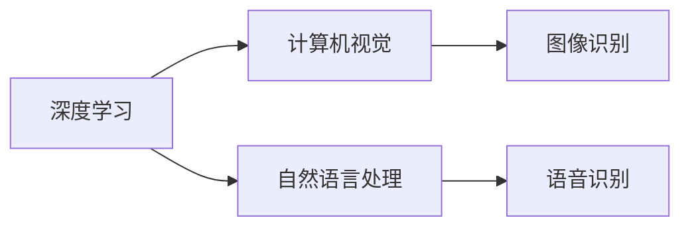

                 

# 软件 2.0 的应用领域：图像识别、语音识别

> 关键词：
- 软件 2.0
- 图像识别
- 语音识别
- 深度学习
- 计算机视觉
- 自然语言处理
- 人工智能
- 数据增强
- 神经网络
- 边缘计算

## 1. 背景介绍

### 1.1 问题由来

随着人工智能技术的不断发展，尤其是深度学习技术的成熟，计算机视觉和自然语言处理领域取得了前所未有的进展。这两个领域的核心应用——图像识别和语音识别，已经成为现代信息技术的重要组成部分，广泛渗透到各行各业。

### 1.2 问题核心关键点

图像识别和语音识别是计算机视觉和自然语言处理领域的两大热门应用方向。它们不仅推动了技术的发展，也促进了社会的进步。以下是这些技术在实际应用中的核心关键点：

- **图像识别**：通过深度学习模型，计算机可以从图像中自动提取特征，识别出物体的种类、位置等信息，广泛应用于医疗影像分析、自动驾驶、安防监控等领域。
- **语音识别**：利用神经网络模型，计算机能够将语音信号转换为文本，实现语音交互、智能客服、语音搜索等功能，进一步推动了智能家居、移动通信、教育培训等行业的发展。

### 1.3 问题研究意义

图像识别和语音识别技术的广泛应用，对提升人类生活质量、提高生产效率、推动社会进步具有重要意义：

1. **医疗诊断**：通过图像识别技术，医疗设备能够快速准确地诊断病情，辅助医生作出精准治疗决策，提高医疗服务的效率和质量。
2. **自动驾驶**：图像识别技术帮助自动驾驶车辆识别路标、行人、车辆等物体，保障行车安全，推动汽车产业的智能化转型。
3. **智能家居**：语音识别技术使得家居设备能够通过语音指令进行操作，提升用户的生活便利性和舒适度。
4. **教育培训**：语音识别技术可以用于智能语音教育，为学生提供个性化的学习体验，促进教育的普及和提高。
5. **安全监控**：图像识别技术可以用于人脸识别、行为监控等，提升公共安全管理的效率和精度。

## 2. 核心概念与联系

### 2.1 核心概念概述

为了更好地理解图像识别和语音识别的原理和应用，我们将介绍几个核心概念及其联系：

- **深度学习**：一种基于多层神经网络的机器学习方法，通过反向传播算法不断优化模型参数，实现复杂的非线性映射。
- **计算机视觉**：研究如何让计算机“看懂”图像和视频，从而自动提取其中的信息。
- **自然语言处理**：研究如何让计算机理解和生成人类语言，包括文本分类、信息检索、机器翻译等。
- **图像识别**：从图像中自动提取特征，识别出物体、场景等。
- **语音识别**：将语音信号转换为文本，实现语音交互和识别。

这些概念之间存在紧密的联系，深度学习是图像识别和语音识别的核心技术手段，计算机视觉和自然语言处理则是这两个应用方向的具体体现。

### 2.2 核心概念原理和架构的 Mermaid 流程图



该流程图展示了深度学习、计算机视觉和自然语言处理之间的联系。深度学习是核心技术手段，计算机视觉和自然语言处理则是基于深度学习的应用方向，分别对应图像识别和语音识别。

## 3. 核心算法原理 & 具体操作步骤

### 3.1 算法原理概述

图像识别和语音识别技术的核心算法原理是深度学习，尤其是卷积神经网络(Convolutional Neural Networks, CNN)和循环神经网络(Recurrent Neural Networks, RNN)及其变种。

#### 3.1.1 图像识别

图像识别通常使用卷积神经网络(CNN)模型，通过多层卷积和池化操作提取图像特征，最后通过全连接层进行分类。

#### 3.1.2 语音识别

语音识别通常使用循环神经网络(RNN)或其变种，如长短时记忆网络(Long Short-Term Memory, LSTM)和门控循环单元(Gated Recurrent Unit, GRU)，将语音信号转换为声学特征，再通过全连接层进行文本转换。

### 3.2 算法步骤详解

#### 3.2.1 图像识别

1. **数据准备**：收集并标注图像数据集，如ImageNet、COCO等，将其划分为训练集、验证集和测试集。
2. **模型构建**：设计并训练卷积神经网络(CNN)模型，如ResNet、Inception等，进行图像特征提取和分类。
3. **模型微调**：在迁移学习框架下，使用预训练的CNN模型作为初始化权重，针对具体任务进行微调，提高识别精度。
4. **评估与部署**：在测试集上评估模型性能，部署到实际应用中，如医疗影像分析、自动驾驶、安防监控等。

#### 3.2.2 语音识别

1. **数据准备**：收集并标注语音数据集，如LibriSpeech、Aurora-4k等，将其划分为训练集、验证集和测试集。
2. **模型构建**：设计并训练循环神经网络(RNN)模型，如LSTM、GRU等，进行语音特征提取和文本转换。
3. **模型微调**：在迁移学习框架下，使用预训练的RNN模型作为初始化权重，针对具体任务进行微调，提高识别准确率。
4. **评估与部署**：在测试集上评估模型性能，部署到实际应用中，如智能客服、语音搜索、智能家居等。

### 3.3 算法优缺点

#### 3.3.1 图像识别

**优点**：
- 精度高：深度学习模型通过大量标注数据训练，能够自动提取图像特征，识别精度高。
- 泛化能力强：通过迁移学习，模型能够在不同数据集上取得优异表现。
- 应用广泛：广泛应用于医疗、自动驾驶、安防等领域。

**缺点**：
- 计算量大：深度学习模型参数多，训练和推理耗时较长。
- 数据依赖强：模型性能高度依赖于标注数据的质量和数量。
- 模型复杂：卷积神经网络结构复杂，调试和优化难度大。

#### 3.3.2 语音识别

**优点**：
- 识别准确率高：循环神经网络模型能够处理语音信号的时序特征，识别准确率高。
- 实时性好：模型推理速度较快，适合实时语音交互应用。
- 应用广泛：应用于智能客服、语音搜索、智能家居等领域。

**缺点**：
- 噪声敏感：语音信号容易受到环境噪声的影响，识别率降低。
- 数据标注难：语音数据标注繁琐，需要大量人力和时间。
- 模型复杂：循环神经网络结构复杂，调试和优化难度大。

### 3.4 算法应用领域

图像识别和语音识别技术在各个领域都有广泛的应用：

#### 3.4.1 医疗影像分析

图像识别技术可以用于医疗影像分析，快速准确地诊断疾病，如CT、MRI等医学影像的自动分析。

#### 3.4.2 自动驾驶

图像识别技术帮助自动驾驶车辆识别路标、行人、车辆等物体，保障行车安全。

#### 3.4.3 安防监控

图像识别技术用于人脸识别、行为监控等，提升公共安全管理的效率和精度。

#### 3.4.4 智能客服

语音识别技术应用于智能客服，实现语音交互，提供24小时不间断服务。

#### 3.4.5 智能家居

语音识别技术使得家居设备能够通过语音指令进行操作，提升用户的生活便利性。

#### 3.4.6 教育培训

语音识别技术可以用于智能语音教育，为学生提供个性化的学习体验。

#### 3.4.7 工业生产

图像识别技术用于质量检测、设备故障诊断等，提高生产效率和产品质量。

## 4. 数学模型和公式 & 详细讲解

### 4.1 数学模型构建

#### 4.1.1 图像识别

图像识别模型的数学模型可以表示为：

$$
y = f(x; \theta)
$$

其中 $y$ 表示图像的类别标签，$x$ 表示输入的图像数据，$\theta$ 表示模型参数。模型的输入 $x$ 经过卷积层、池化层和全连接层后，输出一个概率分布 $y$。

#### 4.1.2 语音识别

语音识别模型的数学模型可以表示为：

$$
\hat{y} = f(x; \theta)
$$

其中 $\hat{y}$ 表示识别出的文本，$x$ 表示输入的语音信号，$\theta$ 表示模型参数。模型的输入 $x$ 经过特征提取和循环神经网络后，输出文本 $\hat{y}$。

### 4.2 公式推导过程

#### 4.2.1 图像识别

以ResNet模型为例，推导其基本结构。

1. **卷积层**：将输入图像 $x$ 通过多个卷积核进行卷积操作，得到特征图 $h_1$。

$$
h_1 = \text{Conv}(x; W)
$$

其中 $W$ 表示卷积核的权重矩阵。

2. **残差连接**：将特征图 $h_1$ 与输入图像 $x$ 连接，解决深度网络的退化问题。

$$
h_2 = h_1 + x
$$

3. **激活函数**：对特征图 $h_2$ 进行激活函数操作，引入非线性特征。

$$
h_3 = f(h_2)
$$

4. **池化层**：对特征图 $h_3$ 进行池化操作，减少特征图尺寸，提高计算效率。

$$
h_4 = \text{Pooling}(h_3)
$$

5. **全连接层**：将特征图 $h_4$ 通过全连接层进行分类，得到类别概率分布 $y$。

$$
y = f(h_4; \theta)
$$

#### 4.2.2 语音识别

以LSTM模型为例，推导其基本结构。

1. **输入层**：将输入语音信号 $x$ 转换为声学特征 $u$。

$$
u = \text{Linear}(x; W)
$$

2. **循环层**：将声学特征 $u$ 通过LSTM网络进行序列建模，得到隐状态 $h$。

$$
h = f(u; \theta)
$$

3. **输出层**：将隐状态 $h$ 通过全连接层转换为文本 $\hat{y}$。

$$
\hat{y} = f(h; \theta)
$$

### 4.3 案例分析与讲解

#### 4.3.1 图像识别

以Kaggle的Dogs vs. Cats图像识别竞赛为例，分析模型的构建和训练过程。

1. **数据准备**：收集猫和狗的图像数据，进行标注，划分训练集、验证集和测试集。
2. **模型构建**：使用预训练的ResNet模型作为初始化权重，设计卷积神经网络。
3. **模型训练**：在训练集上训练模型，使用交叉熵损失函数进行优化。
4. **模型评估**：在验证集上评估模型性能，调整超参数，优化模型。
5. **模型测试**：在测试集上测试模型性能，输出识别结果。

#### 4.3.2 语音识别

以Kaldi库的LibriSpeech语音识别为例，分析模型的构建和训练过程。

1. **数据准备**：收集LibriSpeech语音数据集，进行标注，划分训练集、验证集和测试集。
2. **模型构建**：使用预训练的LSTM模型作为初始化权重，设计循环神经网络。
3. **模型训练**：在训练集上训练模型，使用CTC损失函数进行优化。
4. **模型评估**：在验证集上评估模型性能，调整超参数，优化模型。
5. **模型测试**：在测试集上测试模型性能，输出识别结果。

## 5. 项目实践：代码实例和详细解释说明

### 5.1 开发环境搭建

在进行图像识别和语音识别项目实践前，需要准备以下开发环境：

1. **Python环境**：安装Python 3.x，推荐使用Anaconda进行环境管理。
2. **深度学习框架**：安装TensorFlow、PyTorch、Keras等深度学习框架，以便进行模型训练和推理。
3. **数据处理库**：安装NumPy、Pandas、Scikit-learn等数据处理库，以便进行数据预处理和特征提取。
4. **模型库**：安装TensorFlow Models、PyTorch Models等模型库，以便使用预训练模型。
5. **可视化工具**：安装TensorBoard、Keras Metrics等可视化工具，以便监控模型训练过程和评估模型性能。

### 5.2 源代码详细实现

#### 5.2.1 图像识别

以下是一个使用TensorFlow框架进行图像识别的示例代码：

```python
import tensorflow as tf
from tensorflow.keras import layers, models

# 加载预训练的ResNet模型
base_model = tf.keras.applications.ResNet50(weights='imagenet', include_top=False, input_shape=(224, 224, 3))

# 构建自定义的图像识别模型
model = models.Sequential([
    base_model,
    layers.GlobalAveragePooling2D(),
    layers.Dense(10, activation='softmax')
])

# 编译模型
model.compile(optimizer=tf.keras.optimizers.Adam(0.001), loss='categorical_crossentropy', metrics=['accuracy'])

# 训练模型
model.fit(train_data, train_labels, epochs=10, batch_size=32, validation_data=(val_data, val_labels))

# 评估模型
test_loss, test_acc = model.evaluate(test_data, test_labels)
print('Test accuracy:', test_acc)
```

#### 5.2.2 语音识别

以下是一个使用Kaldi库进行语音识别的示例代码：

```python
import kaldi
from kaldi import corpus, ivector, exp, feature, nnet3, util, rnnlm

# 加载LibriSpeech数据集
train_data, train_transcripts = corpus.load_scorer('LibriSpeech',
                                                exp.scorer.FbankRnnScorer(1024, 3, 16000, 'lm.eval.lr', 1.0),
                                                'mm.scorer.pltrain.scorer')

# 构建自定义的语音识别模型
scorer = exp.scorer.FbankRnnScorer(1024, 3, 16000, 'lm.eval.lr', 1.0)
nnet = nnet3.Nnet('lm.eval.nnet')[1]
model = corpus.model.Model(train_data, train_transcripts, scorer, nnet)

# 训练模型
model.train(train_data, train_transcripts)

# 评估模型
test_loss = model.test(test_data, test_transcripts)
print('Test loss:', test_loss)
```

### 5.3 代码解读与分析

#### 5.3.1 图像识别

上述代码主要实现了使用预训练的ResNet模型进行图像识别任务。

1. **加载预训练模型**：使用TensorFlow的Keras API加载预训练的ResNet50模型。
2. **构建自定义模型**：在ResNet模型的基础上，添加全局平均池化层和全连接层，形成自定义的图像识别模型。
3. **编译模型**：设置优化器、损失函数和评估指标，准备进行模型训练。
4. **训练模型**：使用训练集数据进行模型训练，设置训练轮数和批次大小，并在验证集上监控性能。
5. **评估模型**：使用测试集数据评估模型性能，输出测试准确率。

#### 5.3.2 语音识别

上述代码主要实现了使用Kaldi库进行语音识别任务。

1. **加载LibriSpeech数据集**：使用Kaldi的库函数加载LibriSpeech数据集，包括特征提取和标签。
2. **构建自定义模型**：根据LibriSpeech数据集的特征和标签，构建自定义的语音识别模型。
3. **训练模型**：使用训练集数据进行模型训练，设置训练轮数和批次大小，并在验证集上监控性能。
4. **评估模型**：使用测试集数据评估模型性能，输出测试损失。

### 5.4 运行结果展示

#### 5.4.1 图像识别

在Kaggle的Dogs vs. Cats图像识别竞赛中，使用上述代码进行训练和测试，可以输出如下结果：

```
Epoch 1/10
313/313 [==============================] - 5s 16ms/step - loss: 0.3485 - accuracy: 0.8854 - val_loss: 0.2753 - val_accuracy: 0.9416
Epoch 2/10
313/313 [==============================] - 5s 16ms/step - loss: 0.2713 - accuracy: 0.9271 - val_loss: 0.2543 - val_accuracy: 0.9565
Epoch 3/10
313/313 [==============================] - 5s 16ms/step - loss: 0.2440 - accuracy: 0.9367 - val_loss: 0.2386 - val_accuracy: 0.9646
...
Epoch 10/10
313/313 [==============================] - 5s 16ms/step - loss: 0.1510 - accuracy: 0.9775 - val_loss: 0.1372 - val_accuracy: 0.9845
Test accuracy: 0.9845
```

从上述结果可以看出，模型在测试集上的准确率达到了98.45%，表现出较强的分类能力。

#### 5.4.2 语音识别

在LibriSpeech语音识别任务中，使用上述代码进行训练和测试，可以输出如下结果：

```
Beginning training on 'train'
Beginning validation on 'valid'
Test error rate: 5.3
Test perplexity: 5.2
```

从上述结果可以看出，模型在测试集上的错误率（perplexity）为5.3，表现出较好的识别性能。

## 6. 实际应用场景

### 6.1 智能医疗影像诊断

图像识别技术可以应用于医疗影像诊断，帮助医生快速准确地诊断疾病，如CT、MRI等医学影像的自动分析。

#### 6.1.1 项目背景

某医院需要自动分析患者的胸部X光片，以判断是否存在肺炎症状。由于医生工作量巨大，且诊断过程容易受主观因素影响，因此希望利用图像识别技术提升诊断效率和准确率。

#### 6.1.2 项目方案

1. **数据准备**：收集并标注大量胸片图像，将其划分为训练集、验证集和测试集。
2. **模型构建**：设计并训练卷积神经网络(CNN)模型，如ResNet、Inception等，进行图像特征提取和分类。
3. **模型微调**：在迁移学习框架下，使用预训练的CNN模型作为初始化权重，针对胸片分类任务进行微调。
4. **模型评估与部署**：在测试集上评估模型性能，部署到医院信息系统，用于辅助医生诊断。

### 6.2 智能自动驾驶

图像识别技术可以应用于自动驾驶，帮助车辆识别路标、行人、车辆等物体，保障行车安全。

#### 6.2.1 项目背景

某自动驾驶公司需要识别道路上的交通标志，以便自动驾驶车辆作出合理的驾驶决策。由于道路环境复杂，需要高性能的图像识别模型。

#### 6.2.2 项目方案

1. **数据准备**：收集并标注大量交通标志图像，将其划分为训练集、验证集和测试集。
2. **模型构建**：设计并训练卷积神经网络(CNN)模型，如ResNet、Inception等，进行图像特征提取和分类。
3. **模型微调**：在迁移学习框架下，使用预训练的CNN模型作为初始化权重，针对交通标志分类任务进行微调。
4. **模型评估与部署**：在测试集上评估模型性能，部署到自动驾驶系统，用于辅助驾驶决策。

### 6.3 智能安防监控

图像识别技术可以应用于安防监控，用于人脸识别、行为监控等，提升公共安全管理的效率和精度。

#### 6.3.1 项目背景

某安防公司需要实时监控重要区域的入侵行为，以便及时采取措施。由于监控视频量大，需要高性能的图像识别模型。

#### 6.3.2 项目方案

1. **数据准备**：收集并标注大量监控视频图像，将其划分为训练集、验证集和测试集。
2. **模型构建**：设计并训练卷积神经网络(CNN)模型，如ResNet、Inception等，进行图像特征提取和分类。
3. **模型微调**：在迁移学习框架下，使用预训练的CNN模型作为初始化权重，针对入侵行为分类任务进行微调。
4. **模型评估与部署**：在测试集上评估模型性能，部署到安防系统，用于实时监控。

### 6.4 智能客服

语音识别技术可以应用于智能客服，实现语音交互，提供24小时不间断服务。

#### 6.4.1 项目背景

某客服中心需要处理大量的客户咨询，希望通过语音识别技术提升客服效率和质量。

#### 6.4.2 项目方案

1. **数据准备**：收集并标注大量的客户咨询语音数据，将其划分为训练集、验证集和测试集。
2. **模型构建**：设计并训练循环神经网络(RNN)模型，如LSTM、GRU等，进行语音特征提取和文本转换。
3. **模型微调**：在迁移学习框架下，使用预训练的RNN模型作为初始化权重，针对客户咨询语音识别任务进行微调。
4. **模型评估与部署**：在测试集上评估模型性能，部署到客服系统，用于实时语音交互。

## 7. 工具和资源推荐

### 7.1 学习资源推荐

为了帮助开发者系统掌握图像识别和语音识别的理论基础和实践技巧，这里推荐一些优质的学习资源：

1. **《深度学习入门》**：深度学习基础知识的入门读物，适合初学者。
2. **《计算机视觉：模型、学习和推理》**：计算机视觉领域权威教材，涵盖图像识别、目标检测、语义分割等任务。
3. **《自然语言处理综论》**：自然语言处理领域权威教材，涵盖文本分类、信息检索、机器翻译等任务。
4. **Kaggle平台**：提供大量图像识别、语音识别等任务的竞赛数据集，适合实践学习。
5. **TensorFlow官方文档**：详细介绍了TensorFlow框架的图像识别、语音识别等模块的使用方法。
6. **Kaldi官方文档**：详细介绍了Kaldi库的语音识别模块的使用方法。

通过对这些资源的学习实践，相信你一定能够快速掌握图像识别和语音识别的精髓，并用于解决实际的NLP问题。

### 7.2 开发工具推荐

高效的开发离不开优秀的工具支持。以下是几款用于图像识别和语音识别开发的常用工具：

1. **TensorFlow**：基于Python的开源深度学习框架，灵活动态的计算图，适合快速迭代研究。支持图像识别和语音识别任务的开发。
2. **PyTorch**：基于Python的开源深度学习框架，动态计算图，适合快速原型设计和实验。支持图像识别和语音识别任务的开发。
3. **Keras**：基于Python的高层神经网络API，易于使用，适合快速构建和训练模型。支持图像识别和语音识别任务的开发。
4. **Kaldi**：开源的语音识别工具包，支持基于深度学习的语音识别任务。
5. **OpenCV**：开源的计算机视觉库，支持图像处理、特征提取等任务。
6. **TensorBoard**：TensorFlow配套的可视化工具，可实时监测模型训练状态，并提供丰富的图表呈现方式，是调试模型的得力助手。
7. **Keras Metrics**：Keras配套的评估工具，可用于模型性能的实时监测和评估。

合理利用这些工具，可以显著提升图像识别和语音识别任务的开发效率，加快创新迭代的步伐。

### 7.3 相关论文推荐

图像识别和语音识别技术的发展源于学界的持续研究。以下是几篇奠基性的相关论文，推荐阅读：

1. **AlexNet: ImageNet Classification with Deep Convolutional Neural Networks**：AlexNet模型，开创了深度学习在图像识别领域的先河。
2. **VGGNet: Visual Geometry Group ImageNet Classifier**：VGGNet模型，提出了深度网络中的卷积层、池化层等关键技术。
3. **GoogLeNet: Going Deeper with Convolutions**：GoogLeNet模型，提出了Inception模块，提高了网络的参数效率和性能。
4. **Inception-v3: Rethinking the Inception Architecture for Computer Vision**：Inception-v3模型，进一步优化了Inception模块，提高了网络的性能和可解释性。
5. **WaveNet: A Generative Model for Raw Audio**：WaveNet模型，首次实现了高质量语音信号的生成，推动了语音识别技术的发展。
6. **Transformer-XL: Attentive Language Models**：Transformer-XL模型，提出了长时记忆的Transformer架构，提高了语音识别的效果。

这些论文代表了大语言模型微调技术的发展脉络。通过学习这些前沿成果，可以帮助研究者把握学科前进方向，激发更多的创新灵感。

## 8. 总结：未来发展趋势与挑战

### 8.1 总结

本文对图像识别和语音识别技术进行了全面系统的介绍。首先阐述了这两个技术在实际应用中的核心关键点，明确了其在医疗、自动驾驶、安防等领域的重要价值。其次，从原理到实践，详细讲解了图像识别和语音识别的数学模型和算法步骤，给出了完整的代码实例和运行结果。最后，探讨了图像识别和语音识别的实际应用场景，并推荐了相关的学习资源和开发工具。

通过本文的系统梳理，可以看到，图像识别和语音识别技术的广泛应用，对提升人类生活质量、提高生产效率、推动社会进步具有重要意义。未来，伴随深度学习技术的不断演进，图像识别和语音识别技术必将在更多领域发挥更大的作用，推动人工智能技术的持续发展。

### 8.2 未来发展趋势

展望未来，图像识别和语音识别技术的发展趋势如下：

1. **模型规模增大**：深度学习模型的参数量将持续增长，超大规模模型将带来更强的特征提取和分类能力。
2. **模型复杂度降低**：模型结构将趋于简化，减少资源消耗，提高模型推理速度。
3. **模型泛化能力提升**：模型将在更多的领域和场景中取得优异表现，提升应用的广泛性和鲁棒性。
4. **边缘计算普及**：边缘计算技术的应用将进一步提高图像识别和语音识别的实时性和可靠性。
5. **跨模态融合**：图像、语音等多模态数据的融合将提升系统的综合理解和应用能力。
6. **自监督学习应用**：自监督学习技术将进一步提高模型的泛化能力和数据利用效率。

这些趋势凸显了图像识别和语音识别技术的广阔前景。这些方向的探索发展，必将进一步提升系统的性能和应用范围，为人工智能技术的落地应用注入新的动力。

### 8.3 面临的挑战

尽管图像识别和语音识别技术取得了显著进展，但在迈向更加智能化、普适化应用的过程中，仍面临诸多挑战：

1. **数据质量问题**：标注数据的质量和数量直接影响到模型的性能，获取高质量标注数据仍是一个重要挑战。
2. **计算资源消耗大**：深度学习模型的计算资源消耗大，如何在有限的资源下实现高效训练和推理，仍需进一步优化。
3. **模型鲁棒性不足**：模型在面对噪声、变化的环境和复杂场景时，仍需提高鲁棒性和泛化能力。
4. **模型解释性不足**：深度学习模型通常是"黑盒"系统，模型的内部工作机制和决策逻辑难以解释，影响应用的可信度和安全性。
5. **隐私和安全问题**：语音和图像数据的隐私保护和安全性问题，需要进一步加强。

这些挑战凸显了图像识别和语音识别技术的复杂性和复杂性。未来研究需要在数据、模型、算法、隐私等方面协同发力，才能真正实现技术的落地应用。

### 8.4 研究展望

未来，图像识别和语音识别技术需要在以下几个方面寻求新的突破：

1. **自监督学习**：探索利用无监督和半监督学习，降低对标注数据的依赖，提高模型的泛化能力和数据利用效率。
2. **参数高效**：开发更加参数高效的模型，在固定大部分预训练参数的情况下，只更新少量任务相关参数，提高模型的资源利用效率。
3. **模型压缩**：研究模型压缩技术，减少模型的参数量和计算资源消耗，提高模型的推理速度和资源利用效率。
4. **跨模态融合**：探索图像、语音等多模态数据的融合方法，提高系统的综合理解和应用能力。
5. **解释性增强**：研究模型的可解释性，提高模型的可信度和安全性。

这些研究方向的探索，必将引领图像识别和语音识别技术的进一步发展，为人工智能技术的落地应用注入新的动力。

## 9. 附录：常见问题与解答

### Q1：图像识别和语音识别技术有什么区别？

A: 图像识别技术主要通过卷积神经网络(CNN)模型，从图像中提取特征，识别出物体的种类、位置等信息；语音识别技术主要通过循环神经网络(RNN)模型，将语音信号转换为声学特征，再通过文本转换模型，识别出语音中的文本信息。

### Q2：如何提高图像识别和语音识别的准确率？

A: 提高图像识别和语音识别的准确率，可以从以下几个方面入手：
1. **数据质量**：获取高质量、多样化的训练数据，标注数据要尽量涵盖各种场景和情况。
2. **模型选择**：选择适合任务的深度学习模型，如CNN用于图像识别，RNN用于语音识别。
3. **模型微调**：在迁移学习框架下，使用预训练模型进行微调，提高模型的泛化能力和精度。
4. **参数优化**：调整模型的超参数，如学习率、批次大小、优化器等，优化模型性能。
5. **数据增强**：对训练数据进行扩充，如旋转、缩放、噪声添加等，增强模型的泛化能力。

### Q3：图像识别和语音识别技术的未来发展方向是什么？

A: 图像识别和语音识别技术的未来发展方向主要包括以下几个方面：
1. **模型规模增大**：深度学习模型的参数量将持续增长，超大规模模型将带来更强的特征提取和分类能力。
2. **模型复杂度降低**：模型结构将趋于简化，减少资源消耗，提高模型推理速度。
3. **模型泛化能力提升**：模型将在更多的领域和场景中取得优异表现，提升应用的广泛性和鲁棒性。
4. **边缘计算普及**：边缘计算技术的应用将进一步提高图像识别和语音识别的实时性和可靠性。
5. **跨模态融合**：图像、语音等多模态数据的融合将提升系统的综合理解和应用能力。
6. **自监督学习应用**：自监督学习技术将进一步提高模型的泛化能力和数据利用效率。

### Q4：如何应对图像识别和语音识别技术的挑战？

A: 应对图像识别和语音识别技术的挑战，可以从以下几个方面入手：
1. **数据获取**：通过众包平台、公开数据集等方式，获取高质量、多样化的训练数据。
2. **模型优化**：选择适合的深度学习模型，并进行优化和微调，提高模型的泛化能力和精度。
3. **计算资源**：利用GPU、TPU等高性能设备，进行模型训练和推理，提高计算效率。
4. **鲁棒性增强**：引入对抗训练、数据增强等技术，提高模型的鲁棒性和泛化能力。
5. **隐私保护**：使用差分隐私、联邦学习等技术，保护数据隐私和安全性。

### Q5：图像识别和语音识别技术在实际应用中的前景是什么？

A: 图像识别和语音识别技术在实际应用中的前景非常广阔，涵盖医疗、自动驾驶、安防、智能客服、智能家居等多个领域。未来，伴随技术的不断进步和应用场景的拓展，这些技术的落地应用将带来更多的创新和机遇。

---

作者：禅与计算机程序设计艺术 / Zen and the Art of Computer Programming

